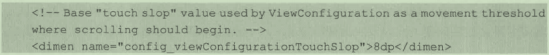

> version：2022/4/12
>
> review：

> 序：要系统性的掌握View相关的知识，这些基本概念必须牢牢掌握。

### 一、View的位置

View的位置主要由其四个顶点决定，对应四个属性：

mLeft、mTop、mRight、mBottom（**单位是像素**），即：

左上角横坐标，左上角纵坐标，右下角横坐标、右下角纵坐标。获取方式是

getLeft()、getTop()、getRight()、getBottom()。

> 注意：这几个位置都是相对于其父容器的。

在Android坐标系中，View的坐标和父容器的关系如下：

和View大小（宽高、width/height）的关系：

> width = right - left
>
> height = bottom - top

从 Android 3.0开始，新增属性：x、y、translationX、translationY，也都有其get/set方法。

x、y是View的左上角坐标；

translationX、translationY是View左上角相对于父容器的偏移量。translationX和translationY的默认值为0；

这几个参数的关系为：

> x = left + translationX
>
> y = top + translationY

> 注意：
>
> 1、这几个参数也是相对于其父容器的。
>
> 2、View在平移的过程中，top和left表示的是原始左上角的位置信息，其值不会发生改变。此时发生改变的是x、y、translationX、translationY四个参数。

### 二、View的大小

View的大小用width和height表示。

getWidth()和getHeight()获取的是View当前真正的宽高。

getMeasuredWidth()和getMeasuredHeight()是View希望父View测量的宽高。

getWidth()和getMeasuredWidth()的值不一定相等。

> 这部分还要去看看View的注释，可以去官网看。

### 三、MotionEvent

当触摸屏幕时，会产生一系列事件，这些事件是由 MotionEvent 构成的。主要有如下几种（思考：还有其他的吗）：

- ACTION_DOWN —— 手指刚接触屏幕；
- ACTION_MOVE —— 手指在屏幕上移动；
- ACTION_UP —— 手指从屏幕上抬起。

常见的触屏事件序列有：

- 点击后抬起（单击），事件序列为 DOWN -> UP。
- 点击后滑动再抬起，事件序列为 DOWN -> MOVE -> ... -> MOVE -> UP。

MotionEvent 是系统为触屏事件所封装的一个类，通过 MotionEvent 对象可以得到点击事件发送的 x 和 y 坐标，系统提供了两组方法方法：getX/getY 和 getRawX/getRawY，它们的区别是 getX/getY 获取的是相对于当前 View 左上角的 x 和 y 坐标，而 getRawX/getRawY 获取的是相对于手机屏幕左上角的 x 和 y 坐标。

### 四、TouchSlop

TouchSlop 是系统认定为滑动的最小距离（是系统定义的一个常量），也就是说，当手指在屏幕上移动时，如果两次滑动之间的距离小于这个值，那么系统就认为这不是滑动。这个值跟设备有关，不同设备上这个值可能不同，可以通过 ViewConfiguration.get(getContext()).getScaledTouchSlop() 获取。这个值定义在 frameworks/base/core/res/res/values/config.xml 文件中：

它的作用是，当我们处理滑动时，可以利用这个常量来做一些过滤，比如两次滑动事件的滑动距离小于这个值，就可以认为未达到滑动距离的临界值，可以认为它不是滑动，这个可以有更好的用户体验。

> 思考：
>
> 我在使用有些APP看视频的时候就有过这样的体验：操作上划时，可能是手指水平移动的距离有些多，导致直接切换到水平的另一个页面去了，而不是滑到下一个视频。不过这个case好像也不需要用到这个常量，使用始末的两个坐标来判断是上滑意图还是水平滑动应该就可以了。

### 五、VelocityTracker

速度追踪，用于追踪手指在滑动过程中的速度，包括水平和竖直方向的速度。在 View 的 onTouchEvent 方法中追踪当前单击事件的速度：

### 六、GestureDetector

### 七、Scroller

