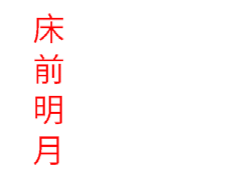
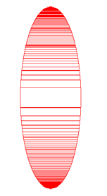
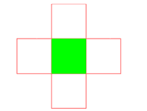

> 绘图基础分2篇：
>
> 绘图基础：包括Paint、Canvas
>
> 绘图基础2：包括Rect与RectF、Color、文字、Region。

# Color

前面提到，除手动组合颜色的方法以外，系统还提供了一个专门用来解析颜色的类：Color。Color 是 Android 中与颜色处理有关的类。

## 常量颜色

首先，它定义了很多常量的颜色值，我们可以直接使用。

```kotlin
int BLACK 
int BLUE 
int CYAN 
int DKGRAY 
int GRAY 
int GREEN 
int LTGRAY 
int MAGENTA 
int RED 
int TRANSPARENT 
int WHITE 
int YELLOW
```

可以通过 Color.XXX 来直接使用这些颜色，比如红色，在代码中可以直接使用 Color.RED。

## 构造颜色

### 带有透明度的颜色

static int argb(int alpha, int red, int green, int blue) 

这个函数允许我们分别传入 A、R、G、B 4 个色彩分量，然后合并成一个色彩。其中，alpha、red、green、blue 4 个色彩分量的取值范围都是 0～255。

我们来看一下 argb()函数的具体实现源码，如下：

```kotlin
public static int argb(int alpha, int red, int green, int blue) { 
 return (alpha << 24) | (red << 16) | (green << 8) | blue; 
}
```

其中，<<是向左位移符号，表示将指定的二进制数字向左位移多少位。比如，二进制的 110 向左移一位之后的结果为 1100。

比如，alpha << 24 表示向左位移 24 位。我们知道，一个色彩值对应的取值范围是 0～255，所以每个色彩值对应二进制的 8 位，比如 alpha 的取值为 255，它的二进制表示就是 11111111（8 个 1）。

所以，alpha << 24 的结果为 11111111 00000000 00000000 00000000。

同样，如果我们构造的是一个白色，那么 A、R、G、B 各个分量的值都是 255，当它们对应位移之后的结果如下。

- alpha << 24：11111111 00000000 00000000 00000000 
- red << 16：00000000 11111111 00000000 00000000 
- green << 8：00000000 00000000 11111111 00000000 
- blue：00000000 00000000 00000000 11111111

利用“|”（二进制的或运算）将各个二进制的值合并之后的结果就是 11111111 11111111 11111111 11111111，分别对应 A、R、G、B 分量。这就是各个分量最终合成对应颜色值的过程。在读代码时，有时会看到直接利用(alpha << 24) | (red << 16) | (green << 8) | blue 来合成对应颜色值的情况，其实跟我们使用 Color.argb()函数来合成的结果是一样的。

### 不带透明度的颜色

static int rgb(int red, int green, int blue) 

其实跟上面的构造函数是一样的，只是不允许指定 alpha 值，alpha 值取 255（完全不透明）。

## 提取颜色分量

不仅能通过 Color 类来合并颜色分量，而且能从一个颜色中提取出指定的颜色分量。

```kotlin
static int alpha(int color) 
static int red(int color) 
static int green(int color) 
static int blue(int color)
```

可以通过上面的 4 个函数提取出对应的 A、R、G、B 颜色分量。

```kotlin
int green = Color.green(0xFF000F00); 
```

得到的结果 green 的值就是 0x0F。

# 文字

## Paint设置

Paint 与文字相关的设置方法有如下几个。

```kotlin
//普通设置 
paint.setStrokeWidth (5); //设置画笔宽度 
paint.setAntiAlias(true); //指定是否使用抗锯齿功能。如果使用，则会使绘图速度变慢 
paint.setStyle(Paint.Style.FILL); //绘图样式，对于文字和几何图形都有效 
paint.setTextAlign(Align.CENTER); //设置文字对齐方式，取值为 Align.CENTER、
 //Align.LEFT 或 Align.RIGHT 
paint.setTextSize(12); //设置文字大小 
 
//样式设置 
paint.setFakeBoldText(true); //设置是否为粗体文字 
paint.setUnderlineText(true); //设置下画线 
paint.setTextSkewX((float) -0.25); //设置字体水平倾斜度，普通斜体字设为-0.25 
paint.setStrikeThruText(true); //设置带有删除线效果 
 
//其他设置 
paint.setTextScaleX(2); //只会将水平方向拉伸，高度不会变
```

我们逐个来看各个函数的用法。

### 1．填充样式的区别

前面说过，paint.setStyle()函数对文字和几何图形都有效。下面就来看看不同的填充样式对文字的影响

```kotlin
Paint paint=new Paint(); 
paint.setColor(Color.RED); //设置画笔颜色
paint.setStrokeWidth (5); //设置画笔宽度
paint.setAntiAlias(true); //指定是否使用抗锯齿功能。如果使用，则会使绘图速度变慢
paint.setTextSize(30); //设置文字大小
//绘图样式，设置为填充
paint.setStyle(Paint.Style.FILL); 
canvas.drawText("床前明月光", 10,100, paint);
```

依据这段代码，在不同填充模式下的效果如下图所示。 


### 2．setTextAlign()函数

public void setTextAlign(Align align) 

用于设置所要绘制的字符串与起始点的相对位置。参数 Align align 的取值如下。

- Align.LEFT：居左绘制，即通过 drawText()函数指定的起始点在最左侧，文字从起始点位置开始绘制。
- Align.CENTER：居中绘制，即通过 drawText()函数指定的起始点在文字中间位置。
- Align.RIGHT：居右绘制，即通过 drawText()函数指定的起始点在文字右侧位置。

示例：

```kotlin
Paint paint=new Paint(); 
paint.setColor(Color.RED); 
paint.setStrokeWidth (5); 
paint.setAntiAlias(true); 
paint.setTextSize(80); 
paint.setTextAlign(Paint.Align.RIGHT); 
canvas.drawText("床前明月光", 400,100, paint); 
```

在上面的代码中，起始点是(400,100)，当取不同的 Align 值时，结果如下图所示。


从效果图中可以看出，当居左对齐（Align.LEFT）时，整个字符串都在起始点(400,100)的右侧，也就是说，通过 drawText()函数指定的起始点(400,100)是居左的。同样，当居右对齐（Align.RIGHT）时，起始点也是居右的，也就是说，所有文字都在起始点(400,100)的左侧。

### 3．设置字体样式

1）常规设置

与字体样式设置有关的几个函数如下。

- void setFakeBoldText(boolean fakeBoldText) ：设置是否粗体。当取 true 时，表示是粗体。
- void setUnderlineText(boolean underlineText) ：是否显示文字下画线。当取 true 时，显示下画线。
- void setStrikeThruText(boolean strikeThruText) ：是否显示中间删除线。当取 true 时，显示中间删除线。

示例：

```kotlin
Paint paint=new Paint(); 
paint.setColor(Color.RED); 
paint.setTextSize(80); 
canvas.drawText("床前明月光", 10,100, paint); 
paint.setFakeBoldText(true); //设置粗体文字
paint.setUnderlineText(true); //设置下画线
paint.setStrikeThruText(true); //设置带有删除线效果
canvas.drawText("床前明月光", 10,250, paint);
```


我们先后写了两次，第一次没有任何的样式设置，第二次将所有的样式设置为 true，可以很明显地看出区别。

2）字体倾斜度设置

void setTextSkewX(float skewX) 

该函数用于设置字体倾斜度。参数 float skewX 的默认值是 0，取负值时文字向右倾斜，取正值时文字向左倾斜，Word 文档中倾斜字体的倾斜度是-0.25f。

示例：

```kotlin
Paint paint=new Paint(); 
paint.setColor(Color.RED); 
paint.setTextSize(80); 
//正常样式
canvas.drawText("床前明月光", 10,100, paint); 
//向右倾斜
paint.setTextSkewX(-0.25f); 
canvas.drawText("床前明月光", 10,200, paint); 
//向左倾斜
paint.setTextSkewX(0.25f); 
canvas.drawText("床前明月光", 10,300, paint);
```


从效果图中可以明显看出取不同倾斜度时的倾斜方向。

### 4．水平拉伸

void setTextScaleX(float scaleX) 

该函数用于在水平方向拉伸文字。参数 float scaleX 表示拉伸倍数，当取值为 1 时，表示不拉伸。默认为不拉伸。

```kotlin
Paint paint=new Paint(); 
paint.setColor(Color.RED); 
paint.setTextSize(80); 
//正常样式
canvas.drawText("床前明月光", 10,100, paint); 
//拉伸 2 倍
paint.setTextScaleX(2); 
canvas.drawText("床前明月光", 10,200, paint);
```


从效果图中可以看出，字体大小和字体间距是均匀拉伸的。在拉伸 2 倍以后，一个字所占的位置是原来两个字所占的位置。

## Canvas绘制文本

### 1．普通绘制

一般的绘制方法有下面几种。

- void drawText(String text, float x, float y, Paint paint) ：该函数可以指定起始点来绘制文字，上面各个示例中使用的都是这个函数，其中参数(x,y)就是起始点坐标。
- void drawText(CharSequence text, int start, int end, float x, float y, Paint paint) 
- void drawText(String text, int start, int end, float x, float y, Paint paint) 

后面两个函数通过指定字符串中字符的起始和终止位置截取字符串的一部分绘制，它允许我们指定 CharSequence 或者 String 类型的字符串。其他参数的含义如下。

- start：表示起始绘制字符所在字符串中的索引。
- end：表示结束绘制字符所在字符串中的索引。
- x,y：起始点坐标。

void drawText(char[] text, int index, int count, float x, float y, Paint paint) 该函数同样截取字符串的一部分绘制，但它只接受由绘制 char 类型的数组所组成的字符串。其他参数的含义如下。

- int index：指定起始绘制字符的位置。
- int count：指定从起始绘制字符开始绘制几个字符。
- x,y：起始点坐标。

示例：

```kotlin
Paint paint=new Paint(); 
paint.setColor(Color.RED); 
paint.setTextSize(80); 
canvas.drawText("床前明月光",2,4, 10,100, paint);
```


很明显，这里使用的函数是 drawText(String text, int start, int end, float x, float y, Paint paint)。在代码中，我们指定起始字符的索引是 2，结束字符的索引是 4，也就是截取“明月”两个字绘制。

### 2．逐个指定文字位置

Canvas 允许我们指定每个要绘制的文字的具体位置。

```kotlin
void drawPosText(String text, float[] pos, Paint paint) 
void drawPosText(char[] text, int index, int count, float[] pos, Paint paint)
```

很明显，第二个构造函数先将字符串截取一段，再指定所截取的文字的绘制位置。

参数：

- char[] text/String text：要绘制的字符串。
- int index：第一个要绘制的文字的索引。
- int count：要绘制的文字的个数，用来计算最后一个文字的位置，从第一个绘制的文字开始算起。
- float[] pos：要绘制的每个文字的具体位置，同样两两一组，如｛x1,y1,x2,y2,x3,y3,…｝。

示例：

```kotlin
Paint paint=new Paint(); 
paint.setColor(Color.RED); 
paint.setTextSize(80); 
float []pos=new float[]{80,100, 
 80,200, 
 80,300,
 80,400}; 
canvas.drawPosText("床前明月", pos, paint);                       
```



3．沿路径绘制

```kotlin
void drawTextOnPath (String text, Path path, float hOffset, float vOffset, Paint 
paint) 
void drawTextOnPath (char[] text, int index, int count, Path path, float hOffset, 
float vOffset, Paint paint)
```

这两个函数的区别就在于，第二个函数能实现截取一部分文字绘制。下面着重看一下hOffset 和 vOffset 参数的含义。

- float hOffset：与路径起始点的水平偏移量。
- float vOffset：与路径中心的垂直偏移量。

示例：

```kotlin
Paint paint=new Paint(); 
paint.setColor(Color.RED); 
paint.setStrokeWidth (5); 
paint.setTextSize(45); 
paint.setStyle(Paint.Style.STROKE); 
//先创建两条相同的圆形路径，并画出两条路径原形
Path circlePath=new Path(); 
circlePath.addCircle(220,300, 150, Path.Direction.CCW);//逆向绘制
canvas.drawPath(circlePath, paint); //绘制出路径原形
Path circlePath2=new Path(); 
circlePath2.addCircle(600,300, 150, Path.Direction.CCW); 
canvas.drawPath(circlePath2, paint); //绘制出路径原形
//绘制原始文字与偏移文字
String string="床前明月光,疑是地上霜"; 
paint.setColor(Color.GREEN); 
//将 hOffset、vOffset 参数值全部设为 0，看原始状态是怎样的
canvas.drawTextOnPath(string, circlePath, 0, 0, paint); 
//第二条路径，改变 hOffset、vOffset 参数值
canvas.drawTextOnPath(string, circlePath2, 80, 30, paint);
```

在上面的代码中，我们先创建了两条相同的圆形路径，都包括路径创建方向（Path.Direction）和圆形大小；然后分别在 hOffset、vOffset 都为 0 时绘制出没有偏移时的初始状态；最后在另一条路径上绘制出 hOffset、vOffset 均不为 0 时的图像。


从效果图中可以看出，hOffset 是与路径起始点的水平偏移量，而 yOffset 是路径中心的垂直偏移量。如果把圆拆开，拉成一条直线，那么 hOffset 显然是在 *X* 轴方向的偏移量，而 vOffset是在 *Y* 轴方向的偏移量。

## 设置字体样式

在 Paint 中有一个函数是专门用来设置字体样式的。

Typeface setTypeface(Typeface typeface) 

使用这个函数的前提是必须构造 Typeface 类的一个参数。

Typeface 是专门用来设置字体样式的类，通过 paint.setTypeface()函数来指定即将绘制的文字的字体样式。可以指定系统中的字体样式，也可以在自定义的样式文件中获取。在构建Typeface 类时，可以指定所用样式的正常体、斜体、粗体等。如果在指定样式中没有相关文字的样式，就会用系统默认的样式来显示，一般默认是宋体。

### 1．使用系统中的字体样式

1）使用 Android 自带的字体样式

在 Typeface 类中保存着三种自带的字体样式：Typeface.SANS_SERIF、Typeface.MONOSPACE和 Typeface.SERIF。我们可以直接使用这三种字体样式。

示例：

```kotlin
Paint paint = new Paint(); 
paint.setColor(Color.RED); 
paint.setTypeface(Typeface.SERIF); 
paint.setTextSize(50); 
canvas.drawText("床前明月光",10,100,paint);
```


由于这三种字体样式对中文的支持不是很好，所以，当遇到不支持的文字时，会使用系统默认的样式来写。对中国用户而言，系统默认的字体一般是 DroidSansFallback，所以用这三种样式的文字写中文时是看不到差别的，我们一般不会使用这三种字体样式。值得一提的是，由于 Android 系统是可定制的，所以目前很多手机厂商所使用的字体已经不再是 Google默认的，比如 MIUI V4 用的就是兰亭黑。

2）defaultFromStyle()函数

Typeface defaultFromStyle(int style) 

该函数会根据字体样式获取对应的默认字体。参数 int style 的取值如下。

- Typeface.NORMAL：正常字体。
- Typeface.BOLD：粗体。
- Typeface.ITALIC：斜体。
- Typeface.BOLD_ITALIC：粗斜体。

如果系统默认的字体是宋体，那么，当指定 defaultFromStyle(Typeface.BOLD_ITALIC)时，获取的将是粗斜体的宋体样式。

示例：

```kotlin
Typeface typeface = Typeface.defaultFromStyle(Typeface.BOLD_ITALIC); 
Paint paint = new Paint(); 
paint.setColor(Color.RED); 
paint.setTypeface(typeface); 
paint.setTextSize(50); 
canvas.drawText("床前明月光",10,100,paint);
```


3）create(String familyName, int style)函数

Typeface create(String familyName, int style) 

该函数直接通过指定字体名来加载系统中自带的字体样式。如果字体样式不存在，则会用系统样式替代并返回。

示例：

```kotlin
Paint paint = new Paint(); 
paint.setColor(Color.RED); 
paint.setTextSize(50); 
String familyName = "宋体"; 
Typeface font = Typeface.create(familyName,Typeface.NORMAL); 
paint.setTypeface(font); 
canvas.drawText("床前明月光",10,100,paint); 
```


### 2．自定义字体样式

一般而言，我们不会指定系统自带的字体样式，因为除 Android 自带的三种字体样式以外，其他字体样式并不一定在每款手机上都有预装。所以，我们一般会选择加载自定义的字体文件来绘制文字，这样才不至于在每款手机上的表现不一样。如果要自定义字体样式，就需要从外部字体文件中加载我们所需的字形，这时所使用的Typeface 构造函数有如下三个：

- Typeface createFromAsset(AssetManager mgr, String path) 
- Typeface createFromFile(String path) 
- Typeface createFromFile(File path) 

很明显，既可以从 assets 文件夹中获取字体样式，也可以从指定的文件路径中获取字体样式。

下面讲一下从 assets 文件夹中获取字体样式的方法。

首先在 assets 文件夹下新建一个文件夹，命名为 fonts，然后将字体文件 jian_luobo.ttf 放入其中。

代码如下：

```kotlin
//自定义字体，迷你简萝卜
Paint paint=new Paint(); 
paint.setColor(Color.RED); 
paint.setTextSize(60); 

AssetManager mgr= mContext.getAssets();//得到 AssetManager 
//根据路径得到 Typeface 
Typeface typeface=Typeface.createFromAsset(mgr, "fonts/jian_luobo.ttf"); 

paint.setTypeface(typeface); 
canvas.drawText("床前明月光,疑是地上霜",10,100, paint); 
```

这里需要注意的是 Typeface.createFromAsset()函数的第二个参数，它传递的是 assets 文件夹下字体的完整路径，所以路径名和文件名必须完整。


# Rect与RectF

由于 Rect、RectF 所具有的函数是相同的，只是保存的数值类型不同，所以下面就以 Rect 为例来进行讲解。

## 是否包含点、矩形

### 判断是否包含某个点

boolean contains(int x, int y) 

作用：用于判断某个点是否在当前矩形中。如果在，则返回 true；如果不在，则返回 false。参数(x,y) 就是当前要判断的点的坐标。

利用这个函数，可以定义一个很简单的控件：绘制一个矩形，当手指在这个矩形区域内时，矩形变为绿色；否则是红色的。

效果如下图所示。当手指在矩形区域内点击的时候，矩形边框是红色的；当手指在矩形区域外点击的时候，矩形边框是绿色的。


实现方法：

（1）对相关变量进行初始化。

```kotlin
public class RectPointView extends View { 
 private int mX,mY; 
 private Paint mPaint; 
 private Rect mrect; 
 public RectPointView(Context context) { 
 super(context); 
 init(); 
 } 
 public RectPointView(Context context, AttributeSet attrs) { 
 super(context, attrs); 
 init(); 
 } 
 public RectPointView(Context context, AttributeSet attrs, int defStyle) { 
 super(context, attrs, defStyle); 
 init(); 
 }
    
   private void init(){ 
 mPaint = new Paint(); 
 mPaint.setStyle(Paint.Style.STROKE); 
 mrect = new Rect(100,10,300,100); 
 } 
 ... 
} 
```

初始化 Paint，并指定一个矩形区域。

（2）拦截手指的触屏事件 onTouchEvent。

```kotlin
@Override 
public boolean onTouchEvent(MotionEvent event) { 
 mX = (int)event.getX(); 
 mY = (int)event.getY(); 
 if (event.getAction() == MotionEvent.ACTION_DOWN){ 
 invalidate(); 
 return true; 
 }else if (event.getAction() == MotionEvent.ACTION_UP){ 
 mX = -1; 
 mY = -1; 
 } 
 postInvalidate(); 
 return super.onTouchEvent(event); 
}
```

需要注意的是，因为我们需要判断当前手指是否在矩形区域内，以改变矩形的颜色，所以，我们必须首先获取到手指所在的位置，通过 event.getX()和 event.getY()函数就可以获取到当前手指在控件中的坐标。

然后，在手指下按时，我们需要让屏幕重绘，因为如果当前用户点击位置在矩形区域内，则需要将矩形变成红色。

```kotlin
if (event.getAction() == MotionEvent.ACTION_DOWN){ 
 invalidate(); 
 return true; 
}
```

​	值得注意的是，在 MotionEvent.ACTION_DOWN 中返回 true，因为当 MotionEvent. ACTION_DOWN 消息到来时，系统会判断返回值，当返回 true 时，表示当前控件已经在拦截（消费）这个消息了，所以后续的 ACTION_MOVE、ACTION_UP 消息仍然继续传过来。如果返回 false（系统默认返回 false），就表示当前控件不需要这个消息，那么后续的ACTION_MOVE、ACTION_UP 消息就不会再传到这个控件。

​	当用户手指弹起时，我们需要还原矩形的颜色（绿色），所以将 mX,mY 全部设置为负值。由于我们构造的矩形不包含坐标为负的点，所以也就还原了矩形的颜色。

​	最后，调用 postInvalidate()函数刷新控件屏幕，让控件重绘。

​	细心的读者会发现，在 ACTION_DOWN 消息到来时，我们调用了 invalidate()函数重绘控件。其实，postInvalidate()和 invalidate()函数都是用来重绘控件的，区别是 invalidate()函数一定要在主线程中执行，否则就会报错；而 postInvalidate()函数则可以在任何线程中执行，而不必一定是主线程。因为在 postInvalidate()函数中就是利用 handler 给主线程发送刷新界面的消息来实现的，所以它可以在任何线程中执行而不会出错。而正因为它是通过发送消息来实现的，所以它的界面刷新速度可能没有直接调用 invalidate()函数那么快。因此，在确定当前线程是主线程的情况下，还是以 invalidate()函数为主。当我们不确定当前要刷新界面的位置所处的线程是不是主线程的时候，还是调用 postInvalidate()函数为好；这里笔者故意调用的是 postInvalidate()函数，因为 onTouchEvent() 函数本来就是在主线程中的，所以使用 invalidate()函数更合适。

（3）绘图

```kotlin
@Override 
protected void onDraw(Canvas canvas) { 
 super.onDraw(canvas); 
 if (mrect.contains(mX,mY)){ 
 mPaint.setColor(Color.RED); 
 }else { 
 mPaint.setColor(Color.GREEN); 
 } 
 canvas.drawRect(mrect,mPaint); 
}
```

如果当前手指触点在矩形区域内，则将矩形画为红色；否则，画为绿色。

（4）使用控件。

在控件写好以后，就可以使用了，同样在布局中引入。

```kotlin
<?xml version="1.0" encoding="utf-8"?> 
<LinearLayout xmlns:android="http://schemas.android.com/apk/res/android" 
 android:orientation="vertical" 
 android:layout_width="match_parent" 
 android:layout_height="match_parent"> 
 <com.harvic.PaintBasis.RectPointView 
 android:layout_width="match_parent" 
 android:layout_height="match_parent"/> 
</LinearLayout>
```

到这里，这个自定义控件就结束了，我们很容易地实现了一个与手指交互的自定义控件。

### 判断是否包含某个矩形

```kotlin
Boolean contains(int left, int top, int right, int bottom) 
boolean contains(Rect r)
```

根据矩形的 4 个点或者一个 Rect 矩形对象来判断这个矩形是否在当前的矩形区域内。

## 判断两个矩形是否相交

### 静态方法判断是否相交

```kotlin
static boolean intersects(Rect a, Rect b) 
```

这是 Rect 类的一个静态方法，用来判断参数中所传入的两个 Rect 矩形是否相交，如果相交则返回 true，否则返回 false。

下面用三种颜色画出三个矩形，然后判断矩形的相交情况。

```kotlin
Paint paint = new Paint(); 
paint.setStyle(Paint.Style.STROKE); 
Rect rect_1 = new Rect(10,10,200,200); 
Rect rect_2 = new Rect(190,10,250,200); 
Rect rect_3 = new Rect(10,210,200,300); 
//分别画出三个矩形
paint.setColor(Color.RED); 
canvas.drawRect(rect_1,paint); 
paint.setColor(Color.GREEN); 
canvas.drawRect(rect_2,paint); 
paint.setColor(Color.YELLOW); 
canvas.drawRect(rect_3,paint); 
//判断是否相交
Boolean interset1_2 = Rect.intersects(rect_1,rect_2); 
Boolean interset1_3 = Rect.intersects(rect_1,rect_3); 
Log.d("qijian","rect_1&rect_2:"+interset1_2+" rect_1&rect_3:"+interset1_3);
```


很明显，rect_1 与 rect_2 是相交的，rect_1 与 rect_3 是不相交的。


### 成员方法判断是否相交

使用 Rect 类中自带的方法来判断当前 Rect 对象与其他矩形是否相交。

boolean intersects(int left, int top, int right, int bottom) 

使用：

```kotlin
Rect rect_1 = new Rect(10,10,200,200); 
Boolean interset1_2 = rect_1.intersects(190,10,250,200);
```

### 判断相交并返回结果

```kotlin
boolean intersect(int left, int top, int right, int bottom) 
boolean intersect(Rect r)
```

这两个成员方法与 intersects() 方法的区别是，不仅会返回是否相交的结果，而且会把相交部分的矩形赋给当前 Rect 对象。如果两个矩形不相交，则当前 Rect 对象的值不变。

```kotlin
Rect rect_1 = new Rect(10, 10, 200, 200); 
Boolean result_1 = rect_1.intersects(190, 10, 250, 200); 
printResult(result_1,rect_1); 
Boolean result_2 = rect_1.intersect(210, 10, 250, 200); 
printResult(result_2, rect_1); 
Boolean result_3 = rect_1.intersect(190, 10, 250, 200); 
printResult(result_3,rect_1);

private void printResult(Boolean result, Rect rect) { 
 Log.d("qijian", rect.toShortString() + " result:" + result); 
}
```

在上面的示例中，分别使用 intersects()和 intersect()函数来判断是否与指定矩形相交，并将判断相交的对象 rect_1 的边角打印出来。


很明显，intersects()函数只是判断是否相交，并不会改变原矩形 rect_1 的值。当 intersect()函数判断的两个矩形不相交时，也不会改变 rect_1 的值；只有当两个矩形相交时，intersect()函数才会把结果赋给 rect_1。

## 合并

### 合并两个矩形

将两个矩形合并成一个矩形，即无论这两个矩形是否相交，取两个矩形最小左上角点作为结果矩形的左上角点，取两个矩形最大右下角点作为结果矩形的右下角点。如果要合并的两个矩形有一方为空，则将有值的一方作为最终结果。

```kotlin
public void union(int left, int top, int right, int bottom) 
public void union(Rect r)
```

同样根据参数是矩形的 4 个点还是一个 Rect 对象分为两个构造函数。合并的结果将会被赋给当前的 rect 变量。示例如下：

```kotlin
Paint paint = new Paint(); 
paint.setStyle(Paint.Style.STROKE); 
Rect rect_1 = new Rect(10,10,20,20); 
Rect rect_2 = new Rect(100,100,110,110); 
//分别画出源矩形 rect_1、rect_2 
paint.setColor(Color.RED); 
canvas.drawRect(rect_1,paint); 
paint.setColor(Color.GREEN); 
canvas.drawRect(rect_2,paint);
//画出合并之后的结果 rect_1 
paint.setColor(Color.YELLOW); 
rect_1.union(rect_2); 
canvas.drawRect(rect_1,paint);
```

上述代码构造了两个不相交的矩形，先分别画出它们各自所在的位置，然后通过 union()函数合并，并将合并结果画出来，效果如下图所示。


从结果图中可以看出，两个小矩形在合并以后，取两个矩形的最小左上角点作为结果矩形的左上角点，取两个矩形的最大右下角点作为结果矩形的右下角点。

### 合并矩形与某个点

public void union(int x, int y) 

先判断当前矩形与目标合并点的关系，如果不相交，则根据目标点(*x*,*y*)的位置，将目标点设置为当前矩形的左上角点或者右下角点。如果当前矩形是一个空矩形，则最后的结果矩形为([0,0],[*x*,*y*])，即结果矩形的左上角点为[0,0]，右下角点为[*x*,*y*]。

```kotlin
Rect rect_1 = new Rect(10, 10, 20, 20); 
rect_1.union(100,100); 
printResult(rect_1); 
rect_1 = new Rect(); 
rect_1.union(100,100); 
printResult(rect_1); 

private void printResult( Rect rect) { 
 Log.d("qijian", rect.toShortString()); 
} 
```

在上述代码中，先将与指定矩形不相交的点与矩形合并，然后将矩形置空，再与同一个点相交，日志如下：


结果很容易理解，当与指定矩形合并时，根据当前点的位置，将该点设为矩形的右下角点；当点与空矩形相交时，结果为([0,0],[*x*,*y*])。

# Region

Region 译为“区域”，顾名思义，区域是一块任意形状的封闭图形。

## 1.4.1 构造Region

### 1．直接构造

```kotlin
public Region(Region region) //复制一个 Region 的范围 

public Region(Rect r) //创建一个矩形区域 

public Region(int left, int top, int right, int bottom) //创建一个矩形区域 
```

第一个构造函数通过其他 Region 来复制一个同样的 Region 变量。

第二、三个构造函数才是常用的，根据一个矩形或矩形的左上角点和右下角点构造出一个矩形区域。

示例：

```kotlin
@Override 

protected void onDraw(Canvas canvas) { 

 super.onDraw(canvas); 

 Paint paint = new Paint(); 
 paint.setStyle(Paint.Style.FILL); 
 paint.setColor(Color.RED); 

 Region region = new Region(new Rect(50,50,200,100)); 
 drawRegion(canvas,region,paint); 
} 
```

示例中构造出一个矩形的 Region 对象。由于 Canvas 中并没有用来画 Region 的方法，所以，如果我们想将 Region 画出来，就必须自己想办法。这里定义了一个 drawRegion()函数将整个 Region 画出来。drawRegion()函数的定义如下：

```kotlin
private void drawRegion(Canvas canvas,Region rgn,Paint paint) 
{
 RegionIterator iter = new RegionIterator(rgn); 
 Rect r = new Rect(); 
 while (iter.next(r)) { 
 canvas.drawRect(r, paint); 
 } 
} 
```

有关 drawRegion()函数的具体含义我们稍后讲解，在这里只需要知道我们自定义的drawRegion()函数是可以将整个 Region 画出来的。效果如下图所示。


从这里可以看出，Canvas 并没有提供针对 Region 的绘图方法，这就说明 Region 的本意并不是用来绘图的。对于上面构造的矩形填充，我们完全可以使用 Rect 来代替。

```kotlin
Paint paint = new Paint(); 
paint.setStyle(Paint.Style.FILL); 
paint.setColor(Color.RED); 
canvas.drawRect(new Rect(50,50,200,100),paint); 
```

实现的效果与上面相同。

### 2．间接构造

间接构造主要是通过 public Region()的空构造函数与 set 系列函数相结合来实现的。

Region 的空构造函数：public Region() 

set 系列函数：

```kotlin
public void setEmpty() //置空
public boolean set(Region region) 
public boolean set(Rect r) 
public boolean set(int left, int top, int right, int bottom) 
public boolean setPath(Path path, Region clip) 
```

**注意：**无论调用 set 系列函数的 Region 是不是有区域值，当调用 set 系列函数后，原来的区域值就会被替换成 set 系列函数里的区域值。 各函数的含义如下。

- setEmpty()：从某种意义上讲，置空也是一个构造函数，即将原来的一个区域变量变成空变量，再利用其他的 set 函数重新构造区域。
- set(Region region)：利用新的区域替换原来的区域。
- set(Rect r)：利用矩形所代表的区域替换原来的区域。
- set(int left, int top, int right, int bottom)：根据矩形的两个角点构造出矩形区域来替换原来的区域。

setPath(Path path, Region clip)：根据路径的区域与某区域的交集构造出新的区域。在这里主要讲解利用 setPath()函数构造不规则区域的方法，其他的几个函数使用难度都不大，就不再详细讲解了。

boolean setPath(Path path, Region clip) 

参数：

- Path path：用来构造区域的路径。
- Region clip：与前面的 path 所构成的路径取交集，并将该交集设置为最终的区域。由于路径有很多种构造方法，而且可以轻易构造出非矩形的路径，因而摆脱了前面的构造函数只能构造矩形区域的限制。但这里有一个问题，即需要指定另一个区域来取交集。当然，如果想显示路径构造的区域，那么 Region clip 参数可以传入一个比 Path 范围大得多的区域，取完交集之后，当然就是 Path path 参数所对应的区域了。

示例：

```kotlin
Paint paint = new Paint(); 
paint.setColor(Color.RED); 
paint.setStyle(Paint.Style.FILL); 
//构造一条椭圆路径
Path ovalPath = new Path(); 
RectF rect = new RectF(50, 50, 200, 500); 
ovalPath.addOval(rect, Path.Direction.CCW); 
//在 setPath()函数中传入一个比椭圆区域小的矩形区域，让其取交集
Region rgn = new Region(); 
rgn.setPath(ovalPath, new Region(50, 50, 200, 200)); 
//画出路径
drawRegion(canvas, rgn, paint);
```


左侧分别画出了所构造的椭圆和矩形，二者相交之后，所画出的 Region 对象是如右侧图像所示的椭圆上部分。

## 枚举区域——RegionIterator类

对于特定的区域，可以使用多个矩形来表示其大致形状。事实上，如果矩形足够小，一定数量的矩形就能够精确表示区域的形状。也就是说，一定数量的矩形所合成的形状也可以代表区域的形状。RegionIterator 类就实现了获取组成区域的矩形集的功能。其实 RegionIterator类非常简单，它包含两个函数：一个构造函数和一个获取下一个矩形的函数。

（1）构造函数：根据区域构建对应的矩形集。

RegionIterator(Region region) 

（2）获取下一个矩形，将结果保存在参数 Rect r 中。

boolean next(Rect r) 

前面提到，由于在 Canvas 中没有直接绘制 Region 的函数，想要绘制一个区域，就只能通过 RegionIterator 类构造矩形集来逼近显示区域，所以 drawRegion()函数的具体实现如下：

```kotlin
private void drawRegion(Canvas canvas,Region rgn,Paint paint) 
{ 
 RegionIterator iter = new RegionIterator(rgn); 
 Rect r = new Rect(); 
 while (iter.next(r)) { 
 canvas.drawRect(r, paint); 
 } 
} 
```

首先根据区域构造一个矩形集，然后利用 next(Rect r)函数来逐个获取所有矩形并绘制出来，最终得到的就是整个区域。如果我们想画一个椭圆区域，并且把画笔样式从 FILL 改为STROKE，则效果更清楚。

```kotlin
Paint paint = new Paint(); 
paint.setColor(Color.RED); 
paint.setStyle(Paint.Style.STROKE); 
//构造一条椭圆路径
Path ovalPath = new Path(); 
RectF rect = new RectF(50, 50, 200, 500); 
ovalPath.addOval(rect, Path.Direction.CCW); 
//构造椭圆区域
Region rgn = new Region(); 
rgn.setPath(ovalPath, new Region(50, 50, 200, 500)); 
drawRegion(canvas,rgn,paint);
```

在代码中，同样先构造了一条椭圆路径，然后在形成 Region 时传入一个与构造的椭圆区域相同大小的矩形，所以取交集之后的结果就是椭圆路径所对应的区域。效果如下图所示。



从效果图中可以明显看出，在绘制 Region 对象时，其实就是先将其转换成矩形集，然后利用画笔将每个矩形画出来而已。

## 区域相交

前面说过，Region 不是用来绘图的，所以 Region 最重要的功能在区域的相交操作中。

### 1．union()函数

boolean union(Rect r) 

该函数用于与指定矩形取并集，即将 Rect 所指定的矩形加入当前区域中。

示例：

```kotlin
Paint paint = new Paint(); 
paint.setColor(Color.RED); 
paint.setStyle(Paint.Style.FILL); 

Region region = new Region(10,10,200,100); 
region.union(new Rect(10,10,50,300)); 
drawRegion(canvas,region,paint); 
```

在上述代码中，先在横向、竖向分别画两个矩形区域，然后利用 union()函数将两个矩形区域合并。效果如下图所示。


### 区域操作

除通过 union()函数合并指定矩形以外，Region 还提供了如下几个更加灵活的操作函数。

#### 系列方法一：

```kotlin
boolean op(Rect r, Op op) 
boolean op(int left, int top, int right, int bottom, Op op) 
boolean op(Region region, Op op)
```

这些函数的含义是：用当前的 Region 对象与指定的一个 Rect 对象或者 Region 对象执行相交操作，并将结果赋给当前的 Region 对象。如果计算成功，则返回 true；否则返回 false。其中最重要的是指定操作类型的 Op 参数。Op 参数值有如下 6 个。

```kotlin
public enum Op { 
 DIFFERENCE(0), //最终区域为 region1 与 region2 不同的区域 
 INTERSECT(1), // 最终区域为 region1 与 region2 相交的区域 
 UNION(2), //最终区域为 region1 与 region2 组合在一起的区域 
 XOR(3), //最终区域为 region1 与 region2 相交之外的区域 
 REVERSE_DIFFERENCE(4), //最终区域为 region2 与 region1 不同的区域 
 REPLACE(5); //最终区域为 region2 的区域 
}
```

至于这 6 个参数值的具体含义，后面会给出具体的对比图，这里先举一个取交集的例子。

下图显示的是两个矩形相交的结果，横、竖两个矩形分别用描边画出来，相交区域用颜色填充。



绘图过程如下：

首先构造两个相交的矩形，并画出它们的轮廓。

```kotlin
//构造两个矩形 
Rect rect1 = new Rect(100,100,400,200); 
Rect rect2 = new Rect(200,0,300,300); 
 
//构造一个画笔，画出矩形的轮廓 
Paint paint = new Paint(); 
paint.setColor(Color.RED); 
paint.setStyle(Style.STROKE);
paint.setStrokeWidth(2); 
 
canvas.drawRect(rect1, paint); 
canvas.drawRect(rect2, paint);
```

然后利用上面的两个 rect（rect1 和 rect2）来构造 Region，并在 rect1 的基础上取与 rect2的交集。

```kotlin
//构造两个区域 
Region region = new Region(rect1); 
Region region2= new Region(rect2); 
 
//取两个区域的交集 
region.op(region2, Op.INTERSECT);
```

最后构造一个填充画笔，将所选区域用绿色填充。

```kotlin
Paint paint_fill = new Paint(); 
paint_fill.setColor(Color.GREEN); 
paint_fill.setStyle(Style.FILL); 
drawRegion(canvas, region, paint_fill);
```

其他参数的操作与此类似，其实只需要改动 region.op(region2, Op.INTERSECT);的 Op 参即可，这里就不一一列举了，给出操作后的对比图，如下图所示。


#### 系列方法二

```kotlin
boolean op(Rect rect, Region region, Op op) 
boolean op(Region region1, Region region2, Region.Op op)
```

这两个函数允许我们传入两个 Region 对象进行区域操作，并将操作结果赋给当前的 Region 对象。同样，当操作成功时，返回 true；否则返回 false。

函数用法如下：

```kotlin
Region region1 = new Region(100,100,400,200); 
Region region2 = new Region(200,0,300,300); 
Region region = new Region(); 
region.op(region1,region2, Region.Op.INTERSECT);
```

在这里，将 region1、region2 相交的结果赋给 Region 对象。

### 其他函数

下面的这些函数使用难度并不大，仅列出各函数的含义，不再一一举例。

- 几个判断方法

  public boolean isEmpty(); 该函数用于判断该区域是否为空

  public boolean isRect(); 该函数用于判断该区域是否是一个矩阵。

  public boolean isComplex(); 该函数用于判断该区域是否是多个矩阵的组合。

- getBound 系列函数

  getBound 系列函数用于返回一个 Region 的边界。

  public Rect getBounds() 

  public boolean getBounds(Rect r) 

  这两个函数用于返回能够包裹当前路径的最小矩形。

  public Path getBoundaryPath() 

  public boolean getBoundaryPath(Path path) 

  这两个函数用于返回当前矩形所对应的 Path 对象。

- 是否包含 

  Region 中仍存在一系列的判断是否包含某个点或某个矩形的函数。

  public boolean contains(int x, int y);  用于判断该区域是否包含某个点。

  public boolean quickContains(Rect r) 

  public boolean quickContains(int left, int top, int right,int bottom) 

  这两个函数用于判断该区域是否包含某个矩形。

- 是否相交

  public boolean quickReject(Rect r) 

  public boolean quickReject(int left, int top, int right, int bottom); 

  这两个函数用于判断该区域是否没有和指定矩形相交。

  public boolean quickReject(Region rgn); 

  该函数用于判断该区域是否没有和指定区域相交。

- 平移变换

  public void translate(int dx, int dy) ：该函数用于将 Region 对象向 *X* 轴平移 dx 距离，向 *Y* 轴平移 dy 距离，并将结果赋给当前的 Region 对象。*X* 轴向右是正方向，*Y* 轴向下是正方向。

  public void translate(int dx, int dy, Region dst); 该函数用于将 Region 对象向 *X* 轴平移 dx 距离，向 *Y* 轴平移 dy 距离。与上一个函数不同的是，该函数将结果赋给 dst 对象，而当前 Region 对象的值保持不变。


# 参考

《Android自定义控件开发入门与实战》