> 绘图基础分2篇：
>
> 绘图基础：包括Paint、Canvas
>
> 绘图基础2：包括Rect与RectF、Color、文字、Region。

学习自定义控件，必须系统地掌握动画、绘图、 Android 原生控件和系统的重要特性等万面的知识。有时，必须以源码的角度来进行分析，才能达到知其所以然的境界。

# 绘图概述

我们平时画图需要两个工具——纸和笔。在Android 中，Paint 类就是画笔，而 Canvas 类就是纸，一般称作画布。凡是跟画笔设置相关的， 比如画笔大小、粗细、画笔颜色、 透明度、字体的样式，都在 Paint 类里设置；同样 ，凡是要画出成品的东西 ，比如圆 、矩形、文字等，都要通过 Canvas 类里的函数生成。

# 基本图形绘制

## 示例：自定义View

**步骤1：创建自定义View。**

```kotlin
class BasisView : View {
 	private val paintCircle by lazy {
            Paint().apply {
                // 设置画笔的基本属性
                
                // 设置画笔颜色
                color = Color.RED
                // 设置画笔的填充样式
                style = Paint.Style.STROKE
                
                // 设置画笔宽度
                // 以画圆为例，stroke width 50会沿着圆边左右各25px。
                // 在绘制的时候需要注意这个特点。
                // 否则可能会出现圆的一部分在屏幕外边。
                strokeWidth = 40f
            }
    }

    constructor(context: Context) : super(context)
    constructor(context: Context, attrs: AttributeSet?) : super(context, attrs)
    constructor(context: Context, attrs: AttributeSet?, defStyle: Int) : super(context,
        attrs,
        defStyle)

    override fun onDraw(canvas: Canvas) {
        super.onDraw(canvas)
        canvas.drawCircle(100F, 100F, 100F, paintCircle)
    }
}
```

- 在 BasisView 中初始化了一个 Paint 用来设置画笔属性。不要在 onDraw 里面创建对象。
- onDraw(canvas: Canvas)：canvas 是当前控件的画布，通过调用 canvas 的绘制方法就可以绘制图像了。
- canvas.drawCircle(100F, 100F, 100F, paintCircle)：指定一个画笔，用来画圆。

**步骤2：使用自定义控件**

```kotlin
<?xml version="1.0" encoding="utf-8"?>
<androidx.appcompat.widget.LinearLayoutCompat xmlns:android="http://schemas.android.com/apk/res/android"
    android:layout_width="match_parent"
    android:layout_height="match_parent"
    android:orientation="vertical">

    <com.lizw.ui_demos.customview.basic.BasisView
        android:id="@+id/preview_view_basis"
   	 	android:layout_width="match_parent"
   	 	android:layout_height="match_parent"/>

</androidx.appcompat.widget.LinearLayoutCompat>
```

在 XML 中使用自定义控件时，需要使用完整的包名加类包的方式来引入。

因此，自定义 View 需要掌握的最基础的知识就是 Paint 和 Canvas 类的使用。

# Paint

## setColor()

**方法定义：**void setColor(int color) 

**作用：**设置画笔颜色。

一个颜色值是由红、绿、蓝三色合成出来的，所以，参数 color 只能取 8 位的 0xAARRGGBB 样式颜色值。其中：

- A 代表透明度（Alpha），取值范围是 0～255（对应十六进制的 0x00～0xFF），取值越小，透明度越高，图像也就越透明。当取 0 时，图像完全不可见。
- R 代表红色值（Red），取值范围是 0～255（对应十六进制的 0x00～0xFF），取值越小，红色越少。当取 0 时，表示红色完全不可见；当取 255 时，红色完全显示。
- G 代表绿色值（Green），取值范围是 0～255（对应十六进制的 0x00～0xFF），取值越小，绿色越少。当取 0 时，表示绿色完全不可见；当取 255 时，绿色完全显示。
- B 代表蓝色值（Blue），取值范围是 0～255（对应十六进制的 0x00～0xFF），取值越小，蓝色越少。当取 0 时，表示蓝色完全不可见；当取 255 时，蓝色完全显示。

一些颜色示例：

1. 0xFFFF0000 就表示大红色。因为透明度是 255，表示完全不透明，红色取全量值 255，其他色值全取 0，表示颜色中只有红色；
2. 如果我们不需要那么红，则可以适当减少红色值，比如 0xFF0F0000 就会显示弱红色。
3. 当表示黄色时，由于黄色是由红色和绿色合成的，所以 0xFFFFFF00 就表示纯黄色。
4. 如果需要让黄色带有一部分透明度，以便显示出所画图像底层图像，则可以适当减少透明度值，比如 0xABFFFF00；
5. 当透明度减少到 0 时，任何颜色都是不可见的，也就是图像变成了全透明，比如 0x00FFFFFF，虽然有颜色值，但由于透明度是 0，所以整个颜色是不可见的。

除手动组合颜色的方法以外，系统还提供了一个专门用来解析颜色的类——Color。

实际项目中，通常都是 UI 提供颜色给到开发使用。

## setStyle() 

**方法定义：**void setStyle(Style style) 

**作用：**用于设置填充样式，对于文字和几何图形都有效。style 的取值如下：

- Paint.Style.FILL：仅填充内部。
- Paint.Style.STROKE：仅描边。
- Paint.Style.FILL_AND_STROKE：填充内部和描边。


FILL_AND_STROKE是FILL和STROKE叠加在一起显示的结果，FILL_AND_ STROKE 比 FILL 多了一个描边的宽度。

## setStrokeWidth() 

**方法定义**：void setStrokeWidth(float width) 

**作用**：用于设置描边宽度值，单位是 px。当画笔的 Style 样式是 STROKE 和 FILL_AND_STROKE时有效。

## setAntiAlias() 

**方法定义：**void setAntiAlias(boolean a) 

**作用：**表示是否打开抗锯齿功能。抗锯齿是依赖算法的，一般在绘制不规则的图形时使用，比如圆形、文字等。在绘制棱角分明的图像时，比如一个矩形、一张位图，是不需要打开抗锯齿功能的。

下面绘制一个实体圆形，抗锯齿功能分别在打开和关闭的情况下效果如下图所示。


很明显，在打开抗锯齿功能的情况下，所绘图像可以产生平滑的边缘。

# Canvas绘制图形

## 设置画布背景

有三种方法可以设置画布背景。

- void drawColor(int color) 

  参数 color 的取值必须是 8 位的 0xAARRGGBB 样式颜色值

- void drawARGB(int a, int r, int g, int b) 

  允许分别传入 A、R、G、B 分量，每个颜色值的取值范围都是 0～255（对应十六进制的 0x00～0xFF），内部会通过这些颜色分量构造出对应的颜色值。

- void drawRGB(int r, int g, int b) 

  只允许传入 R、G、B 分量，透明度 Alpha 的值取 255。

## 画直线

```kotlin
void drawLine(float startX, float startY, float stopX, float stopY, Paint paint) 
```

参数：

- startX：起始点 *X* 坐标。
- startY：起始点 *Y* 坐标。
- stopX：终点 *X* 坐标。
- stopY：终点 *Y* 坐标。

```kotlin
Paint paint=new Paint(); 
paint.setColor(Color.RED); 
paint.setStyle(Paint.Style.FILL_AND_STROKE); 
paint.setStrokeWidth(50); 
 
canvas.drawLine(100, 100, 200, 200, paint);
```

当设置不同的 Style 类型时，效果如下图所示。


从效果图中可以明显看出，直线的粗细与画笔 Style 是没有关系的。

当设置不同的 StrokeWidth 时，效果如下图所示。


可见，直线的粗细是与 paint.setStrokeWidth 有直接关系的。所以，一般而言，paint.setStrokeWidth 在 Style 起作用时，用于设置描边宽度；在 Style 不起作用时，用于设置画笔宽度。

## 多条直线

- **方法一**：void drawLines(float[] pts, Paint paint) 

  **参数 pts**：点的集合。pts 的组织方式为｛x1,y1,x2,y2,x3,y3,…｝，每两个点形成一条直线。

  ```kotlin
  Paint paint=new Paint(); 
  paint.setColor(Color.RED); 
  paint.setStrokeWidth(5); 
  
  float []pts={10,10,100,100,200,200,400,400}; 
  canvas.drawLines(pts, paint); 
  ```

  

  可以看到，这里不是形成连接线，而是每两个点形成一条直线，上面有 4 个点，分别是(10,10)、(100,100)、(200,200)和(400,400)，两两连成一条直线。

- **方法二**：void drawLines(float[] pts, int offset, int count, Paint paint) 

  **参数 pts**：点的集合。pts 的组织方式为｛x1,y1,x2,y2,x3,y3,…｝，每两个点形成一条直线。

  **参数 offset**：集合中跳过的数值个数。注意不是点的个数！一个点有两个数值。

  **参数 count**：参与绘制的数值个数，指 pts 数组中数值的个数，而不是点的个数，因为一

  个点有两个数值。

  ```kotlin
  Paint paint=new Paint(); 
  paint.setColor(Color.RED); 
  paint.setStrokeWidth(5); 
  float []pts={10,10,100,100,200,200,400,400}; 
  canvas.drawLines(pts,2,4,paint);
  ```

  表示从 pts 数组中索引为 2 的数字开始绘图，有 4 个数值参与绘图，也就是点(100,100)和(200,200)，所以效果图就是这两个点的连线。

  

## 点

**方法定义**：void drawPoint(float x, float y, Paint paint) 

**作用**：画一个点。

参数：

- float x：点的 *X* 坐标。
- float y：点的 *Y* 坐标。

```kotlin
Paint paint=new Paint(); 
paint.setColor(Color.RED); 
paint.setStrokeWidth(15); 

canvas.drawPoint(100, 100, paint); 
```

在(100,100)位置画一个点。点的大小只与 paint.setStrokeWidth(width)有关，而与 paint.setStyle 无关。点是方形的。


## 多个点

方法1：void drawPoints(float[] pts, Paint paint) 

方法2：void drawPoints(float[] pts, int offset, int count, Paint paint) 

- float[] pts：点的合集，与上面的直线一致，样式为｛x1,y1,x2,y2,x3,y3,…｝。
- int offset：集合中跳过的数值个数。注意不是点的个数！一个点有两个数值。
- int count：参与绘制的数值个数，指 pts 数组中数值的个数，而不是点的个数。

```kotlin
Paint paint=new Paint(); 
paint.setColor(Color.RED); 
paint.setStrokeWidth(25); 
float []pts={10,10,100,100,200,200,400,400}; 
canvas.drawPoints(pts, 2, 4, paint);
```

4 个点：(10,10)、(100,100)、(200,200)和(400,400)，在 drawPoints()函数里跳过前两个数值，即第一个点的横、纵坐标，画出后面 4 个数值代表的点，即第二、三个点，第四个点没画。效果如下图所示。


## 矩形工具类 RectF、Rect 概述

这两个类都是矩形工具类，根据 4 个点构造出一个矩形结构。RectF 与 Rect 中的方法、成员变量完全一样，唯一不同的是：RectF 是用来保存 float 类型数值的矩形结构的；而 Rect是用来保存 int 类型数值的矩形结构的。

- RectF 的构造函数有如下 4 个，最常用的是第二个，即根据 4 个点构造出一个矩形。

  ```kotlin
  RectF() 
  RectF(float left, float top, float right, float bottom) 
  RectF(RectF r) 
  RectF(Rect r) 
  ```

- Rect 的构造函数有如下 3 个。

  ```kotlin
  Rect() 
  Rect(int left, int top, int right, int bottom) 
  Rect(Rect r) 
  ```

可以看出，RectF 与 Rect 的构造函数基本相同，不同的只是 RectF 所保存的数值类型是 float 类型，而 Rect 所保存的数值类型是 int 类型。

一般而言，要构造一个矩形结构，可以通过以下两种方法来实现。

- 方法一：直接构造

  ```kotlin
  Rect rect = new Rect(10,10,100,100); 
  ```

- 方法二：间接构造

  ```kotlin
  Rect rect = new Rect(); 
  rect.set(10,10,100,100); 
  ```

## 矩形

- void drawRect(float left, float top, float right, float bottom, Paint paint) 

  直接传入矩形的 4 个点来绘制矩形的；

- void drawRect(RectF rect, Paint paint) 

- void drawRect(Rect r, Paint paint) 

第二、三个函数是根据传入 RectF或者 Rect 的矩形变量来指定所绘制的矩形的。

```kotlin
Paint paint=new Paint(); 
paint.setColor(Color.RED); 
paint.setStyle(Paint.Style.STROKE); 
paint.setStrokeWidth(15); 
//直接构造
canvas.drawRect(10, 10, 100, 100, paint); 
//使用 RectF 构造
paint.setStyle(Paint.Style.FILL); 
RectF rect = new RectF(210f, 10f, 300f, 100f); 
canvas.drawRect(rect, paint);
```

这里绘制了两个同样大小的矩形。第一个直接使用 4 个点来绘制矩形，并且填充为描边类型；第二个通过 RectF 来绘制矩形，并且仅填充内容。


## 圆角矩形

void drawRoundRect(RectF rect, float rx, float ry, Paint paint) 

参数：

- RectF rect：要绘制的矩形。
- float rx：生成圆角的椭圆的 *X* 轴半径。
- float ry：生成圆角的椭圆的 *Y* 轴半径。

使用过标签的应该知道，Android 在生成矩形的圆角时，其实利用的是椭圆。shape标签 4 个角都可以设置生成圆角的椭圆，它生成圆角矩形的原理如下图所示。

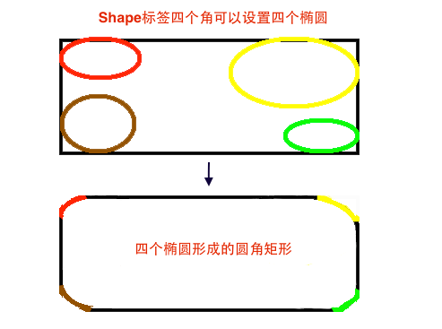

可见，圆角矩形的圆角其实是由椭圆的一角形成的。

与 shape 标签不同的是，drawRoundRect()函数不能针对每个角设置对应的椭圆，而只能统一设置 4 个角对应的椭圆。

```kotlin
Paint paint=new Paint(); 
paint.setColor(Color.RED); 
paint.setStyle(Style.FILL); 
paint.setStrokeWidth(15); 
 
RectF rect = new RectF(100, 10, 300, 100); 
canvas.drawRoundRect(rect, 20, 10, paint);
```


## 圆形

void drawCircle(float cx, float cy, float radius, Paint paint) 

参数：

- float cx：圆心点的 *X* 轴坐标。 
- float cy：圆心点的 *Y* 轴坐标。
- float radius：圆的半径。


## 椭圆

void drawOval(RectF oval, Paint paint) 

椭圆是根据矩形生成的，以矩形的长为椭圆的 *X* 轴，以矩形的宽为椭圆的 *Y* 轴。

参数 RectF oval：用来生成椭圆的矩形。

```kotlin
Paint paint=new Paint(); 
paint.setColor(Color.RED); 
paint.setStyle(Paint.Style.STROKE); 
paint.setStrokeWidth(5); 

RectF rect = new RectF(100, 10, 300, 100); 
canvas.drawRect(rect, paint); 
paint.setColor(Color.GREEN);//更改画笔颜色 
canvas.drawOval(rect, paint);//根据同一个矩形画椭圆
```

针对同一个矩形，先把它的矩形区域画出来，然后再把根据这个矩形生成的椭圆画出来，就可以很好地理解根据矩形所生成的椭圆与矩形的关系了，效果如下图所示。


## 弧

弧是椭圆的一部分，而椭圆是根据矩形来生成的，所以弧也是根据矩形来生成的。

void drawArc(RectF oval, float startAngle, float sweepAngle, boolean useCenter, Paint paint) 

参数：

- RectF oval：生成椭圆的矩形。
- float startAngle：弧开始的角度，以 *X* 轴正方向为 0°。
- float sweepAngle：弧持续的角度。
- boolean useCenter：是否有弧的两边。为 true 时，表示带有两边；为 false 时，只有一条弧。

1. 将画笔设为描边

   ```kotlin
   Paint paint=new Paint(); 
   paint.setColor(Color.RED); 
   paint.setStyle(Paint.Style.STROKE); 
   paint.setStrokeWidth(5); 
   //带两边
   RectF rect1 = new RectF(10, 10, 100, 100); 
   canvas.drawArc(rect1, 0, 90, true, paint); 
   //不带两边
   RectF rect2 = new RectF(110, 10, 200, 100); 
   canvas.drawArc(rect2, 0, 90, false, paint);
   ```

   

   左侧为带两边的弧，右侧为不带两边的弧。

2. 将画笔设为填充

   ```kotlin
   paint.setStyle(Style.FILL);
   ```

   代码不变，将 paint 的样式设置为 FILL 。

   

   从效果图中可以看出，当画笔设为填充模式时，填充区域只限于圆弧的起始点和终点所形成的区域。当带有两边时，会将两边及圆弧内部全部填充；如果没有两边，则只填充圆弧部分。

## 路径

### 概述

类似我们用画笔画画，画笔所画出来的一段不间断的曲线就是路径。

在 Android 中，Path 类就代表路径。

在 Canvas 中绘制路径的方法如下：void drawPath(Path path, Paint paint) 

### 直线路径

画一条直线路径，一般涉及下面三个函数。

- void moveTo(float x1, float y1) ：(x1,y1)是直线的起始点，即将直线路径的绘制点定在(x1,y1)位置。
- void lineTo(float x2, float y2) ：(x2,y2)是直线的终点，又是下一次绘制直线路径的起始点；lineTo()函数可以一直使用。
- void close() ：如果连续画了几条直线，但没有形成闭环，那么调用 close()函数会将路径首尾点连接起来，形成闭环。

示例：画一个三角形。

```kotlin
Paint paint=new Paint(); 
paint.setColor(Color.RED); //设置画笔颜色
paint.setStyle(Paint.Style.STROKE); //填充样式改为描边
paint.setStrokeWidth(5); //设置画笔宽度
Path path = new Path(); 
path.moveTo(10, 10); //设定起始点
path.lineTo(10, 100); //第一条直线的终点，也是第二条直线的起始点
path.lineTo(300, 100); //画第二条直线
path.close(); //闭环
canvas.drawPath(path, paint);
```

我们先沿逆时针方向画了两条直线，分别是从(10, 10)到(10, 100)和从(10, 100)到(300, 100)，然后利用 path.close()函数将路径闭合，路径的终点(300,100)就会自行向路径的起始点(10,10)画一条闭合线，所以最终我们看到的是一个路径闭合的三角形。

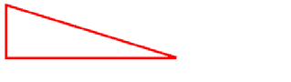

### 弧线路径

void arcTo(RectF oval, float startAngle, float sweepAngle) 

这是一个画弧线路径的方法，弧线是从椭圆上截取的一部分。

参数：

- RectF oval：生成椭圆的矩形。
- float startAngle：弧开始的角度，以 *X* 轴正方向为 0°。
- float sweepAngle：弧持续的角度。

示例：

```kotlin
Path path = new Path(); 
path.moveTo(10,10); 
RectF rectF = new RectF(100,10,200,100); 
path.arcTo(rectF,0,90); 
canvas.drawPath(path,paint);
```


从效果图中发现一个问题：我们只画了一条弧，为什么弧最终还是会和起始点(10,10)连接起来？

因为在默认情况下路径都是连贯的，除非以下两种情况：

- 调用 addXXX 系列函数，将直接添加固定形状的路径。
- 调用 moveTo()函数改变绘制起始位置。

如果我们不想连接怎么办？Path 类也提供了另外两个重载方法。

```kotlin
void arcTo(float left, float top, float right, float bottom, float startAngle, 
float sweepAngle, boolean forceMoveTo) 
void arcTo(RectF oval, float startAngle, float sweepAngle, boolean 
forceMoveTo)
```

参数 boolean forceMoveTo 的含义是是否强制将弧的起始点作为绘制起始位置。

将上面的代码稍加改造：

```kotlin
Path path = new Path(); 
path.moveTo(10,10); 
RectF rectF = new RectF(100,10,200,100); 
path.arcTo(rectF,0,90,true); 
canvas.drawPath(path,paint); 
```


### addXXX系列函数

前面讲过，路径一般都是连贯的，而 addXXX 系列函数可以让我们直接往 Path 中添加一些曲线，而不必考虑连贯性。注意“添加”这个词。

示例：

```kotlin
Path path = new Path(); 
path.moveTo(10,10); 
path.lineTo(100,50); 

RectF rectF = new RectF(100,100,150,150); 
path.addArc(rectF,0,90); 
canvas.drawPath(path, paint); 
```


虽然我们先绘制了从(10,10)到(100,50)的线段，但是在我们往路径中添加了一条弧线之后，弧线并没有与线段连接。除了 addArc()函数，Path 类还提供了一系列的 add 函数，下面我们就一一来讲解。

#### 1．添加矩形路径

```kotlin
void addRect(float left, float top, float right, float bottom, Path.Direction dir) 

void addRect(RectF rect, Path.Direction dir) 
```

这里 Path 类创建矩形路径的参数与 Canvas 绘制矩形的参数差不多，唯一不同的是增加了Path.Direction 参数。

Path.Direction 参数有两个值。

- Path.Direction.CCW：是 counter-clockwise 的缩写，指创建逆时针方向的矩形路径。
- Path.Direction.CW：是 clockwise 的缩写，指创建顺时针方向的矩形路径。

示例：创建两条大小相同但方向不同的路径。

```kotlin
//先创建两条大小相同的路径 
//第一条路径逆向生成 
Path CCWRectpath = new Path(); 
RectF rect1 = new RectF(50, 50, 240, 200); 
CCWRectpath.addRect(rect1, Direction.CCW); 

//第二条路径顺向生成 
Path CWRectpath = new Path(); 
RectF rect2 = new RectF(290, 50, 480, 200); 
CWRectpath.addRect(rect2, Direction.CW); 
 
//先画出这两条路径 
canvas.drawPath(CCWRectpath, paint); 
canvas.drawPath(CWRectpath, paint); 
```

效果如下图所示。


从效果图中看不出顺时针生成和逆时针生成的任何区别，那么问题来了：为什么生成方向对路径大小没有影响呢？

答：无论是顺时针还是逆时针生成，仅仅是生成方向不同而已，路径的大小只与生成路径的矩形大小有关，与生成方向无关。

那么问题又来了：生成方向是用来做什么的呢？

答：生成方向的区别在于依据生成方向排版的文字。后面我们会讲到文字，文字是可以依据路径排版的，文字的行走方向依据的就是路径的生成方向。

示例：根据路径方向布局文字。

```kotlin
//先创建两条大小相同的路径
//第一条路径逆向生成
Path CCWRectpath = new Path(); 
RectF rect1 = new RectF(50, 50, 240, 200); 
CCWRectpath.addRect(rect1, Path.Direction.CCW);
//第二条路径顺向生成
Path CWRectpath = new Path(); 
RectF rect2 = new RectF(290, 50, 480, 200); 
CWRectpath.addRect(rect2, Path.Direction.CW); 
//先画出这两条路径
canvas.drawPath(CCWRectpath, paint); 
canvas.drawPath(CWRectpath, paint); 
//依据路径布局文字
String text="苦心人天不负,有志者事竟成"; 
paint.setColor(Color.GREEN); 
paint.setTextSize(35); 
canvas.drawTextOnPath(text, CCWRectpath, 0, 18, paint);//逆时针方向生成
canvas.drawTextOnPath(text, CWRectpath, 0, 18, paint);//顺时针方向生成
```


这里我们只需要知道路径的生成方向与文字的关系即可。

#### 2．添加圆角矩形路径

```kotlin
void addRoundRect(RectF rect, float[] radii, Path.Direction dir) 
void addRoundRect(RectF rect, float rx, float ry, Path.Direction dir)
```

前面讲过，矩形的圆角都是利用椭圆生成的。在这两个构造函数中，RectF rect 是当前所构造路径的矩形；Path.Direction dir 依然是指路径的生成方向，当然只对依据路径布局的文字有用。

在第一个构造函数中，我们可以指定每个角的圆角大小。

float[] radii：必须传入 8 个数值，分 4 组，分别对应每个角所使用的椭圆的横轴半径和纵轴半径，如｛x1,y1,x2,y2,x3,y3,x4,y4｝，其中，x1,y1 对应第一个角（左上角）的用来生成圆角的椭圆的横轴半径和纵轴半径，其他类推……而在第二个构造函数中，只能构建统一的圆角大小。

- float rx：生成圆角的椭圆的横轴半径。
- float ry：生成圆角的椭圆的纵轴半径。

示例：

```kotlin
Path path = new Path(); 
RectF rect1 = new RectF(50, 50, 240, 200); 
path.addRoundRect(rect1, 10, 15 , Direction.CCW); 
 
RectF rect2 = new RectF(290, 50, 480, 200); 
float radii[] ={10,15,20,25,30,35,40,45}; 
path.addRoundRect(rect2, radii, Direction.CCW); 
 
canvas.drawPath(path, paint);
```

从这段代码中可以看出，我们针对同一条路径连续两次调用 path.addRoundRect()函数添加两个椭圆矩形，直接在对应的区域画出矩形即可，而不必考虑连贯性。


#### 3．添加圆形路径

void addCircle(float x, float y, float radius, Path.Direction dir) 

参数：

- float x：圆心 *X* 轴坐标。 
- float y：圆心 *Y* 轴坐标。
- float radius：圆半径。

示例：

```kotlin
Path path = new Path(); 

path.addCircle(100, 100, 50, Direction.CCW); 

canvas.drawPath(path, paint); 
```


#### 4．添加椭圆路径

void addOval(RectF oval, Path.Direction dir) 

参数：

- RectF oval：生成椭圆的矩形。
- Path.Direction：生成方向，与矩形一样，分为顺时针与逆时针。

示例：

```kotlin
Path path = new Path(); 

RectF rect = new RectF(10, 10, 200, 100); 

path.addOval(rect, Path.Direction.CCW); 

canvas.drawPath(path, paint); 
```


#### 5．添加弧形路径

```kotlin
void addArc(float left, float top, float right, float bottom, float startAngle, 

float sweepAngle) 

void addArc(RectF oval, float startAngle, float sweepAngle) 
```

参数：

- RectF oval：弧是椭圆的一部分，这个参数就是生成椭圆的矩形。
- float startAngle：弧开始的角度，以 *X* 轴正方向为 0°。
- float sweepAngel：弧持续的角度。

示例：

```kotlin
Path path = new Path(); 

RectF rect = new RectF(10, 10, 100, 50); 

path.addArc(rect, 0, 100); 

canvas.drawPath(path, paint); 
```


### 填充模式

Path 的填充模式与 Paint 的填充模式不同。Path 的填充模式是指填充 Path 的哪部分。

Path.FillType 表示 Path 的填充模式，它有 4 个枚举值。

- FillType.WINDING：默认值，当两个图形相交时，取相交部分显示。
- FillType.EVEN_ODD：取 path 所在并不相交的区域。
- FillType.INVERSE_WINDING：取 path 的外部区域。
- FillType.INVERSE_EVEN_ODD：取 path 的外部和相交区域。

Inverse 就是取反的意思，所以 FillType.INVERSE_WINDING 就是取 FillType.WINDING的相反部分；同理，FillType.INVERSE_EVEN_ODD 就是取 FillType.EVEN_ODD 的相反部分。

设置填充模式使用 setFillType(FillType filltype)函数。

示例：

```kotlin
Paint paint = new Paint(); 
paint.setColor(Color.RED); 
paint.setStyle(Paint.Style.FILL); 

Path path = new Path(); 
path.addRect(100, 100, 300, 300, Path.Direction.CW); 
path.addCircle(300, 300, 100, Path.Direction.CW); 
path.setFillType(Path.FillType.WINDING); 
canvas.drawPath(path,paint); 
```

使用上面的代码，分别设置不同的填充类型，利用 Paint 填充路径，结果如下图所示。


所以，在利用画笔填充图形时，填充的肯定是图形内部，而 path.setFillType()函数就是用来界定哪里算 Path 内部的算法，进而让 Paint 填充这部分图像。

### 重置路径

#### 1．概述

当我们需要重绘一条全新的路径时，Android 开发人员为了重复利用空间，允许我们重置路径对象。路径对象一旦被重置，其中保存的所有路径都将被清空，这样我们就不需要重新定义一个路径对象了。重新定义路径对象的问题在于老对象的回收和新对象的内存分配，当然这些过程都是会消耗手机性能的。

系统提供了两个重置路径的方法，分别是：

- void reset() 
- void rewind() 

这两个函数的共同点是都会清空内部所保存的所有路径，但二者也有区别。

- rewind()函数会清除 FillType 及所有的直线、曲线、点的数据等，但是会保留数据结构。这样可以实现快速重用，提高一定的性能。例如，重复绘制一类线段，它们的点的数量都相等，那么使用 rewind()函数可以保留装载点数据的数据结构，效率会更高。一定要注意的是，只有在重复绘制相同的路径时，这些数据结构才是可以复用的。
- reset()函数类似于新建一个路径对象，它的所有数据空间都会被回收并重新分配，但不会清除 FillType。

从整体来讲，rewind()函数不会清除内存，但会清除 FillType；而 reset()函数则会清除内存，但不会清除 FillType。

有关是否清除内存，在代码中不易演示，我们来看一下这两个函数各自对于 FillType 的清除情况。

#### 2．reset()与 FillType

```kotlin
Path path = new Path(); 
path.setFillType(Path.FillType.INVERSE_WINDING); 
path.reset(); 
path.addCircle(100, 100, 50, Path.Direction.CW); 
canvas.drawPath(path, paint);
```


很明显，首先设置 Path 的填充类型为 FillType.INVERSE_WINDING，在调用 reset()函数以后，画了一个圆，但结果却是圆形以外的区域。很明显，调用 reset()函数并没有清除原有的 Path 填充类型。

#### 3．rewind()与 FillType

还是使用上面的代码，把 reset()改成 rewind()。

```kotlin
Path path = new Path(); 
path.setFillType(Path.FillType.INVERSE_WINDING); 
path.rewind(); 
path.addCircle(100, 100, 50, Path.Direction.CW); 
canvas.drawPath(path, paint);
```


很明显，使用 rewind()函数清空了填充类型。

### 示例：蜘蛛网状图

大家在打游戏时，经常会看到如下图所示的技能分析。


想必大家一眼就可以看出中间的线条部分就是利用 Path 来实现的。本小节就利用 Path 来实现一个技能分析的简化版，效果如下图所示。


从效果图中可以看出，我们要先画出一个网格，默认网格数和边角数都是 6。在代码中，为了简化逻辑，我们会将所有可变的内容，比如画笔颜色、网格数、边角数设为固定值。其实这些值都应该在初始化的时候通过对应的 set 函数设置到自定义控件内部，大家可以自行补充。

#### 1．初始化

我们说过，不能在 onDraw()函数中创建变量，所以必然会有一个初始化函数，用于在创建控件的时候初始化画笔等参数。

```kotlin
public class SpiderView extends View { 
 private Paint radarPaint,valuePaint; 
 public SpiderView(Context context, AttributeSet attrs) { 
 super(context, attrs); 
 init(); 
 } 
 private void init(){ 
 radarPaint = new Paint(); 
 radarPaint.setStyle(Paint.Style.STROKE); 
 radarPaint.setColor(Color.GREEN); 
 valuePaint = new Paint(); 
 valuePaint.setColor(Color.BLUE); 
 valuePaint.setStyle(Paint.Style.FILL); 
 } 
 ... 
}
```

这里初始化了两个画笔，其中 radarPaint 是用来绘制网格的，所以类型设置为描边；而valuePaint 是用来绘制结果图的，所以设置成蓝色画笔，样式为填充。

#### 2．获得布局中心

在 onSizeChanged(int w, int h, int oldw, int oldh)函数中，根据 View 的长、宽，获取整个布局的中心坐标，因为整个雷达都是从这个中心坐标开始绘制的。

```kotlin
private float radius; //网格最大半径
private int centerX; //中心 X 
private int centerY; //中心 Y 
@Override 
protected void onSizeChanged(int w, int h, int oldw, int oldh) { 
 radius = Math.min(h, w)/2*0.9f; 
 //中心坐标
 centerX = w/2; 
 centerY = h/2; 
 postInvalidate(); 
 super.onSizeChanged(w, h, oldw, oldh); 
}
```

我们知道，在控件大小发生变化时，都会通过 onSizeChanged()函数通知我们当前控件的大小。所以，我们只需要重写 onSizeChanged()函数，即可得知当前控件的最新大小。

因为蜘蛛网的总大小占当前控件大小的 90%，所以，我们将蜘蛛网的半径设置为Math.min(h, w)/2*0.9f。

然后依据绘图中心，分别绘制蜘蛛网格、画网格中线、画数据图，即可完成整个效果图的绘制。

```kotlin
@Override 
protected void onDraw(Canvas canvas) { 
 super.onDraw(canvas); 
 //绘制蜘蛛网格
 drawPolygon(canvas); 
 //画网格中线
 drawLines(canvas); 
 //画数据图
 drawRegion(canvas); 
}
```

#### 3．绘制蜘蛛网格

下面我们就要绘制蜘蛛网格了，效果如下图所示。


很显然，蜘蛛网格是利用 Path 的 moveTo()和 lineTo()函数一圈圈画出来的，我们需要计算出每个转折点的位置。

比如，计算下图中所标记点的 *x*,*y* 坐标。


很明显，标记点在半径的 5/6 位置，而标记点与中心点的连线与 *X* 轴的夹角为 *a*，所以由图可得：

```kotlin
x = centX + 5/6 * radius * sina; 
y = centY + 5/6 * radius * cosa;
```

因为我们共画了 6 个角，所以每个角的度数应该是 360°/6 = 60°。

依据上面的原理，列出画蜘蛛网格的代码如下：

```kotlin
private void drawPolygon(Canvas canvas){ 
 Path path = new Path(); 
 float r = radius/(count); //r 是蜘蛛丝之间的间距
 for(int i=1;i<=count;i++){ //中心点不用绘制
 float curR = r*i; //当前半径
 path.reset(); 
 for(int j=0;j<count;j++){ 
 if(j==0){ 
 path.moveTo(centerX+curR,centerY); 
 }else{ 
 //根据半径，计算出蜘蛛丝上每个点的坐标
 float x = (float) (centerX+curR*Math.cos(angle*j)); 
 float y = (float) (centerY+curR*Math.sin(angle*j)); 
 path.lineTo(x,y); 
 } 
 } 
 path.close();//闭合路径
 canvas.drawPath(path, radarPaint); 
 } 
}
```

#### 4．画网格中线

在画完蜘蛛网格以后，我们需要画从网格中心到末端的直线，代码如下：

```kotlin
private void drawLines(Canvas canvas){ 
 Path path = new Path(); 
 for(int i=0;i<count;i++){ 
 path.reset(); 
 path.moveTo(centerX, centerY);
     float x = (float) (centerX+radius*Math.cos(angle*i)); 
 float y = (float) (centerY+radius*Math.sin(angle*i)); 
 path.lineTo(x, y); 
 canvas.drawPath(path, radarPaint); 
 } 
} 
```


绘制原理与绘制蜘蛛网格是一样的，先找到各个末端点的坐标，然后画一条从中心点到末端点的连线即可。

#### 5．画数据图

绘制数据区域其实也很简单，首先要确定每个数据点的位置。当然，网格线中的每一层网格都应该对应一个数值，在这里为了方便起见，将网格的最大值设为 6，即每一层数值是按1,2,3,4,5,6 分布的。

```kotlin
//数据
private double[] data={2,5,1,6,4,5}; 
//最大值
private float maxValue=6;
```

这里的 data 数组就是我们要画出来的每个数据点。

数据图的绘制代码如下：

```kotlin
private void drawRegion(Canvas canvas){ 
 Path path = new Path(); 
 valuePaint.setAlpha(127); 
 for(int i=0;i<count;i++){ 
 double percent = data[i]/maxValue; 
 float x = (float) (centerX+radius*Math.cos(angle*i)*percent); 
 float y = (float) (centerY+radius*Math.sin(angle*i)*percent); 
 if(i==0){ 
 path.moveTo(x, centerY); 
 }else{ 
 path.lineTo(x,y); 
 } 
 //绘制小圆点
 canvas.drawCircle(x,y,10,valuePaint); 
 } 
 //绘制填充区域
 valuePaint.setStyle(Paint.Style.FILL_AND_STROKE); 
 canvas.drawPath(path, valuePaint); 
}
```

先找到数组中所对应的每个点的坐标，然后在对应位置画一个圆，再将各个点利用 Path 连接起来，填充为蓝色即可。

# Canvas变换、保存与恢复

除可以在 Canvas 上面绘图以外，还可以对画布进行变换及裁剪等操作。

## canvas变换

### 平移（Translate）

Canvas 中有一个函数 translate() 是用来实现画布平移的。画布的原始状态是以左上角点为原点，向右是 *X* 轴正方向，向下是 *Y* 轴正方向，如下图所示。

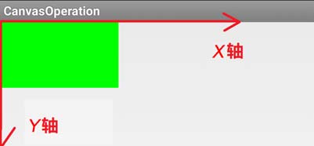

由于画布的左上角点为坐标轴的原点(0,0)，所以当平移画布以后，坐标系也同样会被平移。被平移后的画布的左上角点是新的坐标原点。

translate()：void translate(float dx, float dy) 

参数：

- float dx：水平方向平移的距离，正数为向正方向（向右）平移的量，负数为向负方向（向左）平移的量。
-  float dy：垂直方向平移的距离，正数为向正方向（向下）平移的量，负数为向负方向（向上）平移的量。

示例：

```kotlin
protected void onDraw(Canvas canvas) { 
 // TODO Auto-generated method stub 
 super.onDraw(canvas); 
 
 Paint paint = new Paint(); 
 paint.setColor(Color.GREEN); 
 paint.setStyle(Style.FILL); 
 
// canvas.translate(100, 100); 
 Rect rect1 = new Rect(0,0,400,220); 
 canvas.drawRect(rect1, paint); 
}
```

在上述代码中，先把 canvas.translate(100,100);注释掉，看原来矩形的位置；然后打开注释，看平移后的位置，对比如下图所示。

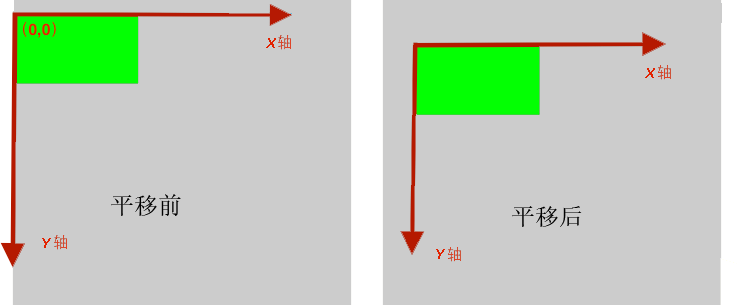

很明显，在平移后，同样绘制 Rect(0,0,400,220)，但是坐标系的起始点变成了平移后的原点。由此可见，在对 Canvas 进行变换时，坐标系的位置会随着 Canvas 左上角点的移动而移动。

### 屏幕显示与 Canvas 的关系

很多读者一直以为显示所绘图形的屏幕就是 Canvas，其实这是一种非常错误的理解，比如下面这段代码。在这段代码中，同一个矩形，在画布平移前后各画一次，结果会怎样？

```kotlin
protected void onDraw(Canvas canvas) { 
 super.onDraw(canvas); 
 
 //构造两个画笔，一个红色，一个绿色 
 Paint paint_green = generatePaint(Color.GREEN, Style.STROKE, 3); 
 Paint paint_red = generatePaint(Color.RED, Style.STROKE, 3); 
 
 //构造一个矩形 
 Rect rect1 = new Rect(0,0,400,220); 
 
 //在平移画布前用绿色画笔画下边框 
 canvas.drawRect(rect1, paint_green); 
 
 //在平移画布后，再用红色画笔重新画下边框 
 canvas.translate(100, 100); 
 canvas.drawRect(rect1, paint_red); 
 
} 

private Paint generatePaint(int color int.Style style,int width) {
 Paint paint = new Paint(); 
 paint.setColor(color); 
 paint.setStyle(style); 
 paint.setStrokeWidth(width); 
 return paint; 
}
```

实际结果如下图所示。


为什么绿色框并没有移动？

这是由于屏幕显示与 Canvas 根本不是一个概念！Canvas 是一个很虚幻的概念，相当于一个透明图层。每次在 Canvas 上画图时（调用 drawXXX 系列函数），都会先产生一个透明图层，然后在这个图层上画图，画完之后覆盖在屏幕上显示。所以，上述结果是经以下几个步骤形成的： 

（1）在调用 canvas.drawRect(rect1, paint_green);时，产生一个 Canvas 透明图层，由于当时还没有对坐标系进行平移，所以坐标原点是(0,0)；在 Canvas 上画好之后，覆盖到屏幕上显示出来。过程如下图所示。

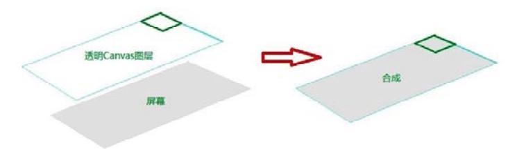

（2）在调用 canvas.drawRect(rect1, paint_red);时，又会产生一个全新的 Canvas 透明图层，但此时画布坐标已经改变了，即分别向右和向下移动了 100 像素，所以此时的绘图方式如下图所示（合成视图，从上往下看的合成方式）。

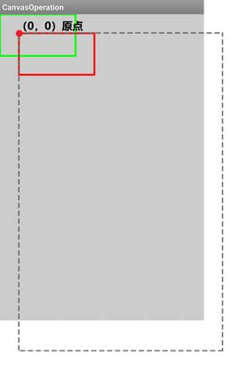

上图展示了上层的 Canvas 图层与底部的屏幕的合成过程。由于 Canvas 已经平移了 100像素，所以在画图时是以新原点来产生视图的，然后合成到屏幕上，这就是我们看到的最终结果。我们看到，当屏幕移动之后，有一部分超出了屏幕的范围，那超出范围的图像显不显示呢？当然不显示了！也就是说，在 Canvas 上虽然能画图，但超出了屏幕的范围，是不会显示的。当然，这里并没有超出显示范围。

下面对上述知识做一下总结：

（1）每次调用 drawXXX 系列函数来绘图时，都会产生一个全新的 Canvas 透明图层。

（2）如果在调用 drawXXX 系列函数前，调用平移、旋转等函数对 Canvas 进行了操作，那么这个操作是不可逆的。每次产生的画布的最新位置都是执行这些操作后的位置。

（3）在 Canvas 图层与屏幕合成时，超出屏幕范围的图像是不会显示出来的。

### 旋转（Rotate）

画布的旋转默认是围绕坐标原点来进行的。这里容易产生错觉，看起来是图片旋转了，其实我们旋转的是画布，以后在此画布上绘制的图形显示出来的时候看起来都是旋转的。

rotate()函数有两个。

- void rotate(float degrees) ：直接输入旋转的度数，正数指顺时针旋转，负数指逆时针旋转，它的旋转中心点是原点(0,0)。
- void rotate(float degrees, float px, float py) ：除度数以外，还可以指定旋转的中心点坐标(px,py)。

下面以第一个构造函数为例，旋转一个矩形。先画出未旋转前的图形，然后画出旋转后的图形。代码如下：

```kotlin
protected void onDraw(Canvas canvas) { 
 super.onDraw(canvas); 
 
 Paint paint_green = generatePaint(Color.GREEN, Style.FILL, 5); 
 Paint paint_red = generatePaint(Color.RED, Style.STROKE, 5); 
 
 Rect rect1 = new Rect(300,10,500,100); 
 canvas.drawRect(rect1, paint_red); //画出原轮廓
 
canvas.rotate(30); //顺时针旋转画布
 canvas.drawRect(rect1, paint_green); //画出旋转后的矩形
}
```

效果如下图所示。

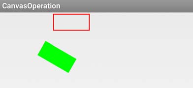

这个最终屏幕显示的构造过程如下：

下图显示的是第一次合成过程，此时仅仅调用 canvas.drawRect(rect1, paint_red); 画出原轮廓。

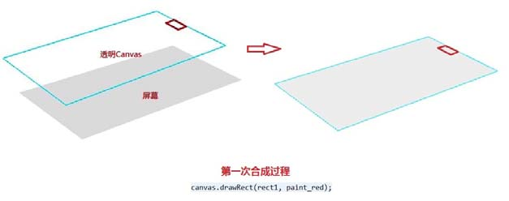

下图显示的是第二次合成过程，先将 Canvas 沿正方向依原点旋转 30°，再与上面的屏幕合成，最后显示出复合效果。

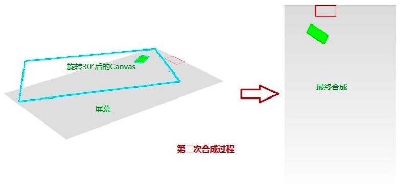

有关 Canvas 与屏幕的合成关系已经讲得足够详细了，后面几个操作 Canvas 的函数就不再一一讲述它们的合成过程了。

### 缩放（Scale）

该函数用于变更坐标轴密度，它有两个构造函数。

public void scale(float sx, float sy)

参数：

- float sx：水平方向伸缩的比例。假设原坐标轴的比例为 n，不变时为 1，变更后的 X轴密度为 n×sx。所以，sx 是小数表示缩小，sx 是整数表示放大。
- float sy：垂直方向伸缩的比例。同样，sy 为小数表示缩小，sy 为整数表示放大。

public void scale(float sx, float sy, float px, float py) 

这里多了两个参数 px,py，表示缩放中心位置。

下面以第一个构造函数为例，示例代码如下：

```kotlin
protected void onDraw(Canvas canvas) { 
 super.onDraw(canvas); 
 
 Paint paint_green = generatePaint(Color.GREEN, Style.STROKE, 5); 
 Paint paint_red = generatePaint(Color.RED, Style.STROKE, 5);
 
 Rect rect1 = new Rect(10,10,200,100); 
 canvas.drawRect(rect1, paint_green); 
 
 canvas.scale(0.5f, 1); 
 canvas.drawRect(rect1, paint_red); 
}
```

效果如下图所示。

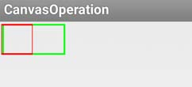

图中，绿框是原坐标轴密度图形，红框是 *X* 轴密度缩小到 0.5 倍之后显示的图形。

### 扭曲（Skew）

void skew(float sx, float sy) 

参数：

- float sx：将画布在 *X* 轴方向上倾斜相应的角度，sx 为倾斜角度的正切值。
- float sy：将画布在 *Y* 轴方向上倾斜相应的角度，sy 为倾斜角度的正切值。

**注意：**这里都是倾斜角度的正切值，比如，在 *X* 轴方向上倾斜 60°，tan60=1.732。

示例：

```kotlin
protected void onDraw(Canvas canvas) { 
 super.onDraw(canvas); 
 
 Paint paint_green = generatePaint(Color.GREEN, Style.STROKE, 5); 
 Paint paint_red = generatePaint(Color.RED, Style.STROKE, 5); 
 
 Rect rect1 = new Rect(10,10,200,100); 
 
 canvas.drawRect(rect1, paint_green); 
 canvas.skew(1.732f,0);//X 轴倾斜 60°，Y 轴不变 
 canvas.drawRect(rect1, paint_red); 
}
```

效果如下图所示。

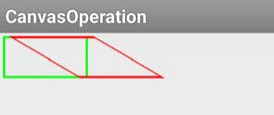

### 裁剪画布（clip 系列函数）

裁剪画布是指利用 clip 系列函数，通过与 Rect、Path、Region 取交、并、差等集合运算来获得最新的画布形状。除调用 save()、restore()函数以外，这个操作是不可逆的，一旦 Canvas被裁剪，就不能恢复。

**注意：**在使用 clip 系列函数时，需要禁用硬件加速功能。使用：setLayerType(LAYER_TYPE_SOFTWARE,null); 

clip 系列函数如下：

```kotlin
boolean clipPath(Path path) 
boolean clipPath(Path path, Region.Op op)
boolean clipRect(Rect rect, Region.Op op)
boolean clipRect(RectF rect, Region.Op op) 
boolean clipRect(int left, int top, int right, int bottom) 
boolean clipRect(float left, float top, float right, float bottom) 
boolean clipRect(RectF rect) 
boolean clipRect(float left, float top, float right, float bottom, Region.Op op) 
boolean clipRect(Rect rect) 
boolean clipRegion(Region region) 
boolean clipRegion(Region region, Region.Op op)
```

以上就是根据 Rect、Path、Region 来获得最新画布形状的函数，使用难度都不大，就不再一一讲述了。下面以 clipRect()函数为例来讲解具体应用。

```kotlin
protected void onDraw(Canvas canvas) { 
 super.onDraw(canvas); 
 
 canvas.drawColor(Color.RED); 
 canvas.clipRect(new Rect(100, 100, 200, 200)); 
 canvas.drawColor(Color.GREEN); 
}
```

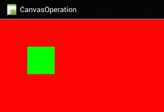

先把背景色涂成红色，显示在屏幕上；然后裁剪画布；最后将最新的画布涂成绿色。可见，绿色部分只有一小块，而不再是整个屏幕。

## canvas的保存与恢复

### save()和 restore()函数

前面介绍的所有对画布的操作都是不可逆的，这会造成很多麻烦。比如，为了实现一些效果不得不对画布进行操作，但操作完了，画布状态也改变了，这会严重影响到后面的画图操作。如果能对画布的大小和状态（旋转角度、扭曲等）进行实时保存和恢复就好了。本小节就讲述与画布的保存和恢复相关的函数——save()和 restore()。这两个函数的原型如下：

```kotlin
int save() 
void restore()
```

这两个函数没有任何参数，使用很简单。

- save()：每次调用 save()函数，都会先保存当前画布的状态，然后将其放入特定的栈中。
- restore()：每次调用 restore()函数，都会把栈中顶层的画布状态取出来，并按照这个状态恢复当前的画布，然后在这个画布上作画。

为了更清晰地显示这两个函数的作用，我们举一个例子，代码如下：

```kotlin
protected void onDraw(Canvas canvas) { 
 super.onDraw(canvas); 
 
 canvas.drawColor(Color.RED); 
 
 //保存当前画布大小，即整屏 
 canvas.save(); 
 
 canvas.clipRect(new Rect(100, 100, 800, 800)); 
 canvas.drawColor(Color.GREEN); 
 
 //恢复整屏画布 
 canvas.restore(); 
 canvas.drawColor(Color.BLUE); 
}
```

在这个例子中，首先将整个画布填充为红色，在将画布状态保存之后，将画布裁剪并填充为绿色，然后将画布还原以后填充为蓝色。整个填充过程如下图所示。

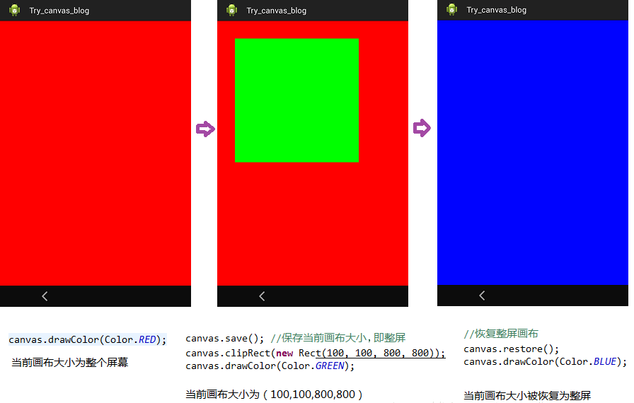

下面通过一个多次利用 save()、restore()函数的例子来讲述有关保存画布状态的栈的概念。代码如下：

```kotlin
protected void onDraw(Canvas canvas) { 
 // TODO Auto-generated method stub 
 super.onDraw(canvas);
 
 canvas.drawColor(Color.RED); 
 //保存的画布大小为全屏幕大小 
 canvas.save(); 
 
 canvas.clipRect(new Rect(100, 100, 800, 800)); 
 canvas.drawColor(Color.GREEN); 
 //保存的画布大小为 Rect(100, 100, 800, 800) 
 canvas.save(); 
 
 canvas.clipRect(new Rect(200, 200, 700, 700)); 
 canvas.drawColor(Color.BLUE); 
 //保存的画布大小为 Rect(200, 200, 700, 700) 
 canvas.save(); 
 
 canvas.clipRect(new Rect(300, 300, 600, 600)); 
 canvas.drawColor(Color.BLACK); 
 //保存的画布大小为 Rect(300, 300, 600, 600) 
 canvas.save(); 
 
 canvas.clipRect(new Rect(400, 400, 500, 500)); 
 canvas.drawColor(Color.WHITE); 
}  
```

效果如下图所示。

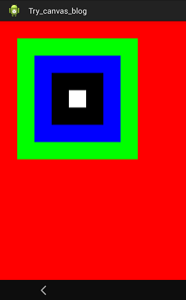

在这段代码中，共调用了 4 次 save()函数。前面提到，每调用一次 save()函数就会将当前的画布保存到栈中，并将画布涂上一种颜色来显示当前画布的大小，所以这 4 次调用 save()函数下图所示。

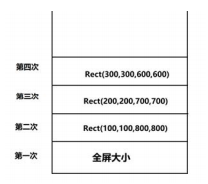

**注意：**在第四次调用 save()函数之后，还对画布进行了 canvas.clipRect(new Rect(400, 400, 500, 500));操作，并将当前画布填充为白色。

如果现在调用 restore()函数来还原画布，则会把栈顶的画布状态取出来，作为当前绘图的画布。代码如下：

```kotlin
protected void onDraw(Canvas canvas) { 
 super.onDraw(canvas); 
 
 //各种 save 操作
 ... 
 //将栈顶的画布状态取出来，作为当前画布，并填充为黄色 
 canvas.restore(); 
 canvas.drawColor(Color.YELLOW); 
}
```

如果连续三次调用 restore()函数会怎样呢？连续三次调用 restore()函数，会连续三次出栈，然后把第三次出栈的画布状态当作当前画布，也就是 Rect(100, 100, 800, 800)。代码如下：

```kotlin
protected void onDraw(Canvas canvas) { 
 super.onDraw(canvas); 
 
 //各种 save 操作
 ... 
 //连续三次出栈，将最后一次出栈的画布状态作为当前画布，并填充为黄色 
 canvas.restore(); 
 canvas.restore(); 
 canvas.restore(); 
 canvas.drawColor(Color.YELLOW); 
}
```

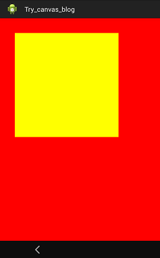

### restoreToCount(int saveCount)函数

上面讲述了 save()和 restore()函数的用法，我们可以多次调用 save()函数，但每次调用restore() 函数，只会将顶层的画布状态出栈，有时可能只需要用到特定的画布，这就需要多次出栈。为了解决这个问题，Google 提供了另一个出栈函数 restoreToCount(int saveCount)。

首先来看 save()函数的完整声明。

public int save(); 

在利用 save()函数保存画布时，会有一个 int 类型的返回值。该返回值是当前所保存的画布所在栈的索引。

然后来看 restoreToCount()函数的完整声明。

public void restoreToCount(int saveCount); 

而 restoreToCount() 函数的用法就是一直出栈，直到指定索引的画布出栈为止，即将指定索引的画布作为当前画布。

对连续三次出栈的代码加以改造，调用 restoreToCount()函数来直接拿到原本需要连续三次出栈的画布。代码如下：

```kotlin
protected void onDraw(Canvas canvas) { 
 super.onDraw(canvas); 
 
 canvas.drawColor(Color.RED); 
 //保存的画布大小为全屏幕大小
 int c1 = canvas.save(); 
 canvas.clipRect(new Rect(100, 100, 800, 800)); 
 canvas.drawColor(Color.GREEN); 
 //保存的画布大小为 Rect(100, 100, 800, 800) 
 int c2 = canvas.save(); 
    
 canvas.clipRect(new Rect(200, 200, 700, 700)); 
 canvas.drawColor(Color.BLUE); 
 //保存的画布大小为 Rect(200, 200, 700, 700) 
 int c3 = canvas.save(); 
    
 canvas.clipRect(new Rect(300, 300, 600, 600)); 
 canvas.drawColor(Color.BLACK); 
 //保存的画布大小为 Rect(300, 300, 600, 600) 
 int c4 = canvas.save(); 
    
 canvas.clipRect(new Rect(400, 400, 500, 500)); 
 canvas.drawColor(Color.WHITE); 
 //连续三次出栈，将最后一次出栈的画布状态作为当前画布，并填充为黄色
 canvas.restoreToCount(c2); 
 canvas.drawColor(Color.YELLOW); 
}
```

在每次调用 save()函数时，都将当前保存画布所在栈的索引保存起来；在恢复时，直接利用 c2 的索引，连续三次出栈，直到取出 c2 所保存的画布为止。

效果如下图所示，与前面的例子相同。


其实，保存画布还有很多种方法，我们在第 6 章中将会详细讲述。

# Demo地址


# 参考

《Android自定义控件开发入门与实战》