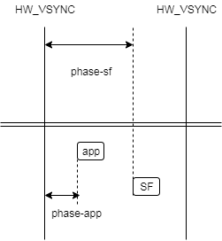
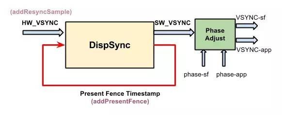
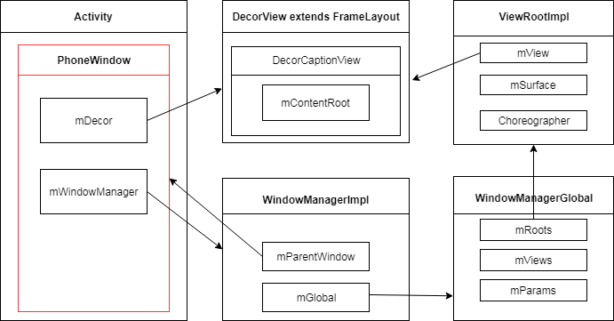
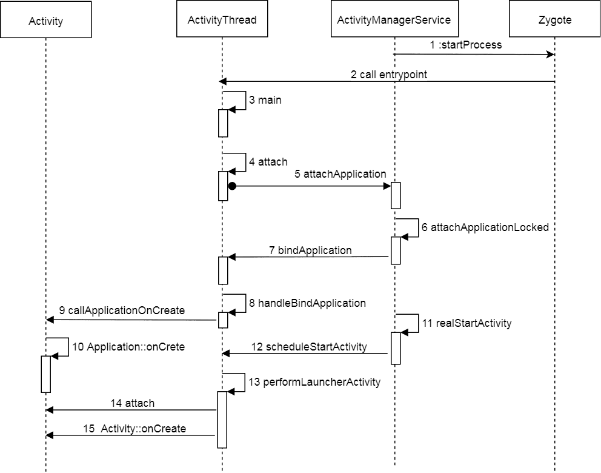
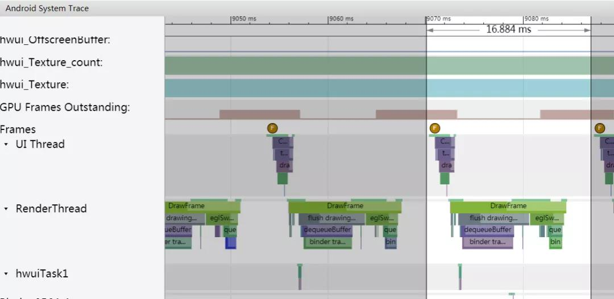
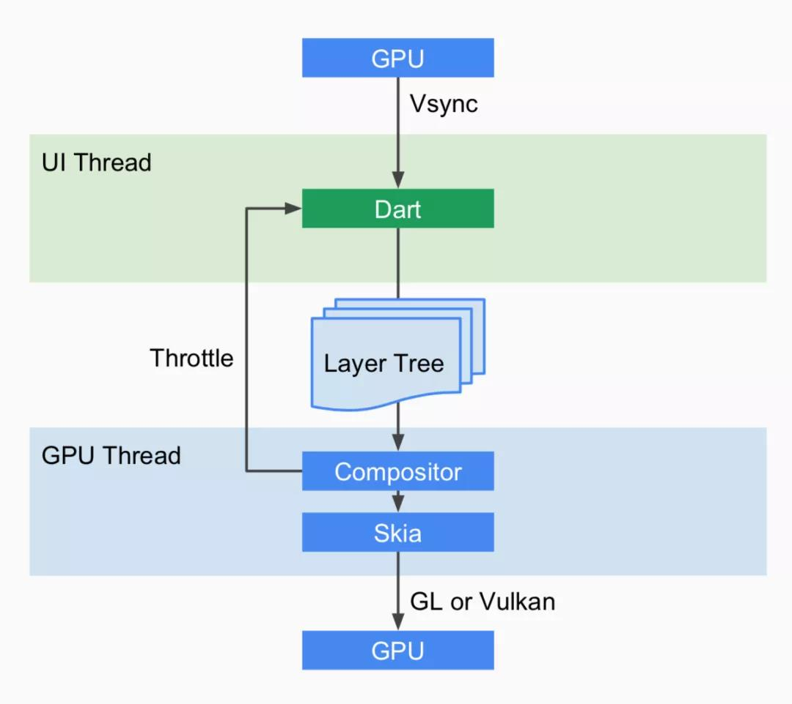

> version：2021/9/8
>
> review：

#### 一、前言

渲染机制是Android操作系统中很重要的一环，本文将探索下应用从启动到渲染的流程。

相关问题

1.vsync如何协调应用和SurfaceFlinger配合来完成UI渲染、显示，App接收vsync后要做哪些工作？
2.requestLayout和invalidate区别？
3.performTraversals到底是干什么了？
4.surfaceflinger怎么分发vsync信号的？
5.app需要主动请求vsync信号，sw sync才会分发给app？
6.surfaceview显示视频的时候，视频会一直频繁刷新界面，为什么整个UI界面没有卡顿？
7.app是如何构建起上面这套机制的？

本文将尝试解答上面的问题。

#### 二、vsync信号

Android在“黄油计划”中引入的一个重要机制就是：vsync，引入vsync的本质是要协调app生成UI数据和SurfaceFlinger合成图像，app是数据的生产者，surfaceflinger是数据的消费者，vsync引入避免Tearing现象。vsync信号有两个消费者，一个是app，一个是surfaceflinger，这两个消费者并不是同时接收vsync，是他们之间有个offset。

#### 三、vsync-offset引入原因

上面提到的hw（hardware） vsync信号在目前的Android系统中有两个receiver，App + SurfaceFlinger，hw sync会转化为sw（software） vsync分别分发给app和sf，分别称为vsync-app和vsync-sf。app和sf接收vsync会有一个offset，引入这个机制可以降低输入响应延迟。


如果app和sf同时接收hw sync，从上面可以看到需要经过vsync * 2的时间画面才能显示到屏幕，如果合理的规划app和sf接收vsync的时机，想像一下，如果vsync-sf比vsync-app延迟一定时间，如果这个时间安排合理达到如下效果，就能降低延迟：



#### 四、SufaceFlinger工作机制

##### 组成架构

1. **EventControlThread**: 控制硬件vsync的开关
2. **DispSyncThread**: 软件产生vsync的线程
3. **SF EventThread**: 该线程用于SurfaceFlinger接收vsync信号用于渲染
4. **App EventThread**: 该线程用于接收vsync信号并且上报给App进程，App开始画图

- HW vsync, 真实由硬件产生的vsync信号
- SW vsync, 由DispSync产生的vsync信号
- vsync-sf, SF接收到的vsync信号
- vsync-app, App接收到的vsync信号



#### 五、应用程序基本架构

Android应用进程核心组成



上图列举了Android应用进程侧的几个核心类，PhoneWindow的构建是一个非常重要的过程，应用启动显示的内容装载到其内部的mDecor，Activity(PhoneWindow)要能接收控制也需要mWindowManager发挥作用。ViewRootImpl是应用进程运转的发动机，可以看到ViewRootImpl内部包含mView、mSurface、Choregrapher，mView代表整个控件树，mSurfacce代表画布，应用的UI渲染会直接放到mSurface中，Choregorapher使得应用请求vsync信号，接收信号后开始渲染流程，下面介绍上图构建的流程。



应用UI构建流程图(下文称该图为P0)

#### 进程启动

应用冷启动第一步就是要先创建进程，这跟linux类似C/C++程序是一致的，Android也是通过fork来孵化应用进程，我们知道Linux fork的子进程继承父进程很多的资源，即所谓的COW。应用进程同样会从其父进程zygote处继承资源，比如art虚拟机实例、预加载的class/drawable资源等，以付出一些开机时间为代价，一来能够节省内存，二来能够加速应用性能，下面结合systrace介绍Android如何启动一个应用进程，应用启动第一个介入的管理者是AMS,应用启动过程中AMS发现没有process创建，就会请求zygote fork进程，下图就是AMS中创建进程的耗时：


AMS(ActivityManagerService)请求zygote创建进程的流程如下：

```java
##ActvityManager:startProcessLocked

private final void startProcessLocked(ProcessRecord app, String hostingType,
  String hostingNameStr, String abiOverride, String entryPoint, String[] entryPointArgs) {

    boolean isActivityProcess = (entryPoint == null);
    if (entryPoint == null) entryPoint = "android.app.ActivityThread";
    Trace.traceBegin(Trace.TRACE_TAG_ACTIVITY_MANAGER, "Start proc: " +app.processName);
    checkTime(startTime, "startProcess: asking zygote to start proc");
    ProcessStartResult startResult;
    if (hostingType.equals("webview_service")) {
    startResult = startWebView(entryPoint,
      app.processName, uid, uid, gids, debugFlags, mountExternal,
            app.info.targetSdkVersion, seInfo, requiredAbi, instructionSet,
      app.info.dataDir, null, entryPointArgs);
    } else {
        startResult = Process.start(entryPoint,
      app.processName, uid, uid, gids, debugFlags, mountExternal,
      app.info.targetSdkVersion, seInfo, requiredAbi, instructionSet,
            app.info.dataDir, invokeWith, entryPointArgs);
    }
    checkTime(startTime, "startProcess: returned from zygote!");
    Trace.traceEnd(Trace.TRACE_TAG_ACTIVITY_MANAGER);
}
```

前面systrace打印的proc创建时间就是来自与此，Process.start是请求zygote来创建创建进程，这其中有几个很重要问题，比如新建进程入口函数在哪？这个新建进程如何做到创建以后能够不退出，且能不断响应外部输入的等，接下来介绍下入口函数这个点，正如C/C++跑起来去找main函数一样，可以看到startProcess函数有个entrypoint参数：

```java
if (entryPoint == null) entryPoint = "android.app.ActivityThread";
```

原来进程启动以后就会先去执行ActivityThread：main这个入口，应用自此开始了自己启动流程，这点systrace展示的非常清晰：


看到上面PostFork色块，很明显是Process创建成功后的打印，然后代码继续执行到ZygoteInit，ZygoteInit真正来查找entrypoint，应用程序跳转到ActivityThread.Main开始执行：

```java
public static final Runnable zygoteInit(int targetSdkVersion, String[] argv, ClassLoader classLoader) {
        if (RuntimeInit.DEBUG) {
            Slog.d(RuntimeInit.TAG, "RuntimeInit: Starting application from zygote");
        }

        Trace.traceBegin(Trace.TRACE_TAG_ACTIVITY_MANAGER, "ZygoteInit");
        RuntimeInit.redirectLogStreams();

        RuntimeInit.commonInit();
        ZygoteInit.nativeZygoteInit();
        return RuntimeInit.applicationInit(targetSdkVersion, argv, classLoader);
    }
```

上面代码RuntimeInit.applicationInit内部执行findStaticMain查找入口函数：

```java
    protected static Runnable applicationInit(int targetSdkVersion, String[] argv,
            ClassLoader classLoader) {
        // If the application calls System.exit(), terminate the process
        // immediately without running any shutdown hooks.  It is not possible to
        // shutdown an Android application gracefully.  Among other things, the
        // Android runtime shutdown hooks close the Binder driver, which can cause
        // leftover running threads to crash before the process actually exits.
        nativeSetExitWithoutCleanup(true);

        // We want to be fairly aggressive about heap utilization, to avoid
        // holding on to a lot of memory that isn't needed.
        VMRuntime.getRuntime().setTargetHeapUtilization(0.75f);
        VMRuntime.getRuntime().setTargetSdkVersion(targetSdkVersion);

        final Arguments args = new Arguments(argv);

        // The end of of the RuntimeInit event (see #zygoteInit).
        Trace.traceEnd(Trace.TRACE_TAG_ACTIVITY_MANAGER);

        // Remaining arguments are passed to the start class's static main
        return findStaticMain(args.startClass, args.startArgs, classLoader);
    }
```

OK，至此进入systrace显示ActivityThread.main函数执行，也就是达到了P0的第3步骤。

#### ActivityThread对象

ActivityThread main执行的第一件事是调用AMS的attacApplicationLock(P0 :6）向大管家汇报：“进程已经启动好了，继续往下启动吧”。AMS收到汇报就回调了（P0：7）ActvityThread的bindApplication，这里“绑定”理解起来比较抽象，到底是要把哪些东西跟应用程序“绑定”起来呢？其实是把app本身的“上下文（context）”信息跟刚刚创建的进程绑定起来，噢，又出来一个“上下文(context)”概念，用大白话讲就是应用的apk包包含应用的所有身家信息，这些个信息就可以称为是应用的“上下文（context）”，应用可以通过这个Context访问自己的家当，此处会创建Application Context。

```java
    private void handleBindApplication(AppBindData data) {

        mBoundApplication = data;
        mConfiguration = new Configuration(data.config);
        mCompatConfiguration = new Configuration(data.config);

        final ContextImpl appContext = ContextImpl.createAppContext(this, data.info);
        updateLocaleListFromAppContext(appContext,
                mResourcesManager.getConfiguration().getLocales());
        if (ii != null) {
            final ApplicationInfo instrApp = new ApplicationInfo();
            ii.copyTo(instrApp);
            instrApp.initForUser(UserHandle.myUserId());
            final LoadedApk pi = getPackageInfo(instrApp, data.compatInfo,
                    appContext.getClassLoader(), false, true, false);
            final ContextImpl instrContext = ContextImpl.createAppContext(this, pi);
            final ComponentName component = new ComponentName(ii.packageName, ii.name);
            mInstrumentation.init(this, instrContext, appContext, component,
                    data.instrumentationWatcher, data.instrumentationUiAutomationConnection);
        } else {
            mInstrumentation = new Instrumentation();
        }

        Application app;
        try {
            app = data.info.makeApplication(data.restrictedBackupMode, null);
            mInitialApplication = app;
            try {
                mInstrumentation.onCreate(data.instrumentationArgs);
            }
            try {
                mInstrumentation.callApplicationOnCreate(app);
            }
        }
    }
```

上面回调到应用程序Application.onCreate函数，很多应用会在此处做初始化动作，如果初始化模块过多可以考虑延迟加载，应用继续启动来到P0:12/P0:13

#### Activity对象

Activity的构建，开始窗口显示之旅，上面“Android应用进程核心组成”架构图中可以看到Activity核心是PhoneWindow，P0图中步骤13 performLauncherActivity中包含了14/15两个重要的操作，attach函数创建了“PhoneWindow”,这个窗口具体承载了什么信息？用大白话来说点击启动一个应用以后，可以说是显示了一个”窗口”(Window)，这个“窗口”至少要承载两个功能：

- **显示内容**
- **可以操作**

窗口显示的内容就是android的布局（layout），布局信息需要有个“房间”存放，PhoneWindow:mDecor就是这个“房间”，attach首先将布局的“房间”建好，等到后续15 onCreate调用到就会调用setContentView使用应用程序开发者提供的布局(layout)“装饰、填充”这个“房间”。

“房间”填充、装饰好后，还需要能够接收用户的操作，这就要看PhoneWindow中mWindowManager对象，这个对象最终包含一个ViewRootImpl对象，“窗口”正是因为构建了ViewRootImpl才安装上了发动机。

#### attach函数

```java
final void attach(...) {
  mWindow = new PhoneWindow(this, window, activityConfigCallback);
  mWindow.setWindowManager((WindowManager)context.getSystemService(Context.WINDOW_SERVICE),mToken,
  mComponent.flattenToString(),(info.flags & ActivityInfo.FLAG_HARDWARE_ACCELERATED) != 0);
}
```

mWindowManager最后是一个WindowManagerImpl对象，WindowManagerImpl对象的mParentWindow对应了Activity中的PhoneWindow对象。

#### setWindowManager函数

```java
public void setWindowManager(WindowManager wm, IBinder appToken, String appName,boolean                     hardwareAccelerated) {
       mAppToken = appToken;
       mAppName = appName;
       mHardwareAccelerated = hardwareAccelerated
               || SystemProperties.getBoolean(PROPERTY_HARDWARE_UI, false);
       if (wm == null) {
           wm = (WindowManager)mContext.getSystemService(Context.WINDOW_SERVICE);
       }
       //this对象对应Activity中的PhoneWindow对象
       mWindowManager = ((WindowManagerImpl)wm).createLocalWindowManager(this);
   }
```

上面的perfomrLaunchActivity一顿操作已经完成两个“窗口（Activity）”中两个重要变量的初始化，流程走到15 Activity:onCreate函数。

#### onCreate函数

```java
@Overrideprotected void onCreate(Bundle savedInstanceState) {
    super.onCreate(savedInstanceState);
    setContentView(R.layout.activity_main);
}
```

setContentView就是操作系统给开发机会告诉系统“到底让我显示什么？”就是这么简单的一行代码很可能就是导致应用性能卡顿，那么setContentView干啥了？

#### setContentView函数

该函数的作用就是使用布局文件填充“房间”mDecor（实际是设置到了contentParent中了，对应着布局R.id.content，这个后面单独做笔记分析），如果布局文件非常复杂会导致“房间”装饰的费时费力（豪装），装修过程中从原理说就是讲布局文件activity_main中的控件实例化，Android这个过程称作inflate,systrace展示如下：


上面只是操作系统从让开发给填充、装饰了房间，但是这个房间还没“开灯”，看不见，也没开门（窗口无法操作），因为需要真正把这个窗口注册到WindowManagerService后，WMS同SurfaceFlinger取得联系才能看到，后面我们来分析这个窗口是如何开灯显示，并且能开门迎客接收按键消息的。

随后应用启动流程来到handleResumeActivity：

```java
final void handleResumeActivity(IBinder token,
     boolean clearHide, boolean isForward, boolean reallyResume, int seq, String reason) {
       ...；
       //回调应用程序的onResume
       r = performResumeActivity(token, clearHide, reason);
       ...;
       if (r.window == null && !a.mFinished && willBeVisible) {
          r.window = r.activity.getWindow();
           View decor = r.window.getDecorView();
           decor.setVisibility(View.INVISIBLE);
           ViewManager wm = a.getWindowManager();
           WindowManager.LayoutParams l = r.window.getAttributes();
           a.mDecor = decor;
           l.type = WindowManager.LayoutParams.TYPE_BASE_APPLICATION;
          ...
           if (a.mVisibleFromClient) {
           if (!a.mWindowAdded) {
                a.mWindowAdded = true;
                wm.addView(decor, l);
             }
         }
   }
```

上面performResumeActivity会回调应用程序的onResume函数，从这里可以看到onResume被回调时用户是看不到窗口的。wm.addView是重点，这一步就要把“房间”亮灯，也就是把窗口注册到wms中着手显示出来，并且开门接收用户操作，这里是调用的WindowManagerImpl.java：addView：

#### addView函数

```java
public void addView(View view, ViewGroup.LayoutParams params,Display display, Window parentWindow) {
       ...；
       ViewRootImpl root;
       View panelParentView = null;
       synchronized (mLock) {
           root = new ViewRootImpl(view.getContext(), display);
           view.setLayoutParams(wparams);
           mViews.add(view);
           mRoots.add(root);
           mParams.add(wparams);
           // do this last because it fires off messages to start doing things
           try {
               root.setView(view, wparams, panelParentView);
           } catch (RuntimeException e) {
               // BadTokenException or InvalidDisplayException, clean up.
               if (index >= 0) {
                   removeViewLocked(index, true);
               }
               throw e;
           }
       }
   }
```

从这里开始创建应用进程最核心的：ViewRootImpl类，它负责与WMS通信，负责管理Surface,负责触发控件的测量、布局、绘制，同时也是输入事件的中转站，可以说ViewRootImpl是整个控件系统运转的中枢，应用进程中最为重要的一个组件，有了ViewRootImpl，这个窗口才能开始渲染被用户看到，并且接受用户操作（开灯、开门）。

#### ViewRootImpl剖析

上面的框架图提到ViewRootImpl有个非常重要的对象Choreographer，整个应用布局的渲染依赖这个对象发动，应用要求渲染动画或者更新画面布局时都会用到Choreographer，接收vsync信号也依赖于Choreographer，我们以一个View控件调用invalidate函数来分析应用如何接收vsync、以及如何更新UI的。

Activity中的某个控件调用invalidate以后，会逆流到根控件，最终到达调用到ViewRootImpl.java : Invalidate

#### invalidate函数

```java
void invalidate() {
  mDirty.set(0, 0, mWidth, mHeight);
  if (!mWillDrawSoon) {
  scheduleTraversals();
  }
}

void scheduleTraversals() {
       if (!mTraversalScheduled) {
           mTraversalScheduled = true;
           mTraversalBarrier = mHandler.getLooper().getQueue().postSyncBarrier();
           mChoreographer.postCallback(
                   Choreographer.CALLBACK_TRAVERSAL, mTraversalRunnable, null);
           if (!mUnbufferedInputDispatch) {
               scheduleConsumeBatchedInput();
           }
           notifyRendererOfFramePending();
           pokeDrawLockIfNeeded();
       }
   }
```

从上面的代码看到Invalidate最终调用到mChoreographer.postCallback，这代码的含义：应用程序请求vsync信号，收到vsync信号以后会调用mTraversalRunnable，接下来看下应用程序如何通过Choreographer接收vsync信号：

```java
//Choreographer.java
private final class FrameDisplayEventReceiver extends DisplayEventReceiver
            implements Runnable {
        private boolean mHavePendingVsync;
        private long mTimestampNanos;
        private int mFrame;

        public FrameDisplayEventReceiver(Looper looper, int vsyncSource) {
            super(looper, vsyncSource);
        }

        @Override
        public void onVsync(long timestampNanos, int builtInDisplayId, int frame) {
            //应用请求vsync信号以后，vsync信号分发就会回调到这里
            if (builtInDisplayId != SurfaceControl.BUILT_IN_DISPLAY_ID_MAIN) {
                Log.d(TAG, "Received vsync from secondary display, but we don't support "
                        + "this case yet.  Choreographer needs a way to explicitly request "
                        + "vsync for a specific display to ensure it doesn't lose track "
                        + "of its scheduled vsync.");
                scheduleVsync();
                return;
            }

            mTimestampNanos = timestampNanos;
            mFrame = frame;
            Message msg = Message.obtain(mHandler, this);
            msg.setAsynchronous(true);
            mHandler.sendMessageAtTime(msg, timestampNanos / TimeUtils.NANOS_PER_MS);
        }

        @Override
        public void run() {
            mHavePendingVsync = false;
            doFrame(mTimestampNanos, mFrame);
        }
    }
```

上面onVsync会往消息队列放一个消息，通过下面的FrameHandler进行处理：

```java
private final class FrameHandler extends Handler {
       public FrameHandler(Looper looper) {
           super(looper);
       }
       @Override
       public void handleMessage(Message msg) {
           switch (msg.what) {
               case MSG_DO_FRAME:
                   doFrame(System.nanoTime(), 0);
                   break;
               case MSG_DO_SCHEDULE_VSYNC:
                   doScheduleVsync();
                   break;
               case MSG_DO_SCHEDULE_CALLBACK:
                   doScheduleCallback(msg.arg1);
                   break;
           }
       }
   }
```

从systrace中我们经常看到doFrame就是从上面的doFrame打印，这说明应用程序收到了vsync信号要开始渲染布局了，图示如下：


doFrame函数就开始一次处理input/animation/measure/layout/draw，doFrame代码如下：

```java
doCallbacks(Choreographer.CALLBACK_INPUT, frameTimeNanos);
mFrameInfo.markAnimationsStart();
doCallbacks(Choreographer.CALLBACK_ANIMATION, frameTimeNanos);
mFrameInfo.markPerformTraversalsStart();
doCallbacks(Choreographer.CALLBACK_TRAVERSAL, frameTimeNanos);
doCallbacks(Choreographer.CALLBACK_COMMIT, frameTimeNanos);
```

比如上面调用Invalidate的时候已经post了一个CALLBACK_TRAVERSAL类型的Runnable，这里就会执行到那个Runnable也就是mTraversalRunnable：

```java
final class TraversalRunnable implements Runnable {
       @Override
       public void run() {
           doTraversal();
       }
   }
```

#### performTraversal函数

doTraversal内部会调用大名鼎鼎的：performTraversal，在这里app就可以进行measure/layout/draw三大流程。需要注意的时候Android在5.1引入了renderthread线程，可以将draw操作从UIThread解放出来，这样做的好处是，UIThread将绘制指令sync给renderthread以后可以继续执行measure/layout操作，非常有利于提升设备操作体验，如下：


上面就是应用进程收到vsync信号之后的渲染UI的大概流程，可以看到app进程收到vsync信号以后就开始其measure/layout/draw三大流程，这里面就会回调应用的应用各个空间的onMeasure/onLayout/onDraw，这个部分是在UIThread完成的。UIThread在完成上述步骤以后会将绘制指令（DisplayList）同步（sync）给RenderThread，RenderThread会真正的跟GPU通信执行draw动作，systrace图示如下：


上图中看到doFrame下面会有input/anim(时间短色块比较小）、measure、layout、draw，结合上面的代码分析就清楚了app收到vsync信号的行为，measure/layout/draw的具体分析就涉及到控件系统相关的内容，这块内容本文不作深入分析，提一下draw这个操作，使用硬件加速以后draw部分只是在UIThread中收集绘制命令而已，不做真正的绘制操作。


#### 六、APP为什么滑动卡顿、不流畅

这里我们指UI/Render线程里面的卡顿，因为这里才涉及Android的核心原理，非UIThread的执行逻辑导致的卡顿需要根据具体业务场景分析，比如影视播放卡顿可能是播放器原因，可能是网络原因等等。UIThread的卡顿有如下几类的原因：

#### 后台进程CPU消耗高

如果CPU被后台进程或者线程消耗，前台的应用流畅性势必会受影响，这点也是很容易被忽略的。

#### 复杂的控件树

复杂的布局不仅会导致inflate时间变长，同时也会导致traversal时间变长，如果traversal + renderthread 的渲染部分不能在16ms内完成就出现掉帧现象。

#### 不合理requestLayout

requestLayout顾名思义就是应用布局发生变化，需要重新进行measure/layout/draw的流程，比invalidate调用更重，invalidate只是标记一个“脏区域”，不需要执行meausre/layout调用，只需要重绘即可。requestLayout调用意味着频繁的traversal动作，此时肯定会导致卡顿掉帧问题。

#### UIThread block

UIThread被block的因素多种多样，有binder block、IO block等等。前面问题小结中提到了一个问题：surfaceview刷新为什么用户界面没有卡顿?原因是surfaceview拥有独立的surface画布（从surfaceview这个名字就能知道），所以surfaceview可以在开发者自建的thread中刷新，这样视频刷新就不会影响到uithread。GLSurfaceView更高级一些，控件本身就会创建子线程。理解这个以后其实可以更多的扩展思路，比如GLSurfaceView本质上就是将UI数据当成纹理，放在子线程中传入GPU，按照此思路我们是否有办法将Bitmap等数据也放到子线程传入GPU，其实也是可以的，“异步纹理”就可以将图片数据放在开发者自定义的线程中渲染，Android有很多好玩的控件，比如TextureView，SurfaceTexture，把所有这些控件原理都理解以后对扩展优化思路有很大帮助，本文不再细细介绍了。

#### RenderThread block

这个原因很少有文章提到，流畅的应用渲染需要16ms，但是具体这个16ms要做哪些事情，如下图：

可以看到一个vsync的16ms要UIThread + RenderThread配合完成才能保证流畅的体验，UIThread是执行traversal调用，RenderThread其中很重要的一个操作是跟GPU通信将图片上传GPU，上传图片期间UI Thread也是block状态，所以魔盒、TV瀑布流的桌面、影视无法实现边滑动边上传渲染图片，实现过了异步渲染的机制将图片非UI/RT Thread，实现边滑动边出图的效果。



#### 最后总结

本文从代码层面，把应用进程启动和渲染的流程走读了一遍，理解了Android的渲染原理对于理解其他UI框架或者引擎有比较好的借鉴意义，比如研究google的flutter框架时会更轻松：



上图从网络上搜到的flutter 框架的流程图，这个流程是不是有点像套娃战术，同样是vsync信号、UI线程，GPU线程（也就是android的renderthread）两线程加速性能。Android的UI 线程的draw最终只负责将绘制操作转化为绘制指令(DisplayList)，真正负责和GPU交互来绘制的是RenderThread，flutter其实看到也是同样的思路，UI线程绘制构建LayerTree同步给GPU线程，GPU线程通过Skia库跟GPU交互。


#### 源码阅读经验总结

先了解全貌，在渐渐掌握细节。不妄想一次就了解完全，庖丁解牛也是解千百次后才能烂熟，看源码也是一样的道理，多看多读多重复，往往就能有额外领悟。

简而言之，看源码要重复的看，反复的看，从不同的角度看。

其他：要建立自己的概念库。


参考：

1、[史上最全Android渲染机制讲解（长文源码深度剖析）](https://mp.weixin.qq.com/s/0OOSmrzSkjG3cSOFxWYWuQ)