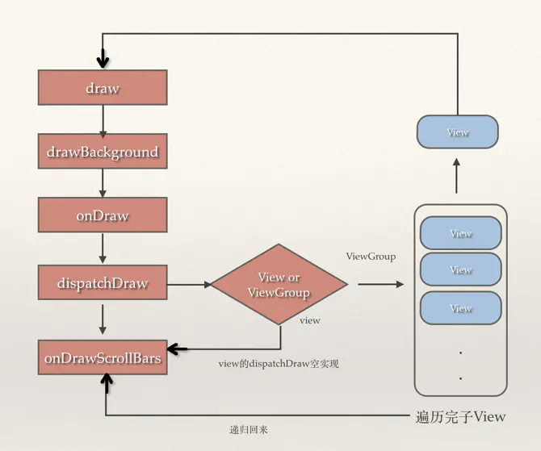

# 关键词

MeasureSpec、

# 一、前置知识

想要更好的理解View的绘制流程，需要先掌握Activity、Window、DecorView、ViewRootImpl等类之间关系。

# 二、Measure过程

对于测量首先还是得认识几个基本知识点：

##  1、对 MeasureSpec 的理解

对于View的测量，肯定会和MeasureSpec接触，MeasureSpec翻译过来是“测量规格”或者“测量参数”，官方文档对它的定义是“**一个MeasureSpec封装了从父容器传递给子容器的测量要求**”，MeasureSpec是由父View的MeasureSpec和子View的LayoutParams通过简单的计算得出的一个针对子View的测量要求。

这么说不是很好理解，后面看着代码就很好理解了。

> 本质上就是一个Bean类，封装了两个值：size和mode，由父View创建，用来给子View测量时使用的。

MeasureSpec是一个大小和模式的组合值，MeasureSpec中的值是一个由size和mode合成的int整数（32位），高两位是mode，后30位是size，这样组合是为了减少对象的分配开支。MeasureSpec 类似于下图，只不过这边用的是十进制数，而MeasureSpec 是二进制存储的。


**注：-1 代表的是EXACTLY，-2 是AT_MOST**

- MeasureSpec一共有三种模式

  **UNSPECIFIED**：未指定。父容器对于子容器没有任何限制，子容器想要多大就多大，一般设置为0。
  **EXACTLY**：父容器已经为子容器设置了尺寸，子容器应当服从这些边界，不论子容器想要多大的空间。
  **AT_MOST**：定义了最大值。子容器可以是声明大小内的任意大小。

这样说不是很好理解，尤其是这三种模式还和 MATCH_PARENT和WRAP_CONTENT 联系在一起。

如果从代码上来看view.measure(int widthMeasureSpec, int heightMeasureSpec) 的两个MeasureSpec是父类传递过来的，但并不完全是父View的要求，而是父View的MeasureSpec和子View自己的LayoutParams共同决定的，而子View的 LayoutParams 就是我们在xml中设置的layout_width和 layout_height 转化而来的。

## 2、测量的过程

先简单阐述一下View树的测量过程：

从performTraversals()开始，其中执行了performMeasure(childWidthMeasureSpec, childHeightMeasureSpec);方法。

```java
ViewRootImpl.java
	private void performMeasure(int childWidthMeasureSpec, int childHeightMeasureSpec) {
        if (mView == null) {
            return;
        }
            // step1：mView是DecorView。
            mView.measure(childWidthMeasureSpec, childHeightMeasureSpec);
    }

    public final void measure(int widthMeasureSpec, int heightMeasureSpec) {
        // measure ourselves, this should set the measured dimension flag back
        // step2：这里要考虑多态，即onMeasure()是可以被重写的。
        onMeasure(widthMeasureSpec, heightMeasureSpec);
    }
```

childWidthMeasureSpec，childHeightMeasureSpec：这两个参数是什么？从何而来？

step1：mView是当前Activity的根布局DecorView，发起measure。

step2：从View.measure()开始，会执行到其onMeasure()方法。注意View中的measure方法是final的，因此所有View的measure()过程都是一样的。下面看一下onMeasure()方法的实现：

```java
// step2.1 View.java的onMeasure()的默认实现
    protected void onMeasure(int widthMeasureSpec, int heightMeasureSpec) {
        setMeasuredDimension(getDefaultSize(getSuggestedMinimumWidth(), widthMeasureSpec),
                getDefaultSize(getSuggestedMinimumHeight(), heightMeasureSpec));
    }

    public static int getDefaultSize(int size, int measureSpec) {
        int result = size;
        int specMode = MeasureSpec.getMode(measureSpec);
        int specSize = MeasureSpec.getSize(measureSpec);

        switch (specMode) {
        case MeasureSpec.UNSPECIFIED:
            result = size;
            break;
        case MeasureSpec.AT_MOST:
        case MeasureSpec.EXACTLY:
            result = specSize;
            break;
        }
        return result;
    }
```

直接看View#onMeasure()、getDefaultSize()方法或许还不太容易理解，因为measureSpec是由父View传给子View的，如果不知道父View传过来的是什么，代表什么含义，那就不能深刻理解为什么要这么处理。因此我们需要先分析父View的onMeasure()，我们就顺着DecorView的onMeasure()往下看。

> 因为onMeasure方法可以重写，也是经常被重写的，因此看代码时要注意看具体的View是否重写了。

## 3、DecorView的测量过程

```java
DecorView.java
	@Override
    protected void onMeasure(int widthMeasureSpec, int heightMeasureSpec) {
    ...
        super.onMeasure(widthMeasureSpec, heightMeasureSpec);
    }
FrameLayout.java
    @Override
    protected void onMeasure(int widthMeasureSpec, int heightMeasureSpec) {
        int count = getChildCount();

        final boolean measureMatchParentChildren =
                MeasureSpec.getMode(widthMeasureSpec) != MeasureSpec.EXACTLY ||
                MeasureSpec.getMode(heightMeasureSpec) != MeasureSpec.EXACTLY;
        mMatchParentChildren.clear();

        int maxHeight = 0;
        int maxWidth = 0;
        int childState = 0;
// 遍历测量子View
        for (int i = 0; i < count; i++) {
            final View child = getChildAt(i);
            if (mMeasureAllChildren || child.getVisibility() != GONE) {
                // step2.2 通过measureChildWithMargins测量子View
                measureChildWithMargins(child, widthMeasureSpec, 0, heightMeasureSpec, 0);
                final LayoutParams lp = (LayoutParams) child.getLayoutParams();
                maxWidth = Math.max(maxWidth,
                        child.getMeasuredWidth() + lp.leftMargin + lp.rightMargin);
                maxHeight = Math.max(maxHeight,
                        child.getMeasuredHeight() + lp.topMargin + lp.bottomMargin);
                childState = combineMeasuredStates(childState, child.getMeasuredState());
                // step3.1 这里把布局是match_parent的子View收集起来，后面父View有了宽高后，再测一遍子View。
                if (measureMatchParentChildren) {
                    if (lp.width == LayoutParams.MATCH_PARENT ||
                            lp.height == LayoutParams.MATCH_PARENT) {
                        mMatchParentChildren.add(child);
                    }
                }
            }
        }

        // Account for padding too
        maxWidth += getPaddingLeftWithForeground() + getPaddingRightWithForeground();
        maxHeight += getPaddingTopWithForeground() + getPaddingBottomWithForeground();

        // Check against our minimum height and width
        maxHeight = Math.max(maxHeight, getSuggestedMinimumHeight());
        maxWidth = Math.max(maxWidth, getSuggestedMinimumWidth());

        // Check against our foreground's minimum height and width
        final Drawable drawable = getForeground();
        if (drawable != null) {
            maxHeight = Math.max(maxHeight, drawable.getMinimumHeight());
            maxWidth = Math.max(maxWidth, drawable.getMinimumWidth());
        }

    // step2.3 子View测量结束后，测量自己，然后View树的测量结束。
        setMeasuredDimension(resolveSizeAndState(maxWidth, widthMeasureSpec, childState),
                resolveSizeAndState(maxHeight, heightMeasureSpec,
                        childState << MEASURED_HEIGHT_STATE_SHIFT));
    
// step3.2 这里对所有match_parent的子View再进行一次测量，因为此时父View的宽高已经测量出来的，也就可以确认子View的宽高了。
        count = mMatchParentChildren.size();
        if (count > 1) {
            for (int i = 0; i < count; i++) {
                final View child = mMatchParentChildren.get(i);
                final MarginLayoutParams lp = (MarginLayoutParams) child.getLayoutParams();

                final int childWidthMeasureSpec;
                if (lp.width == LayoutParams.MATCH_PARENT) {
                    final int width = Math.max(0, getMeasuredWidth()
                            - getPaddingLeftWithForeground() - getPaddingRightWithForeground()
                            - lp.leftMargin - lp.rightMargin);
                    childWidthMeasureSpec = MeasureSpec.makeMeasureSpec(
                            width, MeasureSpec.EXACTLY);
                } else {
                    childWidthMeasureSpec = getChildMeasureSpec(widthMeasureSpec,
                            getPaddingLeftWithForeground() + getPaddingRightWithForeground() +
                            lp.leftMargin + lp.rightMargin,
                            lp.width);
                }

                final int childHeightMeasureSpec;
                if (lp.height == LayoutParams.MATCH_PARENT) {
                    final int height = Math.max(0, getMeasuredHeight()
                            - getPaddingTopWithForeground() - getPaddingBottomWithForeground()
                            - lp.topMargin - lp.bottomMargin);
                    childHeightMeasureSpec = MeasureSpec.makeMeasureSpec(
                            height, MeasureSpec.EXACTLY);
                } else {
                    childHeightMeasureSpec = getChildMeasureSpec(heightMeasureSpec,
                            getPaddingTopWithForeground() + getPaddingBottomWithForeground() +
                            lp.topMargin + lp.bottomMargin,
                            lp.height);
                }

                child.measure(childWidthMeasureSpec, childHeightMeasureSpec);
            }
        }
    }
```

从以上的代码可以得出结论：测量的过程是从View树的根节点（DecorView）发起的，但是因为其依赖于子View的结果（宽高），因此先测子View，等子View的结果出来后，再测量父View，即View树的测量结果会从下往上返回给父View。

总结一下FrameLayout的onMeasure是如何测量的：

1. 测量子View。（通过measureChildWithMargins方法）
2. 测量自己（父View）。（通过resolveSizeAndState(maxWidth, widthMeasureSpec, childState)方法）
3. 再一次测量match_parent的子View。

下面来分析下这几步是如果做的，首先看子View的测量。

## 4、measureChildWithMargins()方法

```java
ViewGroup.java
protected void measureChildWithMargins(View child, int parentWidthMeasureSpec, int widthUsed, int parentHeightMeasureSpec, int heightUsed) { 

// 子View的LayoutParams，在xml设置的layout_width和layout_height,
// layout_xxx的值最后都会封装到这个LayoutParams中。
// 我目前困惑的是这里不会强制类型转换错误吗？
final MarginLayoutParams lp = (MarginLayoutParams) child.getLayoutParams(); 

// 根据父View的测量规格和父View自己的Padding，以及子View的Margin和已经用掉的空间大小（widthUsed），就能算出子View的MeasureSpec，具体计算过程看getChildMeasureSpec方法。
final int childWidthMeasureSpec = getChildMeasureSpec(parentWidthMeasureSpec,            
mPaddingLeft + mPaddingRight + lp.leftMargin + lp.rightMargin + widthUsed, lp.width);    

final int childHeightMeasureSpec = getChildMeasureSpec(parentHeightMeasureSpec,           
mPaddingTop + mPaddingBottom + lp.topMargin + lp.bottomMargin  + heightUsed, lp.height);  

// 通过父View的MeasureSpec和子View的LayoutParams的计算，算出子View的MeasureSpec，然后从父容器传递给子容器
// 之后让子View用这个MeasureSpec（一个测量要求，比如不能超过多大）去测量自己，如果子View是ViewGroup 那还会递归往下测量。
child.measure(childWidthMeasureSpec, childHeightMeasureSpec);
}   
```

1. 为子View计算出一个MeasureSpec
2. 子View执行测量

可以看到，在测量子View之前，父View是要先算为子View算出来一个MeasureSpec的，然后传递给子View。下面看一下这个给子View使用的MeasureSpec是如何计算出来的。

### 4.1、getChildMeasureSpec()

> 这一步是理解测量过程的关键，理解了MeasureSpec的含义，基本测量过程就明朗了。

为子View算出一个MeasureSpec，这个MeasureSpec的意义是什么呢？即父View告诉子View你的最大值是多少（AT_MOST+size）；或者告诉子View你已经有一个确定的值了（EXACTLY+size），可以直接使用啦；或者告诉子View，为父啥也不干，你自己算一下吧（0+UNSPECIFIED）。

```java
ViewGroup.java
// spec参数   表示父View的MeasureSpec 
// padding参数    父View的Padding+子View的Margin，父View的大小减去这些边距，才能精确算出
//               子View的MeasureSpec的size
// childDimension参数  表示该子View内部LayoutParams属性的值（lp.width或者lp.height）
//                    可以是wrap_content、match_parent、一个精确指(an exactly size),  
public static int getChildMeasureSpec(int spec, int padding, int childDimension) {  
    int specMode = MeasureSpec.getMode(spec);  //获得父View的mode  
    int specSize = MeasureSpec.getSize(spec);  //获得父View的大小  

    // note1：size的含义。
    // 父View的大小-自己的Padding+子View的Margin，得到值才是子View的大小。
    // 这个size就是子View的最大值了。
    int size = Math.max(0, specSize - padding);   
  
    int resultSize = 0;    //初始化值，最后通过这个两个值生成子View的MeasureSpec
    int resultMode = 0;    //初始化值，最后通过这个两个值生成子View的MeasureSpec
  
    switch (specMode) {  
    // Parent has imposed an exact size on us  
    //1、父View是EXACTLY的 ！  
    case MeasureSpec.EXACTLY:   
        //1.1、子View的width或height是个精确值 (an exactly size)  
        if (childDimension >= 0) {            
            resultSize = childDimension;         //size为精确值  
            resultMode = MeasureSpec.EXACTLY;    //mode为 EXACTLY 。  
        }   
        //1.2、子View的width或height为 MATCH_PARENT/FILL_PARENT   
        else if (childDimension == LayoutParams.MATCH_PARENT) {  
            // Child wants to be our size. So be it.  
            resultSize = size;                   //size为父视图大小  
            resultMode = MeasureSpec.EXACTLY;    //mode为 EXACTLY 。  
        }   
        //1.3、子View的width或height为 WRAP_CONTENT  
        else if (childDimension == LayoutParams.WRAP_CONTENT) {  
            // Child wants to determine its own size. It can't be  
            // bigger than us.  
            resultSize = size;                   //size为父视图大小  
            resultMode = MeasureSpec.AT_MOST;    //mode为AT_MOST 。  
        }  
        break;  
  
    // Parent has imposed a maximum size on us  
    //2、父View是AT_MOST的 ！      
    case MeasureSpec.AT_MOST:  
        //2.1、子View的width或height是个精确值 (an exactly size)  
        if (childDimension >= 0) {  
            // Child wants a specific size... so be it  
            resultSize = childDimension;        //size为精确值  
            resultMode = MeasureSpec.EXACTLY;   //mode为 EXACTLY 。  
        }  
        //2.2、子View的width或height为 MATCH_PARENT/FILL_PARENT  
        else if (childDimension == LayoutParams.MATCH_PARENT) {  
            // Child wants to be our size, but our size is not fixed.  
            // Constrain child to not be bigger than us.  
            resultSize = size;                  //size为父视图大小  
            resultMode = MeasureSpec.AT_MOST;   //mode为AT_MOST  
        }  
        //2.3、子View的width或height为 WRAP_CONTENT  
        else if (childDimension == LayoutParams.WRAP_CONTENT) {  
            // Child wants to determine its own size. It can't be  
            // bigger than us.  
            resultSize = size;                  //size为父视图大小  
            resultMode = MeasureSpec.AT_MOST;   //mode为AT_MOST  
        }  
        break;  
  
    // Parent asked to see how big we want to be  
    //3、父View是UNSPECIFIED的 ！  
    case MeasureSpec.UNSPECIFIED:  
        //3.1、子View的width或height是个精确值 (an exactly size)  
        if (childDimension >= 0) {  
            // Child wants a specific size... let him have it  
            resultSize = childDimension;        //size为精确值  
            resultMode = MeasureSpec.EXACTLY;   //mode为 EXACTLY  
        }  
        //3.2、子View的width或height为 MATCH_PARENT/FILL_PARENT  
        else if (childDimension == LayoutParams.MATCH_PARENT) {  
            // Child wants to be our size... find out how big it should  
            // be  
            resultSize = 0;                        //size为0！ ,其值未定  
            resultMode = MeasureSpec.UNSPECIFIED;  //mode为 UNSPECIFIED  
        }   
        //3.3、子View的width或height为 WRAP_CONTENT  
        else if (childDimension == LayoutParams.WRAP_CONTENT) {  
            // Child wants to determine its own size.... find out how  
            // big it should be  
            resultSize = 0;                        //size为0! ，其值未定  
            resultMode = MeasureSpec.UNSPECIFIED;  //mode为 UNSPECIFIED  
        }  
        break;  
    }  
    //根据上面逻辑条件获取的mode和size构建MeasureSpec对象。  
    return MeasureSpec.makeMeasureSpec(resultSize, resultMode);  
} 
```

首先解释一下，**注释note1：size的含义**。

```java
// parentWidthMeasureSpec，父View的MeasureSpec
// specSize，父View的测量size
// padding，mPaddingLeft + mPaddingRight + lp.leftMargin + lp.rightMargin + widthUsed
getChildMeasureSpec(parentWidthMeasureSpec, mPaddingLeft + mPaddingRight + lp.leftMargin + lp.rightMargin + widthUsed, lp.width);

int size = Math.max(0, specSize - padding);   
```

通过一张图来展示：


下面我通过一个表格来总结一下上面的代码是如何计算子View的MeasureSpec的：

| 父mode\子尺寸           | childDimension >= 0                                          | LayoutParams.MATCH_PARENT                                    | LayoutParams.WRAP_CONTENT                                    |
| ----------------------- | ------------------------------------------------------------ | ------------------------------------------------------------ | ------------------------------------------------------------ |
| MeasureSpec.EXACTLY     | resultSize = childDimension; resultMode = MeasureSpec.EXACTLY; | resultSize = size; resultMode = MeasureSpec.EXACTLY;         | resultSize = size; resultMode = MeasureSpec.AT_MOST;         |
| MeasureSpec.AT_MOST     | resultSize = childDimension; resultMode = MeasureSpec.EXACTLY; | resultSize = size; resultMode = MeasureSpec.AT_MOST;         | resultSize = size; resultMode = MeasureSpec.AT_MOST;         |
| MeasureSpec.UNSPECIFIED | resultSize = childDimension; resultMode = MeasureSpec.EXACTLY; | resultSize = View.sUseZeroUnspecifiedMeasureSpec ? 0 : size; resultMode = MeasureSpec.UNSPECIFIED; | resultSize = View.sUseZeroUnspecifiedMeasureSpec ? 0 : size; resultMode = MeasureSpec.UNSPECIFIED; |


这样可以看到：

情况一：当子View的宽高是指定好了的（childDimension >= 0），那直接用指定的值就ok了，不需要考虑父View是什么模式。因此上面的代码还是可以优化一下的，可以把这种情况合并一下，减少重复代码，看着也跟清晰一些。那还剩下6种情况。


情况二：父View是MeasureSpec.UNSPECIFIED，就是说父View也是未指定的。这样的话，子View也不用没有必要算了，为什么呢？因为这时候父View的情况不知道（即没有约束），那算出来的值也就没意义了，不知道最大值，可能比父View还大。因此设为size = 0；mode = UNSPECIFIED即可，然后待会让子View自己算。OK，还剩下四种。


情况三：父mode是MeasureSpec.EXACTLY时，即知道父View的确定值。也就知道了子View的最大值。

如果子View为MATCH_PARENT：那子View的大小最大为size，也是子View想要的，也是确定的。

如果子View为WRAP_CONTENT：这个时候只能知道子View的最大值为size。使用MeasureSpec.AT_MOST表达。还剩两种。


情况四：父mode是MeasureSpec.AT_MOST时，也就是只知道父View的最大值。

这种情况呢，不管子View是MATCH_PARENT还是WRAP_CONTENT，只能测量出子View的最大值是多少，因此宽高为size，mode为AT_MOST。

小结：

因此，MeasureSpec的作用就是告诉子View，你的确定值是多少（childDimension或size+EXACTLY）；或者你的最大值是多少（size+AT_MOST）；或者未指定（0+UNSPECIFIED），你自己去算。

最后，将计算出的这个size和mode封装到MeasureSpec中，交给子View计算宽高。

## 5、View.measure的默认实现

最开始的时候就是调用DecorView的measure方法开始测量的。测量过程主要是在onMeasure()方法。现在我们可以回过头看看最开始View的onMeasure的默认实现了。

```java
View.java
protected void onMeasure(int widthMeasureSpec, int heightMeasureSpec) {    
  setMeasuredDimension(
  getDefaultSize(getSuggestedMinimumWidth(), widthMeasureSpec),            
  getDefaultSize(getSuggestedMinimumHeight(), heightMeasureSpec));
}
```

直接调用setMeasuredDimension()进行设值，这两个值设置完成了，就意味着这个View的测量结束了，View的宽高已经有测量的结果了。如果我们想设定某个View的高宽，完全可以直接通过setMeasuredDimension（100，200）来设置死它的高宽（不建议），但是setMeasuredDimension方法必须在onMeasure方法中调用，不然会抛异常。我们来看下对于View来说它的默认高宽是怎么获取的。

```java
View.java
// 获取的是android:minHeight属性的值或者View背景图片的大小值
protected int getSuggestedMinimumWidth() { 
   return (mBackground == null) ? mMinWidth : max(mMinWidth, mBackground.getMinimumWidth()); 
}
// @param size参数一般表示设置了android:minHeight属性或者该View背景图片的大小值  
public static int getDefaultSize(int size, int measureSpec) {    
   int result = size;    
   int specMode = MeasureSpec.getMode(measureSpec);    
   int specSize = MeasureSpec.getSize(measureSpec);    
   switch (specMode) {    
   case MeasureSpec.UNSPECIFIED:        // 表示该View的大小父视图未定，设置为默认值
     result = size;  
     break;    
   case MeasureSpec.AT_MOST:
   case MeasureSpec.EXACTLY:        
     result = specSize;  
     break;   
 }    
return result;
}
```

getDefaultSize的参数解释：

第一个参数size：等于getSuggestedMinimumXXXX返回的的值，也就是建议的最小宽度和高度，当measureSpec为UNSPECIFIED时，就使用这个值。

第二个参数measureSpec：是父View传给自己的，是使用父View的measureSpec和子View的LayoutParams算出来的，具体计算的原理前面介绍过了，子View是可以直接使用的。从前面的表格中可以知道，此时子View的mode如果为EXACTLY，那specSize就是个确定值，可以直接使用；如果是AT_MOST，那specSize就是子View的最大值，直接使用。如果是UNSPECIFIED，那就需要子View自己算，即使用getSuggestedMinimumWidth的值。

对于View默认是测量很简单，大部分情况就是拿计算出来的MeasureSpec的size 当做最终测量的大小。而对于其他的一些View的派生类，如TextView、Button、ImageView等，它们的onMeasure方法系统了都做了重写，不会这么简单直接拿 MeasureSpec 的size来当大小，而去会先去测量字符或者图片的高度等，然后拿到View本身content这个高度（字符高度等），如果MeasureSpec是AT_MOST，而且View本身content的高度不超出MeasureSpec的size，那么可以直接用View本身content的高度（字符高度等），而不是像View.java 直接用MeasureSpec的size做为View的大小。

到这里，子View的测量过程就结束了，我们可以继续看下ViewGroup（我们还是分析DecorView）是怎么测量自己的了。即第三节中的，DecorView的测量过程的测量自己的部分。

## 6、DecorView（父View）测量自己

DecorView是使用了的FrameLayout的onMeasure方法。

```java
// FrameLayout 的测量
protected void onMeasure(int widthMeasureSpec, int heightMeasureSpec) {  
....
int maxHeight = 0;
    // 用于保存DecorView的最大宽度
int maxWidth = 0;
int childState = 0;
for (int i = 0; i < count; i++) {    
   final View child = getChildAt(i);    
   if (mMeasureAllChildren || child.getVisibility() != GONE) {   
    // 遍历自己的子View，只要不是GONE的都会参与测量，measureChildWithMargins方法在最上面
    // 的源码已经讲过了，如果忘了回头去看看，基本思想就是父View把自己的MeasureSpec 
    // 传给子View结合子View自己的LayoutParams 算出子View 的MeasureSpec，然后继续往下传，
    // 传递叶子节点，叶子节点没有子View，根据传下来的这个MeasureSpec测量自己就好了。
                measureChildWithMargins(child, widthMeasureSpec, 0, heightMeasureSpec, 0);
                final LayoutParams lp = (LayoutParams) child.getLayoutParams();
       // 遍历过程中，maxWidth会不断更新，记录下子View的最大宽度。
                maxWidth = Math.max(maxWidth,
                        child.getMeasuredWidth() + lp.leftMargin + lp.rightMargin);
                maxHeight = Math.max(maxHeight,
                        child.getMeasuredHeight() + lp.topMargin + lp.bottomMargin);
                childState = combineMeasuredStates(childState, child.getMeasuredState());
                // step3.1 这里把布局是match_parent的子View收集起来，后面父View有了宽高后，再测一遍子View。
                if (measureMatchParentChildren) {
                    if (lp.width == LayoutParams.MATCH_PARENT ||
                            lp.height == LayoutParams.MATCH_PARENT) {
                        mMatchParentChildren.add(child);
                    }
                }
            }
        }

    // maxWidth最大值还要加上padding
        // Account for padding too
        maxWidth += getPaddingLeftWithForeground() + getPaddingRightWithForeground();
        maxHeight += getPaddingTopWithForeground() + getPaddingBottomWithForeground();
	// 检验一遍，是否比自己要求的最小值大
        // Check against our minimum height and width
        maxHeight = Math.max(maxHeight, getSuggestedMinimumHeight());
        maxWidth = Math.max(maxWidth, getSuggestedMinimumWidth());
	// 再检验一遍，是否比全景图片大，总之就是要保证此ViewGroup要能够容纳下所有内容。
        // Check against our foreground's minimum height and width
        final Drawable drawable = getForeground();
        if (drawable != null) {
            maxHeight = Math.max(maxHeight, drawable.getMinimumHeight());
            maxWidth = Math.max(maxWidth, drawable.getMinimumWidth());
        }
    
    // step2.3 子View测量结束后，测量自己，然后View树的测量结束。
    // 所有的孩子测量之后，经过一系类的计算之后通过setMeasuredDimension设置自己的宽高，
//对于FrameLayout 可能用最大的字View的大小，对于LinearLayout，可能是高度的累加，
//具体测量的原理去看看源码。总的来说，父View是等所有的子View测量结束之后，再来测量自己。
        setMeasuredDimension(resolveSizeAndState(maxWidth, widthMeasureSpec, childState),
                resolveSizeAndState(maxHeight, heightMeasureSpec,
                        childState << MEASURED_HEIGHT_STATE_SHIFT));
....
}  
```

setMeasuredDimension方法已经知道了，就是把测量出来的值，设置一下。主要来看resolveSizeAndState()方法是如何计算父View的宽高的，此方法也是由View.java提供的，也就是说，这个时候还是把父View当成一个普通的View来处理的。

```java
View.java
    public static int resolveSizeAndState(int size, int measureSpec, int childMeasuredState) {
        final int specMode = MeasureSpec.getMode(measureSpec);
        final int specSize = MeasureSpec.getSize(measureSpec);
        final int result;
        switch (specMode) {
            case MeasureSpec.AT_MOST:
                if (specSize < size) {
                    result = specSize | MEASURED_STATE_TOO_SMALL;
                } else {
                    result = size;
                }
                break;
            case MeasureSpec.EXACTLY:
                result = specSize;
                break;
            case MeasureSpec.UNSPECIFIED:
            default:
                result = size;
        }
        return result | (childMeasuredState & MEASURED_STATE_MASK);
    }
```

有了前面的分析，现在还看这个就很好理解了，共三种情况，

EXACTLY，直接使用父View的specSize。

AT_MOST：父View告诉了个最大值，因此判断一下，当前View的大小是否超过，超过了就就标记上一个MEASURED_STATE_TOO_SMALL，大小的话还是使用specSize。如果没有超过，就使用自己算出来的。

UNSPECIFIED：未指定，使用自己算的。

到这里，父View的大小也就测量好了。

## 7、处理子View为match_parent的情况

通过前面的测量可以知道，当子View为match_parent时，有这么几种情况：


EXACTLY已经知道确定值了，无需再算；UNSPECIFIED在子View测量的时候，也计算了，使用子View的minSize或者背景的最小值，因此也无需再算。所以主要是想要处理AT_MOST这种情况，因为之前子View只知道一个最大值是多少，现在经过第6步的计算，已经测量了父View的大小了，所以也就可以在把子View的大小确定一下。

```java
FrameLayout.java
    @Override
    protected void onMeasure(int widthMeasureSpec, int heightMeasureSpec) {
        int count = getChildCount();
        int maxHeight = 0;
        int maxWidth = 0;
        int childState = 0;
		// 遍历测量子View
        for (int i = 0; i < count; i++) {
            final View child = getChildAt(i);
            if (mMeasureAllChildren || child.getVisibility() != GONE) {
                // 测量子View
                measureChildWithMargins(child, widthMeasureSpec, 0, heightMeasureSpec, 
                // 把布局是match_parent的子View收集起来，后面父View有了宽高后，再测一遍子View。
                if (measureMatchParentChildren) {
                    if (lp.width == LayoutParams.MATCH_PARENT ||
                            lp.height == LayoutParams.MATCH_PARENT) {
                        mMatchParentChildren.add(child);
                    }
                }
            }
        }

    // 测量自己（父View）
        setMeasuredDimension(resolveSizeAndState(maxWidth, widthMeasureSpec, childState),
                resolveSizeAndState(maxHeight, heightMeasureSpec,
                        childState << MEASURED_HEIGHT_STATE_SHIFT));
    
	// 再次测量 match_parent的子View
        count = mMatchParentChildren.size();
        if (count > 1) {
            for (int i = 0; i < count; i++) {
                final View child = mMatchParentChildren.get(i);
                final MarginLayoutParams lp = (MarginLayoutParams) child.getLayoutParams();

                final int childWidthMeasureSpec;
                if (lp.width == LayoutParams.MATCH_PARENT) {
                    // 子View的宽度 = 父View的宽度 - padding - margin
                    final int width = Math.max(0, getMeasuredWidth()
                            - getPaddingLeftWithForeground() - getPaddingRightWithForeground()
                            - lp.leftMargin - lp.rightMargin);
                    // 将 mode 设置为 EXACTLY
                    childWidthMeasureSpec = MeasureSpec.makeMeasureSpec(
                            width, MeasureSpec.EXACTLY);
                } else {
                    childWidthMeasureSpec = getChildMeasureSpec(widthMeasureSpec,
                            getPaddingLeftWithForeground() + getPaddingRightWithForeground() +
                            lp.leftMargin + lp.rightMargin,
                            lp.width);
                }
// height类似
                。。。

                child.measure(childWidthMeasureSpec, childHeightMeasureSpec);
            }
        }
    }
```

到此为止，基本把Measure 主要原理都过了一遍，主要是以DecorView的绘制流程为例，分析了一下，其他View也是类似的。

下面总结一下测量流程：

父View发起测量 -》父View为子View计算一个MeasureSpce-》子View测量完成-》父View测量完成-》再次测量match_parent的子View-》测量结束。

接下来通过一个实例来讲解整个measure的过程。

# 示例

## Measure流程示例

首先看下面的代码：

```java
<?xml version="1.0" encoding="utf-8"?>
<LinearLayout  xmlns:android="http://schemas.android.com/apk/res/android"    
   android:id="@+id/linear"
   android:layout_width="match_parent"    
   android:layout_height="wrap_content"
   android:layout_marginTop="50dp"
   android:background="@android:color/holo_blue_dark"    
   android:paddingBottom="70dp"    
   android:orientation="vertical">    
   <TextView        
    android:id="@+id/text"       
    android:layout_width="match_parent"     
    android:layout_height="wrap_content"  
    android:background="@color/material_blue_grey_800"       
    android:text="TextView"        
    android:textColor="@android:color/white"        
    android:textSize="20sp" />    
   <View       
      android:id="@+id/view"       
     android:layout_width="match_parent" 
     android:layout_height="150dp"    
     android:background="@android:color/holo_green_dark" />
</LinearLayout>
```

上面的代码对应的布局是下面的一张图


整个图是一个DecorView，DecorView是整个页面的根View，DecorView是一个FrameLayout，包含两个子View，一个id=statusBarBackground的View和一个是LineaLayout。id=statusBarBackground的View，可以先不管。

另一个LinearLayout比较重要，它包含一个title和一个content，title是TitleBar或者ActionBar。content是一个FrameLayout，Id是android.R.id.content，通过setContentView()方法设置的View会成为content的直接子View。

整个View的布局图如下：


这张图在分析measure时，会经常用到，主要用于了解递归的时候 view 的measure顺序

>  1、 header的是个ViewStub，用来惰性加载ActionBar，为了便于分析整个测量过程，把Theme设成NoActionBar，这样可以忽略掉ActionBar 的测量，避免ActionBar 相关的measure干扰整个过程，在调试代码时更清晰。
>  2、包含Header(ActionBar）和id/content 的那个父View，我不知道叫什么名字好，我们姑且叫它ViewRoot（看上图），它是垂直的LinearLayout，放着整个页面除statusBar 的之外所有的东西。

既然我们知道整个View的Root是DecorView，那么View的绘制是从哪里开始的呢？我们知道每个Activity 均会创建一个 PhoneWindow 对象，是Activity和整个View系统交互的接口，每个Window都对应着一个View和一个ViewRootImpl，Window和View通过ViewRootImpl来建立联系，对于Activity来说，ViewRootImpl是连接WindowManager和DecorView的纽带，绘制的入口是由ViewRootImpl的performTraversals方法来发起Measure，Layout，Draw等流程的。

> todo：ViewRootImpl#performTraversals 的首次调用是在哪？后续如何调用？

ViewRootImpl的performTraversals 方法：

```java
private void performTraversals() { 
...... 
int childWidthMeasureSpec = getRootMeasureSpec(mWidth, lp.width); 
int childHeightMeasureSpec = getRootMeasureSpec(mHeight, lp.height); 
...... 
mView.measure(childWidthMeasureSpec, childHeightMeasureSpec); 
......
mView.layout(0, 0, mView.getMeasuredWidth(), mView.getMeasuredHeight());
...... 
mView.draw(canvas); 
......
}

private static int getRootMeasureSpec(int windowSize, int rootDimension) { 
   int measureSpec; 
   switch (rootDimension) { 
   case ViewGroup.LayoutParams.MATCH_PARENT: 
   // Window can't resize. Force root view to be windowSize.   
   measureSpec = MeasureSpec.makeMeasureSpec(windowSize,MeasureSpec.EXACTLY);
   break; 
   ...... 
  } 
 return measureSpec; 
}
```

View的绘制从DecorView开始，在mView.measure()的时候调用getRootMeasureSpec获得两个MeasureSpec做为参数，getRootMeasureSpec的两个参数（mWidth, lp.width）mWidth和mHeight 是屏幕的宽度和高度， lp是WindowManager.LayoutParams，它的lp.width和lp.height的默认值是MATCH_PARENT，所以通过getRootMeasureSpec 生成的测量规格MeasureSpec 的mode是EXACTLY ，size是屏幕的宽高。

> todo：代码中，什么地方可以确定`mWidth和mHeight 是屏幕的宽度和高度`、`lp.width和lp.height的默认值是MATCH_PARENT`

因为DecorView 是一个FrameLayout，那么接下来会进入FrameLayout 的measure方法，measure的两个参数是通过getRootMeasureSpec生成的两个MeasureSpec，DecorView的测量开始了。

### DecorView测量

首先是DecorView 的 MeasureSpec ，根据上面的分析DecorView 的 MeasureSpec是Windows传过来的，我们画出DecorView 的MeasureSpec 图：


1、-1 代表的是EXACTLY，-2 是AT_MOST
2、由于屏幕的像素是1440x2560，所以DecorView 的MeasureSpec的size 对应于这两个值

那么接下来在 FrameLayout 的onMeasure()方法中，**DecorView开始for循环测量自己的子View，测量完所有的子View再来测量自己**，由下图可知，接下来要测量ViewRoot的大小：

> todo：DecorView为什么要先测量子View，再测量自己呢？


```java
//FrameLayout 的测量
protected void onMeasure(int widthMeasureSpec, int heightMeasureSpec) {  
....
int maxHeight = 0;
int maxWidth = 0;
int childState = 0;
for (int i = 0; i < count; i++) {    
   final View child = getChildAt(i);    
   if (mMeasureAllChildren || child.getVisibility() != GONE) {   
    // 遍历自己的子View，只要不是GONE的都会参与测量，measureChildWithMargins方法在最上面
    // 的源码已经讲过了，如果忘了回头去看看，基本思想就是父View把自己当MeasureSpec 
    // 传给子View结合子View自己的LayoutParams 算出子View 的MeasureSpec，然后继续往下传，
    // 传递叶子节点，叶子节点没有子View，只要负责测量自己就好了。
     measureChildWithMargins(child, widthMeasureSpec, 0, heightMeasureSpec, 0);      
     ....
     ....
   }
}
....
}  
```

### 测量 ViewRoot

DecorView 测量 ViewRoot 的时候把自己的widthMeasureSpec和heightMeasureSpec传进去了，接下来去看measureChildWithMargins的源码

```java
protected void measureChildWithMargins(View child, int parentWidthMeasureSpec, int widthUsed, int parentHeightMeasureSpec, int heightUsed) { 

final MarginLayoutParams lp = (MarginLayoutParams) child.getLayoutParams();   

final int childWidthMeasureSpec = getChildMeasureSpec(parentWidthMeasureSpec,            
mPaddingLeft + mPaddingRight + lp.leftMargin + lp.rightMargin + widthUsed, lp.width);    

final int childHeightMeasureSpec = getChildMeasureSpec(parentHeightMeasureSpec,           
mPaddingTop + mPaddingBottom + lp.topMargin + lp.bottomMargin  + heightUsed, lp.height);  
child.measure(childWidthMeasureSpec, childHeightMeasureSpec);
}
```

ViewRoot 是系统的View，它的LayoutParams默认都是match_parent，根据最开始MeasureSpec 的计算规则，ViewRoot 的MeasureSpec mode应该等于EXACTLY（DecorView MeasureSpec 的mode是EXACTLY，ViewRoot的layoutparams 是match_parent），size 也等于DecorView的size，所以ViewRoot的MeasureSpec图如下：


算出ViewRoot的MeasureSpec 之后，开始调用ViewRoot.measure 方法去测量ViewRoot的大小，然而ViewRoot是一个LinearLayout ，ViewRoot.measure最终会执行的LinearLayout 的onMeasure 方法，LinearLayout 的onMeasure 方法又开始逐个测量它的子View，上面的measureChildWithMargins方法又会被调用，那么根据View的层级图，接下来测量的是header（ViewStub），由于header的Gone，所以直接跳过不做测量工作，所以接下来轮到ViewRoot的第二个child content（android.R.id.content）,我们要算出这个content 的MeasureSpec，所以又要拿ViewRoot 的MeasureSpec 和 android.R.id.content的LayoutParams 做计算了，计算过程就是调用getChildMeasureSpec的方法，


```java
protected void measureChildWithMargins(View child, int parentWidthMeasureSpec, int widthUsed, int parentHeightMeasureSpec, int heightUsed) { 
   .....
   final int childHeightMeasureSpec = getChildMeasureSpec(parentHeightMeasureSpec,           
mPaddingTop + mPaddingBottom + lp.topMargin + lp.bottomMargin  + heightUsed, lp.height);  
   ....
}

public static int getChildMeasureSpec(int spec, int padding, int childDimension) {  
    int specMode = MeasureSpec.getMode(spec);  //获得父View的mode  
    int specSize = MeasureSpec.getSize(spec);  //获得父View的大小  
  
    int size = Math.max(0, specSize - padding); //父View的大小-自己的Padding+子View的Margin，得到值才是子View可能的最大值。  
     .....
}
```

由上面的代码**int size = Math.max(0, specSize - padding);**
而 **padding=mPaddingTop + mPaddingBottom + lp.topMargin + lp.bottomMargin  + heightUsed**
算出android.R.id.content 的MeasureSpec 的size，由于ViewRoot 的mPaddingBottom=100px(这个可能和状态栏的高度有关，我们测量的最后会发现id/statusBarBackground的View的高度刚好等于100px，ViewRoot 是系统的View的它的Padding 我们没法改变，所以计算出来Content（android.R.id.content） 的MeasureSpec 的高度少了100px ，它的宽高的mode 根据算出来也是EXACTLY（ViewRoot 是EXACTLY和android.R.id.content  是match_parent）。所以Content（android.R.id.content）的MeasureSpec 如下（高度少了100px）：


Content（android.R.id.content） 是FrameLayout，递归调用开始准备计算id/linear的MeasureSpec，我们先给出结果：


图中有两个要注意的地方：
 1、id/linear的heightMeasureSpec 的mode=AT_MOST，因为id/linear 的LayoutParams 的layout_height="wrap_content"
 2、id/linear的heightMeasureSpec  的size 少了200px, 由上面的代码
 padding=mPaddingTop + mPaddingBottom + lp.topMargin + lp.bottomMargin  + heightUsed;
 int size = Math.max(0, specSize - padding);
由于id/linear 的 android:layout_marginTop="50dp"  使得lp.topMargin=200px (本设备的density=4，px=4*pd)，在计算后id/linear的heightMeasureSpec  的size 少了200px。（布局代码前面已给出，可自行查看id/linear 控件xml中设置的属性）

linear.measure接着往下算linear的子View的的MeasureSpec，看下View 层级图，往下走应该是id/text,接下来是计算id/text的MeasureSpec，直接看图，mode=AT_MOST ,size 少了280，别问我为什么 ...specSize - padding.


算出id/text 的MeasureSpec 后，接下来text.measure(childWidthMeasureSpec, childHeightMeasureSpec);准备测量id/text 的高宽，这时候已经到底了，id/text是TextView，已经没有子类了，这时候跳到TextView的onMeasure方法了。TextView 拿着刚才计算出来的heightMeasureSpec（mode=AT_MOST,size=1980）,这个就是对TextView的高度和宽度的约束，进到TextView 的onMeasure(widthMeasureSpec,heightMeasureSpec) 方法，在onMeasure 方法执行调试过程中，我们发现下面的代码：


TextView字符的高度（也就是TextView的content高度[wrap_content]）测出来=107px，107px 并没有超过1980px(允许的最大高度)，所以实际测量出来TextView的高度是107px。
最终算出id/text 的mMeasureWidth=1440px,mMeasureHeight=107px。

贴一下布局代码，免得你忘了具体布局。

```java
<?xml version="1.0" encoding="utf-8"?>
<LinearLayout  xmlns:android="http://schemas.android.com/apk/res/android"    
   android:id="@+id/linear"
   android:layout_width="match_parent"    
   android:layout_height="wrap_content"    
   android:layout_marginTop="50dp"    
   android:background="@android:color/holo_blue_dark"    
   android:paddingBottom="70dp"    
   android:orientation="vertical">    
   <TextView        
    android:id="@+id/text"       
    android:layout_width="match_parent"     
    android:layout_height="wrap_content"  
    android:background="@color/material_blue_grey_800"       
    android:text="TextView"        
    android:textColor="@android:color/white"        
    android:textSize="20sp" />    
   <View       
      android:id="@+id/view"       
     android:layout_width="match_parent" 
     android:layout_height="150dp"    
     android:background="@android:color/holo_green_dark" />
</LinearLayout>
```

TextView的高度已经测量出来了，接下来测量id/linear的第二个child（id/view），同样的原理测出id/view的MeasureSpec.


id/view的MeasureSpec 计算出来后，调用view.measure(childWidthMeasureSpec, childHeightMeasureSpec)的测量id/view的高宽，之前已经说过View measure的默认实现是

```java
protected void onMeasure(int widthMeasureSpec, int heightMeasureSpec) {    
  setMeasuredDimension(
  getDefaultSize(getSuggestedMinimumWidth(), widthMeasureSpec),            
  getDefaultSize(getSuggestedMinimumHeight(), heightMeasureSpec));
}
```

最终算出id/view的mMeasureWidth=1440px,mMeasureHeight=600px。

id/linear 的子View的高度都计算完毕了，接下来id/linear就通过所有子View的测量结果计算自己的高宽，id/linear是LinearLayout，所有它的高度计算简单理解就是子View的高度的累积+自己的Padding.


最终算出id/linear的mMeasureWidth=1440px,mMeasureHeight=987px。

最终算出id/linear出来后，id/content 就要根据它唯一的子View id/linear 的测量结果和自己的之前算出的MeasureSpec一起来测量自己的结果，具体计算的逻辑去看FrameLayout onMeasure 函数的计算过程。以此类推，接下来测量ViewRoot，然后再测量id/statusBarBackground，虽然不知道id/statusBarBackground 是什么，但是调试的过程中，测出的它的高度=100px, 和 id/content 的paddingTop 刚好相等。在最后测量DecorView 的高宽，最终整个测量过程结束。所有的View的大小测量完毕。所有的getMeasureWidth 和 getMeasureHeight 都已经有值了。Measure 分析到此为止。

## Layout过程

layout的主要作用 ：**根据子视图的大小以及布局参数将View树放到合适的位置上**。

```java
mView.measure(childWidthMeasureSpec, childHeightMeasureSpec); 
......
mView.layout(0, 0, mView.getMeasuredWidth(), mView.getMeasuredHeight());
```

performTraversals 方法执行完mView.measure 计算出mMeasuredXXX后就开始执行layout 函数来确定View具体放在哪个位置，我们计算出来的View目前只知道view矩阵的大小，具体这个矩阵放在哪里，这就是layout 的工作了。

既然是通过mView.layout(0, 0, mView.getMeasuredWidth(), mView.getMeasuredHeight()); 那我们来看下layout 函数做了什么，我们直接看下ViewGroup 的layout函数，ViewGroup 重写了View.layout，对动画的情况做了一下处理。

```java
public final void layout(int l, int t, int r, int b) {    
   if (!mSuppressLayout && (mTransition == null || !mTransition.isChangingLayout())) {        
    if (mTransition != null) {            
       mTransition.layoutChange(this);        
    }       
    super.layout(l, t, r, b);    
    } else {        
    // record the fact that we noop'd it; request layout when transition finishes        
      mLayoutCalledWhileSuppressed = true;    
   }
}
```

代码可以看个大概，LayoutTransition是用于处理ViewGroup增加和删除子视图的动画效果，也就是说如果当前ViewGroup未添加LayoutTransition动画，或者LayoutTransition动画此刻并未运行，那么调用super.layout(l, t, r, b)，继而调用到ViewGroup中的onLayout，否则将mLayoutSuppressed设置为true，等待动画完成时再调用requestLayout()。
这个函数是 final 不能重写，所以ViewGroup的子类都会调用这个函数，layout 的具体实现是在super.layout(l, t, r, b)里面做的，那么我接下来看一下View类的layout函数

```java
 public final void layout(int l, int t, int r, int b) {
       .....
      //设置View位于父视图的坐标轴
       boolean changed = setFrame(l, t, r, b); 
       //判断View的位置是否发生过变化，看有必要进行重新layout吗
       if (changed || (mPrivateFlags & LAYOUT_REQUIRED) == LAYOUT_REQUIRED) {
           if (ViewDebug.TRACE_HIERARCHY) {
               ViewDebug.trace(this, ViewDebug.HierarchyTraceType.ON_LAYOUT);
           }
           //调用onLayout(changed, l, t, r, b); 函数
           onLayout(changed, l, t, r, b);
           mPrivateFlags &= ~LAYOUT_REQUIRED;
       }
       mPrivateFlags &= ~FORCE_LAYOUT;
       .....
   }
```

1、setFrame(l, t, r, b) 可以理解为给mLeft 、mTop、mRight、mBottom赋值，然后基本就能确定View自己在父视图的位置了，这几个值构成的矩形区域就是该View显示的位置，这里的具体位置都是相对于父视图的位置。

2、回调onLayout，对于View来说，onLayout只是一个空实现，一般情况下我们也不需要重载该函数：

```java
protected void onLayout(boolean changed, int left, int top, int right, int bottom) {  

    }  
```

对于ViewGroup 来说，唯一的差别就是ViewGroup中多了关键字abstract的修饰，要求其子类必须重载onLayout函数。

```java
@Override  
protected abstract void onLayout(boolean changed,  
        int l, int t, int r, int b); 
```

而重载onLayout的目的就是安排其children在父视图的具体位置，那么如何安排子View的具体位置呢？

```java
 int childCount = getChildCount() ; 
  for(int i=0 ;i<childCount ;i++){
       View child = getChildAt(i) ;
       //整个layout()过程就是个递归过程
       child.layout(l, t, r, b) ;
    }
```

代码很简单，就是遍历自己的孩子，然后调用  child.layout(l, t, r, b) ，给子view 通过setFrame(l, t, r, b) 确定位置，而重点是(l, t, r, b) 怎么计算出来的呢。还记得我们之前测量过程，测量出来的MeasuredWidth和MeasuredHeight吗？还记得你在xml 设置的Gravity吗？还有RelativeLayout 的其他参数吗，没错，就是这些参数和MeasuredHeight、MeasuredWidth 一起来确定子View在父视图的具体位置的。具体的计算过程大家可以看下最简单FrameLayout 的onLayout 函数的源码，每个不同的ViewGroup  的实现都不一样，这边不做具体分析了。

3、MeasuredWidth和MeasuredHeight这两个参数为layout过程提供了一个很重要的依据（如果不知道View的大小，你怎么固定四个点的位置呢），但是这两个参数也不是必须的，layout过程中的4个参数l, t, r, b完全可以由我们任意指定，而View的最终的布局位置和大小（mRight - mLeft=实际宽或者mBottom-mTop=实际高）完全由这4个参数决定，measure过程得到的mMeasuredWidth和mMeasuredHeight提供了视图大小测量的值，但我们完全可以不使用这两个值，所以measure过程并不是必须的。如果我们不使用这两个值，那么getMeasuredWidth() 和getWidth() 就很有可能不是同一个值，它们的计算是不一样的：

```java
public final int getMeasuredWidth() {  
        return mMeasuredWidth & MEASURED_SIZE_MASK;  
    }  
public final int getWidth() {  
        return mRight - mLeft;
    }
```

layout 过程相对简单些，分析就到此为止。

## Draw过程

performTraversals 方法的下一步就是mView.draw(canvas); 因为View的draw 方法一般不去重写，官网文档也建议不要去重写draw 方法，所以下一步执行就是View.java的draw 方法，我们来看下源码：

```java
public void draw(Canvas canvas) {
    ...
        /*
         * Draw traversal performs several drawing steps which must be executed
         * in the appropriate order:
         *
         *      1. Draw the background
         *      2. If necessary, save the canvas' layers to prepare for fading
         *      3. Draw view's content
         *      4. Draw children
         *      5. If necessary, draw the fading edges and restore layers
         *      6. Draw decorations (scrollbars for instance)
         */

        // Step 1, draw the background, if needed
    ...
        background.draw(canvas);
    ...
        // skip step 2 & 5 if possible (common case)
    ...
        // Step 2, save the canvas' layers
    ...
        if (solidColor == 0) {
            final int flags = Canvas.HAS_ALPHA_LAYER_SAVE_FLAG;

            if (drawTop) {
                canvas.saveLayer(left, top, right, top + length, null, flags);
            }
    ...
        // Step 3, draw the content
        if (!dirtyOpaque) onDraw(canvas);

        // Step 4, draw the children
        dispatchDraw(canvas);

        // Step 5, draw the fade effect and restore layers

        if (drawTop) {
            matrix.setScale(1, fadeHeight * topFadeStrength);
            matrix.postTranslate(left, top);
            fade.setLocalMatrix(matrix);
            canvas.drawRect(left, top, right, top + length, p);
        }
    ...
        // Step 6, draw decorations (scrollbars)
        onDrawScrollBars(canvas);
    }
```

注释写得比较清楚，一共分成6步，看到注释没有（  // skip step 2 & 5 if possible (common case)）除了2 和 5之外 我们一步一步来看：
 1、**第一步：背景绘制**

```java
private void drawBackground(Canvas canvas) { 
     Drawable final Drawable background = mBackground; 
      ...... 
     //mRight - mLeft, mBottom - mTop layout确定的四个点来设置背景的绘制区域 
     if (mBackgroundSizeChanged) { 
        background.setBounds(0, 0, mRight - mLeft, mBottom - mTop);   
        mBackgroundSizeChanged = false; rebuildOutline(); 
     } 
     ...... 
     //调用Drawable的draw() 把背景图片画到画布上
     background.draw(canvas); 
     ...... 
}
```

2、**第三步，对View的内容进行绘制。**
 onDraw(canvas) 方法是view用来draw 自己的，具体如何绘制，颜色线条什么样式就需要子View自己去实现，View.java 的onDraw(canvas) 是空实现，ViewGroup 也没有实现，每个View的内容是各不相同的，所以需要由子类去实现具体逻辑。

3、**第4步 对当前View的所有子View进行绘制**
dispatchDraw(canvas) 方法是用来绘制子View的，View.java 的dispatchDraw()方法是一个空方法,因为View没有子View,不需要实现dispatchDraw ()方法，ViewGroup就不一样了，它实现了dispatchDraw ()方法：

```java
 @Override
 protected void dispatchDraw(Canvas canvas) {
       ...
        if ((flags & FLAG_USE_CHILD_DRAWING_ORDER) == 0) {
            for (int i = 0; i < count; i++) {
                final View child = children[i];
                if ((child.mViewFlags & VISIBILITY_MASK) == VISIBLE || child.getAnimation() != null) {
                    more |= drawChild(canvas, child, drawingTime);
                }
            }
        } else {
            for (int i = 0; i < count; i++) {
                final View child = children[getChildDrawingOrder(count, i)];
                if ((child.mViewFlags & VISIBILITY_MASK) == VISIBLE || child.getAnimation() != null) {
                    more |= drawChild(canvas, child, drawingTime);
                }
            }
        }
      ......
    }
```

代码一眼看出，就是遍历子View然后drawChild()，drawChild()方法实际调用的是子View.draw()方法，ViewGroup类已经为我们实现绘制子View的默认过程，这个实现基本能满足大部分需求，所以ViewGroup类的子类（LinearLayout,FrameLayout）也基本没有去重写dispatchDraw方法，我们在实现自定义控件，除非比较特别，不然一般也不需要去重写它， drawChild()的核心过程就是为子视图分配合适的cavas剪切区，剪切区的大小正是由layout过程决定的，而剪切区的位置取决于滚动值以及子视图当前的动画。设置完剪切区后就会调用子视图的draw()函数进行具体的绘制了。

4、**第6步 对View的滚动条进行绘制**
不是重点，知道有这东西就行，onDrawScrollBars 的一句注释 ：*Request the drawing of the horizontal and the vertical scrollbar. The  scrollbars are painted only if they have been awakened first.*

一张图看下整个draw的递归流程。



到此整个绘制过程基本讲述完毕了。


# 问题

## 一、绘制流程

<font color='orange'>Q：View的绘制流程（原理）？</font>

主要就是讲一下measure、layout、draw分别干了什么。然后MeasureSpec发挥的作用。

在View类中的话，主要涉及到3个方法。

onMesure()，onLayout()，onDraw()。

onMesure()，计算View的大小，即宽高

onLayout()，计算View要显示的位置

onDraw()，绘制

见 **【总结篇】View的绘制流程.md**。

<font color='orange'>Q：View的第一次绘制是怎么调到的？</font>

measure，layout和draw。View的绘制流程是在Window添加过程中，ViewRootImpl类的setView方法开始的。

```java
ActivityThread.java
	@Override
    public void handleResumeActivity(IBinder token, boolean finalStateRequest, boolean isForward,
            String reason) {
        final ActivityClientRecord r = performResumeActivity(token, finalStateRequest, reason);
        if (r.window == null && !a.mFinished && willBeVisible) {
            r.window = r.activity.getWindow();
            View decor = r.window.getDecorView();
            decor.setVisibility(View.INVISIBLE);
            ViewManager wm = a.getWindowManager();
            WindowManager.LayoutParams l = r.window.getAttributes();

            if (a.mVisibleFromClient) {
                if (!a.mWindowAdded) {
                    a.mWindowAdded = true;
                    wm.addView(decor, l);
                }
            }
        }
    }
WindowManagerImpl.java
    private final WindowManagerGlobal mGlobal = WindowManagerGlobal.getInstance();    
    @Override
    public void addView(@NonNull View view, @NonNull ViewGroup.LayoutParams params) {
        mGlobal.addView(view, params, mContext.getDisplayNoVerify(), mParentWindow,
                mContext.getUserId());
    }
WindowManagerGlobal.java
    public void addView(View view, ViewGroup.LayoutParams params,
            Display display, Window parentWindow, int userId) {
        ViewRootImpl root;
    
            root = new ViewRootImpl(view.getContext(), display);
            view.setLayoutParams(wparams);
    
            mViews.add(view);
            mRoots.add(root);
            mParams.add(wparams);
    
            try {
                root.setView(view, wparams, panelParentView, userId);
            } 
        }
    }
```

在handleResumeActivity中，通过wm.addView()把DecorView添加到WindowManager，最终调用到ViewRootImpl.setView()。

```java
    /**
     * We have one child
     */
    public void setView(View view, WindowManager.LayoutParams attrs, View panelParentView,
            int userId) {
        synchronized (this) {
                // Schedule the first layout -before- adding to the window
                // manager, to make sure we do the relayout before receiving
                // any other events from the system.
                requestLayout();            
        }
    }       

    @Override
    public void requestLayout() {
        if (!mHandlingLayoutInLayoutRequest) {
            checkThread();
            mLayoutRequested = true;
            scheduleTraversals();
        }
    }

    @UnsupportedAppUsage
    void scheduleTraversals() {
        if (!mTraversalScheduled) {
            mTraversalScheduled = true;
            mTraversalBarrier = mHandler.getLooper().getQueue().postSyncBarrier();
            mChoreographer.postCallback(
                    Choreographer.CALLBACK_TRAVERSAL, mTraversalRunnable, null);
            notifyRendererOfFramePending();
            pokeDrawLockIfNeeded();
        }
    }
```

最终会把执行ViewRootImpl#requestLayout()，这个方法会进行线程检测，调用scheduleTraversals，发出同步屏障消息，并把监听Vsync信号的绘制任务添加到mChoreographer，这样当mChoreographer中收到Vsync回调时，会使用Handler发出一条异步消息，来触发绘制任务。

<font color='orange'>Q：第一次绘制的消息是怎么发出来的？</font>

跟上一个一样。

<font color='orange'>Q：View的后续绘制是怎么调用的？</font>


<font color='orange'>Q：后边的绘制消息是怎么循环的？</font>


<font color='orange'>Q：View的onMeasure，onLayout，onDraw都分别用来干什么</font>

1. **measure（测量）**：这个阶段用于判断是否需要重新计算View的大小，如果需要，则计算View的宽高。
2. **layout（布局）**：这个阶段用于判断是否需要重新计算View的位置，如果需要，则计算View在父容器中的放置位置。
3. **draw（绘制）**：这个阶段用于判断是否需要重新绘制View，如果需要，则进行具体的绘制操作。绘制过程包括绘制背景、通过onDraw()方法绘制自身内容、通过dispatchDraw()方法绘制子View（如果有的话）以及绘制滚动条等。

<font color='orange'>Q：Measure、Layout、draw的流程、绘制顺序，基于这些说下TagLayout(FlowLayout)怎么写？</font>


<font color='orange'>Q：onMeasure怎么测量的？</font>

以FrameLayout为例，由父View发起，先为子View计算一个MS，再测子View，然后再测父View，最后父View测量完成后，再对match_parent类型的子View再进行一次测量。

三种模式：EXACTLY、AT_MOST、UNSPECIFIED。首先在为子View计算MS的时候会使用到，具体是结合子View的LayoutParams（布局参数）来计算的，MS的结果一共存在9种情况。

<font color='orange'>Q：MeasureSpec(MS)知道吗？</font>

1、是什么？用来做什么？

MeasureSpec是measure过程中给View使用的一个测量规格，或者说是测量约束，由mode和size 2 个部分构成，是从父View传递给子View。

View需要参考MeasureSpec来计算自己的测量结果measuredWidth和measuredHeight。

> todo：这两个值的作用是什么？

2、怎么生成？

分为ViewGroup和View。

ViewGroup：通过父View的MeasureSpec、padding、widthUse，再配合着子View的LayoutParams，有margin、子View设置的宽高计算得来的。

<font color='orange'>Q：MeasureSpec的三种模式？</font>

EXACTLY、AT_MOST、UNSPECIFIED。

<font color='orange'>Q：如何确定一个View的MS？那DecorView呢？</font>

MS是由父View为子View计算出来的一个测量约束。具体的计算是通过getChildMeasureSpec()方法，一共有9中情况。细细说一下。


<font color='orange'>Q：在oncreate里面可以得到View的宽高吗?</font>

不能。View是在handleResumeActivity()执行时，先执行onResume，然后才执行View的第一次绘制流程，因此在此之前都不能获取到View的真实宽高。

<font color='orange'>Q：在onResume中可以测量宽高么？</font>

分两种情况，首次打开和再次打开。

首次打开，不能。

再次打开，比如从桌面恢复时，可以获取到。

```kotlin
    @Override
    public void handleResumeActivity(ActivityClientRecord r, boolean finalStateRequest,
            boolean isForward, boolean shouldSendCompatFakeFocus, String reason) {
		// 这里会触发 onResume 的执行
        if (!performResumeActivity(r, finalStateRequest, reason)) {
            return;
        }
        
        // 而在后面才执行了 DecorView 的添加，并计算出 View 的宽高，所以在前面的 onResume 中获取不到宽高
        // 当然这是首次时，如果是已经打开的情况下，比如回到桌面后再进入，是可以获取到的
        View decor = r.window.getDecorView();
        decor.setVisibility(View.INVISIBLE);
        
        a.mWindowAdded = true;
        wm.addView(decor, l);
```


<font color='orange'>Q：onMeasure中不处理wrap_content，就会出现match_parent一样的效果的原因</font>

在onMeasure的过程中，在生成MS的时候，wrap_content会生成一个AT_MOST+size的MS，match_parent会生成一个EXACTLY+size的MS。在View默认的onMeasure方法中，对AT_MOST和EXACTLY的处理是一样的，都是使用的specSize，因此效果会一样。

<font color='orange'>Q：View的getwidth()和getMesuredWidth()有啥区别?</font>

getWidth()获取的是View当前真实的宽度，getMesuredWidth()获取的是当前View测量的宽度。getWidth()的值实在onLayout时赋值的，getMesuredWidth()的值是在完成onMeasure时赋值的。它们的大小不一定相等。为什么？这个还需要深入学一下。


<font color='orange'>Q：一个View被添加后第一个回调的方法是哪个?</font>

在ViewRootImpl中，当DecorView第一次添加时，会回调onAttachedToWindow(）。

```java
ViewRootImpl.java
private void performTraversals() {
。。。
if (mFirst) {
            host.dispatchAttachedToWindow(mAttachInfo, 0);
}
}
```

在ViewGroup中，会先回调View的onAttachedToWindow方法，然后回调onViewAdded()方法。

```java
    public void addView(View child, int index, LayoutParams params) {
...
        requestLayout();
        invalidate(true);
        addViewInner(child, index, params, false);
    }

    private void addViewInner(View child, int index, LayoutParams params,
            boolean preventRequestLayout) {
        if (ai != null && (mGroupFlags & FLAG_PREVENT_DISPATCH_ATTACHED_TO_WINDOW) == 0) {
            boolean lastKeepOn = ai.mKeepScreenOn;
            ai.mKeepScreenOn = false;
            // 这个最终会回调 onAttachedToWindow
            child.dispatchAttachedToWindow(mAttachInfo, (mViewFlags&VISIBILITY_MASK));

        }
        
		// 回调3
        dispatchViewAdded(child);
    }

    void dispatchAttachedToWindow(AttachInfo info, int visibility) {
        // 回调1
        onAttachedToWindow();

        // 回调2
        onVisibilityChanged(this, visibility);

        if ((mPrivateFlags&PFLAG_DRAWABLE_STATE_DIRTY) != 0) {
            // If nobody has evaluated the drawable state yet, then do it now.
            refreshDrawableState();
        }
        needGlobalAttributesUpdate(false);

        notifyEnterOrExitForAutoFillIfNeeded(true);
        notifyAppearedOrDisappearedForContentCaptureIfNeeded(true);
    }
```

## Inflate

<font color='orange'>Q：View.inflater过程与异步inflater（东方头条）</font>


<font color='orange'>Q：inflater为什么比自定义View慢？</font>

其中会执行XML解析和通过反射创建View。

<font color='orange'>Q：LayoutInflater#inflate的attrachToRoot 为true是什么意思？</font>

`attachToRoot`为`true`时，inflate加载的View对象将直接成为父视图组的一部分；为`false`时，返回的View对象不会立即附加到父视图组。

当我们不需要额外再做一些操作时，可以考虑用true直接添加；

如果还需要对新建的View进行一些处理时，考虑用false。

<font color='orange'>Q：View的渲染过程？</font>


<font color='orange'>Q：Android中View显示到设备上的流程。</font>


<font color='orange'>Q：GPU调试工具几个颜色值分别代码什么？</font>


## 二、刷新机制

<font color='orange'>Q：View的刷新机制（原理）？</font>


# 参考

[Android View的绘制流程](https://www.jianshu.com/p/5a71014e7b1b)

