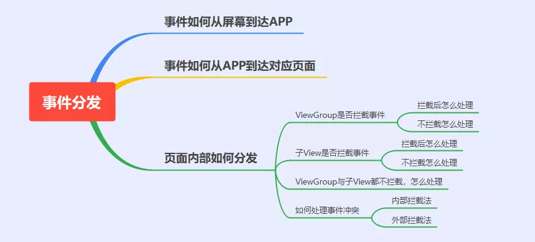
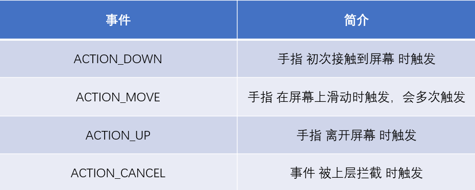
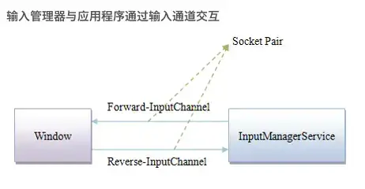
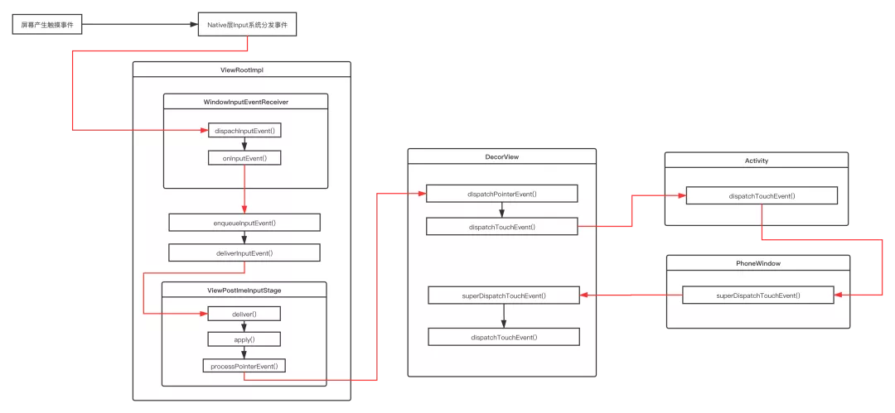
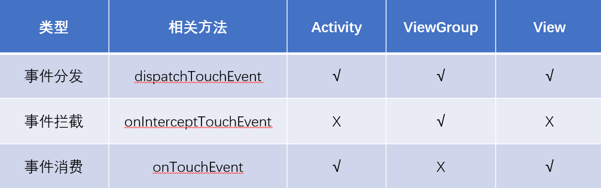

## 从触摸屏幕到App响应事件，都发生了什么，可以分为哪几个部分？

整个Touch事件可以分解为以下几个部分：

1. Touch事件如何从屏幕到我们的App。
2. Touch事件到达App后怎么传递到对应页面。
3. Touch事件到达对应页面后内部怎样分发。

其中与上层应用开发息息相关的是第3条，也是我们最关注的，它可以拆解为以下几个问题：

1. ViewGroup是否拦截事件，拦截与不拦截后分别怎么处理？

2. 子View是否拦截事件，拦截与不拦截后分别怎么处理？

3. ViewGroup与子View都不拦截，最终事件如何处理？

4. 如何处理事件冲突？




# 认识MotionEvent

当手指接触屏幕时，会先触发ActionDown一次，然后会触发一次或多次ActionMove，最后触发一次ActionUp，这些触摸动作，会被系统封装成一个MotionEvent对象，传给App处理。



事件分发中所分发的对象——MotionEvent。所谓事件分发，就是找到MotionEvent的处理者的过程。将MotionEvent传给指定的View或ViewGroup以判断是否处理，如果没有View和ViewGroup接收事件，会交给Activity处理。

# 一、Touch事件如何从屏幕到我们的App

## 1.1 硬件与内核部分

当我们触摸屏幕或者按键操作时，首先触发的是硬件驱动。
驱动收到事件后，将相应事件写入到输入设备节点，这便产生了最原生态的内核事件。
当屏幕被触摸，Linux内核会将硬件产生的触摸事件包装为Event存到/dev/input/event[x]目录下。

这样做的目的是将输入事件封装为通用的Event，供后续处理。

## 1.2 SystemServer部分

当系统启动时，在SystemServer进程中会启动一系列系统服务，如AMS、WMS等。以及管理事件输入的 InputManagerService，这个服务负责与硬件通信，接受屏幕输入事件。在其内部，会启动一个读线程，也就是 InputReader，它会从系统目录 /dev/input/ 拿到任务，并且分发给 InputDispatcher 线程，然后进行统一的事件分发调度。

## 1.3 跨进程通信传递给App

现在系统进程已经拿到输入事件了，但还需要传递给App进程，这就涉及到跨进程通信的部分。
我们的App中的Window与InputManagerService之间的通信实际上使用的是InputChannel，InputChannel是一个pipe，底层通过socket通信。
在Activity启动时会调用 ViewRootImpl.setView()，在ViewRootImpl.setView()过程中，会同时注册 InputChannel：

```java
public final class ViewRootImpl {

  public void setView(View view, WindowManager.LayoutParams attrs, View panelParentView) {
      requestLayout();
      // ...
      // 创建InputChannel
      mInputChannel = new InputChannel();
      // 通过Binder在SystemServer进程中完成InputChannel的注册
      mWindowSession.addToDisplay(mWindow, mSeq, mWindowAttributes,
                            getHostVisibility(), mDisplay.getDisplayId(),
                            mAttachInfo.mContentInsets, mAttachInfo.mStableInsets,
                            mAttachInfo.mOutsets, mInputChannel);
  }
}
```

这里涉及到了WindowManagerService和Binder跨进程通信，最终在SystemServer进程中，WindowManagerService根据当前的Window创建了SocketPair用于跨进程通信，同时并对App进程中传过来的InputChannel进行了注册。这之后，ViewRootImpl里的InputChannel就指向了正确的InputChannel，作为Client端，其fd与SystemServer进程中Server端的fd组成SocketPair，它们就可以双向通信了。



然后我们App进程的主线程就会监听socket客户端，当收到消息（输入事件）后，回调NativeInputEventReceiver.handleEvent()方法，最终会走到InputEventReceiver.dispachInputEvent方法。

经过以上操作App终于拿到输入事件了，接下来就是传递到对应页面。

## 1.4 小结

关于内核处理输入事件与跨进程通信的部分一般来说不是应用开发者最关注的部分，也不是本文的重点，所以只做了概述。
想要了解细节的同学可参考：[Input系统—事件处理全过程](http://gityuan.com/2016/12/31/input-ipc/)。

# 二、Touch事件到达App后怎么传递到对应页面

现在我们已经在App进程中拿到输入事件了，接下来看看事件如何分发到页面。下面跟一下源码。

## 2.1 事件回传到ViewRootImpl

```java
//InputEventReceiver.java
private void dispatchInputEvent(int seq, InputEvent event) {
    mSeqMap.put(event.getSequenceNumber(), seq);
    onInputEvent(event); 
}

//ViewRootImpl.java ::WindowInputEventReceiver
final class WindowInputEventReceiver extends InputEventReceiver {
    public void onInputEvent(InputEvent event) {
       enqueueInputEvent(event, this, 0, true); 
    }
}

//ViewRootImpl.java
void enqueueInputEvent(InputEvent event,
        InputEventReceiver receiver, int flags, boolean processImmediately) {
    adjustInputEventForCompatibility(event);
    QueuedInputEvent q = obtainQueuedInputEvent(event, receiver, flags);

    QueuedInputEvent last = mPendingInputEventTail;
    if (last == null) {
        mPendingInputEventHead = q;
        mPendingInputEventTail = q;
    } else {
        last.mNext = q;
        mPendingInputEventTail = q;
    }
    mPendingInputEventCount += 1;

    if (processImmediately) {
        doProcessInputEvents(); 
    } else {
        scheduleProcessInputEvents();
    }
}
```

可以看到事件还是回到了ViewRootImpl中，可见ViewRootImpl不仅负责界面的绘制，同时还负责事件的传递。

## 2.2 第一次责任链分发

接下来走到doProcessInputEvents中，其中涉及到事件分发中的第一次责任链分发。

```java
void doProcessInputEvents() {
    ...
    // Deliver all pending input events in the queue.
    while (mPendingInputEventHead != null) {
        QueuedInputEvent q = mPendingInputEventHead;
        mPendingInputEventHead = q.mNext;
        deliverInputEvent(q);
    }
    ....
}

private void deliverInputEvent(QueuedInputEvent q) {
    InputStage stage;
    ....
    //stage赋值操作
    ....
    if (stage != null) {
        stage.deliver(q);
    } else {
        finishInputEvent(q);
    }
}

abstract class InputStage {
    private final InputStage mNext;

    public InputStage(InputStage next) {
        mNext = next;
    }

    public final void deliver(QueuedInputEvent q) {
        if ((q.mFlags & QueuedInputEvent.FLAG_FINISHED) != 0) {
            forward(q);
        } else if (shouldDropInputEvent(q)) {
            finish(q, false);
        } else {
            traceEvent(q, Trace.TRACE_TAG_VIEW);
            final int result;
            try {
                result = onProcess(q);
            } finally {
                Trace.traceEnd(Trace.TRACE_TAG_VIEW);
            }
            apply(q, result);
        }
    }
}
```

如上所示：
1.QueuedInputEvent是一种输入事件，链表结构，遍历传递给InputStage。
2.InputStage是处理输入的责任链，在调用deliver时会遍历责任链传递事件。
3.事件分发完成后会调用finishInputEvent，告知SystemServer进程的InputDispatcher线程，最终将该事件移除，完成此次事件的分发消费。

那么问题来了，InputStage的责任链是什么时候组建的呢？

## 2.3 组装责任链

我们回到ViewRootImpl.setView方法中。

```java
public void setView(View view, WindowManager.LayoutParams attrs, View panelParentView) {
    synchronized (this) {
        ...
        // Set up the input pipeline.
        mSyntheticInputStage = new SyntheticInputStage();
        InputStage viewPostImeStage = new ViewPostImeInputStage(mSyntheticInputStage);
        InputStage nativePostImeStage = new NativePostImeInputStage(viewPostImeStage,
                 "aq:native-post-ime:" + counterSuffix);
        InputStage earlyPostImeStage = new EarlyPostImeInputStage(nativePostImeStage);
        InputStage imeStage = new ImeInputStage(earlyPostImeStage,
                "aq:ime:" + counterSuffix);
        InputStage viewPreImeStage = new ViewPreImeInputStage(imeStage);
        InputStage nativePreImeStage = new NativePreImeInputStage(viewPreImeStage,
                        "aq:native-pre-ime:" + counterSuffix);

        mFirstInputStage = nativePreImeStage;
        mFirstPostImeInputStage = earlyPostImeStage;
        ....
   }
}
```

可以看到在setView方法中，就把这条输入事件处理的责任链拼接完成了，不同的InputStage子类，通过构造方法一个个串联起来了，那这些InputStage到底干了啥呢？

**SyntheticInputStage**：综合处理事件阶段，比如处理导航面板、操作杆等事件。

**ViewPostImeInputStage**：视图输入处理阶段，比如按键、手指触摸等运动事件，我们熟知的view事件分发就发生在这个阶段。

**NativePostImeInputStage**：本地方法处理阶段，主要构建了可延迟的队列。

**EarlyPostImeInputStage**：输入法早期处理阶段。

**ImeInputStage**：输入法事件处理阶段，处理输入法字符。

**ViewPreImeInputStage**：视图预处理输入法事件阶段，调用视图view的dispatchKeyEventPreIme方法。

**NativePreImeInputStage**：本地方法预处理输入法事件阶段。

小结一下，事件到达应用端的主线程，会通过ViewRootImpl进行一系列InputStage来处理事件。这个阶段其实是对事件进行一些简单的分类处理，比如视图输入事件，输入法事件，导航面板事件等等。

View触摸事件发生在ViewPostImeInputStage阶段。

```java
final class ViewPostImeInputStage extends InputStage {
    @Override
    protected int onProcess(QueuedInputEvent q) {
        if (q.mEvent instanceof KeyEvent) {
            return processKeyEvent(q);
        } else {
            final int source = q.mEvent.getSource();
            if ((source & InputDevice.SOURCE_CLASS_POINTER) != 0) {
                return processPointerEvent(q);
            } 
        }
    }

private int processPointerEvent(QueuedInputEvent q) {
        final MotionEvent event = (MotionEvent)q.mEvent;
        boolean handled = mView.dispatchPointerEvent(event)
        return handled ? FINISH_HANDLED : FORWARD;
    }

//View.java
public final boolean dispatchPointerEvent(MotionEvent event) {
        if (event.isTouchEvent()) {
            return dispatchTouchEvent(event);
        } else {
            return dispatchGenericMotionEvent(event);
    }
}
```

1.经过层层回调会调用到mView.dispatchPointerEvent。
2.我们知道ViewRootImpl中的mView就是DecorView。

现在事件已经传递到了DecorView，也就是我们界面的根布局。接下来是事件在Activity，Window，DecorView中的传递。

## 2.4 事件在Activity，Window，DecorView中的传递

```java
// DecorView.java
@Override
public boolean dispatchTouchEvent(MotionEvent ev) {
    //cb其实就是对应的Activity/Dialog
    final Window.Callback cb = mWindow.getCallback();
    return cb != null && !mWindow.isDestroyed() && mFeatureId < 0
            ? cb.dispatchTouchEvent(ev) : super.dispatchTouchEvent(ev);
}

// Activity.java
public boolean dispatchTouchEvent(MotionEvent ev) {
    if (ev.getAction() == MotionEvent.ACTION_DOWN) {
        onUserInteraction();
    }
    if (getWindow().superDispatchTouchEvent(ev)) {
        return true;
    }
    return onTouchEvent(ev);
}

// PhoneWindow.java
@Override
public boolean superDispatchTouchEvent(MotionEvent event) {
    return mDecor.superDispatchTouchEvent(event);
}

// DecorView.java
public boolean superDispatchTouchEvent(MotionEvent event) {
    return super.dispatchTouchEvent(event);
}


	// Activity#onTouchEvent 实现
	/**
	*  当事件派发后，还没有被消费掉的话，就调用Activity#onTouchEvent方法进行处理。
	**/
    public boolean onTouchEvent(MotionEvent event) {
		//系统默认的处理是：
		//如果shouldCloseOnTouch返回true，就finish掉当前的Activity，并返回true，表示事件消费掉了
		//不然，就返回false，往下走
        if (mWindow.shouldCloseOnTouch(this, event)) {
            finish();
            return true;
        }

		//如果shouldCloseOnTouch返回false，返回false
        return false;
    }
```

可以看到事件分发经过了：DecorView -> Activity -> PhoneWindow -> DecorView。
看起来是一个很奇怪的事件流转，事件从DecorView出发，最后又回到了DecorView，为什么这样做呢？

### 2.4.1 为什么ViewRootImpl不直接把事件交给Activity？

主要是为了解藕。ViewRootImpl 并不知道有 Activity 存在！它只是持有了 DecorView。所以，不能直接把触摸事件送到Activity.dispatchTouchEvent()。

### 2.4.2 交给Acitivity后，为什么不直接交给DecorView开始分发事件呢?

因为 Activity 不知道有 DecorView！（但是在Android30中，Activity是持有了一个mDecor的。）
但是，Activity持有PhoneWindow ，而PhoneWindow当然知道自己的窗口里有些什么了，所以能够把事件派发给DecorView。在Android中，Activity并不知道自己的Window中有些什么，这样耦合性就很低了，Activity不需要知道Window中的具体内容。

## 2.5 小结

经过上述过程，事件终于到了我们熟悉的ViewGroup.dispatchTouchEvent。流程图如下所示：



# 三、Touch事件到达页面后内部怎样分发

在 View 和 ViewGroup 内部的事件分发从 dispatchTouchEvent 方法开始，ViewGroup.dispatchTouchEvent() 负责找到处理事件的View，View.dispatchTouchEvent() 负责将事件交给具体的方法（有onTouch/onTouchEvent/onClick等）进行处理。

## 3.1 ViewGroup是否拦截事件

事件通过 ViewGroup.dispatchTouchEvent() 给到 ViewGroup 后，ViewGroup 需要判断此事件是由自己处理、还是交给 child view 处理。

```java
@Override
public boolean dispatchTouchEvent(MotionEvent ev) {

    final boolean intercepted;
    // ActionDown 或者 mFirstTouchTarget 为空时会判断是否拦截
    if (actionMasked == MotionEvent.ACTION_DOWN|| mFirstTouchTarget != null) {
        final boolean disallowIntercept = (mGroupFlags & FLAG_DISALLOW_INTERCEPT) != 0;
        if (!disallowIntercept) {
            intercepted = onInterceptTouchEvent(ev);
        } 
    } 

    if (!canceled && !intercepted) {
        //事件传递给子view
        ....
        if (dispatchTransformedTouchEvent(ev, false, child, idBitsToAssign)) {
            ...
            //如果子View消耗了则给mFirstTouchTarget赋值
            newTouchTarget = addTouchTarget(child, idBitsToAssign);
            ...
        }
    }

    //mFirstTouchTarget不为空时会调用dispatchTransformendTouchEvent
    if (mFirstTouchTarget == null) {
        handled = dispatchTransformedTouchEvent(ev, canceled, null,
                    TouchTarget.ALL_POINTER_IDS);
    }
}

private boolean dispatchTransformedTouchEvent(View child) {
    if (child == null) {
        handled = super.dispatchTouchEvent(event);
    } else { 
        handled = child.dispatchTouchEvent(event);
    }
}
```

1、当 Action_Down 或者 mFirstTouchTarget 不为空时会判断是否拦截。down 为事件序列的开始，mFirstTouchTarget != null 意味着 down 事件已经有 View 接收处理了。

2、mFirstTouchTarget是个链表结构，代表某个子 View 消费了事件，为 null 则表示没有子 View 消费事件。

3、在判断是否拦截前有个 disallowIntercept 字段，这个在后面事件冲突内部拦截法时会用到。

4、接下来就到了 onInterceptTouchEvent，ViewGroup是否拦截事件正是由这个方法控制的。

### 3.1.1 ViewGroup拦截后会发生什么？

1、拦截之后，后续事件就不会再下发给子View。

2、接下来如果mFirstTouchTarget为null，则会调用到dispatchTransformedTouchEvent，然后调用到super.dispatchTouchEvent，最终到ViewGroup.onTouchEvent。

3、为什么使用mFirstTouchTarget==null来判断是否是ViewGroup处理，是因为mFirstTouchTarget==null有两种情况，一是ViewGroup拦截，二是子View没有处理事件，两种情况最后都回调到ViewGroup.onTouchEvent。

通过上面的分析，我们可以得出ViewGroup拦截的伪代码：

```java
public boolean dispatchTouchEvent(MotionEvent event) {
    boolean isConsume = false;
    if (isViewGroup) {
        if (onInterceptTouchEvent(event)) {
            isConsume = super.dispatchTouchEvent(event);
        } 
    } 
    return isConsume;
}
```

如果是ViewGroup，会先执行到onInterceptTouchEvent方法判断是否拦截，如果拦截，则执行父类View的dispatchTouchEvent方法。

### 3.1.2 ViewGroup不拦截会发生什么?

如果ViewGroup不拦截，则会传递到子View。

```java
if (!canceled && !intercepted) {
    if (actionMasked == MotionEvent.ACTION_DOWN
            || (split && actionMasked == MotionEvent.ACTION_POINTER_DOWN)
            || actionMasked == MotionEvent.ACTION_HOVER_MOVE) {
        final int childrenCount = mChildrenCount;
        //遍历子View
        if (newTouchTarget == null && childrenCount != 0) {
            for (int i = childrenCount - 1; i >= 0; i--) {
                final int childIndex = getAndVerifyPreorderedIndex(
                        childrenCount, i, customOrder);
                final View child = getAndVerifyPreorderedView(
                        preorderedList, children, childIndex);

                //2.判断事件坐标
                if (!child.canReceivePointerEvents()
                        || !isTransformedTouchPointInView(x, y, child, null)) {
                    ev.setTargetAccessibilityFocus(false);
                    continue;
                }

                //3.传递事件
                if (dispatchTransformedTouchEvent(ev, false, child, idBitsToAssign)) {
                    newTouchTarget = addTouchTarget(child, idBitsToAssign);
                    alreadyDispatchedToNewTouchTarget = true;
                    break;
                }
            }
        }
    }
}

private boolean dispatchTransformedTouchEvent(View child) {
    if (child == null) {
        handled = super.dispatchTouchEvent(event);
    } else { 
        handled = child.dispatchTouchEvent(event);
    }
}
```

如果不拦截，ViewGroup内主要做以下几件事：

1、遍历当前ViewGroup的所有子View，判断当前事件是否在当前子View的坐标范围内，不在范围内不能接收事件，直接跳过。

2、利用dispatchTransformedTouchEvent，如果返回true，则通过addTouchTarget对mFirstTouchTarget赋值。

3、dispatchTransformedTouchEvent做的主要就是两个事，如果child不为null，则事件分发到child，否则调用super.dispatchTouchEvent自己处理并返回结果。

4、mFirstTouchTarget是单链表结构，记录消费链，但是在单点触控的时候这个特性没有用上，只是一个普通的TouchTarget对象。

## 3.2 子View是否拦截

```java
public boolean dispatchTouchEvent(MotionEvent event) {

    if (onFilterTouchEventForSecurity(event)) {

        ListenerInfo li = mListenerInfo;
        if (li != null && li.mOnTouchListener != null
                && (mViewFlags & ENABLED_MASK) == ENABLED
                && li.mOnTouchListener.onTouch(this, event)) {
            result = true;
        }

        if (!result && onTouchEvent(event)) {
            result = true;
        }
    }
    return result;
}
```

1、如果设置了setOnTouchListener并且返回为true，那么onTouchEvent就不再执行。

2、否则执行onTouchEvent，常用的OnClickListenr就是在onTouchEvent里触发的。

默认情况下会直接执行onTouchEvent，如果我们设置了setOnClickListener或者setLongClickListener，都会触发。

### View#onTouchEvent的处理

```kotlin
    public boolean onTouchEvent(MotionEvent event) {

        final boolean clickable = ((viewFlags & CLICKABLE) == CLICKABLE
                || (viewFlags & LONG_CLICKABLE) == LONG_CLICKABLE)
                || (viewFlags & CONTEXT_CLICKABLE) == CONTEXT_CLICKABLE;
        
        if (clickable || (viewFlags & TOOLTIP) == TOOLTIP) {
            switch (action) {
                case MotionEvent.ACTION_UP:
                      if (mPerformClick == null) {
                           // 触发 onClick
                           mPerformClick = new PerformClick();
                      }
                   	if (!post(mPerformClick)) {
                        // 触发 onClick
                       performClickInternal();
                     }
        case MotionEvent.ACTION_DOWN:
            ...    
   		case MotionEvent.ACTION_MOVE:
                // 最终触发 onLongClick
               				checkForLongClick(
                                ViewConfiguration.getLongPressTimeout(),
                                x,
                                y,
                                TOUCH_GESTURE_CLASSIFIED__CLASSIFICATION__LONG_PRESS);
    }
            
	private final class PerformClick implements Runnable {
        @Override
        public void run() {
            performClickInternal();
        }
    }

    private boolean performClickInternal() {
        return performClick();
    }

    public boolean performClick() {
        final boolean result;
        final ListenerInfo li = mListenerInfo;
        if (li != null && li.mOnClickListener != null) {
            playSoundEffect(SoundEffectConstants.CLICK);
            li.mOnClickListener.onClick(this);
            result = true;
        } else {
            result = false;
        }
        return result;
    }
```

如果运行点击或者长按点击clickable，触发点击事件监听。

### 3.2.1 如果子View消费事件会怎么样？

上面说了，如果子View消费事件，即dispatchTouchEvent方法返回true，表示这个事件我处理了，那么事件从此结束，ViewGroup的dispatchTouchEvent也返回true，最后回到Activity的dispatchTouchEvent，也是直接返回true。

```java
//Activity.java
public boolean dispatchTouchEvent(MotionEvent ev) {
    if (ev.getAction() == MotionEvent.ACTION_DOWN) {
        onUserInteraction();
    }
    if (getWindow().superDispatchTouchEvent(ev)) {
        return true;
    }
    return onTouchEvent(ev);
}
```

小结：如果子View消费事件的话，事件就此结束了。

### 3.2.2 如果子View不消费事件会怎么样？

子View不拦截事件，那么mFirstTouchTarget就为null，退出循环后，调用dispatchTransformedTouchEvent方法。

```java
if (mFirstTouchTarget == null) {
    handled = dispatchTransformedTouchEvent(ev, canceled, null,
                TouchTarget.ALL_POINTER_IDS);
}
```

小结一下：
1、子View不处理事件，就回调到了dispatchTransformedTouchEvent。

2、然后就调到了super.dispatchTouchEvent。

3、那么接下来ViewGroup就跟子View的逻辑一样了，默认执行onTouchEvent，如果设置了setOnTouchLister则执行onTouch。

## 3.3 如果ViewGroup与子View都不拦截会怎么样

如果ViewGroup与子View都不拦截，即mFirstTouchTarget == null，dispatchTouchEvent也返回false。
再看看Activity的源码：

```java
public boolean dispatchTouchEvent(MotionEvent ev) {
    if (ev.getAction() == MotionEvent.ACTION_DOWN) {
        onUserInteraction();
    }
    if (getWindow().superDispatchTouchEvent(ev)) {
        return true;
    }
    return onTouchEvent(ev);
}
```

会执行Activity的onTouchEvent方法。

## 3.4 后续事件如何分发？

事件分发的处理者已经找到了，看起来任务已经完成了。但其实事件分发是包括ACTION_DOWN、ACTION_MOVE、ACTION_UP、ACTION_CANCEL的一系列事件，上面分析的都是Action_DOWN的过程。后续事件如何处理？

```java
public boolean dispatchTouchEvent(MotionEvent ev) {
    if (!canceled && !intercepted) {
    if (actionMasked == MotionEvent.ACTION_DOWN
                     || (split && actionMasked == MotionEvent.ACTION_POINTER_DOWN)
                     || actionMasked == MotionEvent.ACTION_HOVER_MOVE) {   
                     ...
                    //1.遍历子View
                    //2.判断是否在坐标范围
                    //3.分发事件，给mFirstTouchTarget赋值
                    //4.如果分发成功，alreadyDispatchedToNewTouchTarget赋值为true
                    ...      
        }

    if (mFirstTouchTarget == null) {
        handled = dispatchTransformedTouchEvent(ev, canceled, null,
                TouchTarget.ALL_POINTER_IDS);
    } else {
        TouchTarget target = mFirstTouchTarget;
        while (target != null) {
            final TouchTarget next = target.next;
            if (alreadyDispatchedToNewTouchTarget && target == newTouchTarget) {
                handled = true;
            } else {
                if (dispatchTransformedTouchEvent(ev, cancelChild,
                    target.child, target.pointerIdBits)) {
                       handled = true;
                }
            }
            predecessor = target;
            target = next;
        }
    }
}
```

从上可以看出：
1、后续的事件不会走对子View的循环判断的方法，因为已经找到了目标View，直接通过mFirstTouchTarget分发。

2、如果某个View开始处理拦截事件，后续事件序列只能由它处理。

## 3.5 小结

事件分发的本质就是一个递归方法，通过往下传递，调用dispatchTouchEvent方法，找到事件的处理者，这也就是项目中常见的责任链模式。

在分发过程中，ViewGroup通过onInterceptTouchEvent判断是否拦截事件。

在分发过程中，View的默认通过onTouchEvent处理事件。

如果底层View不消费，则默认一步步往上执行父元素onTouchEvent方法。

如果所有View的onTouchEvent方法都返回false，则最后会执行到Activity的onTouchEvent方法，事件分发也就结束了。


# 四、滑动冲突解决

我们在开发中经常会碰到滑动冲突的问题，比如一个页面同时有横向与竖向两个方向的滑动，这个时候就需要根据情况在Action_MOVE时对事件进行判断和拦截。

常见的滑动冲突解决方法有两种：

1. 外部拦截法。

2. 内部拦截法。

## 4.1 外部拦截法

外部拦截法的原理很简单，就是通过我们上面分析的onInterceptTouchEvent进行。

外部拦截法的模板代码如下：

```java
//外部拦截法：父view.java      
@Override
public boolean onInterceptTouchEvent(MotionEvent ev) {
    boolean intercepted = false;
    //父view拦截条件
    boolean parentCanIntercept;

    switch (ev.getActionMasked()) {
        case MotionEvent.ACTION_DOWN:
            intercepted = false;
            break;
        case MotionEvent.ACTION_MOVE:
            if (parentCanIntercept) {
                intercepted = true;
            } else {
                intercepted = false;
            }
            break;
        case MotionEvent.ACTION_UP:
            intercepted = false;
            break;
    }
    return intercepted;
}
```

如果 ACTION_DOWN 由子View处理，那么mFirstTouchTarget 也就不为 null 了， ViewGroup 对于后续的事件也会进行拦截判断，

如果不拦截，那么后续事件会直接分发给这个子View；

拦截的话，会给子View分发一个 ACTION_CANCEL 事件，并将mFirstTouchTarget设置为 null，意味着不由子 View 处理。下面来看看dispatchTouchEvent方法。

```java
public boolean dispatchTouchEvent(MotionEvent ev) {
    final boolean intercepted;
    if (actionMasked == MotionEvent.ACTION_DOWN|| mFirstTouchTarget != null) {
        //1.判断拦截
        intercepted = onInterceptTouchEvent(ev);
    } 

    // Dispatch to touch targets.
    if (mFirstTouchTarget == null) {
        //4.后续事件就直接交给ViewGroup处理了
        handled = dispatchTransformedTouchEvent(ev, canceled, null,
                    TouchTarget.ALL_POINTER_IDS);
    } else {
        while (target != null) {
            if (alreadyDispatchedToNewTouchTarget && target == newTouchTarget) {
                handled = true;
            } else {
                //2.cancelChild为ture
                final boolean cancelChild = resetCancelNextUpFlag(target.child)
                        || intercepted;
                if (dispatchTransformedTouchEvent(ev, cancelChild,
                    target.child, target.pointerIdBits)) {
                    handled = true;
                }
                if (cancelChild) {
                   if (predecessor == null) {
                       //3.mFirstTouchTarget被置为null
                       mFirstTouchTarget = next;
                   } else {
                       predecessor.next = next;
                   }
                   target.recycle();
                   target = next;
                   continue;
                }
            }
        }
    }
}

private boolean dispatchTransformedTouchEvent(MotionEvent event, boolean cancel,
        View child, int desiredPointerIdBits) {
    final boolean handled;
    if (cancel || oldAction == MotionEvent.ACTION_CANCEL) {
        event.setAction(MotionEvent.ACTION_CANCEL);
        if (child == null) {
            handled = super.dispatchTouchEvent(event);
        } else {
            handled = child.dispatchTouchEvent(event);
        }
        event.setAction(oldAction);
        return handled;
    }
}
```

1.首先通过onInterceptTouchEvent方法拦截事件。

2.intercepted为true导致cancelChild也为true，dispatchTransformedTouchEvent方法传递Action_CANCEL给子View。

3.cancelChild后将mFirstTouchTarget置为空。

4.mFirstTouchTarget为空后，后续的事件都由ViewGroup处理了。

综上就是外部拦截法能成功的原因。

## 4.2 内部拦截法

内部拦截法的模板代码。

```java
//父view.java            
@Override
public boolean onInterceptTouchEvent(MotionEvent ev) {
    if (ev.getActionMasked() == MotionEvent.ACTION_DOWN) {
        return false;
    } else {
      // 只要走到这里，就默认拦截，这时候可通过子 View 更改 disallowIntercept 值来控制拦截逻辑
        return true;
    }
}

//子view.java
@Override
public boolean dispatchTouchEvent(MotionEvent event) {
    //父view拦截条件
    boolean parentCanIntercept;

    switch (event.getActionMasked()) {
        case MotionEvent.ACTION_DOWN:
            getParent().requestDisallowInterceptTouchEvent(true);
            break;
        case MotionEvent.ACTION_MOVE:
            getParent().requestDisallowInterceptTouchEvent(!parentCanIntercept);
            break;
        case MotionEvent.ACTION_UP:
            break;
    }
    return super.dispatchTouchEvent(event);
}
```

内部拦截法是将主动权交给子View，如果子View需要事件就直接消耗，否则交给父容器处理。
内部拦截法主要通过requestDisallowInterceptTouchEvent方法控制。

我们看下为什么调用这个方式可以实现内部拦截。

```java
@Override
public boolean dispatchTouchEvent(MotionEvent ev) {

    final boolean intercepted;
    // ActionDown 或者 mFirstTouchTarget 为空时会判断是否拦截
    if (actionMasked == MotionEvent.ACTION_DOWN || mFirstTouchTarget != null) {
        final boolean disallowIntercept = (mGroupFlags & FLAG_DISALLOW_INTERCEPT) != 0;
        if (!disallowIntercept) {
            intercepted = onInterceptTouchEvent(ev);
        } 
    } 
}
```

1、子View通过requestDisallowInterceptTouchEvent控制mGroupFlags的值，进而控制disallowIntercept的值。

2、disallowIntercept 为true时就不会走到 onInterceptTouchEven 了 ，外部也就无法拦截了，当需要外部处理时，将disallowIntercept置为false即可。


# 问题

本文详细总结了事件分发机制从屏幕到View的详细过程，下面列出几个问题自测，方便判断是否真正掌握了这个知识点。

## framework 阶段事件传递

<font color='orange'>Q：点击屏幕上的按钮，如何传递到framework的</font>

InputManagerService，这个服务负责与硬件通信，接受屏幕输入事件。在其内部，会启动一个读线程，也就是 InputReader，它会从系统目录 /dev/input/ 拿到任务，并且分发给 InputDispatcher 线程，然后进行统一的事件分发调度。

<font color='orange'>Q：WMS click 事件传递</font>

事件到达 InputManagerService 后，Window （WMS）会与InputManagerService 通信，使用的是InputChannel，InputChannel是一个pipe，底层通过socket通信。
在Activity启动时会调用 ViewRootImpl.setView()，在ViewRootImpl.setView()过程中，会同时注册 InputChannel。

在 App 中，ViewRootImpl 会接收到输入事件，并进行后续的分发。

## 事件分发流程

<font color='orange'>Q：简单描述下事件是怎么从屏幕传递到View的。</font>

屏幕 -> IMS -> WMS -> ViewRootImpl -> DecorView。

<font color='orange'>Q：事件分发机制（流程），详细说下整个流程。</font>

如上文所述。

<font color='orange'>Q：为什么事件分发从DecorView -> Activity -> PhoneWindow -> DecorView。</font>


<font color='orange'>Q：事件处理：分发，拦截，处理。</font>

如上文所述。

<font color='orange'>Q：事件分发机制，如何下发，如何上传?</font>

下发：通过Activity#dispatchTouchEvent、DecorView#dispatchTouchEvent、ViewGroup#dispatchTouchEvent、View#dispatchTouchEvent依次传递；

上传：如果 View 没有处理事件，即 onTouchEvent 返回 false，那会执行父View（ViewGroup）的 onTouchEvent() 方法。如果 ViewGroup 也不处理，继续向上传递，直到传到 Activity 的onTouchEvent方法。

### 例子分析

<font color='orange'>Q：点击一个按钮后，事件分发机制说一下</font>

<font color='orange'>Q：事件分发机制，分析3层View包裹，点击click</font>

<font color='orange'>Q：给出一个Activity的布局：Activity里包含ViewGroup1，ViewGroup1里包含ViewGroup2，ViewGroup2里包含Button，问touch事件的传递和处理机制</font>

事件传递顺序：DecorView、Activity#dispatchTouchEvent、DecorView#dispatchTouchEvent、ViewGroup#dispatchTouchEvent、View（Button）#dispatchTouchEvent，onTouch接口、View（Button）#onTouchEvent、（Button）#onClick。


<font color='orange'>Q：点击ViewGroup中的一个View，然后手指移动到其他地方然后抬起，事件是如何分发的。</font>


### 事件处理阶段关键方法

<font color='orange'>Q：onTouchListener（onTouch）、onTouchEvent、onClick的执行顺序</font>

onTouch 是 View.OnTouchListener 接口中的方法，如果此方法返回true，则不会执行 onTouchEvent。

onTouchEvent 中会执行 onClick。

<font color='orange'>Q：事件分发中的onTouch和onTouchEvent有什么区别，又该如何使用？</font>

onTouch 是 View.OnTouchListener 接口中的方法，如果此方法返回true，则不会执行 onTouchEvent。

使用场景：通过注册监听的方式，来增加对 Touch 事件的处理逻辑，如果会返回 true，需要考虑是否会影响到 onClick 方法的使用。

onTouchEvent 是View类的一个方法，用于处理触摸事件。

使用场景：自定义View时，可以在这个方法中添加触摸事件处理逻辑

<font color='orange'>Q：View的OnTouch和OnTouchEvent有什么关系？OnTouch和OnClick事件呢？</font>

onTouch 是 View.OnTouchListener 接口中的方法，如果此方法返回true，则不会执行 onTouchEvent。

OnClick 会在 onTouchEvent 中触发，实现 onTouch 接口时，要考虑兼容 OnClick 事件。

<font color='orange'>Q：手写一下长按事件的伪代码。</font>


### 责任链模式

<font color='orange'>Q：事件分发过程中有几次责任链分发？</font>


<font color='orange'>Q：事件的分发机制，责任链模式的优缺点</font>

**责任链模式**（Chain of Responsibility Pattern）是一种行为型设计模式，它允许将请求的发送者和接收者解耦，通过链式调用处理请求。

优点

1. **降低耦合度**：请求者不需要知道是谁来处理请求，处理者也不需要知道请求的全貌，两者解耦，提高了系统的灵活性。
2. **简化对象连接**：每个处理者只需要维持一个指向其后继者的引用，而不需要维持对所有候选处理者的引用。
3. **增加灵活性**：可以在运行时动态地增加或修改处理链，以适应变化的需求。
4. **符合开闭原则**：可以在不修改原有系统代码的情况下，通过增加新的处理者来扩展系统的功能。

缺点

1. **性能问题**：每个请求都需要从链头遍历到链尾，特别是在链比较长的时候，性能会受到一定影响。
2. **调试困难**：当链条比较长、环节比较多时，调试起来可能比较复杂，因为采用了类似递归的方式。
3. **可能不被处理**：由于一个请求没有明确的接收者，所以不能保证它一定会被处理，请求可能一直传到链的末端都得不到处理。
4. **建链不当可能导致问题**：如果建链不当，可能会造成循环调用，导致系统陷入死循环。
5. **客户端复杂性增加**：职责链建立的合理性要靠客户端来保证，增加了客户端的复杂性，可能会由于职责链的错误设置而导致系统出错。

## 事件拦截

<font color='orange'>Q：事件拦截机制</font>

在 ViewGroup 的 dispatchTouchEvent 方法中有拦截相关逻辑，ViewGroup  通过重写 onInterceptTouchEvent 方法可以拦截事件。拦截后，如果子 View 已经处理了 down 事件，那会再发一个 CANCEL 事件给子 View。负责子 View 不接收事件。

子 View 可以通过 requestDisallowInterceptTouchEvent 方法控制 父View 不执行 onInterceptTouchEvent 方法。

<font color='orange'>Q：怎么拦截事件</font>

ViewGroup #onInterceptTouchEvent 

<font color='orange'>Q：点击事件被拦截，但是想传到下面的View，如何操作？</font>

重写父View dispatchTouchEvent 或者 onInterceptTouchEvent 的拦截逻辑。

子View 使用 requestDisallowInterceptTouchEvent(boolean disallowIntercept)

<font color='orange'>Q：View分发反向制约的方法？</font>

反向制约主要指的是子View通过某种方式影响或改变父View对事件的处理或拦截行为。

使用方法：requestDisallowInterceptTouchEvent(boolean disallowIntercept)

**反向制约的应用场景**

反向制约在Android开发中常用于解决复杂的触摸事件处理问题，如滑动冲突、复杂布局的点击事件处理等。通过合理使用`requestDisallowInterceptTouchEvent`方法，开发者可以更加灵活地控制事件的传递和处理流程，从而提升用户体验。

<font color='orange'>Q：事件分发与拦截机制，画出它的原理</font>


<font color='orange'>Q：如果只在onInterceptTouchEvent的ACTION_MOVE中拦截事件，说一下从ViewGroup到View的各个Action是如何传递的。</font>


## 滑动冲突

<font color='orange'>Q：滑动冲突有几种解决方法？怎么处理滑动（事件）冲突</font>

外部拦截法：在 ViewGroup 中，重写 onInterceptTouchEvent 返回 true 时，拦截事件，不传递给子 View。

内部拦截法：在View中，使用 ViewGroup#requestDisallowInterceptTouchEvent(true); 设置父View不拦截事件。

除此之外，还可以直接重写 dispatchTouchEvent 方法自定义事件分发逻辑。

<font color='orange'>Q：滑动冲突的原理</font>

滑动冲突通常发生在以下两种情况：

1. 父ViewGroup和子View的滑动方向一致
   - 例如，一个ScrollView内部嵌套了一个ListView或RecyclerView。当用户尝试滑动时，如果ScrollView和内部的ListView都响应了滑动事件，就会导致滑动冲突。
   - 在这种情况下，由于事件分发机制，默认情况下，一旦子View（如ListView）处理了DOWN事件，接下来同一事件序列的其他事件（如MOVE、UP）都会交由子View处理，导致父ViewGroup（如ScrollView）无法滑动。
2. 两个或多个View的滑动方向不同，但滑动范围重叠
   - 例如，一个HorizontalScrollView和一个WebView同时存在于一个布局中，且它们的滑动范围有重叠。当用户尝试在重叠区域滑动时，系统无法自动判别这个滑动应该交给哪个View来处理，从而导致滑动冲突。

<font color='orange'>Q：View和ViewGroup分别有哪些事件分发相关的回调方法</font>

这是三个方法分别在activity，viewGroup，View中的存在状况，事件分发逻辑主要集中在这几个方法中：



在View中还可以设置OnTouchListener监听回调。如果设置了，那么 onTouch 返回 true 时，不会执行 onTouchEvent。

```kotlin
    public interface OnTouchListener {
        boolean onTouch(View v, MotionEvent event);
    }
```

在 View#onTouchEvent 中会去调用 onClick、onLongClick 回调方法。


# 参考

[解决这 8 个问题，Android事件分发再往前一步](https://mp.weixin.qq.com/s/BwGoB-u8M7kVF4gwkHuJeA)

拓展：

https://www.gcssloop.com/customview/dispatch-touchevent-source.html
