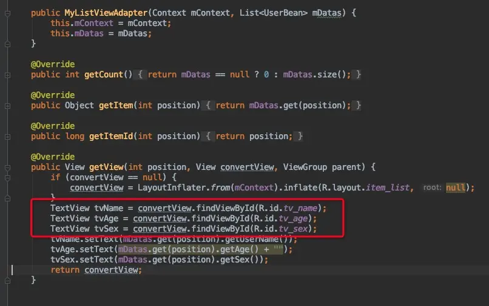
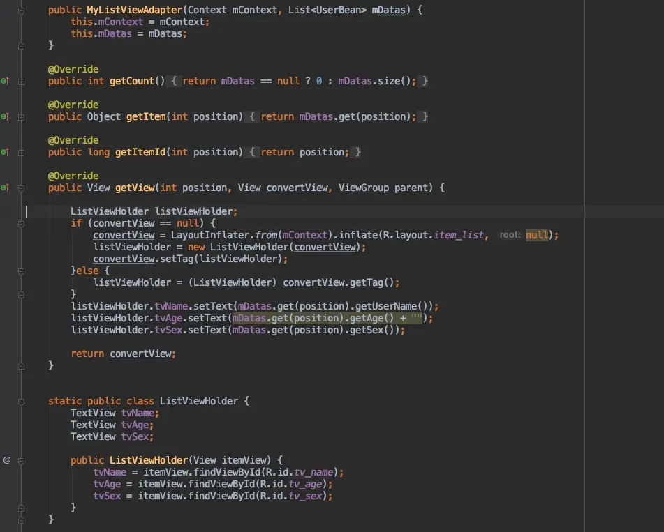
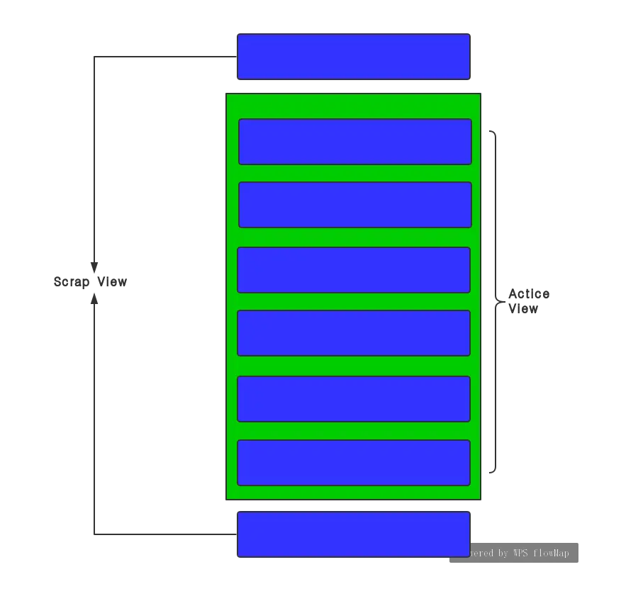
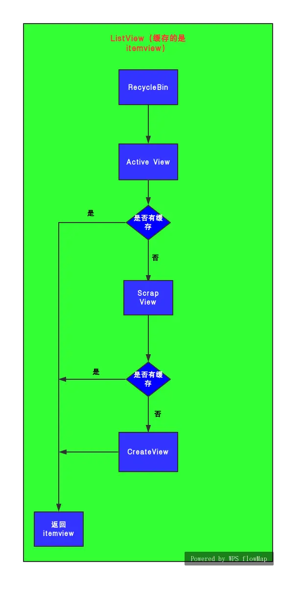
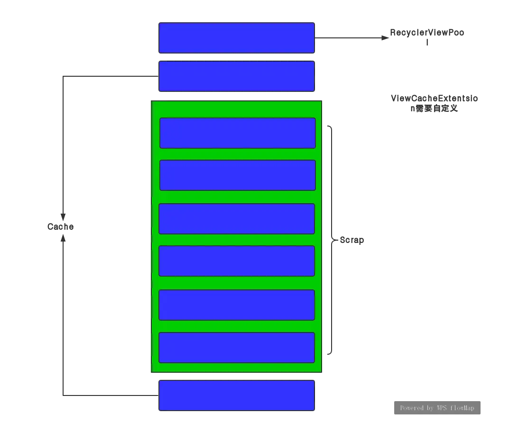
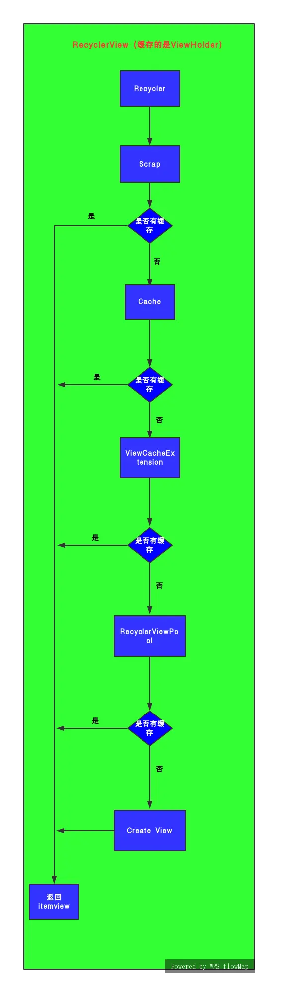
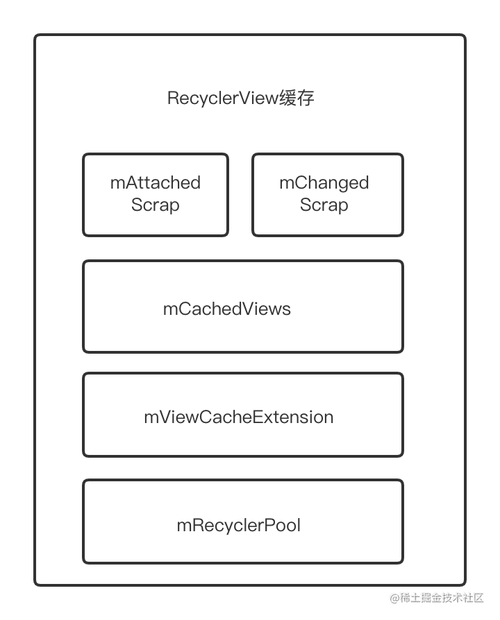

## 前言

本文先从整体流程看RecyclerView的缓存，再从源码角度分析，跳过读源码的坑，最后用一个简单的demo的形式展示出来。在开始RecyclerView的缓存机制之前我们先学习关于ViewHolder的知识。

### RecyclerView为什么强制我们实现ViewHolder模式？

关于这个问题，我们首先看一下ListView。ListView是不强制我们实现ViewHolder的，但是后来google建议我们实现ViewHolder模式。

我们先分别看一下这两种不同的方式。下面是不使用ViewHolder的模式



使用ViewHolder的模式



这里用红框标出来了，ListView使用ViewHolder的好处在于可以避免每次getView都进行findViewById()操作，因为findViewById()利用的是**DFS算法（深度优化搜索）**，是非常耗性能的。而对于RecyclerView来说，强制实现ViewHolder的其中一个原因就是避免多次进行findViewById() 的处理，另一个原因就是因为ItemView和ViewHolder的关系是**一对一**，也就是说一个ViewHolder对应一个ItemView。这个ViewHolder当中持有对应的ItemView的所有信息，比如position、view、width等等，拿到了ViewHolder基本就拿到了ItemView的所有信息，而ViewHolder使用起来相比itemView更加方便。RecyclerView缓存机制缓存的就是**ViewHolder**（ListView缓存的是ItemView)，这也是为什么RecyclerView强制我们实现ViewHolder的原因。


## Listview的缓存机制

在正式讲RecyclerView的缓存机制之前还需要了解下ListView的缓存机制，ssh-keygen -t rsa -C “xxxxx@xxxxx.com”先上图



ListView的缓存有两级，在ListView里面有一个内部类 RecycleBin，RecycleBin有两个对象Active View和Scrap View来管理缓存，Active View是第一级，Scrap View是第二级。

- Active View：是缓存在屏幕内的ItemView，当列表数据发生变化时，屏幕内的数据可以直接拿来复用，无须进行数据绑定。

- Scrap view：缓存屏幕外的ItemView，这里所有的缓存的数据都是"脏的"，也就是数据需要重新绑定，也就是说屏幕外的所有数据在进入屏幕的时候都要走一遍getView（）方法。

  再来一张图，看看ListView的缓存流程

  

  当Active View和Scrap View中都没有缓存的时候就会直接create view。

### 小结

ListView的缓存机制相对比较好理解，它只有两级缓存，一级缓存Active View是负责屏幕内的ItemView快速复用，而Scrap View是缓存屏幕外的数据，当该数据从屏幕外滑动到屏幕内的时候需要走一遍getView() 方法。

## 

## RecyclerView的缓存机制

先上图



RecyclerView的缓存分为四级

- **Scrap**
- **Cache**
- **ViewCacheExtension**
- **RecycledViewPool**

**Scrap** 对应ListView 的Active View，就是屏幕内的缓存数据，就是相当于换了个名字，可以直接拿来复用。

**Cache** 刚刚移出屏幕的缓存数据，默认大小是2个，当其容量被充满同时又有新的数据添加的时候，会根据FIFO原则，把优先进入的缓存数据移出并放到下一级缓存中，然后再把新的数据添加进来。Cache里面的数据是干净的，也就是携带了原来的ViewHolder的所有数据信息，数据可以直接拿来复用。需要注意的是，cache是根据**position**来寻找数据的，这个position是根据第一个或者最后一个可见的item的position以及用户操作行为（上拉还是下拉）。
举个**栗子**：当前屏幕内第一个可见的item的position是1，用户进行了一个下拉操作，那么当前预测的position就相当于（1-1=0），也就是**position=0**的那个item要被拉回到屏幕，此时RecyclerView就从Cache里面找position=0的数据，如果找到了就直接拿来复用。

**ViewCacheExtension**是google留给开发者自己来自定义缓存的，

网友：这个ViewCacheExtension我个人建议还是要慎用，因为我扒拉扒拉网上其他的博客，没有找到对应的使用场景，而且这个类的api设计的也有些奇怪，只有一个public abstract View getViewForPositionAndType(@NonNull Recycler recycler, int position, int type);让开发者重写通过position和type拿到ViewHolder的方法，却没有提供如何产生ViewHolder或者管理ViewHolder的方法，给人一种只出不进的赶脚，还是那句话慎用。

**RecycledViewPool** 上面提到Cache默认的缓存数量是2个，当Cache缓存满了以后会根据FIFO（先进先出）的规则把Cache先缓存进去的ViewHolder移出并缓存到RecycledViewPool中，RecycledViewPool默认的缓存数量是5个。RecycledViewPool与Cache相比不同的是，从Cache里面移出的ViewHolder在存入RecycledViewPool之前ViewHolder的数据会被全部重置，相当于一个新的ViewHolder，而且Cache是根据**position**来获取ViewHolder的，而RecycledViewPool是根据**itemType**获取的，如果没有重写getItemType() 方法，itemType就是默认的。因为RecycledViewPool缓存的ViewHolder是全新的，所以取出来的时候需要走onBindViewHolder() 方法。

再来张图看看整体流程


对于主要流程，需要记住各级缓存是根据什么拿到ViewHolder以及ViewHolder能否直接拿来复用，先有一个整体的认识，下面再简单分析一下RecyclerView的缓存机制的源码。


## 阅读RecyclerView的缓存机制源码

当 RecyclerView 绘制的时候，会走到LayoutManager里面的 next() 方法，在next()里面正式开始使用缓存机制，这里以LinearLayoutManager为例子

```kotlin
        /**
         * Gets the view for the next element that we should layout.
         * Also updates current item index to the next item, based on {@link #mItemDirection}
         *
         * @return The next element that we should layout.
         */
        View next(RecyclerView.Recycler recycler) {
            if (mScrapList != null) {
                return nextViewFromScrapList();
            }
            final View view = recycler.getViewForPosition(mCurrentPosition);
            mCurrentPosition += mItemDirection;
            return view;
        }
```

在 next() 方法里传入了Recycler对象，这个对象是RecyclerView的内部类：

```java
 public final class Recycler {
        final ArrayList<ViewHolder> mAttachedScrap = new ArrayList<>();
        ArrayList<ViewHolder> mChangedScrap = null;

        final ArrayList<ViewHolder> mCachedViews = new ArrayList<ViewHolder>();

        private final List<ViewHolder>
                mUnmodifiableAttachedScrap = Collections.unmodifiableList(mAttachedScrap);

        private int mRequestedCacheMax = DEFAULT_CACHE_SIZE;
        int mViewCacheMax = DEFAULT_CACHE_SIZE;

        RecycledViewPool mRecyclerPool;

        private ViewCacheExtension mViewCacheExtension;

        static final int DEFAULT_CACHE_SIZE = 2;
}
```

再看一眼RecycledViewPool的源码

```java
public static class RecycledViewPool {
        private static final int DEFAULT_MAX_SCRAP = 5;
        static class ScrapData {
            final ArrayList<ViewHolder> mScrapHeap = new ArrayList<>();
            int mMaxScrap = DEFAULT_MAX_SCRAP;
            long mCreateRunningAverageNs = 0;
            long mBindRunningAverageNs = 0;
        }
        SparseArray<ScrapData> mScrap = new SparseArray<>();
```

其中mAttachedScrap对应Scrap；mCachedViews对应Cache；mViewCacheExtension对应ViewCacheExtension；mRecyclerPool对应RecycledViewPool。
**注意**：mAttachedScrap、mCachedViews和RecycledViewPool里面的mScrapHeap都是**ArrayList**，缓存被加入到这三个对象里面实际上就是调用的ArrayList.add()方法。复用缓存呢，这里要注意一下不是调用的ArrayList.get() 而是ArrayList.remove()，其实这里也很好理解，因为当缓存数据被取出来展示到了屏幕内，自然就应该被移除。

我们现在回到刚才的next() 方法里，看下 recycler.getViewForPosition(mCurrentPosition) 方法，

```java
View getViewForPosition(int position, boolean dryRun) {
            return tryGetViewHolderForPositionByDeadline(position, dryRun, FOREVER_NS).itemView;
        }

ViewHolder tryGetViewHolderForPositionByDeadline(int position,
                boolean dryRun, long deadlineNs) {
            if (position < 0 || position >= mState.getItemCount()) {
                throw new IndexOutOfBoundsException("Invalid item position " + position
                        + "(" + position + "). Item count:" + mState.getItemCount()
                        + exceptionLabel());
            }
            boolean fromScrapOrHiddenOrCache = false;
            ViewHolder holder = null;
            // 0) If there is a changed scrap, try to find from there
            if (mState.isPreLayout()) {
                holder = getChangedScrapViewForPosition(position);
                fromScrapOrHiddenOrCache = holder != null;
            }
            // 1) Find by position from scrap/hidden list/cache
            if (holder == null) {
                holder = getScrapOrHiddenOrCachedHolderForPosition(position, dryRun);
            }
            if (holder == null) {
                final int type = mAdapter.getItemViewType(offsetPosition);
                // 2) Find from scrap/cache via stable ids, if exists
                if (mAdapter.hasStableIds()) {
                    holder = getScrapOrCachedViewForId(mAdapter.getItemId(offsetPosition),
                            type, dryRun);
                    if (holder != null) {
                        // update position
                        holder.mPosition = offsetPosition;
                        fromScrapOrHiddenOrCache = true;
                    }
                }
                if (holder == null && mViewCacheExtension != null) {
                    // We are NOT sending the offsetPosition because LayoutManager does not
                    // know it.
                    final View view = mViewCacheExtension
                            .getViewForPositionAndType(this, position, type);
                    if (view != null) {
                        holder = getChildViewHolder(view);
                      
                    }
                }
                if (holder == null) { // fallback to pool
                    if (DEBUG) {
                        Log.d(TAG, "tryGetViewHolderForPositionByDeadline("
                                + position + ") fetching from shared pool");
                    }
                    holder = getRecycledViewPool().getRecycledView(type);
                    if (holder != null) {
                        holder.resetInternal();
                        if (FORCE_INVALIDATE_DISPLAY_LIST) {
                            invalidateDisplayListInt(holder);
                        }
                    }
                }
                if (holder == null) {
                    long start = getNanoTime();
                    if (deadlineNs != FOREVER_NS
                            && !mRecyclerPool.willCreateInTime(type, start, deadlineNs)) {
                        // abort - we have a deadline we can't meet
                        return null;
                    }
                    holder = mAdapter.createViewHolder(RecyclerView.this, type);
                    if (ALLOW_THREAD_GAP_WORK) {
                        // only bother finding nested RV if prefetching
                        RecyclerView innerView = findNestedRecyclerView(holder.itemView);
                        if (innerView != null) {
                            holder.mNestedRecyclerView = new WeakReference<>(innerView);
                        }
                    }
                }
            } 

            boolean bound = false;
            if (mState.isPreLayout() && holder.isBound()) {
                // do not update unless we absolutely have to.
                holder.mPreLayoutPosition = position;
            } else if (!holder.isBound() || holder.needsUpdate() || holder.isInvalid()) {
                if (DEBUG && holder.isRemoved()) {
                    throw new IllegalStateException("Removed holder should be bound and it should"
                            + " come here only in pre-layout. Holder: " + holder
                            + exceptionLabel());
                }
                final int offsetPosition = mAdapterHelper.findPositionOffset(position);
                bound = tryBindViewHolderByDeadline(holder, offsetPosition, position, deadlineNs);
            }  
            return holder;
        }
```

终于到了缓存机制最核心的地方，为了方便大家阅读，我对这部分源码进行了删减，直接从官方给的注释里面看。

```csharp
// (0) If there is a changed scrap, try to find from there
            if (mState.isPreLayout()) {
                holder = getChangedScrapViewForPosition(position);
                fromScrapOrHiddenOrCache = holder != null;
            }
```

这里面只有设置动画以后才会为true，跟咱们讲的缓存也没有多大关系，直接略过。

```csharp
 // 1) Find by position from scrap/hidden list/cache
            if (holder == null) {
                holder = getScrapOrHiddenOrCachedHolderForPosition(position, dryRun);
            }
```

这里就开始拿第一级和第二级缓存了getScrapOrHiddenOrCachedHolderForPosition() 这个方法可以深入去看下，注意这里传的参数是position（dryRun这个参数不用管），就跟之前说的，Scrap和Cache是根据position拿到缓存。

```kotlin
if (holder == null && mViewCacheExtension != null) {
                    // We are NOT sending the offsetPosition because LayoutManager does not
                    // know it.
                    final View view = mViewCacheExtension
                            .getViewForPositionAndType(this, position, type);
                    if (view != null) {
                        holder = getChildViewHolder(view);
                      
                    }
                }
```

这里开始拿第三级缓存了，这里我们不自定义ViewCacheExtension就不会进入判断条件，还是那句话慎用。

```tsx
if (holder == null) { // fallback to pool
                    if (DEBUG) {
                        Log.d(TAG, "tryGetViewHolderForPositionByDeadline("
                                + position + ") fetching from shared pool");
                    }
                    holder = getRecycledViewPool().getRecycledView(type);
                    if (holder != null) {
                        holder.resetInternal();
                        if (FORCE_INVALIDATE_DISPLAY_LIST) {
                            invalidateDisplayListInt(holder);
                        }
                    }
                }
```

这里到了第四级缓存RecycledViewPool，getRecycledViewPool().getRecycledView(type);通过type拿到ViewHolder，接着holder.resetInternal();重置ViewHolder，让其变成一个全新的ViewHolder

```csharp
if (holder == null) {
                    long start = getNanoTime();
                    if (deadlineNs != FOREVER_NS
                            && !mRecyclerPool.willCreateInTime(type, start, deadlineNs)) {
                        // abort - we have a deadline we can't meet
                        return null;
                    }
                    holder = mAdapter.createViewHolder(RecyclerView.this, type);
                    if (ALLOW_THREAD_GAP_WORK) {
                        // only bother finding nested RV if prefetching
                        RecyclerView innerView = findNestedRecyclerView(holder.itemView);
                        if (innerView != null) {
                            holder.mNestedRecyclerView = new WeakReference<>(innerView);
                        }
                    }
                }
```

到这里如果ViewHolder还为null的话，就会createViewHolder，创建一个新的ViewHolder

```java
boolean bound = false;
            if (mState.isPreLayout() && holder.isBound()) {
                // do not update unless we absolutely have to.
                holder.mPreLayoutPosition = position;
            } else if (!holder.isBound() || holder.needsUpdate() || holder.isInvalid()) {
                if (DEBUG && holder.isRemoved()) {
                    throw new IllegalStateException("Removed holder should be bound and it should"
                            + " come here only in pre-layout. Holder: " + holder
                            + exceptionLabel());
                }
                final int offsetPosition = mAdapterHelper.findPositionOffset(position);
                bound = tryBindViewHolderByDeadline(holder, offsetPosition, position, deadlineNs);
            }  
```

这里else if (!holder.isBound() || holder.needsUpdate() || holder.isInvalid())是判断这个ViewHolder是不是有效的，也就是可不可以复用，如果不可以复用就会进入tryBindViewHolderByDeadline(holder, offsetPosition, position, deadlineNs);这个方法，在这里面调用了bindViewHolder() 方法。

```java
 private boolean tryBindViewHolderByDeadline(@NonNull ViewHolder holder, int offsetPosition,
                int position, long deadlineNs) {
            ....................
            mAdapter.bindViewHolder(holder, offsetPosition);
            ....................
            return true;
        }

  public final void bindViewHolder(@NonNull VH holder, int position) {
            .......................
            onBindViewHolder(holder, position, holder.getUnmodifiedPayloads());
           .........................
        }
```

至此，缓存机制的整体流程就全部分析完毕了。

### 小结

ListView有两级缓存，分别是Active View和Scrap View，缓存的对象是ItemView；而RecyclerView有四级缓存，分别是Scrap、Cache、ViewCacheExtension和RecycledViewPool，缓存的对象是ViewHolder。Scrap和Cache分别是通过position去找ViewHolder可以直接复用；ViewCacheExtension自定义缓存，目前来说应用场景比较少却需慎用；RecycledViewPool通过type来获取ViewHolder，获取的ViewHolder是个全新的，需要重新绑定数据。当你看到这里的时候，面试官再问RecyclerView的性能比ListView优化在哪里，我想你已经有答案。


## RecyclerView缓存架构图



RecyclerView缓存是一个四级缓存的架构。当然，从RecyclerView的代码注释来看，官方认为只有三级缓存，即mCachedViews是一级缓存，mViewCacheExtension是二级缓存，mRecyclerPool是三级缓存。从开发者的角度来看，mAttachedScrap和mChangedScrap对开发者是不透明的，官方并未暴露出任何可以改变他们行为的方法。

### 1 mCachedViews

可以通过如下方法，改变缓存的大小

```java
public void setItemViewCacheSize(int size) {
    mRecycler.setViewCacheSize(size);
}
```

### 2 ViewCacheExtension

是一个抽象类，可以自定义一个子类，修改获取缓存的策略。但是这个类只提供了获取缓存的接口，没有提供保存缓存的接口，对开发者要求甚高，而且使用RecyclerPool都能很好的实现一般的缓存需求。所以该接口，基本就是设计者的鸡肋，没啥用。

```csharp
public abstract static class ViewCacheExtension {
  public abstract View getViewForPositionAndType(Recycler recycler, int position,
          int type);
  }
```

### 3 RecyclerViewPool

类提供了修改不同类型View的最大缓存数量

```java
public void setMaxRecycledViews(int viewType, int max) {
    ScrapData scrapData = getScrapDataForType(viewType);
    scrapData.mMaxScrap = max;
    final ArrayList<ViewHolder> scrapHeap = scrapData.mScrapHeap;
    while (scrapHeap.size() > max) {
        scrapHeap.remove(scrapHeap.size() - 1);
    }
}
```


## RecyclerView$Recycler

RecyclerView的缓存功能是定义在RecyclerView$Recycler中的。

```java
  public final class Recycler {
        final ArrayList<ViewHolder> mAttachedScrap = new ArrayList<>();
        ArrayList<ViewHolder> mChangedScrap = null;

        final ArrayList<ViewHolder> mCachedViews = new ArrayList<ViewHolder>();

        private final List<ViewHolder>
                mUnmodifiableAttachedScrap = Collections.unmodifiableList(mAttachedScrap);

        private int mRequestedCacheMax = DEFAULT_CACHE_SIZE;
        int mViewCacheMax = DEFAULT_CACHE_SIZE;

        RecycledViewPool mRecyclerPool;

        private ViewCacheExtension mViewCacheExtension;

        static final int DEFAULT_CACHE_SIZE = 2;
} 
```

我们来依次讲解不同层级的缓存，侧重点在于各级缓存的作用和区别

### 1 mAttachedScrap

mAttachedScrap的对应数据结构是ArrayList，在LayoutManager#onLayoutChildren方法中，对views进行布局时，会将RecyclerView上的Views全部暂存到该集合中，以备后续使用，该缓存中的ViewHolder的特性是，如果和RV上的position或者itemId匹配上了，那么认为是干净的ViewHolder，是可以直接拿出来使用的，无需调用onBindViewHolder方法。该ArrayList的大小是没有限制的，屏幕上有多少个View，就会创建多大的集合。触发该层级缓存的场景一般是调用notifyItemXXX方法。调用notifyDataSetChanged方法，只有当Adapter hasStableIds返回true，会触发该层级的缓存使用。

### 2 mChangedScrap

mChangedScrap和mAttachedScrap是同一级的缓存，他们是平等的。但是mChangedScrap的调用场景是notifyItemChanged和notifyItemRangeChanged，只有发生变化的ViewHolder才会放到mChangedScrap中。mChangedScrap缓存中的ViewHolder是需要调用onBindViewHolder方法重新绑定数据的。那么此时就有个问题了，为什么同一级别的缓存需要设计两个不同的缓存？有何作用，阅读过动画原理系列文章[详解RecyclerView动画原理之一](https://link.juejin.cn/?target=http%3A%2F%2Fmp.weixin.qq.com%2Fs%3F__biz%3DMzA5NzA3Njc4NA%3D%3D%26mid%3D2247484294%26idx%3D1%26sn%3Ddc59e6f8c002a9fec862864cb95e4836%26chksm%3D90a710d9a7d099cf356f27bb29d8c924fc51d1404a75f71c72082702f45d2df05f00bb657fdc%26scene%3D21%23wechat_redirect)和[详解RecyclerView动画原理之二](https://link.juejin.cn/?target=)的同学会记得，在dispatchLayoutStep2阶段LayoutManager onLayoutChildren方法中最终会调用layoutForPredictiveAnimations方法，把mAttachedScrap中剩余的ViewHolder填充到屏幕上，所以他们的区别就是，mChangedScrap中的ViewHolder在RV填充满的情况下，是不会强行填充到RV上的。那么有办法可以让发生改变的ViewHolder进入mAttachedScrap缓存吗？当然可以。调用notifyItemChanged(int position, Object payload)方法可以，实现局部刷新功能，payload不为空，那么发生改变的ViewHolder是会被分离到mAttachedScrap中的。

### 3 mUnmodifiableAttachedScrap

mUnmodifiableAttachedScrap = Collections.unmodifiableList(mAttachedScrap)是对mAttachedScrap的封装，它将mAttachedScrap暴露给开发者调用，它的特性就是只可读不能写。

### 4 mCachedViews

mCachedViews对应的数据结构也是ArrayList但是该缓存对集合的大小是有限制的，默认是2。该缓存中ViewHolder的特性和mAttachedScrap中的特性是一样的，只要position或者itemId对应上了，那么它就是干净的，无需重新绑定数据。开发者可以调用setItemViewCacheSize(size)方法来改变缓存的大小。该层级缓存触发的一个常见的场景是滑动RV。当然notifyXXX也会触发该缓存。该缓存和mAttachedScrap一样特别高效。

### 5 ViewCacheExtension

ViewCacheExtension开发者自己实现的意义不大，基本上所有你想做的，都可以通过RecyclerViewPool来实现。

### 6 RecyclerViewPool

RecyclerViewPool缓存可以针对多ItemType，设置缓存大小。默认每个ItemType的缓存个数是5。而且该缓存可以给多个RecyclerView共享。由于默认缓存个数为5，假设某个新闻App，每屏幕可以展示10条新闻，那么必然会导致缓存命中失败，频繁导致创建ViewHolder影响性能。所以需要扩大缓存size。


## 自测问题

mAttachedScrap是干嘛的？这级缓存跟开发者的关系大吗？

mChangedScrap又是干嘛的？跟开发者的关系大吗？

在一级缓存的维度上，为什么要同时设计mAttachedScrap和mChangedScrap两个不同的缓存？

mUnmodifiableAttachedScrap的设计小技巧是什么？

mCachedViews的缓存个数，以及该缓存中的ViewHolder有什么特性?

mViewCacheExtension虽说是给开发者定制缓存策略的，但并没什么软用。

RecyclerPool可以给多个RecyclerView共享缓存对象，但是如果设置不当，也会造成严重的性能问题？

hasStableIds返回true，到底有啥用？

onBindViewHolder(VH holder, int position, List payloads)这个方法到底该如何使用才好？


参考

1、[让你彻底掌握RecyclerView的缓存机制](https://www.jianshu.com/p/3e9aa4bdaefd)

2、[聊一聊RecyclerView的缓存机制](https://juejin.cn/post/6913744545159053319)

3、