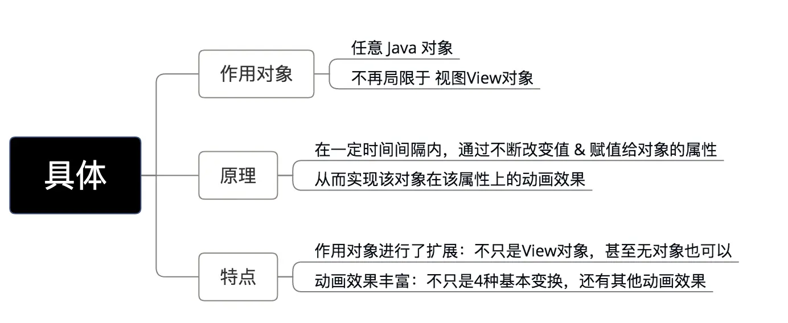

# 前言

动画的使用 是 `Android` 开发中常用的知识

本文包括动画的种类、使用、原理等，**能让你更好地掌握动画 从而实现更加复杂的动画效果**

> `Android`动画系列文章：
>  动画.md
>  补间动画.md
>  属性动画.md
>  帧动画.md
>  估值器.md
>  插值器.md

# 目录

# 1. 动画类型

`Android`动画主要分为分为两大类（三种）：

1. 视图动画：补间动画、帧动画
2. 属性动画

# 2.  视图动画（View Animation）

- 作用对象：视图（`View`）
- 具体分类：补间动画 & 逐帧动画

下面会详细介绍这两种视图动画

## 2.1 补间动画（Tween Animation）

### 简介

### 分类

根据不同的动画效果，补间动画分为4种动画，具体如下图：（注：不同类型的动画对应于不同的子类

具体效果分别如下：

平移：略

缩放

旋转

透明度

### 应用场景

#### a. 标准的动画效果

- 补间动画常用于视图View的一些标准动画效果：平移、旋转、缩放 & 透明度；
- 除了常规的动画使用，补间动画还有一些特殊的应用场景。

#### b. 特殊的应用场景

- `Activity` 的切换效果（淡入淡出、左右滑动等）
- `Fragement` 的切换效果（淡入淡出、左右滑动等）
- 视图组（`ViewGroup`）中子元素的出场效果（淡入淡出、左右滑动等）

淡入淡出

左右滑动

ListView出场动画

### 具体使用

请看文章：补间动画.md

## 2.2 逐帧动画

### 简介

### 应用场景

较为复杂的个性化动画效果。

> 使用时一定要避免使用尺寸较大的图片，否则会引起OOM

合成的动画

将动画拆分后的图片帧

### 具体使用

帧动画.md

# 3. 属性动画

### 为什么要使用属性动画

- 属性动画（`Property Animation`）是在 `Android 3.0`（`API 11`）后才提供的一种全新动画模式
- 那么为什么要提供属性动画（`Property Animation`）？
- 具体请看下图

### 属性动画简介

在 `Android 3.0`（`API 11`）后才提供的一种全新动画模式

### 应用场景

与属性相关、更加复杂的动画效果。

> 如改变对象的颜色属性动画效果

### 具体使用

属性动画的使用类主要是：`ValueAnimator` 类 & `ObjectAnimator` 类，具体介绍如下

主要使用类

> 详细使用，属性动画.mds

# 4. 动画 总结 & 对比

### 4.1 总结

### 4.2 两类动画的区别

两类动画的根本区别在于：**是否改变对象本身的属性**：

- 视图动画：无改变对象属性
   因为视图动画在动画过程中仅对图像进行变换，从而达到了动画效果

> 变换操作包括：平移、缩放、旋转和透明

- 属性动画：改变了对象属性
   因属性动画在动画过程中对动态改变了对象属性，从而达到了动画效果
- 特别注意
   使用视图动画时：无论动画结果在哪，该View的位置不变 & 响应区域都是在原地，不会根据结果而移动；
   而属性动画 则会通过改变属性 从而使动画移动

# 5. 插值器 & 估值器

### 5.1 简介

### 5.2 具体使用

请看文章：

估值器.md

插值器.md

# 6. 使用问题 & 建议

在使用动画时，需注意许多问题；

# 7. 总结

本文介绍了 `Android` 动画的分类和使用场景。

# 参考

[Carson带你学Android：这是一份全面&详细的动画知识学习攻略](https://www.jianshu.com/p/53759778284a)

[Carson带你学Android：常见的三种动画类型](https://www.jianshu.com/p/35d25cc205e7)