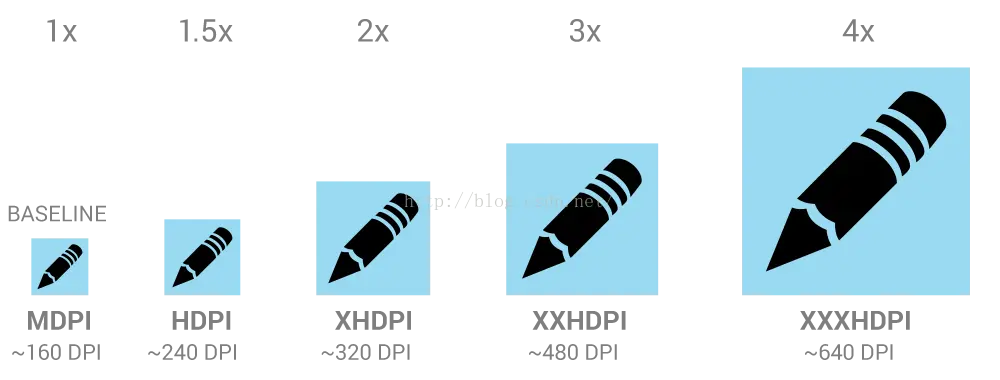
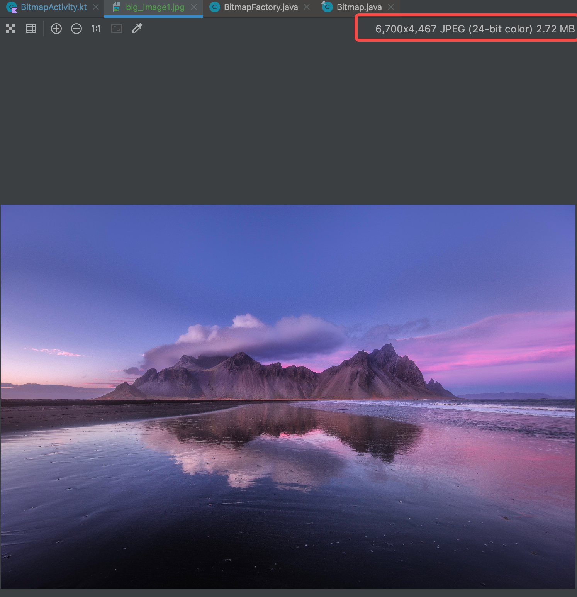

> version：2020/09/17
>
> review：


[TOC]


# 图片在内存中的占用大小计算

根据图片的像素尺寸进行计算，一个像素占4个字节 （默认是 ARGB_8888 格式）。

占用内存 = 横向像素数 * 纵向像素数 * 每个像素占用内存（默认是ARGB_8888，即4个字节）。

例如：现在有个1M的图片尺寸是3500 * 2500，计算3500 * 2500 * 4 / 1024 / 1024 = 31M

1张图片足以让 app 抛出一个OOM

原因猜测是该图片是 jpg 格式，使用的相应的压缩算法，所以是图片很小，而在Android 中使用Bitmap时，需要原始的数据，所以需要按照上面的公式进行计算。

Q：为什么图片保存下来很小，但加载到内存后很大？

# 图片放错对应的分辨率文件夹有那么严重吗？

如果把一张图片放在了mdpi，而用户的手机是xhdpi的话，你会发现图片所占用的内存（按照上面的方法做计算）会比计算值多4倍。因此如果把上面那张图片放在了mdpi，会占用内存120M，实在太大了。

这是因为安卓系统会把mdpi的图片尺寸进行扩大以保证显示的尺寸相同。相反的，如果你把图片放到了xhdpi，而你的手机是mdpi的话，你的图片会被压缩成原来的1/4。

具体的比例关系为：（NX 表示长和宽是 mdpi 的N倍，总内存就是 N * N 倍）



所以图片可不能乱放。小小的操作会吃掉成倍的内存。因此有如下解决方法：

1、针对不同分辨率切图。

2、现在的手机基本是xhdpi的，很多商业项目在切图的时候只会对应xhdpi的手机。

3、大图片压缩的时候一定要全部加载到内存再进行压缩吗？（先压缩，后加载）

当然不是，可以使用BitmapFactory.decode()，传入一个Options对象，进行某些设置即可读取到该图片的宽高，类型，而不需要读取整个图片到内存。读取了图片的宽和高之后，可以按照想要的比例进行压缩读取。我的理解是如果你设置的压缩比是 2 * 2（横向纵向像素各压缩2倍，总压缩比4倍），在BitmapFactory进行decode的时候知道了你的压缩比，它会选择性的读取某些像素点（具体算法未知，可以简单的想成比如原图是100 * 100px，现在我们获得到了他的输入流，只是平均的从输入流读取 50 * 50px 像素）。这样就实现了大图片不加载到内存先压缩。

这种做法可以用在本地图片的显示处理，同时也可以用在加载网络图片的时候。都是为了避免OOM，同时实现对大图片进行压缩。

# 案例分析之图片内存占用

以这张图片为例：[一张6700 * 4467的图片](https://up.enterdesk.com/edpic_source/fe/45/4f/fe454f712e99395ec427ed57ad54f553.jpg)



我们先计算一下预期的内存占用大小

内存占用大小 = 6700 * 4467 * 4 = 119715600 Byte = 119 M

获取图片内存占用的方法，这里我们直接使用Bitmap提供的方法获取，而不是自己去计算

```kotlin
    fun getBitmapInfo(bitmap: Bitmap): String {
        val size = bitmap.allocationByteCount
        return "BitmapInfo: w = ${bitmap.width} h = ${bitmap.height} , 内存大小 = ${size}B(${size / 1000000.0}M)"
    }
```

下面的 w 是 图片宽度，h 是图片高度，单位为像素（px）

**情况1，图片放到mipmap-xhdpi目录下**

内存占用大小：BitmapInfo: w = 9213 h = 6142 , 内存大小 = 226344984B(226.344984M)

**情况2，图片放到mipmap-xxhdpi目录下**

内存占用大小：BitmapInfo: w = 6142 h = 4095 , 内存大小 = 100605960B(100.60596M)

**情况3，图片放到mipmap-xxxhdpi目录下**

内存占用大小：BitmapInfo: w = 4606 h = 3071 , 内存大小 = 56580104B(56.580104M)


**Q：为什么和我们计算的不一样？差异是怎么产生的？**

我们的图片是6700 * 4467，但是在上面3个目录下，加载的图片大小都跟原始的不一样，为什么呢？

这是因为我使用的手机 densityDpi = 440。在Android中，我们的图片在加载时，会进行一定比例的缩放，缩放系数 = 手机实际dpi / 图片目录对于的dpi。

以xxhdpi目录为例，xxhdpi目录对应的dpi是480，那么缩放系数 = 440 / 480 = 0.91666...，因此实际内存占用 = 6700 * (440 / 480) * 4467 * (440 / 480) * 4 = 6142 * 4095 * 4 = 100605960 B，跟 bitmap.allocationByteCount 取值结果一致。（宽度 6700 * 0.9167 = 6141.89，像素点得取整，因此为6142。高度同理。）


## 小结

图片宽高（单位：像素px）缩放系数 = 手机实际 dpi / 图片目录对应的 dpi

> 图片宽高缩放系数，或许说成图片宽高像素点增删（填充/删减）更恰当点。手机实际dpi（每英寸像素点数）大，说明每英寸可以容纳的像素点数多，为了显示的更清晰，自然需要填充更多像素进来，反之，手机dpi偏小，则需要减少像素数。举个例子，手机的实际dpi = 440，说明每英寸可以放440个像素点。图片放在xhdpi目录（对应dpi320）下，表示此图片每个英寸将提供320个像素点，那么为了图片显示效果清晰，就得每英寸填充进去120个像素点。反之，如果手机实际dpi = 160，说明每英寸可以放160个，图片放在xhdpi目录（对应dpi320）下，表示此图片每个英寸将提供320个像素点，超出手机显示能力了，因此要对图片像素点进行删减，才能在手机上显示完整。
>
> 理解的还是不太清晰，要再理解下。

图片实际加载宽度(px) = 原图宽度(px) * 缩放系数

图片实际加载高度(px) = 原图高度(px) * 缩放系数

像素总数 = 图片实际加载宽度(px) * 图片实际加载高度(px) 

图片内存大小 = 像素总数 * 单个像素大小

因此，图片内存占用计算公式为：

**内存中的实际占用大小 = （原图宽度(px) * 缩放系数） * （原图高度(px) * 缩放系数） * 每个像素大小**（由像素点的ARGB决定，默认为ARGB_8888，4个字节）

> 注意：在计算图片内存大小时，最容易忽略的就是系统默认缩放宽高，这一点，对实际的内存占用大小影响是很大的，不可忽略。

手机dpi获取方式，densityDpi

```kotlin
        resources.displayMetrics.apply {
            Log.i(TAG, "density = " + this.density.toString())
            Log.i(TAG, "densityDpi = " + this.densityDpi.toString())
        }
```


Q：要怎么判断应用会加载哪张图片呢？

# 大图加载示例

下面看一下大图加载的应用场景：
现在需要将下面这张图片显示到手机上，它的像素为 750 * 4039。如果不做任何处理，这张图片被加载到内存后，将会占用 750 * 4039 * 4 = 12117000个字节，共12M。如果用ScrollView + ImageView，直接来显示的话，就是占用12117000个字节。这个内存占用已经相当大了。很容易出现OOM。
因此，我们的解决思路是，自己定义一个控件，专门用来优化并显示大长图。同时学习一下大图加载的原理是什么。


## 自定义大图长图加载控件

本篇就直接上代码了，一边写代码一边复习大图加载的原理。所谓原理，简单的理解，就是运用现有的一些Api对图片加载方式进行配置。
这篇文章的主要目的就是熟练的掌握并灵活的运用这些Api，同时在巩固一下自定义控件的知识。

第0步：分析问题，提出解决方案
前面我们说了，希望通过自定义一个控件来加载大长图，那么现在来分析以下这个控件的细节，希望它可以完成什么功能：
1、显示图片
2、可以上下滑动
3、滑动具有惯性
4、滑动中可以停止
5、性能要好，不能占用太多内存

具体实现
直接上代码了，注释写的很详细了，里面有我对Bitmap高效加载的理解。

```
/**
 * 这个控件被专门用来加载并显示大长图。
 * 它具有以下功能和特性：
 * 1、显示图片
 * 2、支持上下滑动
 * 3、滑动具有惯性
 * 4、触摸后，滑动可以停止
 * 5、性能较好，内存占用少
 *
 * @author Li Zongwei
 * @date 2020/9/17
 **/
public class MyBigView2 extends View implements GestureDetector.OnGestureListener, View.OnTouchListener {

    /**
     * 用于分块加载，需要跟 BitmapRegionDecoder 配合使用
     */
    private final Rect mRect;

    /**
     * 区域解码器，解码那些区域，由Rect决定
     */
    private BitmapRegionDecoder mBitmapRegionDecoder;

    /**
     * 用于对Bitmap的加载方式进行配置，这是Bitmap实现高效（低内存）加载需要用的一个核心类
     */
    private final BitmapFactory.Options mOptions;

    /**
     * 用于手势支持，要配合滑动使用
     */
    private final GestureDetector mGestureDetector;

    /**
     * 实现滑动
     */
    private final Scroller mScroller;

    /**
     * 图片的原始宽度
     */
    private int mOriginalImageWidth;

    /**
     * 图片的原始高度
     */
    private int mOriginalImageHeight;

    /**
     * 当前控件的宽度
     */
    private int mViewWidth;

    /**
     * 当前控件的高度
     */
    private int mViewHeight;

    /**
     * 缩放因子，就是原始图片相对控件大小的缩放
     */
    private float mScale;

    /**
     * 复用Bitmap
     */
    private Bitmap mBitmap;


    /**
     * @param context
     */
    public MyBigView2(Context context) {
        this(context, null);
    }

    public MyBigView2(Context context, @Nullable AttributeSet attrs) {
        this(context, attrs, 0);
    }

    public MyBigView2(Context context, @Nullable AttributeSet attrs, int defStyleAttr) {
        super(context, attrs, defStyleAttr);

        /**
         * 第一步：初始化需要用的对象
         */
        // 1、内存复用
        mOptions = new BitmapFactory.Options();

        // 2、分块加载
        mRect = new Rect();

        // 3、分块加载，需要配合


        // 4、手势支持，因为要滑动嘛,这里的this是需要传入一个OnGestureListener接口实现，自然是当前的MyBigView2了。
        mGestureDetector = new GestureDetector(context, this);

        // 5、滑动
        mScroller = new Scroller(context);

        // 6、监听滑动事件，此View需要把滑动事件交给 mGestureDetector 去处理  TODO 这里现在还没有思考清除啊。。。标记一下
        setOnTouchListener(this);

        // 好了，到此，准备工作就做完了，下面可以拿图片进来处理了
    }

    /**
     * 第二步：获取图片
     * 这个不用多说了，这个View就是用来显示图片的嘛
     *
     * @param is 传入一个输入流，至于这里为什么用输入流，其实传个Bitmap、url也都是可以的，
     *           但这不是本例的重点哈，重点是拿到图片后的处理
     */
    public void setImage(InputStream is) {
        //哇，这个属性看过Bitmap优化的应该都不陌生，就是解析的时候只是拿到属性，并没有真正的加载到内存
        //这个属性设置完成后，我们就可以解析图片了，主要是为了拿到 图片的：宽、高
        //在真正获取图片前，记得设置为false
        mOptions.inJustDecodeBounds = true;
        // 获取图片，在这之前要对 mOptions 做一下设置
        BitmapFactory.decodeStream(is, null, mOptions);

        mOriginalImageWidth = mOptions.outWidth;
        mOriginalImageHeight = mOptions.outHeight;

        // 设置bitmap的解析格式
        // 这里涉及到一个知识点：
        // RGB_565：表示只有每个像素只有 RGB，没有A（透明通道），565表示 RGB 分别占 5、6、5个bit，也就是共16位，2字节（2byte）
        // ARGB_8888：即 ARGB 分别占 8、8、8、8个bit，也就是共32位，4个字节（4byte）
        // 自然 ARGB_8888 的颜色要比 RGB_565 丰富
        mOptions.inPreferredConfig = Bitmap.Config.RGB_565;

        // 设为true，表示内存复用，这个属性还没有做细致的了解
        mOptions.inMutable = true;

        mOptions.inJustDecodeBounds = false;

        // mOptions的设置到此就结束了，下面可以真正的加载图片了

        // 我们前面说了，要进行低内存加载，这需要用到两个对象：BitmapRegionDecoder和Rect，Rect是要作为

        try {
            //初始化区域解码器，解码器有了Bitmap的流，待会儿就可以从解码器中，获取特定区域的图片了，这个特定区域便是由Rect指定的。
            mBitmapRegionDecoder = BitmapRegionDecoder.newInstance(is, false);
        } catch (IOException e) {
            e.printStackTrace();
        }

        //到这里，图片也有了，解码器也有了，mOptions也设置好了，万事俱备，只欠绘制

        // 当然，绘制前还得测量，然后进行绘制
        requestLayout();
    }

    /**
     * 第三步：测量
     * 用于获取控件宽高、缩放比，然后计算出取图片的区域Rect
     *
     * @param widthMeasureSpec
     * @param heightMeasureSpec
     */
    @Override
    protected void onMeasure(int widthMeasureSpec, int heightMeasureSpec) {
        super.onMeasure(widthMeasureSpec, heightMeasureSpec);

        //测量，首先，自然是获取此控件的宽高了
        mViewWidth = getMeasuredWidth();
        mViewHeight = getMeasuredHeight();

        //缩放比例，这里得注意 把 mOriginalImageWidth 转为float类型，缩放小数位是需要的，不然不准
        mScale = mViewWidth / (float) mOriginalImageWidth;

        // 有了控件的宽高，之前也得到了图片的原始宽高，就可以确定 Rect 的范围了，这个范围将会被解码器用来解析图片
        mRect.top = 0;
        mRect.left = 0;
        // 这里需要思考下，我们说了 mRect 是来规定解码器解析图片范围的，宽度自然要图片宽度 mOriginalImageWidth
        mRect.right = mOriginalImageWidth;
        // mRect.bottom 的话，我们需要根据 控件宽度和图片宽度的大小 缩放比例，进行一下计算
        // 这个计算得说明一下，当时还是蒙了好一会儿
        // 首先，bottom指定了要从解码器中得到的图片底部，我们从0开始取，底部自然应该是控件底部：ViewHeight
        // 那为什么还需要用 mViewHeight / mScale 呢？
        //
        // 举个例子来说明吧：
        // 现在有一张图片宽高为：500*3000   控件宽高为：1000*1000  此时：mScale = 1000 / 500  = 2
        // 我们现在要把这张图片完全显示在控件上，需要
        // 1、把宽度 放大两倍，因此为了保证图片宽高比一致，高度也需要放大 2
        // （图片宽高的缩放是在onDraw里面进行的），所以我们需要先在这里把高度缩小2倍
        // 2、我们现在只要知道，后面高度会放大两倍就好，因此，我们要在  高1000的控件上面显示出这张图片，
        //    实际上只要取图片高度的500就可以了，正好是 控件高度的一半
        // 总而言之：图片待会会进行一次  mScale 的缩放，为保证图片正好可以显示在控件上，高度需要先缩放一次
        //
        // 这么说吧，要在1000*1000的控件上显示500*3000的图片，我们每次只需要每次取 500*500 就好了，onDraw中一放大，图片正好是1000*1000，然后通过上下滑动显示，完美
        mRect.bottom = (int) (mViewHeight / mScale);

        // ok，有了 Rect 的取图区域，我们就可以去onDraw中绘制了
    }

    /**
     * 矩阵
     */
    private Matrix mMatrix;

    /**
     * 第四步：绘制Bitmap
     *
     * @param canvas
     */
    @Override
    protected void onDraw(Canvas canvas) {
        super.onDraw(canvas);
        // 这里还是判断下，解码器还在不，如果解码器没了，图片都没了，更别说显示了
        if (mBitmapRegionDecoder == null) {
            return;
        }

        // 高性能，低内存的主旨不能忘了,通过下面这句话来设置内存复用
        mOptions.inBitmap = mBitmap;

        // 然后就是获取要显示的图片了
        mBitmap = mBitmapRegionDecoder.decodeRegion(mRect, mOptions);

        // 在显示前，我们要进行一次缩放
        // 看，在这里设置了 对宽高进行一次缩放，因此啊，前面 mRect.bottom = (int) (mViewHeight / mScale);也就懂了。
        mMatrix = new Matrix();
        mMatrix.setScale(mScale, mScale);

        // 绘制图片
        canvas.drawBitmap(mBitmap, mMatrix, null);

        // 到此，可以运行看一下第一屏了
    }

    /**
     * 第五步：处理touch事件
     *
     * @param v
     * @param event
     * @return
     */
    @Override
    public boolean onTouch(View v, MotionEvent event) {
        //交给 mGestureDetector 进行处理
        return mGestureDetector.onTouchEvent(event);
    }

    /**
     * 第六步：处理点击事件
     *
     * @param e
     * @return
     */
    @Override
    public boolean onDown(MotionEvent e) {
        //如果正在滑动，则停止滑动
        if (!mScroller.isFinished()) {
            mScroller.forceFinished(true);
        }
        //接收后续事件
        return true;
    }

    /**
     * 第七步：处理滑动事件
     * 滑动的本质是改变Rect的区域，然后重新绘制，也就达到了滑动的效果
     * 此View是要改变 mRect.top 和 mRect.bottom
     *
     * @param e1        开始事件
     * @param e2        即时事件
     * @param distanceX
     * @param distanceY
     * @return
     */
    @Override
    public boolean onScroll(MotionEvent e1, MotionEvent e2, float distanceX, float distanceY) {
        //上下移动时，改变Rect显示区域
        mRect.offset(0, (int) distanceY);

        //判断是否到底
        if (mRect.bottom > mOriginalImageHeight) {
            mRect.bottom = mOriginalImageHeight;
            mRect.top = (int) (mOriginalImageHeight - mViewHeight / mScale);
        }

        //判断是否到顶
        if (mRect.top < 0) {
            mRect.top = 0;
            mRect.bottom = (int) (mViewHeight / mScale);
        }

        // 冲冲冲，开始绘制
        invalidate();

        // 到这里我们的View已经可以完整的显示图片了，但是呢，还没有滑动的惯性，我们接着完善


        return false;
    }

    /**
     * 第八步：处理惯性问题。呃，我怎么发现这个方法就没执行嘛。。。先放着吧，有空再分析下
     *
     * @param e1
     * @param e2
     * @param velocityX
     * @param velocityY
     * @return
     */
    @Override
    public boolean onFling(MotionEvent e1, MotionEvent e2, float velocityX, float velocityY) {
        mScroller.fling(0, mRect.top, 0, (int) -velocityY, 0, 0,
                0, mOriginalImageHeight - (int) (mViewHeight / mScale));
        return false;
    }

    /**
     * 第九步：处理计算结果
     */
    @Override
    public void computeScroll() {
        super.computeScroll();

        if (mScroller.isFinished()){
            return;
        }

        if (mScroller.computeScrollOffset()){
            mRect.top = mScroller.getCurrY();
            mRect.bottom = (int) (mRect.top + mViewHeight/mScale);
            invalidate();
        }
        
        //到此，这个自定义View也就结束了。bye~
    }

    @Override
    public void onShowPress(MotionEvent e) {

    }

    @Override
    public boolean onSingleTapUp(MotionEvent e) {
        return false;
    }

    @Override
    public void onLongPress(MotionEvent e) {

    }

}
```

#二、总结
Bitmap的高效加载主要还是依赖于对：BitmapFactory.Options的属性设置，然后，就是配合解码器BitmapRegionDecoder可以分块加载图片，分块的区域是由Rect决定的。

然后就是实际运用了滑动：GestureDetector ，Scroller ，当然滑动的一些方法，现在的理解还不是很深入，后面学习自定义View滑动的部分，再深入的看下涉及到的几个Api。

#三、拓展
后续，准备写一下横向的大长图展示View。


# 问题

Q：bitmap如何处理大图，30M的大图如何防止OOM？

可以使用BitmapFactory.Options中的inSampleSize属性来减小图片的分辨率，从而减小内存占用。可以根据需要调整inSampleSize的值，一般适当调整到2的整数次幂即可。另外，可以使用Bitmap的recycle()方法及时回收不再使用的Bitmap对象，释放内存空间。还可以考虑使用LruCache等内存缓存技术，将Bitmap对象缓存起来，减少重复创建Bitmap对象的开销。


# 参考
