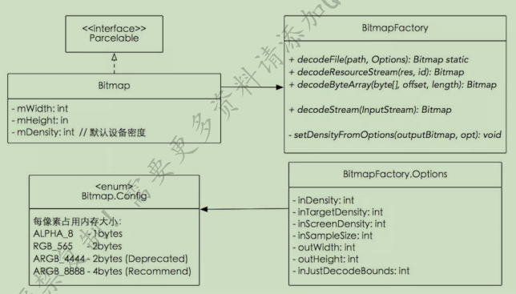

> version：2021/4/8
>
> review：2021/4/8
>

前言：（可选）

## 一、前置知识

可选

## 二、Bitmap

### 2.1 概念（类图）

### 2.2 配置信息与压缩方式

### 2.3 常用操作

#### 2.3.1 裁剪、缩放、旋转、移动

#### 2.3.2 Bitmap 与 Drawable 转化

#### 2.3.3 保存与释放

#### 2.3.4 图片压缩

### 2.4 BitmapFactory

#### 2.4.1 Bitmap 创建流程

#### 2.4.2 Option类

#### 2.4.3 基本使用

### 2.4 内存回收

# 问题

Q：一个像素占几个字节?

一个像素通常占用4个字节的内存空间，因为它需要存储红、绿、蓝、透明度四个通道的值。但在某些情况下，如灰度图像或位图，一个像素可能只占用1个字节或2个字节。取决于加载图片时候的Bitmap.Config的配置。

Q：

使用

原理

### 三、总结

本文总结：核心知识点

### 四、思维导图

总结本文；把本文知识融入整体知识体系。

### 五、拓展

​	相关知识，横向、纵向对比；使用场景（示例）、适用范围、注意事项；

​	头脑风暴：联想相关知识，准备对比，为进一步深入学习做准备。

**参考：**

1、《Android核心知识点笔记V2020.03.30》