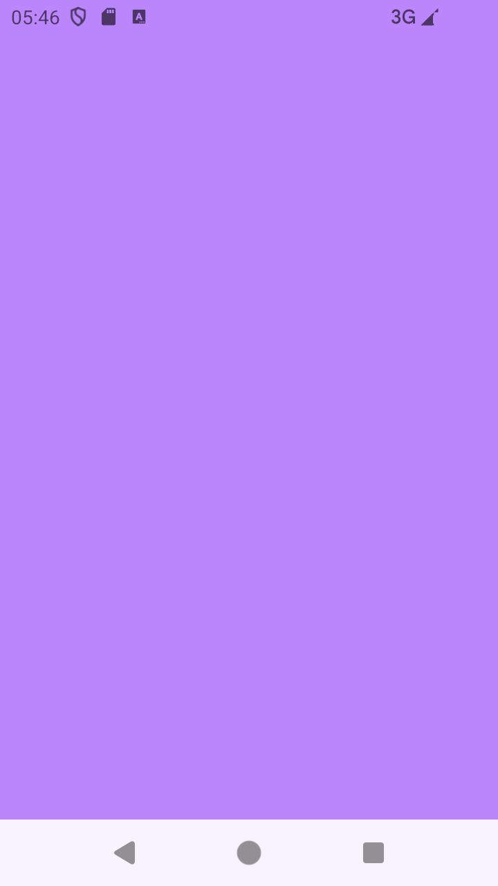
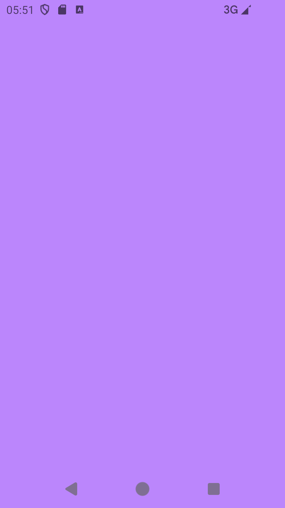
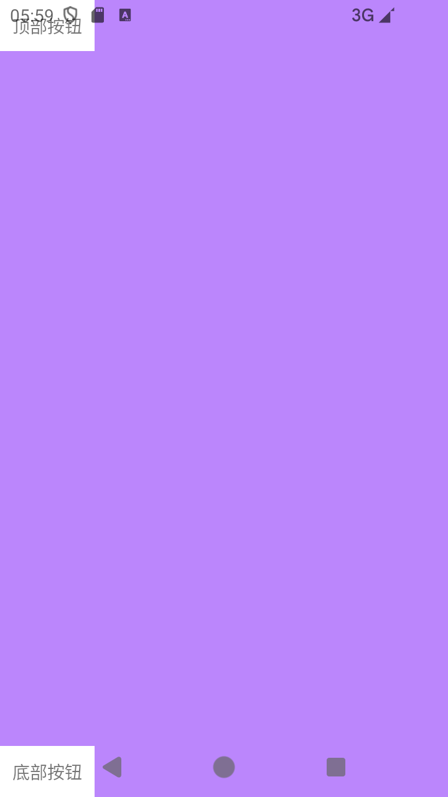
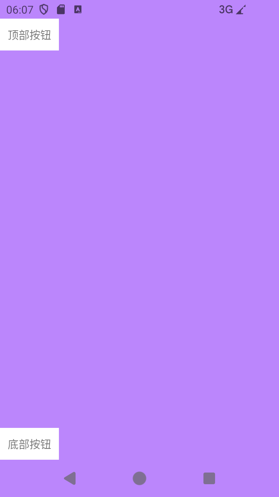
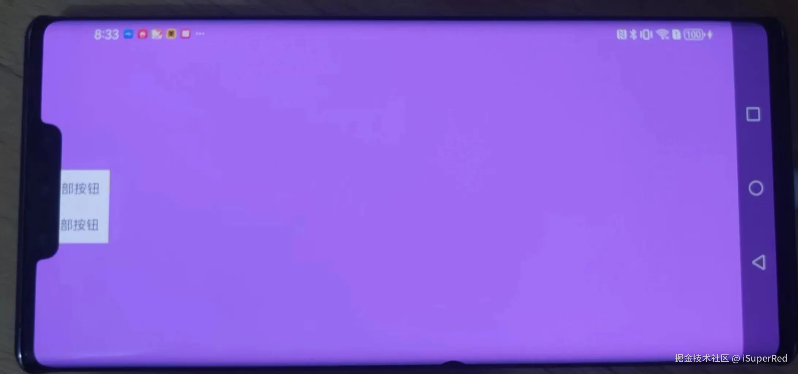
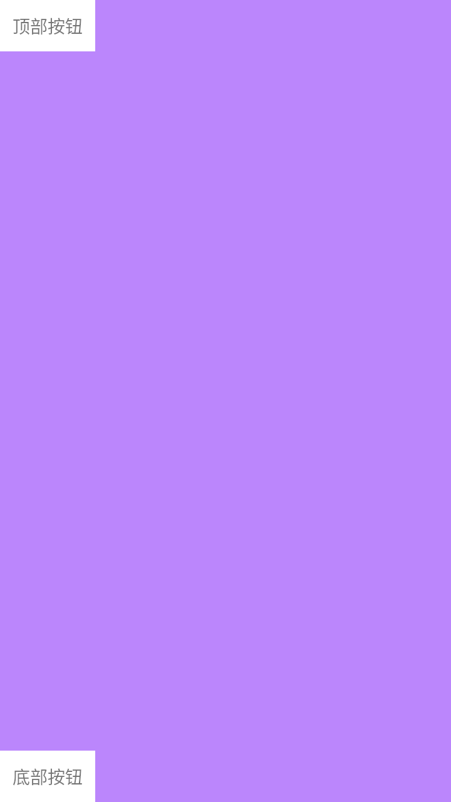
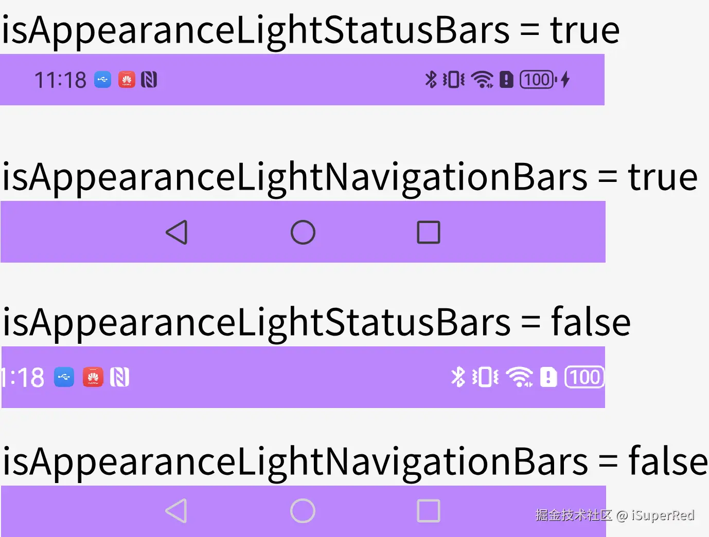

# 状态栏：沉浸式

1、导入库：implementation "androidx.activity:activity-ktx:1.9.2"

2、设置主题：Theme.AppCompat.Light.NoActionBar

```kotlin
        <activity
            android:name=".ImmersiveStatusBarActivity"
            android:exported="false"
            android:theme="@style/Theme.AppCompat.Light.NoActionBar" />
```

3、添加代码：

```kotlin
class ImmersiveStatusBarActivity : AppCompatActivity() {
    private val binding by lazy { ActivityImmersiveStatusBarBinding.inflate(layoutInflater) }

    override fun onCreate(savedInstanceState: Bundle?) {
        // implementation "androidx.activity:activity-ktx:1.9.2"
        // step1
        enableEdgeToEdge()
        super.onCreate(savedInstanceState)
        setContentView(binding.root)
    }
}
```

XML布局-1

```kotlin
<?xml version="1.0" encoding="utf-8"?>
<androidx.constraintlayout.widget.ConstraintLayout xmlns:android="http://schemas.android.com/apk/res/android"
    xmlns:app="http://schemas.android.com/apk/res-auto"
    xmlns:tools="http://schemas.android.com/tools"
    android:layout_width="match_parent"
    android:layout_height="match_parent"
    android:background="#FFBB86FC"
    tools:context=".ImmersiveStatusBarActivity">

</androidx.constraintlayout.widget.ConstraintLayout>
```

4、效果展示



# 导航栏：去掉半透明遮罩

上面的导航栏不是全透明的，在它上面是有个半透明遮罩的。这个遮罩是系统加的，从 Android 10 开始都有这个遮罩。

```kotlin
class WelcomeActivity : AppCompatActivity() {
    override fun onCreate(savedInstanceState: Bundle?) {
        super.onCreate(savedInstanceState)
        enableEdgeToEdge()
        setContentView(R.layout.activity_welcome)
        
        // 这几行代码
        if (Build.VERSION.SDK_INT >= Build.VERSION_CODES.Q) {
            window.isNavigationBarContrastEnforced = false
        }
}
}
```

效果



# 系统栏：安全边衬区

将内容延伸到状态栏和导航栏之后，需要控制一下内容的安全边界，避免可点击的内容区延伸到状态栏和导航栏区域，导致点击不灵敏。此外，可点击内容区也不应该被刘海屏遮挡，遮挡了的话就不能点了。

实现以上这些功能需要 WindowInsets，翻译过来就是“边衬区”的意思。

不加安全边衬区时，示例布局：

```kotlin
<?xml version="1.0" encoding="utf-8"?>
<androidx.constraintlayout.widget.ConstraintLayout xmlns:android="http://schemas.android.com/apk/res/android"
    xmlns:app="http://schemas.android.com/apk/res-auto"
    xmlns:tools="http://schemas.android.com/tools"
    android:layout_width="match_parent"
    android:layout_height="match_parent"
    android:background="#FFBB86FC"
    tools:context=".ImmersiveStatusBarActivity">

    <TextView
        android:id="@+id/buttonTop"
        android:layout_width="wrap_content"
        android:layout_height="wrap_content"
        android:background="@color/white"
        android:padding="10dp"
        android:text="顶部按钮"
        app:layout_constraintStart_toStartOf="parent"
        app:layout_constraintTop_toTopOf="parent"
        tools:ignore="HardcodedText" />

    <TextView
        android:id="@+id/buttonBottom"
        android:layout_width="wrap_content"
        android:layout_height="wrap_content"
        android:background="@color/white"
        android:padding="10dp"
        android:text="底部按钮"
        app:layout_constraintBottom_toBottomOf="parent"
        app:layout_constraintStart_toStartOf="parent"
        tools:ignore="HardcodedText" />

</androidx.constraintlayout.widget.ConstraintLayout>
```

效果：



## 增加安全变忖区

```kotlin
class ImmersiveStatusBarActivity : AppCompatActivity() {
    private val binding by lazy { ActivityImmersiveStatusBarBinding.inflate(layoutInflater) }

    override fun onCreate(savedInstanceState: Bundle?) {
        enableEdgeToEdge()
        super.onCreate(savedInstanceState)
        setContentView(binding.root)

        if (Build.VERSION.SDK_INT >= Build.VERSION_CODES.Q) {
            window.isNavigationBarContrastEnforced = false
        } else {
            // ??
        }

        // 这几行
        ViewCompat.setOnApplyWindowInsetsListener(binding.root) { v, insets ->
            // WindowInsetsCompat.Type.displayCutout() 考虑了横屏下的刘海屏显示效果，可以横屏的话要设置
            val systemBars = insets.getInsets(
                WindowInsetsCompat.Type.systemBars() or WindowInsetsCompat.Type.displayCutout()
            )
            v.setPadding(systemBars.left, systemBars.top, systemBars.right, systemBars.bottom)
            insets
        }
    }
}
```

效果



虽然刘海屏都在状态栏里，但如果只设置 systemBars 的边衬，不设置 displayCutout 的边衬，是不行的。还要考虑到横屏的情况，下图，就是横屏的时候没有设置 displayCutout 边衬，导致内容区被刘海挡住了。



# 系统栏：隐藏

状态栏和导航栏统称为系统栏，真正的“沉浸式”UI应该隐藏系统栏。可以通过调用 windowInsetsController.hide 隐藏系统栏。

```kotlin
class ImmersiveStatusBarActivity : AppCompatActivity() {
    private val binding by lazy { ActivityImmersiveStatusBarBinding.inflate(layoutInflater) }

    override fun onCreate(savedInstanceState: Bundle?) {
        enableEdgeToEdge()
        super.onCreate(savedInstanceState)
        setContentView(binding.root)

        if (Build.VERSION.SDK_INT >= Build.VERSION_CODES.Q) {
            window.isNavigationBarContrastEnforced = false
        } else {
            // ??
        }

        ViewCompat.setOnApplyWindowInsetsListener(binding.root) { v, insets ->
            // WindowInsetsCompat.Type.displayCutout() 考虑了横屏下的刘海屏显示效果，可以横屏的话要设置
            val systemBars = insets.getInsets(
                WindowInsetsCompat.Type.systemBars() or WindowInsetsCompat.Type.displayCutout()
            )
            v.setPadding(systemBars.left, systemBars.top, systemBars.right, systemBars.bottom)
            insets
        }

        hideSystemBars()
    }

    // 这个方法：隐藏系统栏
    private fun hideSystemBars() {
        val windowInsetsController = WindowCompat.getInsetsController(window, window.decorView)
        windowInsetsController.systemBarsBehavior =
            WindowInsetsControllerCompat.BEHAVIOR_SHOW_TRANSIENT_BARS_BY_SWIPE
        windowInsetsController.hide(WindowInsetsCompat.Type.systemBars())
    }
}
```

效果：




# 系统栏功能

下面介绍几个关于系统栏的 Api。

## 状态栏：显示、隐藏

通过以下代码，可以隐藏和显示系统栏，具体隐藏和显示的元素取决于传递的类型参数：

```kotlin
val windowInsetsController = WindowCompat.getInsetsController(window, window.decorView)
windowInsetsController.systemBarsBehavior =
    WindowInsetsControllerCompat.BEHAVIOR_SHOW_TRANSIENT_BARS_BY_SWIPE

windowInsetsController.hide(WindowInsetsCompat.Type.systemBars())
windowInsetsController.show(WindowInsetsCompat.Type.systemBars())
```

WindowInsetsCompat.Type.statusBars() 仅隐藏状态栏。

WindowInsetsCompat.Type.navigationBars() 仅隐藏导航栏。

WindowInsetsCompat.Type.systemBars() 可隐藏这两个系统栏。

## 系统栏：背景色

修改状态栏的背景色：

```kotlin
window.statusBarColor = ContextCompat.getColor(this, R.color.purple_200)
```

修改导航栏的背景色：

```kotlin
window.navigationBarColor = ContextCompat.getColor(this, R.color.purple_200)
```

注意：如果 tagetSdk 是 35+ 且设备系统是 Android 15 的话，这两个属性已经废弃了。

网友测试的结果：

1、如果 tagetSdk 是 35+ 但设备系统小于 Android 15 或者 tagetSdk 是 34 但设备系统是 Android 15 的话，这两个属性都是能起作用的；

2、如果 tagetSdk 是 35+ 且设备系统是 Android 15 的话，两个属性都不起作用。

详细描述看官网文档：[developer.android.com/about/versi…](https://link.juejin.cn?target=https%3A%2F%2Fdeveloper.android.com%2Fabout%2Fversions%2F15%2Fbehavior-changes-15)

## 系统栏：前景色

控制状态栏内容（例如时间、电池图标、通知图标）的外观：

```ini
        // 控制状态栏内容（例如时间、电池图标、通知图标）的外观：
        val windowInsetsControllerSta = WindowCompat.getInsetsController(window, window.decorView)
        // 状态栏-黑色外观
//        windowInsetsControllerSta.isAppearanceLightStatusBars = true
        // 状态栏-白色外观
        windowInsetsControllerSta.isAppearanceLightStatusBars = false

```

控制导航栏内容（例如返回、主页、最近应用按钮）的外观：

```ini
        // 控制导航栏内容（例如返回、主页、最近应用按钮）的外观：
        val windowInsetsControllerNav = WindowCompat.getInsetsController(window, window.decorView)
        // 导航栏-黑色外观
//        windowInsetsControllerNav.isAppearanceLightNavigationBars = true
        // 导航栏-白色外观
        windowInsetsControllerNav.isAppearanceLightNavigationBars = false
```

以下图示解释了参数的具体意义：



# 参考

[Android “edge to edge”特性（一）官方“沉浸式”方案实探](https://juejin.cn/post/7395866692772085800)