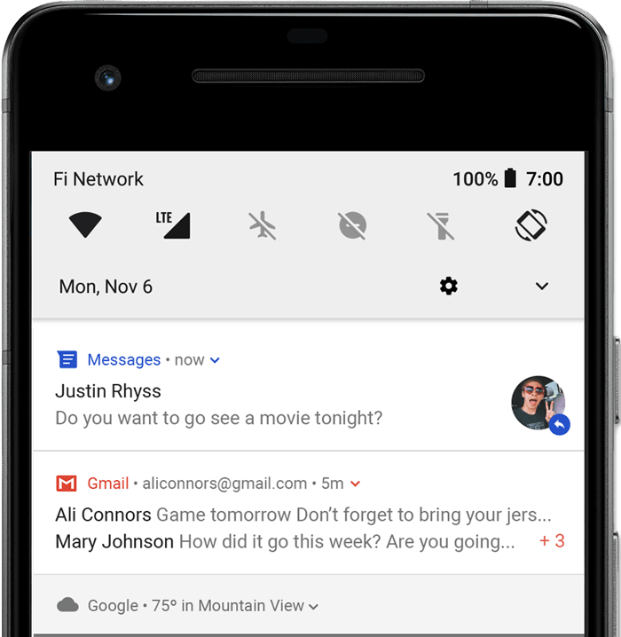

# 通知概览

通知是在应用界面之外显示的消息，用于向用户提供提醒、来自他人的消息或应用中的其他实时信息。用户可以点按通知以打开您的应用，也可以直接从通知中执行操作。

本文将概要介绍**通知的显示位置及可用功能**。

> 如需开始构建通知，请参阅[创建通知](https://developer.android.google.cn/training/notify-user/build-notification?hl=zh-cn)。
>
> 如需详细了解通知设计和交互模式，请参阅[通知设计指南](https://developer.android.google.cn/design/ui/mobile/guides/home-screen/notifications?hl=zh-cn)。

## 1、在设备上的显示方式和效果

系统会自动以不同格式向位于不同位置的用户显示通知。 通知在状态栏中显示为图标，在抽屉式通知栏中显示为更详细的条目，并在应用图标上显示一个标记。通知也会显示在配对的穿戴式设备上。

### 状态栏通知

发出通知后，通知先以图标的形式在状态栏中显示。


**图 1.** 通知图标显示在状态栏的左侧。

### 抽屉式通知栏通知

用户可以在状态栏向下滑动以打开抽屉式通知栏，并在其中查看更多详情及对通知执行操作。



**图 2.**抽屉式通知栏中的通知。

用户可以向下拖动抽屉式通知栏中的某条通知以查看展开后的视图，其中会显示更多内容以及操作按钮（如果有）。从 Android 13 开始，此展开视图包含一个按钮，可让用户[停止具有持续前台服务的应用](https://developer.android.google.cn/guide/components/foreground-services?hl=zh-cn#handle-user-initiated-stop)。

在应用或用户关闭通知之前，通知会一直显示在抽屉式通知栏中。

### 提醒式（浮动）通知

从 Android 5.0 开始，通知可以短暂地显示在浮动窗口中，称为“浮动通知”。通常适用于用户需要立即了解的重要通知，并且仅在设备处于解锁状态时显示。


**图 3.** 浮动通知显示在前台应用前。

在应用发出通知时，系统会显示浮动通知。它很快就会消失，但还会显示在抽屉式通知栏中。

可能触发浮动通知的条件包括：

- 用户的 activity 处于全屏模式，例如当应用使用 [`fullScreenIntent`](https://developer.android.google.cn/reference/android/app/Notification?hl=zh-cn#fullScreenIntent) 时。
- 通知的优先级较高，并在搭载 Android 7.1（API 级别 25）及更低版本的设备上使用铃声或振动。
- 在搭载 Android 8.0（API 级别 26）及更高版本的设备上，[通知渠道](https://developer.android.google.cn/develop/ui/views/notifications?hl=zh-cn#ManageChannels)的重要性较高。

### 锁定屏幕通知

从 Android 5.0 开始，通知可以显示在锁定屏幕上。

可以通过编程方式设置应用发布的通知是否在安全锁定屏幕上显示，如果显示，则设置可见的详细程度。

用户可以通过系统设置选择锁定屏幕通知中可见信息的详细程度或停用所有锁定屏幕通知。从 Android 8.0 开始，用户可以停用或启用每个通知渠道的锁定屏幕通知。


**图 4.** 锁定屏幕上已隐藏敏感内容的通知。

如需了解详情，请参阅[设置锁定屏幕可见性](https://developer.android.google.cn/training/notify-user/build-notification?hl=zh-cn#lockscreenNotification)。

### 桌面应用图标通知（角标通知）

在搭载 Android 8.0（API 级别 26）及更高版本的设备上的桌面中，应用图标通过在相应的应用图标上显示彩色标记（称为通知圆点）来表示新通知。

用户可以轻触并按住某个应用图标来查看该应用的通知。用户可以在该菜单中关闭通知或根据通知执行操作（类似于抽屉式通知栏）。


**图 5.** 通知标记和“轻触并按住”菜单。

如需详细了解标志的工作原理，请参阅[修改通知标志](https://developer.android.google.cn/training/notify-user/badges?hl=zh-cn)。

### Wear OS 设备

如果用户有配对的 Wear OS 设备，您的所有通知都会自动显示在配对设备上，包括可展开的详细信息和操作按钮。

您可以通过自定义通知在穿戴式设备上的外观以及提供不同的操作（包括建议的回复和语音输入回复）来提升体验。如需了解详情，请参阅如何[向通知中添加穿戴式设备专属功能](https://developer.android.google.cn/training/wearables/notifications?hl=zh-cn#add-wearable-features)。


**图 6.** 通知会自动显示在已配对的 Wear OS 设备上。

## 2、通知显示剖析

通知的设计由系统模板决定，应用可以定义模板的每个部分的内容。通知的某些详细信息仅在展开视图中显示。


**图 7.** 包含基本详情的通知。

图 7 显示了通知的最常见部分，如下所示：

1. 小图标：必需；使用 `setSmallIcon()` 进行设置。
2. 应用名称：由系统提供。
3. 时间戳：由系统提供，但您可以使用 `setWhen()` 替换它，也可以使用 `setShowWhen(false)` 隐藏它。
4. 大图标：可选；通常仅用于联系人照片。 请勿将其用于应用图标。使用 `setLargeIcon()` 进行设置。
5. 标题：可选；使用 `setContentTitle()` 进行设置。
6. 文本：可选；使用 `setContentText()` 进行设置。

我们强烈建议使用系统模板，以便在所有设备上实现适当的设计兼容性。如有必要，您可以[创建自定义通知布局](https://developer.android.google.cn/training/notify-user/custom-notification?hl=zh-cn)。

如需详细了解如何创建包含上述功能及其他功能的通知，请参阅[创建通知](https://developer.android.google.cn/training/notify-user/build-notification?hl=zh-cn)。

### 通知操作

虽然并非强制要求，但最好让每个通知在被点按时打开相应的应用 activity。此外，还可以添加操作按钮（通常无需打开 activity）。


**图 8.** 带有操作按钮的通知。

从 Android 7.0（API 级别 24）开始，您可以添加操作来回复消息或**直接从通知中输入其他文本（还没用过这个）**。

从 Android 10（API 级别 29）开始，平台可以自动生成操作按钮，此类按钮包含基于 intent 的建议操作。

[创建通知](https://developer.android.google.cn/training/notify-user/build-notification?hl=zh-cn)中详细介绍了如何添加操作按钮。

#### 要求解锁设备

用户可能会在设备的锁定屏幕上看到通知操作。如果通知操作导致应用启动 activity 或发送直接回复，则用户必须解锁设备，然后应用才能调用该通知操作。

在 Android 12（API 级别 31）及更高版本中，您可以配置通知操作，以便应用必须解锁设备才能调用该操作，无论该操作启动哪个工作流。此选项可为锁定设备上的通知增添一道额外的安全屏障。

如需要求在应用调用指定的通知操作之前解锁设备，请在创建通知操作时将 `true` 传入 [`setAuthenticationRequired()`](https://developer.android.google.cn/reference/android/app/Notification.Action.Builder?hl=zh-cn#setAuthenticationRequired(boolean))，如下所示：

```kotlin
val moreSecureNotification = Notification.Action.Builder(...)
    // This notification always requests authentication when invoked
    // from a lock screen.
    .setAuthenticationRequired(true)
    .build()
```

### 展开式通知

默认情况下，通知的文字内容会被截断以放在一行。如果您想更长的通知，可以通过应用一个额外的模板来启用更大的可展开文本区域，如图 9 所示。


**图 9.** 适用于大型文本的展开式通知。

您还可以使用图片、收件箱样式、聊天对话或媒体播放控件来创建展开式通知。如需了解详情，请参阅[创建展开式通知](https://developer.android.google.cn/training/notify-user/expanded?hl=zh-cn)。

## 3、通知更新和分组

为避免应用在有其他更新时向用户发送多个通知或冗余通知，请[更新现有通知](https://developer.android.google.cn/training/notify-user/build-notification?hl=zh-cn#Updating)（而不是发出新通知），或使用[收件箱样式的通知](https://developer.android.google.cn/training/notify-user/expanded?hl=zh-cn#inbox-style)显示对话更新。

不过，如果需要传递多个通知，不妨考虑将单独的通知分为一组（适用于 Android 7.0 及更高版本）。

通过通知组，可以将多个通知收起到抽屉式通知栏中的一条通知中，并在其中显示摘要。用户可以逐步展开通知组及其中的每个通知以获取更多详细信息，如图 10 所示。


**图 10.** 收起和展开的通知组。

如需了解如何将通知添加到通知组，请参阅[创建通知组](https://developer.android.google.cn/training/notify-user/group?hl=zh-cn)。

**注意** ：如果同一应用发送了 4 条或更多条通知且未指定分组，系统会自动将这些通知分为一组。

## 4、通知渠道

从 Android 8.0（API 级别 26）开始，所有通知都必须分配到相应的渠道，否则通知将不会显示。这样一来，用户便可以为您的应用停用特定的通知渠道，而不是停用您的所有通知。用户可以通过 Android 系统设置控制每个频道的视觉和听觉选项，如图 11 所示。用户还可以轻触并按住通知，以更改关联渠道的行为。

在搭载 Android 7.1（API 级别 25）及更低版本的设备上，用户只能按应用管理通知。实际上，在 Android 7.1 及更低版本上，每个应用只有一个渠道。


**图 11.** 时钟应用及该应用的某个渠道的通知设置。

**注意** ：界面将渠道称为“类别”。

一个应用可以针对应用发出的每种通知类型使用单独的渠道。应用还可以创建通知渠道来响应用户做出的选择。例如，可以为用户在即时通讯应用中创建的每个会话组设置单独的通知渠道。

在搭载 Android 8.0 及更高版本的设备上，您还可以通过渠道指定通知的重要性级别，以便发布到同一通知渠道的所有通知都具有相同的行为。下一部分对此进行了介绍。

如需了解详情，请参阅[创建和管理通知渠道](https://developer.android.google.cn/training/notify-user/channels?hl=zh-cn)。

## 5、通知的重要程度

Android 利用通知的重要性来确定通知在视觉和听觉上对用户干扰的程度。通知的重要性越高，干扰程度就越高。

在 Android 7.1（API 级别 25）及更低版本中，通知的重要性由通知的 [`priority`](https://developer.android.google.cn/reference/androidx/core/app/NotificationCompat.Builder?hl=zh-cn#setPriority(int)) 决定。

在搭载 Android 8.0（API 级别 26）及更高版本的设备上，通知的重要性由通知发布到的渠道的 [`importance`](https://developer.android.google.cn/reference/android/app/NotificationChannel?hl=zh-cn#setImportance(int)) 决定。用户可以在系统设置中更改通知渠道的重要性，如图 12 所示。


**图 12.** 在搭载 Android 8.0 及更高版本的设备上，用户可以更改每个渠道的重要性。

可能的重要性级别和关联的通知行为如下：

- 紧急：发出提示音，并以浮动通知的形式显示。
- 高：发出提示音。
- 中：不发出声音。
- 低：不发出声音，也不会在状态栏中显示。

无论重要程度如何，所有通知都会在非干扰系统界面的位置显示，例如，显示在抽屉式通知栏中，以及在启动器图标上作为标记显示。不过，您可以[修改通知标记的外观](https://developer.android.google.cn/training/notify-user/badges?hl=zh-cn)。

如需了解详情，请参阅[如何设置重要性](https://developer.android.google.cn/training/notify-user/build-notification?hl=zh-cn#Priority)。

## 6、勿扰模式

从 Android 5.0（API 级别 21）开始，用户可以启用勿扰模式，以关闭所有通知的提示音和振动。除非用户另行指定，否则通知仍会照常显示在系统界面中。

“请勿打扰”模式有三个级别：

- 完全静音：阻止所有提示音和振动（包括闹钟、音乐、视频和游戏）。
- 仅限闹钟：阻止所有提示音和振动，闹钟除外。
- 仅限优先事项：用户可以配置哪些系统级类别可以打扰他们，例如仅限闹钟、提醒、活动、来电或消息等。对于消息和来电，用户可以根据发送者或来电者进行过滤，如图 13 所示。


**图 13.** 用户可以根据系统级类别（左侧）和发送者或来电者（右侧）允许显示通知。

在 Android 8.0（API 级别 26）及更高版本中，用户还可以通过按渠道替换勿扰模式来允许应用特定类别（也称为渠道）显示通知。例如，付款应用可能会提供与取款和存款相关的通知渠道。在优先模式下，用户可以允许显示取款通知和/或存款通知。

在搭载 Android 7.1（API 级别 25）及更低版本的设备上，用户可以按应用（而不是按渠道）允许显示通知。

如需为这些用户设置配置通知，您必须[设置系统级类别](https://developer.android.google.cn/training/notify-user/build-notification?hl=zh-cn#system-category)。

## 前台服务的通知

如果您的应用正在运行*前台服务* - 一种在后台运行、长期存在且用户可察觉到的 [`Service`](https://developer.android.google.cn/reference/android/app/Service?hl=zh-cn)（如媒体播放器），则需要发出通知。无法像关闭其他通知一样关闭此通知。如需移除该通知，必须停止运行服务或从前台状态中移除服务。

如需了解详情，请参阅[前台服务](https://developer.android.google.cn/guide/components/foreground-services?hl=zh-cn)。如果您要构建媒体播放器，另请阅读[在后台播放媒体](https://developer.android.google.cn/media/implement/playback-app?hl=zh-cn#playing_media_in_the_background)。

## 通知发布限制

从 Android 8.1（API 级别 27）开始，应用每秒最多只能发出一次通知提示音。如果应用在一秒内发出了多条通知，这些通知都会按预期显示，但是每秒中只有第一条通知发出提示音。

不过，Android 还对通知更新频率设定了限制。如果您过于频繁地发布单个通知的更新（例如在不到 1 秒的时间内发布多次），系统可能会丢弃更新。

## 通知的兼容性

Android 通知系统界面以及与通知相关的 API 一直在不断改进。如需在支持旧版设备的同时使用最新的通知 API 功能，请使用支持库通知 API、[`NotificationCompat`](https://developer.android.google.cn/reference/androidx/core/app/NotificationCompat?hl=zh-cn) 及其子类以及 [`NotificationManagerCompat`](https://developer.android.google.cn/reference/androidx/core/app/NotificationManagerCompat?hl=zh-cn)。这样，您就无需编写条件代码来检查 API 级别，因为这些 API 会处理这种代码。

`NotificationCompat` 会随着平台的发展不断更新，旨在纳入最新的方法。不过，某个方法在 `NotificationCompat`中可用并不能保证在旧款设备上提供相应功能。在某些情况下，调用新引入的 API 会导致旧版设备上出现空操作。

下面总结了 Android 通知在行为上最显著的变更（按 API 级别划分）。

#### Android 5.0，API 级别 21

- 引入了锁定屏幕和浮动通知。
- 允许用户将手机设为勿扰模式，并配置允许哪些通知在设备处于“仅限优先”模式时打扰他们。
- 添加了设置是否在锁定屏幕上显示通知的方法（例如 [`setVisibility()`](https://developer.android.google.cn/reference/androidx/core/app/NotificationCompat.Builder?hl=zh-cn#setVisibility(int))），并指定通知文本的“公开”版本。
- 添加了 `setPriority()` 方法，告知系统通知的干扰程度。例如，将优先级设置为“高”会使通知以浮动通知的形式显示。
- 为 Android Wear（现称为 Wear OS）设备添加了通知堆栈支持。使用 [`setGroup()`](https://developer.android.google.cn/reference/androidx/core/app/NotificationCompat.Builder?hl=zh-cn#setGroup(java.lang.String)) 将通知放入堆栈。在 Android 7.0（API 级别 24）之前，平板电脑或手机不支持通知堆栈（之后称为组或软件包）。

#### Android 7.0，API 级别 24

- 调整了通知模板的样式，以强调主打图片和头像。
- 添加了三个通知模板：一个用于即时通讯应用，另外两个用于使用可展开功能和其他系统装饰来装饰自定义内容视图。
- 添加了对通知组的手持设备（例如手机和平板电脑）的支持。使用与 Android 5.0（API 级别 21）中引入的 Android Wear（现称为 Wear OS）通知堆栈相同的 API。
- 允许用户使用内嵌回复功能在通知内回复。用户可以输入文本，系统会将文本路由到通知的父级应用。

#### Android 8.0，API 级别 26

- 将各个通知放入特定[渠道](https://developer.android.google.cn/develop/ui/views/notifications?hl=zh-cn#ManageChannels)。
- 允许用户按渠道关闭通知，而不是关闭来自某个应用的所有通知。
- 让具有活动通知的应用在主屏幕或启动器屏幕上的应用图标上方显示通知标志。
- 允许用户暂停抽屉式通知栏中的通知。您可以为通知设置自动超时时间
- 通过此设置，您可以设置通知的背景颜色。
- 将一些与通知行为相关的 API 从 [`Notification`](https://developer.android.google.cn/reference/android/app/Notification?hl=zh-cn) 移至 [`NotificationChannel`](https://developer.android.google.cn/reference/android/app/NotificationChannel?hl=zh-cn)。例如，对于 Android 8.0 及更高版本，请使用 [`NotificationChannel.setImportance()`](https://developer.android.google.cn/reference/android/app/NotificationChannel?hl=zh-cn#setImportance(int)) 而非 [`NotificationCompat.Builder.setPriority()`](https://developer.android.google.cn/reference/androidx/core/app/NotificationCompat.Builder?hl=zh-cn#setPriority(int))。

#### Android 13.0，API 级别 33

- 添加[运行时权限](https://developer.android.google.cn/guide/topics/ui/notifiers/notification-permission?hl=zh-cn)。为了让您的应用能够发送[非豁免](https://developer.android.google.cn/guide/topics/ui/notifiers/notification-permission?hl=zh-cn#exemptions)通知，用户必须向您的应用授予此权限。

#### Android 14.0，API 级别 34

- 仅限提供通话和闹钟的应用使用全屏 intent 通知。使用 [`NotificationManager.canUseFullScreenIntent`](https://developer.android.google.cn/reference/android/app/NotificationManager?hl=zh-cn#canUseFullScreenIntent()) API 检查您的应用是否具有权限。否则，您的应用可以使用 [`ACTION_MANAGE_APP_USE_FULL_SCREEN_INTENT`](https://developer.android.google.cn/reference/android/provider/Settings?hl=zh-cn#ACTION_MANAGE_APP_USE_FULL_SCREEN_INTENT) 启动设置页面，在该页面中，用户可以授予权限。
- 即使设置了 [`Notification.FLAG_ONGOING_EVENT`](https://developer.android.google.cn/reference/android/app/Notification?hl=zh-cn#FLAG_ONGOING_EVENT) 标志，也允许用户关闭通知操作来更改用户体验不可关闭通知的方式。如果已设置 `Notification.FLAG_ONGOING_EVENT` 标志或设备政策控制器 (DPC) 和企业支持软件包，则这不适用于 `CallStyle` 通知。当手机处于锁定状态或用户选择**全部清除**时，此规则也不适用。（注：还不太理解这一条，实际项目中也没用到过）


# 参考

[官方文档：通知概览](https://developer.android.google.cn/develop/ui/views/notifications?hl=zh-cn#limits)


