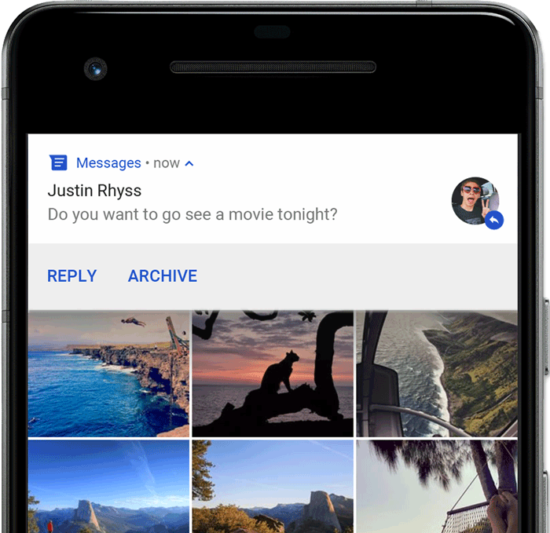
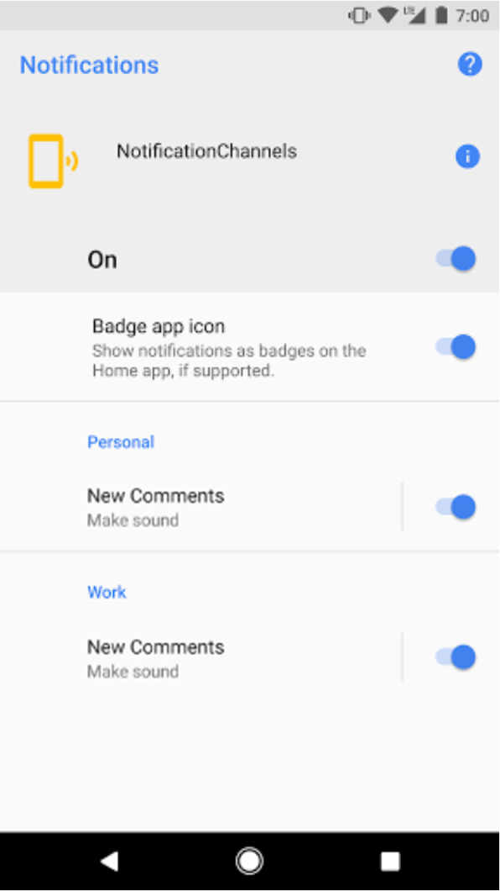
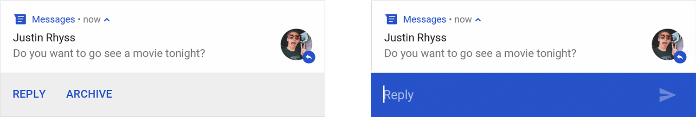

# 通知概览

通知是在应用界面之外显示的消息，用于向用户提供提醒、来自他人的消息或应用中的其他实时信息。用户可以点按通知以打开你的应用，也可以直接从通知中执行操作。

本文将概要介绍**通知的显示位置及可用功能**。

> 如需开始构建通知，请参阅[创建通知](https://developer.android.google.cn/training/notify-user/build-notification?hl=zh-cn)。
>
> 如需详细了解通知设计和交互模式，请参阅[通知设计指南](https://developer.android.google.cn/design/ui/mobile/guides/home-screen/notifications?hl=zh-cn)。

## 1、在设备上的显示方式和效果

系统会自动以不同格式向位于不同位置的用户显示通知。 通知在状态栏中显示为图标，在抽屉式通知栏中显示为更详细的条目，并在应用图标上显示一个标记。通知也会显示在配对的穿戴式设备上。

### 状态栏通知

发出通知后，通知先以图标的形式在状态栏中显示。


**图 1.** 通知图标显示在状态栏的左侧。

### 抽屉式通知栏通知

用户可以在状态栏向下滑动以打开抽屉式通知栏，并在其中查看更多详情及对通知执行操作。


**图 2.**抽屉式通知栏中的通知。

用户可以向下拖动抽屉式通知栏中的某条通知以查看展开后的视图，其中会显示更多内容以及操作按钮（如果有）。从 Android 13 开始，此展开视图包含一个按钮，可让用户[停止具有持续前台服务的应用](https://developer.android.google.cn/guide/components/foreground-services?hl=zh-cn#handle-user-initiated-stop)。

在应用或用户关闭通知之前，通知会一直显示在抽屉式通知栏中。

### 提醒式（浮动）通知

从 Android 5.0 开始，通知可以短暂地显示在浮动窗口中，称为“浮动通知”。通常适用于用户需要立即了解的重要通知，并且仅在设备处于解锁状态时显示。



**图 3.** 浮动通知显示在前台应用前。

在应用发出通知时，系统会显示浮动通知。它很快就会消失，但还会显示在抽屉式通知栏中。

可能触发浮动通知的条件包括：

- 用户的 activity 处于全屏模式，例如当应用使用 [`fullScreenIntent`](https://developer.android.google.cn/reference/android/app/Notification?hl=zh-cn#fullScreenIntent) 时。
- 通知的优先级较高，并在搭载 Android 7.1（API 级别 25）及更低版本的设备上使用铃声或振动。
- 在搭载 Android 8.0（API 级别 26）及更高版本的设备上，[通知渠道](https://developer.android.google.cn/develop/ui/views/notifications?hl=zh-cn#ManageChannels)的重要性较高。

### 锁定屏幕通知

从 Android 5.0 开始，通知可以显示在锁定屏幕上。

可以通过编程方式设置应用发布的通知是否在安全锁定屏幕上显示，如果显示，则设置可见的详细程度。

用户可以通过系统设置选择锁定屏幕通知中可见信息的详细程度或停用所有锁定屏幕通知。从 Android 8.0 开始，用户可以停用或启用每个通知渠道的锁定屏幕通知。


**图 4.** 锁定屏幕上已隐藏敏感内容的通知。

如需了解详情，请参阅[设置锁定屏幕可见性](https://developer.android.google.cn/training/notify-user/build-notification?hl=zh-cn#lockscreenNotification)。

### 桌面应用图标通知（角标通知）

在搭载 Android 8.0（API 级别 26）及更高版本的设备上的桌面中，应用图标通过在相应的应用图标上显示彩色标记（称为通知圆点）来表示新通知。

用户可以轻触并按住某个应用图标来查看该应用的通知。用户可以在该菜单中关闭通知或根据通知执行操作（类似于抽屉式通知栏）。


**图 5.** 通知标记和“轻触并按住”菜单。

如需详细了解标志的工作原理，请参阅[修改通知标志](https://developer.android.google.cn/training/notify-user/badges?hl=zh-cn)。

### Wear OS 设备

如果用户有配对的 Wear OS 设备，你的所有通知都会自动显示在配对设备上，包括可展开的详细信息和操作按钮。

你可以通过自定义通知在穿戴式设备上的外观以及提供不同的操作（包括建议的回复和语音输入回复）来提升体验。如需了解详情，请参阅如何[向通知中添加穿戴式设备专属功能](https://developer.android.google.cn/training/wearables/notifications?hl=zh-cn#add-wearable-features)。


**图 6.** 通知会自动显示在已配对的 Wear OS 设备上。

## 2、通知显示剖析

通知的设计由系统模板决定，应用可以定义模板的每个部分的内容。通知的某些详细信息仅在展开视图中显示。


**图 7.** 包含基本详情的通知。

图 7 显示了通知的最常见部分，如下所示：

1. 小图标：必需；使用 `setSmallIcon()` 进行设置。
2. 应用名称：由系统提供。
3. 时间戳：由系统提供，但你可以使用 `setWhen()` 替换它，也可以使用 `setShowWhen(false)` 隐藏它。
4. 大图标：可选；通常仅用于联系人照片。 请勿将其用于应用图标。使用 `setLargeIcon()` 进行设置。
5. 标题：可选；使用 `setContentTitle()` 进行设置。
6. 文本：可选；使用 `setContentText()` 进行设置。

我们强烈建议使用系统模板，以便在所有设备上实现适当的设计兼容性。如有必要，你可以[创建自定义通知布局](https://developer.android.google.cn/training/notify-user/custom-notification?hl=zh-cn)。

如需详细了解如何创建包含上述功能及其他功能的通知，请参阅[创建通知](https://developer.android.google.cn/training/notify-user/build-notification?hl=zh-cn)。

### 通知操作

虽然并非强制要求，但最好让每个通知在被点按时打开相应的应用 activity。此外，还可以添加操作按钮（通常无需打开 activity）。


**图 8.** 带有操作按钮的通知。

从 Android 7.0（API 级别 24）开始，你可以添加操作来回复消息或**直接从通知中输入其他文本（还没用过这个）**。

从 Android 10（API 级别 29）开始，平台可以自动生成操作按钮，此类按钮包含基于 intent 的建议操作。

[创建通知](https://developer.android.google.cn/training/notify-user/build-notification?hl=zh-cn)中详细介绍了如何添加操作按钮。

#### 要求解锁设备

用户可能会在设备的锁定屏幕上看到通知操作。如果通知操作导致应用启动 activity 或发送直接回复，则用户必须解锁设备，然后应用才能调用该通知操作。

在 Android 12（API 级别 31）及更高版本中，你可以配置通知操作，以便应用必须解锁设备才能调用该操作，无论该操作启动哪个工作流。此选项可为锁定设备上的通知增添一道额外的安全屏障。

如需要求在应用调用指定的通知操作之前解锁设备，请在创建通知操作时将 `true` 传入 [`setAuthenticationRequired()`](https://developer.android.google.cn/reference/android/app/Notification.Action.Builder?hl=zh-cn#setAuthenticationRequired(boolean))，如下所示：

```kotlin
val moreSecureNotification = Notification.Action.Builder(...)
    // This notification always requests authentication when invoked
    // from a lock screen.
    .setAuthenticationRequired(true)
    .build()
```

### 展开式通知

默认情况下，通知的文字内容会被截断以放在一行。如果你想更长的通知，可以通过应用一个额外的模板来启用更大的可展开文本区域，如图 9 所示。


**图 9.** 适用于大型文本的展开式通知。

你还可以使用图片、收件箱样式、聊天对话或媒体播放控件来创建展开式通知。如需了解详情，请参阅[创建展开式通知](https://developer.android.google.cn/training/notify-user/expanded?hl=zh-cn)。

## 3、通知更新和分组

为避免应用在有其他更新时向用户发送多个通知或冗余通知，请[更新现有通知](https://developer.android.google.cn/training/notify-user/build-notification?hl=zh-cn#Updating)（而不是发出新通知），或使用[收件箱样式的通知](https://developer.android.google.cn/training/notify-user/expanded?hl=zh-cn#inbox-style)显示对话更新。

不过，如果需要传递多个通知，不妨考虑将单独的通知分为一组（适用于 Android 7.0 及更高版本）。

通过通知组，可以将多个通知收起到抽屉式通知栏中的一条通知中，并在其中显示摘要。用户可以逐步展开通知组及其中的每个通知以获取更多详细信息，如图 10 所示。


**图 10.** 收起和展开的通知组。

如需了解如何将通知添加到通知组，请参阅[创建通知组](https://developer.android.google.cn/training/notify-user/group?hl=zh-cn)。

**注意** ：如果同一应用发送了 4 条或更多条通知且未指定分组，系统会自动将这些通知分为一组。

## 4、通知渠道

从 Android 8.0（API 级别 26）开始，所有通知都必须分配到相应的渠道，否则通知将不会显示。这样一来，用户便可以为你的应用停用特定的通知渠道，而不是停用你的所有通知。用户可以通过 Android 系统设置控制每个频道的视觉和听觉选项，如图 11 所示。用户还可以轻触并按住通知，以更改关联渠道的行为。

在搭载 Android 7.1（API 级别 25）及更低版本的设备上，用户只能按应用管理通知。实际上，在 Android 7.1 及更低版本上，每个应用只有一个渠道。


**图 11.** 时钟应用及该应用的某个渠道的通知设置。

**注意** ：界面将渠道称为“类别”。

一个应用可以针对应用发出的每种通知类型使用单独的渠道。应用还可以创建通知渠道来响应用户做出的选择。例如，可以为用户在即时通讯应用中创建的每个会话组设置单独的通知渠道。

在搭载 Android 8.0 及更高版本的设备上，你还可以通过渠道指定通知的重要性级别，以便发布到同一通知渠道的所有通知都具有相同的行为。下一部分对此进行了介绍。

如需了解详情，请参阅[创建和管理通知渠道](https://developer.android.google.cn/training/notify-user/channels?hl=zh-cn)。

## 5、通知的重要程度

Android 利用通知的重要性来确定通知在视觉和听觉上对用户干扰的程度。通知的重要性越高，干扰程度就越高。

在 Android 7.1（API 级别 25）及更低版本中，通知的重要性由通知的 [`priority`](https://developer.android.google.cn/reference/androidx/core/app/NotificationCompat.Builder?hl=zh-cn#setPriority(int)) 决定。

在搭载 Android 8.0（API 级别 26）及更高版本的设备上，通知的重要性由通知发布到的渠道的 [`importance`](https://developer.android.google.cn/reference/android/app/NotificationChannel?hl=zh-cn#setImportance(int)) 决定。用户可以在系统设置中更改通知渠道的重要性，如图 12 所示。


**图 12.** 在搭载 Android 8.0 及更高版本的设备上，用户可以更改每个渠道的重要性。

可能的重要性级别和关联的通知行为如下：

- 紧急：发出提示音，并以浮动通知的形式显示。
- 高：发出提示音。
- 中：不发出声音。
- 低：不发出声音，也不会在状态栏中显示。

无论重要程度如何，所有通知都会在非干扰系统界面的位置显示，例如，显示在抽屉式通知栏中，以及在启动器图标上作为标记显示。不过，你可以[修改通知标记的外观](https://developer.android.google.cn/training/notify-user/badges?hl=zh-cn)。

如需了解详情，请参阅[如何设置重要性](https://developer.android.google.cn/training/notify-user/build-notification?hl=zh-cn#Priority)。

## 6、勿扰模式

从 Android 5.0（API 级别 21）开始，用户可以启用勿扰模式，以关闭所有通知的提示音和振动。除非用户另行指定，否则通知仍会照常显示在系统界面中。

“请勿打扰”模式有三个级别：

- 完全静音：阻止所有提示音和振动（包括闹钟、音乐、视频和游戏）。
- 仅限闹钟：阻止所有提示音和振动，闹钟除外。
- 仅限优先事项：用户可以配置哪些系统级类别可以打扰他们，例如仅限闹钟、提醒、活动、来电或消息等。对于消息和来电，用户可以根据发送者或来电者进行过滤，如图 13 所示。


**图 13.** 用户可以根据系统级类别（左侧）和发送者或来电者（右侧）允许显示通知。

在 Android 8.0（API 级别 26）及更高版本中，用户还可以通过按渠道替换勿扰模式来允许应用特定类别（也称为渠道）显示通知。例如，付款应用可能会提供与取款和存款相关的通知渠道。在优先模式下，用户可以允许显示取款通知和/或存款通知。

在搭载 Android 7.1（API 级别 25）及更低版本的设备上，用户可以按应用（而不是按渠道）允许显示通知。

如需为这些用户设置配置通知，你必须[设置系统级类别](https://developer.android.google.cn/training/notify-user/build-notification?hl=zh-cn#system-category)。

## 前台服务的通知

如果你的应用正在运行*前台服务* - 一种在后台运行、长期存在且用户可察觉到的 [`Service`](https://developer.android.google.cn/reference/android/app/Service?hl=zh-cn)（如媒体播放器），则需要发出通知。无法像关闭其他通知一样关闭此通知。如需移除该通知，必须停止运行服务或从前台状态中移除服务。

如需了解详情，请参阅[前台服务](https://developer.android.google.cn/guide/components/foreground-services?hl=zh-cn)。如果你要构建媒体播放器，另请阅读[在后台播放媒体](https://developer.android.google.cn/media/implement/playback-app?hl=zh-cn#playing_media_in_the_background)。

## 通知发布限制

从 Android 8.1（API 级别 27）开始，应用每秒最多只能发出一次通知提示音。如果应用在一秒内发出了多条通知，这些通知都会按预期显示，但是每秒中只有第一条通知发出提示音。

不过，Android 还对通知更新频率设定了限制。如果你过于频繁地发布单个通知的更新（例如在不到 1 秒的时间内发布多次），系统可能会丢弃更新。

## 通知的兼容性

Android 通知系统界面以及与通知相关的 API 一直在不断改进。如需在支持旧版设备的同时使用最新的通知 API 功能，请使用支持库通知 API、[`NotificationCompat`](https://developer.android.google.cn/reference/androidx/core/app/NotificationCompat?hl=zh-cn) 及其子类以及 [`NotificationManagerCompat`](https://developer.android.google.cn/reference/androidx/core/app/NotificationManagerCompat?hl=zh-cn)。这样，你就无需编写条件代码来检查 API 级别，因为这些 API 会处理这种代码。

`NotificationCompat` 会随着平台的发展不断更新，旨在纳入最新的方法。不过，某个方法在 `NotificationCompat`中可用并不能保证在旧款设备上提供相应功能。在某些情况下，调用新引入的 API 会导致旧版设备上出现空操作。

下面总结了 Android 通知在行为上最显著的变更（按 API 级别划分）。

#### Android 5.0，API 级别 21

- 引入了锁定屏幕和浮动通知。
- 允许用户将手机设为勿扰模式，并配置允许哪些通知在设备处于“仅限优先”模式时打扰他们。
- 添加了设置是否在锁定屏幕上显示通知的方法（例如 [`setVisibility()`](https://developer.android.google.cn/reference/androidx/core/app/NotificationCompat.Builder?hl=zh-cn#setVisibility(int))），并指定通知文本的“公开”版本。
- 添加了 `setPriority()` 方法，告知系统通知的干扰程度。例如，将优先级设置为“高”会使通知以浮动通知的形式显示。
- 为 Android Wear（现称为 Wear OS）设备添加了通知堆栈支持。使用 [`setGroup()`](https://developer.android.google.cn/reference/androidx/core/app/NotificationCompat.Builder?hl=zh-cn#setGroup(java.lang.String)) 将通知放入堆栈。在 Android 7.0（API 级别 24）之前，平板电脑或手机不支持通知堆栈（之后称为组或软件包）。

#### Android 7.0，API 级别 24

- 调整了通知模板的样式，以强调主打图片和头像。
- 添加了三个通知模板：一个用于即时通讯应用，另外两个用于使用可展开功能和其他系统装饰来装饰自定义内容视图。
- 添加了对通知组的手持设备（例如手机和平板电脑）的支持。使用与 Android 5.0（API 级别 21）中引入的 Android Wear（现称为 Wear OS）通知堆栈相同的 API。
- 允许用户使用内嵌回复功能在通知内回复。用户可以输入文本，系统会将文本路由到通知的父级应用。

#### Android 8.0，API 级别 26

- 将各个通知放入特定[渠道](https://developer.android.google.cn/develop/ui/views/notifications?hl=zh-cn#ManageChannels)。
- 允许用户按渠道关闭通知，而不是关闭来自某个应用的所有通知。
- 让具有活动通知的应用在主屏幕或启动器屏幕上的应用图标上方显示通知标志。
- 允许用户暂停抽屉式通知栏中的通知。你可以为通知设置自动超时时间
- 通过此设置，你可以设置通知的背景颜色。
- 将一些与通知行为相关的 API 从 [`Notification`](https://developer.android.google.cn/reference/android/app/Notification?hl=zh-cn) 移至 [`NotificationChannel`](https://developer.android.google.cn/reference/android/app/NotificationChannel?hl=zh-cn)。例如，对于 Android 8.0 及更高版本，请使用 [`NotificationChannel.setImportance()`](https://developer.android.google.cn/reference/android/app/NotificationChannel?hl=zh-cn#setImportance(int)) 而非 [`NotificationCompat.Builder.setPriority()`](https://developer.android.google.cn/reference/androidx/core/app/NotificationCompat.Builder?hl=zh-cn#setPriority(int))。

#### Android 13.0，API 级别 33

- 添加[运行时权限](https://developer.android.google.cn/guide/topics/ui/notifiers/notification-permission?hl=zh-cn)。为了让你的应用能够发送[非豁免](https://developer.android.google.cn/guide/topics/ui/notifiers/notification-permission?hl=zh-cn#exemptions)通知，用户必须向你的应用授予此权限。

#### Android 14.0，API 级别 34

- 仅限提供通话和闹钟的应用使用全屏 intent 通知。使用 [`NotificationManager.canUseFullScreenIntent`](https://developer.android.google.cn/reference/android/app/NotificationManager?hl=zh-cn#canUseFullScreenIntent()) API 检查你的应用是否具有权限。否则，你的应用可以使用 [`ACTION_MANAGE_APP_USE_FULL_SCREEN_INTENT`](https://developer.android.google.cn/reference/android/provider/Settings?hl=zh-cn#ACTION_MANAGE_APP_USE_FULL_SCREEN_INTENT) 启动设置页面，在该页面中，用户可以授予权限。
- 即使设置了 [`Notification.FLAG_ONGOING_EVENT`](https://developer.android.google.cn/reference/android/app/Notification?hl=zh-cn#FLAG_ONGOING_EVENT) 标志，也允许用户关闭通知操作来更改用户体验不可关闭通知的方式。如果已设置 `Notification.FLAG_ONGOING_EVENT` 标志或设备政策控制器 (DPC) 和企业支持软件包，则这不适用于 `CallStyle` 通知。当手机处于锁定状态或用户选择**全部清除**时，此规则也不适用。（注：还不太理解这一条，实际项目中也没用到过）

# 通知运行时权限

Android 13（API 级别 33）及更高版本支持用于从应用发送[非豁免](https://developer.android.google.cn/develop/ui/views/notifications/notification-permission?hl=zh-cn#exemptions)（包括前台服务 [FGS]）通知的[运行时权限](https://developer.android.google.cn/guide/topics/permissions/overview?hl=zh-cn#runtime)：[`POST_NOTIFICATIONS`](https://developer.android.google.cn/reference/android/Manifest.permission?hl=zh-cn#POST_NOTIFICATIONS)。此更改有助于用户专注于最重要的通知。

强烈建议你尽快以 Android 13 或更高版本为目标平台，以利用此功能提供的额外控制能力和灵活性。如果你继续以 12L（API 级别 32）或更低版本为目标平台，你将失去[在应用功能环境中请求权限](https://developer.android.google.cn/develop/ui/views/notifications/notification-permission?hl=zh-cn#request-in-context)的某些灵活性。

**注意**：应用无需请求 `POST_NOTIFICATIONS` 权限即可启动前台服务。但是，应用必须在启动前台服务时提供一个通知，就像在以前的 Android 版本中一样。

## 声明权限

如需向应用请求新的通知权限，请将应用更新为以 Android 13 为目标平台，并完成与[请求其他运行时权限](https://developer.android.google.cn/training/permissions/requesting?hl=zh-cn)类似的流程，如以下几个部分所述。

需要[在应用的清单文件中声明](https://developer.android.google.cn/training/permissions/declaring?hl=zh-cn)的权限会显示在以下代码段中：

```xml
<manifest ...>
    <uses-permission android:name="android.permission.POST_NOTIFICATIONS"/>
    <application ...>
        ...
    </application>
</manifest>
```

## 应用功能取决于用户在权限对话框中所做的选择

在此对话框中，用户可执行以下操作：

- [选择**允许**](https://developer.android.google.cn/develop/ui/views/notifications/notification-permission?hl=zh-cn#user-select-allow)
- [选择**不允许**](https://developer.android.google.cn/develop/ui/views/notifications/notification-permission?hl=zh-cn#user-select-dont-allow)
- [滑开对话框](https://developer.android.google.cn/develop/ui/views/notifications/notification-permission?hl=zh-cn#user-swipe-away)，不按任何一个按钮

下面几个部分介绍了根据用户操作的不同，应用会有哪些不同的行为表现。

### 用户选择“允许”

如果用户选择**允许**选项，你的应用可以执行以下操作：

- 发送通知。可以使用所有[通知渠道](https://developer.android.google.cn/develop/ui/views/notifications/channels?hl=zh-cn)。
- 发送[与前台服务相关的通知](https://developer.android.google.cn/develop/ui/views/notifications?hl=zh-cn#foreground-service)。这些通知会显示在[抽屉式通知栏](https://developer.android.google.cn/develop/ui/views/notifications?hl=zh-cn#bar-and-drawer)中。

### 用户选择“不允许”

应用将无法发送通知，除非该应用符合[豁免条件](https://developer.android.google.cn/develop/ui/views/notifications/notification-permission?hl=zh-cn#exemptions)。除了几个特定角色之外，所有通知渠道都会被屏蔽。这类似于用户在系统设置中手动关闭应用的所有通知后发生的行为。

**注意**：如果你的应用以 12L 或更低版本为目标平台，并且用户点按**不允许**（即使仅点按一次），那么系统不会再次提示用户，直到发生以下任一情况：

- 用户卸载并重新安装你的应用。
- 你将应用更新为以 Android 13 或更高版本为目标平台。

### 用户滑开对话框

如果用户滑开对话框（既没有选择**允许**，也没有选择**不允许**），通知权限的状态不会改变。

## 对新安装的应用的影响

在 Android 13 或更高版本上安装的应用，**通知默认处于关闭状态**。应用必须请求新权限并且在用户授权后才能发送通知。

权限对话框的显示时机取决于应用的目标 SDK 版本：

- 目标平台为 Android 13 或更高版本：应用可以自行控制权限对话框的显示时机。可以借此机会向用户说明应用需要此权限的原因，进而鼓励他们授予该权限。
- 目标平台为 12L（API 级别 32）或更低版本：在创建[通知渠道](https://developer.android.google.cn/training/notify-user/channels?hl=zh-cn)后的应用首次启动 activity 时，或在应用启动一个 activity，然后创建它的第一个通知渠道时，系统会显示该权限对话框。这通常是在应用启动时。

## 对现有应用更新的影响

为了最大限度地减少与通知权限相关的中断，当用户将其设备升级到 Android 13 或更高版本后，系统会自动向所有[符合条件的应用](https://developer.android.google.cn/develop/ui/views/notifications/notification-permission?hl=zh-cn#eligibility)预先授予相应权限。换言之，这些应用可以继续向用户发送通知，而用户不会看到运行时权限提示。

**注意**：请考虑下面这种情形，即符合条件的应用安装在搭载 12L 或更低版本的旧设备上，用户在该设备上允许接收通知，但想淘汰该设备。用户现在有了搭载 Android 13 或更高版本的新设备，并通过[备份和恢复](https://support.google.com/android/answer/2819582?hl=zh-cn)功能恢复了应用。

在这种情况下，系统会将你的应用视为“现有应用”，因此系统会自动向你的应用授予相应权限，以便应用可以继续发送通知。

## 预先授予权限的资格条件

应用要获得自动预先授权必须满足以下条件：应用必须已具有通知渠道，并且用户未在搭载 12L 或更低版本的设备上明确停用应用的通知。

如果用户在搭载 12L 或更低版本的设备上停用了应用的通知，当设备升级到 Android 13 或更高版本后，该停用会继续有效。

## 豁免

此部分列出了一些不受通知权限行为变更影响的通知和应用。在 Android 13（API 级别 33）或更高版本中，如果用户拒绝授予通知权限，他们仍会在[任务管理器](https://developer.android.google.cn/guide/components/foreground-services?hl=zh-cn#handle-user-initiated-stop)中看到与前台服务相关的通知，但在[抽屉式通知栏](https://developer.android.google.cn/develop/ui/views/notifications?hl=zh-cn#bar-and-drawer)中看不到这些通知。

### 媒体会话

与[媒体会话](https://developer.android.google.cn/media/media3/session/control-playback?hl=zh-cn)有关的通知不受此行为变更的影响。

### 配置为自行管理通话的应用

如果将应用配置为自行管理通话，那么无需 `POST_NOTIFICATIONS` 权限即可让应用发送使用 [`Notification.CallStyle` 通知样式](https://developer.android.google.cn/reference/android/app/Notification.CallStyle?hl=zh-cn)的通知。

如果应用执行以下每项操作，系统就会认为应用已将自己配置为自行管理通话：

1. 声明 [`MANAGE_OWN_CALLS`](https://developer.android.google.cn/reference/android/Manifest.permission?hl=zh-cn#MANAGE_OWN_CALLS) 权限。
2. 实现 [`ConnectionService`](https://developer.android.google.cn/reference/android/telecom/ConnectionService?hl=zh-cn) 接口。
3. 通过调用 [`registerPhoneAccount()`](https://developer.android.google.cn/reference/android/telecom/TelecomManager?hl=zh-cn#registerPhoneAccount(android.telecom.PhoneAccount)) 向设备的电信服务提供商注册。

## 测试应用

可以评估以下因素：当应用在搭载 Android 13 或更高版本的设备上首次使用时，通知权限对此应用有何影响。利用下面这组 [Android 调试桥 (ADB)](https://developer.android.google.cn/studio/command-line/adb?hl=zh-cn) 命令，可以模拟最常见的用户选择和设备升级顺序，而无需重置测试设备：

- 应用新安装在搭载 Android 13 或更高版本的设备上：

  ```
  adb shell pm revoke PACKAGE_NAME android.permission.POST_NOTIFICATIONS
  adb shell pm clear-permission-flags PACKAGE_NAME \
    android.permission.POST_NOTIFICATIONS user-set
  adb shell pm clear-permission-flags PACKAGE_NAME \
    android.permission.POST_NOTIFICATIONS user-fixed
  ```

- 当应用安装在搭载 Android 12L 或更低版本的设备上时，用户让通知保持启用状态，然后设备升级到 Android 13 或更高版本：

  ```
  adb shell pm grant PACKAGE_NAME android.permission.POST_NOTIFICATIONS
  adb shell pm set-permission-flags PACKAGE_NAME \
    android.permission.POST_NOTIFICATIONS user-set
  adb shell pm clear-permission-flags PACKAGE_NAME \
    android.permission.POST_NOTIFICATIONS user-fixed
  ```

- 当应用安装在搭载 Android 12L 或更低版本的设备上时，用户手动停用通知，然后设备升级到 Android 13 或更高版本：

  ```
  adb shell pm revoke PACKAGE_NAME android.permission.POST_NOTIFICATIONS
  adb shell pm set-permission-flags PACKAGE_NAME \
    android.permission.POST_NOTIFICATIONS user-set
  adb shell pm clear-permission-flags PACKAGE_NAME \
    android.permission.POST_NOTIFICATIONS user-fixed
  ```

## 最佳实践

本部分将介绍几种在应用中最有效地使用新通知权限的方式。

### 更新应用的目标 SDK 版本

为了让应用更灵活地显示权限对话框，请将应用目标平台更新为 Android 13 或更高版本。

### 等待一段时间再显示通知权限提示

等到用户熟悉应用之后，再请求他们授予任何权限。

新用户可能想要探索你的应用，并切身体会每项通知请求可以带来的好处。可以通过用户操作[触发权限提示](https://developer.android.google.cn/training/permissions/requesting?hl=zh-cn#request-permission)。下面列举了几个适合显示通知权限提示的时机：

- 用户点按“提醒铃铛”按钮时。
- 用户选择关注他人的社交媒体账号时。
- 用户提交外卖订单时。

图 1 显示了请求通知权限的建议工作流程。除非 [`shouldShowRequestPermissionRationale()`](https://developer.android.google.cn/reference/androidx/core/app/ActivityCompat?hl=zh-cn#shouldShowRequestPermissionRationale(android.app.Activity, java.lang.String)) 返回 `true`，否则你的应用无需显示中间屏幕，即标题为“接收通知！”的屏幕。

或者，你可以设置一个请求，在用户有机会熟悉你的应用后显示该屏幕。例如，你可以等到用户第三次或第四次启动应用时再显示。

**图 1.** 关于请求通知权限的建议用户驱动工作流程。仅当 `shouldShowRequestPermissionRationale()` 返回 `true` 时，才有必要显示中间屏幕。

### 在上下文中请求权限

在应用内请求通知权限时，请在正确的上下文中请求，以便用户明确了解通知的用途以及应该选择接收通知的原因。例如，电子邮件应用可能包含为每封新邮件发送通知的选项，或仅为用户是唯一收件人的邮件发送通知的选项。

借此机会明确向用户表明你的意图，有助于鼓励用户向你的应用授予通知权限。

### 检查你的应用能否发送通知

用户必须为你的应用启用通知，你的应用才能发送通知。要确认用户是否已启用通知，请调用 [`areNotificationsEnabled()`](https://developer.android.google.cn/reference/android/app/NotificationManager?hl=zh-cn#areNotificationsEnabled())。

### 以负责任的方式使用权限

获得发送通知的许可后，请以负责任的方式使用该权限。用户可以查看你的应用每天发送的通知数量，并且[可以随时撤消该权限](https://developer.android.google.cn/training/permissions/requesting?hl=zh-cn#handle-denial)。

# 创建和管理通知渠道

从 Android 8.0（API 级别 26）开始，所有通知都必须分配到一个渠道。对于每个渠道，您可以设置应用于该渠道中的所有通知的视觉和听觉行为。用户可以更改这些设置，并决定应用中的哪些通知渠道具有干扰性或可见。

您可以在系统设置中找到每个应用的通知渠道用户设置，如图 1 所示。


**图 1.** 时钟应用及其某个渠道的通知设置。

**注意** ：界面将通知渠道称为“类别”。

创建通知渠道后，您将无法更改通知行为。此时，用户拥有完全的控制权。但是，您仍然可以更改渠道的名称和说明。

为您需要发送的每种通知分别创建一个渠道。您还可以创建通知渠道来反映用户的选择。例如，您可以为用户在即时通讯应用中创建的每个对话组设置单独的通知渠道。

**注意** ：如果您以 Android 8.0（API 级别 26）或更高版本为目标平台，并在未指定通知渠道的情况下发布了通知，则系统不会显示该通知，并且系统会记录错误。

如果您以 Android 8.0（API 级别 26）或更高版本为目标平台，则必须实现一个或多个通知渠道。如果您的 `targetSdkVersion` 设为 25 或更低版本，当应用在搭载 Android 8.0（API 级别 26）或更高版本的设备上运行时，其行为与在搭载 Android 7.1（API 级别 25）或更低版本的设备上相同。

**注意** ：自 Android 8.0（API 级别 26）起，您可以在开发设备上开启一项设置，当以 Android 8.0（API 级别 26）或更高版本为目标平台的应用尝试在没有通知渠道的情况下发布时，屏幕上显示一条以[消息框](https://developer.android.google.cn/guide/topics/ui/notifiers/toasts?hl=zh-cn)形式显示的警告。如需为搭载 Android 8.0（API 级别 26）或更高版本的开发设备开启该设置，请依次转到**设置** > **开发者选项**，然后启用**显示通知渠道警告**。

## 创建通知渠道

如需创建通知渠道，请按以下步骤操作：

1. 构建一个具有唯一渠道 ID、用户可见名称和重要性级别的 [`NotificationChannel`](https://developer.android.google.cn/reference/android/app/NotificationChannel?hl=zh-cn) 对象。
2. （可选）使用 [`setDescription()`](https://developer.android.google.cn/reference/android/app/NotificationChannel?hl=zh-cn#setDescription(java.lang.String)) 指定用户在系统设置中看到的说明。
3. 注册通知渠道，方法是将其传递给 [`createNotificationChannel()`](https://developer.android.google.cn/reference/android/app/NotificationManager?hl=zh-cn#createNotificationChannel(android.app.NotificationChannel))。

**注意** ：请使用 [`SDK_INT`](https://developer.android.google.cn/reference/android/os/Build.VERSION?hl=zh-cn#SDK_INT) 版本中的条件来保护此代码，使其仅在 Android 8.0（API 级别 26）及更高版本上运行，因为支持库中不提供通知渠道 API。

以下示例展示了如何创建和注册通知渠道：

```kotlin
if (Build.VERSION.SDK_INT >= Build.VERSION_CODES.O) {
    // Create the NotificationChannel.
    val name = getString(R.string.channel_name)
    val descriptionText = getString(R.string.channel_description)
    val importance = NotificationManager.IMPORTANCE_DEFAULT
    val mChannel = NotificationChannel(CHANNEL_ID, name, importance)
    mChannel.description = descriptionText
    // Register the channel with the system. You can't change the importance
    // or other notification behaviors after this.
    val notificationManager = getSystemService(NOTIFICATION_SERVICE) as NotificationManager
    notificationManager.createNotificationChannel(mChannel)
}
```

使用原始值重新创建现有通知渠道不会执行任何操作，因此在启动应用时可以放心地调用此代码。

默认情况下，发布到指定渠道的所有通知均使用由 [`NotificationManagerCompat`](https://developer.android.google.cn/reference/androidx/core/app/NotificationManagerCompat?hl=zh-cn) 类中重要性级别（如 [`IMPORTANCE_DEFAULT`](https://developer.android.google.cn/reference/androidx/core/app/NotificationManagerCompat?hl=zh-cn#IMPORTANCE_DEFAULT()) 或 [`IMPORTANCE_HIGH`](https://developer.android.google.cn/reference/androidx/core/app/NotificationManagerCompat?hl=zh-cn#IMPORTANCE_HIGH())）定义的所有通知。如需详细了解[重要性级别](https://developer.android.google.cn/develop/ui/views/notifications/channels?hl=zh-cn#importance)，请参阅下一部分。

如果您想进一步自定义频道的默认通知行为，可以对 `NotificationChannel` 调用 [`enableLights()`](https://developer.android.google.cn/reference/android/app/NotificationChannel?hl=zh-cn#enableLights(boolean))、[`setLightColor()`](https://developer.android.google.cn/reference/android/app/NotificationChannel?hl=zh-cn#setLightColor(int)) 和 [`setVibrationPattern()`](https://developer.android.google.cn/reference/android/app/NotificationChannel?hl=zh-cn#setVibrationPattern(long[])) 等方法。请注意，创建渠道后，您将无法更改这些设置，并且对于是否启用这些行为，用户拥有最终控制权。

您还可以通过调用 [`createNotificationChannels()`](https://developer.android.google.cn/reference/android/app/NotificationManager?hl=zh-cn#createNotificationChannels(java.util.List)) 在一次操作中创建多个通知渠道。

**注意** ：除了将每条通知都添加到应用专用渠道之外，不妨考虑将每条通知添加到某个[系统级类别](https://developer.android.google.cn/training/notify-user/build-notification?hl=zh-cn#system-category)，例如 [`CATEGORY_ALARM`](https://developer.android.google.cn/reference/androidx/core/app/NotificationCompat?hl=zh-cn#CATEGORY_ALARM()) 或 [`CATEGORY_REMINDER`](https://developer.android.google.cn/reference/androidx/core/app/NotificationCompat?hl=zh-cn#CATEGORY_REMINDER())。

### 设置重要性级别

频道重要性会影响在频道中发布的所有通知的干扰级别。在 `NotificationChannel` 构造函数中使用从 [`IMPORTANCE_NONE(0)`](https://developer.android.google.cn/reference/android/app/NotificationManager?hl=zh-cn#IMPORTANCE_NONE) 到 [`IMPORTANCE_HIGH(4)`](https://developer.android.google.cn/reference/android/app/NotificationManager?hl=zh-cn#IMPORTANCE_HIGH) 的五个重要性级别之一进行指定。

为了支持搭载 Android 7.1（API 级别 25）或更低版本的设备，您还必须使用 [`NotificationCompat`](https://developer.android.google.cn/reference/androidx/core/app/NotificationCompat?hl=zh-cn) 类中的优先级常量为每个通知调用 [`setPriority()`](https://developer.android.google.cn/reference/androidx/core/app/NotificationCompat.Builder?hl=zh-cn#setPriority(int))。

重要性 (`NotificationManager.IMPORTANCE_*`) 和优先级 (`NotificationCompat.PRIORITY_*`) 常量会映射到用户可见的重要性选项，如下表所示。

| 用户可见的重要性级别                                  | 重要性（Android 8.0 及更高版本）                             | 优先级（Android 7.1 及更低版本）                             |
| :---------------------------------------------------- | :----------------------------------------------------------- | :----------------------------------------------------------- |
| **紧急** ：发出提示音，并以浮动通知的形式显示。       | [`IMPORTANCE_HIGH`](https://developer.android.google.cn/reference/android/app/NotificationManager?hl=zh-cn#IMPORTANCE_HIGH) | [`PRIORITY_HIGH`](https://developer.android.google.cn/reference/androidx/core/app/NotificationCompat?hl=zh-cn#PRIORITY_HIGH()) 或 [`PRIORITY_MAX`](https://developer.android.google.cn/reference/androidx/core/app/NotificationCompat?hl=zh-cn#PRIORITY_MAX()) |
| **高** ：发出声音。                                   | [`IMPORTANCE_DEFAULT`](https://developer.android.google.cn/reference/android/app/NotificationManager?hl=zh-cn#IMPORTANCE_DEFAULT) | [`PRIORITY_DEFAULT`](https://developer.android.google.cn/reference/androidx/core/app/NotificationCompat?hl=zh-cn#PRIORITY_DEFAULT()) |
| **中** ：不发出声音。                                 | [`IMPORTANCE_LOW`](https://developer.android.google.cn/reference/android/app/NotificationManager?hl=zh-cn#IMPORTANCE_LOW) | [`PRIORITY_LOW`](https://developer.android.google.cn/reference/androidx/core/app/NotificationCompat?hl=zh-cn#PRIORITY_LOW()) |
| **低** ：不发出提示音，且不会在状态栏中显示。         | [`IMPORTANCE_MIN`](https://developer.android.google.cn/reference/android/app/NotificationManager?hl=zh-cn#IMPORTANCE_MIN) | [`PRIORITY_MIN`](https://developer.android.google.cn/reference/androidx/core/app/NotificationCompat?hl=zh-cn#PRIORITY_MIN()) |
| **无** ：不发出提示音，且不会在状态栏或通知栏中显示。 | [`IMPORTANCE_NONE`](https://developer.android.google.cn/reference/android/app/NotificationManager?hl=zh-cn#IMPORTANCE_NONE) | `N/A`                                                        |

无论重要程度如何，所有通知都会在非干扰系统界面位置显示，例如，显示在抽屉式通知栏中，以及在[启动器图标上作为标志显示](https://developer.android.google.cn/develop/ui/views/notifications?hl=zh-cn#icon-badge)，不过您可以[修改通知标志的外观](https://developer.android.google.cn/training/notify-user/badges?hl=zh-cn)。

将渠道提交到 [`NotificationManager`](https://developer.android.google.cn/reference/android/app/NotificationManager?hl=zh-cn) 后，便无法更改重要性级别。不过，用户可以随时更改他们对应用频道的偏好设置。

如需了解如何选择适当的优先级，请参阅[通知设计指南](https://material.io/design/platform-guidance/android-notifications.html#settings)中的“优先级”部分。

## 读取通知渠道设置

用户可以修改通知渠道的设置，包括振动和提醒提示音等行为。如果您想了解用户对您的通知渠道应用的设置，请按以下步骤操作：

1. 通过调用 [`getNotificationChannel()`](https://developer.android.google.cn/reference/android/app/NotificationManager?hl=zh-cn#getNotificationChannel(java.lang.String)) 或 [`getNotificationChannels()`](https://developer.android.google.cn/reference/android/app/NotificationManager?hl=zh-cn#getNotificationChannels()) 获取 `NotificationChannel` 对象。
2. 查询特定的渠道设置，例如 [`getVibrationPattern()`](https://developer.android.google.cn/reference/android/app/NotificationChannel?hl=zh-cn#getVibrationPattern())、[`getSound()`](https://developer.android.google.cn/reference/android/app/NotificationChannel?hl=zh-cn#getSound()) 和 [`getImportance()`](https://developer.android.google.cn/reference/android/app/NotificationChannel?hl=zh-cn#getImportance())。

如果您检测到某项渠道设置阻碍了应用的预期行为，可以建议用户更改该设置，并提供一项用于打开渠道设置的操作，如下一部分所示。

## 打开通知渠道设置

创建通知渠道后，您便无法以编程方式更改通知渠道的视觉和听觉行为。只有用户可以在系统设置中更改频道行为。为了让用户能够轻松访问这些通知设置，请在应用的[设置界面](https://developer.android.google.cn/guide/topics/ui/settings?hl=zh-cn)中添加一个用于打开这些系统设置的项。

您可以通过使用 [`ACTION_CHANNEL_NOTIFICATION_SETTINGS`](https://developer.android.google.cn/reference/android/provider/Settings?hl=zh-cn#ACTION_CHANNEL_NOTIFICATION_SETTINGS) 操作的 [`Intent`](https://developer.android.google.cn/reference/android/content/Intent?hl=zh-cn) 打开通知渠道的系统设置。

例如，以下示例代码展示了如何将用户重定向到通知渠道的设置：

```kotlin
val intent = Intent(Settings.ACTION_CHANNEL_NOTIFICATION_SETTINGS).apply {
    putExtra(Settings.EXTRA_APP_PACKAGE, packageName)
    putExtra(Settings.EXTRA_CHANNEL_ID, myNotificationChannel.getId())
}
startActivity(intent)
```

请注意，该 intent 需要两个 extra，用于指定应用的软件包名称（也称为应用 ID）和要修改的渠道。

## 删除通知渠道

您可以通过调用 [`deleteNotificationChannel()`](https://developer.android.google.cn/reference/android/app/NotificationManager?hl=zh-cn#deleteNotificationChannel(java.lang.String)) 删除通知渠道。以下示例代码演示了如何完成此过程：

```kotlin
// The id of the channel.
val notificationManager = getSystemService(Context.NOTIFICATION_SERVICE) as NotificationManager
val id: String = "my_channel_01"
notificationManager.deleteNotificationChannel(id)
```

**注意** ：作为一项垃圾内容防范机制，通知设置屏幕会显示已删除渠道的数量。您可以通过重新安装应用或清除与应用副本关联的数据，清除开发设备上的测试渠道。

## 创建通知渠道分组

如果您希望进一步整理频道在设置界面中的外观，可以创建渠道组。如果您的应用支持多个用户帐号（例如用于[工作资料](https://developer.android.google.cn/work/managed-profiles?hl=zh-cn)的帐号），这是个好主意，因为这样可让您为每个帐号创建一个通知渠道分组。这样，用户就可以轻松识别和控制具有相同名称的多个通知渠道。



**图 2.** 包含个人帐号和工作帐号群组的通知渠道设置。

例如，社交网络应用可能支持个人帐号和工作帐号。在这种情况下，每个帐号可能需要多个具有相同功能和名称的通知渠道，如下所示：

- 具有两个渠道的个人帐号：
  - 新评论
  - 帖子推荐
- 具有两个渠道的企业帐号：
  - 新评论
  - 帖子推荐

通过将每个帐号的通知渠道整理成组，用户可以区分这些渠道。

每个通知渠道组都需要一个 ID（在您的软件包中必须是唯一的）以及用户可见的名称。以下代码段演示了如何创建通知渠道分组。

```kotlin
// The id of the group.
val groupId = "my_group_01"
// The user-visible name of the group.
val groupName = getString(R.string.group_name)
val notificationManager = getSystemService(Context.NOTIFICATION_SERVICE) as NotificationManager
notificationManager.createNotificationChannelGroup(NotificationChannelGroup(groupId, groupName))
```

创建新组后，您可以调用 [`setGroup()`](https://developer.android.google.cn/reference/android/app/NotificationChannel?hl=zh-cn#setGroup(java.lang.String)) 将新的 `NotificationChannel` 对象与该组相关联。

将渠道提交给通知管理器后，您便无法更改通知渠道与通知组之间的关联。

# 创建通知

本节介绍如何创建具有各种功能的通知。有关通知如何在 Android 上显示的说明，在【通知概览】部分。

> 使用通知的示例代码：[People 示例](https://github.com/android/user-interface-samples/tree/main/People)。

本页中的代码使用 AndroidX 库中的 [`NotificationCompat`](https://developer.android.google.cn/reference/androidx/core/app/NotificationCompat?hl=zh-cn) API。通过这些 API，您可以添加仅在较新版本 Android 上可用的功能，同时仍能向后兼容 Android 9（API 级别 28）。但是，某些功能（例如内嵌回复操作）在早期版本中会导致空操作。

## 添加 AndroidX Core 库

```kotlin
dependencies {
    implementation("androidx.core:core-ktx:2.2.0")
}
```

## 创建基本通知

最基本的通知会显示一个图标、标题和少量文本内容。下面介绍如何创建一条通知，并在点击通知后启动 activity。


**图 1.** 包含图标、标题和一些文本的通知。

> 查看【通知概览-通知剖析】，可了解通知的各个部分。

### 声明运行时权限

Android 13（API 级别 33）及更高版本支持通过应用发布非豁免（包括前台服务 [FGS]）通知的运行时权限。

添加权限：

```xml
<manifest ...>
    <uses-permission android:name="android.permission.POST_NOTIFICATIONS"/>
    <application ...>
        ...
    </application>
</manifest>
```

### 设置通知内容

首先，请使用 [`NotificationCompat.Builder`](https://developer.android.google.cn/reference/androidx/core/app/NotificationCompat.Builder?hl=zh-cn) 对象设置通知的内容和渠道。以下示例展示了如何创建包含以下信息的通知：

- 小图标，通过 [`setSmallIcon()`](https://developer.android.google.cn/reference/androidx/core/app/NotificationCompat.Builder?hl=zh-cn#setSmallIcon(int)) 设置。这是所必需的唯一用户可见内容。
- 标题，通过 [`setContentTitle()`](https://developer.android.google.cn/reference/androidx/core/app/NotificationCompat.Builder?hl=zh-cn#setContentTitle(java.lang.CharSequence)) 设置。
- 正文文本，通过 [`setContentText()`](https://developer.android.google.cn/reference/androidx/core/app/NotificationCompat.Builder?hl=zh-cn#setContentText(java.lang.CharSequence)) 设置。
- 通知优先级，通过 [`setPriority()`](https://developer.android.google.cn/reference/androidx/core/app/NotificationCompat.Builder?hl=zh-cn#setPriority(int)) 设置。优先级决定了 Android 7.1 及更低版本上的通知的干扰程度。对于 Android 8.0 及更高版本，设置渠道重要性。

```kotlin
var builder = NotificationCompat.Builder(this, CHANNEL_ID)
        .setSmallIcon(R.drawable.notification_icon)
        .setContentTitle(textTitle)
        .setContentText(textContent)
        .setPriority(NotificationCompat.PRIORITY_DEFAULT)
```

`NotificationCompat.Builder` 构造函数要求提供渠道 ID。这是与 Android 8.0（API 级别 26）及更高版本兼容所必需的，但被早期版本忽略。

默认情况下，通知的文本内容会被截断以放在一行。可以通过创建展开式通知显示更多信息。


**图 2.** 处于收起和展开状态的展开式通知。

如果希望通知更长，可以使用 [`setStyle()`](https://developer.android.google.cn/reference/androidx/core/app/NotificationCompat.Builder?hl=zh-cn#setStyle(androidx.core.app.NotificationCompat.Style)) 添加样式模板来启用可展开的通知。例如，以下代码会创建一个更大的文本区域：

```kotlin
var builder = NotificationCompat.Builder(this, CHANNEL_ID)
        .setSmallIcon(R.drawable.notification_icon)
        .setContentTitle("My notification")
        .setContentText("Much longer text that cannot fit one line...")
        .setStyle(NotificationCompat.BigTextStyle()
                .bigText("Much longer text that cannot fit one line..."))
        .setPriority(NotificationCompat.PRIORITY_DEFAULT)
```

如需详细了解其他大型通知样式，包括如何添加图片和媒体播放控件，请参阅[创建展开式通知](https://developer.android.google.cn/training/notify-user/expanded?hl=zh-cn)。

### 创建渠道并设置重要性

先将 [`NotificationChannel`](https://developer.android.google.cn/reference/android/app/NotificationChannel?hl=zh-cn) 的实例传递给 [`createNotificationChannel()`](https://developer.android.google.cn/reference/android/app/NotificationManager?hl=zh-cn#createNotificationChannel(android.app.NotificationChannel))，在系统中注册应用的[通知渠道](https://developer.android.google.cn/training/notify-user/channels?hl=zh-cn)，然后才能在 Android 8.0 及更高版本上发送通知。

```kotlin
private fun createNotificationChannel() {
    // Create the NotificationChannel, but only on API 26+ because
    // the NotificationChannel class is not in the Support Library.
    if (Build.VERSION.SDK_INT >= Build.VERSION_CODES.O) {
        val name = getString(R.string.channel_name)
        val descriptionText = getString(R.string.channel_description)
        val importance = NotificationManager.IMPORTANCE_DEFAULT
        val channel = NotificationChannel(CHANNEL_ID, name, importance).apply {
            description = descriptionText
        }
        // Register the channel with the system.
        val notificationManager: NotificationManager =
            getSystemService(Context.NOTIFICATION_SERVICE) as NotificationManager
        notificationManager.createNotificationChannel(channel)
    }
}
```

由于必须先创建通知渠道，然后才能在 Android 8.0 及更高版本上发布任何通知，因此请在应用启动时立即执行此代码。可以重复调用此方法，因为创建现有通知渠道不会执行任何操作。

`NotificationChannel` 构造函数需要 `importance`，它使用 [`NotificationManager`](https://developer.android.google.cn/reference/android/app/NotificationManager?hl=zh-cn) 类中的一个常量。此参数确定对于属于此渠道的任何通知，如何干扰用户。

虽然必须设置通知的重要性或优先级，但系统不保证获得提醒行为。在某些情况下，系统可能会根据其他因素更改重要性级别，并且用户可以随时重新定义给定渠道的重要性级别。

如需详细了解不同级别的含义，请参阅[通知重要性级别](https://developer.android.google.cn/training/notify-user/channels?hl=zh-cn#importance)。

### 设置通知的点按操作

每个通知都必须响应点按操作，通常是为了打开应用中与通知对应的 activity。为此，请指定使用 [`PendingIntent`](https://developer.android.google.cn/reference/android/app/PendingIntent?hl=zh-cn) 对象定义的内容 intent，并将其传递给 [`setContentIntent()`](https://developer.android.google.cn/reference/androidx/core/app/NotificationCompat.Builder?hl=zh-cn#setContentIntent(android.app.PendingIntent))。

以下代码展示了如何创建基本 intent，以在用户点按通知时打开 activity：

```kotlin
// Create an explicit intent for an Activity in your app.
val intent = Intent(this, AlertDetails::class.java).apply {
    flags = Intent.FLAG_ACTIVITY_NEW_TASK or Intent.FLAG_ACTIVITY_CLEAR_TASK
}
val pendingIntent: PendingIntent = PendingIntent.getActivity(this, 0, intent, PendingIntent.FLAG_IMMUTABLE)

val builder = NotificationCompat.Builder(this, CHANNEL_ID)
        .setSmallIcon(R.drawable.notification_icon)
        .setContentTitle("My notification")
        .setContentText("Hello World!")
        .setPriority(NotificationCompat.PRIORITY_DEFAULT)
        // Set the intent that fires when the user taps the notification.
        .setContentIntent(pendingIntent)
        .setAutoCancel(true)
```

此代码会调用 [`setAutoCancel()`](https://developer.android.google.cn/reference/androidx/core/app/NotificationCompat.Builder?hl=zh-cn#setAutoCancel(boolean))，它会在用户点按通知时自动[移除通知](https://developer.android.google.cn/develop/ui/views/notifications/build-notification?hl=zh-cn#Removing)。

上例中显示的 [`setFlags()`](https://developer.android.google.cn/reference/android/content/Intent?hl=zh-cn#setFlags(int)) 方法在用户使用通知打开您的应用后保留了预期的导航体验。您可能需要根据要启动的 activity 类型（可以是以下类型之一）来使用它：

- 专门用于响应通知的 activity。用户在正常使用应用期间不会无缘无故地导航到此 activity，因此该 activity 会启动新任务，而不是添加到应用的现有[任务和返回堆栈](https://developer.android.google.cn/guide/components/activities/tasks-and-back-stack?hl=zh-cn)。这是在上述示例中创建的 intent 类型。
- 应用的常规应用流程中存在的 Activity。在这种情况下，启动 activity 会创建一个返回堆栈，以便保留用户对[返回和向上按钮](https://developer.android.google.cn/design/patterns/navigation?hl=zh-cn)的预期。

如需详细了解配置通知 intent 的不同方法，请参阅[从通知启动 activity](https://developer.android.google.cn/training/notify-user/navigation?hl=zh-cn)。

### 显示通知

如需显示通知，请调用 [`NotificationManagerCompat.notify()`](https://developer.android.google.cn/reference/androidx/core/app/NotificationManagerCompat?hl=zh-cn#notify(int,android.app.Notification))，并向其传递通知的唯一 ID 和 [`NotificationCompat.Builder.build()`](https://developer.android.google.cn/reference/androidx/core/app/NotificationCompat.Builder?hl=zh-cn#build()) 的结果。具体可见以下示例：

```kotlin
with(NotificationManagerCompat.from(this)) {
    if (ActivityCompat.checkSelfPermission(
            this@MainActivity,
            Manifest.permission.POST_NOTIFICATIONS
        ) != PackageManager.PERMISSION_GRANTED
    ) {
        // TODO: Consider calling
        // ActivityCompat#requestPermissions
        // here to request the missing permissions, and then overriding
        // public fun onRequestPermissionsResult(requestCode: Int, permissions: Array<out String>,
        //                                        grantResults: IntArray)
        // to handle the case where the user grants the permission. See the documentation
        // for ActivityCompat#requestPermissions for more details.

        return@with
    }
    // notificationId is a unique int for each notification that you must define.
    notify(NOTIFICATION_ID, builder.build())
}
```

保存传递给 `NotificationManagerCompat.notify()` 的通知 ID，因为当想要[更新](https://developer.android.google.cn/develop/ui/views/notifications/build-notification?hl=zh-cn#Updating)或[移除通知](https://developer.android.google.cn/develop/ui/views/notifications/build-notification?hl=zh-cn#Removing)时需要用到。

**注意** ：从 Android 8.1（API 级别 27）开始，应用每秒最多只能发出一次通知提示音。如果在一秒内发布了多条通知，这些通知都会按预期显示，但每秒中只有第一条通知会发出声音。

## 添加操作按钮

通知最多可以提供三个操作按钮，以便用户快速响应，例如暂停提醒或回复短信。但这些操作按钮不得重复用户[点按通知](https://developer.android.google.cn/develop/ui/views/notifications/build-notification?hl=zh-cn#tap)时执行的操作。


**图 3.** 带有一个操作按钮的通知。

如需添加操作按钮，请将 `PendingIntent` 传递给 [`addAction()`](https://developer.android.google.cn/reference/androidx/core/app/NotificationCompat.Builder?hl=zh-cn#addAction(androidx.core.app.NotificationCompat.Action)) 方法。这就像是设置通知的默认点按操作，除了启动 activity 之外，您可以执行其他操作，例如启动在后台执行作业的 [`BroadcastReceiver`](https://developer.android.google.cn/reference/android/content/BroadcastReceiver?hl=zh-cn)，这样该操作就不会中断已经打开的应用。

例如，以下代码展示了如何将广播发送到特定接收器：

```kotlin
val ACTION_SNOOZE = "snooze"

val snoozeIntent = Intent(this, MyBroadcastReceiver::class.java).apply {
    action = ACTION_SNOOZE
    putExtra(EXTRA_NOTIFICATION_ID, 0)
}
val snoozePendingIntent: PendingIntent =
    PendingIntent.getBroadcast(this, 0, snoozeIntent, 0)
val builder = NotificationCompat.Builder(this, CHANNEL_ID)
        .setSmallIcon(R.drawable.notification_icon)
        .setContentTitle("My notification")
        .setContentText("Hello World!")
        .setPriority(NotificationCompat.PRIORITY_DEFAULT)
        .setContentIntent(pendingIntent)
        .addAction(R.drawable.ic_snooze, getString(R.string.snooze),
                snoozePendingIntent)
```

如需详细了解如何构建 `BroadcastReceiver` 以运行后台工作，请参阅[广播概览](https://developer.android.google.cn/guide/components/broadcasts?hl=zh-cn)。

如果您尝试构建包含媒体播放按钮的通知（例如暂停和跳过曲目），请参阅如何[创建包含媒体控件的通知](https://developer.android.google.cn/training/notify-user/expanded?hl=zh-cn#media-style)。

**注意** ：在 Android 10（API 级别 29）及更高版本中，如果应用不提供自己的通知操作按钮，平台会自动生成通知操作按钮。如果您不希望应用通知显示任何建议的回复或操作，可以使用 [`setAllowGeneratedReplies()`](https://developer.android.google.cn/reference/android/app/Notification.Action.Builder?hl=zh-cn#setAllowGeneratedReplies(boolean)) 和 [`setAllowSystemGeneratedContextualActions()`](https://developer.android.google.cn/reference/android/app/Notification.Builder?hl=zh-cn#setAllowSystemGeneratedContextualActions(boolean)) 选择停用系统生成的回复和操作。

## 添加直接回复操作

Android 7.0（API 级别 24）中引入的直接回复操作可让用户直接在通知中输入文本。然后，文本会在不打开 activity 的情况下传递给您的应用。例如，可以使用直接回复操作，让用户能够在通知中回复短信或更新任务列表。



**图 4.** 点按“Reply”按钮会打开文本输入。

直接回复操作在通知中显示为用于打开文本输入的附加按钮。用户完成输入后，系统会将文本响应附加到您为通知操作指定的 intent，并将该 intent 发送到您的应用。

### 添加回复按钮

如需创建支持直接回复的通知操作，请按以下步骤操作：

1. 创建可添加到通知操作的 RemoteInput.Builder 实例。此类的构造函数接受系统用作文本输入键的字符串。您的应用稍后使用该键来检索输入的文本。

   ```kotlin
     // Key for the string that's delivered in the action's intent.
     private val KEY_TEXT_REPLY = "key_text_reply"
     var replyLabel: String = resources.getString(R.string.reply_label)
     var remoteInput: RemoteInput = RemoteInput.Builder(KEY_TEXT_REPLY).run {
         setLabel(replyLabel)
         build()
     }
     
   ```

2. 为回复操作创建 PendingIntent 。

   ```kotlin
     // Build a PendingIntent for the reply action to trigger.
     var replyPendingIntent: PendingIntent =
         PendingIntent.getBroadcast(applicationContext,
             conversation.getConversationId(),
             getMessageReplyIntent(conversation.getConversationId()),
             PendingIntent.FLAG_UPDATE_CURRENT)
   ```

   **注意**：如果重复使用 `PendingIntent`，用户回复的对话可能不是他们预期的对话。必须为每个对话提供不同的请求代码，或者提供一个对任何其他对话的回复 intent 调用 `equals()` 时不会返回 `true` 的 intent。对话 ID 会作为 intent 的 extra 捆绑包的一部分频繁传递，但在您调用 `equals()` 时会被忽略。

3. 使用 addRemoteInput() 将 RemoteInput 对象附加到操作。

   ```kotlin
     // Create the reply action and add the remote input.
     var action: NotificationCompat.Action =
         NotificationCompat.Action.Builder(R.drawable.ic_reply_icon,
             getString(R.string.label), replyPendingIntent)
             .addRemoteInput(remoteInput)
             .build()
   ```

4. 对通知应用操作并发出通知。

   ```kotlin
     // Build the notification and add the action.
     val newMessageNotification = Notification.Builder(context, CHANNEL_ID)
             .setSmallIcon(R.drawable.ic_message)
             .setContentTitle(getString(R.string.title))
             .setContentText(getString(R.string.content))
             .addAction(action)
             .build()
   
     // Issue the notification.
     with(NotificationManagerCompat.from(this)) {
         notificationManager.notify(notificationId, newMessageNotification)
     }  
   ```

当用户触发通知操作时，系统会提示用户输入回复，如图 4 所示。

### 从回复中检索用户输入

如需从通知的回复界面接收用户输入，请调用 [`RemoteInput.getResultsFromIntent()`](https://developer.android.google.cn/reference/androidx/core/app/RemoteInput?hl=zh-cn#getResultsFromIntent(android.content.Intent))，并向其传递 `BroadcastReceiver` 收到的 `Intent`：

```kotlin
private fun getMessageText(intent: Intent): CharSequence? {
    return RemoteInput.getResultsFromIntent(intent)?.getCharSequence(KEY_TEXT_REPLY)
}
```

处理文本后，通过调用 `NotificationManagerCompat.notify()` 并使用相同的 ID 和标记（如果使用的话）更新通知。如需隐藏直接回复界面，并向用户确认他们的回复已正确接收和处理，您必须这样做。

```kotlin
// Build a new notification, which informs the user that the system
// handled their interaction with the previous notification.
val repliedNotification = Notification.Builder(context, CHANNEL_ID)
        .setSmallIcon(R.drawable.ic_message)
        .setContentText(getString(R.string.replied))
        .build()

// Issue the new notification.
NotificationManagerCompat.from(this).apply {
    notificationManager.notify(notificationId, repliedNotification)
}
```

在处理这个新通知时，请使用传递给接收器的 [`onReceive()`](https://developer.android.google.cn/reference/android/content/BroadcastReceiver?hl=zh-cn#onReceive(android.content.Context, android.content.Intent)) 方法的上下文。

通过调用 [`setRemoteInputHistory()`](https://developer.android.google.cn/reference/android/app/Notification.Builder?hl=zh-cn#setRemoteInputHistory(java.lang.CharSequence[])) 将回复附加到通知底部。不过，如果您要构建即时通讯应用，请创建[消息式通知](https://developer.android.google.cn/training/notify-user/expanded?hl=zh-cn#message-style)，并将新消息附加到对话中。

如需了解有关即时通讯应用通知的更多建议，请参阅[即时通讯应用最佳实践](https://developer.android.google.cn/develop/ui/views/notifications/build-notification?hl=zh-cn#messaging-best-practices)部分。

## 添加进度条

通知可以包含动画形式的进度指示器，向用户显示正在进行的操作状态。


**图 5.** 操作期间的进度条。

如果您可以估算操作在任何时间的完成进度，请调用 [`setProgress(max, progress, false)`](https://developer.android.google.cn/reference/androidx/core/app/NotificationCompat.Builder?hl=zh-cn#setProgress(int,int,boolean)) 以使用指示符的“确定性”形式（如图 5 所示）。第一个参数是“complete”值，例如 100。第二个是完成程度。最后一个表示这是一个确定性进度条。

随着操作的继续，持续使用更新后的 `progress` 值调用 `setProgress(max, progress, false)` 并重新发出通知，如以下示例所示。

**注意** ：由于进度条要求应用持续更新通知，因此应使此代码在[后台服务](https://developer.android.google.cn/training/run-background-service?hl=zh-cn)中运行。

```kotlin
val builder = NotificationCompat.Builder(this, CHANNEL_ID).apply {
    setContentTitle("Picture Download")
    setContentText("Download in progress")
    setSmallIcon(R.drawable.ic_notification)
    setPriority(NotificationCompat.PRIORITY_LOW)
}
val PROGRESS_MAX = 100
val PROGRESS_CURRENT = 0
NotificationManagerCompat.from(this).apply {
    // Issue the initial notification with zero progress.
    builder.setProgress(PROGRESS_MAX, PROGRESS_CURRENT, false)
    notify(notificationId, builder.build())

    // Do the job that tracks the progress here.
    // Usually, this is in a worker thread.
    // To show progress, update PROGRESS_CURRENT and update the notification with:
    // builder.setProgress(PROGRESS_MAX, PROGRESS_CURRENT, false);
    // notificationManager.notify(notificationId, builder.build());

    // When done, update the notification once more to remove the progress bar.
    builder.setContentText("Download complete")
            .setProgress(0, 0, false)
    notify(notificationId, builder.build())
}
```

操作结束时，`progress` 必须等于 `max`。您可以离开进度条以显示操作已完成，也可以将其移除。无论是哪种情况，都请更新通知文本以显示操作已完成。如需移除进度条，请调用 `setProgress(0, 0, false)`。

如需显示不确定的进度条（不指示完成百分比的进度条），请调用 `setProgress(0, 0, true)`。结果是，指示器的样式与前面的进度条相同，只不过它是一个不指示完成的连续动画。在您调用 `setProgress(0, 0, false)` 之前，进度动画会一直运行，然后更新通知以移除 activity 指示器。

请记得更改通知文本，以表明操作已完成。

**注意** ：如果您需要下载文件，请考虑使用 [`DownloadManager`](https://developer.android.google.cn/reference/android/app/DownloadManager?hl=zh-cn)，它会提供专属通知来跟踪下载进度。

## 设置系统范围的类别

Android 使用预定义的系统范围类别来确定当用户启用[勿扰模式](https://developer.android.google.cn/guide/topics/ui/notifiers/notifications?hl=zh-cn#dnd-mode)时，是否发出给定通知干扰用户。

如果您的通知属于 `NotificationCompat` 中定义的通知类别之一（例如 [`CATEGORY_ALARM`](https://developer.android.google.cn/reference/androidx/core/app/NotificationCompat?hl=zh-cn#CATEGORY_ALARM())、[`CATEGORY_REMINDER`](https://developer.android.google.cn/reference/androidx/core/app/NotificationCompat?hl=zh-cn#CATEGORY_REMINDER())、[`CATEGORY_EVENT`](https://developer.android.google.cn/reference/androidx/core/app/NotificationCompat?hl=zh-cn#CATEGORY_EVENT()) 或 [`CATEGORY_CALL`](https://developer.android.google.cn/reference/androidx/core/app/NotificationCompat?hl=zh-cn#CATEGORY_CALL())），请通过将相应类别传递给 [`setCategory()`](https://developer.android.google.cn/reference/androidx/core/app/NotificationCompat.Builder?hl=zh-cn#setCategory(java.lang.String)) 进行声明：

```kotlin
var builder = NotificationCompat.Builder(this, CHANNEL_ID)
        .setSmallIcon(R.drawable.notification_icon)
        .setContentTitle("My notification")
        .setContentText("Hello World!")
        .setPriority(NotificationCompat.PRIORITY_DEFAULT)
        .setCategory(NotificationCompat.CATEGORY_MESSAGE)
```

系统会根据这些有关通知类别的信息来决定是否在设备处于“勿扰”模式时显示通知。只有当通知与 `NotificationCompat` 中定义的某个类别匹配时，才应执行此操作。

## 显示紧急消息

您的应用可能需要显示紧急的时效性消息，例如来电或响铃的闹钟。在这些情况下，您可以将全屏 intent 与通知相关联。

**注意** ：包含全屏 intent 的通知具有非常强的干扰性，因此请务必只将此类通知用于最紧急的时效性消息。

调用通知后，用户会看到以下某种内容，具体取决于设备的锁定状态：

- 如果用户的设备处于锁定状态，系统会显示全屏 activity，并覆盖锁定屏幕。
- 如果用户的设备处于解锁状态，通知会以展开形式显示，其中包含用于处理或关闭通知的选项。

**注意** ：如果您的应用以 Android 10（API 级别 29）或更高版本为目标平台，您必须在应用的清单文件中请求 [`USE_FULL_SCREEN_INTENT`](https://developer.android.google.cn/reference/android/Manifest.permission?hl=zh-cn#USE_FULL_SCREEN_INTENT) 权限，系统才能启动与时效性通知相关联的全屏 activity。

以下代码段演示了如何将通知与全屏 intent 相关联：

```kotlin
val fullScreenIntent = Intent(this, ImportantActivity::class.java)
val fullScreenPendingIntent = PendingIntent.getActivity(this, 0,
    fullScreenIntent, PendingIntent.FLAG_UPDATE_CURRENT)

var builder = NotificationCompat.Builder(this, CHANNEL_ID)
        .setSmallIcon(R.drawable.notification_icon)
        .setContentTitle("My notification")
        .setContentText("Hello World!")
        .setPriority(NotificationCompat.PRIORITY_DEFAULT)
        .setFullScreenIntent(fullScreenPendingIntent, true)
```

## 设置锁定屏幕公开范围

如需控制锁定屏幕中通知的详细可见信息，请调用 [`setVisibility()`](https://developer.android.google.cn/reference/androidx/core/app/NotificationCompat.Builder?hl=zh-cn#setVisibility(int)) 并指定以下值之一：

- [`VISIBILITY_PUBLIC`](https://developer.android.google.cn/reference/androidx/core/app/NotificationCompat?hl=zh-cn#VISIBILITY_PUBLIC())：在锁定屏幕上显示通知的完整内容。
- [`VISIBILITY_SECRET`](https://developer.android.google.cn/reference/androidx/core/app/NotificationCompat?hl=zh-cn#VISIBILITY_SECRET())：锁定屏幕上不会显示通知的任何部分。
- [`VISIBILITY_PRIVATE`](https://developer.android.google.cn/reference/androidx/core/app/NotificationCompat?hl=zh-cn#VISIBILITY_PRIVATE())：锁定屏幕上仅显示基本信息，如通知图标和内容标题。未显示通知的完整内容。

设置 `VISIBILITY_PRIVATE` 时，您还可以提供隐藏某些详细信息的备用版本通知内容。例如，短信应用可能会显示一条通知，指出“您有 3 条新短信”，但隐藏了短信内容和发送者。如需提供此备用通知，请先照常使用 `NotificationCompat.Builder` 创建备用通知。然后，使用 [`setPublicVersion()`](https://developer.android.google.cn/reference/androidx/core/app/NotificationCompat.Builder?hl=zh-cn#setPublicVersion(android.app.Notification)) 将备用通知附加到普通通知中。

请注意，用户始终可以最终控制其通知是否显示在锁定屏幕上，并且可以根据应用的通知渠道控制通知。

## 更新通知

如需在发出通知后对其进行更新，请再次调用 `NotificationManagerCompat.notify()`，并向其传递您之前使用的相同 ID。如果之前的通知已关闭，系统会改为创建新通知。

您可以选择调用 [`setOnlyAlertOnce()`](https://developer.android.google.cn/reference/androidx/core/app/NotificationCompat.Builder?hl=zh-cn#setOnlyAlertOnce(boolean))，这样您的通知只会在用户首次出现时通过声音、振动或视觉提示来打断用户，而不适用于后续更新。

**注意**：Android 会在更新通知时应用速率限制。如果您过于频繁地发布通知的更新（不到一秒内发布多项更新），系统可能会丢弃更新。

## 移除通知

除非发生以下情况之一，否则通知仍然可见：

- 用户关闭通知。
- 如果您在创建通知时调用了 `setAutoCancel()`，用户便会点按该通知。
- 您可以针对特定通知 ID 调用 [`cancel()`](https://developer.android.google.cn/reference/android/app/NotificationManager?hl=zh-cn#cancel(int))。此方法还会删除持续性通知。
- 您调用了 [`cancelAll()`](https://developer.android.google.cn/reference/android/app/NotificationManager?hl=zh-cn#cancelAll()) 方法，该方法将移除之前发出的所有通知。
- 如果您在创建通知时使用 [`setTimeoutAfter()`](https://developer.android.google.cn/reference/androidx/core/app/NotificationCompat.Builder?hl=zh-cn#setTimeoutAfter(long)) 设置了超时，则会经过指定的时长。如果需要，您可以在指定的超时时长过去之前取消通知。

## 有关即时通讯应用的最佳做法

为即时通讯和聊天应用创建通知时，请考虑此处列出的最佳实践。

#### 使用 MessagingStyle

从 Android 7.0（API 级别 24）开始，Android 提供了专用于消息内容的通知样式模板。使用 [`NotificationCompat.MessagingStyle`](https://developer.android.google.cn/reference/androidx/core/app/NotificationCompat.MessagingStyle?hl=zh-cn) 类，您可以更改在通知中显示的多个标签，包括会话标题、其他消息和通知的内容视图。

以下代码段演示了如何使用 `MessagingStyle` 类自定义通知的样式。

```kotlin
val user = Person.Builder()
    .setIcon(userIcon)
    .setName(userName)
    .build()

val notification = NotificationCompat.Builder(this, CHANNEL_ID)
    .setContentTitle("2 new messages with $sender")
    .setContentText(subject)
    .setSmallIcon(R.drawable.new_message)
    .setStyle(NotificationCompat.MessagingStyle(user)
        .addMessage(messages[1].getText(), messages[1].getTime(), messages[1].getPerson())
        .addMessage(messages[2].getText(), messages[2].getTime(), messages[2].getPerson())
    )
    .build()
```

从 Android 9.0（API 级别 28）开始，还需要使用 [`Person`](https://developer.android.google.cn/reference/kotlin/android/app/Person?hl=zh-cn) 类才能优化通知及其头像的呈现方式。

使用 `NotificationCompat.MessagingStyle` 时，请执行以下操作：

- 调用 [`MessagingStyle.setConversationTitle()`](https://developer.android.google.cn/reference/androidx/core/app/NotificationCompat.MessagingStyle?hl=zh-cn#setConversationTitle(java.lang.CharSequence))，为超过两个人的群聊设置标题。一个好的会话标题可以是群聊的名称，如果没有名称，可以是会话的参与者列表。否则，消息可能会被误认为属于与会话中最新消息的发送者的一对一对话。
- 使用 [`MessagingStyle.setData()`](https://developer.android.google.cn/reference/androidx/core/app/NotificationCompat.MessagingStyle.Message?hl=zh-cn#setData(java.lang.String,android.net.Uri)) 方法包含图片等媒体消息。支持模式 image/* 的 MIME 类型。

#### 使用直接回复

直接回复可让用户以内嵌方式回复消息。

- 当用户使用内嵌回复操作回复后，请使用 [`MessagingStyle.addMessage()`](https://developer.android.google.cn/reference/androidx/core/app/NotificationCompat.MessagingStyle?hl=zh-cn#addMessage(androidx.core.app.NotificationCompat.MessagingStyle.Message)) 更新 `MessagingStyle` 通知，并且不要撤消或取消通知。不取消通知可让用户通过通知发送多次回复。
- 如需使内嵌回复操作与 Wear OS 兼容，请调用 [`Action.WearableExtender.setHintDisplayInlineAction(true)`](https://developer.android.google.cn/reference/androidx/core/app/NotificationCompat.Action.WearableExtender?hl=zh-cn#setHintDisplayActionInline(boolean))。
- 通过向通知添加历史消息，使用 [`addHistoricMessage()`](https://developer.android.google.cn/reference/android/app/Notification.MessagingStyle?hl=zh-cn#addHistoricMessage(android.app.Notification.MessagingStyle.Message)) 方法为直接回复对话提供上下文。

#### 启用智能回复

- 如需启用智能回复，请对回复操作调用 [`setAllowGeneratedResponses(true)`](https://developer.android.google.cn/reference/androidx/core/app/NotificationCompat.Action.Builder?hl=zh-cn#setAllowGeneratedReplies(boolean))。这样，当通知桥接到 Wear OS 设备时，用户就可以使用智能回复响应。智能回复响应由完全在手表上的机器学习模型使用 `NotificationCompat.MessagingStyle` 通知提供的上下文生成，不会将数据上传到互联网来生成响应。

#### 添加通知元数据

- 分配通知元数据，以告知系统当设备处于 [`Do Not Disturb mode`](https://developer.android.google.cn/guide/topics/ui/notifiers/notifications?hl=zh-cn#dnd-mode) 状态时如何处理应用通知。例如，使用 [`addPerson()`](https://developer.android.google.cn/reference/androidx/core/app/NotificationCompat.Builder?hl=zh-cn#addPerson(androidx.core.app.Person)) 或 [`setCategory(Notification.CATEGORY_MESSAGE)`](https://developer.android.google.cn/reference/androidx/core/app/NotificationCompat.Builder?hl=zh-cn#setCategory(java.lang.String)) 方法替换“勿扰”模式。


# 说明

目前官方文档看到了 [创建展开式通知](https://developer.android.google.cn/develop/ui/views/notifications/expanded?hl=zh-cn)

因为这块内容对现阶段的帮助不是很大，还有更重要的需要先学，就先不看了，后面涉及到的话，或者空闲时，再继续看。


# 参考

[官方文档：通知概览](https://developer.android.google.cn/develop/ui/views/notifications?hl=zh-cn#limits)


