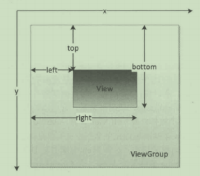

> 序：要系统性的掌握View相关的知识，这些基本概念必须牢牢掌握。

### 一、View的位置

View的位置主要由其四个顶点决定，对应四个属性：

mLeft、mTop、mRight、mBottom。（**单位是像素**）即：

左上角横坐标，左上角纵坐标，右下角横坐标、右下角纵坐标。获取方式：

getLeft()、getTop()、getRight()、getBottom()。

> 注意：这几个位置是相对于其父容器的。

在Android坐标系中，View的坐标和父容器的关系如下：

和View大小（宽高、width/height）的关系：

> width = right - left
>
> height = bottom - top

Android 3.0开始，新增属性：x、y、translationX、translationY。也都有其get/set方法。

x、y是View的左上角坐标；

translationX、translationY是View左上角相对于父容器的偏移量。translationX和translationY的默认值为0；

这几个参数的关系为：

> x = left + translationX
>
> y = top + translationY

> 注意：
>
> 1、这几个参数也是相对于其父容器的。
>
> 2、View在平移的过程中，top和left表示的是原始左上角的位置信息，其值不会发生改变。此时发生改变的是x、y、translationX、translationY四个参数。

### 二、View的大小

View的大小用width和height表示。

getWidth()和getHeight()获取的是View当前真正的宽高。

getMeasuredWidth()和getMeasuredHeight()是View希望父View测量的宽高。

getWidth()和getMeasuredWidth()的值不一定相等。

> 这部分还要去看看View的注释，可以去官网看。

### 三、MotionEvent

