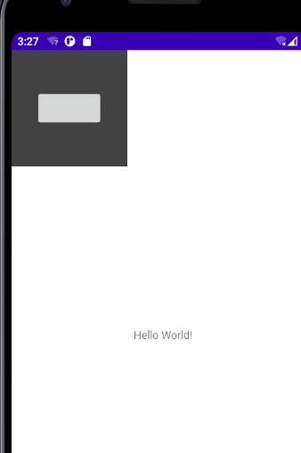
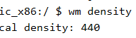
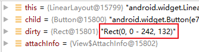

> version：2021/9/13
>
> review：


invalidate()方法的执行可以分为两步，标记dirty区域，触发绘制。

> 基于 Android 30

#### 一、dirty区域标记

```java
View.java
	public void invalidate() {
        invalidate(true);
    }

    public void invalidate(boolean invalidateCache) {
        // 四个参数分别是：左、上、宽、高
        // left、top、width、height
        invalidateInternal(0, 0, mRight - mLeft, mBottom - mTop, invalidateCache, true);
    }

    void invalidateInternal(int l, int t, int r, int b, boolean invalidateCache,
            boolean fullInvalidate) {
        // 这次主要分析 dirty 区域的计算过程，其他代码去除了
        。。。
        	// 1、添加标记：PFLAG_DIRTY
            mPrivateFlags |= PFLAG_DIRTY;
			
            if (invalidateCache) {
                // 2、添加标记：PFLAG_INVALIDATED
                mPrivateFlags |= PFLAG_INVALIDATED;
                // 3、去除标记：PFLAG_DRAWING_CACHE_VALID
                mPrivateFlags &= ~PFLAG_DRAWING_CACHE_VALID;
            }

            // Propagate the damage rectangle to the parent view.
            final AttachInfo ai = mAttachInfo;
            final ViewParent p = mParent;
            if (p != null && ai != null && l < r && t < b) {
                final Rect damage = ai.mTmpInvalRect;
                // 4、传入 相对于父布局的坐标 给ViewParent，
                // ViewParent的实现类有ViewGroup和ViewRootImpl（最终的parent）
                damage.set(l, t, r, b);
                p.invalidateChild(this, damage);
            }
。。。
        }
    }
```

先来看ViewGroup的实现：

```java
ViewGroup.java
    public final void invalidateChild(View child, final Rect dirty) {
        final AttachInfo attachInfo = mAttachInfo;
        if (attachInfo != null && attachInfo.mHardwareAccelerated) {
            // HW accelerated fast path
            onDescendantInvalidated(child, child);
            return;
        }

        ViewParent parent = this;
        if (attachInfo != null) {
            // If the child is drawing an animation, we want to copy this flag onto
            // ourselves and the parent to make sure the invalidate request goes
            // through
            final boolean drawAnimation = (child.mPrivateFlags & PFLAG_DRAW_ANIMATION) != 0;

            // Check whether the child that requests the invalidate is fully opaque
            // Views being animated or transformed are not considered opaque because we may
            // be invalidating their old position and need the parent to paint behind them.
            Matrix childMatrix = child.getMatrix();
            // Mark the child as dirty, using the appropriate flag
            // Make sure we do not set both flags at the same time

            if (child.mLayerType != LAYER_TYPE_NONE) {
                mPrivateFlags |= PFLAG_INVALIDATED;
                mPrivateFlags &= ~PFLAG_DRAWING_CACHE_VALID;
            }

            final int[] location = attachInfo.mInvalidateChildLocation;
            location[CHILD_LEFT_INDEX] = child.mLeft;
            location[CHILD_TOP_INDEX] = child.mTop;
            if (!childMatrix.isIdentity() ||
                    (mGroupFlags & ViewGroup.FLAG_SUPPORT_STATIC_TRANSFORMATIONS) != 0) {
                RectF boundingRect = attachInfo.mTmpTransformRect;
                boundingRect.set(dirty);
                Matrix transformMatrix;
                if ((mGroupFlags & ViewGroup.FLAG_SUPPORT_STATIC_TRANSFORMATIONS) != 0) {
                    Transformation t = attachInfo.mTmpTransformation;
                    boolean transformed = getChildStaticTransformation(child, t);
                    if (transformed) {
                        transformMatrix = attachInfo.mTmpMatrix;
                        transformMatrix.set(t.getMatrix());
                        if (!childMatrix.isIdentity()) {
                            transformMatrix.preConcat(childMatrix);
                        }
                    } else {
                        transformMatrix = childMatrix;
                    }
                } else {
                    transformMatrix = childMatrix;
                }
                transformMatrix.mapRect(boundingRect);
                dirty.set((int) Math.floor(boundingRect.left),
                        (int) Math.floor(boundingRect.top),
                        (int) Math.ceil(boundingRect.right),
                        (int) Math.ceil(boundingRect.bottom));
            }

            do {
                View view = null;
                if (parent instanceof View) {
                    view = (View) parent;
                }

                if (drawAnimation) {
                    if (view != null) {
                        view.mPrivateFlags |= PFLAG_DRAW_ANIMATION;
                    } else if (parent instanceof ViewRootImpl) {
                        ((ViewRootImpl) parent).mIsAnimating = true;
                    }
                }

                // If the parent is dirty opaque or not dirty, mark it dirty with the opaque
                // flag coming from the child that initiated the invalidate
                if (view != null) {
                    if ((view.mPrivateFlags & PFLAG_DIRTY_MASK) != PFLAG_DIRTY) {
                        view.mPrivateFlags = (view.mPrivateFlags & ~PFLAG_DIRTY_MASK) | PFLAG_DIRTY;
                    }
                }

                parent = parent.invalidateChildInParent(location, dirty);
                if (view != null) {
                    // Account for transform on current parent
                    Matrix m = view.getMatrix();
                    if (!m.isIdentity()) {
                        RectF boundingRect = attachInfo.mTmpTransformRect;
                        boundingRect.set(dirty);
                        m.mapRect(boundingRect);
                        dirty.set((int) Math.floor(boundingRect.left),
                                (int) Math.floor(boundingRect.top),
                                (int) Math.ceil(boundingRect.right),
                                (int) Math.ceil(boundingRect.bottom));
                    }
                }
            } while (parent != null);
        }
    }    
```

示例：

在这样一个布局中，Button是居中的。



已知：

dirty = 0，0 - 242,132，父布局宽高为 150dp，150dp，设备密度为：



wm 取到的 density 实际上是 dpi，转换后得到Android中的density（一般命名为scale）

density = dpi / 160 = 2.75

因此父布局的宽高（单位像素）为：

width = density * 150dp + 0.5f = 2.75 * 150 = 413px

height = density * 150dp + 0.5f = 2.75 * 150 = 413px



所以现在的Button相对于父布局的坐标是：

left =（413 - 242）/ 2 = 85.5

top = (413 - 132) / 2 = 140.5

那下一次dirty计算出来的结果推测是：

dirty = 85.5，140.5 - 242,132


#### 二、绘制


<font color='orange'>Q、？</font>


<font color='orange'>Q、？</font>


