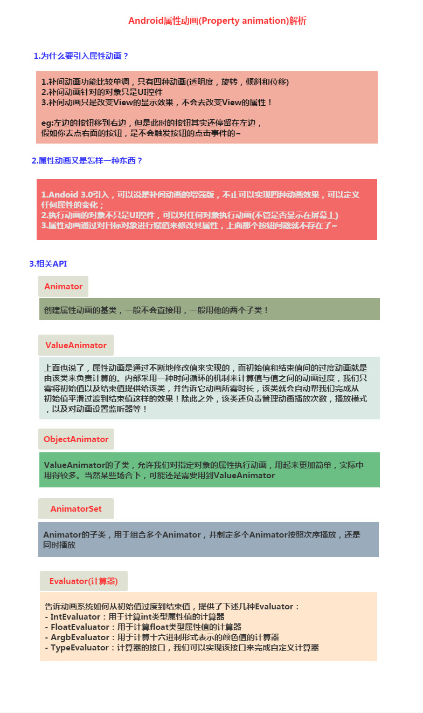

> version：2020/09/18


本文的目标是：
1、了解属性动画的基本概念，知道和一般动画Animation（帧动画和补间动画）的区别。
2、掌握ValueAnimator和ObjectAnimator的基本使用。

### 一、属性动画概念



### 二、ValueAnimator的简单使用

使用流程：
1、调用ValueAnimator的ofInt()，ofFloat()，ofObject()等静态方法创建ValueAnimator实例。
2、调用ValueAnimator实例的setXxx方法设置动画持续时间、插值方式、重复次数等。
3、调用实例的addUpdateListener添加AnimatorUpdateListener监听器，在该监听器中可以获得ValueAnimator计算出来的值，该值可以应用到指定对象上
4、调用实例的start()方法开启动画

代码示例：
xml布局：
```xml
<?xml version="1.0" encoding="utf-8"?>
<LinearLayout xmlns:android="http://schemas.android.com/apk/res/android"
    android:id="@+id/ly_root"
    android:layout_width="match_parent"
    android:layout_height="match_parent"
    android:orientation="vertical">

    <Button
        android:id="@+id/btn_one"
        android:layout_width="wrap_content"
        android:layout_height="wrap_content"
        android:text="动画1" />

    <Button
        android:id="@+id/btn_two"
        android:layout_width="wrap_content"
        android:layout_height="wrap_content"
        android:text="动画2" />

    <Button
        android:id="@+id/btn_three"
        android:layout_width="wrap_content"
        android:layout_height="wrap_content"
        android:text="动画3" />

    <Button
        android:id="@+id/btn_four"
        android:layout_width="wrap_content"
        android:layout_height="wrap_content"
        android:text="动画4" />

    <ImageView
        android:id="@+id/img_babi"
        android:layout_width="wrap_content"
        android:layout_height="wrap_content"
        android:layout_gravity="center"
        android:background="@drawable/p1" />

</LinearLayout>
```
代码：
```java
public class PropertyAnimationActivity extends AppCompatActivity implements View.OnClickListener {

    private Button btn_one;
    private Button btn_two;
    private Button btn_three;
    private Button btn_four;
    private LinearLayout ly_root;
    private ImageView img_babi;

    private int rootWidth;
    private int rootHeight;

    @Override
    protected void onCreate(Bundle savedInstanceState) {
        super.onCreate(savedInstanceState);
        setContentView(R.layout.activity_property_animation);
        bindViews();
    }

    private void bindViews() {
        ly_root = (LinearLayout) findViewById(R.id.ly_root);
        btn_one = (Button) findViewById(R.id.btn_one);
        btn_two = (Button) findViewById(R.id.btn_two);
        btn_three = (Button) findViewById(R.id.btn_three);
        btn_four = (Button) findViewById(R.id.btn_four);
        img_babi = (ImageView) findViewById(R.id.img_babi);

        btn_one.setOnClickListener(this);
        btn_two.setOnClickListener(this);
        btn_three.setOnClickListener(this);
        btn_four.setOnClickListener(this);
        img_babi.setOnClickListener(this);
    }

    @Override
    public void onClick(View view) {
        switch (view.getId()) {
            case R.id.btn_one:
                lineAnimator();
                break;
            case R.id.btn_two:
                scaleAnimator();
                break;
            case R.id.btn_three:
                rotateAnimator();
                break;
            case R.id.btn_four:
                circleAnimator();
                break;
            case R.id.img_babi:
                Toast.makeText(PropertyAnimationActivity.this, "不愧是coder-pig~", Toast.LENGTH_SHORT).show();
                break;
            default:
        }
    }

    /**
     * 位移动画
     */
    private void lineAnimator() {
        rootWidth = ly_root.getWidth();
        rootHeight = ly_root.getHeight();
        ValueAnimator valueAnimator = ValueAnimator.ofInt(rootHeight, 0, rootHeight / 4, rootHeight / 2, rootHeight / 4, rootHeight);
        valueAnimator.addUpdateListener(animation -> {
            int y = (int) animation.getAnimatedValue();
            int x = rootWidth / 2;
            moveView(img_babi, x, y);
        });
        valueAnimator.setDuration(10000L);
        valueAnimator.setInterpolator(new LinearInterpolator());
        valueAnimator.start();
    }

    /**
     * 缩放动画
     */
    private void scaleAnimator() {
        ValueAnimator scaleAnimator = ValueAnimator.ofFloat(1f,0f,1.5f);
        scaleAnimator.addUpdateListener(animation -> {
            float scale = (float) animation.getAnimatedValue();
            img_babi.setScaleX(scale);
            img_babi.setScaleY(scale);
        });
        scaleAnimator.setDuration(3000L);
        scaleAnimator.setInterpolator(new LinearInterpolator());
        scaleAnimator.start();
    }

    /**
     * 旋转动画、透明度动画
     */
    private void rotateAnimator() {
        ValueAnimator rotateAnimator = ValueAnimator.ofInt(0, 360);
        rotateAnimator.addUpdateListener(animation -> {
            int rotateValue = (int) animation.getAnimatedValue();
            img_babi.setRotation(rotateValue);

            float fractionValue = animation.getAnimatedFraction();
            img_babi.setAlpha(fractionValue);
        });
        rotateAnimator.setDuration(3000L);
        rotateAnimator.setInterpolator(new LinearInterpolator());
        rotateAnimator.start();
    }

    /**
     * 圆形旋转
     * 圆的参数方程:
     * x = R * sin(t)
     * y = R * cos(t)
     */
    private void circleAnimator() {
        rootWidth = ly_root.getWidth();
        rootHeight = ly_root.getHeight();
        final int R = rootWidth / 4;
        ValueAnimator circleAnimator = ValueAnimator.ofFloat(0f, (float) (2.0f * Math.PI));
        circleAnimator.addUpdateListener(animation -> {
            // 圆的参数方程 x = R * sin(t) y = R * cos(t)
            float t = (float) animation.getAnimatedValue();
            int x = (int) (R * Math.sin(t) + rootWidth / 2);
            int y = (int) (R * Math.cos(t) + rootHeight / 2);
            moveView(img_babi, x, y);
        });
        circleAnimator.setDuration(3000L);
        circleAnimator.setInterpolator(new LinearInterpolator());
        circleAnimator.start();
    }

    private void moveView(View view, int x, int y) {
        int left = x - view.getWidth() / 2;
        int top = y - view.getHeight();
        int right = left + view.getWidth();
        int bottom = top + view.getHeight();
        view.layout(left, top, right, bottom);

        Log.e("moveView", "left:" + left + "  top:" + top + "  right:" + right + "  bottom:" + bottom);
    }

}
```

### 三、ObjectAnimator的简单使用

比起ValueAnimator，ObjectAnimator更为易用，通过该类我们可以直接对任意对象的任意属性进行动画操作，没错，是任意对象，而不单单只是View对象， 不断地对对象中的某个属性值进行赋值，然后根据对象属性值的改变再来决定如何展现出来。
比如为TextView设置如下动画： ObjectAnimator.ofFloat(textview, "alpha", 1f, 0f);
这里就是不断改变alpha的值，从1f - 0f，然后对象根据属性值的变化来刷新界面显示，从而展现出淡入淡出的效果，而在TextView类中并没有alpha这个属性，ObjectAnimator内部机制是： 寻找传入的属性名对应的get和set方法，而非找这个属性值。下面我们利用ObjectAnimator来实现四种补间动画：

布局：
```xml
<?xml version="1.0" encoding="utf-8"?>
<LinearLayout xmlns:android="http://schemas.android.com/apk/res/android"
    android:id="@+id/ly_root"
    android:layout_width="match_parent"
    android:layout_height="match_parent"
    android:orientation="vertical">

    <Button
        android:id="@+id/btn_one"
        android:layout_width="wrap_content"
        android:layout_height="wrap_content"
        android:text="动画1" />

    <Button
        android:id="@+id/btn_two"
        android:layout_width="wrap_content"
        android:layout_height="wrap_content"
        android:text="动画2" />

    <Button
        android:id="@+id/btn_three"
        android:layout_width="wrap_content"
        android:layout_height="wrap_content"
        android:text="动画3" />

    <Button
        android:id="@+id/btn_four"
        android:layout_width="wrap_content"
        android:layout_height="wrap_content"
        android:text="动画4" />

    <Button
        android:id="@+id/btn_five"
        android:layout_width="wrap_content"
        android:layout_height="wrap_content"
        android:text="动画5" />

    <TextView
        android:id="@+id/tv_pig"
        android:layout_width="wrap_content"
        android:layout_height="wrap_content"
        android:layout_gravity="center"
        android:text="Have a nice day~"
        />

</LinearLayout>
```

代码实现：
```java
public class PropertyAnimationActivity2 extends AppCompatActivity implements View.OnClickListener {

    private Button btn_one;
    private Button btn_two;
    private Button btn_three;
    private Button btn_four;
    private Button btn_five;
    private LinearLayout ly_root;
    private TextView tv_pig;
    private int height;
    private ObjectAnimator animator1;
    private ObjectAnimator animator2;
    private ObjectAnimator animator3;
    private ObjectAnimator animator4;
    private AnimatorSet animSet;

    @Override
    protected void onCreate(Bundle savedInstanceState) {
        super.onCreate(savedInstanceState);
        setContentView(R.layout.activity_property_animation2);
        bindViews();
        initAnimator();
    }

    private void bindViews() {
        ly_root = (LinearLayout) findViewById(R.id.ly_root);
        btn_one = (Button) findViewById(R.id.btn_one);
        btn_two = (Button) findViewById(R.id.btn_two);
        btn_three = (Button) findViewById(R.id.btn_three);
        btn_four = (Button) findViewById(R.id.btn_four);
        btn_five = (Button) findViewById(R.id.btn_five);
        tv_pig = (TextView) findViewById(R.id.tv_pig);

        height = ly_root.getHeight();
        btn_one.setOnClickListener(this);
        btn_two.setOnClickListener(this);
        btn_three.setOnClickListener(this);
        btn_four.setOnClickListener(this);
        btn_five.setOnClickListener(this);
        tv_pig.setOnClickListener(this);
    }

    //初始化动画
    private void initAnimator() {
        animator1 = ObjectAnimator.ofFloat(tv_pig, "alpha", 1f, 0f, 1f, 0f, 1f);
        animator2 = ObjectAnimator.ofFloat(tv_pig, "rotation", 0f, 360f, 0f);
        animator3 = ObjectAnimator.ofFloat(tv_pig, "scaleX", 2f, 4f, 1f, 0.5f, 1f);
        animator4 = ObjectAnimator.ofFloat(tv_pig, "translationY", height / 8, -100, height / 2);
    }

    @Override
    public void onClick(View v) {
        switch (v.getId()) {
            case R.id.btn_one:
                animator1.setDuration(3000L);
                animator1.start();
                break;
            case R.id.btn_two:
                animator2.setDuration(3000L);
                animator2.start();
                break;
            case R.id.btn_three:
                animator3.setDuration(3000L);
                animator3.start();
                break;
            case R.id.btn_four:
                animator4.setDuration(3000L);
                animator4.start();
                break;
            case R.id.btn_five:
                //将前面的动画集合到一起~
                animSet = new AnimatorSet();
                animSet.play(animator4).with(animator3).with(animator2).after(animator1);
                animSet.setDuration(5000L);
                animSet.start();
                break;
            case R.id.tv_pig:
                Toast.makeText(PropertyAnimationActivity2.this, "ObjectAnimator简单使用", Toast.LENGTH_SHORT).show();
                break;
            default:
        }
    }
}
```

### 四、组合动画（AnimatorSet）

在上面的例子中，已经使用过组合动画了，这里记录下它的几个常用方法：

* after(Animator anim) 
将现有动画插入到传入的动画之后执行
* after(long delay) 
将现有动画延迟指定毫秒后执行
* before(Animator anim) 
将现有动画插入到传入的动画之前执行
* with(Animator anim) 
将现有动画和传入的动画同时执行

### 五、AnimatorListener

在介绍ValueAnimator的时候我们添加了一个监听器：AnimatorUpdateListener，当值状态发生改变时候会回调onAnimationUpdate方法。
除了这个事件外，还有动画状态的监听器：AnimatorListener，我们可以调用addListener方法添加监听器，如下实例：

```java
/**
     * 缩放动画
     */
    private void scaleAnimator() {
        ValueAnimator scaleAnimator = ValueAnimator.ofFloat(1f,0f,1.5f);
        scaleAnimator.addUpdateListener(animation -> {
            float scale = (float) animation.getAnimatedValue();
            img_babi.setScaleX(scale);
            img_babi.setScaleY(scale);
        });
        scaleAnimator.setDuration(3000L);
        scaleAnimator.setInterpolator(new LinearInterpolator());

        scaleAnimator.addListener(new Animator.AnimatorListener() {
            @Override
            public void onAnimationStart(Animator animation) {

            }

            @Override
            public void onAnimationEnd(Animator animation) {

            }

            @Override
            public void onAnimationCancel(Animator animation) {

            }

            @Override
            public void onAnimationRepeat(Animator animation) {

            }
        });
        scaleAnimator.start();
    }
```

### 六、使用xml来编写动画

使用XML来编写动画，画的时间可能比Java代码长一点，但是重用起来就方便多了。 对应的XML标签分别为：<animator><objectAnimator><set> 相关的属性解释如下：

* android:ordering：指定动画的播放顺序：sequentially(顺序执行)，together(同时执行)
* android:duration：动画的持续时间
* android:propertyName="x"：这里的x，还记得上面的"alpha"吗？加载动画的那个对象里需要定义getx和setx的方法，objectAnimator就是通过这里来修改对象里的值的。
* android:valueFrom="1" ：动画起始的初始值
* android:valueTo="0" ：动画结束的最终值
* android:valueType="floatType"：变化值的数据类型

示例：
①从0到100平滑过渡的动画：
```xml
<animator xmlns:android="http://schemas.android.com/apk/res/android"  
    android:valueFrom="0"  
    android:valueTo="100"  
    android:valueType="intType"/>
```

②将一个视图的alpha属性从1变成0：
```xml
<objectAnimator xmlns:android="http://schemas.android.com/apk/res/android"  
    android:valueFrom="1"  
    android:valueTo="0"  
    android:valueType="floatType"  
    android:propertyName="alpha"/>
```

③set动画使用演示：
```xml
<set android:ordering="sequentially" >
    <set>
        <objectAnimator
            android:duration="500"
            android:propertyName="x"
            android:valueTo="400"
            android:valueType="intType" />
        <objectAnimator
            android:duration="500"
            android:propertyName="y"
            android:valueTo="300"
            android:valueType="intType" />
    </set>
    <objectAnimator
        android:duration="500"
        android:propertyName="alpha"
        android:valueTo="1f" />
</set>
```

加载我们的动画文件：
```java
AnimatorSet set = (AnimatorSet)AnimatorInflater.loadAnimator(mContext, 
             R.animator.property_animator);  
animator.setTarget(view);  
animator.start();  
```
