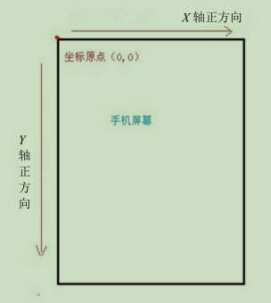
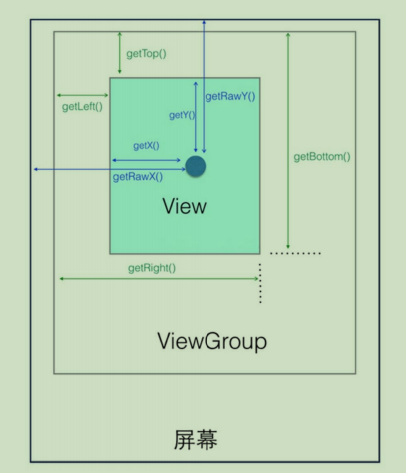

> version：2022/04/
>
> review：


目录

[TOC]


# 1、坐标系

Android 系统中有两种坐标系，分别为 Android 坐标系和 View 坐标系。了解这两种坐标系能够帮助我们实现 View 的各种操作，比如我们要实现 View 的滑动，你连这个 View 的位置都不知道，那如何去操作呢？首先我们来看看 Android 坐标系。

## 1.1 Android 坐标系

在Android中，将屏幕左上角的顶点作为Android坐标系的原点，这个原点向右是X轴正方向，向下是Y 轴正方向。在触控事件中，使用 getRawX（）和getRawY（）方法获得的坐标就是 Android坐标系的坐标。 Android 坐标系，是相对于屏幕的坐标。



## 1.2 View 坐标系

View坐标系，是相对于当前View的坐标。



top、left、right、bottom是从View的视角出发，是相对于父View的。

x、y 是从触摸的坐标点的视角出发，是相对于当前的View的。

rawX、rawY 是从触摸的坐标点的视角出发，是相对于整个屏幕的。

### 1、View 获取自身的宽和高

根据 View 的坐标系，我们可以算出 View 的宽和高：

```java
width=getRight()-getLeft()；

height=getBottom()-getTop()；
```

不过系统已经为我们提供了获取 View 宽和高的方法。getHeight() 用来获取 View 自身的高度，getWidth() 用来获取 View 自身的宽度。从 View 的源码来看，getHeight()和 getWidth()获取 View 自身的高度和宽度的算法与上面从图中得出的结论是一致的。View 源码中的 getHeight()方法和 getWidth()方法如下所示：

```
public final int getHeight() {
	return mBottom - mTop；
}
public final int getWidth() {
	return mRight - mLeft；
}
```

### 2、View 自身的坐标

通过如下方法可以获得 View 到其父控件（ViewGroup）的距离。 

• getTop()：获取 View 自身顶边到其父布局顶边的距离。

• getLeft()：获取 View 自身左边到其父布局左边的距离。

• getRight()：获取 View 自身右边到其父布局左边的距离。

• getBottom()：获取 View 自身底边到其父布局顶边的距离。

### 3、MotionEvent 提供的方法

图中间的那个圆点，假设就是我们触摸的点。无论是 View 还是 ViewGroup，最终的点击事件都会由 onTouchEvent(MotionEvent event)方法来处理。MotionEvent 在用户交互中作用重大，其内部提供了很多事件常量，比如我们常用的 ACTION_DOWN、ACTION_UP 和ACTION_MOVE。此外，MotionEvent 也提供了获取焦点坐标的各种方法。 

• getX()：获取点击事件距离控件左边的距离，即视图坐标。

• getY()：获取点击事件距离控件顶边的距离，即视图坐标。

• getRawX()：获取点击事件距离整个屏幕左边的距离，即绝对坐标。

• getRawY()：获取点击事件距离整个屏幕顶边的距离，即绝对坐标。


# 相关问题

<font color='orange'>Q：</font>


<font color='orange'>Q：</font>


<font color='orange'>Q：</font>


# 总结

1、

## 【精益求精】我还能做（补充）些什么？

1、


# 脑图


# 参考

1、《Android进阶之光》