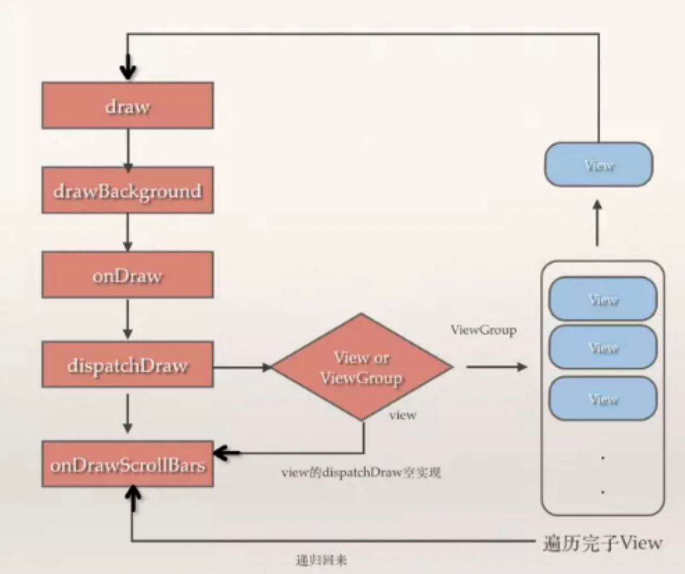

**1、讲下 View 的绘制流程？**

o View 的工作流程主要是指 measure、layout、draw 这三大流程，即测量、布局和绘制，其中 measure 确定 View 的**测量宽/高**，layout 确定 View 的**最终宽/高**和**四个顶点的位置**，而 draw 则将 View **绘制到屏幕**上 

o View 的绘制过程遵循如下几步：

**绘制背景** background.draw(canvas)

**绘制自己**（onDraw） 

**绘制 children**（dispatchDraw） 

**绘制装饰**（onDrawScollBars）

从下往上。

**2、MotionEvent 是什么？包含几种事件？什么条件下会产生？**

o MotionEvent 是手指接触屏幕后所产生的一系列事件。典型的事件类型有如下：

 **ACTION_DOWN**：手指刚接触屏幕

 **ACTION_MOVE**：手指在屏幕上移动

 **ACTION_UP**：手指从屏幕上松开的一瞬间

 **ACTION_CANCELL**：手指保持按下操作，并从当前控件转移到外层控件时触发

o 正常情况下，一次手指触摸屏幕的行为会触发一系列点击事件，考虑如下几种情况：

 点击屏幕后松开，事件序列：DOWN→UP

 点击屏幕滑动一会再松开，事件序列为DOWN→MOVE→.....→MOVE→UP

**3、描述一下 View 事件传递分发机制？**

o View 事件分发本质就是对 MotionEvent 事件分发的过程。即当一个 MotionEvent 发生后，系统将这个点击事件传递到一个具体的 View 上

o 点击事件的传递顺序：**Activity（Window）→ViewGroup→ View**

o 事件分发过程由三个方法共同完成：

**dispatchTouchEvent**：用来进行事件的分发。如果事件能够传递给当前 View，那么此方法一定会被调用，返回结果受当前 View 的 onTouchEvent 和下级View 的 dispatchTouchEvent 方法的影响，表示是否消耗当前事件

**onInterceptTouchEvent**：在上述方法内部调用，对事件进行拦截。该方法只在 ViewGroup 中有，View（不包含 ViewGroup）是没有的。一旦拦截，则执行 ViewGroup 的 onTouchEvent，在 ViewGroup 中处理事件，而不接着分发给 View。且只调用一次，返回结果表示是否拦截当前事件

**onTouchEvent**： 在 dispatchTouchEvent 方法中调用，用来处理点击事件，返回结果表示是否消耗当前事件

**4、如何解决 View 的事件冲突 ？ 举个开发中遇到的例子 ？** 

o 常见开发中事件冲突的有 ScrollView 与 RecyclerView 的滑动冲突、RecyclerView 内嵌同时滑动同一方向

o 滑动冲突的处理规则：

对于由于外部滑动和内部滑动方向不一致导致的滑动冲突，可以根据滑动的方向判断谁来拦截事件。

对于由于外部滑动方向和内部滑动方向一致导致的滑动冲突，可以根据业务需求，规定何时让外部View 拦截事件，何时由内部 View 拦截事件。

对于上面两种情况的嵌套，相对复杂，可同样根据需求在业务上找到突破点。

o 滑动冲突的实现方法：

**外部拦截法**：指点击事件都先经过父容器的拦截处理，如果父容器需要此事件就拦截，否则就不拦

截。

具体方法：需要重写父容器的 onInterceptTouchEvent 方法，在内部做出相应的拦截。

**内部拦截法**：指父容器不拦截任何事件，而将所有的事件都传递给子容器，如果子容器需要此事件就直接消耗，否则就交由父容器进行处理。具体方法：需要配合 requestDisallowInterceptTouchEvent 方法。

**5、scrollTo()和 scollBy()的区别？**

o scollBy 内部调用了 scrollTo，它是基于当前位置的相对滑动；而 scrollTo 是绝对滑动，因此如果使用相同输入参数多次调用 scrollTo 方法，由于 View 的初始位置是不变的，所以只会出现一次 View 滚动的效果

o 两者都只能对 View 内容的滑动，而非使 View 本身滑动。可以使用 Scroller 有过度滑动的效果

**6、Scroller 是怎么实现 View 的弹性滑动？**

o 在 MotionEvent.ACTION_UP 事件触发时调用startScroll()方法，该方法并没有进行实际的滑动操作，而是记录滑动相关量（滑动距离、滑动时间）

o 接着调用 invalidate/postInvalidate()方法，请求 View 重绘，导致 View.draw 方法被执行

o 当 View 重绘后会在 draw 方法中调用 computeScroll 方法，而 computeScroll 又会去向 Scroller 获取当前的scrollX 和 scrollY；然后通过 scrollTo 方法实现滑动；接着又调用 postInvalidate 方法来进行第二次重绘，和之前流程一样，如此反复导致 View 不断进行小幅度的滑动，而多次的小幅度滑动就组成了弹性滑动，直到整个滑动过成结束

**7、 invalidate()和 postInvalidate()的区别 ？**

o invalidate()与 postInvalidate()都用于刷新 View，主要区别是 invalidate()在主线程中调用，若在子线程中使用需要配合 handler；而 postInvalidate()可在子线程中直接调用。

**8、SurfaceView 和 View 的区别？**

o View 需要在 UI 线程对画面进行刷新，而 SurfaceView 可在子线程进行页面的刷新

o View 适用于主动更新的情况，而 SurfaceView 适用于被动更新，如频繁刷新，这是因为如果使用 View 频繁刷新会阻塞主线程，导致界面卡顿

o SurfaceView 在底层已实现双缓冲机制，而 View 没有，因此 SurfaceView 更适用于需要频繁刷新、刷新时数据处理量很大的页面（如视频播放界面）

**9、自定义 View 如何考虑机型适配 ?** 

o 合理使用 warp_content，match_parent

o 尽可能的使用 RelativeLayout

o 针对不同的机型，使用不同的布局文件放在对应的目录下，android 会自动匹配。

o 尽量使用点 9 图片。

o 使用与密度无关的像素单位 dp，sp

o 引入 android 的百分比布局。

o 切图的时候切大分辨率的图，应用到布局当中。在小分辨率的手机上也会有很好的显示效果。