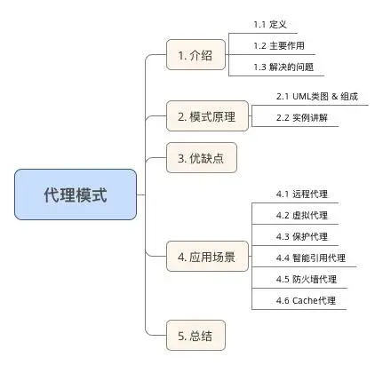
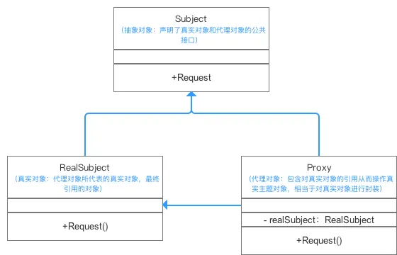
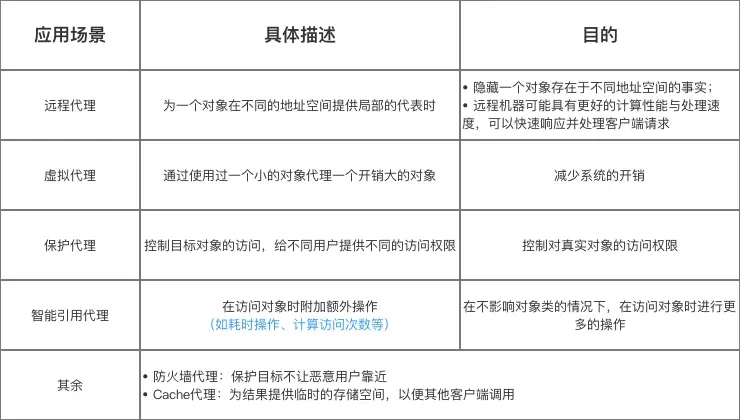

> version：2022/06 - 2024/1/31
>
> review：


目录

[TOC]


# 关键词


# 前置知识

动态代理：需要知道反射。




# 一、概述

给目标对象提供一个代理对象，并由代理对象控制对目标对象的引用

> 1. 代理对象：起到中介作用，连接客户端和目标对象
> 2. 例子：电脑桌面的快捷方式。电脑对某个程序提供一个快捷方式（代理对象），快捷方式连接客户端和程序，客户端通过操作快捷方式就可以操作那个程序

## 代理模式的作用

控制和管理对象的访问。通过引入**代理对象**的方式来间接访问**目标对象**

比如，客户端对象A，想要访问服务端对象B，但是因为某些原因，A 不能直接访问到 B，这时候就可以引入一个中间人——代理人，通过它来完成 A 对 B 的间接访问。

示例1：

现实中的例子，我们想要访问国外的Google，因为某些原因，我们不能直接访问到Google，这时候可以引入一个代理人——VPN，通过它去访问真正的国外网站，然后把结果告诉我们，也就达到了访问的目的。在这其中，代理人（VPN），还可以起到控制访问的作用，比如对发起访问的一方，进行一系列判断，比如你是不是会员等等，符合条件才真正去访问。

示例2：

一个 Android 中的例子，跨进程通信机制 —— Binder，我们要在 客户端进程（client A）去访问服务端（server B）进程，因为Linux中有进程隔离的机制，并不支持直接访问，这时候，就是通过底层的系统（内核空间）来间接的完成访问。并且，还可以对客户端进程进行校验，比如判断uid等，来保证访问是安全的。

#### 解决的问题

防止**直接**访问目标对象给系统带来的不必要复杂性。


## 代理类的职责

1、既然是代理，那被代理的类的功能（比如接口），代理类需要提供出来。

2、能进行访问控制。比如校验、日志上报、真正的调用实现（比如要建立socket连接或其他方式）等。


# 二、模式原理

## UML类图 & 组成



## 实例讲解

接下来我用一个实例来对代理模式进行更深一步的介绍。

 **a. 实例概况**

- 背景：小成希望买一台最新的顶配Mac电脑
- 冲突：国内还没上，只有美国才有
- 解决方案：寻找代购进行购买

> 代购（代理对象） 代替 我（真实对象） 去买Mac（间接访问的操作）

**b. 使用步骤**
 **步骤1：** 创建抽象对象接口（Subject）：声明你（真实对象）需要让代购（代理对象）帮忙做的事（买Mac）

```csharp
public interface Subject {  
              public void buyMac();
}
```

**步骤2：** 创建真实对象类（RealSubject）,即”我“

```csharp
  public class RealSubject implement Subject{
    @Override
    public void buyMac() {  
        System.out.println(”买一台Mac“);  
    }  
}
```

**步骤3：**创建代理对象类（Proxy），即”代购“，并通过代理类创建真实对象实例并访问其方法

```java
public class Proxy  implements Subject{
  
    @Override
    public void buyMac{
      
      //引用并创建真实对象实例，即”我“
      RealSubject realSubject = new RealSubject()；

      //调用真实对象的方法，进行代理购买Mac
      realSubject.buyMac（）；
      //代理对象额外做的操作
      this.WrapMac()；
    }

     public void WrapMac(){
      System.out.println(”用盒子包装好Mac“);  
    }
}
```

**步骤4：**客户端调用

```kotlin
public class ProxyPattern {

    public static void main(String[] args){

    Subject proxy = new Proxy（）；
    proxy.buyMac()；
    }
        
}
```

```undefined
买一台Mac
用盒子包装好Mac
```


## Android 源码示例


# 三、优缺点

在全面解析完代理模式后，我来分析下其优缺点：

### 优点

- 协调调用者和被调用者，降低了系统的耦合度
- 代理对象作为客户端和目标对象之间的中介，起到了保护目标对象的作用

### 缺点

- 由于在客户端和真实主题之间增加了代理对象，因此会造成请求的处理速度变慢；
- 实现代理模式需要额外的工作（有些代理模式的实现非常复杂），从而增加了系统实现的复杂度。


# 四、应用场景




# 相关问题

<font color='orange'>Q：</font>


# 总结


# 参考

1、[五分钟学设计模式.11.代理模式](https://www.bilibili.com/video/BV15V411z7nD?spm_id_from=333.999.0.0&vd_source=d053f150135c9a2d7b7534c6bbd407d9)

简单介绍了代理模式和装饰器模式的区别。

2、《Head First 设计模式》

3、https://www.jianshu.com/p/a8aa6851e09e