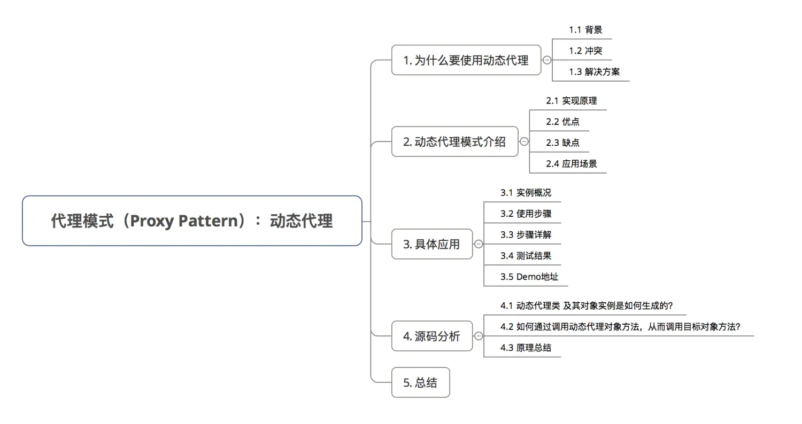
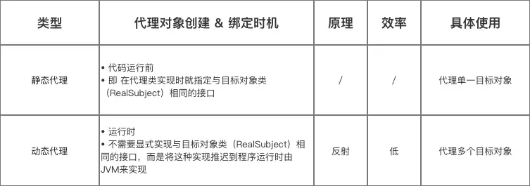
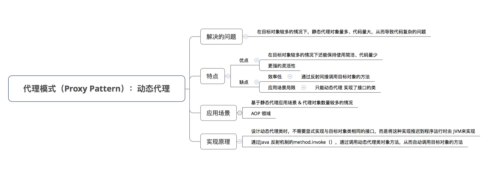
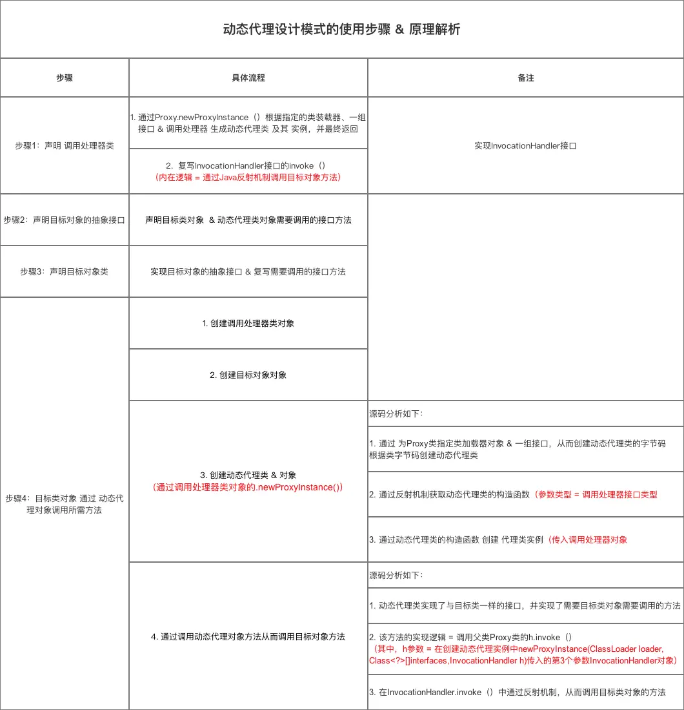

# 目录



# 1. 为什么要使用动态代理

### 1.1 背景

代理模式中的**静态代理模式**存在一些特点：

- 1个静态代理 只服务1种类型的目标对象
- 若要服务多类型的目标对象，则需要为每种目标对象都实现一个静态代理对象

> 关于静态代理模式可以看文章：静态代理模式.md

### 1.2 冲突

在目标对象较多的情况下，若采用静态代理，则会出现 **静态代理对象量多、代码量大，从而导致代码复杂的问题**

### 1.3 解决方案

采用 **动态代理模式**。

------

# 2. 动态代理模式介绍

### 2.1 实现原理

- 设计动态代理类（`DynamicProxy`）时，**不需要显式实现与目标对象类（`RealSubject`）相同的接口**，而是将这种实现推迟到程序运行时由 `JVM`来实现

> 1. 即：在使用时再创建动态代理类 & 实例
> 2. 静态代理则是在代理类实现时就指定与目标对象类（`RealSubject`）相同的接口

- 通过`Java` 反射机制的`method.invoke（）`，通过调用动态代理类对象方法，从而自动调用目标对象的方法

### 2.2 优点

- 只需要1个动态代理类就可以解决创建多个静态代理的问题，避免重复、多余代码
- 更强的灵活性

> 1. 设计动态代理类（`DynamicProxy`）时，**不需要显式实现与目标对象类（`RealSubject`）相同的接口**，而是将这种实现推迟到程序运行时由 `JVM`来实现
> 2. 在使用时（调用目标对象方法时）才会动态创建动态代理类 & 实例，不需要事先实例化

### 2.3 缺点

- 效率低
   相比静态代理中 **直接调用目标对象方法**，动态代理则需要先通过`Java`反射机制 从而 **间接调用目标对象方法**
- 应用场景局限
   因为 Java 的单继承特性（每个代理类都继承了 Proxy 类），即只能**针对接口** 创建 代理类，**不能针对类** 创建代理类

> 即只能动态代理 **实现了接口**的类

### 2.4 应用场景

- 基于静态代理应用场景下，需要代理对象数量较多的情况下使用动态代理
- `AOP` 领域

> 1. 定义：即 `Aspect Oriented Programming` = 面向切面编程，是`OOP`的延续、函数式编程的一种衍生范型
> 2. 作用：通过预编译方式和运行期动态代理实现程序功能的统一维护。
> 3. 优点：降低业务逻辑各部分之间的耦合度 、 提高程序的可重用性 & 提高了开发的效率
> 4. 具体应用场景：日志记录、性能统计、安全控制、异常处理等

### 2.5 与静态代理模式的区别




# 3. 具体应用

接下来，我将用1个具体实例来对 动态代理模式 进行更深一步的介绍

### 3.1 实例概况

- 背景：小成 希望买一台最新的顶配 `Mac` 电脑；小何希望买一台 `iPhone`
- 冲突：国内还没上，只有美国才有
- 解决方案：寻找一个代购一起进行购买

> 1. 即1个代购（动态代理对象）同时 代替 小成 & 小何（目标对象） 去买Mac（间接访问的操作）
> 2. 该代购是代购任何商品 = 什么人有什么需求就会去代购任何东西（动态代理）

### 3.2 使用步骤

1. 声明 调用处理器类
2. 声明目标对象类的抽象接口
3. 声明目标对象类
4. 通过动态代理对象，调用目标对象的方法

### 3.3 步骤详解

**步骤1：** 声明 调用处理器类

```tsx
<-- 作用 -->
// 1.  生成 动态代理对象
// 2.  指定 代理对象运行目标对象方法时需要完成的 具体任务
// 注：需实现InvocationHandler接口 = 调用处理器 接口
// 所以称为 调用处理器类

 public class DynamicProxy implements InvocationHandler {

    // 声明代理对象
    // 作用：绑定关系，即关联到哪个接口（与具体的实现类绑定）的哪些方法将被调用时，执行invoke（）
    private Object ProxyObject;

    public Object newProxyInstance(Object ProxyObject){
        this.ProxyObject =ProxyObject;
        return Proxy.newProxyInstance(ProxyObject.getClass().getClassLoader(),
                ProxyObject.getClass().getInterfaces(),this);
        // Proxy类 = 动态代理类的主类 
        // Proxy.newProxyInstance（）作用：根据指定的类装载器、一组接口 & 调用处理器 生成动态代理类实例，并最终返回
        // 参数说明：
        // 参数1：指定产生代理对象的类加载器，需要将其指定为和目标对象同一个类加载器
        // 参数2：指定目标对象的实现接口
        // 即要给目标对象提供一组什么接口。若提供了一组接口给它，那么该代理对象就默认实现了该接口，这样就能调用这组接口中的方法
        // 参数3：指定InvocationHandler对象。即动态代理对象在调用方法时，会关联到哪个InvocationHandler对象

    }

    //  复写InvocationHandler接口的invoke（）
    //  动态代理对象调用目标对象的任何方法前，都会调用调用处理器类的invoke（）
    @Override
    public Object invoke(Object proxy, Method method, Object[] args)
            // 参数说明：
            // 参数1：动态代理对象（即哪个动态代理对象调用了method（）
            // 参数2：目标对象被调用的方法
            // 参数3：指定被调用方法的参数
            throws Throwable {
                System.out.println("代购出门了");
                Object result = null;
                // 通过Java反射机制调用目标对象方法
                result = method.invoke(ProxyObject, args);
        return result;
    }

}
```

**步骤2：** 声明目标对象的抽象接口

```csharp
public interface Subject {
    // 定义目标对象的接口方法
    // 代购物品
    public  void buybuybuy();

}
```

**步骤3：** 声明目标对象类

```java
// 小成，真正的想买Mac的对象 = 目标对象 = 被代理的对象
// 实现抽象目标对象的接口
public class Buyer1 implements Subject  {

    @Override
    public void buybuybuy() {
        System.out.println("小成要买Mac");
    }

}
```

```java
// 小何，真正的想买iPhone的对象 = 目标对象 = 被代理的对象
// 实现抽象目标对象的接口
public class Buyer2 implements Subject  {

    @Override
    public void buybuybuy() {
        System.out.println("小何要买iPhone");
    }

}
```

**步骤4：** 通过动态代理对象，调用目标对象的方法

```java
public class MainActivity extends AppCompatActivity {

    @Override
    protected void onCreate(Bundle savedInstanceState) {
        super.onCreate(savedInstanceState);
        setContentView(R.layout.activity_main);

        // 1. 创建调用处理器类对象
        DynamicProxy DynamicProxy = new DynamicProxy();

        // 2. 创建目标对象对象
        Buyer1 mBuyer1 = new Buyer1();

        // 3. 创建动态代理类 & 对象：通过调用处理器类对象newProxyInstance（）
        // 传入上述目标对象对象
        Subject Buyer1_DynamicProxy = (Subject) DynamicProxy.newProxyInstance(mBuyer1);

        // 4. 通过调用动态代理对象方法从而调用目标对象方法
        // 实际上是调用了invoke（），再通过invoke（）里的反射机制调用目标对象的方法
        Buyer1_DynamicProxy.buybuybuy();
        // 以上代购为小成代购Mac

        // 以下是代购为小何代购iPhone
        Buyer2 mBuyer2 = new Buyer2();
        Subject Buyer2_DynamicProxy = (Subject) DynamicProxy.newProxyInstance(mBuyer2);
        Buyer2_DynamicProxy.buybuybuy();
    }
}
```

### 3.4 测试结果


# Android源码示例


# 4. 源码分析

- 在经过上面的实例后，你是否会对以下问题好奇：
  1. 动态代理类 及其对象实例是如何生成的？
  2. 如何通过调用动态代理对象方法，从而调用目标对象方法？
- 下面，我们顺着 **步骤4：目标对象 通过 动态代理对象调用方法**的使用 来进行动态代理模式的源码分析

```java
// 步骤4：通过动态代理对象，调用目标对象的方法
public class MainActivity extends AppCompatActivity {

    @Override
    protected void onCreate(Bundle savedInstanceState) {
        super.onCreate(savedInstanceState);
        setContentView(R.layout.activity_main);

        // 1. 创建 调用处理器类 对象
        DynamicProxy DynamicProxy = new DynamicProxy();

        // 2. 创建 目标类 对象
        Buyer1 mBuyer1 = new Buyer1();

        // 3. 创建动态代理类 & 对象：通过调用处理器类对象newProxyInstance（）
        // 传入上述目标类对象
        Subject Buyer1_DynamicProxy = (Subject) DynamicProxy.newProxyInstance(mBuyer1);
        // ->>关注1

        // 4. 通过调用动态代理对象方法从而调用目标对象方法
        // ->>关注2
        Buyer1_DynamicProxy.buybuybuy();
        // 以上代购为小成代购Mac

        // 以下是代购为小何代购iPhone
        Buyer2 mBuyer2 = new Buyer2();
        Subject Buyer2_DynamicProxy = (Subject) DynamicProxy.newProxyInstance(mBuyer2);
        Buyer2_DynamicProxy.buybuybuy();
    }
}
```

此处有两个重要的源码分析点：

- 关注1：创建动态代理类 & 对象：通过调用处理器类对象`newProxyInstance（）`

> 解决的问题是：**动态代理类 及其对象实例是如何生成的？**

- 关注2：通过调用动态代理对象方法从而调用目标对象方法

> 解决的问题是：**如何通过调用动态代理对象方法，从而调用目标对象方法？**

下面，我们将主要分析这两处源码。

### 4.1 （关注1）创建动态代理类 & 对象：通过调用处理器类对象newProxyInstance（）

```cpp
// 使用代码
Subject Buyer1_DynamicProxy = (Subject) DynamicProxy.newProxyInstance(mBuyer1);
```

- 即，动态代理类 及其对象实例是如何生成的？
- 下面，我们直接进入`DynamicProxy.newProxyInstance()`

```tsx
<-- 关注1：调用处理器 类的newProxyInstance（） -->
// 即步骤1中实现的类：DynamicProxy

// 作用：
// 1.  生成 动态代理对象
// 2.  指定 代理对象运行目标对象方法时需要完成的 具体任务
// 注：需实现InvocationHandler接口 = 调用处理器 接口

 public class DynamicProxy implements InvocationHandler {

    // 声明代理对象
    private Object ProxyObject;

    public Object newProxyInstance(Object ProxyObject){
        this.ProxyObject =ProxyObject;
        return Proxy.newProxyInstance(ProxyObject.getClass().getClassLoader(),
                ProxyObject.getClass().getInterfaces(),this);
        // Proxy.newProxyInstance（）作用：根据指定的类装载器、一组接口 & 调用处理器 生成动态代理类实例，并最终返回
        // ->>关注2

    }
    
     // 以下暂时忽略，下文会详细介绍
    //  复写InvocationHandler接口的invoke（）
    //  动态代理对象调用目标对象的任何方法前，都会调用调用处理器类的invoke（）
    @Override
    public Object invoke(Object proxy, Method method, Object[] args)
            // 参数说明：
            // 参数1：动态代理对象（即哪个动态代理对象调用了method（）
            // 参数2：目标对象被调用的方法
            // 参数3：指定被调用方法的参数
            throws Throwable {
                System.out.println("代购出门了");
                Object result = null;
                // 通过Java反射机制调用目标对象方法
                result = method.invoke(ProxyObject, args);
        return result;
    }

// 至此，关注1分析完毕，跳出
}

<-- 关注2：newProxyInstance（）源码解析-->
// 作用：根据指定的类装载器、一组接口 & 调用处理器 生成动态代理类及其对象实例，并最终返回
      
public static Object newProxyInstance(ClassLoader loader, Class<?>[]interfaces,InvocationHandler h) throws IllegalArgumentException { 
  // 参数说明：
        // 参数1：指定产生代理对象的类加载器，需要将其指定为和目标对象同一个类加载器
        // 参数2：指定目标对象的实现接口
        // 即要给目标对象提供一组什么接口。若提供了一组接口给它，那么该代理对象就默认实现了该接口，这样就能调用这组接口中的方法
        // 参数3：指定InvocationHandler对象。即动态代理对象在调用方法时，会关联到哪个InvocationHandler对象

    ...  
    // 仅贴出核心代码

    // 1. 通过 为Proxy类指定类加载器对象 & 一组interface，从而创建动态代理类
    // >>关注3
    Class cl = getProxyClass(loader, interfaces); 

    // 2. 通过反射机制获取动态代理类的构造函数，其参数类型是调用处理器接口类型
    Constructor cons = cl.getConstructor(constructorParams); 

    // 3. 通过动态代理类的构造函数 创建 代理类实例（传入调用处理器对象
    return (Object) cons.newInstance(new Object[] { h }); 

// 特别注意 
// 1. 动态代理类继承 Proxy 类 & 并实现了在Proxy.newProxyInstance()中提供的一系列接口（接口数组）
// 2. Proxy 类中有一个映射表
  // 映射关系为：(<ClassLoader>,(<Interfaces>,<ProxyClass>) )
  // 即：1级key = 类加载器，根据1级key 得到 2级key = 接口数组
  // 因此：1类加载器对象 + 1接口数组 = 确定了一个代理类实例
...

// 回到调用关注2的原处
}


<-- 关注3：getProxyClass（）源码分析 -->
// 作用：创建动态代理类

public static Class<?> getProxyClass(ClassLoader loader,Class<?>... interfaces)  
throws IllegalArgumentException { 
    
  ...
  // 仅贴出关键代码
  
<-- 1. 将目标类所实现的接口加载到内存中 -->
    // 遍历目标类所实现的接口  
    for (int i = 0; i < interfaces.length; i++) {  
          
        // 获取目标类实现的接口名称 
        String interfaceName = interfaces[i].getName();  
        Class interfaceClass = null;  
        try {  
        // 加载目标类实现的接口到内存中  
        interfaceClass = Class.forName(interfaceName, false, loader);  
        } catch (ClassNotFoundException e) {  
        }  
        if (interfaceClass != interfaces[i]) {  
        throw new IllegalArgumentException(  
            interfaces[i] + " is not visible from class loader");  
        }  
    }  
       
<-- 2. 生成动态代理类 -->       
        // 根据传入的接口 & 代理对象 创建动态代理类的字节码
        byte[] proxyClassFile = ProxyGenerator.generateProxyClass(  
            proxyName, interfaces);  

            // 根据动态代理类的字节码 生成 动态代理类
            proxyClass = defineClass0(loader, proxyName,  
            proxyClassFile, 0, proxyClassFile.length);  
       
        }  
    // 最终返回动态代理类
    return proxyClass;  
    }  

// 回到调用关注3的原处
```

### 总结

- 通过调用处理器类对象的`.newProxyInstance()`创建动态代理类 及其实例对象（需传入目标类对象）
- 具体过程如下：
  1. 通过 为`Proy`类指定类加载器对象 & 一组接口，从而创建动态代理类的字节码；再根据类字节码创建动态代理类
  2. 通过反射机制获取动态代理类的构造函数（参数类型 = 调用处理器接口类型
  3. 通过动态代理类的构造函数 创建 代理类实例（传入调用处理器对象

### 4.2 (关注2）通过调用动态代理对象方法从而调用目标对象方法

即，如何通过调用动态代理对象方法，从而调用目标对象方法？

```cpp
// 使用代码
Buyer1_DynamicProxy.buybuybuy();
```

- 在关注1中的 `DynamicProxy.newProxyInstance()`生成了一个动态代理类 及其实例

> 该动态代理类记为 ：`$Proxy0`

下面我们直接看该类实现及其 `buybuybuy()`

- 该方法的逻辑如下：

```java
<-- 动态代理类 $Proxy0 实现-->
// 继承：Java 动态代理机制的主类：java.lang.reflect.Proxy
// 实现：与目标对象一样的接口（即上文例子的Subject接口）
public final class $Proxy0 extends Proxy implements Subject {

// 构造函数
public ProxySubject(InvocationHandler invocationhandler)   
    {   
        super(invocationhandler);   
    }  

 // buybuybuy（）是目标对象实现接口（Subject）中的方法
 // 即$Proxy0类必须实现
 // 所以在使用动态代理类对象时，才可以调用目标对象的同名方法（即上文的buybuybuy（））
 public final void buybuybuy（） {
        try {
            super.h.invoke(this, m3, null); 
            // 该方法的逻辑实际上是调用了父类Proxy类的h参数的invoke（）
            // h参数即在Proxy.newProxyInstance(ClassLoader loader, Class<?>[]interfaces,InvocationHandler h)传入的第3个参数InvocationHandler对象
            // 即调用了调用处理器的InvocationHandler.invoke（）
            // 而复写的invoke（）利用反射机制：Object result=method.invoke(proxied,args)
            // 从而调用目标对象的的方法 ->>关注4
            return;
        } catch (Error e) {
        } catch (Throwable throwable) {
            throw new UndeclaredThrowableException(throwable);
        }
    }

<-- 关注4：调用处理器 类复写的invoke（） -->
// 即步骤1中实现的类：DynamicProxy
// 内容很多都分析过了，直接跳到复写的invoke（）中

 public class DynamicProxy implements InvocationHandler {

    private Object ProxyObject;

    public Object newProxyInstance(Object ProxyObject){
        this.ProxyObject =ProxyObject;
        return Proxy.newProxyInstance(ProxyObject.getClass().getClassLoader(),
                ProxyObject.getClass().getInterfaces(),this);
     

    }

    //  复写InvocationHandler接口的invoke（）
    //  动态代理对象调用目标对象的任何方法前，都会调用调用处理器类的invoke（）
    @Override
    public Object invoke(Object proxy, Method method, Object[] args)
            // 参数说明：
            // 参数1：动态代理对象（即哪个动态代理对象调用了method（）
            // 参数2：目标对象被调用的方法
            // 参数3：指定被调用方法的参数
            throws Throwable {
                System.out.println("代购出门了");
                Object result = null;
                // 通过Java反射机制调用目标对象方法
                result = method.invoke(ProxyObject, args);
        return result;
    }
```

### 总结

- 动态代理类实现了与目标类一样的接口，并实现了需要目标类对象需要调用的方法
- 该方法的实现逻辑 = 调用父类 `Proxy`类的 `h.invoke（）`

> 其中h参数 = 在创建动态代理实例中`newProxyInstance(ClassLoader loader, Class<?>[]interfaces,InvocationHandler h)`传入的第3个参数`InvocationHandler`对象

- 在 `InvocationHandler.invoke（）` 中通过反射机制，从而调用目标类对象的方法

### 4.3 原理总结

我用一张图总结第4节说的关于动态代理模式的源码分析。


至此，关于代理模式中的动态代理模式的相关知识已经讲解完毕。

------

# 5. 总结

我用两张图总结整篇文章的内容







# 参考

[Carson带你学设计模式：动态代理模式（Proxy Pattern）](https://www.jianshu.com/p/5dc416ea58a2)
