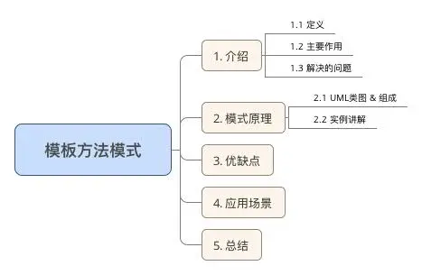
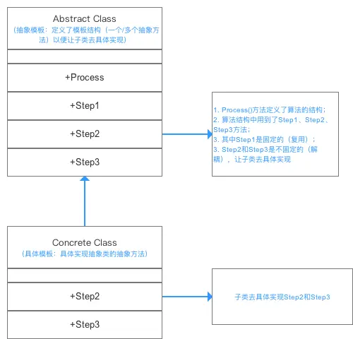

# 目录



# 介绍

#### 1.1 定义

定义一个模板结构，将具体内容延迟到子类去实现。

#### 1.2 主要作用

在不改变模板结构的前提下在子类中重新定义模板中的内容。

> 模板方法模式是基于”继承“的；

#### 1.3 解决的问题

- 提高代码复用性
   将相同部分的代码放在抽象的父类中，而将不同的代码放入不同的子类中
- 实现了反向控制
   通过一个父类调用其子类的操作，通过对子类的具体实现扩展不同的行为，实现了反向控制 & 符合“开闭原则”

------

# 2. 模式原理

#### 2.1 UML类图 & 组成




#### 2.2 实例讲解

接下来我用一个实例来对模板方法模式进行更深一步的介绍。
 **a. 实例概况**

- 背景：小成希望学炒菜：手撕包菜 & 蒜蓉炒菜心
- 冲突：两道菜的炒菜步骤有的重复有的却差异很大，记不住
- 解决方案：利用代码记录下来

**b. 使用步骤**
**步骤1**：创建抽象模板结构（Abstract Class）：炒菜的步骤

```csharp
public  abstract class Abstract Class {  
//模板方法，用来控制炒菜的流程 （炒菜的流程是一样的-复用）
//申明为final，不希望子类覆盖这个方法，防止更改流程的执行顺序 
	final void cookProcess(){  
        //第一步：倒油
        this.pourOil()；
        //第二步：热油
         this.HeatOil();
        //第三步：倒蔬菜
         this.pourVegetable();
        //第四步：倒调味料
         this.pourSauce（）；
        //第五步：翻炒
         this.fry();
    }  

//定义结构里哪些方法是所有过程都是一样的可复用的，哪些是需要子类进行实现的

	//第一步：倒油是一样的，所以直接实现
void pourOil(){  
        System.out.println("倒油");  
    }  

	//第二步：热油是一样的，所以直接实现
    void  HeatOil(){  
        System.out.println("热油");  
    }  

	// 第三步：倒蔬菜是不一样的（一个下包菜，一个是下菜心）
	// 所以声明为抽象方法，具体由子类实现 
    abstract void  pourVegetable()；

	// 第四步：倒调味料是不一样的（一个下辣椒，一个是下蒜蓉）
	// 所以声明为抽象方法，具体由子类实现 
    abstract void  pourSauce（）；

	// 第五步：翻炒是一样的，所以直接实现
    void fry();{  
        System.out.println("炒啊炒啊炒到熟啊");  
    }  
}
```

**步骤2**：创建具体模板（Concrete Class）,即”手撕包菜“和”蒜蓉炒菜心“的具体步骤

```csharp
//炒手撕包菜的类
  public class ConcreteClass_BaoCai extend  Abstract Class{
    @Override
    public void  pourVegetable(){  
        System.out.println(”下锅的蔬菜是包菜“);  
    }  
    @Override
    public void  pourSauce（）{  
        System.out.println(”下锅的酱料是辣椒“);  
    }  
}
//炒蒜蓉菜心的类
  public class ConcreteClass_CaiXin extend  Abstract Class{
    @Override
    public void  pourVegetable(){  
        System.out.println(”下锅的蔬菜是菜心“);  
    }  
    @Override
    public void  pourSauce（）{  
        System.out.println(”下锅的酱料是蒜蓉“);  
    }  
}
```

**步骤3**：客户端调用-炒菜了

```cpp
public class Template Method{
  public static void main(String[] args){

//炒 - 手撕包菜
    ConcreteClass_BaoCai BaoCai = new ConcreteClass_BaoCai（）；
    BaoCai.cookProcess()；

//炒 - 蒜蓉菜心
  ConcreteClass_ CaiXin = new ConcreteClass_CaiXin（）；
    CaiXin.cookProcess()；
    }
        
}
   
```

结果输出

```undefined
倒油
热油
下锅的蔬菜是包菜
下锅的酱料是辣椒
炒啊炒啊炒到熟

倒油
热油
下锅的蔬菜是菜心
下锅的酱料是蒜蓉
炒啊炒啊炒到熟
```


# Android源码示例


# 3. 优缺点

在全面解析完模板方法模式后，我来分析下其优缺点：

#### 3.1 优点

- 提高代码复用性
   将相同部分的代码放在抽象的父类中
- 提高了拓展性
   将不同的代码放入不同的子类中，通过对子类的扩展增加新的行为
- 实现了反向控制
   通过一个父类调用其子类的操作，通过对子类的扩展增加新的行为，实现了反向控制 & 符合“开闭原则”

#### 3.2 缺点

引入了抽象类，每一个不同的实现都需要一个子类来实现，导致类的个数增加，从而增加了系统实现的复杂度。

------

# 4. 应用场景

- 一次性实现一个算法的不变的部分，并将可变的行为留给子类来实现；
- 各子类中公共的行为应被提取出来并集中到一个公共父类中以避免代码重复；
- 控制子类的扩展。

------

# 5. 总结


# 参考

1、https://www.jianshu.com/p/a3474f4fee57