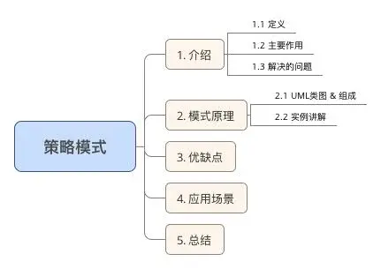
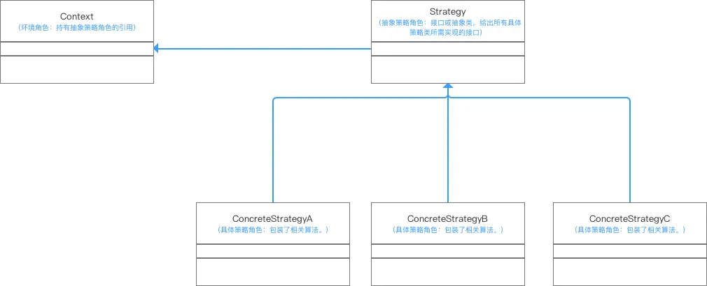

# 目录



# 1. 介绍

#### 1.1 定义

定义一系列算法，将每个算法封装到具有公共接口的一系列策略类中，从而使它们可以相互替换 & 让算法可在不影响客户端的情况下发生变化

> 简单来说：准备一组算法 & 将每一个算法封装起来，让外部按需调用 & 使得互换

#### 1.2 作用（解决的问题）

将算法的责任和本身进行解耦，使得：

1. 算法可独立于使用外部而变化
2. 客户端方便根据外部条件选择不同策略来解决不同问题

> 策略模式仅仅封装算法（包括添加 & 删除），但策略模式并不决定在何时使用何种算法，算法的选择由客户端来决定


# 2. 模式原理

#### 2.1 UML类图 & 组成




#### 2.2 实例讲解

接下来我用一个实例来对策略模式进行更深一步的介绍。
 **a. 实例概况**

- 背景：小成有一家百货公司，最近在定年度的促销活动
- 冲突：每个节日用同一个促销活动太枯燥，没吸引力
- 解决方案：针对不同节目使用不同促销活动进行促销

**b. 使用步骤**
 **步骤1：** 定义抽象策略角色（Strategy）：百货公司所有促销活动的共同接口

```csharp
public abstract class Strategy {  

    public abstract void Show()；
}
```

**步骤2：**定义具体策略角色（Concrete Strategy）：每个节日具体的促销活动

```java
//为春节准备的促销活动A
class StrategyA extends Strategy{

    @Override
    public void show() {
        System.out.println("为春节准备的促销活动A");
    }
}

//为中秋节准备的促销活动B
class StrategyB extends Strategy{

    @Override
    public void show() {
        System.out.println("为中秋节准备的促销活动B");
    }
}

//为圣诞节准备的促销活动C
class StrategyC extends Strategy{

    @Override
    public void show() {
        System.out.println("为圣诞节准备的促销活动C");
    }
}
```

**步骤3：**定义环境角色（Context）：用于连接上下文，即把促销活动推销给客户，这里可以理解为销售员

```cpp
class Context_SalesMan{
//持有抽象策略角色的引用
    private Strategy strategy;

    //生成销售员实例时告诉销售员什么节日（构造方法）
    //使得让销售员根据传入的参数（节日）选择促销活动（这里使用一个简单的工厂模式）
    public SalesMan(String festival) {
        switch ( festival) {
            //春节就使用春节促销活动
            case "A":
                strategy = new StrategyA();
                break;
            //中秋节就使用中秋节促销活动
            case "B":
                strategy = new StrategyB();
                break;
            //圣诞节就使用圣诞节促销活动
            case "C":
                strategy = new StrategyC();
                break;
        }

    }

    //向客户展示促销活动
    public void SalesManShow(){
        strategy.show();
    }

}
```

**步骤4：**客户端调用-让销售员进行促销活动的落地

```csharp
public class StrategyPattern{
  public static void main(String[] args){

        Context_SalesMan mSalesMan ;

        //春节来了，使用春节促销活动
        System.out.println("对于春节：");
        mSalesMan =  Context_SalesMan SalesMan("A");
        mSalesMan.SalesManShow();
        
        
        //中秋节来了，使用中秋节促销活动
        System.out.println("对于中秋节：");
        mSalesMan =  Context_SalesMan SalesMan("B");
        mSalesMan.SalesManShow();

        //圣诞节来了，使用圣诞节促销活动
        System.out.println("对于圣诞节：");
        mSalesMan =  Context_SalesMan SalesMan("C");
        mSalesMan.SalesManShow();  
  }   
}
   
```

结果输出

```undefined
对于春节：
为春节准备的促销活动A
对于中秋节：
为中秋节准备的促销活动B
对于圣诞节：
为圣诞节准备的促销活动B
```


# Android源码示例


# 3. 优缺点

在全面解析完后，我来分析下其优缺点：

#### 3.1 优点

- 策略类之间可以自由切换
   由于策略类都实现同一个接口，所以使它们之间可以自由切换。
- 易于扩展
   增加一个新的策略只需要添加一个具体的策略类即可，基本不需要改变原有的代码，符合“开闭原则“
- 避免使用多重条件选择语句（if else），充分体现面向对象设计思想。

#### 3.2 缺点

- 客户端必须知道所有的策略类，并自行决定使用哪一个策略类。
- 策略模式将造成产生很多策略类，可以通过使用享元模式在一定程度上减少对象的数量。


# 4. 应用场景

动态选择多种复杂行为

> 该行为可理解为：
>
> 1. 复杂的算法 / 数据结构
> 2. 类的行为 / 方法
>     注：提高了行为的保密 & 阿暖


# 5. 总结


# 参考

[Carson带你学设计模式：策略模式（Strategy Pattern）](https://www.jianshu.com/p/0c62bf587b9c)