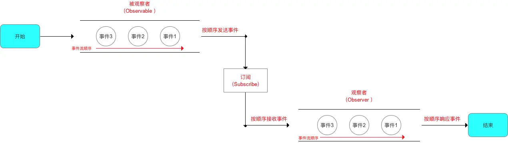

# 目录

------

# 1. 模式说明

- 定义对象间的一种一对多的依赖关系；
- 当1个对象的状态发生改变时，所有依赖于它的对象都将得到通知 & 自动更新对应操作。

> 又称：发布 / 订阅模式

------

# 2. 解决的问题

常变对象 与不常变对象之间存在依赖关系的前提下，不常变对象 需随 常变对象经常改变逻辑的问题。即解耦 常变对象 与不常变对象之间的依赖关系

> 如：常变的`UI`层 与 基本不变的具体业务逻辑

------

# 3. 生活例子引入

我用一个生活例子引入 & 讲解 观察者模式的原理： **顾客到饭店吃饭**

# 4. 原理介绍

## 4.1 UML类图说明

观察者模式中有4个角色

注：Java API有内置的观察者模式类：java.util.Observable 类和 java.util.Observer 接口

> 对应： Subject 和 Observer 的角色；

## 4.2 具体原理说明

请结合上述 **顾客到饭店吃饭** 的生活例子理解：

流程图

即可总结为：被观察者 `（Observable）`  通过 订阅`（Subscribe）` **按顺序发送事件** 给观察者 `（Observer）`， 观察者`（Observer）` **按顺序接收事件** & 作出对应的响应动作。具体如下图：（类似流水线般流动 & 处理。）

至此，设计模式中的观察者模式（Observer）讲解完毕。

# Android源码示例

# 5. 总结

# 参考

[Carson带你学设计模式：观察者模式（Observer）](https://www.jianshu.com/p/8b3152c77245)