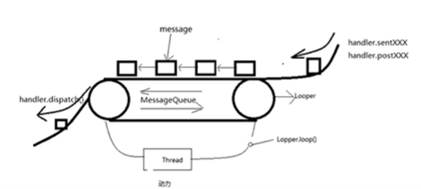
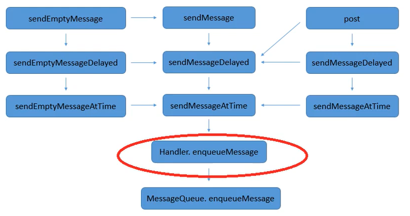
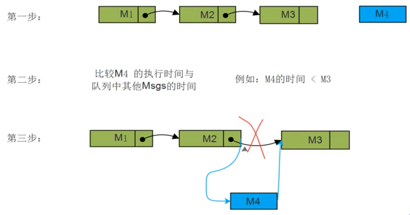
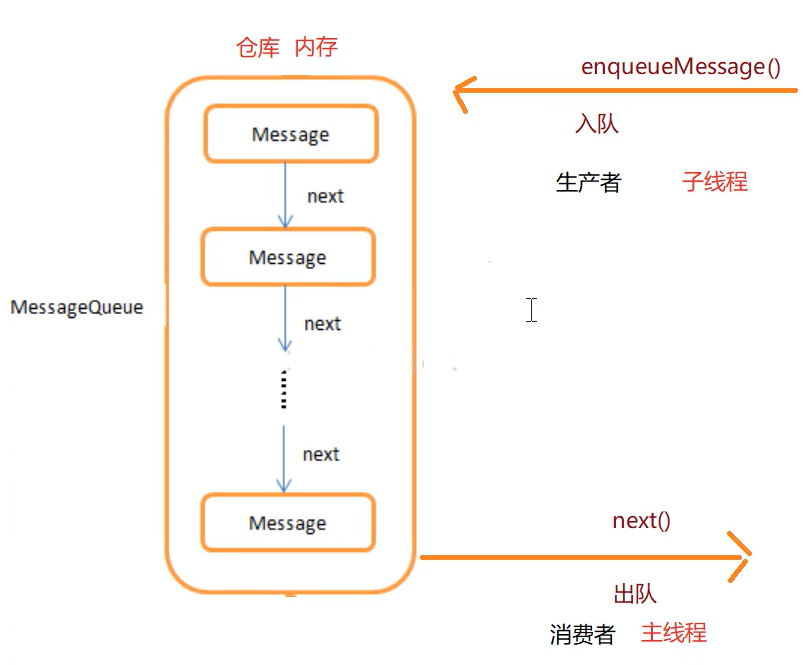
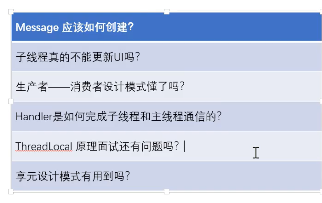

> version：2020/08/26--》2020/10/10
>
> review：2020/10/10

目录

[TOC]


# 一、为什么要学Handler？

Handler是Android中比较基础的消息机制，在实际开发中也是经常会使用到，对于UI的更新至关重要，必须得掌握。跟Handler相关的一些内容如下：

1、我们不能在子线程中更新UI，可借助Handler进行线程切换
2、Handler使用不当可能引起内存泄露
3、Message的优化
4、在子线程中创建Handler，需要为这个Handler准备Looper
5、在Handler处理完消息后，但页面已经销毁了，这时候Handler更新UI，可能出现View的资源引用不见了，就会出现NullPointer Exception。


# 二、Handler的整体架构

## 1、Handler能做什么？

1）处理延时任务（设定将来某个时间处理某个事情）
推送未来某个时间点将要执行的Message或者Runnable到消息队列。
2）线程间通信（主线程和子线程的通信）
在子线程把需要在另一个线程执行的操作加入到消息队列中。

## 2、 Handler模型——传送带



这个模型展示了Handler核心构成（Message、MessageQueue、Thread、Looper）的关系。


# 三、Handler源码整体分析

## 1）发送消息

handler.sendMessage()----->MessageQueue.enqueueMessage()



## 2）添加消息

往MessageQueue中添加消息。每一条被添加的Message，在添加的时候都伴有一个时间，这个时间将作为入列位置的依据。

```java
boolean enqueueMessage(Message msg, long when) {}
```



<font color='orange'>Q：MessageQueue来自何处？</font>
既然要往MessageQueue中添加、取出消息，那MessageQueue来自何处呢？

```java
public final class Looper {
...
    final MessageQueue mQueue;
...
    private Looper(boolean quitAllowed) {
        mQueue = new MessageQueue(quitAllowed);
        mThread = Thread.currentThread();
    }
...
}
```

可以看到，在初始化Looper的时候，会创建一个MessageQueue，由Looper进行管理。后面后讲到Looper的初始化过程。

## 3）取出消息

Looper从MessageQueue中取出消息。MessageQueue#next() ：返回、销毁队列里面的消息

```java
Message next() {}
```

从消息队列中获取消息，使用for循环。

## 4）分发消息

Looper通过方法loop()方法消息到指定的handler。

```java
public static void loop() {
        final Looper me = myLooper();
        ...
        final MessageQueue queue = me.mQueue;
        ...
        for (;;) {
            Message msg = queue.next(); // might block
            ...
            msg.target.dispatchMessage(msg);
            ...
        }
}
```

<font color='orange'>Q：那 Looper#loop() 是在哪调用的呢？</font>

我们的主线程在创建的时候，系统会调用 ActivityThread#main() 方法，并为主（UI）线程初始化一个Looper。

```java
public static void main(String[] args) {
    ...
    Looper.prepareMainLooper();
    ...
    Looper.loop();
    ...
}

    public static void prepareMainLooper() {
        prepare(false);
        synchronized (Looper.class) {
            if (sMainLooper != null) {
                throw new IllegalStateException("The main Looper has already been prepared.");
            }
            sMainLooper = myLooper();
        }
    }

    private static void prepare(boolean quitAllowed) {
        if (sThreadLocal.get() != null) {
            throw new RuntimeException("Only one Looper may be created per thread");
        }
        sThreadLocal.set(new Looper(quitAllowed));
    }
```

在 `prepare()` 方法中，主线程的 Looper 构建完成。并在后面调用 `Looper.loop()` 开启了循环。

## 小结

Handler机制的整体运行流程如下：

1、对于主线程而言，在应用创建的时候，系统会为主线程创建一个Looper（Looper中创建了线程唯一的MessageQueue），并调用Looper.loop()开启循环。

2、有了Looper 和 MessageQueue，就可以创建 Handler 进行消息发送了。

3、消息发送后添加到 MessageQueue 中

4、Looper 从MessageQueue 中取出消息并分发给指定handler。


# 四、源码细节分析


# 五、为什么Handler能够跨线程通信



MessageQueue在内存中是唯一的。

入队：根据时间排序，当队列满（思考：何时满？）的时候，阻塞，直到用户通过next取出消息。当next方法被调用，通知MessageQueue可以进行消息入队。

出队：由Looper.loop()，启动轮询器，对queue进行轮询。当消息达到执行时间就取出来。当message queue为空的时候，队列阻塞，等消息队列调用enqueueMessage的时候，通知队列，可以取出消息了，停止阻塞。

小结：

在子（A）线程中使用主（B）线程对应的Handler，这样Message最终就会在主（B）线程中取出来的，并调用主（B）线程的handler来处理消息，从而完成线程的切换。

> <font color='orange'>Q：Handler怎么进行线程通信，原理是什么？</font>
>
> 在一个线程中，我们可以通过使用与其他线程进行绑定过的handler来实现线程间通信，它的实现原理是每个线程都跟一个MessageQueue、一个Looper相关联，在子线程中通过handler发送消息或runnable后，其对应的Looper会就从MessageQueue中获取消息并交给handler进行处理。而Looper是在其对应的线程中运行的，因此就完成了切换。
>
> 具体操作为：
>
> ```java
> 在子线程中：
>     new Handler(Looper.getMainLooper());
> 或：
>     使用在主线程中创建的handler。
> 或：
>     Handler.getMain()。
> ```
>
> <font color='orange'>Q：子线程怎么创建Handler？</font>
>
> ```java
> 在子线程中：
>     new Handler(Looper.getMainLooper());
> 或：
>     使用在主线程中创建的handler。
> 或：
>     Handler.getMain()。
> 或：
> 	Handler.createAsync()；
> ```


<font color='orange'>Q：Handler是怎么实现消息阻塞的？</font>


其他相关问题总结：



# 总结

1、这一节对handler的整体运作流程做了梳理，关于handler还会有一些更细节的问题，将在后面几节进行分析。

## 【精益求精】我还能做（补充）些什么？

1、

