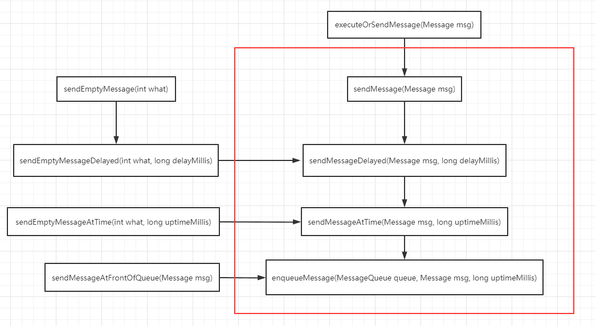

> version：2021/10/10
>
> review：

目录

[TOC]

# 一、Handler是什么？

## 1、Handler定义

关于Handler是什么，网上的博客很多，我觉得还是官方说的最具概括性：

> A Handler allows you to send and process {@link Message} and Runnable objects associated with a thread's {@link MessageQueue}.  Each Handler instance is associated with a single thread and that thread's message queue.  When you create a new Handler, it is bound to the thread / message queue of the thread that is creating it -- from that point on, it will deliver messages and runnables to that message queue and execute them as they come out of the message queue.

解释：
1、Handler是用来发送和处理（与线程的MessageQueue相关联的）Message和Runnable objects的。
2、每个Handler实例与单个线程以及此线程的message queue相关联。
3、从new一个Handler的时候开始，这个Handler就与创建它的线程以及此线程的message queue绑定起来了。
4、它（Handler）会传递（添加）messages和runnables到message queue中，并且会在它们从message queue中取出的时候执行它们。

## 2、Handler主要用处

>There are two main uses for a Handler: (1) to schedule messages and runnables to be executed as some point in the future; and (2) to enqueue an action to be performed on a different thread than your own.

解释：
Handler的主要作用有两点：
（1）添加任务（messages and runnables）在将来执行
（2）添加任务到不同的线程执行

# 二、Handler实例的创建与获取

## 1、Handler实例的创建

通过下列构造方法可以创建handler：

```java
public class Handler {
    public Handler() {
        this(null, false);
    }

    public Handler(Callback callback) {
        this(callback, false);
    }

    public Handler(Looper looper) {
        this(looper, null, false);
    }

    public Handler(Looper looper, Callback callback) {
        this(looper, callback, false);
    }

    public Handler(boolean async) {
        this(null, async);
    }

    public Handler(Callback callback, boolean async) {
        if (FIND_POTENTIAL_LEAKS) {
            final Class<? extends Handler> klass = getClass();
            if ((klass.isAnonymousClass() || klass.isMemberClass() || klass.isLocalClass()) &&
                    (klass.getModifiers() & Modifier.STATIC) == 0) {
                Log.w(TAG, "The following Handler class should be static or leaks might occur: " +
                    klass.getCanonicalName());
            }
        }

        mLooper = Looper.myLooper();
        if (mLooper == null) {
            throw new RuntimeException(
                "Can't create handler inside thread " + Thread.currentThread()
                        + " that has not called Looper.prepare()");
        }
        mQueue = mLooper.mQueue;
        mCallback = callback;
        mAsynchronous = async;
    }

    public Handler(Looper looper, Callback callback, boolean async) {
        mLooper = looper;
        mQueue = looper.mQueue;
        mCallback = callback;
        mAsynchronous = async;
    }

    final Looper mLooper;
    final MessageQueue mQueue;
    final Callback mCallback;
    final boolean mAsynchronous;
}
```

分析：
（1）Handler的构造方法这么多，其本质是什么？
创建Handler的时候都会初始化它的四个变量：

```java
    final Looper mLooper;
    final MessageQueue mQueue;
    final Callback mCallback;
    final boolean mAsynchronous;
```

这四个变量都有final修饰，一旦赋值，以后就不能再改变了。

因此创建Handler的时候就把Handler与Looper以及Looper持有的MessageQueue绑定起来了，进而绑定了对应的线程。

> <font color='orange'>Q：请解释下在单线程模型中Message、Handler、MessageQueue、Looper之间的关系</font>
>
> <font color='orange'>Q：Looper、Handler、线程间的关系。例如一个线程可以有几个Looper可以对应几个Handler？</font>
>
> 这里先简单分析下Handler、Looper、MessageQueue、Thread之间的关系：
> Handler持有Looper的引用 -> Looper持有当前thread的引用，并且创建了（线程唯一的）一个MessageQueue。
> 因此，也就绑定了一种关系：一个Handler对应一个Looper，进而对应一个线程，对应一个MessageQueue（为什么对应一个Looper就对应一个线程和一个MessageQueue在Looper源码分析中再说）。
>
> 一个线程只可以有一个Looper。可以有多个handler。
>
> 但是一个handler只能对应一个Looper、一个MessageQueue、一个Thread。

（2）下面分析这四个变量各自的作用
i、mLooper：绑定Handler与Looper。
ii、mQueue：绑定Handler与MessageQueue，之后发送的消息和Runnables就是添加到MessageQueue中。
iii、mCallback：会影响到消息的处理流程：

```java
    public void dispatchMessage(Message msg) {
        if (msg.callback != null) {
            handleCallback(msg);
        } else {
            if (mCallback != null) {
                if (mCallback.handleMessage(msg)) {
                    return;
                }
            }
            handleMessage(msg);
        }
    }
```

如果mCallback != null，则会调用mCallback.handleMessage(msg)方法，并根据返回结果决定是否调用handleMessage(msg);方法。

> <font color='orange'>Q：Handler的Callback和message都存在，但callback返回true，handleMessage还会执行么？</font>
>
> 如上面的代码所示：
>
> 如果msg中的callback不为null， 那么执行 `handleCallback(msg);`，即callback.run；
>
> 如果msg中的callback为null，那么判断handler是否有callback，有就执行 `mCallback.handleMessage(msg)`，如果此时返回true，则处理结束，返回FALSE，则执行handler的`handleMessage(msg);`。

iv、mAsynchronous：

```java
    private boolean enqueueMessage(MessageQueue queue, Message msg, long uptimeMillis) {
        msg.target = this;
        if (mAsynchronous) {
            msg.setAsynchronous(true);
        }
        return queue.enqueueMessage(msg, uptimeMillis);
    }
```

（3）Looper参数
如果不传入Looper参数，则默认：

```java
mLooper = Looper.myLooper();
```

获取的是当前线程对应的Looper。

注：关于Looper是如何获取到当前线程的，请看：Handler消息机制之Looper类。

> <font color='orange'>Q：子线程使用Handler要怎么处理？</font>
>
> 先回顾一下上面的代码：
>
> ```java
> mLooper = Looper.myLooper();
>         if (mLooper == null) {
>             throw new RuntimeException(
>                 "Can't create handler inside thread " + Thread.currentThread()
> 
> " that has not called Looper.prepare()");
> ```
>
> 因此在子线程中使用new Handler之前，必须调用 Looper.prepare()方法。
>
> ```java
> public static void prepare() {
>     prepare(true);
> }
> 
> private static void prepare(boolean quitAllowed) {
>     if (sThreadLocal.get() != null) {
>         throw new RuntimeException("Only one Looper may be created per thread");
>     }
>     sThreadLocal.set(new Looper(quitAllowed));
> }
> 
>     private Looper(boolean quitAllowed) {
>         mQueue = new MessageQueue(quitAllowed);
>         mThread = Thread.currentThread();
>     }
> ```
>
> prepare()方法负责创建一个MessageQueue，并将Looper和当前的thread进行绑定。
>
> 然后将其添加到sThreadLocal集合中。sThreadLocal是static的，持有着所有的Looper。

> <font color='orange'>Q：关于Handler，在任何地方new Handler都是什么线程下?</font>
>
> 从前面的代码中可以看到：
>
> ```java
> 	mLooper = Looper.myLooper();
> 
>     public Handler(Looper looper, Callback callback, boolean async) {
>         mLooper = looper;
>         mQueue = looper.mQueue;
>         mCallback = callback;
>         mAsynchronous = async;
>     }
> ```
>
> handler中Looper的初始化有两种方式：参数和Looper.myLooper()。
>
> 在Looper.myLooper()中，如果当前线程已经执行过Looper.prepare()了，那就能获取到与当前线程相关联的Looper，否则为null。
>
> 如果参数传入了Looper，那当前线程就是与Looper相关联的，可能是MainLooper或其他。

## 2、Handler实例的获取

可以使用下列方法获取handler：

```java
public class Handler {
    public static Handler createAsync(@NonNull Looper looper) {
        if (looper == null) throw new NullPointerException("looper must not be null");
        return new Handler(looper, null, true);
    }

    public static Handler createAsync(@NonNull Looper looper, @NonNull Callback callback) {
        if (looper == null) throw new NullPointerException("looper must not be null");
        if (callback == null) throw new NullPointerException("callback must not be null");
        return new Handler(looper, callback, true);
    }

    public static Handler getMain() {
        if (MAIN_THREAD_HANDLER == null) {
            MAIN_THREAD_HANDLER = new Handler(Looper.getMainLooper());
        }
        return MAIN_THREAD_HANDLER;
    }

    public static Handler mainIfNull(@Nullable Handler handler) {
        return handler == null ? getMain() : handler;
    }
}
```

这四个方法最终也是通过构造方法创建并获取。

# 三、Handler的使用之sendMessage。

## 1、send消息的整体流程图：



## 2、源码分析

1、所有send出去的消息最终都通过enqueueMessage()添加到了messageQueue中：

```java
    public final boolean sendMessage(Message msg)
    {
        return sendMessageDelayed(msg, 0);
    }

    public final boolean sendMessageDelayed(Message msg, long delayMillis)
    {
        if (delayMillis < 0) {
            delayMillis = 0;
        }
        return sendMessageAtTime(msg, SystemClock.uptimeMillis() + delayMillis);
    }

    public boolean sendMessageAtTime(Message msg, long uptimeMillis) {
        MessageQueue queue = mQueue;
        if (queue == null) {
            RuntimeException e = new RuntimeException(
                    this + " sendMessageAtTime() called with no mQueue");
            Log.w("Looper", e.getMessage(), e);
            return false;
        }
        return enqueueMessage(queue, msg, uptimeMillis);
    }

    private boolean enqueueMessage(MessageQueue queue, Message msg, long uptimeMillis) {
        msg.target = this;
        if (mAsynchronous) {
            msg.setAsynchronous(true);
        }
        return queue.enqueueMessage(msg, uptimeMillis);
    }
```

默认情况下，uptimeMillis = SystemClock.uptimeMillis()+delayMillis。

```java
//SystemClock.uptimeMillis():开机到现在的时间（不包含睡眠时间）
return sendMessageAtTime(msg, SystemClock.uptimeMillis() + delayMillis);
```

2、值得注意的点有：

* sendMessageAtTime()方法并没有final修饰，意味着子类可重写。

3、sendEmptyMessage(int what)系列方法，就是Handler默认创建了一个Message并指定了message.what。

## 小结

send系列的方法共分为三个层次：sendMessage、sendMessageDelayed、sendMessageAtTime，

调用顺序是：

如果没有指定delay，则设置默认的delay=0，然后调用sendMessageDelayed；

然后再讲delay方法转换成AtTime类型的方法，最终调用enqueueMessage。

# 三、Handler的使用之postMessage。

## 1、整体概述

post系列的方法都会传入一个Runnable对象（就是一坨可执行的代码），而这个Runnable对象会通过getPostMessage方法设为m.callback的值（m为Message，也是自动创建的）。

## 2、源码分析

1）post方法其实内部都是调用的send方法。只是，在中间调用了getPostMessage方法为Message指定了callback。

```java
    public final boolean post(Runnable r)
    {
       return  sendMessageDelayed(getPostMessage(r), 0);
    }

    public final boolean postAtTime(Runnable r, long uptimeMillis)
    {
        return sendMessageAtTime(getPostMessage(r), uptimeMillis);
    }

    public final boolean postAtTime(Runnable r, Object token, long uptimeMillis)
    {
        return sendMessageAtTime(getPostMessage(r, token), uptimeMillis);
    }

    public final boolean postDelayed(Runnable r, long delayMillis)
    {
        return sendMessageDelayed(getPostMessage(r), delayMillis);
    }

    public final boolean postDelayed(Runnable r, Object token, long delayMillis)
    {
        return sendMessageDelayed(getPostMessage(r, token), delayMillis);
    }

    public final boolean postAtFrontOfQueue(Runnable r)
    {
        return sendMessageAtFrontOfQueue(getPostMessage(r));
    }
```

2）getPostMessage(Runnable r)和getPostMessage(Runnable r, Object token)

```java
    private static Message getPostMessage(Runnable r) {
        Message m = Message.obtain();
        m.callback = r;
        return m;
    }

    private static Message getPostMessage(Runnable r, Object token) {
        Message m = Message.obtain();
        m.obj = token;
        m.callback = r;
        return m;
    }
```

3）post的几个方法还可以传入一个token对象，这个是被设为了message.obj。被token标记的message是可以被统一移除的。

```java
    /**
     * Remove any pending posts of Runnable <var>r</var> with Object
     * <var>token</var> that are in the message queue.  If <var>token</var> is null,
     * all callbacks will be removed.
     */
    public final void removeCallbacks(Runnable r, Object token)
    {
        mQueue.removeMessages(this, r, token);
    }
```

源码说明：移除所有token标记的message，如果token为null，移除所有callbacks。

## 3、message.calback

这个值是会对消息分发产生影响的：

```java
    public void dispatchMessage(Message msg) {
        if (msg.callback != null) {
            handleCallback(msg);
        } else {
            if (mCallback != null) {
                if (mCallback.handleMessage(msg)) {
                    return;
                }
            }
            handleMessage(msg);
        }
    }

    private static void handleCallback(Message message) {
        message.callback.run();
    }
```

分析：
1、如果msg.callback != null的话，最终分发msg给Handler的时候就只会执行handleCallback方法了。

> <font color='orange'>Q：handler如何实现（消息）延时的？</font>
>
> 可以通过sendMessageDelay()，sendMessageAtTime()，postDelayed()，postAtTime()等方法实现消息延迟。
>
> <font color='orange'>Q：Handle的postDelayed()方法是怎么实现的。</font>
>
> ```java
>     public final boolean postDelayed(Runnable r, long delayMillis)
>     {
>         return sendMessageDelayed(getPostMessage(r), delayMillis);
>     }
> ```
>
> `postDelayed()`是会通过getPostMessage(r)方法将Runnable对象赋值给message的callback。然后通过sendMessageDelayed()方法进行转换，会把delay转换为AtTime，然后调用enqueueMessage添加到消息队列中。
>
> <font color='orange'>Q：Handler.post(Runnable r)方法的底层实现（是如何执行的？）</font>
>
> ```java
> public final boolean post(Runnable r)
> {
>    return  sendMessageDelayed(getPostMessage(r), 0);
> }
> ```
> 也是通过sendMessageDelayed()往下转换，传递，入列的。
>
> <font color='orange'>Q：Handler的post和postDelay是怎么做的？</font>
>
> 如上面两问，post系列方法都是将Runnable添加到message的callback中，然后调用sendMessageDelayed方法进行发送的。
>
> <font color='orange'>Q：Handler的sendMessage和postDelay的区别？</font>
>
> sendMessage会使用我们自己创建的message，并且delay时间默认设置为0；postDelay会自己创建message并将runnable赋值给message的callback，并且有指定具体的delay时间。

# 四、Handler的使用之obtainMessage。

使用obtainMessage方法获取Message时，内部都是使用了Message.obtain。我们需要注意的一个点是：在调用Message.obtain方法时，都把当前的Handler作为参数传进去了，然后被赋值给message.target。
1、源码

```
    public final Message obtainMessage()
    {
        return Message.obtain(this);
    }

    public final Message obtainMessage(int what)
    {
        return Message.obtain(this, what);
    }
    
    public final Message obtainMessage(int what, Object obj)
    {
        return Message.obtain(this, what, obj);
    }

    public final Message obtainMessage(int what, int arg1, int arg2)
    {
        return Message.obtain(this, what, arg1, arg2);
    }
  
    public final Message obtainMessage(int what, int arg1, int arg2, Object obj)
    {
        return Message.obtain(this, what, arg1, arg2, obj);
    }
```

# 五、removeCallbacks和removeMessages

移除指定的message。可以指定what，runnable，token。如果token == null，则移除所有message。

```
    public final void removeCallbacks(Runnable r)
    {
        mQueue.removeMessages(this, r, null);
    }

    public final void removeCallbacks(Runnable r, Object token)
    {
        mQueue.removeMessages(this, r, token);
    }

    public final void removeMessages(int what) {
        mQueue.removeMessages(this, what, null);
    }

    public final void removeMessages(int what, Object object) {
        mQueue.removeMessages(this, what, object);
    }

    public final void removeCallbacksAndMessages(Object token) {
        mQueue.removeCallbacksAndMessages(this, token);
    }
```


# 总结

1、此篇博客主要是过一遍Handler的源码，看了Handler的构造方法、post方法、send方法、remove方法。
还有一些方法没有分析，先看完Looper源码后，再来分析剩下的，比如dispatchMessage等，还有一些不常用的。

## 【精益求精】我还能做（补充）些什么？

1、

