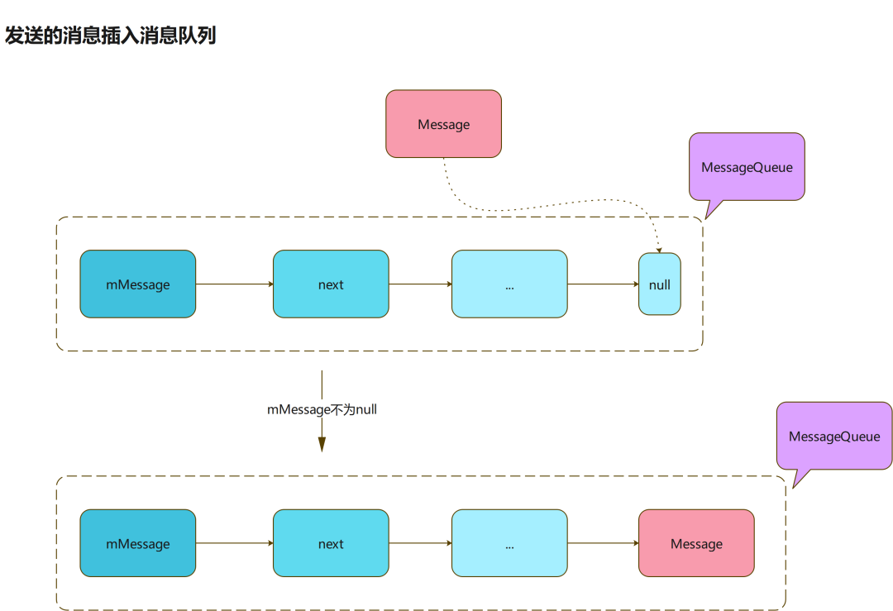
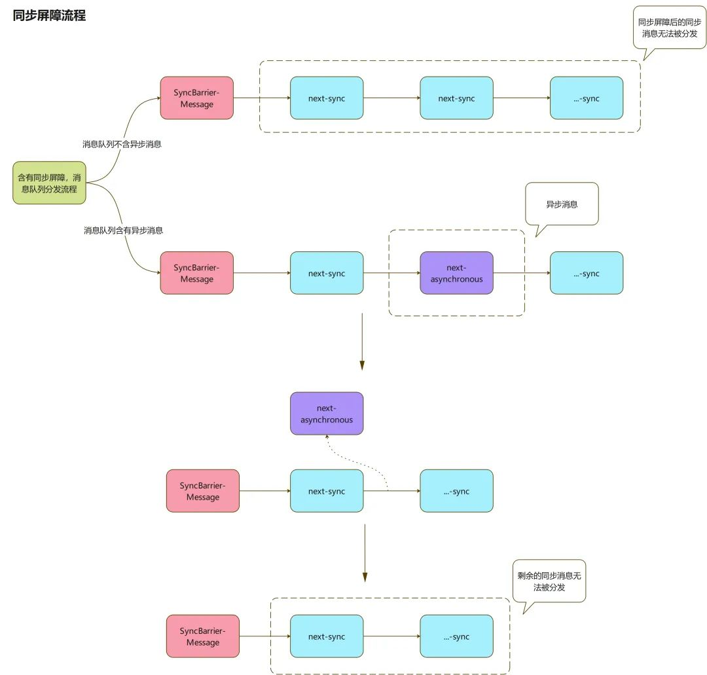
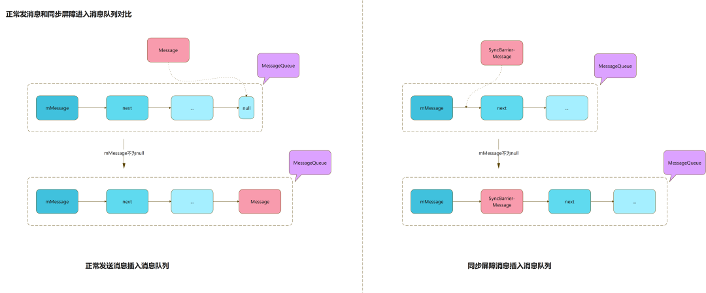
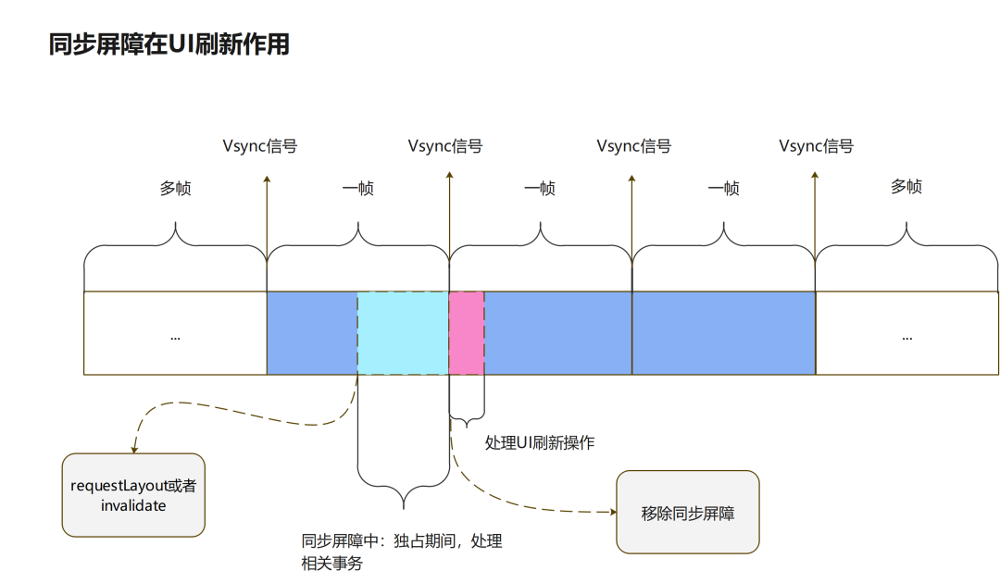

> 
>
> version：2021/10/11
>
> review：

目录

[TOC]

# 一、前言

想要使用Handler进行收发消息，当前的线程必须具备一个Looper和MessageQueue，Looper类就用来为一个线程开启一个消息循环的。（主线程系统已经在ActivityThread中创建过了，因此可以直接使用Handler。）本文将介绍一下Looper类相关的一些知识点。

# 二、prepare()和loop()

在子线程和子线程的通信中，必须在子线程中初始化Handler，prepare在前，loop在后，如下：

```java
new Thread(new Runnable() {
    @Override public void run() {
        Looper.prepare();
        Handler handler = new Handler();
        Looper.loop();
    }
});
```

> <font color='orange'>Q：Handler发消息给子线程，looper怎么启动？</font>
>
> 先调用 Looper.prepare()，在执行Looper.loop()开启轮询。
>
> <font color='orange'>Q：Looper如何在子线程中创建？</font>
>
> 通过 Looper.prepare() 可以为子线程创建Looper。
>
> <font color='orange'>Q：looper和线程是怎么对应的</font>
>
> Looper会跟当前线程一一对应。每个线程最多有一个Looper。

## 1、Looper.prepare()

```java
Looper.java
...
 public static void prepare() {
    prepare(true);
}
 
private static void prepare(boolean quitAllowed) {
    if (sThreadLocal.get() != null) {
        throw new RuntimeException("Only one Looper may be created per thread");
    }
    sThreadLocal.set(new Looper(quitAllowed));
}

    private Looper(boolean quitAllowed) {
        mQueue = new MessageQueue(quitAllowed);
        mThread = Thread.currentThread();
    }
...
```

Looper.prepare()：生成Looper对象，set在ThreadLocal里。此过程会创建一个Looper、和一个线程、一个MessageQueue绑定。

> <font color='orange'>Q：一个线程是否只有一个Looper？</font>
>
> 通过上面的代码可以看见，一个线程内，只能使用一次prepare()，如果多次调用会报错：“Only one Looper may be created per thread"。
>
> <font color='orange'>Q：如何保证一个线程只有一个Looper？</font>
>
> 将Looper的无参构造方法设置为false，提供唯一的方法`prepare()`进行Looper构建，并在已经存在Looper的时候抛出异常，从而保证一个线程只有一个Looper。

## 2、Looper.loop()

```java
Looper.java
...
public static void loop() {
    final Looper me = myLooper();
 
    ...
 
    final MessageQueue queue = me.mQueue;
 
       ...
 
    for (;;) {
        Message msg = queue.next(); // might block
        if (msg == null) {
            // No message indicates that the message queue is quitting.
            return;
        }
 
        ...
 
        try {
            msg.target.dispatchMessage(msg);
            if (observer != null) {
                observer.messageDispatched(token, msg);
            }
            dispatchEnd = needEndTime ? SystemClock.uptimeMillis() : 0;
        } catch (Exception exception) {
            if (observer != null) {
                observer.dispatchingThrewException(token, msg, exception);
            }
            throw exception;
        } finally {
            ThreadLocalWorkSource.restore(origWorkSource);
            if (traceTag != 0) {
                Trace.traceEnd(traceTag);
            }
        }
 
        ....
 
        msg.recycleUnchecked();
    }
}
...
```

loop()主要做了下面几件事：

- Message msg = queue.next()：遍历（取出）消息
- msg.target.dispatchMessage(msg)：分发消息
- msg.recycleUnchecked()：消息回收，进入消息池

loop()中有个死循环，会持续的执行上面的操作。先回顾一下消息的发送，后面再看这三种情况。

> <font color='orange'>Q：Handler消息队列，轮询器的机制</font>
>
> Looper.loop()会一直取消息、分发消息、回收消息。轮询就是不断MessageQueue中取出Message进行分发。轮询时，如果没有消息，会进入休眠状态，通过nativePollOnce()。

## 3、消息发送

消息的发送是通过Handler完成的。无论是post(…)还是sendMessage(…)最终都会调用enqueueMessage()。

```java
private boolean enqueueMessage(@NonNull MessageQueue queue, @NonNull Message msg,
                               long uptimeMillis) {
    //设置target
    msg.target = this;
    msg.workSourceUid = ThreadLocalWorkSource.getUid();
 
    if (mAsynchronous) {
        //设置为异步方法
        msg.setAsynchronous(true);
    }
    return queue.enqueueMessage(msg, uptimeMillis);
}
```

- 此方法给msg的target赋值为当前handler之后，才进行将消息添加的消息队列的操作；
- msg.setAsynchronous(true)：设置Message属性为异步，默认都为同步；设置为异步的条件，需要手动在Handler构造方法里面设置。

下面看一下queue.enqueueMessage：

```java
MessageQueue.java
...
boolean enqueueMessage(Message msg, long when) {
   ...
 
    synchronized (this) {
        ...
 
        msg.markInUse();
        msg.when = when;
        Message p = mMessages;
        boolean needWake;
        if (p == null || when == 0 || when < p.when) {
            // New head, wake up the event queue if blocked.
            msg.next = p;
            mMessages = msg;
            needWake = mBlocked;
        } else {
            needWake = mBlocked && p.target == null && msg.isAsynchronous();
            Message prev;
            for (;;) {
                prev = p;
                p = p.next;
                if (p == null || when < p.when) {
                    break;
                }
                if (needWake && p.isAsynchronous()) {
                    needWake = false;
                }
            }
            msg.next = p; // invariant: p == prev.next
            prev.next = msg;
        }
 
        // We can assume mPtr != 0 because mQuitting is false.
        if (needWake) {
            nativeWake(mPtr);
        }
    }
    return true;
}
...
```

mMessage为当前消息分发到的消息位置

Message通过enqueueMessage加入到消息队列中，这地方有俩种情况：

mMessage为空，传入的msg则为消息链表头，next置空。此时的msg实际上也就是最后一个了。

mMessage不为空，从当前分发位置移到链表尾，将传入的msg插到链表尾部，next置空。



经过上面的操作后，Message就加入到了MessageQueue中了，然后就可以在Looper.loop()中进行取出和分发了。

## 4、消息分发

消息分发由Looper.loop()完成。核心代码如下：

```java
Looper.java
...
public static void loop() {
    final Looper me = myLooper();
    ...
    final MessageQueue queue = me.mQueue;
       ...
    for (;;) {
        //遍历消息池,获取下一可用消息
        Message msg = queue.next(); // might block
        ...
        try {
            //分发消息
            msg.target.dispatchMessage(msg);
            ...
        } catch (Exception exception) {
            ...
        } finally {
            ...
        }
        ....
        //回收消息,进图消息池
        msg.recycleUnchecked();
    }
}
...
```

## 5、遍历（取出）消息

遍历消息的关键方法是 `Message msg = queue.next()`，在for（无限循环）中不断使用，才能遍历消息队列。

```java
MessageQueue.java
...
Message next() {
    final long ptr = mPtr;
    ...
 
    int pendingIdleHandlerCount = -1; // -1 only during first iteration
    int nextPollTimeoutMillis = 0;
    for (;;) {
          ...
        //阻塞，除非到了超时时间或者唤醒
        nativePollOnce(ptr, nextPollTimeoutMillis);
        synchronized (this) {
            // Try to retrieve the next message.  Return if found.
            final long now = SystemClock.uptimeMillis();
            Message prevMsg = null;
            Message msg = mMessages;
            // 这是关于同步屏障（SyncBarrier）的知识，放在同步屏障栏目讲
            if (msg != null && msg.target == null) {
                do {
                    prevMsg = msg;
                    msg = msg.next;
                } while (msg != null && !msg.isAsynchronous());
            }
 
            if (msg != null) {
                if (now < msg.when) {
                    //每个消息处理有耗时时间，之间存在一个时间间隔（when是将要执行的时间点）。
                    //如果当前时刻还没到执行时刻（when），计算时间差值，传入nativePollOnce定义唤醒阻塞的时间
                    nextPollTimeoutMillis = (int) Math.min(msg.when - now, Integer.MAX_VALUE);
                } else {
                    mBlocked = false;
                    //该操作是把异步消息单独从消息队列里面提出来,然后返回,返回之后,该异步消息就从消息队列里面剔除了
                    //mMessage仍处于未分发的同步消息位置
                    if (prevMsg != null) {
                        prevMsg.next = msg.next;
                    } else {
                        mMessages = msg.next;
                    }
                    msg.next = null;
                    if (DEBUG) Log.v(TAG, "Returning message: " + msg);
                    msg.markInUse();
                    //返回符合条件的Message
                    return msg;
                }
            } else {
                // No more messages.
                nextPollTimeoutMillis = -1;
            }
 
            //这是处理调用IdleHandler的操作,有几个条件
            //1、当前消息队列为空(mMessages == null)
            //2、已经到了可以分发下一消息的时刻（now < mMessages.when）
            if (pendingIdleHandlerCount < 0
                && (mMessages == null || now < mMessages.when)) {
                pendingIdleHandlerCount = mIdleHandlers.size();
            }
            if (pendingIdleHandlerCount <= 0) {
                // No idle handlers to run.  Loop and wait some more.
                mBlocked = true;
                continue;
            }
            ...
    }
}
```

1、next()内部是个死循环，你可能会疑惑，只是拿下一节点的消息，为啥要死循环？

为了执行延时消息以及同步屏障等等，这个死循环是必要的。

2、nativePollOnce阻塞方法：到了超时时间(nextPollTimeoutMillis)或者通过唤醒方式(nativeWake)，会解除阻塞状态。

- nextPollTimeoutMillis大于等于零，会规定在此段时间内休眠，然后唤醒
- 消息队列为空时，nextPollTimeoutMillis为-1，进入阻塞；重新有消息进入队列，插入头结点的时候会触发nativeWake唤醒方法

3、如果 msg.target == null，会进入同步屏障状态

- 会将msg消息死循环到末尾节点，除非碰到异步方法
- 如果碰到同步屏障消息，理论上会一直死循环上面操作，并不会返回消息，除非，同步屏障消息被移除消息队列

我理解，所谓同步屏障就是通过do...while循环优先找出消息队列中的异步消息。

4、当前时刻和返回消息的超时时刻判定

- 当前时刻小于返回消息超时时间：进入阻塞，计算时间差，给nativePollOnce设置超时时间，超时时间一到，解除阻塞，重新循环取消息
- 当前时刻大于返回消息超时时间：获取可用消息返回
- when这个变量使我们发送消息的时候，可以发送延时消息：sendMessageDelayed(@NonNull Message msg, long delayMillis)，计算出来的当前时间。MessageQueue类中的enqueueMessage方法，会把延时时间（ SystemClock.uptimeMillis() + delayMillis）赋值给Message对象的when字段。

5、消息返回后，会将mMessage赋值为返回消息的下一节点（只针对不涉及同步屏障的同步消息）

## 6、分发消息

```java
public void dispatchMessage(@NonNull Message msg) {
    if (msg.callback != null) {
        handleCallback(msg);
    } else {
        if (mCallback != null) {
            if (mCallback.handleMessage(msg)) {
                return;
            }
        }
        handleMessage(msg);
    }
}
```

## 7、消息池

msg.recycleUnchecked()用于处理完成分发的消息，完成分发的消息并不会被回收掉，而是会进入消息池，等待被复用。

```java
Message.java
...
void recycleUnchecked() {
    // Mark the message as in use while it remains in the recycled object pool.
    // Clear out all other details.
    flags = FLAG_IN_USE;
    what = 0;
    arg1 = 0;
    arg2 = 0;
    obj = null;
    replyTo = null;
    sendingUid = UID_NONE;
    workSourceUid = UID_NONE;
    when = 0;
    target = null;
    callback = null;
    data = null;
 
    synchronized (sPoolSync) {
        if (sPoolSize < MAX_POOL_SIZE) {
            next = sPool;
            sPool = this;
            sPoolSize++;
        }
    }
}
```

- 首先会将当前已经分发处理的消息，相关属性全部重置，flags也标志可用
- 消息池的头结点会赋值为当前回收消息的下一节点，当前消息成为消息池头结点
- 简言之：回收消息插入消息池，当做头结点
- 需要注意的是：消息池有最大的容量，如果消息池大于等于默认设置的最大容量，将不再接受回收消息入池

- 默认最大容量为50：MAX_POOL_SIZE = 50

既然有将已使用的消息回收到消息池的操作，那肯定有获取消息池里面消息的方法了。

```java
Message.java
...
public static Message obtain() {
    synchronized (sPoolSync) {
        if (sPool != null) {
            Message m = sPool;
            sPool = m.next;
            m.next = null;
            m.flags = 0; // clear in-use flag
            sPoolSize--;
            return m;
        }
    }
    return new Message();
}
```

- 如果消息池不为空：直接取消息池的头结点，被取走头结点的下一节点成为消息池的头结点
- 如果消息池为空：直接返回新的Message实例

> <font color='orange'>Q：message的复用</font>
>
> 消息分发结束后，Message会加入到缓冲池中，实际上就是一个Message对象，实现了链表结构。用于保存一些状态清空了的，可直接使用的Message。最大容量为50。
>
> <font color='orange'>Q：Message有个缓存池，缓存池大小是多少知道吗</font>
>
> 50。

## 8、IdleHandler

在MessageQueue类中的next方法里，可以发现有关于对IdleHandler的处理，它就是一个interface，提供了一个抽象方法。

```java
/**
 * Callback interface for discovering when a thread is going to block
 * waiting for more messages.
 */
public static interface IdleHandler {
    /**
     * Called when the message queue has run out of messages and will now
     * wait for more.  Return true to keep your idle handler active, false
     * to have it removed.  This may be called if there are still messages
     * pending in the queue, but they are all scheduled to be dispatched
     * after the current time.
     */
    boolean queueIdle();
}
```

下面看下在next()中用它做了什么：

```java
MessageQueue.java
...
Message next() {
    final long ptr = mPtr;
    ...
 
    int pendingIdleHandlerCount = -1; // -1 only during first iteration
    int nextPollTimeoutMillis = 0;
    for (;;) {
          ...
        //阻塞，除非到了超时时间或者唤醒
        nativePollOnce(ptr, nextPollTimeoutMillis);
        synchronized (this) {
            // Try to retrieve the next message.  Return if found.
            final long now = SystemClock.uptimeMillis();
            Message prevMsg = null;
            Message msg = mMessages;
            ...
            //这是处理调用IdleHandler的操作,有几个条件
            //1、当前消息队列为空(mMessages == null)
            //2、未到到了可以分发下一消息的时刻（now < mMessages.when）
            //3、pendingIdleHandlerCount < 0表明：只会在此for循环里执行一次处理IdleHandler操作
            if (pendingIdleHandlerCount < 0
                && (mMessages == null || now < mMessages.when)) {
                pendingIdleHandlerCount = mIdleHandlers.size();
            }
            if (pendingIdleHandlerCount <= 0) {
                mBlocked = true;
                continue;
            }
 
            if (mPendingIdleHandlers == null) {
                mPendingIdleHandlers = new IdleHandler[Math.max(pendingIdleHandlerCount, 4)];
            }
            mPendingIdleHandlers = mIdleHandlers.toArray(mPendingIdleHandlers);
        }
 
 
        for (int i = 0; i < pendingIdleHandlerCount; i++) {
            final IdleHandler idler = mPendingIdleHandlers[i];
            mPendingIdleHandlers[i] = null; // release the reference to the handler
 
            boolean keep = false;
            try {
                keep = idler.queueIdle();
            } catch (Throwable t) {
                Log.wtf(TAG, "IdleHandler threw exception", t);
            }
 
            if (!keep) {
                synchronized (this) {
                    mIdleHandlers.remove(idler);
                }
            }
        }
 
        pendingIdleHandlerCount = 0;
        nextPollTimeoutMillis = 0;
    }
}
```

调用条件：

- 当前消息队列为空(mMessages == null)  或  未到分发返回消息的时刻
- 在每次获取可用消息的死循环中，IdleHandler只会被处理一次：处理一次后pendingIdleHandlerCount为0，其循环不可再被执行

实现了IdleHandler中的queueIdle方法

- 返回false，执行后，IdleHandler将会从IdleHandler列表中移除，只能执行一次：默认false
- 返回true，每次分发返回消息的时候，都有机会被执行：处于保活状态

接口添加和移除相关代码：

```java
MessageQueue.java
...
/**
 * Callback interface for discovering when a thread is going to block
 * waiting for more messages.
 */
public static interface IdleHandler {
    /**
     * Called when the message queue has run out of messages and will now
     * wait for more.  Return true to keep your idle handler active, false
     * to have it removed.  This may be called if there are still messages
     * pending in the queue, but they are all scheduled to be dispatched
     * after the current time.
     */
    boolean queueIdle();
}
 
public void addIdleHandler(@NonNull IdleHandler handler) {
    if (handler == null) {
        throw new NullPointerException("Can't add a null IdleHandler");
    }
    synchronized (this) {
        mIdleHandlers.add(handler);
    }
}
 
public void removeIdleHandler(@NonNull IdleHandler handler) {
    synchronized (this) {
        mIdleHandlers.remove(handler);
    }
}
```

使用方法：

```java
public class MainActivity extends AppCompatActivity {
    private TextView msgTv;
    private Handler mHandler = new Handler();
 
    @Override
    protected void onCreate(Bundle savedInstanceState) {
        super.onCreate(savedInstanceState);
        setContentView(R.layout.activity_main);
        msgTv = findViewById(R.id.tv_msg);
        //添加IdleHandler实现类
        mHandler.getLooper().getQueue().addIdleHandler(new InfoIdleHandler("我是IdleHandler"));
        mHandler.getLooper().getQueue().addIdleHandler(new InfoIdleHandler("我是大帅比"));
 
        //消息收发一体
        new Thread(new Runnable() {
            @Override public void run() {
                String info = "第一种方式";
                mHandler.post(new Runnable() {
                    @Override public void run() {
                        msgTv.setText(info);
                    }
                });
            }
        }).start();
    }
 
    //实现IdleHandler类
    class InfoIdleHandler implements MessageQueue.IdleHandler {
        private String msg;
 
        InfoIdleHandler(String msg) {
            this.msg = msg;
        }
 
        @Override
        public boolean queueIdle() {
            msgTv.setText(msg);
            return false;
        }
    }
}
```

小结：当所有消息处理完了 或者  你发送了延迟消息，在这俩种空闲时间里，都满足执行IdleHandler的条件

这地方需要说明下，如果延迟消息时间设置过短的；IdleHandler可能会在发送消息后执行，毕竟运行到next这步也需要一点时间，延迟时间设置长点，你就可以很明显得发现，IdleHandler在延迟的空隙间执行了！

从其源码上，可以看出来，IdlerHandler是在消息分发的空闲时刻，专门用来处理相关事物的

> <font color='orange'>Q：IdleHandler是什么？怎么使用，能解决什么问题？</font>
>
> 我的理解，它是系统提供给我们用于在消息队列为空或者空闲（距离下一次msg事件有较长时间）进行回调的，可以插入我们自己的逻辑代码。可以用Looper提供的方法设置进去，会自动回调。

# 三、同步屏障

在理解同步屏障的概念前，我们需要先搞懂几个前置知识：

## 1、同步和异步消息

什么是同步消息？什么是异步消息？可以通过setAsynchronous()方法标记当前msg是不是异步。true为异步。默认为false，同步消息。

```java
msg.setAsynchronous(true);
 
public void setAsynchronous(boolean async) {
    if (async) {
        flags |= FLAG_ASYNCHRONOUS;
    } else {
        flags &= ~FLAG_ASYNCHRONOUS;
    }
}
```

- 如果不做特殊设置的话：默认消息都是同步消息
- 默认消息都会给其target熟悉赋值：默认消息都不是同步屏障消息

## 2、生成同步屏障消息

在next方法中发现，target为null的消息被称为同步屏障消息，那他为啥叫同步屏障消息呢？

postSyncBarrier(long when)

- sync：同步  barrier：屏障，障碍物  --->  同步屏障
- 同步屏障实际挺能代表其含义的，它能屏蔽消息队列中后续所有的同步方法分发

```java
MessageQueue.java
...
@UnsupportedAppUsage
@TestApi
public int postSyncBarrier() {
    return postSyncBarrier(SystemClock.uptimeMillis());
}
 
private int postSyncBarrier(long when) {
    // Enqueue a new sync barrier token.
    // We don't need to wake the queue because the purpose of a barrier is to stall it.
    synchronized (this) {
        final int token = mNextBarrierToken++;
        final Message msg = Message.obtain();
        msg.markInUse();
        msg.when = when;
        msg.arg1 = token;
 
        Message prev = null;
        Message p = mMessages;
        if (when != 0) {
            while (p != null && p.when <= when) {
                prev = p;
                p = p.next;
            }
        }
        if (prev != null) { // invariant: p == prev.next
            msg.next = p;
            prev.next = msg;
        } else {
            msg.next = p;
            mMessages = msg;
        }
        return token;
    }
}
```

mMessage这个变量，表明是将要被处理的消息，将要被返回的消息，也可以认为，它是未处理消息队列的头结点消息。

关于同步屏障消息

- 从消息池取一个可用消息
- 头结点（mMessage）是否为空

- 不为空：插到头结点的下一节点位置
- 为空：成为头结点

- 同步屏障消息是直接插到消息队列，他没有设置target属性且不经过enqueueMessage方法，故其target属性为null

## 3、同步屏障流程

```java
MessageQueue.java
...
Message next() {
    final long ptr = mPtr;
    ...
 
    int pendingIdleHandlerCount = -1; // -1 only during first iteration
    int nextPollTimeoutMillis = 0;
    for (;;) {
          ...
        //阻塞，除非到了超时时间或者唤醒
        nativePollOnce(ptr, nextPollTimeoutMillis);
        synchronized (this) {
            // Try to retrieve the next message.  Return if found.
            final long now = SystemClock.uptimeMillis();
            Message prevMsg = null;
            Message msg = mMessages;
            // 这是关于同步屏障（SyncBarrier）的逻辑块
            if (msg != null && msg.target == null) {
                do {
                    prevMsg = msg;
                    msg = msg.next;
                } while (msg != null && !msg.isAsynchronous());
            }
 
            if (msg != null) {
                if (now < msg.when) {
                    //每个消息处理有耗时时间，之间存在一个时间间隔（when是将要执行的时间点）。
                    //如果当前时刻还没到执行时刻（when），计算时间差值，传入nativePollOnce定义唤醒阻塞的时间
                    nextPollTimeoutMillis = (int) Math.min(msg.when - now, Integer.MAX_VALUE);
                } else {
                    mBlocked = false;
                    //该操作是把异步消息单独从消息队列里面提出来,然后返回,返回之后,该异步消息就从消息队列里面剔除了
                    //mMessage仍处于未分发的同步消息位置
                    if (prevMsg != null) {
                        prevMsg.next = msg.next;
                    } else {
                        mMessages = msg.next;
                    }
                    msg.next = null;
                    if (DEBUG) Log.v(TAG, "Returning message: " + msg);
                    msg.markInUse();
                    //返回符合条件的Message
                    return msg;
                }
            } else {
                // No more messages.
                nextPollTimeoutMillis = -1;
            }
            ...
        }
        ...
    }
}
```

1、Message msg = mMessages：这步赋值是非常重要的，表示即使我们对msg一顿操作，mMessage还是保留消息队列头结点消息的位置。

首先是一个while循环，内部逻辑，不断将msg节点的位置后移

结束while的俩个条件

- msg移到尾结点，也就是移到了消息队列尾结点，将自身赋值为null（尾结点的next）
- 遇上标记为异步的消息，放行该消息进行后续分发

> do...while就是找到消息队列中的异步消息，优先进行分发。

2、俩个条件产生的不同影响

**消息队列不含异步消息**

- 当我们在同步屏障逻辑里面，将msg自身移到尾结点，并赋值为null（尾结点的next）
- msg为null，是无法进行后续分发操作，会重新进行循环流程
- mMessage头结点重新将自身位置赋值给msg，继续上述的重复过程
- 可以发现，上述逻辑确实起到了**同步屏障**的作用，屏蔽了其所有后续同步消息的分发；只有移除消息队列中的该条同步屏障消息，才能继续进行同步消息的分发

**消息队列含有异步消息**

- 消息队列中如果有异步消息，同步屏障的逻辑会放行异步消息
- 同步屏障里面对prevMsg赋值了！请记住在整个方法里面，只有同步屏障逻辑里面对prevMsg赋值了！这个参数为null与否，对消息队列节点影响很大
- prevMsg为空：会直接将msg的next赋值给mMessage；说明分发完消息后，会直接移除头结点，将头结点的下一节点赋值为头结点
- prevMsg不为空：不会对mMessage投节点操作；会将分发消息的上一节点的下一节点位置，换成分发节点的下一节点
- 通过上面分析，可知；异步消息分发完后，会将其直接从消息队列中移除，头结点位置不变



## 4、同步屏障作用

什么地方用到了postSyncBarrier(long when)方法，这个方法对外是不暴露的，只有内部包能够调用。搜索了整个源码包，发现只有几个地方使用了它，剔除测试类，MessageQueue类，有作用的就是：ViewRootImpl类和Device类。

- ### **Device类**

pauseEvents()：Device内部涉及的是打开设备的时候，会添加一个同步屏障消息，屏蔽后续所有的同步消息处理

pauseEvents()是Device类中私有内部类DeviceHandler的方法

- 这说明，我们无法调用这个方法；事实上，我们连Device类都无法调用，Device属于被隐藏的类，和他同一目录的还有Event和Hid，这些类系统都不想对外暴露
- 这就很鸡贼了，说明插入同步屏障的消息的方法，系统确实不想对外暴露；当然不包括非常规方法：反射

同步屏障添加：开机时，添加同步屏障

```java
Device.java
...
private class DeviceHandler extends Handler {
  ...
  @Override
  public void handleMessage(Message msg) {
      switch (msg.what) {
          case MSG_OPEN_DEVICE:
              ...
              pauseEvents();
              break;
          ...
      }
  }
 
  public void pauseEvents() {
      mBarrierToken = getLooper().myQueue().postSyncBarrier();
  }
 
  public void resumeEvents() {
      getLooper().myQueue().removeSyncBarrier(mBarrierToken);
      mBarrierToken = 0;
  }
}
```

同步屏障移除：完成开机后，移除同步屏障

```java
Device.java
...
private class DeviceHandler extends Handler {
  ...
  public void pauseEvents() {
      mBarrierToken = getLooper().myQueue().postSyncBarrier();
  }
 
  public void resumeEvents() {
      getLooper().myQueue().removeSyncBarrier(mBarrierToken);
      mBarrierToken = 0;
  }
}
 
private class DeviceCallback {
  public void onDeviceOpen() {
      mHandler.resumeEvents();
  }
  ....
}
```

Device中使用同步屏障整体过程比较简单，这里简单描述下

- 打开设备时，在消息队列头结点下一节点位置插入同步屏障消息，屏蔽后续所有同步消息
- 完成开机后，移除同步屏障消息
- 总结：很明显，这是尽量的提升打开设备速度，不被其它次等重要的事件干扰

- ### **ViewRootImpl类**

```java
ViewRootImpl.java
...
void scheduleTraversals() {
  if (!mTraversalScheduled) {
      mTraversalScheduled = true;
      mTraversalBarrier = mHandler.getLooper().getQueue().postSyncBarrier();
      mChoreographer.postCallback(
          Choreographer.CALLBACK_TRAVERSAL, mTraversalRunnable, null);
      notifyRendererOfFramePending();
      pokeDrawLockIfNeeded();
  }
}
```

> 我们调用View的requestLayout或者invalidate时，最终都会触发ViewRootImp执行scheduleTraversals()方法。这个方法中ViewRootImp会通过Choreographer来注册个接收Vsync的监听，当接收到系统体层发送来的Vsync后我们就执行doTraversal()来重新绘制界面。通过上面的分析我们调用invalidate等刷新操作时，系统并不会立即刷新界面，而是等到Vsync消息后才会刷新页面。

我们知道了界面刷新（requestLayout或者invalidate）的过程一定会触发scheduleTraversals()方法，这说明会添加同步屏障消息，那肯定有移除同步屏障消息的步骤，这个步骤很有可能存在doTraversal()方法中，来看下这个方法。

doTraversal()：这地方做了俩件事：移除同步屏障（removeSyncBarrier）、绘制界面（performTraversals）。

```java
void doTraversal() {
    if (mTraversalScheduled) {
        mTraversalScheduled = false;
        mHandler.getLooper().getQueue().removeSyncBarrier(mTraversalBarrier);
 
        if (mProfile) {
            Debug.startMethodTracing("ViewAncestor");
        }
 
        performTraversals();
 
        if (mProfile) {
            Debug.stopMethodTracing();
            mProfile = false;
        }
    }
}
```

doTraversal()是怎么被调用呢？调用：mTraversalRunnable在scheduleTraversals()中使用了

```java
final TraversalRunnable mTraversalRunnable = new TraversalRunnable();
 
void scheduleTraversals() {
    if (!mTraversalScheduled) {
        ...
        mChoreographer.postCallback(
            Choreographer.CALLBACK_TRAVERSAL, mTraversalRunnable, null);
      ...
    }
}
 
final class TraversalRunnable implements Runnable {
    @Override
    public void run() {
        doTraversal();
    }
}
```

postCallback是Choreographer类中方法，该类涉及巨多的消息传递，而且都是使用了异步消息setAsynchronous(true)，这些都是和界面刷新相关，所以都是优先处理

postCallback的核心就是让DisplayEventReceiver注册了个Vsync的通知，后期收到送来的Vsync后，我们就执行doTraversal()来重新绘制界面。

- ### **总结**

通过上面的对ViewRootImpl说明，需要来总结下同步屏障对界面绘制过程的影响。

调用View的requestLayout或者invalidate时，最终都会执行scheduleTraversals()，此时会在主线程消息队列中插入一个同步屏障消息（停止所有同步消息分发），会将mTraversalRunnable添加到mCallbackQueues中，并注册接收Vsync的监听，当接受到Vsync通知后，会发送一个异步消息，触发遍历执行mCallbackQueues的方法，这会执行我们添加的回调mTraversalRunnable，从而执行doTraversal()，此时会移除主线程消息队列中同步屏障消息，最后执行绘制操作。

简单来说就是，调用requestLayout或者invalidate时，会在主线程消息队列中插入一个同步屏障消息，同时注册接收Vsync的监听；当接受到Vsync通知，会发送一个异步消息，执行真正的绘制事件：此时会移除消息队列中的同步屏障消息，然后才会执行绘制操作。

- ### **消息插入区别**

有个很重要的事情，我们再来看下：正常发送消息和同步屏障消息插入消息队列直接的区别，见下图

- 取消息：关于取消息，都是取的mMessage，可以理解为，取消息队列的头结点
- 正常发送消息：插入到消息队列的尾结点
- 消息屏障消息：插入到消息队列头结点的下一节点



- ### **Vsync**

- Vsync 信号一般是由硬件产生的，现在手机一般为60hz~120hz，每秒刷新60到120次，一个时间片算一帧
- 每个 Vsync 信号之间的时间就是一帧的时间段

来看下执行同步消息时间片：



由上图可知：某种极端情况，你所发送的消息，在分发的时候，可能存在一帧的延时。

小结：

- 同步屏障能确保消息队列中的异步消息，会被优先执行
- 鉴于正常消息和同步屏障消息插入消息队列的区别：同步屏障能够及时的屏障队列中的同步消息
- 某些极端场景：发送的消息，在分发的时候，可能会存一帧延时
- 极端场景：Vsync信号到来之后，立马执行了RequestLayout等操作
- 同步屏障能确保在UI刷新中：Vsync信号到来后，能够立马执行真正的绘制页面操作

**同步消息和异步消息使用建议**

在正常的情况，肯定不建议使用异步消息，此处假设一个场景：因为某种需求，你发送了大量的异步消息，由于消息进入消息队列的特殊性，系统发送的异步消息，也只能乖乖的排在你的异步消息后面，假设你的异步消息占据了大量的时间片，甚至占用了几帧，导致系统UI刷新的异步消息无法被及时执行，此时很有可能发生掉帧

当然，如果你能看明白这个同步屏障栏目所写的东西，相信什么时候设置消息为异步，心中肯定有数

- 正常情况，请继续使用同步消息
- 特殊情况，需要自己发送的消息被优先处理：可以使用异步消息

# 四、相关问题解答

<font color='orange'>Q：Looper在主线程中死循环（循环查消息），为啥不会ANR（阻塞主线程）？</font>

<font color='orange'>Q：MessageQueue中没有消息的时候为什么不会ANR</font>

先说下ANR：5秒内无法响应屏幕触摸事件或键盘输入事件；广播的onReceive()函数时10秒没有处理完成；前台服务20秒内，后台服务在200秒内没有执行完毕；ContentProvider的publish在10s内没进行完。所以大致上Loop死循环和ANR联系不大，触发事件后，耗时操作还是要放在子线程处理，handler将数据通讯到主线程，进行相关处理。

线程实质上是一段可运行的代码片，运行完之后，线程就会自动销毁。当然，我们肯定不希望主线程被over，所以整一个死循环让线程保活。

为什么没被卡死：在事件分发里面分析了，在获取消息的next()方法中，如果没有消息，会触发nativePollOnce方法进入线程休眠状态，释放CPU资源，MessageQueue中有个原生方法nativeWake方法，可以解除nativePollOnce的休眠状态，ok，咱们在这俩个方法的基础上来给出答案

- 当消息队列中消息为空时，触发MessageQueue中的nativePollOnce方法，线程休眠，释放CPU资源
- 消息插入消息队列，会触发nativeWake唤醒方法，解除主线程的休眠状态

- 当插入消息到消息队列中，为消息队列头结点的时候，会触发唤醒方法
- 当插入消息到消息队列中，在头结点之后，链中位置的时候，不会触发唤醒方法

- 综上：消息队列为空，会阻塞主线程，释放资源；消息队列为空，插入消息时候，会触发唤醒机制

- 这套逻辑能保证主线程最大程度利用CPU资源，且能及时休眠自身，不会造成资源浪费

- 本质上，主线程的运行，整体上都是以事件（Message）为驱动的

我们在主线程中进行耗时的操作是属于在这个死循环的执行过程中, 如果我们进行耗时操作, 可能会导致这条消息还未处理完成,后面有接受到了很多条消息的堆积,从而导致了 ANR 异常.

<font color='orange'>Q：Handler如果没有消息处理是阻塞的还是非阻塞的？（字节跳动、小米）</font>

消息队列阻塞了，但本质上是休眠，是可唤醒的，通过这种方式，可以降低CPU的消耗。

<font color='orange'>Q：知道epoll的底层原理吗？epoll是阻塞的吗？</font>

阻塞唤醒机制是基于 Linux 的 I/O 多路复用机制 epoll 实现的，它可以同时监控多个文件描述符，当某个文件描述符就绪时，会通知对应程序进行读/写操作。

MessageQueue 创建时会调用到 nativeInit，创建新的 epoll 描述符，然后进行一些初始化并监听相应的文件描述符，调用了epoll_wait方法后，会进入阻塞状态；nativeWake触发对操作符的 write 方法，监听该操作符被回调，结束阻塞状态。

epoll算是阻塞，但是可以被唤醒。

详细请查看：[同步屏障？阻塞唤醒？和我一起重读 Handler 源码](https://xiaozhuanlan.com/topic/0843791256)

<font color='orange'>Q：epoll的时候算是卡顿吗？怎么样算是卡顿了？</font>

不算，它是可以被唤醒的。在Android中，卡顿是指应用响应慢，或者掉帧等现象。


<font color='orange'>Q：是否熟悉Lopper架构，如果熟悉说下其原理，如果你自己实现，你会怎么实现。</font>

介绍一下Looper机制，主要就是loop()方法轮询取消息、分发消息、回收消息的过程。

<font color='orange'>Q：looper是如何实现的；</font>


<font color='orange'>Q：同步屏障机制</font>

上面有详细介绍。


<font color='orange'>Q：Handler内存泄露的原因以及解决方案</font>

<font color='orange'>Q：Handler导致Activity无法回收，内存泄露的问题，</font>

<font color='orange'>Q：Handler持有Activity的泄露链条。</font>

Looper对象在主线程中，整个生命周期都是存在的，MessageQueue是在Looper对象中，也就是消息队列也是存在在整个主线程中；我们知道Message是需要持有Handler实例的，Handler又是和Activity存在强引用关系

存在某种场景：我们关闭当前Activity的时候，当前Activity发送的Message，在消息队列还未被处理，Looper间接持有当前activity引用，因为俩者直接是强引用，无法断开，会导致当前Activity无法被回收

思路：断开俩者之间的引用、处理完分发的消息，消息被处理后，之间的引用会被重置断开

解决：使用静态内部类弱引Activity、清空消息队列


<font color='orange'>Q：HandlerThread是什么？原理和使用场景？</font>

```java
public class HandlerThread extends Thread {
	@Override
    public void run() {
        mTid = Process.myTid();
        Looper.prepare();
        synchronized (this) {
            mLooper = Looper.myLooper();
            notifyAll();
        }
        Process.setThreadPriority(mPriority);
        onLooperPrepared();
        Looper.loop();
        mTid = -1;
    }
    ...
}
```

HandlerThread是一个封装了Handler的线程。

<font color='orange'>Q：Handler、Thread和HandlerThread的差别</font>

Handler是用于发送和处理消息的。

Thread是线程。

HandlerThread是一个封装了Handler的线程。


<font color='orange'>Q：为什么不建议在子线程中更新UI？
</font>

多线程操作，在UI的绘制方法表示这不安全，不稳定。

假设一种场景：我会需要对一个圆进行改变，A线程将圆增大俩倍，B改变圆颜色。A线程增加了圆三分之一体积的时候，B线程此时，读取了圆此时的数据，进行改变颜色的操作；最后的结果，可能会导致，大小颜色都不对。。。


<font color='orange'>Q：ThreadLocal原理，实现及如何保证Local属性？</font>


<font color='orange'>Q：  ThreadLocal的原理，以及在Looper是如何应用的？</font>


<font color='orange'>Q：讲讲Android的消息机制，针对上面的机制，我们可不可以利用它的特性来检测ANR，讲一下方案</font>

```java
    public static void loop() {
        final Looper me = myLooper();
        final MessageQueue queue = me.mQueue;
        for (;;) {
            Message msg = queue.next(); // might block
            if (msg == null) {
                // No message indicates that the message queue is quitting.
                return;
            }

            // This must be in a local variable, in case a UI event sets the logger
            final Printer logging = me.mLogging;
            if (logging != null) {
                logging.println(">>>>> Dispatching to " + msg.target + " " +
                        msg.callback + ": " + msg.what);
            }
            // Make sure the observer won't change while processing a transaction.
            final Observer observer = sObserver;
            if (observer != null) {
                token = observer.messageDispatchStarting();
            }
            try {
                msg.target.dispatchMessage(msg);
                if (observer != null) {
                    observer.messageDispatched(token, msg);
                }
            } catch (Exception exception) {
                if (observer != null) {
                    observer.dispatchingThrewException(token, msg, exception);
                }
                throw exception;
            } 
            ...
            if (logging != null) {
                logging.println("<<<<< Finished to " + msg.target + " " + msg.callback);
            }
...
        }
    }
```

从上面可以看到，有两个接口供我们使用：Printer和Observer，我们可以设置自己的接口实现，用于在消息轮询过程中回调，这样可以计算每条消息处理的时间差，用于检测卡顿或ANR。


<font color='orange'>Q：  怎么利用消息机制检测卡顿，除了这种方式还有别的监测卡顿的方式吗？</font>


# 参考

[万字图文，带你学懂Handler和内存屏障](https://blog.csdn.net/c10WTiybQ1Ye3/article/details/116076728)