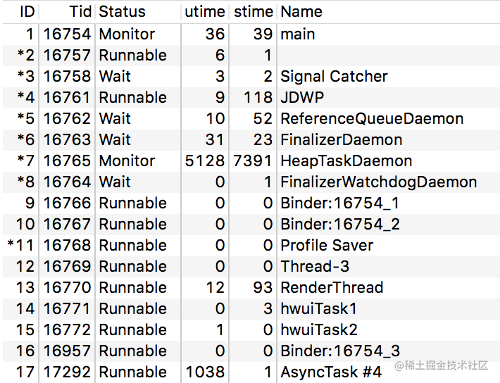

> version：2021/10/28
>
> review：

可选：[原文地址](https://developer.android.google.cn/guide/fragments/create)


[TOC]


# 技术关键词（技术栈）

anr，trace文件，trace文件分析

# 一、什么是ANR

在 Android 系统中，如果应用程序有一段时间响应不够灵敏，系统会向用户显示一个对话框，这个对话框称作应用程序无响应（ANR：ApplicationNotResponding）对话框。 用户可以选择让程序继续运行，但是，他们在使用你的应用程序时，并不希望每次都要处理这个对话框。因此 ，在程序里对响应性能的设计很重要，这样系统就不会显示 ANR 给用户。 


## 日志导出

当系统发生ANR时，会主动dump trace日志并保存在data/anr/trace.txt文件夹下，可以通过 `adb pull` 拿到anr日志；或者可以通过bugreport命令来拉取日志，如下：

```java
adb bugreport [要保存日志的路径]
```

我们在解读日志的时候，也需要一些关键字去查询，判断是哪种类型的问题导致了ANR。

## logcat日志关键字

导致ANR发生的场景主要有以下几个：

**（1）用户输入事件**

触发原因：例如点击、滑动、长按等，在5s内没有处理

日志关键字：

```java
input event dispatching timed out
```

日志详情示例1:

```java
I/WindowManager: Input event dispatching timed out sending to com.lay.layzproject/com.lay.datastore.DataStoreActivity.  Reason: Waiting to send non-key event because the touched window has not finished processing certain input events that were delivered to it over 500.0ms ago.  Wait queue length: 3.  Wait queue head age: 5527.5ms.
```

这种是最常见的ANR，通常在我们点击某个按钮的时候就会导致页面卡死，出现ANR，但是**这个只是在logcat日志中的，我们在开发过程中出现ANR，可以通过搜索这个关键字找到出现ANR的原因，具体trace日志中怎么分析，后面会详细介绍**。

**（2）广播接收器**

触发原因：

前台广播接收器，onReceive在`10s`以内没有处理完成，会触发ANR
后台广播接收器，onReceive在`60s`以内没有处理完成，会触发ANR

logcat日志关键字：

```java
timeout of broadcast BroadcastRecord
```

注意在分析的时候，需要区分前台和后台广播。

**（3）Service**

触发原因：

前台服务，onCreate、onStart、onBind 在`20s`以内没有处理完成，会触发ANR
后台服务，onCreate、onStart、onBind 在`200s`以内没有处理完成，会触发ANR

logcat日志关键字：

```java
timeout executing service
```

**（4）Contentprovider**

触发原因：Contentprovider在`10s`内没有处理完成，例如执行一个`query`操作，就会触发ANR

logcat日志关键字：

```java
timeout publishing content providers
```

在我们开发过程中，如果碰到了ANR，可以直接在编译器中获取日志信息，但是大部分情况，其实是在测试场景或者用户场景中出现这个问题，这就需要获取到trace日志来具体分析。

# 二、ANR的触发

## 1、各组件触发ANR的时间

Activity、BroadCastReceiver、Service触发ANR的时间

Android 系统会监控程序的响应状况，不同的组件发生 ANR 的时间不一样：
Activity：5 秒。应用在 5 秒内未响应用户的输入事件（如按键或者触摸）
BroadCastReceiver ：10 秒。BroadcastReceiver 未在 10 秒内完成相关的处理
Service：20 秒（均为前台）。Service 在20 秒内无法处理完成 

## 2、引起ANR的原因

（1）主线程被 IO 操作（从 4.0 之后网络 IO 不允许在主线程中）阻塞；

主线程进行频繁的IO操作，例如文件读写、SP存储、数据库读写，可能会导致主线程阻塞；

（2）主线程中存在耗时的计算；

（3）主线程中错误的操作，比如 Thread.wait 或者 Thread.sleep 等。

（4）多线程出现死锁，主线程被block

Kotlin出现协程的概念之后，线程池几乎都很少见了，死锁的概率也很低；然而在单线程的场景中，**如果使用协程，也会出现主线程一直等待结果返回，导致超时ANR**。

（5）主线程被Binder对端block

Binder在通信的时候，可以是同步的，也可以是异步的，如果是同步Binder通信，就可能会阻塞主线程，导致ANR

（6）系统资源已经被耗尽，例如CPU、IO等


## 3、ANR信息查看

如果开发机器上出现问题，我们可以查看/data/anr/traces.txt，最新的 ANR 信息在最开始部分。

# 三、避免ANR的建议

核心思路：快速响应，耗时操作放到子线程中，不要阻塞UI线程。

1、使用 AsyncTask 处理耗时 IO 操作。
2、使用 Thread 或者 HandlerThread 时，要设置线程优先级。未调用 Process.setThreadPriority(Process.THREAD_PRIORITY_BACKGROUND)设置优先级，仍然会降低程序响应，因为默认 Thread 的优先级和主线程相同。 
3、使用 Handler 处理工作线程结果，而不是使用 Thread.wait()或者 Thread.sleep() 来阻塞主线程。 
4、Activity 的 onCreate 和 onResume 回调中尽量避免耗时的代码。 
5、BroadcastReceiver 中 onReceive 代码也要尽量减少耗时，建议使用 IntentService 处理。 

小结：
将所有耗时操作，比如访问网络，Socket 通信，查询大量 SQL 语句，复杂逻辑计算等都放在子线程中去，然后通过 handler.sendMessage、runonUIThread、 AsyncTask、RxJava 等方式更新 UI。无论如何都要确保用户界面的流畅度。如果耗时操作需要让用户等待，那么可以在界面上显示度条。

# 四、trace日志解析

## ANR问题定位的流程

（1）定位ANR发生的时间；

（2）查看trace日志，看是否存在cpu异常、锁的竞争、耗时的message、耗时的binder调用；

（3）查看主线程的状态；

（4）查看其他线程的状态；

## trace日志关键字分析

trace示例1

```java
----- pid 32012 at 2023-04-16 12:19:57 -----
Cmd line: com.lay.layzproject
Build fingerprint: 'google/sdk_gphone_x86_arm/generic_x86_arm:9/PSR1.180720.122/6736742:userdebug/dev-keys'
ABI: 'x86'
Build type: optimized
Zygote loaded classes=10642 post zygote classes=1095
Intern table: 74397 strong; 365 weak
JNI: CheckJNI is on; globals=609 (plus 26 weak)
Libraries: /data/app/com.lay.layzproject-ctmKoWSLQO-XwViIKfoW5Q==/lib/x86/libmmkv.so /system/lib/libandroid.so /system/lib/libcompiler_rt.so /system/lib/libjavacrypto.so /system/lib/libjnigraphics.so /system/lib/libmedia_jni.so /system/lib/libsoundpool.so /system/lib/libwebviewchromium_loader.so libjavacore.so libopenjdk.so (10)
//已经分配了堆内存大小3M，已经使用了2M，创建了43648个对象
Heap: 20% free, 2MB/3MB; 43648 objects
// GC的一些信息，可以不关注
Dumping cumulative Gc timings
Cumulative bytes moved 6114552
Cumulative objects moved 141676
Peak regions allocated 416 (104MB) / 1536 (384MB)
Total number of allocations 43648
Total bytes allocated 2MB
Total bytes freed 0B
Free memory 774KB
Free memory until GC 774KB
Free memory until OOME 381MB
Total memory 3MB
Max memory 384MB
Zygote space size 1308KB
Total mutator paused time: 0
Total time waiting for GC to complete: 31us
Total GC count: 0
Total GC time: 0
Total blocking GC count: 0
Total blocking GC time: 0
Registered native bytes allocated: 265097
Current JIT code cache size: 12KB
Current JIT data cache size: 10KB
Current JIT mini-debug-info size: 27KB
Current JIT capacity: 64KB
Current number of JIT JNI stub entries: 0
Current number of JIT code cache entries: 53
Total number of JIT compilations: 53
Total number of JIT compilations for on stack replacement: 0
Total number of JIT code cache collections: 0
Memory used for stack maps: Avg: 70B Max: 524B Min: 24B
Memory used for compiled code: Avg: 209B Max: 3KB Min: 1B
Memory used for profiling info: Avg: 62B Max: 1384B Min: 16B
Start Dumping histograms for 53 iterations for JIT timings
Compiling:	Sum: 124.695ms 99% C.I. 0.107ms-10.841ms Avg: 2.352ms Max: 10.934ms
TrimMaps:	Sum: 4.898ms 99% C.I. 6us-743.999us Avg: 92.415us Max: 820us
Done Dumping histograms
Memory used for compilation: Avg: 15KB Max: 159KB Min: 7KB
ProfileSaver total_bytes_written=0
ProfileSaver total_number_of_writes=0
ProfileSaver total_number_of_code_cache_queries=0
ProfileSaver total_number_of_skipped_writes=0
ProfileSaver total_number_of_failed_writes=0
ProfileSaver total_ms_of_sleep=5000
ProfileSaver total_ms_of_work=0
ProfileSaver max_number_profile_entries_cached=0
ProfileSaver total_number_of_hot_spikes=0
ProfileSaver total_number_of_wake_ups=1

suspend all histogram:	Sum: 734us 99% C.I. 0.304us-105us Avg: 38.631us Max: 105us
//
DALVIK THREADS (14):
"Signal Catcher" daemon prio=5 tid=3 Runnable
  | group="system" sCount=0 dsCount=0 flags=0 obj=0x13100020 self=0xe375e000
  | sysTid=32028 nice=0 cgrp=default sched=0/0 handle=0xdd37e970
  | state=R schedstat=( 9020262 11182596 24 ) utm=0 stm=0 core=2 HZ=100
  | stack=0xdd283000-0xdd285000 stackSize=1010KB
  | held mutexes= "mutator lock"(shared held)
  native: #00 pc 004151b6  /system/lib/libart.so (art::DumpNativeStack(std::__1::basic_ostream<char, std::__1::char_traits<char>>&, int, BacktraceMap*, char const*, art::ArtMethod*, void*, bool)+198)
  native: #01 pc 0051034e  /system/lib/libart.so (art::Thread::DumpStack(std::__1::basic_ostream<char, std::__1::char_traits<char>>&, bool, BacktraceMap*, bool) const+382)
  native: #02 pc 0050b603  /system/lib/libart.so (art::Thread::Dump(std::__1::basic_ostream<char, std::__1::char_traits<char>>&, bool, BacktraceMap*, bool) const+83)
  native: #03 pc 0052e424  /system/lib/libart.so (art::DumpCheckpoint::Run(art::Thread*)+916)
  native: #04 pc 00526146  /system/lib/libart.so (art::ThreadList::RunCheckpoint(art::Closure*, art::Closure*)+534)
  native: #05 pc 00525394  /system/lib/libart.so (art::ThreadList::Dump(std::__1::basic_ostream<char, std::__1::char_traits<char>>&, bool)+1316)
  native: #06 pc 00524d8d  /system/lib/libart.so (art::ThreadList::DumpForSigQuit(std::__1::basic_ostream<char, std::__1::char_traits<char>>&)+941)
  native: #07 pc 004ec186  /system/lib/libart.so (art::Runtime::DumpForSigQuit(std::__1::basic_ostream<char, std::__1::char_traits<char>>&)+214)
  native: #08 pc 004fafde  /system/lib/libart.so (art::SignalCatcher::HandleSigQuit()+1806)
  native: #09 pc 004f9a4f  /system/lib/libart.so (art::SignalCatcher::Run(void*)+431)
  native: #10 pc 0008f065  /system/lib/libc.so (__pthread_start(void*)+53)
  native: #11 pc 0002485b  /system/lib/libc.so (__start_thread+75)
  (no managed stack frames)
  
//主线程调用栈
"main" prio=5 tid=1 Sleeping
  | group="main" sCount=1 dsCount=0 flags=1 obj=0x7583df30 self=0xe36f4000
  | sysTid=32012 nice=-10 cgrp=default sched=0/0 handle=0xe83b5494
  | state=S schedstat=( 4837530082 1301459614 14038 ) utm=141 stm=342 core=2 HZ=100
  | stack=0xff753000-0xff755000 stackSize=8MB
  | held mutexes=
  at java.lang.Thread.sleep(Native method)
  - sleeping on <0x06bde954> (a java.lang.Object)
  at java.lang.Thread.sleep(Thread.java:373)
  - locked <0x06bde954> (a java.lang.Object)
  at java.lang.Thread.sleep(Thread.java:314)
  at com.lay.datastore.DataStoreActivity.onCreate$lambda-0(DataStoreActivity.kt:20)
  at com.lay.datastore.DataStoreActivity.$r8$lambda$afdjO_vwWNd-vtjqRlagos86bqM(DataStoreActivity.kt:-1)
  at com.lay.datastore.DataStoreActivity$$ExternalSyntheticLambda0.onClick(D8$$SyntheticClass:-1)
  at android.view.View.performClick(View.java:6597)
  at com.google.android.material.button.MaterialButton.performClick(MaterialButton.java:1219)
  at android.view.View.performClickInternal(View.java:6574)
  at android.view.View.access$3100(View.java:778)
  at android.view.View$PerformClick.run(View.java:25885)
  at android.os.Handler.handleCallback(Handler.java:873)
  at android.os.Handler.dispatchMessage(Handler.java:99)
  at android.os.Looper.loop(Looper.java:193)
  at android.app.ActivityThread.main(ActivityThread.java:6669)
  at java.lang.reflect.Method.invoke(Native method)
  at com.android.internal.os.RuntimeInit$MethodAndArgsCaller.run(RuntimeInit.java:493)
  at com.android.internal.os.ZygoteInit.main(ZygoteInit.java:858)
```

上面是一个 anr trace 通过bugreport导出来的日志，其中一些字段的含义，下面介绍下。

### 字段的含义

（1）Cmd line

发生了ANR的应用包名。

（2）Heap: 20% free, 2MB/3MB; 43648 objects

在堆内存分配了3M的内存，已经使用了2M，共创建了43648个对象

（3）DALVIK THREADS (14):

当前进程一共有14个线程

### 线程调用栈参数介绍

```java
"main" prio=5 tid=1 Sleeping
  | group="main" sCount=1 dsCount=0 flags=1 obj=0x7583df30 self=0xe36f4000
  | sysTid=32012 nice=-10 cgrp=default sched=0/0 handle=0xe83b5494
  | state=S schedstat=( 4837530082 1301459614 14038 ) utm=141 stm=342 core=2 HZ=100
  | stack=0xff753000-0xff755000 stackSize=8MB
  | held mutexes=
```

上面是主线程的调用栈，下面介绍各参数：

**第一行**："main" prio=5 tid=1 Sleeping

- 线程名：main，如果有daemon这个参数，就是守护线程，例如Signal Catcher线程
- prio：线程优先级
- tid：线程内部id
- 线程状态：Sleeping，关于线程状态，稍后做解释

**第二行**：  | group="main" sCount=1 dsCount=0 flags=1 obj=0x7583df30 self=0xe36f4000

- group：线程所属的线程组
- sCount：线程被挂起的次数
- dsCount：用于调试（debug）的线程挂起次数
- flags：
- obj：当前线程关联的线程java对象
- self：当前线程的地址

**第三行**：  | sysTid=32012 nice=-10 cgrp=default sched=0/0 handle=0xe83b5494

- sysTid：线程真正意义上的tid
- nice：调度优先级，**nice的值越小优先级越高，-10的优先级已经很高了**。
- cgrp：进程所属的进程调度组
- sched：调度策略
- handle：函数处理地址

**第四行**：  | state=S schedstat=( 4837530082 1301459614 14038 ) utm=141 stm=342 core=2 HZ=100

- state：线程状态
- schedstat：CPU调度时间统计
- utm/stm：用户态/内核态的CPU时间
- core：该线程最后运行所在的核心
- HZ：时钟频率

对于CPU调度时间统计这个参数，着重介绍一下：

```java
schedstat=( 4837530082 1301459614 14038 ) 
```

括号里有3个值，分别为Running、Runable、Switch，代表CPU时间片轮转机制中的3个值：

- Running：CPU运行的时间，单位为ns
- Runable：RQ队列的等待时间，单位为ns
- Switch：CPU调度切换的次数

紧接着就是utm和stm：

- utm：该线程在用户态所执行的时间，单位为jiffies，默认为10ms
- stm：该线程在内核态所执行的时间，单位为jiffies，默认为10ms

所以CPU在内核态和用户态运行的时间为：141 * 10 + 342 * 10 = 4830ms，CPU运行的时间为 4837530082ns，也就是4837ms，大致等于utm + stm的时间，也就是schedstat的第一个参数。

**第五行**：  | stack=0xff753000-0xff755000 stackSize=8MB

- stack：线程栈的地址区间
- stackSize：栈的大小

**第六行**：  | held mutexes=

- held mutexes：持有锁的类型，包含独占锁exclusive和共享锁shared两种

#### 小结

从线程的调用栈中，能得到发生ANR的时候，线程所属的状态，以及当下CPU的运转情况，尤其是线程的状态。

### 线程的状态查看

一个线程从无到有，从创建到销毁都有自己的一个状态，如果线程正常运转，那么就会处于Runnable的状态，除此之外，线程还有什么状态呢？

```java
public enum State {
    NEW,
    RUNNABLE,
    /**
     * Thread state for a thread blocked waiting for a monitor lock.
     * A thread in the blocked state is waiting for a monitor lock
     * to enter a synchronized block/method or
     * reenter a synchronized block/method after calling
     * {@link Object#wait() Object.wait}.
     */
    BLOCKED,

    /**
     * Thread state for a waiting thread.
     * A thread is in the waiting state due to calling one of the
     * following methods:
     * <ul>
     *   <li>{@link Object#wait() Object.wait} with no timeout</li>
     *   <li>{@link #join() Thread.join} with no timeout</li>
     *   <li>{@link LockSupport#park() LockSupport.park}</li>
     * </ul>
     *
     * <p>A thread in the waiting state is waiting for another thread to
     * perform a particular action.
     *
     例如当前主线程调用了wait方法，需要等待另一个线程调用notify来唤醒，那么此时线程就处于
     WAITING状态
     */
    WAITING,

    /**
    调用了wait方法，但是没有超时时间，也就意味着可能一直无法被唤醒而一直处于等待状态
     */
    TIMED_WAITING,

    /**
     * Thread state for a terminated thread.
     * The thread has completed execution.
     */
    TERMINATED;
}
```

**（1）Runnable / Native**

页面UI的更新，往往是由主线程来完成的，当主线程已经准备好更新UI并且总体上响应速度较快，就会处于Runnable的状态，此时主线程会等待资源获取到之后进行UI的更新。

> it maybe waiting for other resources from the operating system such as processor.

即便Runnable是正常的状态，官方声明中也说明了此状态可能在等待操作系统的其他资源，所以如果资源到位比较慢，这个时候就会存在ANR的风险，此时主线程一直处于等待的状态，那么超时5s之后就会ANR，所以如果ANR分析时，**发现线程为Runnable状态，就需要考虑是否存在主线程等待资源导致阻塞的场景**。

看下面这个场景：主线程开启一个异步任务，此异步任务与主线程同时持有一把锁，只有当异步任务执行完成之后，锁被释放，主线程才能拿到锁进行处理。

```kotlin
findViewById<Button>(R.id.btn_anr).setOnClickListener {
    CostTimeTask().execute("test")
    Log.d("TAG","execute --- ")
    synchronized(mLock){
        Toast.makeText(this,"异步任务执行完成",Toast.LENGTH_SHORT).show()
    }
}

inner class CostTimeTask : AsyncTask<String,Int,String>(){
     override fun doInBackground(vararg params: String?): String {
         synchronized(mLock){
             while (true){

             }
         }
     }
 }
```

在模拟异步任务中的耗时操作时，因为主线程只能等到异步任务处理完成之后，才能获取这把锁，不然就一直处于阻塞的状态，直到获取了这把锁。

trace示例2

```java
"AsyncTask #1" prio=5 tid=15 Runnable
  | group="main" sCount=0 dsCount=0 flags=0 obj=0x12cbe0f0 self=0xc83e0400
  | sysTid=6148 nice=10 cgrp=default sched=0/0 handle=0xc454e970
  | state=R schedstat=( 6304787005 112481313 737 ) utm=629 stm=1 core=2 HZ=100
  | stack=0xc444b000-0xc444d000 stackSize=1042KB
  | held mutexes= "mutator lock"(shared held)
  at com.lay.datastore.DataStoreActivity$CostTimeTask.doInBackground(DataStoreActivity.kt:42)
  at com.lay.datastore.DataStoreActivity$CostTimeTask.doInBackground(DataStoreActivity.kt:38)
  at android.os.AsyncTask$2.call(AsyncTask.java:333)
  at java.util.concurrent.FutureTask.run(FutureTask.java:266)
  at android.os.AsyncTask$SerialExecutor$1.run(AsyncTask.java:245)
  at java.util.concurrent.ThreadPoolExecutor.runWorker(ThreadPoolExecutor.java:1167)
  at java.util.concurrent.ThreadPoolExecutor$Worker.run(ThreadPoolExecutor.java:641)
  at java.lang.Thread.run(Thread.java:764)

"main" prio=5 tid=1 Blocked
  | group="main" sCount=1 dsCount=0 flags=1 obj=0x7583df30 self=0xe36f4000
  | sysTid=6084 nice=-10 cgrp=default sched=0/0 handle=0xe83b5494
  | state=S schedstat=( 4210489664 1169737873 12952 ) utm=123 stm=298 core=2 HZ=100
  | stack=0xff753000-0xff755000 stackSize=8MB
  | held mutexes=
  at com.lay.datastore.DataStoreActivity.onCreate$lambda-1(DataStoreActivity.kt:29)
  - waiting to lock <0x0493299a> (a java.lang.Object) held by thread 15
  at com.lay.datastore.DataStoreActivity.$r8$lambda$IFZrCDzOUja7d5eTPj5Nq-CEC-8(DataStoreActivity.kt:-1)
  at com.lay.datastore.DataStoreActivity$$ExternalSyntheticLambda0.onClick(D8$$SyntheticClass:-1)
  at android.view.View.performClick(View.java:6597)
  at com.google.android.material.button.MaterialButton.performClick(MaterialButton.java:1219)
  at android.view.View.performClickInternal(View.java:6574)
  at android.view.View.access$3100(View.java:778)
  at android.view.View$PerformClick.run(View.java:25885)
  at android.os.Handler.handleCallback(Handler.java:873)
  at android.os.Handler.dispatchMessage(Handler.java:99)
  at android.os.Looper.loop(Looper.java:193)
  at android.app.ActivityThread.main(ActivityThread.java:6669)
  at java.lang.reflect.Method.invoke(Native method)
  at com.android.internal.os.RuntimeInit$MethodAndArgsCaller.run(RuntimeInit.java:493)
  at com.android.internal.os.ZygoteInit.main(ZygoteInit.java:858)
```

**（2）Blocked / Monitor**

当主线程无法继续执行，那么就会进入Blocked的状态(**如果日志中出现状态为Monitor，那么也是跟Blocked一样**)，所有的事件都将无法响应；



此时线程的状态就处于Wait或者Monitor，一旦线程进入到这种状态，那么就是”濒死“的边缘，此时线程处于阻塞挂起的状态

**（3）Sleeping**

如 `trace示例1` 中看到的日志，此时主线程的状态为Sleeping，从日志中看出因为在点击事件的时候，调用了sleep方法，从而导致的ANR，此时线程的状态也是异常的。

主线程的状态，是整个App的生命线，当主线程的状态出现异常的时候，即便是没有发生ANR，那么也离ANR不远了，所以在分析ANR情况的时候，在排除了CPU等问题之后，重点需要关注主线程的状态，或者跟主线程属于同一个group的其他线程的状态。

### ”死锁“问题的查找

在线程的堆栈最后一行，是带有mutexes锁信息的，如果不知道是否发生死锁，可以**使用”held by“关键字查找是否有对应的日志信息**，如果查找到了，那么大概率就是死锁导致的，但是在客户端的开发过程中，死锁这种好像见到的还是比较少的。

在 `trace示例2` 中，主线程一直等待线程15释放锁从而导致了死锁，线程15就是AsyncTask线程，这同属于main线程组。

```java
waiting to lock <0x0493299a> (a java.lang.Object) held by thread 15
```

最终主线程就处于Blocked的状态，无法继续执行，导致ANR，而AsyncTask #1 线程则是处于Runnable的状态，一直等待，直到方法结束释放资源，但是这种情况下不会释放资源了。

# 相关问题

## 一、概念

<font color='orange'>Q：ANR的原理</font>

**ANR的监测机制**：首先分析Service和输入事件大致工作流程，然后从Service，InputEvent两种不同的ANR监测机制的源码实现开始，分析了Android如何发现各类ANR。在启动服务、输入事件分发时，植入超时检测，用于发现ANR。

**ANR的报告机制**：分析Android如何输出ANR日志。当ANR被发现后，两个很重要的日志输出是：CPU使用情况和进程的函数调用栈，这两类日志是我们解决ANR问题的利器。

**监测ANR的核心原理**是消息调度和超时处理。

只有被ANR监测的场景才会有ANR报告以及ANR提示框。

<font color='orange'>Q：ANR产生的原因是什么？</font>

ANR全称ApplicationNotResponding，出现ANR，系统会弹出一个弹出让用户选择继续等待或者关闭程序。引起ANR问题的根本原因是我们的程序处理的不够及时，不能快速的响应用户的请求。

各个组件系统定义的响应时间不同，Activity 5 秒、BroadCastReceiver 10 秒、Service：20 秒。

<font color='orange'>Q：ANR异常发生条件。</font>

<font color='orange'>Q：什么情况下会发生ANR？</font>

常见的引起ANR的场景有：

在主线程中执行耗时操作，比如IO、使用Binder调用服务、大量运算、主线程的错误调用sleep等。

另一个是在设备低性能也会引起。因此要注意定标准，在设备各种情况下都要充分验证，尤其是低性能设备。

<font color='orange'>Q：ANR怎么产生?怎么捕捉？</font>


<font color='orange'>Q：安卓系统通过什么方式检测ANR</font>


<font color='orange'>Q：什么是ANR,如何避免它？</font>

避免：

写代码时：

1、减少在主线程中的耗时操作。把耗时的操作都放到子线程、或者其他进程中处理。

2、在Activity的生命周期方法中，尽量避免计算等操作，尽量让主线程只负责处理UI相关的事情。

然后在项目开发流程中，

1、要通过review避免

2、通过跑monkey等测试来尽可能在上线前暴露出问题。

## 二、检测

<font color='orange'>Q：如何检测是否发生了ANR</font>

跑Monkey测试，导出/data/anr/traces.txt文件查看。

<font color='orange'>Q：ANR异常如何查找并分析？</font>

可以通过导出/data/anr/traces.txt文件查看。

分析：

首先要定位：

## 三、定位

<font color='orange'>Q：ANR定位和修正</font>

分析Android如何输出ANR日志。当ANR被发现后，两个很重要的日志输出是：**CPU使用情况和进程的函数调用栈**，这两类日志是我们解决ANR问题的利器。

在anr文件中，检索关键字来定位。

## 四、解决

<font color='orange'>Q：如何分析ANR及如何处理</font>


# 总结

1、ANR问题，和内存泄漏、OOM以及其他异常有一点是类似的，就是**能定位到就解决了一大半**。

Tips1：定位问题。

引起ANR问题的根本原因是我们的程序处理的不够及时，不能快速的响应用户的请求。

对于ANR问题，要了解产生ANR的原因，首先**开发阶段**要尽量避免写出可能引起ANR的代码，这个步骤的基本保障有两点：一个是通常靠经验来避免，经验可以通过学习总结、内部培训可以达到；一个是通过代码review做一层保障。

测试阶段，尽量通过压测或者其他测试，尽可能的暴露问题。

线上阶段，要能够检测、上报ANR。

然后就是定位，解决。

**ANR问题解决四步骤：避免、检测、定位、解决。**


## 【精益求精】我还能做（补充）些什么？

1、


# 参考

1、[深入解析](https://mp.weixin.qq.com/s?__biz=MzIwMTAzMTMxMg==&mid=2649493643&idx=1&sn=34b51d1f61bd2ecaa8fd0a2d39c4d1d1&chksm=8eec9b74b99b126246acc4547597dfe55c836b8f689b2d1a65bdf1ee2054ced2fc070bfa2678&mpshare=1&scene=24&srcid=0116vzNfMMv2dLizhAT8mEYq)

2、[Android进阶宝典 -- 如何通过ANR日志分析问题原因](https://juejin.cn/post/7222509109949677629)

3、
