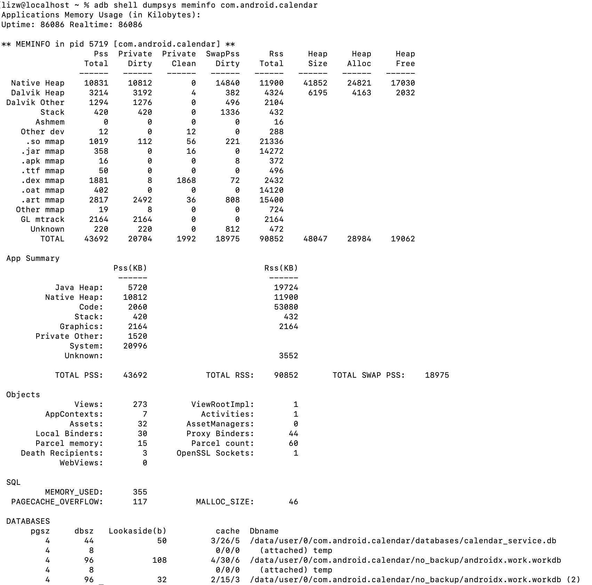

可以通过如下命令来获取应用的内存使用情况：

> adb shell dumpsys meminfo com.android.calendar
>
> adb shell dumpsys meminfo <packageName>

| 内存              | 描述                                                         |
| ----------------- | ------------------------------------------------------------ |
| Naitve Heap Size  | Naitve Heap 最大分配空间。约等于Native Heap Alloc + Native Heap Free |
| Native Heap Alloc | Naitve Heap 已分配空间                                       |
| Native Heap Free  | Naitve Heap 剩余空间                                         |
| Dalvik Heap Size  | Dalvik Heap总的内存大小，约等于Dalvik Heap Alloc + Dalvik Heap Free |
| Dalvik Heap Alloc | Dalvik Heap分配的内存大小。                                  |
| Dalvik Heap Free  | Dalvik Heap剩余的内存大小。                                  |
| Ashmem            | smap路径：/dev/ashmem。匿名共享内存，提供共享内存通过分配一个多个进程 ，可以共享的带名称的内存块。 |
| Other dev         | /dev/。内部driver占用的在 “Other dev”                        |
| .so mmap          | .so。C 库代码占用的内存                                      |
| .jar mmap         | .jar。Java 文件代码占用的内存                                |
| .apk mmap         | .apk。apk代码占用的内存                                      |
| .ttf mmap         | .ttf。ttf 文件代码占用的内存                                 |
| .dex mmap         | .dex。Dex 文件代码占用的内存                                 |
| Other mmap        | 其他文件占用的内存                                           |
| Cursor            | /dev/ashmem/Cursor  Cursor消耗的内存(KB)                     |
|                   |                                                              |

> Naitve Heap Size/Alloc/Free 从mallinfo usmblks获得。
>
> mallinfo是一个C库，mallinfo 函数提供了各种各样的通过C的malloc()函数分配的内存的统计信息。 
>
> Dalvik Heap Size/Alloc/Free 分别从Runtime totalMemory()、Runtime totalMemory()-freeMemory()、Runtime freeMemory()
>
> OtherPss, include Cursor,Ashmem, Other Dev, .so mmap, .jar mmap, .apk mmap, .ttf mmap, .dex mmap, Other mmap, Unkown统计信息都可以在process的smap文件看到。 
>
> Objects and SQL 信息都是从Android Debug信息中获得。 

Q：哪些部分是App可以优化的？

