# 内存优化的意义

> Android性能优化三把板斧：稳定性、内存、启动速度、包体积。这几个方向的知识其实是相互关联的网状结构，例如内存控制得好，就不容易出现OOM导致的稳定性问题。同样，经过精简的包体积，也会大大提升应用启动速度。


相比于C/C++，JVM很大的一个跨越是实现了内存的自动分配与回收。然而，这并不意味着作为开发者可以肆无忌惮地使用内存，作为一种有限的资源，内存再大也有耗尽的时候。我们讲“内存优化”，主要是出于稳定性、流畅度、进程存活率三个维度的考虑。

1. **稳定性**：减少OOM，提高应用稳定性
2. **流畅度**：减少卡顿，提高应用流畅度
3. **进程存活率**：减少内存占用，提高应用后台运行时的存活率

# 内存理论知识

这一部分讲解内存优化相关的理论知识，为实践环节提供理论支持。首先从`虚拟机配置`角度说明Android系统里应用可用的内存上限；然后分析在这个上限之内，应用程序内存主要分配为`哪几个部分`；最后用比较多的篇幅讲解开发中关系最紧密的`对象内存分配与回收`。

## 应用可用内存：dalvik.vm配置

现在市面上主流旗舰机型的内存已经达到了`16G`的级别，比起笔记本电脑也不遑多让，然而在极限的使用条件下，仍然会不可避免地出现卡顿。对于应用程序而言，它能够使用的最大内存是在虚拟机配置里写死的，可以通过命令`adbshellgetpropdalvik.vm.heapgrowthlimit`来查看，在我的手机（vivoXNote）上是`256m`。

```bash
bash

复制代码>adbshellgetpropdalvik.vm.heapgrowthlimit
256m
```

此外虚拟机配置中还有`heapstartsize`、`heapsize`等参数，它们都是定义在`/system/build.prop`文件当中的，含义说明如下：

| 参数                | 含义                                                         | vivoXNote |
| ------------------- | ------------------------------------------------------------ | --------- |
| **heapstartsize**   | 堆分配的初始大小，影响操作系统对RAM的分配和首次使用应用的流畅性 | 8m        |
| **heapgrowthlimit** | 单个应用可用的最大内存，若超出则OOM                          | 256m      |
| **heapsize**        | 单个进程可以用最大内存，仅当声明android:largeHeap=true时生效，此时会覆盖heapgrowthlimit的值 | 512m      |

## Native虚拟内存

我们知道`Android8.0`以后，Bitmap不再存放于Java堆内存，而是位于Native的堆内存，它的上限也就是Native虚拟内存的上限，只与CPU架构相关。Native堆内存不受JVM管控。

| CPU架构  | Native堆上限         |
| -------- | -------------------- |
| **32位** | 3G(4G减去1G内核空间) |
| **64位** | 128T                 |


## 进程内存指标：USS,PSS,RSS,VSS

`dumpsysmeminfo`可以看到整个系统中不同进程所占据的内存情况，最重要的有以下4个缩写指标，它们之间的关系是：`VSS>=RSS>=PSS>=USS`。在Android系统中推荐使用PSS曲线来衡量应用的物理内存占用情况。

| 内存指标 | 英文全称            | 含义     | 等价                       |
| -------- | ------------------- | -------- | -------------------------- |
| **USS**  | UniqueSetSize       | 物理内存 | 进程独占的内存             |
| **PSS**  | ProportionalSetSize | 物理内存 | PSS=USS+按比例包含共享库   |
| **RSS**  | ResidentSetSize     | 物理内存 | RSS=USS+包含共享库         |
| **VSS**  | VirtualSetSize      | 虚拟内存 | VSS=RSS+未分配实际物理内存 |

可以通过`dumpsys`命令查看以上内存信息。

```bash
bash

复制代码dumpsysmeminfo<pid>//指定pid
dumpsysmeminfo--package<packagename>//指定包名，可能存在多个进程
dumpsysmeminfo//系统中所有进程的内存占用，有排序
```

按照范围从大到小，Android系统管理内存可以分为`进程、对象、变量`三个层级。

## 进程内存分配与回收

进程内存分配和回收受到Linux内核的管控，Android将进程分为`5`个优先级，当进程空间紧张时，按照优先级从低到高的顺序进行回收。


## 对象/变量内存分配与回收


对象/变量内存分配和回收受到JVM虚拟机的管控，在JVM中，内存按区域分配如下，其中方法区、堆区是供所有线程共享的。

- **方法区**：被虚拟机加载的类信息、常量、静态变量；存活于程序运行整个周期，不回收

- **堆区**：存储Java对象实例，在线程区-Java函数栈帧会定义实例指针（or引用），指向堆内的实例；GC时判断是否回收

- 线程区

  ：每一个线程单独的区域

  - **程序计数器**：当前线程运行到的指令位置行数
  - **Java函数栈帧**：存储方法执行时的局部变量、操作数；执行结束后释放
  - **Native函数栈帧**：为Native函数服务；执行结束后释放

### Java对象生命周期

从`ClassLoader`装载`.class`文件开始，一个Java对象的生命周期包含以下阶段：


### JVM内存分代

Java虚拟机采用分代策略管理堆内存中的对象，分代的目的是**优化GC性能**，将具有**不同生命周期**的对象归属于不同的年代，采取**最适合它们的内存回收方式**。

**JVM运行时内存**可以分为**堆(`Heap`)**和**非堆(`Non-heap`)**两大部分。堆在JVM启动时创建，是**运行时数据区域**，所有**类实例**和**数组**内存从堆分配。堆以外的内存称为非堆内存，**方法区、类结构**等数据保存在非堆内存。简单说，**堆是开发者可以触及的内存部分，非堆是JVM自留的部分**。


从**对象分代**的角度，JVM内部将对象分为3类：

- ```
  NewGeneration
  ```

  ，新生代，位于堆内存，内部分为3块，其中

  ```
  Eden
  ```

  和

  ```
  Survivor
  ```

  的默认比例为8:1

  - `Eden`，新创建的对象都位于该分区，满时执行GC，并将仍存活的对象复制到`From`，GC后此区域被清空
  - `FromSurvivor(S1)`，GC时，将仍存活的对象复制到`To`
  - `ToSurvivor(S2)`，满时，将仍存活的对象复制到`Old`。GC之后会交换`From`和`To`区，从而使新的`To`（也就是老的`From`）永远是空的

- `OldGeneration`，老年代，位于堆内存

- `PermanentGeneration`，永生代，位于非堆内存

### GCRoots

定义：通过一系列名为`GCRoots`的对象作为起始点，从这个节点向下搜索，搜索走过的路径称为`ReferenceChain`,当一个对象到`GCRoots`没有任何`ReferenceChain`相连时，（图论：这个对象不可到达），则证明这个对象不可用。


共有`4`类`GCRoots`:

- 方法区
  - 静态引用的对象
  - 常量引用的对象
- 线程区
  - Java函数栈帧中引用的对象
  - Native函数栈帧中JNI引用的对象

### 垃圾回收算法

| 算法          | 解释                                                         | 特点                         | 应用场景                   |
| ------------- | ------------------------------------------------------------ | ---------------------------- | -------------------------- |
| **复制**      | 将内存分为2份，使用其中一份进行存储，每次执行清除时将仍然存活的对象复制到另一半，然后清除原来的内存 | 舍弃空间，换取时间上的高效率 | 对象存活率低的场景——新生代 |
| **标记-清除** | 先扫描一遍，将不存活的对象打上标记。第二遍扫描时清理掉这些对象 | 会产生不连续的内存碎片       | 对象存活率高的场景——老年代 |
| **标记-整理** | 先扫描一遍，将不存活的对象打上标记。第二遍扫描时清理掉这些对象，并将内存向一侧聚集收拢 | 防止产生内存碎片             | 对象存活率高的场景——老年代 |

# 内存问题归类

理解了JVM内存的分配与回收原理，我们看一下在Android开发中，发生内存问题的三个表现，它们分别是`内存抖动`、`内存泄漏`与`内存溢出`。其中内存抖动与泄漏是引发内存溢出的重要因素。

## 内存抖动

### 什么是内存抖动

在一段时间内，频繁地发生内存的分配和释放，在曲线图上展现为`锯齿状`的内存使用曲线。


### 内存抖动的原因

1. 选择了不恰当的数据类型：如使用加号`+`进行字符串拼接，正确的做法是用`StringBuilder`
2. 在循环里面创建对象：则循环执行时会频繁地创建销毁
3. 在`onDraw`中创建对象：一次绘制会多次调用`onDraw`

### 如何避免内存抖动

1. 选择恰当的数据类型（`String`->`StringBuilder`）
2. 在循环体、`onDraw`函数外创建对象并复用，减少不合理的对象创建
3. 使用对象池进行缓存复用

## 内存泄漏

直接原因是长生命周期的对象引用了短生命周期的对象，导致短生命周期的对象无法回收。主要是指Activity的泄漏，即持有Activity的变量生命周期长于Activity的生命周期，导致Activity虽然结束但其对象并未释放，其内部的成员变量也由于被持有而无法释放。反复进入退出页面，会看到内存曲线不断上升，即使手动GC也无济于事，继续下去会导致OOM。


### 常见泄漏场景

在Android开发中经常会有将Activity作为Context类型参数传递的场景，用到的时候必须谨慎，防止泄漏。

#### 1.非静态内部类

非静态内部类会持有外部类对象的引用，典型的有Handler、Runnable等。内部类在编译后，会生成一个名为`this$0`的成员变量，就是外部类实例。

##### 1.1Handler等待运行

在使用Handler处理消息时，会构造一个`Message`对象并调用`Handler.post()`，此时`Message`对象中的`target`成员变量指向该`Handler`。由于`Message`会在`MessageQueue`中按时序处理，在处理到它之前，是无法释放Handler的。也就导致了Handler所持有的外部类（通常是Activity）发生泄漏。

要解决这个问题，需要从两点入手：

1. 使用`Handler静态内部类`（或者直接新建一个类文件），Handler通过弱引用持有Activity
2. 在`Activity.onDestroy()`中清空消息队列

##### 1.2Runnable长时间运行

与非静态内部类相类似，通过`newRunnable(){...}`创建一个匿名内部类的对象时，也会持有外部对象的引用。如果这个Runnable在线程池中排队等待处理，同样会导致Activity无法释放。解决方法与Handler类似，由于Activity与任务队列不强相关，此处不建议清空线程池中的任务队列。

1. 创建一个实现了Runnable的静态内部类，内部通过弱引用持有Activity，使用Activity时判空

```java
java

复制代码//Runnable错误用法
privateRunnablemRunnable=newRunnable(){
@Override
publicvoidrun(){

}
};

//Runnable正确用法
privatestaticclassMyRunnableimplementsRunnable{
WeakReference<MainActivity>reference;
publicMyRunnable(MainActivityactivity){
reference=newWeakReference<>(activity);
}
@Override
publicvoidrun(){
MainActivityactivity=reference.get();
}
}
```

#### 2.方法区持有对象引用

方法区包含类结构、常量和静态变量，是`GCRoots`之一，与整个应用的生命周期相同，由于长期存活即拿即用，比较方便，但也因此容易导致内存泄漏。

##### 2.1静态成员变量

静态成员变量在类加载的时候就会赋值，如果其中持有Activity对象，会直接导致无法回收。

##### 2.2单例

双重检查是单例的常规写法，其实现中也用到了静态变量，因此同样有泄漏的风险。

#### 3.资源未关闭

当Activity销毁时，资源性对象不再使用，应当关闭该对象，然后将对象置为`null`，常见的有`Bitmap`、`InputStream`、`OutputStream`等实现了`Closable`接口的类。

```java
java

复制代码//Bitmap
Bitmapbitmap=newBitmap();
...
bitmap.recycle();
bitmap=null;

//InputStream
InputStreaminp=newFileInputStream("foo.txt");
...
inp.close();
inp=null;
```

#### 4.注册对象未注销

切记需要成对调用注册-注销，如`BroadcastReceiver`、`EventBus`，否则会导致Activity一直被持有，从而发生泄漏。在开发总线类框架的时候，也要注意提供相应的注销接口。

#### 5.WebView必然泄漏

这个是Android的痼疾了，一旦创建过WebView对象，就无法回收，与`Chromium内`核实现有关，网上有建议用如下方法清空WebView资源，但据网友描述在一些机型让仍然会泄露。

```kotlin
kotlin

复制代码overridefunonDestroy(){
valparent=webView?.parent
if(parentisViewGroup){
parent.removeView(webView)
}
webView?.destroy()
super.onDestroy()
}
```

既然如此，就得避免创建过多的WebView对象，或者干脆另外起一个进程用作WebView展示。

1. **构建WebView对象池**，实现复用
2. **将WebView单独开辟一个进程使用**，与主进程之间跨进程通信传递数据

#### 6.集合未清空

将对象添加进集合后，集合实例会持有该对象的引用，因此在销毁时应当将集合中对应元素移除。

```java
java

复制代码//问题场景
//通过循环申请Object对象&将申请的对象逐个放入到集合List
List<Object>objectList=newArrayList<>();
for(inti=0;i<10;i++){
Objecto=newObject();
objectList.add(o);
o=null;//虽释放了集合元素引用的本身，但仍然被集合持有
}

//正确写法
objectList.clear();
objectList=null;
```

## 内存溢出

当应用在为新的数据结构申请内存时，如果当前可用内存不足以提供给新对象，就会发生内存溢出（OOM，即OutofMemory）。我们面临的大部分都是Java堆内存超限问题。


当发生OOM时，**并不一定是当前执行的代码发生了问题**，有可能是由于之前的不正确调用，当前已经处于一个内存异常的状态，在申请开辟新内存时导致问题爆发。

# 优化思路

这里列出一些内存优化的建议，由于在应用运行的整个生命周期里都存在内存的申请和释放，因此内存优化存在于应用开发的方方面面。

## 1.精简代码

在JVM中类的数据结构位于方法区，伴随应用的整个生命周期都不会销毁，因此应当尽量精简类的结构。

- **减少不用的类**，以及类中的成员变量
- **减少不必要的三方依赖包**
- **开启应用混淆**，精简类名方法名变量名，自动清理无用的类

## 2.内存复用

通过复用，减少频繁创建销毁对象的行为，防止产生大量离散的内存碎片。

- **资源复用**：归拢通用的字符串、颜色、度量值等，进行基础布局的复用
- **视图复用**：借助ViewHolder减少视图布局开销
- **对象复用**：建立对象池，实现复用逻辑

## 3.选用性能更高的数据结构

### 3.1慎用SharedPreferences

读取SP时会将整个xml加载到内存里，占据几十K、上百K的内存。

### 3.2使用SparseArray、ArrayMap代替原生的HashMap

`HashMap`最初是为JVM设计的，为了减少哈希冲突，选用了一个较大的数组作为容器来降低冲突，这是一种空间换时间的思路。在Android中提供了不同的替换结构。

- `Key`是`Int`时，选用`SparseArray`
- `Key`是其他类型时，选用`ArrayMap`

它们的思路是时间换空间，内部是两个数组，节约了`HashMap`中空置的元素位。从性能角度看，当元素数量在`1000`以下时，性能几乎与`HashMap`持平。

## 4.选用性能更高的数据类型

### 4.1避免频繁拆箱装箱（AutoBoxing）

在自动装箱时，会创建一个新的对象，从而产生更多的内存和性能开销。`int`只占`4`字节，而`Integer`对象占据`16`字节，尤其是`HashMap`此类容器，当用`Integer`作为`Key/Value`，进行添加、删除、查找操作时，会产生大量自动装箱操作。

排查方法：通过`TraceView`查看耗时，如果发现调用了大量的`Integer.valueOf()`函数，说明存在装箱行为。

### 4.2避免使用枚举类型，用IntDef、StringDef等注解代替

枚举的优点是提供强制的类型检查，但缺点是对于`dex`构建、运行时内存都会造成更大的消耗（相比于`Integer`、`String`）。为了满足编译期间的类型检查，可以改用`IntDef`和`StringDef`，需要引入依赖：

```bash
bash

复制代码compile'com.android.support:support-annotations:22.0.0'
```

## 5.实现onLowMemory()、onTrimMemory()方法

它们都是在`Application、Activity、Fragment、Service、ContentProvider`中提供的，用于应用内存紧张时的通知，在发生这些回调时，应当主动清除缓存，释放次要资源。通过`Context.registerComponentCallbacks()`进行注册监听。

- **onLowMemory**：发生时，所有后台进程已经被杀死
- **onTrimMemory**：Android4.1引入，存在多个不同级别的回调


## 6.声明largeHeap以增大可用内存

`在AndroidManifest.xml`中声明`android:largeHeap=true`可以将应用的可用内存扩展到dalvik.vm.heapsize。但这是一种治标不治本的方法，并不推荐使用。

## 7.建立LruCache

对于可能存在复用的对象，建立LruCache，内部由`LinkedHashMap`双向链表实现（也可以自定义双向链表）。支持`get/set/sizeOf`函数。当收到低内存警告（`onLowMemory`、`onTrimMemory`）时，清空LruCache。

LruCache的实现可以参考Glide源码。

## 8.排查内存泄漏

针对上文中提出的内存泄漏风险点，使用MemoryProfiler、LeakCanary、MAT等工具，逐页面进行排查。

# 典型问题：Bitmap优化

Bitmap是内存消耗的大头，在`Android8.0`及以上版本，Bitmap内存位于Native层，可以利用虚拟内存提升存储量，同时避免JVM堆内存耗尽。即使这样，在创建Bitmap时仍然会先占用JVM的堆空间，只不过在创建后会将其复制到Native堆进行维护。

以`ARGB_8888`格式为例，一个像素占用`4bytes`，所以整个Bitmap所占据的字节数=`长*宽*4bytes`，假设一张图片长宽各为500px，那么它需要占用`500*500*4=1,000,000B=1MB`的内存，对于长列表而言，如果使用不当，一次就可能导致`几百MB`的内存泄漏。

因此，Bitmap优化是内存优化的重中之重，通常有以下几个思路：

1. 缩放减小宽高
2. 减少每个像素占用的内存
3. 内存复用，避免重复分配
4. 大图局部加载
5. 使用完毕后释放图片资源
6. 设置图片缓存
7. 大图监控

## 1.缩放减小宽高

图片尺寸不应大于View的尺寸，例如图片是`200*200`，而View是`100*100`的，此时应当对图片进行缩放，通过`inSampleSize`实现。

```java
java

复制代码BitmapFactory.Optionsoptions=newBitmapFactory.Options();
//宽高都变为原来的1/2
options.inSampleSize=2;
BitmapFactory.decodeStream(is,null,options);
```

## 2.减少每个像素占用的内存

这一条适用于那些些不需要展示高清图的场景，以及低配机器的图片显示。在`API29`中，将Bitmap分为`6`个等级，如果图片不含透明通道，可以考虑用`RGB_565`代替`ARGB_8888`，能够节约一半的内存。

- `ALPHA_8`：不存储颜色信息，每个像素占1个字节；
- `RGB_565`：仅存储`RGB`通道，每个像素占2个字节，对`Bitmap`色彩没有高要求，可以使用该模式；
- `ARGB_4444`：已弃用，用`ARGB_8888`代替；
- `ARGB_8888`：每个像素占用4个字节，保持高质量的色彩保真度，默认使用该模式；
- `RGBA_F16`：每个像素占用8个字节，适合宽色域和`HDR`；
- `HARDWARE`：一种特殊的配置，减少了内存占用同时也加快了`Bitmap`的绘制。

## 3.内存复用，避免重复分配

通过设置`BitmapFactory.Options.inBitmap`，可以在创建新的Bitmap时尝试复用`inBitmap`的内存，在`4.4`之前需要`inBitmap`与目标Bitmap同样大小，在`4.4`之后只要`inBitmap`比目标Bitmap大即可。

## 4.大图局部加载

有些场景下需要展示巨大的一张图片，比如地铁路线图、微博长图、对高像素图片进行编辑等，如果按照原图尺寸进行加载，一张`4800万像素`的照片会占据`48M`的内存，非常可怕。

因此，在大图展示的场景下，通常采用`BitmapRegionDecoder`来实现。

```java
java

复制代码BitmapRegionDecoderdecoder=BitmapRegionDecoder.newInstance(inputStream,false);
BitmapFactory.Optionsoptions=newBitmapFactory.Options();
options.inPreferredConfig=Bitmap.Config.RGB_565;
//加载图片中央200*200的局部区域
Bitmapbitmap=decoder.decodeRegion(newRect(width/2-100,height/2-100,width/2+100,height/2+100),options);
mImageView.setImageBitmap(bitmap);
```

## 5.使用完毕后释放图片资源

Bitmap使用完毕后应当及时释放。

### 5.1常规释放

```java
java

复制代码Bitmapbitmap=...
//使用该bitmap后，进行释放
bitmap.recycle();
bitmap=null;
```

### 5.2非常规，泄漏兜底

如果Activity、Fragment发生泄漏，会导致它们持有的View无法释放，进而使View中展示的Bitmap对象无法被系统回收。

此时，可以通过覆写`View.onDetatchedFromWindow`进行监控兜底，当View从Window中被移除，且Activity处于`destroy`状态时，延迟`2s`判断，如果2s后图片仍然没有被移除，说明发生了泄漏。此时应当主动将Bitmap释放。


## 6.设置图片缓存

可以参考Glide的四级缓存策略，我之前写过文章[《Glide源码解析》](https://juejin.cn/post/7352727612660138022)。

## 7.进行大图监控

前面说过，如果Bitmap的尺寸大于目标View的尺寸，是没有意义的，这里提供一些技术手段协助进行大图监控，我们声明一个`checkBitmapFromView`的函数，用于扫描当前Activity、Fragment的全部View，并取出Bitmap进行尺寸比较，如果发现大图case则报警。

```java
java

复制代码/**
*1.遍历Activity中每个View
*2.获取View加载的Bitmap
*3.对比View尺寸和Bitmap尺寸
*/
funcheckBitmapFromView(){
//实现略
}
```

如何将这段检查的逻辑插入到代码当中？有以下几种方式。

| **方案**                              | **实现思路**                                                 | **优点**                                                     | **缺点**                                                     |
| ------------------------------------- | ------------------------------------------------------------ | ------------------------------------------------------------ | ------------------------------------------------------------ |
| **BaseActivity**                      | 在基类的onDestroy()中检查                                    | 接入简单                                                     | 侵入性强，对全部Activity产生影响，所有Activity需要继承BaseActivity |
| **ArtHook**                           | 是针对ART虚拟机的Hook方案，通过HookImageView的setImageBitmap函数，在其中进行检测 | 无侵入性，一次配置全局生效；可以获取代码调用堆栈，便于定位问题 | Hook方案存在兼容性风险，需要全面覆盖测试                     |
| **ASM**                               | 在编译过程中对setImageBitmap进行插桩                         | 无侵入性                                                     | 增加编译耗时，ASM代码维护成本高                              |
| **registerActivityLifecycleCallback** | 在Application中注册                                          | 无侵入性，接入简单                                           | 暂无                                                         |

# 分析工具

## MemoryProfiler

## MAT（MemoryAnalyzerTool）

MAt是用来分析内存快照，分析对象引用链，从而找出导致内存泄漏根因的工具。

### MAT的使用步骤

1. 下载[eclipse.org/mat/downloa…](https://link.juejin.cn/?target=https%3A%2F%2Feclipse.org%2Fmat%2Fdownloads.php)
2. 在AndroidStudio中进入MemoryProfiler功能，操作应用关键页面
3. 点击GC以清理掉那些没有被泄露的对象，此时剩余的是发生泄漏的
4. 将内存快照dump到本地
5. 使用AndroidSDK自带的转换工具（位于`platform-tools`），将`Dalvik/ART`格式的`.hprof`文件转换为MAT能识别的`J2SE`格式，最后用MAT打开文件

```bash
bash

复制代码./hprof-convaaa.hprofaaa-converted.hprof
```

### MAT中的术语说明

- **Dominator**：支配者，如果B引用了A，那么B是A的支配者
- **DominatorTree**：支配者引用链
- **ShallowHeap**：当前对象自身的内存占用
- **RetainedHeap**：当前对象及其成员变量加在一起的总内存占用
- **OutgoingReferences**：当前对象引用了哪些对象
- **IncomingReferences**：当前对象被哪些对象引用
- **TopConsumers**：通过饼图方式列出内存占用最多的对象

## LeakCanary

在开发环境中使用，反复进出同一页面，查看是否有泄漏通知。LeakCanary可以保存`.hprof`文件，供进一步分析。关于其原理部分主要有三个考察点：怎样监听Activity销毁时机、如何判断Activity是否被释放、如何自启动，可以参考我之前写的一篇文章[《LeakCanary源码解析》](https://juejin.cn/post/7351329921773600807)。

# 线上OOM监控：美团Probe与快手KOOM

当线上发生OOM时，我们需要立即采集现场数据，并报警给服务器进行收集。对此，不同公司都提出了各自的方案，例如美团的Probe（未开源），快手的[KOOM](https://link.juejin.cn/?target=https%3A%2F%2Fgithub.com%2FKwaiAppTeam%2FKOOM)。这些方案主要解决了以下几个问题：

- 监控OOM：当发生OOM时触发采集上报流程
- 堆转储：即采集内存快照，`dumphprof`
- 解析快照：把对分析问题无用的数据裁剪去掉，仅保留有用的信息。进行可达性分析，生成到`GCRoots`的调用链，找出泄漏根因
- 生成报告并上传：KOOM支持在端侧生成`json`格式报告，并进行上传，将解析工作交由端侧进行，能有效减少云端的分析压力

# 面试常见提问

> Q：说说你对内存优化的理解

问题比较大，采用总-分-总方式作答。

- （总）内存管理是应用性能优化中非常重要的一环，在我以往的工作中也从事过一些内存优化的工作，业余也查阅积累了一些内存优化的知识。接下来我从重要性、问题分类、常见问题场景、优化思路几个方面讲一下我的理解
- （分）不要讲的太细，一是占用时间太多，过犹不及，容易让面试官感到啰嗦，二是会留下背答案的印象
- （总）略

> Q：开发过程中你是怎样判断有内存泄漏的

在开发过程中，我通常使用以下几种方法，对内存泄漏可能存在的场景进行快速检测和定位。

1. **内存泄漏-应用全生命周期分析**：`shell命令+LeakCanary+MAT`，运行程序并将主要链路页面都打开一遍，完全退出程序并手动触发GC。然后使用`adbshelldumpsysmeminfo<packagename>-d`打印应用当前进程信息，如果存活的View和Activity、Fragment数量不是`0`，说明它们发生了泄漏。接着借助LeakCanary查看哪些对象发生了泄漏，最后用MAT找出这些泄漏对象的引用关系，定位问题根因
2. **内存泄漏-单一页面分析**：使用MemoryProfiler工具，对于目标页面，反复进出5次，在最后一次退出后手动触发GC。如果此时内存曲线没有回到进入页面之前的状态，说明发生内存泄漏。然后，将内存快照保存下来，并在MemoryProfiler中查看该Activity，如果存在多个实例，说明没有被回收，即发生泄漏
3. **内存上涨-单一页面分析**：利用MemoryProfiler观察进入每个页面的内存变化情况，对于上升幅度大的页面，下载进入页面前后的两个内存快照并用MAT的**对比分析**功能，找出新页面内存的分配情况，被哪些大的对象所占用


# 前言

- 在`Android`开发中，性能优化策略十分重要
- 本文主要讲解性能优化中的**内存优化**，希望你们会喜欢

------

# 目录


示意图

------

# 1.定义

优化处理应用程序的**内存使用、空间占用**

------

# 2.作用

避免因不正确使用内存&缺乏管理，从而出现**内存泄露`（ML）`、内存溢出`（OOM）`、内存空间占用过大**等问题，最终导致应用程序崩溃（`Crash`）

------

# 3.储备知识：Android内存管理机制

### 3.1简介


示意图

下面，将针对回收进程、对象、变量的内存分配&回收进行详细讲解

### 3.2针对进程的内存策略

#### a.内存分配策略

由`ActivityManagerService`集中管理所有进程的内存分配

#### b.内存回收策略

- 步骤1：`ApplicationFramework`决定回收的进程类型
   **Android中的进程是托管的；当进程空间紧张时，会按进程优先级低->>高的顺序自动回收进程**

> Android将进程分为5个优先等级，具体如下：


- 步骤2：

  ```
  Linux
  ```

  内核真正回收具体进程

  1. `ActivityManagerService`对所有进程进行评分（评分存放在变量`adj`中）
  2. 更新评分到`Linux`内核
  3. 由`Linux`内核完成真正的内存回收

> 此处仅总结流程，这其中的过程复杂，有兴趣的读者可研究系统源码`ActivityManagerService.java`

### 3.3针对对象、变量的内存策略

- `Android`的对于对象、变量的内存策略同`Java`
- 内存管理=对象/变量的内存分配+内存释放

下面，将详细讲解**内存分配&内存释放策略**

#### a.内存分配策略

- 对象/变量的内存分配**由程序自动负责**
- 共有3种：静态分配、栈式分配&堆式分配，分别面向静态变量、局部变量&对象实例
- 具体介绍如下


示意图

注：用1个实例讲解内存分配


```cpp
publicclassSample{
//该类的实例对象的成员变量s1、mSample1&指向对象存放在堆内存中
ints1=0;
SamplemSample1=newSample();

//方法中的局部变量s2、mSample2存放在栈内存
//变量mSample2所指向的对象实例存放在堆内存
publicvoidmethod(){
ints2=0;
SamplemSample2=newSample();
}
}
//变量mSample3的引用存放在栈内存中
//变量mSample3所指向的对象实例存放在堆内存
//该实例的成员变量s1、mSample1也存放在堆内存中
SamplemSample3=newSample();
```

#### b.内存释放策略

- 对象/变量的内存释放由`Java`垃圾回收器（`GC`）/帧栈负责
- 此处主要讲解对象分配（即堆式分配）的内存释放策略=`Java`垃圾回收器（`GC`）

> 由于静态分配不需释放、栈式分配仅通过帧栈自动出、入栈，较简单，故不详细描述

- `Java`垃圾回收器（`GC`）的内存释放=垃圾回收算法，主要包括：


垃圾收集算法类型

- 具体介绍如下


总结

------

# 4.常见的内存问题&优化方案

- 常见的内存问题如下
  1. 内存泄露
  2. 内存抖动
  3. 图片`Bitmap`相关
  4. 代码质量&数量
  5. 日常不正确使用
- 下面，我将详细分析每项的内存问题&给出优化方案

### 4.1内存泄露

- 简介
   指程序在申请内存后，当该内存不需再使用但却无法被释放或归还给程序的现象，即MemoryLeak(ml)。
- 对应用程序的影响
   容易使得应用程序发生内存溢出，即`OOM`

> 内存溢出简介：
>
> 
>
> 示意图

- 发生内存泄露的本质原因


示意图

- 常见内存泄露原因
  1. 集合类
  2. `Static`关键字修饰的成员变量
  3. 非静态内部类/匿名类
  4. 资源对象使用后未关闭
- 优化方案
   具体请看文章：[Android性能优化：手把手带你全面了解内存泄露&解决方案](https://www.jianshu.com/p/97fb764f2669)

------

### 4.2图片资源Bitmap相关

- 优化原因
   即为什么要优化图片`Bitmap`资源，具体如下图：

  

  示意图

  

- 优化方向
   主要从以下方面优化图片`Bitmap`资源的使用&内存管理

  

  示意图

  

- 具体优化方案
   下面，我将详细讲解每个优化方向的具体优化方案

> 关于更加具体的介绍，请看文章：[Android性能优化：那些关于Bitmap优化的小事](https://www.jianshu.com/p/7643c6aadb53)


示意图

------

### 4.3内存抖动

- 简介

  

  示意图

- 优化方案
   **尽量避免频繁创建大量、临时的小对象**

------

### 4.4代码质量&数量

- 优化原因
   代码本身的质量（如数据结构、数据类型等）&数量（代码量的大小）可能会导致大量的内存问题，如占用内存大、内存利用率低等

- 优化方案
   主要从代码总量、数据结构、数据类型、&数据对象引用方面优化，具体如下

  

  示意图

------

### 4.5常见使用

- 优化原因
   一些常见使用也可能引发大量的内存问题，下面我将详细介绍。
- 优化方案


> 注：
>
> 1. 还有1个内存优化的终极方案：调大虚拟机`Dalvik`的堆内存大小
> 2. 即在`AndroidManifest.xml`的`application`标签中增加一个`android:largeHeap`属性（值=`true`），从而通知虚拟机应用程序需更大的堆内存
> 3. 但不建议&不鼓励该做法

### 4.6额外小技巧

此处，还有一些内存优化的小技巧希望告诉给大家

- 技巧1：获取当前可使用的内存大小
   调用`ActivityManager.getMemoryClass（）`方法可获取当前应用可用的内存大小（单位=兆）
- 技巧2：获取当前的内存使用情况
   在应用生命周期的任何阶段，调用`onTrimMemory()`获取应用程序当前内存使用情况（以内存级别进行识别），可根据该方法返回的**内存紧张级别参数**来释放内存

> `Android4.0`后提供的一个API


示意图

- 技巧3：当视图变为隐藏状态时，则释放内存
   当用户跳转到不同的应用&视图不再显示时,应释放应用视图所占的资源

> 1. 注：此时释放所占用的资源能显著的提高系统的缓存处理容量
> 2. 具体操作：实现当前`Activity`类的`onTrimMemory()`后，当用户离开视图时会得到通知；若得到返回的参数=`TRIM_MEMORY_UI_HIDDEN`即代表视图变为隐藏状态，则可释放视图所占用的资源.

------

# 5.辅助内存优化的分析工具

- 哪怕完全了解内存的原因，但难免还是会出现人为难以发现的内存问题
- 下面将简单介绍几个主流的辅助分析内存优化的工具，分别是
  1. `MAT(MemoryAnalysisTools)`
  2. `HeapViewer`
  3. `AllocationTracker`
  4. `AndroidStudio的MemoryMonitor`
  5. `LeakCanary`

### 5.1MAT(MemoryAnalysisTools)

- 定义：一个`Eclipse`的`JavaHeap`内存分析工具->>[下载地址](https://links.jianshu.com/go?to=http%3A%2F%2Fwww.eclipse.org%2Fmat%2F)
- 作用：查看当前内存占用情况

> 通过分析`Java`进程的内存快照`HPROF`分析，快速计算出在内存中对象占用的大小，查看哪些对象不能被垃圾收集器回收&可通过视图直观地查看可能造成这种结果的对象

- 具体使用：[MAT使用攻略](https://links.jianshu.com/go?to=http%3A%2F%2Fblog.csdn.net%2Fitomge%2Farticle%2Fdetails%2F48719527)

### 5.2HeapViewer

- 定义：一个的`JavaHeap`内存分析工具
- 作用：查看当前内存快照

> 可查看分别有哪些类型的数据在堆内存总&各种类型数据的占比情况

- 具体使用：[HeapViewer使用攻略](https://links.jianshu.com/go?to=http%3A%2F%2Fblog.csdn.net%2Fzhangfei2018%2Farticle%2Fdetails%2F49154479)

### 5.3AllocationTracker

- 简介：一个内存追踪分析工具
- 作用：追踪内存分配信息，按顺序排列
- 具体使用：[AllocationTracker使用攻略](https://links.jianshu.com/go?to=https%3A%2F%2Fwww.kancloud.cn%2Fdigest%2Fitfootballprefermanc%2F100908)

### 5.4MemoryMonitor

- 简介：一个`AndroidStudio`自带的图形化检测内存工具

- 作用：跟踪系统/应用的内存使用情况。核心功能如下

  

  示意图

- 具体使用：[AndroidStudio的MemoryMonitor使用攻略](https://links.jianshu.com/go?to=http%3A%2F%2Fblog.csdn.net%2Ftrue100%2Farticle%2Fdetails%2F52604910)

### 5.5LeakCanary

- 简介：一个`square`出品的`Android`开源库->>[下载地址](https://links.jianshu.com/go?to=https%3A%2F%2Fgithub.com%2Fsquare%2Fleakcanary)
- 作用：检测内存泄露
- 具体使用：[https://www.liaohuqiu.net/cn/posts/leak-canary/](https://links.jianshu.com/go?to=https%3A%2F%2Fwww.liaohuqiu.net%2Fcn%2Fposts%2Fleak-canary%2F)

**至此，关于内存优化的所有知识讲解完毕**

------

# 6.总结

- 本文主要讲解内存优化的相关知识，总结如下：


# 内存优化

关联章节：第10章Java虚拟机；第11章Dalvik和ART；第16章绘制优化

要学习Android的内存优化，首先要了解Java虚拟机和DVM&ART。本章从避免内存泄漏开始讲起，然后介绍常用的内存分析工具MemoryMonitor、AllocationTracker和HeapDump，最后介绍分析内存泄漏的利器MAT和LeakCanary。

## 17.1避免可控的内存泄漏

内存泄漏是内存优化的重点。需要掌握避免、发现和解决内存泄漏的方法。

### 17.1.1什么是内存泄漏

每个应用程序都需要内存来完成工作，为了确保Android系统的每个应用都有足够的内存，Android系统需要有效地管理内存分配。当内存不足时，Android运行时就会触发GC，GC采用的垃圾标记算法为根搜索算法，具体内容请查看10.6节，如图17-1所示。

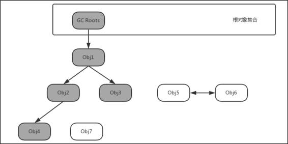

图17-1根搜索算法

从图17-1可以看出，Obj4是可达的对象，表示它正被引用，因此不会标记为可回收的对象。Obj5、Obj6和Obj7都是不可达的对象，其中Obj5和Obj6虽然互相引用，但是因为它们到GCRoots是不可达的，所以它们仍旧被标记为可回收的对象。

内存泄漏就是指没有用的对象到GCRoots是可达的（对象被引用），导致GC无法回收该对象。此时，如果Obj4是一个没有用的对象，但它仍与GCRoots是可达的，那么Obj4就会发生内存泄漏。内存泄漏产生的原因，主要分为三大类：

- 由开发人员自己编码造成的泄漏。
- 第三方框架造成的泄漏。
- 由Android系统或者第三方ROM造成的泄漏。

在通常情况下，第二种和第三种情况对于Android应用开发者来说是不可控的，但是第一种情况是可控的，既然是可控的，我们就要尽量在编码时避免造成内存泄漏，接下来列举出常见的内存泄漏的场景。

### 17.1.2内存泄漏的场景

#### 1.非静态内部类的静态实例

非静态内部类会持有外部类实例的引用，如果非静态内部类的实例是静态的，就会间接地长期维持着外部类的引用，阻止被系统回收。代码如下所示：

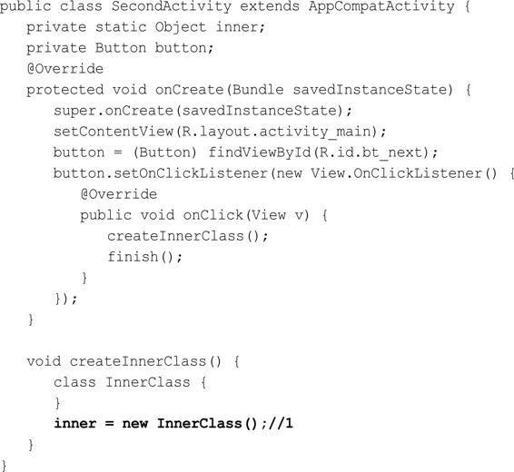

当点击Button时，会在注释1处创建非静态内部类InnerClass的静态实例inner，该实例的生命周期会和应用程序一样长，并且一直持有SecondActivity的引用，导致SecondActivity无法被回收。

#### 2.多线程相关的匿名内部类/非静态内部类

和非静态内部类一样，匿名内部类也会持有外部类实例的引用。多线程相关的类有AsyncTask类、Thread类和实现Runnable接口的类等，它们的匿名内部类/非静态内部类如果做耗时操作就可能发生内存泄漏，这里以AsyncTask的匿名内部类举例，如下所示：

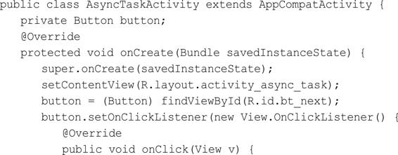

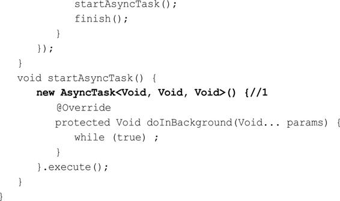

在注释1处实例化一个AsyncTask，AsyncTask的异步任务在后台执行耗时任务期间，AsyncTaskActivity被销毁了，被AsyncTask持有的AsyncTaskActivity实例不会被垃圾收集器回收，直到异步任务结束。同理，自定义的AsyncTask如果是非静态内部类也会发生内存泄漏。解决办法就是自定义一个静态的AsyncTask，如下所示：

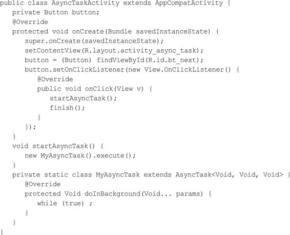

#### 3.Handler内存泄漏

Handler的Message被存储在MessageQueue中，有些Message并不能马上被处理，它们在MessageQueue中存在的时间会很长，这就会导致Handler无法被回收。如果Handler是非静态的，则Handler也会导致引用它的Activity或者Service不能被回收。

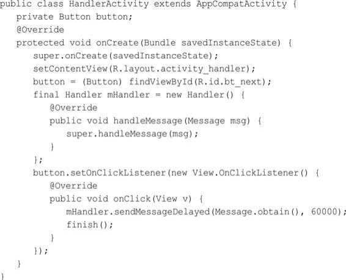

Handler是非静态的匿名内部类的实例，它会隐性引用外部类HandlerActivity。上面的例子就是当我们点击Button时，HandlerActivity会结束，但是Handler中的消息还没有被处理，因此HandlerActivity无法被回收。解决方案有两个，一个是使用一个静态的Handler内部类，Handler持有的对象要使用弱引用：

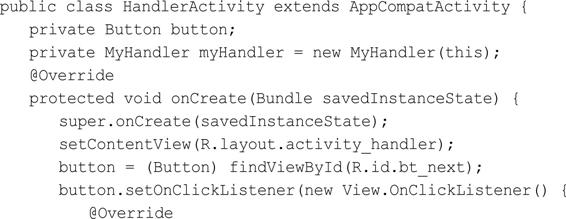

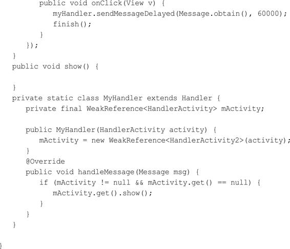

> 应该是 mActivity.get() != null 才对。

MyHandler是一个静态的内部类，它持有的HandlerActivity对象使用了弱引用，这样就避免了内存泄漏。如果觉得麻烦，也可以使用避免内存泄漏的Handler开源库WeakHandler，地址为https：//github.com/badoo/android-weak-handler。

还有一个解决方案是在Activity的Destroy方法中移除MessageQueue中的消息，如下所示：

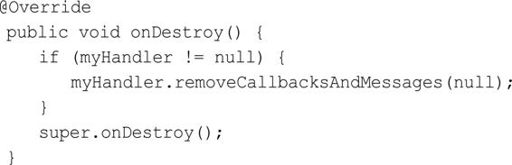

在onDestroy方法中将Callbacks和Messages全部清除掉。采用这种解决方案的话，Handler中的消息可能无法全部处理完，因此这里建议使用第一种解决方案。

#### 4.未正确使用Context

对于不是必须使用Activity的Context的情况（Dialog的Context必须使用Activity的Context），可以考虑使用ApplicationContext来代替Activity的Context，这样可以避免Activity泄漏，比如如下的单例模式：

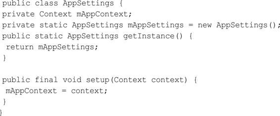

mAppSettings作为静态对象，其生命周期会长于Activity。当进行屏幕旋转时，在默认情况下，系统会销毁当前Activity。因为当前Activity调用了setup方法，并传入了ActivityContext，使得Activity被一个单例持有，导致垃圾收集器无法回收，进而产生了内存泄漏。解决方法就是使用Application的Context：

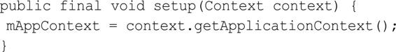

#### 5.静态View

使用静态View可以避免每次启动Activity都去读取并渲染View，但是静态View会持有Activity的引用，导致Activity无法被回收，解决的办法就是在onDestory方法中将静态View置为null，代码如下所示：

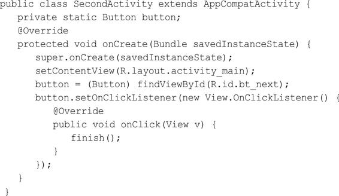

> 使用静态View有意义吗

#### 6.WebView

不同的Android版本的WebView会有差异，加上不同厂商定制ROM的WebView的差异，这就导致WebView存在着很大的兼容性问题。WebView都会存在内存泄漏的问题，在应用中只要使用一次WebView，内存就不会被释放掉。通常的解决办法就是为WebView单开一个进程，使用AIDL与应用的主进程进行通信。WebView进程可以根据业务需求，在合适的时机进行销毁。

#### 7.资源对象未关闭

资源对象比如Cursor、File等，往往都使用了缓冲，会造成内存泄漏。因此，在资源对象不使用时，一定要确保它们已经关闭并将它们的引用置为null，通常在finally语句中进行关闭，防止出现异常时，资源未被释放的问题。

#### 8.集合中对象没清理

通常把一些对象的引用加入到了集合中，当不需要该对象时，如果没有把它的引用从集合中清理掉，这个集合就会越来越大。如果这个集合是static的话，那情况就会更加严重。

#### 9.Bitmap对象

临时创建的某个相对比较大的Bitmap对象，在经过变换得到新的Bitmap对象之后，应该尽快回收原始的Bitmap，这样能够更快释放原始Bitmap所占用的空间。避免静态变量持有比较大的Bitmap对象或者其他大的数据对象，如果已经持有，要尽快置空该静态变量。

#### 10.监听器未关闭

很多系统服务（比如TelephonyMannager、SensorManager）需要register和unregister监听器，我们需要确保在合适的时候及时unregister那些监听器。自己手动添加的Listener，要记得在合适的时候及时移除这个Listener。

# 17.2MemoryMonitor

要想做好内存优化工作，要掌握两大部分的知识，一部分是理解内存优化相关的原理，另一部分就是善于运用内存分析的工具，本节就来讲解MemoryMonitor。在AndroidStudio（以下简称AS）中AndroidMonitor是一个主窗口，它包含了Logcat、MemoryMonitor、CPUMonitor、GPUMonitor和NetworkMonitor。其中MemoryMonitor可以监视应用程序的性能和内存使用情况，以便于找到被分配的对象，定位内存泄漏，并跟踪连接设备中正在使用的内存数量。MemoryMonitor可以报告出你的应用程序的内存分配情况，更形象地呈现出应用程序使用的内存。它的作用如下：

- 实时显示可用的和分配的Java内存的图表。
- 实时显示垃圾收集（GC）事件。
- 启动垃圾收集事件。
- 快速测试应用程序的缓慢是否与过度的垃圾收集事件有关。
- 快速测试应用程序崩溃是否与内存耗尽有关。

## 17.2.1使用MemoryMonitor

在使用MemoryMonitor之前要确保手机开启了开发者模式和USB调试，使用的步骤如下：（1）运行需要监控的应用程序。

（2）单击AS面板下面的Android图标，并选择Monitors选项。如果MemoryMonitor已经运行，效果如图17-2所示。

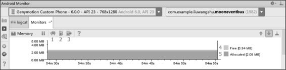

图17-2MemoryMonitor图中的标注的功能如下。

- InitiateGC（标识1）：用来手动触发GC。
- Dump Java heap（标识2）：保存内存快照。
- Start/StopAllocationTracking（标识3）：打开AllocationTracker工具（17.3节会介绍）。
- Free（标识4）：当前应用未分配的内存大小。
- Allocated（标识5）：当前应用分配的内存大小。

图17-2中Y轴显示当前应用的分配的内存和未分配的内存大小；X轴表示经过的时间。

## 17.2.2大内存申请与GC

从图17-3可以看出，分配的内存急剧上升，这就是大内存分配的场景，我们要判断这是否是合理的分配的内存，是Bitmap还是其他的大数据，并且对这种大数据进行优化，减少内存开销。接下来分配的内存出现急剧下降，这表示垃圾收集事件，用来释放内存。

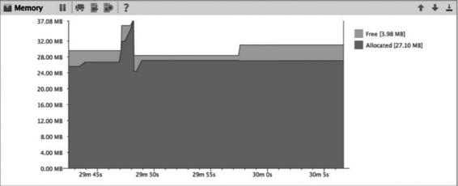

图17-3大内存申请与GC

## 17.2.3内存抖动

内存抖动一般指在很短的时间内发生了多次内存分配和释放，严重的内存抖动还会导致应用程序卡顿。内存抖动出现的原因主要是短时间频繁地创建对象（可能在循环中创建对象），内存为了应对这种情况，也会频繁地进行GC，非并行GC在进行时，其他线程都会被挂起，等待GC操作完成后恢复工作。如果是频繁的GC就会产生大量的暂停时间，这会导致界面绘制时间减少，从而使得多次绘制一帧的时长超过了16ms，产生的现象就是界面卡顿。综合起来就产生了内存抖动，产生了锯齿状的抖动图示，如图17-4所示。

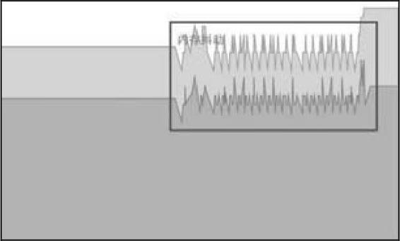

图17-4内存抖动

## 17.3Allocation Tracker

Allocation Tracker用来跟踪内存分配，它允许你在执行某些操作的同时监视在何处分配对象，了解这些分配使你能够调整与这些操作相关的方法调用，以优化应用程序性能和内存使用。AllocationTracker能够做到如下的事情：

- 显示代码分配对象类型、大小、分配线程、堆栈跟踪的时间和位置。
- 通过重复的分配/释放模式帮助识别内存变化。
- 当与HPROFViewer结合使用时，可以帮助你跟踪内存泄漏。例如，如果你在堆上看到一个Bitmap对象，你可以使用Allocation Tracker来找到其分配的位置。

### 17.3.1使用AllocationTracker

AS和DDMS中都有AllocationTracker，这里只介绍AS中的AllocationTracker如何使用。首先要确保要确保手机开启了开发者模式，并且开启了USB调试。使用的步骤如下：

（1）运行需要监控的应用程序。

（2）单击AS面板下面的Android图标，并选择Monitors选项。

（3）单击StartAllocationTracking按钮，这时Start AllocationTracking按钮变为了StopAllocationTracking按钮。

（4）操作应用程序。

（5）单击StopAllocationTracking按钮，结束快照。这时MemoryMonitor会显示出捕获快照的期间，如图17-5所示。

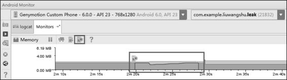

图17-5捕获快照的期间

（6）过几秒后就会自动打开一个窗口，显示当前生成的alloc文件的内存数据。

### 17.3.2alloc文件分析

自动打开的alloc文件窗口如图17-6所示。

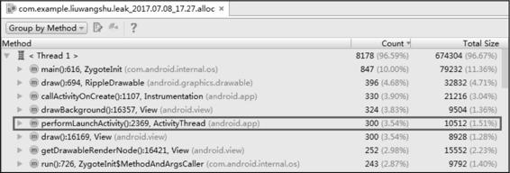

图17-6alloc文件窗口

该alloc文件窗口列出如表17-1所示的信息。

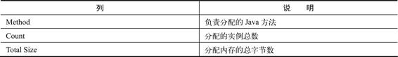

表17-1alloc文件窗口列出的信息

接着我们来分析图17-6中加方框的内容，负责分配的Java方法为performLaunchActivity，内存分配序列为2369，分配的对象为ActivityThread，分配的实例总数为300个，分配内存的总字节数为10512。

​	目前的列表选项是GroupbyMethod，我们也可以选择GroupByAllocator，如图17-7所示。

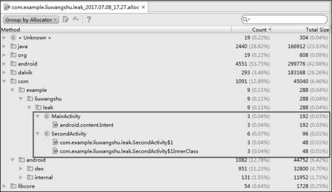

图17-7GroupByAllocator的信息

为了更好地解释图17-7中的信息，这里给出测试的代码，MainActivity和SecondActivity的代码如下所示：

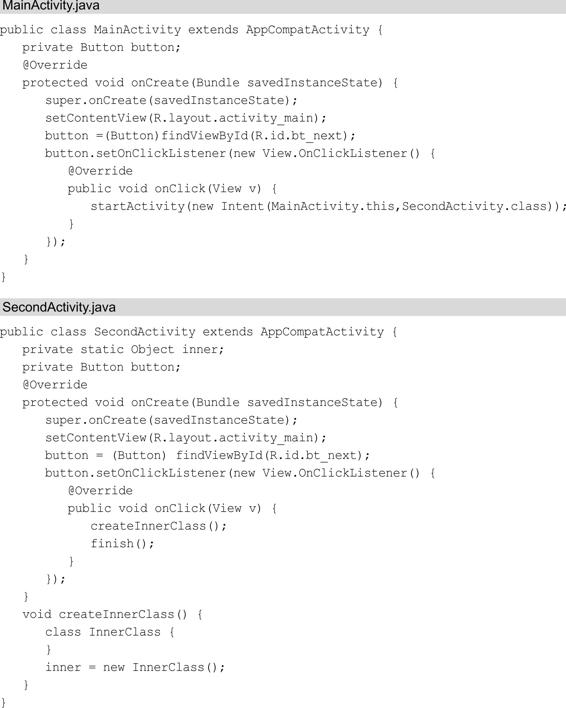

其中SecondActivity是存在内存泄漏的，生成快照期间，我的操作就是在MainActivity和SecondActivity之间跳转了3次（点击Button共6次）。这时我们回过头来看图17-7方框中的信息，MainActivity总共分配了3个Intent实例，占用内存为192字节。SecondActivity总共分配了6个实例，占用内存为96字节，其中分配了3个匿名内部类OnClickListener的实例，3个InnerClass的实例。

我们可以选择列表中的一项，单击鼠标右键，在弹出的菜单中选择jumptothesource就可以跳转到对应的源文件中。除此之外，还可以单击Show/HideChart按钮来显示数据的图形化，如图17-8所示。

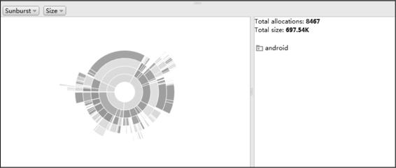

图17-8数据的图形化

# 17.4HeapDump

HeapDump的主要功能就是查看不同的数据类型在内存中的使用情况。它可以帮助你找到大对象，也可以通过数据的变化发现内存泄漏。

### 17.4.1使用HeapDump

打开Android Device Monitor工具，在左边Devices列表中选择要查看的应用程序进程，单击UpdateHeap按钮（一半是绿色的圆柱体），在右边选择Heap选项，并单击CauseGC按钮，就开始显示数据。我们每次单击CauseGC按钮都会强制应用程序进行垃圾回收，并将清理后的数据显示在Heap工具中，如图17-9所示。

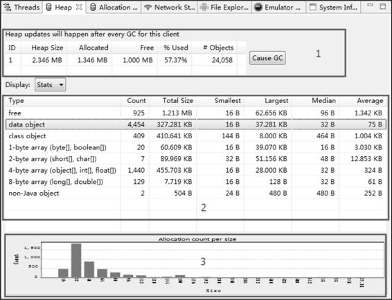

图17-9HeapDump视图HeapDump共有三个区域，分别是总览视图（标识1）、详情视图（标识2）和内存分配柱状图（标识3）。

#### 1.总览视图

其中总览视图可以查看整体的内存情况，其所列内容的说明如表17-2所示。

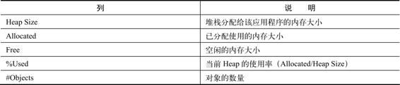

表17-2总览视图所列内容的说明

结合表17-2和图17-9，我们在总览视图中获得的信息就是：堆栈分配给当前的应用程序的内存大小为2.346MB，已分配的内存为1.346MB，空闲的内存为1MB，当前Heap的使用率为57.37%，对象的数量为24058个。

### 2.详情视图

详细视图展示了所有的数据类型的内存情况，其列的含义如表17-3所示。

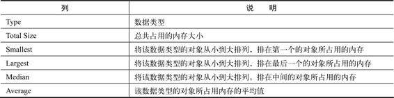

表17-3详细视图列的含义

除了列的含义，还有行的含义，如表17-4所示。

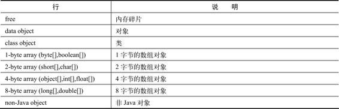

表17-4详细视图行的含义

比较重要的是free这一行的信息，它与总览视图中的free的含义不同，它代表内存碎片。当新创建一个对象时，如果碎片内存能容下该对象，则复用碎片内存，否则就会从free空间（总览视图中的free）重新划分内存给这个新对象。free是判断内存碎片化程度的一个重要的指标。此外，1-bytearray这一行的信息也很重要，因为图片是以byte[]的形式存储在内存中的，如果1-bytearray一行的数据过大，则需要检查图片的内存管理了。

#### 17.4.2检测内存泄漏

HeapDump也可以检测内存泄漏。在左边Devices列表中选择要查看的应用程序进程，单击UpdateHeap按钮（一半是绿色的圆柱体），在右边选择Heap选项，并单击CauseGC按钮，就开始显示数据，如图17-10所示。

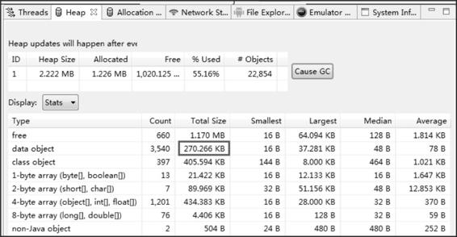

图17-10检测内存泄漏

这时dataobject的TotalSize为270.266KB。接下来操作应用，这个应用仍旧是在17.3.2节所举的内存泄漏的例子，反复地在MainActivity和SecondActivity之间跳转了10次（单击Button共20次），数据显示如图17-11所示。

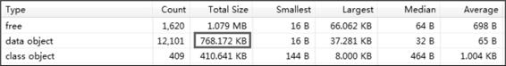

图17-11单击Button共20次的数据

dataobject的TotalSize变为了768.172KB。这时单击CauseGC按钮，数据显示如图17-12所示。

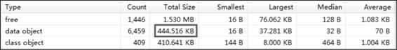

图17-12单击CauseGC按钮的数据可以看到dataobject的TotalSize变为了444.516KB，再单击一次CauseGC按钮，数据显示如图17-13所示。

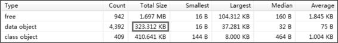

图17-13再次单击CauseGC按钮的数据

TotalSize变为了323.312KB，经过两次CauseGC的操作，TotalSize的值从768.172KB变为了323.312KB，这是一个比较大的变化，说明在CauseGC操作之前有462.86KB（768.172KB-323.312KB）的内存没有被回收，可能发生了内存泄漏。

# 17.5内存分析工具MAT

在进行内存分析时，我们可以使用MemoryMonitor和HeapDump观察内存的使用情况，使用Allocation Tracker跟踪内存分配的情况，也可以通过这些工具来找到疑似发生内存泄漏的位置。但是如果想要深入地进行分析并确定内存泄漏，就要分析疑似发生内存泄漏时所生成的堆存储文件。堆存储文件可以使用DDMS或者MemoryMonitor来生成，输出的文件格式为hprof，而MAT就是分析堆存储文件的。MAT全称为Memory Analysis Tool，是对内存进行详细分析的工具，它是Eclipse的插件，如果用AndroidStudio进行开发则需要单独下载它，下载地址为http://eclipse.org/mat，这里讲解的MAT的版本为1.6.1。

## 17.5.1生成hprof文件

MAT用来分析hprof文件，首先我们要学习如何生成hprof文件，主要有两种方式，分别是DDMS生成hprof文件和MemoryMonitor生成hprof文件。

### 1.准备内存泄漏的代码

我们需要准备一段发生内存泄漏的代码，如下所示：

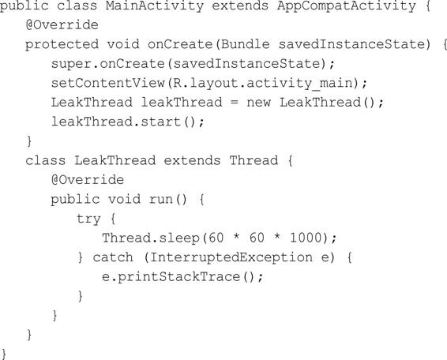

上面的代码是很典型的内存泄漏的例子，原因就是非静态内部类LeakThread持有外部类MainActivity的引用，LeakThread中做了耗时操作，导致MainActivity无法被释放。

### 2.DDMS生成hprof文件

生成hprof文件主要分为以下几个步骤：

（1）在AndroidStudio中打开DDMS，运行程序。

（2）在Devices中选择要分析的应用程序进程，单击UpdateHeap按钮（一半是绿色的圆柱体）开始进行追踪。

（3）进行可能发生内存问题的操作（本文的例子就是不断地切换横竖屏）。

（4）单击DumpHPROPFile按钮结束追踪，生成并保存hprof文件，如图17-14所示。

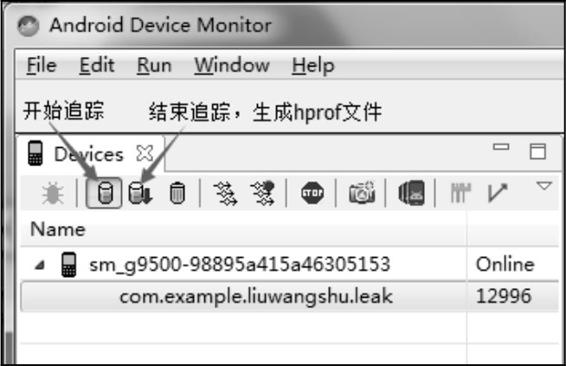

图17-14DDMS生成hprof文件DDMS生成的hprof文件并不是标准的，还需要将它转换为标准的hprof文件，这样才会被MAT识别从而进行分析，可以使用SDK自带的hprof-conv进行转换，它的路径在sdk/platform-tools中，进入到该路径执行以下语句即可：

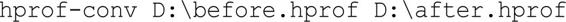

其中D：\before.hprof是要转换的hprof文件路径，D：\after.hprof则是转换后hprof文件的保存路径。

### 3.MemoryMonitor生成hprof文件

除了用DDMS来生成hprof文件外，还可以用AS的MemoryMonitor来生成hprof文件。生成hprof文件主要分为以下几个步骤：

（1）在AndroidMonitor中选择要分析的应用程序进程。

（2）进行可能发生内存问题的操作（本文的例子就是不断地切换横竖屏）。

（3）单击DumpJavaHeap按钮，生成hprof文件，如图17-15所示。

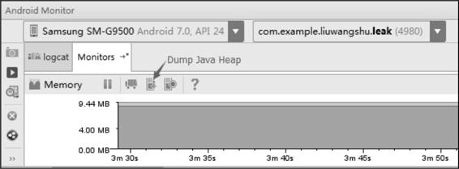

图17-15MemoryMonitor生成hprof文件

MemoryMonitor生成的hprof文件也不是标准的，AS提供了便捷的转换方式：MemoryMonitor生成的hprof文件都会显示在AS左侧的Captures标签中，在Captures标签中选择要转换的hprof文件，并单击鼠标右键，在弹出的菜单中选择Exporttostandard.hprof选项，即可导出标准的hprof文件，如图17-16所示。

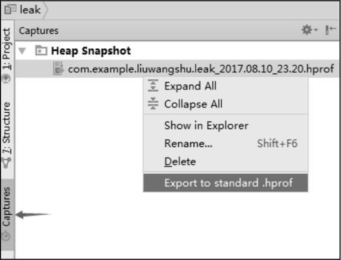

图17-16导出标准的hprof文件

## 17.5.2MAT分析hprof文件

用MAT打开标准的hprof文件，选择Leak Suspects Report选项，这时MAT就会生成报告，这个报告分为两个标签页，一个是Overview，另一个是Leak Suspects（内存泄漏猜想），如图17-17所示。

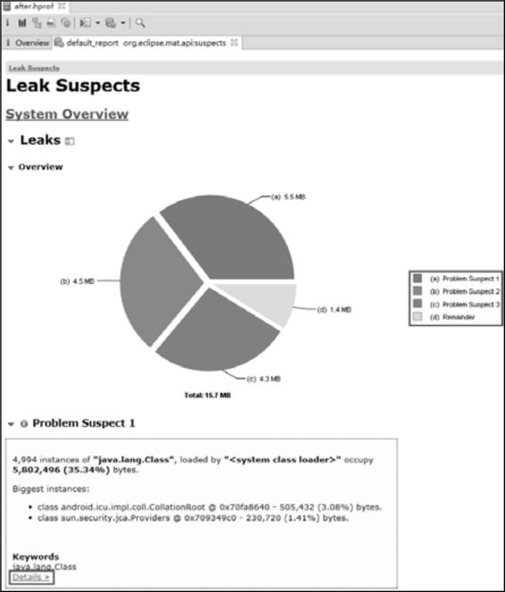

图17-17生成报告图

​	在LeakSuspects中给出了MAT认为可能出现内存泄漏问题的地方，图17-17共给出了3个内存泄漏猜想，通过单击每个内存泄漏猜想的Details可以看到更深入的分析清理情况。如果内存泄漏不是特别明显，通过Leak Suspects很难发现内存泄漏的位置。

​	打开Overview标签页，首先看到的是一个饼状图，它主要用来显示内存的消耗，饼状图的彩色区域代表被分配的内存，灰色区域则是空闲内存，单击每个彩色区域可以看到这块区域的详细信息，如图17-18所示。

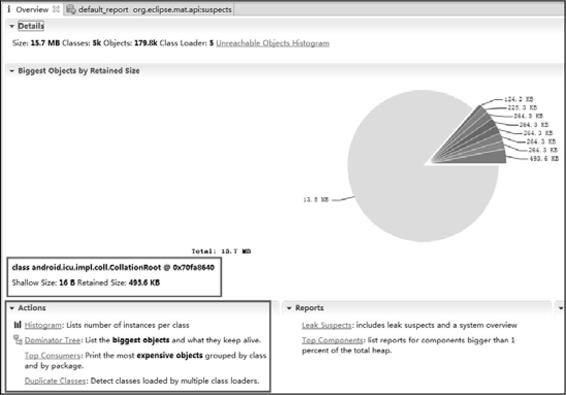

17-18Overview标签页

再往下看，Actions一栏的下面列出了MAT提供的4种Action，其中分析内存泄漏最常用的就是Histogram和Dominator Tree。我们单击Actions中给出的链接或者在MAT工具栏中单击相应的选项就可以打开Dominator Tree和Histogram，MAT工具栏如图17-19所示。其中左边第二个选项是Histogram，第三个选项是Dominator Tree，第四个选项是OQL，下面分别对它们进行介绍。


图17-19MAT工具栏

### 17.5.2.1Dominator Tree

DominatorTree意思为支配树，从名称就可以看出DominatorTree更善于去分析对象的引用关系，如图17-20所示。

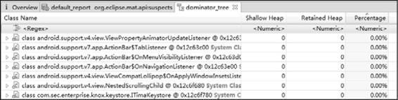

图17.20DominatorTree

- Shallow Heap：对象自身占用的内存大小，不包括它引用的对象。如果是数组类型的对象，它的大小由数组元素的类型和数组长度决定。如果是非数组类型的对象，它的大小由其成员变量的数量和类型决定。
- Retained Heap：一个对象的Retained Set包含对象所占内存的总大小。换句话说，RetainedHeap就是当前对象被GC后，从Heap上总共能释放掉的内存。

Retained Set指的是这个对象本身和它持有引用的对象以及这些引用对象的RetainedSet所占内存大小的总和，引用树官方的图解如图17-21所示。

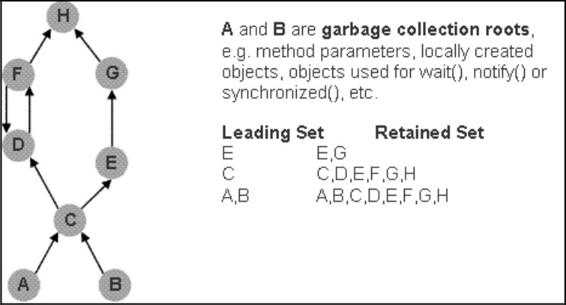

图17-21引用树官方的图解

从图17-20中可以看出E的Retained Set为E和G。C的RetainedSet为C、D、E、F、G、H。MAT所定义的支配树就是从图17-21所示的引用树演化而来。在引用树当中，如果一条到Y的路径必然会经过X，称为X支配Y。X直接支配Y则指的是在所有支配Y的对象中，X是Y最近的一个对象。支配树反映的就是这种直接支配关系，在支配树中，父节点直接支配子节点。如图17-22所示就是官方提供的一个从引用树到支配树的转换示意图。

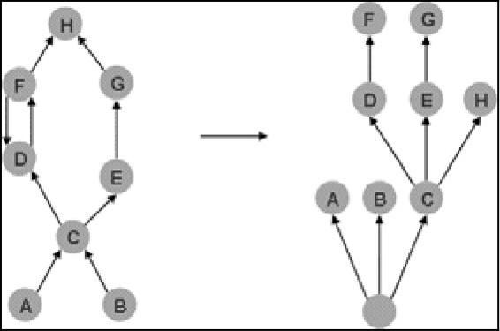

图17-22引用树到支配树的转换示意图

C直接支配D、E，因此C是D、E的父节点，这一点根据上面的阐述很容易得出结论。C直接支配H，这可能会有些疑问，能到达H主要有两条路径，而这两条路径FD和GE都不是必须要经过的节点，只有C满足了这一点，因此C直接支配H，C就是H的父节点。通过支配树，我们就可以很容易地分析一个对象的RetainedSet，比如E被回收，则会释放E、G的内存，而不会释放H的内存，因为F可能还引用着H，只有C被回收，H的内存才会被释放。这里对支配树进行了讲解，我们可以得出一个结论：通过MAT提供的Dominator Tree，可以很清晰地得到一个对象的直接支配对象，如果直接支配对象中出现了不该有的对象，就说明发生了内存泄漏。在DominatorTree的顶部Regex可以输入过滤条件（支持正则表达式），如果是查找Activity内存泄漏，可以在Regex中输入Activity的名称，比如这个例子可以输入MainActivity，Dominator Tree的信息如图17-23所示。

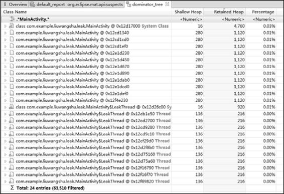

图17-23Dominator Tree的信息

在Dominator Tree中列出了很多MainActivity实例，MainActivity是不该有这么多实例的，基本可以断定发生了内存泄漏，具体内存泄漏的原因，可以查看GC引用链。在MainActivity选项上单击鼠标右键，在弹出的菜单中选择Path To GCRoots选项，如图17-24所示。

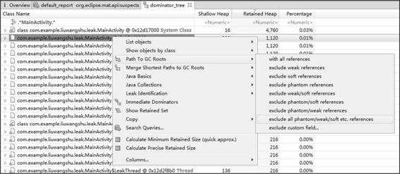

图17-24选择Path To GCRoots选项

Path To GCRoots选项用来表示从对象到GCRoots的路径，根据引用类型会有多种选项，比如withallreferences就是包含所有的引用，这里我们选择excludeallphantom/weak/softetc.references，因为这个选项排除了虚引用、弱引用和软引用，这些引用一般是可以被回收的，这时MAT就会给出MainActivity的GC引用链，如图17-25所示。

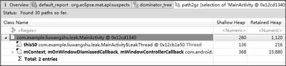

图17-25MainActivity的GC引用链

引用MainActivity的是LeakThread，this$0的含义就是内部类自动保留的一个指向所在外部类的引用，而这个外部类就是MainActivity，这将会导致MainActivity无法被GC。

### 17.5.2.2Histogram

Histogram与DominatorTree不同的是，DominatorTree是从对象实例的角度进行分析，注重引用关系分析，而Histogram则从类的角度进行分析，注重量的分析。Histogram中的内容如图17-26所示。

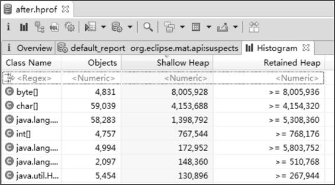

图17-26Histogram中的内容在Histogram中共包含4列数据，关于ShallowHeap和RatainedHeap的含义在17.5.2.1节已经介绍过了，剩余的ClassName代表类名，Objects代表对象实例的个数。在Histogram的顶部Regex同样可以输入过滤条件，这里同样输入MainActivity，效果如图17-27所示。

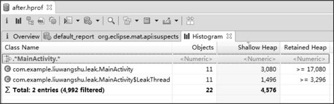

图17-27顶部Regex输入MainActivity

MainActivity和LeakThread实例各为11个，基本上可以断定发生了内存泄漏。具体内存泄漏的原因，同样可以查看GC引用链。在MainActivity选项上单击鼠标右键，在弹出的菜单中选择MergeShortestPathstoGCroots，并在选项中选择excludeallphantom/weak/softetc.references，PathToGCRoots的信息如图17-28所示。

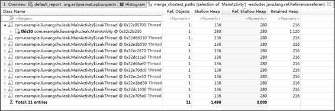

图17-28PathToGCRoots的信息

Histogram是从类的角度进行分析，而PathToGCRoots是用来分析单个对象的，因此在Histogram中无法使用PathToGCRoots查询，可以使用MergeShortestPathstoGCroots查询，它表示从GCroots到一个或一组对象的公共路径。得出的结果和17.5.2.1节是相同的，引用MainActivity的是LeakThread，这导致了MainActivity无法被GC。

## 17.5.2.3OQL

OQL全称为ObjectQueryLanguage，类似于SQL语句的查询语言，能够用来查询当前内存中满足指定条件的所有对象。它的查询语句的基本格式如下：

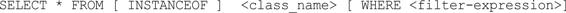

当输入select*frominstanceofandroid.app.Activity并按下F5键时（或者单击工具栏中的红色叹号），将当前内存中所有Activity都显示出来，如图17-29所示。

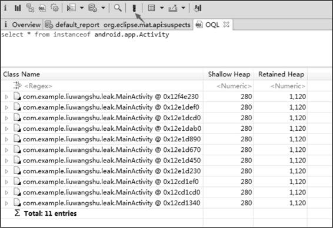

图17-29OQL查询

如果Activity比较多，或者你想查找具体的类，可以直接输入具体类的完整名称：


通过查看GC引用链也可以找到内存泄漏的原因。关于OQL语句有很多用法，这里就不过多介绍了，具体可以查看官方文档：http：//help.eclipse.org/luna/index.jsp？topic=/org.eclipse.mat.ui.help/reference/oqlsyntax.html。

## 17.5.2.4对比hprof文件

因为这一节的例子很简单，可以通过上面的方法可以找到内存泄漏的原因，但是复杂的情况就需要通过对比hprof文件来进行分析了。使用步骤如下：

（1）操作应用，生成第一个hprof文件。

（2）进行一段时间操作，再生成第二个hprof文件。

（3）用MAT打开这两个hprof文件。

（4）将第一个和第二个hprof文件的DominatorTree或者Histogram添加到CompareBasket中，如图17-30所示。

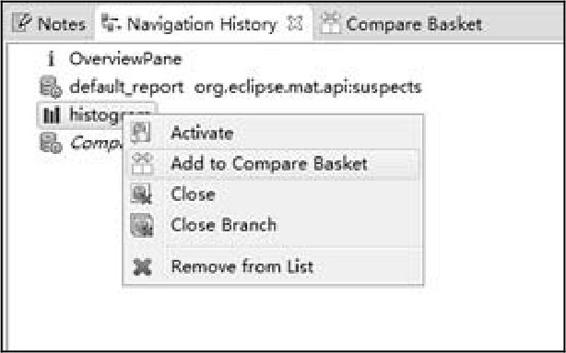

图17-30添加到CompareBasket的操作

（5）在CompareBasket中单击红色叹号按钮生成ComparedTables，ComparedTables如图17-31所示。图17-31ComparedTables

（6）在ComparedTables也有顶部Regex，输入MainActivity进行筛选，如图17-32所示。

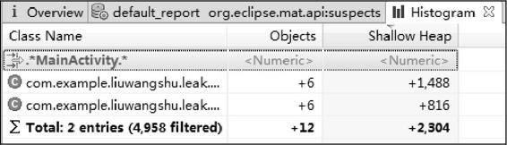

图17-32在Regex中筛选

MainActivity在这一过程中增加了6个，MainActivity的实例是不应该增加的，这说明发生了内存泄漏，可以通过查看GC引用链来找到内存泄漏的具体原因。除了上面的对比方法，Histogram还可以通过工具栏的对比按钮来进行对比，对比按钮见图17-33中的箭头指向。

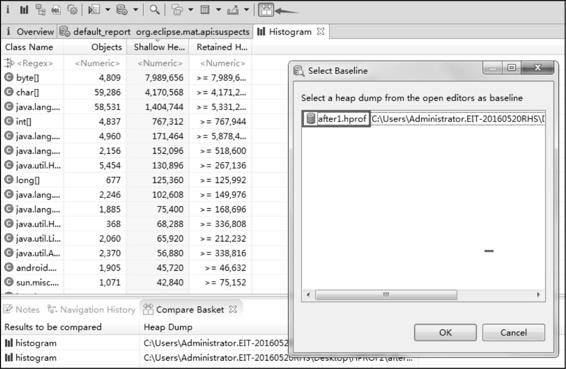

图17-33对比按钮

（7）生成的结果和ComparedTables类似，我们输入MainActivity进行筛选，如图17-34所示。


图17-34输入MainActivity进行筛选

可以看到第二个hprof文件比第一个hprof文件多了6个MainActivity实例。

MAT还有很多功能，这里也只介绍了常用的功能，其他的功能就需要读者在使用过程中去发现并积累。

# 17.6LeakCanary

如果使用MAT来分析内存问题，会有一些难度，并且效率也不是很高，对于一个内存泄漏问题，可能要进行多次排查和对比。为了能够迅速地发现内存泄漏，Square公司基于MAT开源了LeakCanary，地址为https：//github.com/square/leakcanary。

## 17.6.1使用LeakCanary

首先配置build.gradle：


接下来在Application中加入如下代码：


注释1处的代码用来进行过滤操作，如果当前的进程是用来给LeakCanary进行堆分析的则返回，否则会执行LeakCanary的install方法。这样我们就可以使用LeakCanary了，如果检测到某个Activity有内存泄漏，LeakCanary就会给出提示。

## 17.6.2LeakCanary应用举例

17.6.1节的例子代码只能够检测Activity的内存泄漏，如果还需要检测其他类的内存泄漏，我们就需要使用RefWatcher来进行监控。改写Application，如下所示：


install方法会返回RefWatcher用来监控对象，LeakApplication中还要提供getRefWatcher静态方法来返回全局RefWatcher。最后为了举例，我们在一段存在内存泄漏的代码中引入LeakCanary监控，如下所示：


MainActivity存在内存泄漏，原因就是非静态内部类LeakThread持有外部类MainActivity的引用，在LeakThread中做了耗时操作，导致MainActivity无法被释放。在注释1处得到RefWatcher，并调用它的watch方法，watch方法的参数就是要监控的对象。当然，在这个例子中onDestroy方法是多余的，因为LeakCanary在调用install方法时会启动一个ActivityRefWatcher类，它用于自动监控Activity执行onDestroy方法之后是否发生内存泄漏。这里只是为了方便举例，如果想要监控Fragment，在Fragment中添加如上的onDestroy方法是有用的。运行程序，这时会在界面上生成一个名为Leaks的应用图标。接下来不断地切换横竖屏，这时会闪出一个提示框，提示内容为“Dumpingmemoryappwillfreeze.Brrrr.”。再稍等片刻，内存泄漏信息就会通过Notification展示出来，比如三星S8的通知栏如图17-35所示。


图17-35三星S8的通知栏

在Notification中提示MainActivity发生了内存泄漏，泄漏的内存为787B。点击Notification就可以进入内存泄漏详情页，除此之外也可以通过Leaks应用的列表界面进入。内存泄漏详情页如图17-36所示。


图17-36内存泄漏详细页

点击加号就可以查看具体类所在的包名称。整个详情就是一个引用链：MainActiviy的内部类LeakThread引用了LeakThread的this$0，this$0的含义就是内部类自动保留的一个指向所在外部类的引用，而这个外部类就是详情页最后一行所给出的MainActiviy的实例，这将导致MainActivity无法被GC，从而产生内存泄漏。

除此之外，我们还可以将heapdump（hprof文件）和info信息分享出去，如图17-37所示。


图17-37在内存泄漏详细页中分享信息需要注意的是分享出去的hprof文件并不是标准的hprof文件，还需要将它转换为标准的hprof文件，这样才会被MAT识别从而进行分析。最后说一下解决方法就是将LeakThread改为静态内部类，代码如下所示：


再次运行程序LeakThread就不会给出内存泄漏的提示了。

# 小结

本章的知识点稍微有点多，首先介绍了在应用开发中如何避免可控的内存泄漏，接下来介绍了常用的内存分析工具：MemoryMonitor、AllocationTracker和HeapDump，这些工具可以对内存进行分析，找到疑似发生内存泄漏的位置，如果想要深入地对内存进行分析并确定内存泄漏还需要学习MAT的使用方法，当然MAT的使用会有一些难度，并且效率也不是很高，因此最后介绍了LeakCanary的使用方法。这些工具的使用都是基本的入门方法，想要进阶的话还需要读者在项目中更多地进行实践。


# 参考

[【万字总结】Android内存优化知识盘点](https://juejin.cn/post/7359896145986289699)

[Android性能优化：手把手带你全面实现内存优化](https://www.jianshu.com/p/9745a9375191)

《Android进阶解密》
