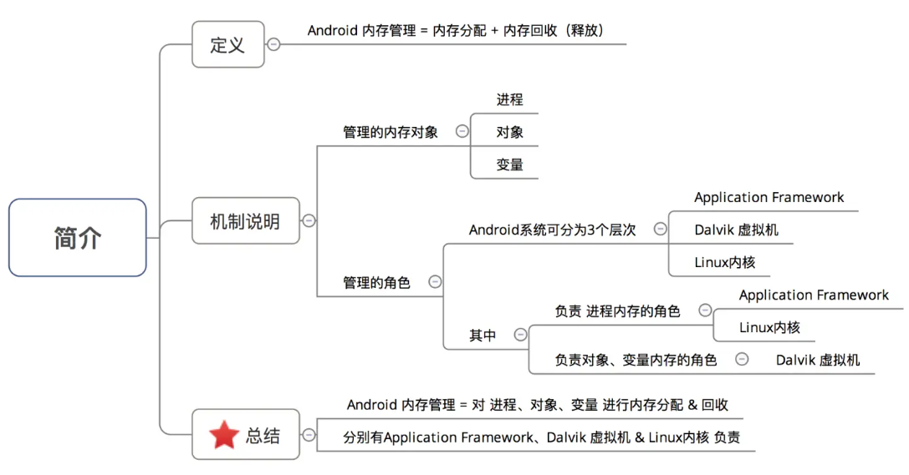
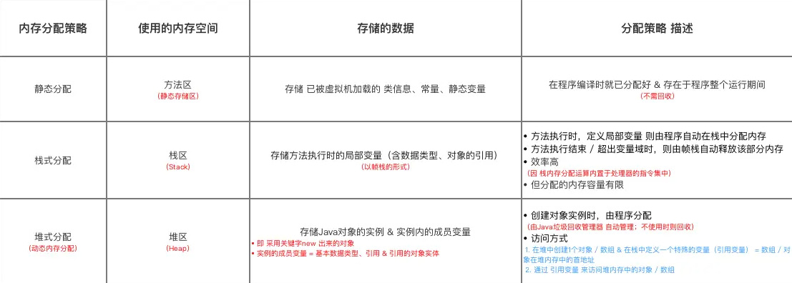
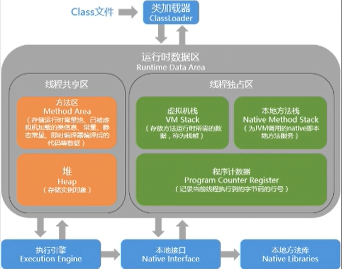
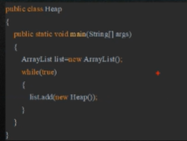
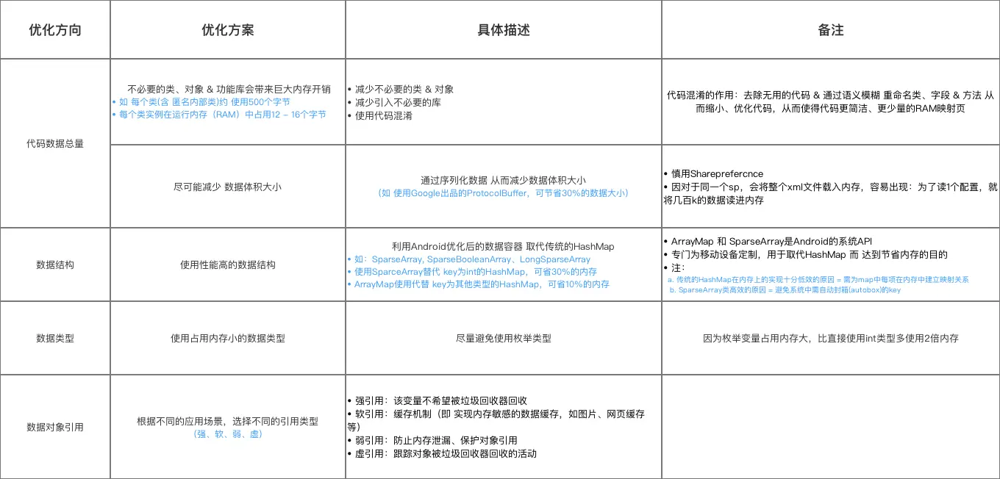
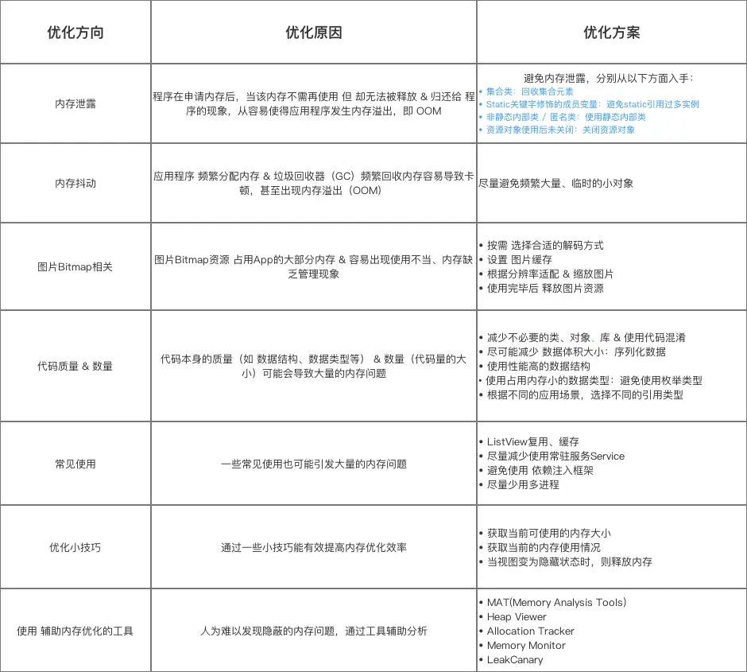

# 内存优化的意义

> Android性能优化三把板斧：稳定性、内存、启动速度、包体积。这几个方向的知识其实是相互关联的网状结构，例如内存控制得好，就不容易出现OOM导致的稳定性问题。同样，经过精简的包体积，也会大大提升应用启动速度。


相比于C/C++，JVM很大的一个跨越是实现了内存的自动分配与回收。然而，这并不意味着作为开发者可以肆无忌惮地使用内存，作为一种有限的资源，内存再大也有耗尽的时候。我们讲“内存优化”，主要是出于稳定性、流畅度、进程存活率三个维度的考虑。

1. **稳定性**：减少OOM，提高应用稳定性
2. **流畅度**：减少卡顿，提高应用流畅度
3. **进程存活率**：减少内存占用，提高应用后台运行时的存活率

# 内存理论知识

这一部分讲解内存优化相关的理论知识，为实践环节提供理论支持。首先从`虚拟机配置`角度说明Android系统里应用可用的内存上限；然后分析在这个上限之内，应用程序内存主要分配为`哪几个部分`；最后讲解开发中关系最紧密的 `对象内存分配与回收`。

## 应用可用内存：dalvik.vm配置

对于应用程序而言，它能够使用的最大内存是在虚拟机配置里写死的，可以通过命令`adb shell get prop dalvik.vm.heapgrowthlimit`来查看，在我的手机（vivoXNote）上是`256m`。

```bash
>adb shell get prop dalvik.vm.heapgrowthlimit
256m
```

此外虚拟机配置中还有 `heapstartsize`、`heapsize` 等参数，它们都是定义在 `/system/build.prop` 文件当中的，含义说明如下：

| 参数                | 含义                                                         | vivoXNote |
| ------------------- | ------------------------------------------------------------ | --------- |
| **heapstartsize**   | 堆分配的初始大小，影响操作系统对RAM的分配和首次使用应用的流畅性 | 8m        |
| **heapgrowthlimit** | 单个应用可用的最大内存，若超出则OOM                          | 256m      |
| **heapsize**        | 单个进程可以用最大内存，仅当声明android:largeHeap=true时生效，此时会覆盖heapgrowthlimit的值 | 512m      |

## Native虚拟内存

`Android8.0`以后，Bitmap不再存放于Java堆内存，而是位于Native的堆内存，它的上限也就是Native虚拟内存的上限，只与CPU架构相关。Native堆内存不受JVM管控。

| CPU架构  | Native堆上限         |
| -------- | -------------------- |
| **32位** | 3G(4G减去1G内核空间) |
| **64位** | 128T                 |


## 进程内存指标：USS,PSS,RSS,VSS

`dumpsys meminfo` 可以看到整个系统中不同进程所占据的内存情况，最重要的有以下4个缩写指标，它们之间的关系是：`VSS>=RSS>=PSS>=USS`。在Android系统中推荐使用PSS曲线来衡量应用的物理内存占用情况。

| 内存指标 | 英文全称            | 含义     | 等价                       |
| -------- | ------------------- | -------- | -------------------------- |
| **USS**  | UniqueSetSize       | 物理内存 | 进程独占的内存             |
| **PSS**  | ProportionalSetSize | 物理内存 | PSS=USS+按比例包含共享库   |
| **RSS**  | ResidentSetSize     | 物理内存 | RSS=USS+包含共享库         |
| **VSS**  | VirtualSetSize      | 虚拟内存 | VSS=RSS+未分配实际物理内存 |

可以通过`dumpsys`命令查看以上内存信息。

```bash
dumpsys meminfo<pid>//指定pid
dumpsys meminfo --package<packagename>//指定包名，可能存在多个进程
dumpsys meminfo//系统中所有进程的内存占用，有排序
```

按照范围从大到小，Android系统管理内存可以分为`进程、对象、变量`三个层级。

## 储备知识：Android 内存管理机制




下面，将针对回收 进程、对象 、变量的内存分配 & 回收进行详细讲解

## 针对进程的内存策略

进程的内存分配和回收受到Linux内核的管控，Android将进程分为`5`个优先级，当进程空间紧张时，按照优先级从低到高的顺序进行回收。

### a. 内存分配策略

由 `ActivityManagerService` 集中管理 所有进程的内存分配

### b. 内存回收策略

- 步骤1：`Application Framework`  决定回收的进程类型
  **Android中的进程 是托管的；当进程空间紧张时，会 按进程优先级低->>高的顺序 自动回收进程**

Android将进程分为5个优先等级，具体如下：


- 步骤2：Linux  内核真正回收具体进程

  1. `ActivityManagerService` 对 所有进程进行评分（评分存放在变量`adj`中）
  2. 更新评分到`Linux` 内核
  3. 由`Linux` 内核完成真正的内存回收

> 此处仅总结流程，这其中的过程复杂，具体实现在系统源码`ActivityManagerService.java`

## 针对对象、变量的内存策略

内存管理 = 对象 / 变量的内存分配 + 内存释放

### a. 内存分配策略


- 对象 / 变量的内存分配 **由程序自动 负责**，即受到JVM虚拟机的管控

- 共有3种：静态分配、栈式分配、堆式分配，分别面向静态变量、局部变量  & 对象实例

  

注：用1个实例讲解 内存分配

```cpp
public class Sample {    
    int s1 = 0;
    Sample mSample1 = new Sample();   
    
    // 方法中的局部变量s2、mSample2存放在 栈内存，作为method方法的局部变量。
    // 变量mSample2所指向的对象实例存放在 堆内存
    // 成员变量s1和mSample1（以及它们所指向的对象，如果有的话）都存放在堆内存中，作为Sample类实例的一部分。
    public void method() {        
        int s2 = 0;
        Sample mSample2 = new Sample();
    }
}
```

### b. 内存释放策略

- 对象 / 变量的内存释放 由`Java`垃圾回收器（`GC`） / 帧栈 负责
- 对象分配（即堆式分配）的内存释放策略 = `Java`垃圾回收器（`GC`）
- 静态分配不需释放、栈式分配 通过帧栈自动出、入栈

## Java对象生命周期

从`ClassLoader`装载`.class`文件开始，一个Java对象的生命周期包含以下阶段：


# 内存问题归类

理解了JVM内存的分配与回收原理，我们看一下在Android开发中，发生内存问题的三个表现，它们分别是`内存抖动`、`内存泄漏`与`内存溢出`。其中内存抖动与泄漏是引发内存溢出的重要因素。

## 内存抖动

### 什么是内存抖动

**在一段时间内，频繁地创建大量临时的对象，导致程序频繁地分配和释放内存（GC）**，内存会不断浮动，在曲线图上展现为`锯齿状`的内存使用曲线。


### 内存抖动的原因

在频繁调用的方法中生成大量对象。

1. 选择了不恰当的数据类型：如使用加号`+`进行字符串拼接，正确的做法是用`StringBuilder`
2. 在循环里面创建对象：则循环执行时会频繁地创建销毁
3. 在`onDraw`中创建对象：一次绘制会多次调用`onDraw`

### 如何避免内存抖动

1. 选择恰当的数据类型（`String`->`StringBuilder`）
2. 在循环体、`onDraw`函数外创建对象并复用，减少不合理、不必要的对象创建
3. 使用对象池进行缓存复用

## 内存泄漏

见：内存泄漏.md

## 内存溢出

指程序在申请内存时，没有足够的内存空间供其使用，出现out of memory。Android系统为每个应用程序申请到的内存有限，一般为64M或者128M等，我们可以在清单文件中进行配置，android:largeheap = "true" 从而给APP申请更大的内存空间。



虚拟机：JVM的作用是把平台无关的.class里面的字节码翻译成平台相关的机器码，来实现跨平台。Dalvik和Art时安卓中使用的虚拟机。
注：本地方法栈，属于native层，暂不需要管，它和Java层是不一样的垃圾回收机制。

内存溢出会发生在堆内存和虚拟机栈：

1. 堆内存溢出

   例1：

   

   例2：如生产者与消费者模型，如注册回调，忘记注销。添加到队列，忘记控制队列大小。

2. 栈（虚拟栈）内存溢出：方法递归。

OOM会发生在方法区、堆内存和虚拟机栈。

（1）内存溢出原因：
①内存中加载的数据量过于庞大，如一次从数据库取出过多数据；
②集合类中有对对象的引用，使用完后未清空，使得JVM不能回收；
③代码中存在死循环或循环产生过多重复的对象实体
（2）内存溢出的解决方案：
解决内存泄漏问题。

当应用在为新的数据结构申请内存时，如果当前可用内存不足以提供给新对象，就会发生内存溢出（OOM，即OutofMemory）。我们面临的大部分都是Java堆内存超限问题。


当发生OOM时，**并不一定是当前执行的代码发生了问题**，有可能是由于之前的不正确调用，当前已经处于一个内存异常的状态，在申请开辟新内存时导致问题爆发。

# 常见的内存问题&优化方案

常见的内存问题如下
1. 内存泄露
2. 内存抖动
3. 图片`Bitmap`相关。见：BItmap优化
4. 代码质量&数量
5. 日常不正确使用

## 代码质量&数量

- 优化原因
  代码本身的质量（如数据结构、数据类型等）&数量（代码量的大小）可能会导致大量的内存问题，如占用内存大、内存利用率低等

- 优化方案
  主要从代码总量、数据结构、数据类型、&数据对象引用方面优化，具体如下

  


## 1.精简代码

在JVM中类的数据结构位于方法区，伴随应用的整个生命周期都不会销毁，因此应当尽量精简类的结构。

- **减少不用的类**，以及类中的成员变量
- **减少不必要的三方依赖包**
- **开启应用混淆**，精简类名方法名变量名，自动清理无用的类

## 2.内存复用

通过复用，减少频繁创建销毁对象的行为，防止产生大量离散的内存碎片。

- **资源复用**：归拢通用的字符串、颜色、度量值等，进行基础布局的复用
- **视图复用**：借助ViewHolder减少视图布局开销
- **对象复用**：建立对象池，实现复用逻辑

## 3.选用性能更高的数据结构

### 3.1慎用SharedPreferences

读取SP时会将整个xml加载到内存里，占据几十K、上百K的内存。

### 3.2使用SparseArray、ArrayMap代替原生的HashMap

`HashMap`最初是为JVM设计的，为了减少哈希冲突，选用了一个较大的数组作为容器来降低冲突，这是一种空间换时间的思路。在Android中提供了不同的替换结构。

- `Key`是`Int`时，选用`SparseArray`
- `Key`是其他类型时，选用`ArrayMap`

它们的思路是时间换空间，内部是两个数组，节约了`HashMap`中空置的元素位。从性能角度看，当元素数量在`1000`以下时，性能几乎与`HashMap`持平。

## 4.选用性能更高的数据类型

### 4.1避免频繁拆箱装箱（AutoBoxing）

在自动装箱时，会创建一个新的对象，从而产生更多的内存和性能开销。`int`只占`4`字节，而`Integer`对象占据`16`字节，尤其是`HashMap`此类容器，当用`Integer`作为`Key/Value`，进行添加、删除、查找操作时，会产生大量自动装箱操作。

排查方法：通过`TraceView`查看耗时，如果发现调用了大量的`Integer.valueOf()`函数，说明存在装箱行为。

### 4.2避免使用枚举类型，用IntDef、StringDef等注解代替

枚举的优点是提供强制的类型检查，但缺点是对于`dex`构建、运行时内存都会造成更大的消耗（相比于`Integer`、`String`）。为了满足编译期间的类型检查，可以改用`IntDef`和`StringDef`，需要引入依赖：

```bash
compile'com.android.support:support-annotations:22.0.0'
```

## 5.实现onLowMemory()、onTrimMemory()方法

它们都是在`Application、Activity、Fragment、Service、ContentProvider`中提供的，用于应用内存紧张时的通知，在发生这些回调时，应当主动清除缓存，释放次要资源。通过`Context.registerComponentCallbacks()`进行注册监听。

- **onLowMemory**：发生时，所有后台进程已经被杀死
- **onTrimMemory**：Android4.1引入，存在多个不同级别的回调


## 6.声明largeHeap以增大可用内存

`在AndroidManifest.xml`中声明`android:largeHeap=true`可以将应用的可用内存扩展到dalvik.vm.heapsize。但这是一种治标不治本的方法，并不推荐使用。

## 7.建立LruCache

对于可能存在复用的对象，建立LruCache，内部由`LinkedHashMap`双向链表实现（也可以自定义双向链表）。支持`get/set/sizeOf`函数。当收到低内存警告（`onLowMemory`、`onTrimMemory`）时，清空LruCache。

LruCache的实现可以参考Glide源码。

## 8.排查内存泄漏

针对上文中提出的内存泄漏风险点，使用MemoryProfiler、LeakCanary、MAT等工具，逐页面进行排查。

## 配置增加应用内存

调大虚拟机`Dalvik`的堆内存大小。即在`AndroidManifest.xml`的`application`标签中增加一个`android:largeHeap`属性（值=`true`），从而通知虚拟机应用程序需更大的堆内存

## 额外小技巧

此处，还有一些内存优化的小技巧希望告诉给大家

- 技巧1：获取当前可使用的内存大小
  调用`ActivityManager.getMemoryClass（）`方法可获取当前应用可用的内存大小（单位=兆）
- 技巧2：获取当前的内存使用情况
  在应用生命周期的任何阶段，调用`onTrimMemory()`获取应用程序当前内存使用情况（以内存级别进行识别），可根据该方法返回的**内存紧张级别参数**来释放内存

- 技巧3：当视图变为隐藏状态时，则释放内存
  当用户跳转到不同的应用&视图不再显示时,应释放应用视图所占的资源

> 1. 注：此时释放所占用的资源能显著的提高系统的缓存处理容量
> 2. 具体操作：实现当前`Activity`类的`onTrimMemory()`后，当用户离开视图时会得到通知；若得到返回的参数=`TRIM_MEMORY_UI_HIDDEN`即代表视图变为隐藏状态，则可释放视图所占用的资源.

# 典型问题：Bitmap优化

Bitmap 通常会占用较多的内存。

Bitmap是内存消耗的大头，在`Android8.0`及以上版本，Bitmap内存位于Native层，可以利用虚拟内存提升存储量，同时避免JVM堆内存耗尽。即使这样，在创建Bitmap时仍然会先占用JVM的堆空间，只不过在创建后会将其复制到Native堆进行维护。

以`ARGB_8888`格式为例，一个像素占用`4bytes`，所以整个Bitmap所占据的字节数=`长*宽*4bytes`，假设一张图片长宽各为500px，那么它需要占用`500*500*4=1,000,000B=1MB`的内存，对于长列表而言，如果使用不当，一次就可能导致`几百MB`的内存泄漏。

因此，Bitmap优化是内存优化的重中之重，通常有以下几个思路：

1. 缩放减小宽高
2. 减少每个像素占用的内存
3. 内存复用，避免重复分配
4. 大图局部加载
5. 使用完毕后释放图片资源
6. 设置图片缓存
7. 大图监控

## 1.缩放减小宽高

图片尺寸不应大于View的尺寸，例如图片是`200*200`，而View是`100*100`的，此时应当对图片进行缩放，通过`inSampleSize`实现。

```java
BitmapFactory.Optionsoptions=newBitmapFactory.Options();
//宽高都变为原来的1/2
options.inSampleSize=2;
BitmapFactory.decodeStream(is,null,options);
```

## 2.选择合适的解码方式

可以减少每个像素占用的内存。这一条适用于那些些不需要展示高清图的场景，以及低配机器的图片显示。在`API29`中，将Bitmap分为`6`个等级，如果图片不含透明通道，可以考虑用`RGB_565`代替`ARGB_8888`，能够节约一半的内存。

- `ALPHA_8`：不存储颜色信息，每个像素占1个字节；
- `RGB_565`：仅存储`RGB`通道，每个像素占2个字节，对`Bitmap`色彩没有高要求，可以使用该模式；
- `ARGB_4444`：已弃用，用`ARGB_8888`代替；
- `ARGB_8888`：每个像素占用4个字节，保持高质量的色彩保真度，默认使用该模式；
- `RGBA_F16`：每个像素占用8个字节，适合宽色域和`HDR`；
- `HARDWARE`：一种特殊的配置，减少了内存占用同时也加快了`Bitmap`的绘制。

## 3.内存复用，避免重复分配

通过设置`BitmapFactory.Options.inBitmap`，可以在创建新的Bitmap时尝试复用`inBitmap`的内存，在`4.4`之前需要`inBitmap`与目标Bitmap同样大小，在`4.4`之后只要`inBitmap`比目标Bitmap大即可。

## 4.大图局部加载

有些场景下需要展示巨大的一张图片，比如地铁路线图、微博长图、对高像素图片进行编辑等，如果按照原图尺寸进行加载，一张`4800万像素`的照片会占据`48M`的内存，非常可怕。

因此，在大图展示的场景下，通常采用`BitmapRegionDecoder`来实现。

```java
BitmapRegionDecoderdecoder=BitmapRegionDecoder.newInstance(inputStream,false);
BitmapFactory.Optionsoptions=newBitmapFactory.Options();
options.inPreferredConfig=Bitmap.Config.RGB_565;
//加载图片中央200*200的局部区域
Bitmapbitmap=decoder.decodeRegion(newRect(width/2-100,height/2-100,width/2+100,height/2+100),options);
mImageView.setImageBitmap(bitmap);
```

## 5.使用完毕后释放图片资源

Bitmap使用完毕后应当及时释放。

### 5.1常规释放

```java
Bitmapbitmap=...
//使用该bitmap后，进行释放
bitmap.recycle();
bitmap=null;
```

### 5.2非常规，泄漏兜底

如果Activity、Fragment发生泄漏，会导致它们持有的View无法释放，进而使View中展示的Bitmap对象无法被系统回收。

此时，可以通过覆写`View.onDetatchedFromWindow`进行监控兜底，当View从Window中被移除，且Activity处于`destroy`状态时，延迟`2s`判断，如果2s后图片仍然没有被移除，说明发生了泄漏。此时应当主动将Bitmap释放。


## 6.设置图片缓存

可以参考Glide的四级缓存策略，我之前写过文章[《Glide源码解析》](https://juejin.cn/post/7352727612660138022)。

## 7.进行大图监控

前面说过，如果Bitmap的尺寸大于目标View的尺寸，是没有意义的，这里提供一些技术手段协助进行大图监控，我们声明一个`checkBitmapFromView`的函数，用于扫描当前Activity、Fragment的全部View，并取出Bitmap进行尺寸比较，如果发现大图case则报警。

```java
/**
*1.遍历Activity中每个View
*2.获取View加载的Bitmap
*3.对比View尺寸和Bitmap尺寸
*/
funcheckBitmapFromView(){
//实现略
}
```

如何将这段检查的逻辑插入到代码当中？有以下几种方式。

| **方案**                              | **实现思路**                                                 | **优点**                                                     | **缺点**                                                     |
| ------------------------------------- | ------------------------------------------------------------ | ------------------------------------------------------------ | ------------------------------------------------------------ |
| **BaseActivity**                      | 在基类的onDestroy()中检查                                    | 接入简单                                                     | 侵入性强，对全部Activity产生影响，所有Activity需要继承BaseActivity |
| **ArtHook**                           | 是针对ART虚拟机的Hook方案，通过HookImageView的setImageBitmap函数，在其中进行检测 | 无侵入性，一次配置全局生效；可以获取代码调用堆栈，便于定位问题 | Hook方案存在兼容性风险，需要全面覆盖测试                     |
| **ASM**                               | 在编译过程中对setImageBitmap进行插桩                         | 无侵入性                                                     | 增加编译耗时，ASM代码维护成本高                              |
| **registerActivityLifecycleCallback** | 在Application中注册                                          | 无侵入性，接入简单                                           | 暂无                                                         |

# 线上OOM监控：美团Probe与快手KOOM

当线上发生OOM时，我们需要立即采集现场数据，并报警给服务器进行收集。对此，不同公司都提出了各自的方案，例如美团的Probe（未开源），快手的[KOOM](https://link.juejin.cn/?target=https%3A%2F%2Fgithub.com%2FKwaiAppTeam%2FKOOM)。这些方案主要解决了以下几个问题：

- 监控OOM：当发生OOM时触发采集上报流程
- 堆转储：即采集内存快照，`dumphprof`
- 解析快照：把对分析问题无用的数据裁剪去掉，仅保留有用的信息。进行可达性分析，生成到`GCRoots`的调用链，找出泄漏根因
- 生成报告并上传：KOOM支持在端侧生成`json`格式报告，并进行上传，将解析工作交由端侧进行，能有效减少云端的分析压力

# 总结




# 问题

<font color='orange'>Q：内存泄漏、内存溢出（OOM）、内存抖动的定义，区别与联系。如何解决。</font>

内存泄漏是指...常见的场景有...内存泄漏要尽量做到事前规避，在开发阶段，可以借助 LeakCanary 来检测是否存在内存泄漏，以及通过跑 Money 来触发更多的场景，尽量在上线前发现可能存在的问题。除了借助工具以外，日常开发时，最好能做到定期排查内存泄露，因为人的记忆力毕竟有限，难免有遗漏，所以最好有一个CheckList 清单，定期去排查一下，这是事前的规避措施。

内存溢出是指...

内存抖动是指...

<font color='orange'>Q：说说你对内存优化的理解</font>

问题比较大，采用总-分-总方式作答。

- （总）内存管理是应用性能优化中非常重要的一环，在我以往的工作中也从事过一些内存优化的工作，业余也查阅积累了一些内存优化的知识。接下来我从重要性、问题分类、常见问题场景、优化思路几个方面讲一下我的理解
- （分）不要讲的太细，一是占用时间太多，过犹不及，容易让面试官感到啰嗦，二是会留下背答案的印象
- （总）略

# 参考

[【万字总结】Android内存优化知识盘点](https://juejin.cn/post/7359896145986289699)

[Android性能优化：手把手带你全面实现内存优化](https://www.jianshu.com/p/9745a9375191)

《Android进阶解密》
