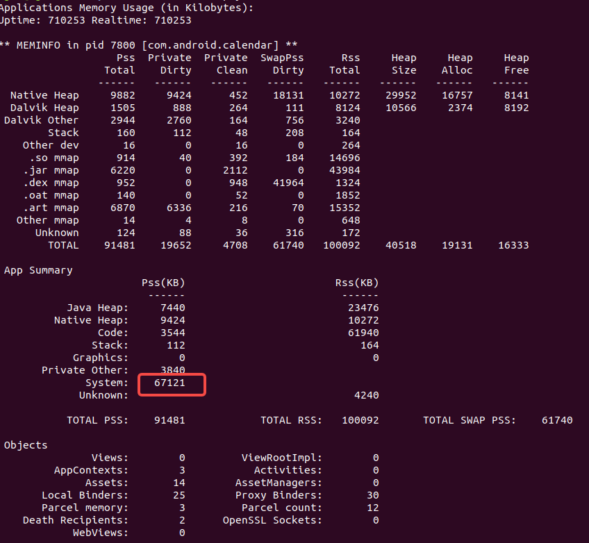

profile memory

1、shallow size

对象本身占用的内存。不包含其引用的对象。

2、Retained size

对象自己的Shallow size，加上对象能直接或间接访问到的对象的Shallow size之和。

Ratained size 是该对象被GC 后所能回收的内存总和。

内存优化

1、xml中的背景，可以用Glide加载

Q：Glide做了什么？

2、字符串优化

对于共用的字符串，抽取出常量后使用。比如包名等，就不要再自己新建String了。

3、bitmap

Bitmap.createBitmap()使用RGB_565替代ARGB_8888。

4、provider引起的内存占用

对于需要对外提供provider的app，provider被调用的时候，会在提供provider的app中的实例化，因此内存也会增大。

我遇到个内存占用过大的问题，分析了很久，甚至把Application中的代码都注释掉了，内存占用还是很大。

并且在meminfo中system部分占用很大，在profile中是others占用很大。

最终定位到了provider上面。这也解释了为什么应用会自动启动。

> 这也来看，是不是可以通过provider来实现进程保活？

5、延迟初始化

比如一个类中，使用到了不同的对象来处理不同的事情。这样可以在每个对象需要用到的时候，再进行初始化，而不是在构造方法中全部初始化了。

kotlin中有支持这种操作，比如by lazy。

6、谨慎使用单例

单例的生命周期等于整个应用的生命周期，因此如果不是一直需要的对象，使用单例前需要多做考虑。

7、