# 对比

几种工具的使用对比，使用场景，擅长处理什么？优缺点。


# 内存优化工具

# 辅助内存优化的分析工具

1. `MAT(Memory Analysis Tools)`
2. `Heap Viewer`
3. `Allocation Tracker`
4. `Android Studio 的 Memory Monitor`
5. `LeakCanary`

### MAT(MemoryAnalysisTools)

- 定义：一个`Eclipse`的`JavaHeap`内存分析工具->>[下载地址](https://links.jianshu.com/go?to=http%3A%2F%2Fwww.eclipse.org%2Fmat%2F)
- 作用：查看当前内存占用情况

> 通过分析`Java`进程的内存快照`HPROF`分析，快速计算出在内存中对象占用的大小，查看哪些对象不能被垃圾收集器回收&可通过视图直观地查看可能造成这种结果的对象

- 具体使用：[MAT使用攻略](https://links.jianshu.com/go?to=http%3A%2F%2Fblog.csdn.net%2Fitomge%2Farticle%2Fdetails%2F48719527)

### HeapViewer

- 定义：一个的`JavaHeap`内存分析工具
- 作用：查看当前内存快照

> 可查看分别有哪些类型的数据在堆内存总&各种类型数据的占比情况

- 具体使用：[HeapViewer使用攻略](https://links.jianshu.com/go?to=http%3A%2F%2Fblog.csdn.net%2Fzhangfei2018%2Farticle%2Fdetails%2F49154479)

### AllocationTracker

- 简介：一个内存追踪分析工具
- 作用：追踪内存分配信息，按顺序排列
- 具体使用：[AllocationTracker使用攻略](https://links.jianshu.com/go?to=https%3A%2F%2Fwww.kancloud.cn%2Fdigest%2Fitfootballprefermanc%2F100908)

### MemoryMonitor

- 简介：一个`AndroidStudio`自带的图形化检测内存工具

- 作用：跟踪系统/应用的内存使用情况。核心功能如下

  

  具体使用：[AndroidStudio的MemoryMonitor使用攻略](https://links.jianshu.com/go?to=http%3A%2F%2Fblog.csdn.net%2Ftrue100%2Farticle%2Fdetails%2F52604910)

# MemoryMonitor

要想做好内存优化工作，要掌握两大部分的知识，一部分是理解内存优化相关的原理，另一部分就是善于运用内存分析的工具，本节就来讲解MemoryMonitor。在AndroidStudio（以下简称AS）中AndroidMonitor是一个主窗口，它包含了Logcat、MemoryMonitor、CPUMonitor、GPUMonitor和NetworkMonitor。其中MemoryMonitor可以监视应用程序的性能和内存使用情况，以便于找到被分配的对象，定位内存泄漏，并跟踪连接设备中正在使用的内存数量。MemoryMonitor可以报告出你的应用程序的内存分配情况，更形象地呈现出应用程序使用的内存。它的作用如下：

- 实时显示可用的和分配的Java内存的图表。
- 实时显示垃圾收集（GC）事件。
- 启动垃圾收集事件。
- 快速测试应用程序的缓慢是否与过度的垃圾收集事件有关。
- 快速测试应用程序崩溃是否与内存耗尽有关。

## 17.2.1使用MemoryMonitor

在使用MemoryMonitor之前要确保手机开启了开发者模式和USB调试，使用的步骤如下：（1）运行需要监控的应用程序。

（2）单击AS面板下面的Android图标，并选择Monitors选项。如果MemoryMonitor已经运行，效果如图17-2所示。

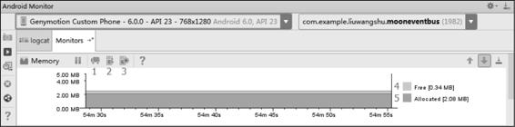

图17-2MemoryMonitor图中的标注的功能如下。

- InitiateGC（标识1）：用来手动触发GC。
- Dump Java heap（标识2）：保存内存快照。
- Start/StopAllocationTracking（标识3）：打开AllocationTracker工具（17.3节会介绍）。
- Free（标识4）：当前应用未分配的内存大小。
- Allocated（标识5）：当前应用分配的内存大小。

图17-2中Y轴显示当前应用的分配的内存和未分配的内存大小；X轴表示经过的时间。

## 17.2.2大内存申请与GC

从图17-3可以看出，分配的内存急剧上升，这就是大内存分配的场景，我们要判断这是否是合理的分配的内存，是Bitmap还是其他的大数据，并且对这种大数据进行优化，减少内存开销。接下来分配的内存出现急剧下降，这表示垃圾收集事件，用来释放内存。

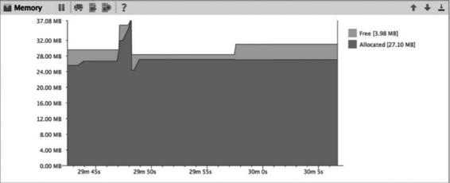

图17-3大内存申请与GC

## 17.2.3内存抖动

内存抖动一般指在很短的时间内发生了多次内存分配和释放，严重的内存抖动还会导致应用程序卡顿。内存抖动出现的原因主要是短时间频繁地创建对象（可能在循环中创建对象），内存为了应对这种情况，也会频繁地进行GC，非并行GC在进行时，其他线程都会被挂起，等待GC操作完成后恢复工作。如果是频繁的GC就会产生大量的暂停时间，这会导致界面绘制时间减少，从而使得多次绘制一帧的时长超过了16ms，产生的现象就是界面卡顿。综合起来就产生了内存抖动，产生了锯齿状的抖动图示，如图17-4所示。

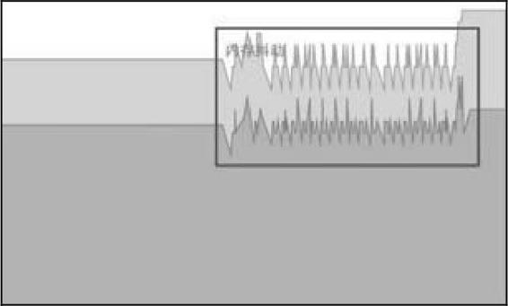

图17-4内存抖动

## 17.3Allocation Tracker

Allocation Tracker用来跟踪内存分配，它允许你在执行某些操作的同时监视在何处分配对象，了解这些分配使你能够调整与这些操作相关的方法调用，以优化应用程序性能和内存使用。AllocationTracker能够做到如下的事情：

- 显示代码分配对象类型、大小、分配线程、堆栈跟踪的时间和位置。
- 通过重复的分配/释放模式帮助识别内存变化。
- 当与HPROFViewer结合使用时，可以帮助你跟踪内存泄漏。例如，如果你在堆上看到一个Bitmap对象，你可以使用Allocation Tracker来找到其分配的位置。

### 17.3.1使用AllocationTracker

AS和DDMS中都有AllocationTracker，这里只介绍AS中的AllocationTracker如何使用。首先要确保要确保手机开启了开发者模式，并且开启了USB调试。使用的步骤如下：

（1）运行需要监控的应用程序。

（2）单击AS面板下面的Android图标，并选择Monitors选项。

（3）单击StartAllocationTracking按钮，这时Start AllocationTracking按钮变为了StopAllocationTracking按钮。

（4）操作应用程序。

（5）单击StopAllocationTracking按钮，结束快照。这时MemoryMonitor会显示出捕获快照的期间，如图17-5所示。

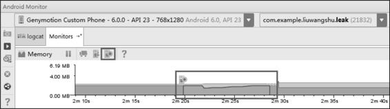

图17-5捕获快照的期间

（6）过几秒后就会自动打开一个窗口，显示当前生成的alloc文件的内存数据。

### 17.3.2alloc文件分析

自动打开的alloc文件窗口如图17-6所示。

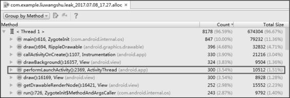

图17-6alloc文件窗口

该alloc文件窗口列出如表17-1所示的信息。

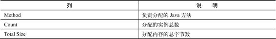

表17-1alloc文件窗口列出的信息

接着我们来分析图17-6中加方框的内容，负责分配的Java方法为performLaunchActivity，内存分配序列为2369，分配的对象为ActivityThread，分配的实例总数为300个，分配内存的总字节数为10512。

​	目前的列表选项是GroupbyMethod，我们也可以选择GroupByAllocator，如图17-7所示。

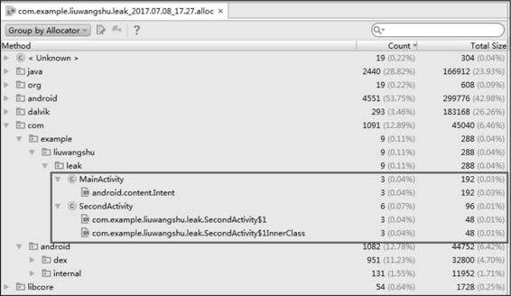

图17-7GroupByAllocator的信息

为了更好地解释图17-7中的信息，这里给出测试的代码，MainActivity和SecondActivity的代码如下所示：

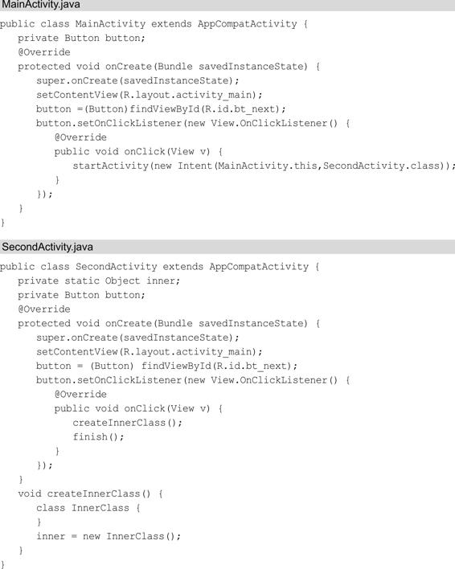

其中SecondActivity是存在内存泄漏的，生成快照期间，我的操作就是在MainActivity和SecondActivity之间跳转了3次（点击Button共6次）。这时我们回过头来看图17-7方框中的信息，MainActivity总共分配了3个Intent实例，占用内存为192字节。SecondActivity总共分配了6个实例，占用内存为96字节，其中分配了3个匿名内部类OnClickListener的实例，3个InnerClass的实例。

我们可以选择列表中的一项，单击鼠标右键，在弹出的菜单中选择jumptothesource就可以跳转到对应的源文件中。除此之外，还可以单击Show/HideChart按钮来显示数据的图形化，如图17-8所示。

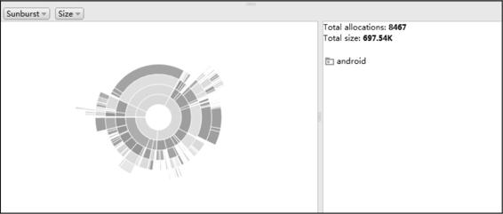

图17-8数据的图形化

# 17.4HeapDump

HeapDump的主要功能就是查看不同的数据类型在内存中的使用情况。它可以帮助你找到大对象，也可以通过数据的变化发现内存泄漏。

### 17.4.1使用HeapDump

打开Android Device Monitor工具，在左边Devices列表中选择要查看的应用程序进程，单击UpdateHeap按钮（一半是绿色的圆柱体），在右边选择Heap选项，并单击CauseGC按钮，就开始显示数据。我们每次单击CauseGC按钮都会强制应用程序进行垃圾回收，并将清理后的数据显示在Heap工具中，如图17-9所示。

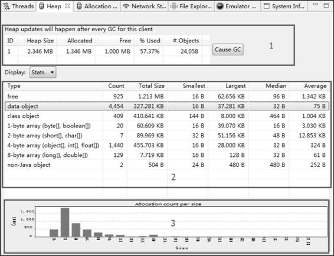

图17-9HeapDump视图HeapDump共有三个区域，分别是总览视图（标识1）、详情视图（标识2）和内存分配柱状图（标识3）。

#### 1.总览视图

其中总览视图可以查看整体的内存情况，其所列内容的说明如表17-2所示。

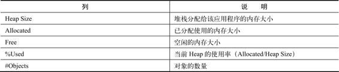

表17-2总览视图所列内容的说明

结合表17-2和图17-9，我们在总览视图中获得的信息就是：堆栈分配给当前的应用程序的内存大小为2.346MB，已分配的内存为1.346MB，空闲的内存为1MB，当前Heap的使用率为57.37%，对象的数量为24058个。

### 2.详情视图

详细视图展示了所有的数据类型的内存情况，其列的含义如表17-3所示。

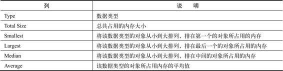

表17-3详细视图列的含义

除了列的含义，还有行的含义，如表17-4所示。

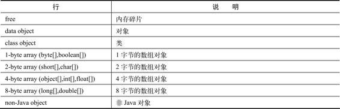

表17-4详细视图行的含义

比较重要的是free这一行的信息，它与总览视图中的free的含义不同，它代表内存碎片。当新创建一个对象时，如果碎片内存能容下该对象，则复用碎片内存，否则就会从free空间（总览视图中的free）重新划分内存给这个新对象。free是判断内存碎片化程度的一个重要的指标。此外，1-bytearray这一行的信息也很重要，因为图片是以byte[]的形式存储在内存中的，如果1-bytearray一行的数据过大，则需要检查图片的内存管理了。

#### 17.4.2检测内存泄漏

HeapDump也可以检测内存泄漏。在左边Devices列表中选择要查看的应用程序进程，单击UpdateHeap按钮（一半是绿色的圆柱体），在右边选择Heap选项，并单击CauseGC按钮，就开始显示数据，如图17-10所示。

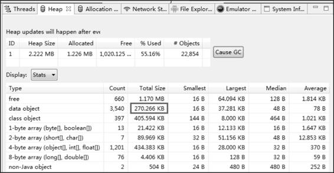

图17-10检测内存泄漏

这时dataobject的TotalSize为270.266KB。接下来操作应用，这个应用仍旧是在17.3.2节所举的内存泄漏的例子，反复地在MainActivity和SecondActivity之间跳转了10次（单击Button共20次），数据显示如图17-11所示。

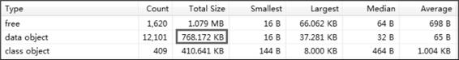

图17-11单击Button共20次的数据

dataobject的TotalSize变为了768.172KB。这时单击CauseGC按钮，数据显示如图17-12所示。

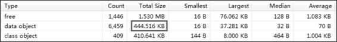

图17-12单击CauseGC按钮的数据可以看到dataobject的TotalSize变为了444.516KB，再单击一次CauseGC按钮，数据显示如图17-13所示。

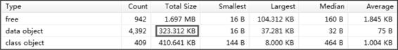

图17-13再次单击CauseGC按钮的数据

TotalSize变为了323.312KB，经过两次CauseGC的操作，TotalSize的值从768.172KB变为了323.312KB，这是一个比较大的变化，说明在CauseGC操作之前有462.86KB（768.172KB-323.312KB）的内存没有被回收，可能发生了内存泄漏。

## 内存分析工具MAT

见：根据MAT.md

## LeakCanary

见：LeakCanary目录


# 分析工具

## MemoryProfiler

## MAT（MemoryAnalyzerTool）

MAt是用来分析内存快照，分析对象引用链，从而找出导致内存泄漏根因的工具。

### MAT的使用步骤

1. 下载[eclipse.org/mat/downloa…](https://link.juejin.cn/?target=https%3A%2F%2Feclipse.org%2Fmat%2Fdownloads.php)
2. 在AndroidStudio中进入MemoryProfiler功能，操作应用关键页面
3. 点击GC以清理掉那些没有被泄露的对象，此时剩余的是发生泄漏的
4. 将内存快照dump到本地
5. 使用AndroidSDK自带的转换工具（位于`platform-tools`），将`Dalvik/ART`格式的`.hprof`文件转换为MAT能识别的`J2SE`格式，最后用MAT打开文件

```bash
./hprof-convaaa.hprofaaa-converted.hprof
```

### MAT中的术语说明

- **Dominator**：支配者，如果B引用了A，那么B是A的支配者
- **DominatorTree**：支配者引用链
- **ShallowHeap**：当前对象自身的内存占用
- **RetainedHeap**：当前对象及其成员变量加在一起的总内存占用
- **OutgoingReferences**：当前对象引用了哪些对象
- **IncomingReferences**：当前对象被哪些对象引用
- **TopConsumers**：通过饼图方式列出内存占用最多的对象