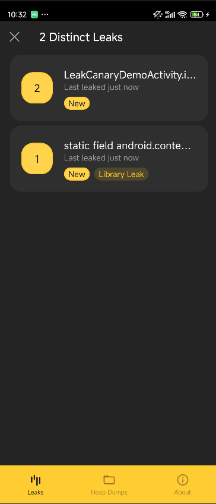
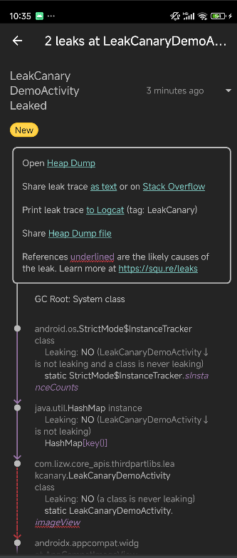
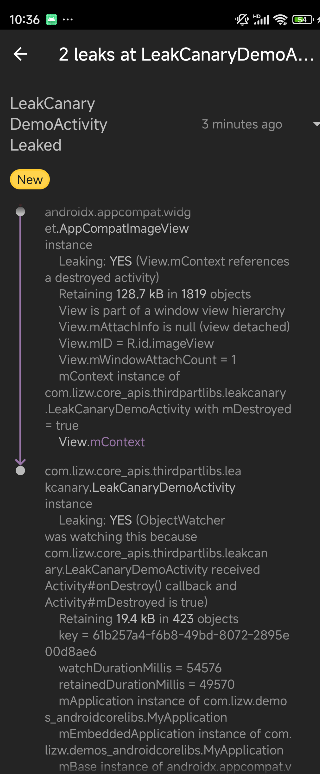
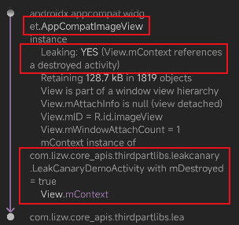
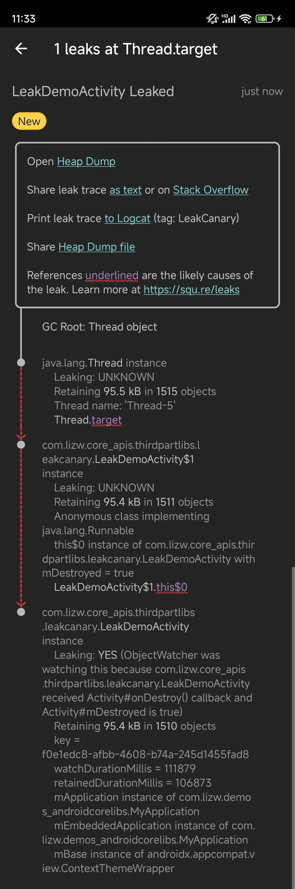
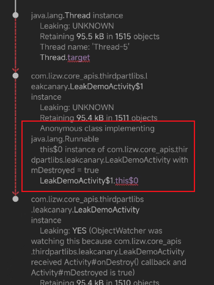

# 开始使用

添加依赖

```kotlin
dependencies { 
    // debugImplementation because LeakCanary should only run in debug builds. 
    debugImplementation 'com.squareup.leakcanary:leakcanary-android:2.14' 
}
```

确认LeakCanary正常运行

```kotlin
Logcat查看

D LeakCanary: LeakCanary is running and ready to detect leaks
```

# LeakCanary应用举例

## 示例1

模拟静态变量间接持有 Activity 导致泄漏。

### 开始模拟

启动 LeakCanaryDemoActivity 后，退出 LeakCanaryDemoActivity 页面后，触发泄漏。

```kotlin
class LeakCanaryDemoActivity : AppCompatActivity() {
    companion object {
        private const val TAG = "LeakCanaryDemoActivity"

        var imageView: ImageView? = null
    }

    override fun onCreate(savedInstanceState: Bundle?) {
        super.onCreate(savedInstanceState)
        setContentView(R.layout.activity_leak_canary_demo)
        imageView = findViewById(R.id.imageView)
    }
}
```

### 结果

在通知栏中出现泄漏的提示，点击后开始 dump 信息，完成后就可以在 LeakCanary 提供的页面中查看了，如下所示：



第一个就是 Thread 泄漏引起的，点进去后可以看到：



### 分析

从 LeakCanary 给出的信息可以发现：

1. LeakCanaryDemoActivity 的静态变量 imageView 出现泄漏。

   泄漏原因是View.mContext 持有 LeakCanaryDemoActivity。

   

### 解决

1. 首先解决静态变量持有 Activity 的问题

   ```kotlin
   class LeakCanaryDemoActivity : AppCompatActivity() {
       companion object {
           private const val TAG = "LeakCanaryDemoActivity"
   
   //        var imageView: ImageView? = null
       }
   
       override fun onCreate(savedInstanceState: Bundle?) {
           super.onCreate(savedInstanceState)
           setContentView(R.layout.activity_leak_canary_demo)
           val imageView: ImageView = findViewById(R.id.imageView)
   
           Thread {
               while (true) {
                   Log.i(TAG, "running")
                   Thread.sleep(1000L)
               }
           }.start()
   
       }
   }
   ```

## 示例2：匿名内部类引起内存泄漏

使用 Runnable 匿名内部类模拟内存泄漏

```kotlin
public class LeakDemoActivity extends AppCompatActivity {
    private static final String TAG = "LeakDemoActivity";

    @Override
    protected void onCreate(Bundle savedInstanceState) {
        super.onCreate(savedInstanceState);
        setContentView(R.layout.activity_leak_demo);

        new Thread(new Runnable() {

            @Override
            public void run() {
                while (true) {
                    Log.i(TAG, "running1");
                    try {
                        Thread.sleep(1000L);
                    } catch (InterruptedException e) {
                        throw new RuntimeException(e);
                    }
                }

            }
        }).start();
    }
}
```

### 结果



### 分析

匿名内部类 Runnable 引起内存泄漏，位置是 LeakDemoActivity$1 指的是 Runnable，即 Runnable.this$0 持有着 LeakDemoActivity，Runnable又被 Thread 持有，Thread 一直在运行，最终导致 LeakDemoActivity 泄漏。



### 解决

将匿名内部类改为静态类实现。

```kotlin
public class LeakDemoActivity extends AppCompatActivity {
    private static final String TAG = "LeakDemoActivity";

    @Override
    protected void onCreate(Bundle savedInstanceState) {
        super.onCreate(savedInstanceState);
        setContentView(R.layout.activity_leak_demo);

        new Thread(new MyRunnable()).start();
    }

    static class MyRunnable implements Runnable {

        @Override
        public void run() {
             while (true) {
                    Log.i(TAG, "running1");
                    try {
                        Thread.sleep(1000L);
                    } catch (InterruptedException e) {
                        throw new RuntimeException(e);
                    }
                }
        }
    }
}
```

### 注意

下面的代码是不会引起 Activity 内存泄漏的。

这是因为使用的是 Kotlin 的 lambda 表达式，如果没有用到外部类的成员变量的话，是不会持有外部类的。这一点和 Java 的匿名内部类不一样，Java的匿名内部类会默认持有外部类引用。

```kotlin
class LeakCanaryDemoActivity : AppCompatActivity() {
    companion object {
        private const val TAG = "LeakCanaryDemoActivity"
    }

    override fun onCreate(savedInstanceState: Bundle?) {
        super.onCreate(savedInstanceState)
        setContentView(R.layout.activity_leak_canary_demo)

        Thread(Runnable {
            while (true) {
                Log.i(TAG, "running1")
                Thread.sleep(1000L)
            }
        }).start()

        Thread {
            while (true) {
                Log.i(TAG, "running")
                Thread.sleep(1000L)
            }
        }.start()

    }
}
```


# 导出日志

可以将heapdump（hprof文件）导出。

注意：内存泄漏详细页中分享出去的hprof文件并不是标准的hprof文件，还需要将它转换为标准的hprof文件，这样才会被MAT识别从而进行分析。


# 问题


# 参考

