# 内存泄漏检测

在开发阶段可以直接使用 Android Studio 来查看 Activity 是否存在内存泄漏，并结合 MAT 来查看发生内存泄漏的具体对象。这部分内容相信大多数安卓工程师都信手拈来，这节内容不展开详细介绍，详细使用过程可以参考：[Android Studio和MAT结合使用来分析内存问题](https://blog.csdn.net/zxm317122667/article/details/52162764)。

除了 Android Studio 之外，另一个检查内存泄漏的神器就是 LeakCanary，也是本节重点介绍内容。

LeakCanary 是 Square 公司的一个开源库。通过它可以在 App 运行过程中检测内存泄漏，当内存泄漏发生时会生成发生泄漏对象的引用链，并通知程序开发人员。

可以看出 LeakCanary 主要分 2 大核心部分：

如何检测内存泄漏；

分析内存泄漏对象的引用链。

## 如何检测内存泄漏

### JVM 理论知识

Java 中的 WeakReference 是弱引用类型，每当发生 GC 时，它所持有的对象如果没有被其他强引用所持有，那么它所引用的对象就会被回收。比如以下代码：

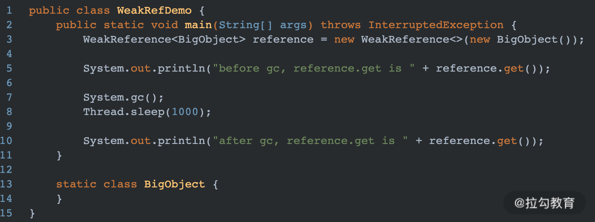

上述代码运行之后，打印结果如下：

```kotlin
before gc, reference.get is com.danny.lagoumemoryleak.WeakRefDemo$BigObject@7852e922
after gc, reference.get is null
```

WeakReference 的构造函数可以传入 ReferenceQueue，当 WeakReference 指向的对象被垃圾回收器回收时，会把 WeakReference 放入 ReferenceQueue 中。比如我在上述代码中，调用 WeakReference 的构造器时，传入一个自定义的 ReferenceQueue，如下所示：

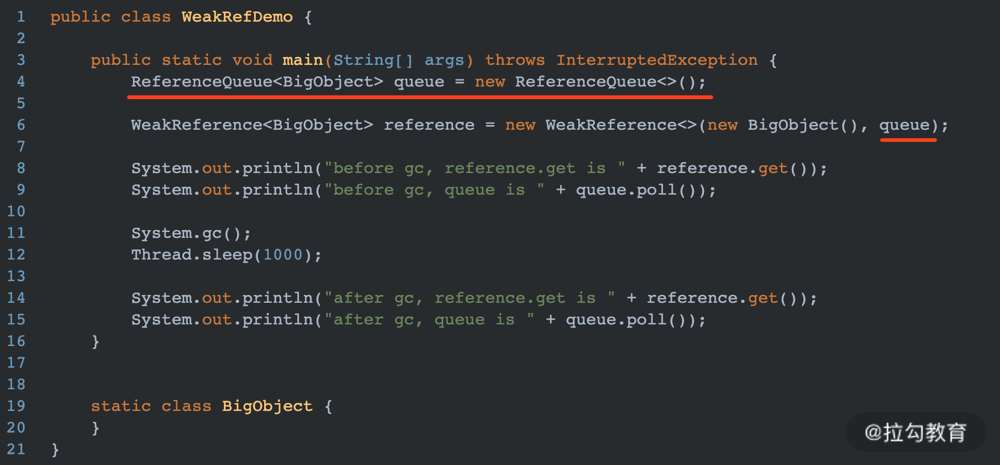

那么打印结果如下：

```kotlin
before gc, reference.get is com.danny.lagoumemoryleak.WeakRefDemo$BigObject@7852e922
before gc, queue is null
after gc, reference.get is null
after gc, queue is java.lang.ref.WeakReference@4e25154f
```

可以看出，当 BigObject 被回收之后，WeakReference 会被添加到所传入的 ReferenceQueue 中。
再修改一下上述代码，模拟一个内存泄漏，如下所示：

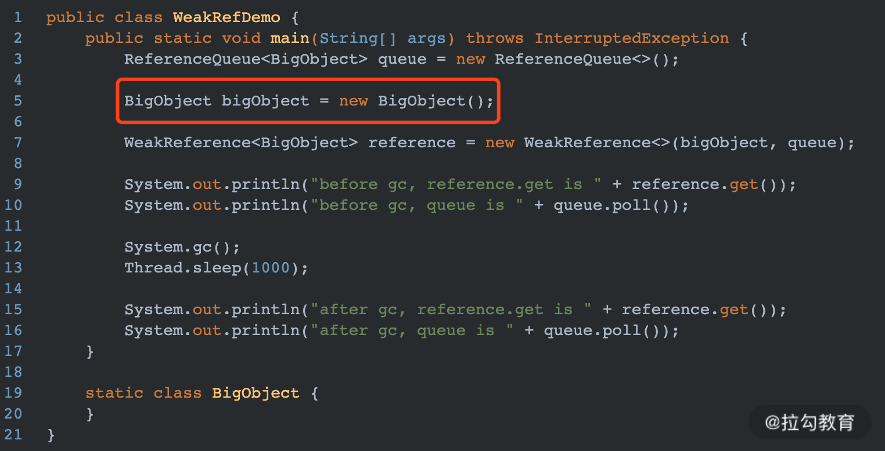

birObject 是一个强引用，导致 new BigObject() 的内存空间不会被 GC 回收。最终打印结果如下：

```kotlin
before gc, reference.get is com.danny.lagoumemoryleak.WeakRefDemo$BigObject@7852e922
before gc, queue is null
after gc, reference.get is com.danny.lagoumemoryleak.WeakRefDemo$BigObject@7852e922
after gc, queue is null
```

## 实现思路

LeakCanary 中对内存泄漏检测的核心原理就是基于 WeakReference 和 ReferenceQueue 实现的。

当一个 Activity 需要被回收时，就将其包装到一个 WeakReference 中，并且在 WeakReference 的构造器中传入自定义的 ReferenceQueue。

然后给包装后的 WeakReference 做一个标记 Key，并且在一个强引用 Set 中添加相应的 Key 记录

最后主动触发 GC，遍历自定义 ReferenceQueue 中所有的记录，并根据获取的 Reference 对象将 Set 中的记录也删除

**经过上面 3 步之后，还保留在 Set 中的就是：应当被 GC 回收，但是实际还保留在内存中的对象，也就是发生泄漏了的对象。**

## 源码分析

在上面原理介绍的例子里，我们知道一个可回收对象在 System.gc() 之后就应该被 GC 回收。可是在 Android App 中，我们并不清楚何时系统会回收 Activity。但是，按照正常流程，当 Activity 调用 onDestroy 方法时就说明这个 Activity 就已经处于无用状态了。因此我们需要监听到每一个 Activity 的 onDestroy 方法的调用。

### ActivityRefWatch

LeakCanary 中监听 Activity 生命周期是由 ActivityRefWatch 来负责的，主要是通过注册 Android 系统提供的 ActivityLifecycleCallbacks，来监听 Activity 的生命周期方法的调用，如下所示：

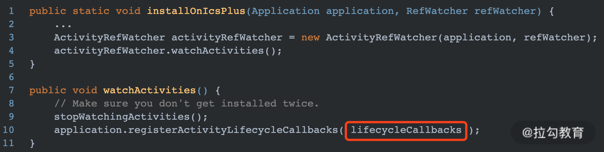

lifecycleCallbacks 的具体代码如下：

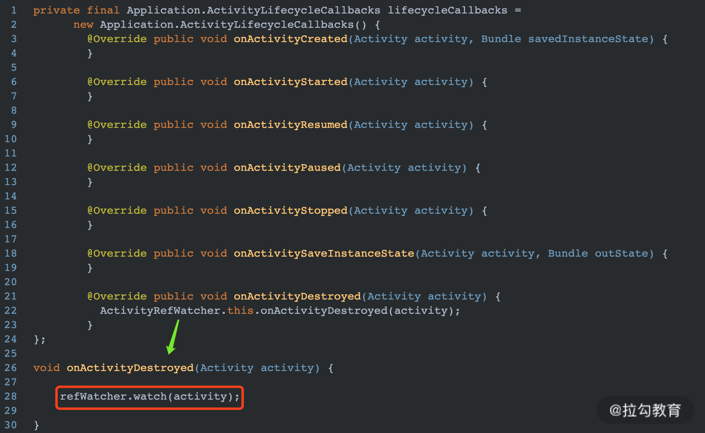

可以看出当监听到 Activity 的 onDestroy 方法后，会将其传给 RefWatcher 的 watch 方法。

### RefWatcher

它是 LeakCanary 的一个核心类，用来检测一个对象是否会发生内存泄漏。主要实现是在 watch 方法中，如下所示：

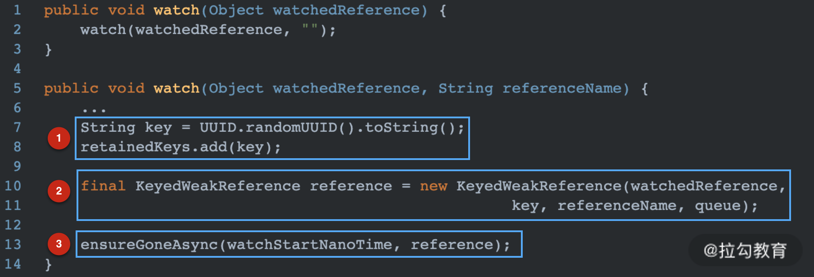

解释说明：

图中 1 处生成一个随机的字符串 key，这个 key 就是用来标识 WeakReference 的，就相当于给 WeakReference 打了个标签；

图中 2 处将被检测对象包装到一个 WeakReference 中，并将其标识为步骤 1 中生成 key；

图中 3 处调用 ensureGoneAsync 开始执行检测操作。

因此关键代码就是在 ensureGoneAsync 方法中，代码如下：

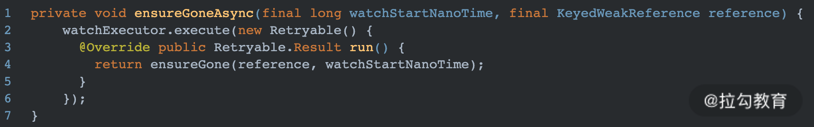

通过 WatchExecutor 执行了一个重载的方法 ensureGone。

ensureGone 中实现了内存泄漏的检测，方法具体实现如下：

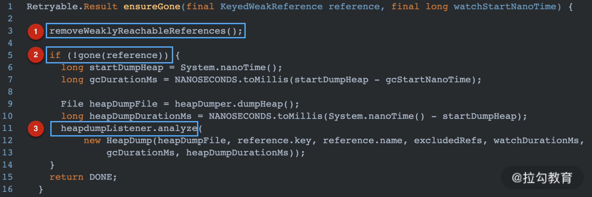

解释说明：

图中 1 处会遍历 ReferenceQueue 中所有的元素，并根据每个元素中的 key，相应的将集合 retainedKeys 中的元素也删除。

图中 2 处判断集合 retainedKeys 是否还包含被检测对象的弱引用，如果包含说明被检测对象并没有被回收，也就是发生了内存泄漏。

图中 3 处生成 Heap “堆”信息，并生成内存泄漏的分析报告，上报给程序开发人员。

removeWeaklyReachableReferences() 方法如下：

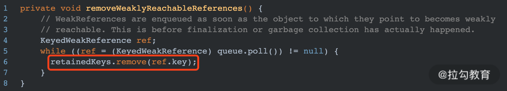

可以看出这个方法的主要目的就是从 retainedKeys 中移除已经被回收的 WeakReference 的标志。

gone(reference) 方法判断 reference 是否被回收了，如下：

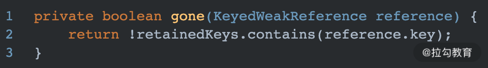

实现很简单，只要在 retainedKeys 中不包含此 reference，就说明 WeakReference 引用的对象已经被回收。

LeakCanary 的实现原理其实比较简单，但是内部实现还有一些其他的细节值得我们注意。

## 内存泄漏的检测时机

很显然这种内存泄漏的检测与分析是比较消耗性能的，因此为了尽量不影响 UI 线程的渲染，LeakCanary 也做了些优化操作。在 ensureGoneAsync 方法中调用了 WatchExecutor 的 execute 方法来执行检测操作，如下：

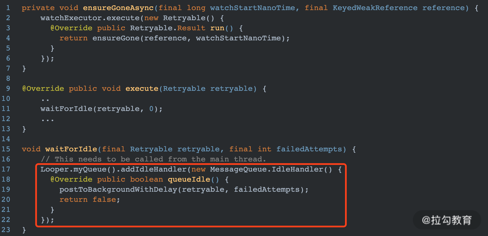

可以看出实际是向主线程 MessageQueue 中插入了一个 IdleHandler，IdleHandler 只会在主线程空闲时才会被 Looper 从队列中取出并执行。因此能够有效避免内存检测工作占用 UI 渲染时间。

通过 addIdleHandler 也经常用来做 App 的启动优化，比如在 Application 的 onCreate 方法中经常做 3 方库的初始化工作。可以将优先级较低、暂时使用不到的 3 方库的初始化操作放到 IdleHandler 中，从而加快 Application 的启动过程。不过个人感觉方法名叫 addIdleMessage 更合适一些，因为向 MessageQueue 插入的都是 Message 对象。

### 特殊机型适配

因为有些特殊机型的系统本身就存在一些内存泄漏的情况，导致 Activity 不被回收，所以在检测内存泄漏时，需要将这些情况排除在外。在 LeakCanary 的初始化方法 install 中，通过 excludedRefs 方法指定了一系列需要忽略的场景。

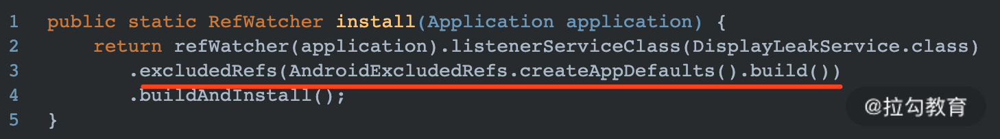

这些场景都被枚举在 AndroidExcludedRefs 中，这种统一规避特殊机型的方式，也值得我们借鉴，因为国内的手机厂商实在是太多了。

### LeakCanary 如何检测其他类

LeakCanary 默认只能检测 Activity 的泄漏，但是 RefWatcher 的 watch 方法传入的参数实际是 Object，所以理论上是可以检测任何类的。LeakCanary 的 install 方法会返回一个 RefWatcher 对象，我们只需要在 Application 中保存此 RefWatch 对象，然后将需要被检测的对象传给 watch 方法即可，具体如下所示：

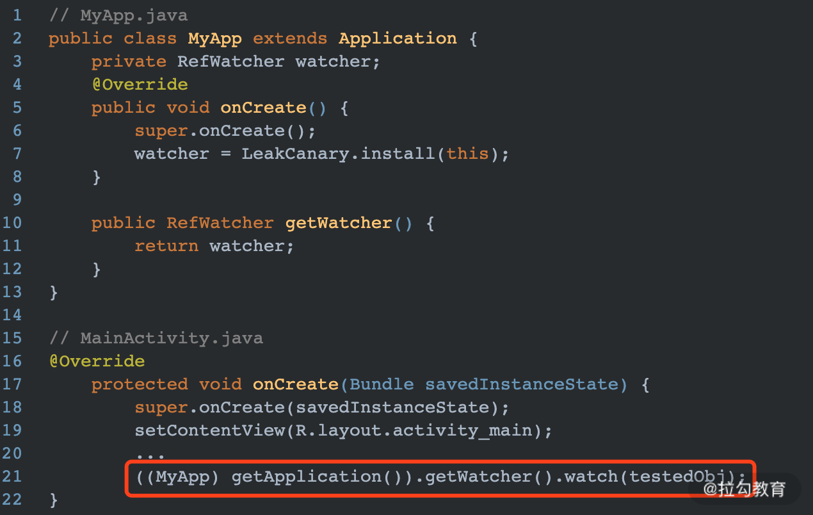

testedObj 就是一个需要被检测内存泄漏的对象。

### 内存泄漏预防

这需要我们了解 JVM 发生内存泄漏的原因，并在平时开发阶段养成良好的编码规范，避免引入会发生内存泄漏的代码。

### 内存泄漏检测

内存泄漏检测工具有很多 Android Studio 自带的 Profiler，以及 MAT 都是不错的选择。


# 前言

`LeakCanary`是一个内存泄漏检测框架，有以下几个特点

1. 不需要手动初始化
2. 可自动检测内存泄漏并通过通知报警
3. 支持dump hprof 文件分析内存使用情况
4. 不能用于线上

本文主要梳理`LeakCanary`内存泄漏检测的主要流程并回答以下问题

1. 说一下`LeakCanary`检测内存泄漏的原理与基本流程
2. `LeakCanary`是如何初始化的？
3. 说一下`LeakCanary`是如何查找内存泄露的？
4. 为什么`LeakCanary`不能用于线上？

# LeakCanary 原理

LeakCanary 是通过在 Application 的 registerActivityLifecycleCallbacks 方法实现对 Activity 销毁监听的，该方法主要用来统一管理所有 Activity 的生命周期。所有 Activity 在销毁时在其 OnDestory 方法中都会回调 ActivityLifecycleCallbacks 的 onActivityDestroyed 方法，而 LeakCanary 要做的就是在该方法中调用 RefWatcher.watch 方法实现对 Activity 进行内存泄漏监控。 那么，LeakCanary 是如何判断某个 Activity 可能会发生内存泄漏呢？

答案是：WeakReference 和 ReferenceQueue，即 LeakCanary 利用了 Java 的 WeakReference 和 ReferenceQueue，通过将 Activity 包装到 WeakReference 中，被 WeakReference 包装过的 Activity 对象如果能够被回收，则说明引用可达，垃圾回收器就会将该 WeakReference 引用存放到 ReferenceQueue 中。假如我们要监视某个 Activity 对象，LeakCanary 就会去 ReferenceQueue 找这个对象的引用，如果找到了，说明该对象是引用可达的，能被 GC 回收，如果没有找到，说明该对象有可能发生了内存泄漏。最后，LeakCanary 会将 Java 堆转储到一个 .hprof 文件中，再使用 Shark（堆分析工具）析 .hprof 文件并定位堆转储中“滞留”的对象，并对每个"滞留"的对象找出 GC roots 的最短强引用路径，并确定是否是泄露，如果泄漏，建立导致泄露的引用链。最后，再将分析完毕的结果以通知的形式展现出来。

## 1. `LeakCanary`检测内存泄漏的原理与基本流程

### 1.1 内存泄漏的原理

内存泄漏的原因：不再需要的对象依然被引用，导致对象被分配的内存无法被回收。
例如：一个`Activity`实例对象在调用了`onDestory`方法后是不再被需要的，如果存储了一个引用`Activity`对象的静态域，将导致`Activity`无法被垃圾回收器回收。
引用链来自于垃圾回收器的可达性分析算法：当一个对象到`GC Roots` 没有任何引用链相连时，则证明此对象是不可用的。如图：
 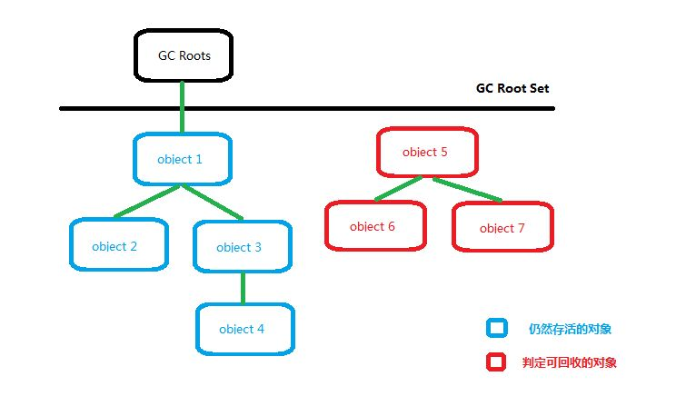
 对象`object5`、`object6`、`object7` 虽然互相有关联，但是它们到 `GC Roots` 是不可达的，所以它们将会被判定为是可回收的对象。
 在`Java`语言中，可作为`GC Roots`的对象包括下面几种：

- 虚拟机栈（栈帧中的本地变量表）中引用的对象。
- 方法区中静态属性引用的对象。
- 方法区中常量引用的对象。
- 本地方法栈中JNI（即一般说的Native方法）引用的对象。

### 1.2 `LeakCanary`检测内存泄漏的基本流程

知道了内存泄漏的原理，我们可以推测到`LeakCanary`的基本流程大概是怎样的

1. 检测：在页面关闭后触发检测(不再需要的对象)
2. 收集可疑对象：触发`GC`，然后获取仍然存在的对象，这些是可能泄漏的
3. 分析：`dump heap`然后分析`hprof`文件，构建可能泄漏的对象与`GCRoot`间的引用链，如果存在则证明泄漏
4. 存储与通知：存储结果并使用通知提醒用户存在泄漏

总体流程图如下所示：
 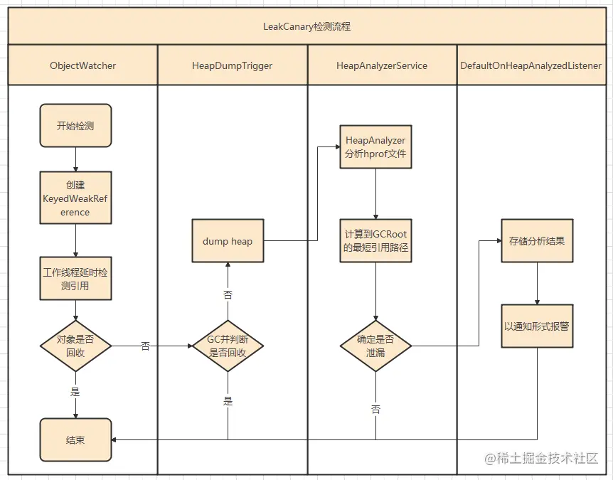

1. `ObjectWatcher` 创建了一个`KeyedWeakReference`来监视对象.
2. 在后台线程中，延时检查引用是否已被清除，如果没有则触发`GC`
3. 如果引用一直没有被清除，它会`dumps the heap` 到一个`.hprof` 文件中，然后将`.hprof` 文件存储到文件系统。
4. 分析过程主要在`HeapAnalyzerService`中进行，`Leakcanary2.0`中使用`Shark`来解析`hprof`文件。
5. `HeapAnalyzer` 获取`hprof`中的所有`KeyedWeakReference`，并获取`objectId`
6. `HeapAnalyzer`计算`objectId`到`GC Root`的最短强引用链路径来确定是否有泄漏，然后构建导致泄漏的引用链。
7. 将分析结果存储在数据库中，并显示泄漏通知。

## 2. `LeakCanary`是如何自动安装的？

`LeakCanary`的使用只需要添加依赖便可以自动初始化，是通过`ContentProvider`实现的

```kotlin
internal sealed class AppWatcherInstaller : ContentProvider() {
  internal class MainProcess : AppWatcherInstaller()

  internal class LeakCanaryProcess : AppWatcherInstaller()

  override fun onCreate(): Boolean {
    val application = context!!.applicationContext as Application
    AppWatcher.manualInstall(application)
    return true
  }
}  
```

当启动`App`时，一般启动顺序为：`Application`->`attachBaseContext` =====>`ContentProvider`->`onCreate` =====>`Application`->`onCreate`
 `ContentProvider`会在`Application.onCreate`前初始化，这样就调用到了`LeakCanary`的初始化方法，实现了免手动初始化。

### 2.1 跨进程初始化

注意，`AppWatcherInstaller`有两个子类，`MainProcess`与`LeakCanaryProcess`
其中默认使用`MainProcess`，会在`App`进程初始化
有时我们考虑到`LeakCanary`比较耗内存，需要在独立进程初始化
使用`leakcanary-android-process`模块的时候，会在一个新的进程中去开启`LeakCanary`

### 2.2 `LeakCanary2.0`手动初始化的方法

`LeakCanary`在检测内存泄漏时比较耗时，同时会打断`App`操作，在不需要检测时的体验并不太好
所以虽然`LeakCanary`可以自动初始化，但有时其实还是需要手动初始化

`LeakCanary`的自动初始化可以手动关闭

```xml
<?xml version="1.0" encoding="utf-8"?>
 <resources>
      <bool name="leak_canary_watcher_auto_install">false</bool>
 </resources>
```

1. 然后在需要初始化的时候，调用`AppWatcher.manualInstall`即可
2. 是否开始`dump`与分析开头：`LeakCanary.config = LeakCanary.config.copy(dumpHeap = false)`
3. 桌面图标开头：重写`R.bool.leak_canary_add_launcher_icon`或者调用`LeakCanary.showLeakDisplayActivityLauncherIcon(false)`

### 2.3 小结

`LeakCanary`利用`ContentProvier`进行了初始化。
`ContentProvier` 会在`Application.onCreate`之前被加载，`LeakCanary`在其`onCreate()`方法中调用了`AppWatcher.manualInstall`进行初始化。
这种写法虽然方便，免去了初始化的步骤，但是可能会带来启动耗时的问题，用户不能控制初始化的时机，这也是谷歌推出`StartUp`的原因
不过对于`LeakCanary`这个问题并不严重，因为它只在`Debug`阶段被依赖

## 3.`LeakCanary`如何检测内存泄漏?

### 3.1 首先我们来看下初始化时做了什么?

当初始化时，调用了`AppWatcher.manualInstall` ：

```kotlin
  @JvmOverloads
  fun manualInstall(
    application: Application,
    retainedDelayMillis: Long = TimeUnit.SECONDS.toMillis(5),
    watchersToInstall: List<InstallableWatcher> = appDefaultWatchers(application)
  ) {
    ....
    watchersToInstall.forEach {
      it.install()
    }
  }

  fun appDefaultWatchers(
    application: Application,
    reachabilityWatcher: ReachabilityWatcher = objectWatcher
  ): List<InstallableWatcher> {
    return listOf(
      ActivityWatcher(application, reachabilityWatcher),
      FragmentAndViewModelWatcher(application, reachabilityWatcher),
      RootViewWatcher(reachabilityWatcher),
      ServiceWatcher(reachabilityWatcher)
    )
  }
```

可以看出，初始化时安装了一些`Watcher`，即在默认情况下，只会观察 `Activity`，`Fragment`，`RootView`，`Service` 这些对象是否泄漏
如果需要观察其他对象，需要手动添加并处理

### 3.2 `LeakCanary`如何触发检测?

如上文所述，在初始化时会安装一些`Watcher`，以`ActivityWatcher`为例

```kotlin
class ActivityWatcher(
  private val application: Application,
  private val reachabilityWatcher: ReachabilityWatcher
) : InstallableWatcher {

  private val lifecycleCallbacks =
    object : Application.ActivityLifecycleCallbacks by noOpDelegate() {
      override fun onActivityDestroyed(activity: Activity) {
        reachabilityWatcher.expectWeaklyReachable(
          activity, "${activity::class.java.name} received Activity#onDestroy() callback"
        )
      }
    }

  override fun install() {
    application.registerActivityLifecycleCallbacks(lifecycleCallbacks)
  }

  override fun uninstall() {
    application.unregisterActivityLifecycleCallbacks(lifecycleCallbacks)
  }
}
```

可以看到在`Activity.onDestory`时，就会触发检测内存泄漏

### 3.3 `LeakCanary`如何检测可能泄漏的对象?

从上面可以看出，`Activity`关闭后会调用到`ObjectWatcher.expectWeaklyReachable`

```kotlin
  @Synchronized override fun expectWeaklyReachable(
    watchedObject: Any,
    description: String
  ) {
    if (!isEnabled()) {
      return
    }
    removeWeaklyReachableObjects()
    val key = UUID.randomUUID()
      .toString()
    val watchUptimeMillis = clock.uptimeMillis()
    val reference =
      KeyedWeakReference(watchedObject, key, description, watchUptimeMillis, queue)
    SharkLog.d {
      "Watching " +
        (if (watchedObject is Class<*>) watchedObject.toString() else "instance of ${watchedObject.javaClass.name}") +
        (if (description.isNotEmpty()) " ($description)" else "") +
        " with key $key"
    }

    watchedObjects[key] = reference
    checkRetainedExecutor.execute {
      moveToRetained(key)
    }
  }

private fun removeWeaklyReachableObjects() {
    // WeakReferences are enqueued as soon as the object to which they point to becomes weakly
    // reachable. This is before finalization or garbage collection has actually happened.
    var ref: KeyedWeakReference?
    do {
      ref = queue.poll() as KeyedWeakReference?
      if (ref != null) {
        watchedObjects.remove(ref.key)
      }
    } while (ref != null)
  }  
```

1. 传入的观察对象都会被存储在`watchedObjects`中
2. 会为每个`watchedObject`生成一个`KeyedWeakReference`弱引用对象并与一个`queue`关联，当对象被回收时，该弱引用对象将进入`queue`当中
3. 在检测过程中，会调用多次`removeWeaklyReachableObjects`，将已回收对象从`watchedObjects`中移除
4. 如果`watchedObjects`中没有移除对象，证明它没有被回收，那么就会调用`moveToRetained`

### 3.4 `LeakCanary`触发堆快照，生成`hprof`文件

`moveToRetained`之后会调用到`HeapDumpTrigger.checkRetainedInstances`方法
`checkRetainedInstances()` 方法是确定泄露的最后一个方法了。
这里会确认引用是否真的泄露，如果真的泄露，则发起 `heap dump`，分析 `dump` 文件，找到引用链

```kotlin
private fun checkRetainedObjects() {
    var retainedReferenceCount = objectWatcher.retainedObjectCount

    if (retainedReferenceCount > 0) {
      gcTrigger.runGc()
      retainedReferenceCount = objectWatcher.retainedObjectCount
    }

    if (checkRetainedCount(retainedReferenceCount, config.retainedVisibleThreshold)) return

    val now = SystemClock.uptimeMillis()
    val elapsedSinceLastDumpMillis = now - lastHeapDumpUptimeMillis
    if (elapsedSinceLastDumpMillis < WAIT_BETWEEN_HEAP_DUMPS_MILLIS) {
      onRetainInstanceListener.onEvent(DumpHappenedRecently)
      ....
      return
    }

    dismissRetainedCountNotification()
    val visibility = if (applicationVisible) "visible" else "not visible"
    dumpHeap(
      retainedReferenceCount = retainedReferenceCount,
      retry = true,
      reason = "$retainedReferenceCount retained objects, app is $visibility"
    ) 
}

  private fun dumpHeap(
    retainedReferenceCount: Int,
    retry: Boolean,
    reason: String
  ) {
     ....
  	 heapDumper.dumpHeap()
  	 ....
     lastDisplayedRetainedObjectCount = 0
     lastHeapDumpUptimeMillis = SystemClock.uptimeMillis()
     objectWatcher.clearObjectsWatchedBefore(heapDumpUptimeMillis)
     HeapAnalyzerService.runAnalysis(
       context = application,
       heapDumpFile = heapDumpResult.file,
       heapDumpDurationMillis = heapDumpResult.durationMillis,
       heapDumpReason = reason
     )
 }
}
```

1. 如果`retainedObjectCount`数量大于0，则进行一次`GC`，避免额外的`Dump`
2. 默认情况下，如果`retainedReferenceCount<5`，不会进行`Dump`，节省资源
3. 如果两次`Dump`之间时间少于60s，也会直接返回，避免频繁`Dump`
4. 调用`heapDumper.dumpHeap()`进行真正的`Dump`操作
5. `Dump`之后，要删除已经处理过了的引用
6. 调用`HeapAnalyzerService.runAnalysis`对结果进行分析

### 3.5 `LeakCanary`如何分析`hprof`文件

分析`hprof`文件的工作主要是在`HeapAnalyzerService`类中完成的
关于`Hprof`文件的解析细节，就需要牵扯到`Hprof`二进制文件协议，通过阅读协议文档，`hprof`的二进制文件结构大概如下：
 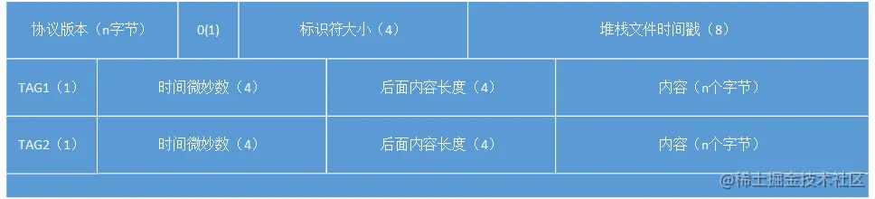

解析流程如下所示:
 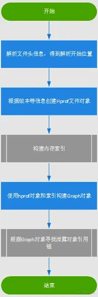

1. 解析文件头信息，得到解析开始位置
2. 根据头信息创建`Hprof`文件对象
3. 建内存索引
4. 使用`hprof`对象和索引构建`Graph`对象
5. 查找可能泄漏的对象与`GCRoot`间的引用链来判断是否存在泄漏(使用广度优先算法在`Graph`中查找)

`Leakcanary2.0`较之前的版本最大变化是改由`kotlin`实现以及开源了自己实现的`hprof`解析的代码，总体的思路是根据`hprof`文件的二进制协议将文件的内容解析成一个图的数据结构，然后广度遍历这个图找到最短路径，路径的起始就是`GCRoot`对象，结束就是泄漏的对象

具体分析可见：[Android内存泄漏检测之LeakCanary2.0（Kotlin版）的实现原理](https://link.juejin.cn?target=https%3A%2F%2Fzhuanlan.zhihu.com%2Fp%2F360944586)

### 3.6 泄漏结果存储与通知

结果的存储与通知主要在`DefaultOnHeapAnalyzedListener`中完成

```kotlin
override fun onHeapAnalyzed(heapAnalysis: HeapAnalysis) {
    SharkLog.d { "\u200B\n${LeakTraceWrapper.wrap(heapAnalysis.toString(), 120)}" }

    val db = LeaksDbHelper(application).writableDatabase
    val id = HeapAnalysisTable.insert(db, heapAnalysis)
    db.releaseReference()
    ...

    if (InternalLeakCanary.formFactor == TV) {
      showToast(heapAnalysis)
      printIntentInfo()
    } else {
      showNotification(screenToShow, contentTitle)
    }
  }
```

1. 存储泄漏分析结果到数据库中
2. 展示通知，提醒用户去查看内存泄漏情况

## 4.为什么`LeakCanary`不能用于线上?

理解了`LeakCanary`判定对象泄漏后所做的工作后就知道，直接将`LeakCanary`应用于线上会有如下一些问题：

1. 每次内存泄漏以后，都会生成一个`.hprof`文件，然后解析，并将结果写入`.hprof.result`。增加手机负担，引起手机卡顿等问题。
2. 多次调用`GC`，可能会对线上性能产生影响
3. 同样的泄漏问题，会重复生成 `.hprof` 文件，重复分析并写入磁盘。
4. `.hprof`文件较大，信息回捞成问题。

了解了这些问题，我们可以尝试提出一些解决方案：

1. 可以根据手机信息来设定一个内存阈值 `M` ，当已使用内存小于 `M `时，如果此时有内存泄漏，只将泄漏对象的信息放入内存当中保存，不生成`.hprof`文件。当已使用大于 `M` 时，生成`.hprof`文件
2. 当引用链路相同时，可根据实际情况去重。
3. 不直接回捞`.hprof`文件，可以选择回捞分析的结果
4. 可以尝试将已泄漏对象存储在数据库中，一个用户同一个泄漏只检测一次，减少对用户的影响

以上想法并没有经过实际验证，仅供参考

## 总结

当引入`LeakCanary`后，会自动安装并且开始分析内存泄漏并报警，主要分为以下几步

1. 自动安装
2. 检测可能泄漏的对象
3. 堆快照，生成`hprof`文件
4. 分析`hprof`文件，生成引用链
5. 对泄漏进行分类并通知


# 问题

<font color='orange'>Q：内存泄漏检测框架：LeakCanary实现原理</font>

1. 自动安装
2. 检测可能泄漏的对象
3. 堆快照，生成`hprof`文件
4. 分析`hprof`文件，生成引用链
5. 对泄漏进行分类并通知

<font color='orange'>Q：leakCannary中如何判断一个对象是否被回收？</font>

通过 WeakReference + ReferenceQueue 来检测，当一个对象只被 WeakReference 持有时，此时触发 GC 后，会把 WeakReference 添加到 ReferenceQueue 中，所以可以在 GC 后检测 ReferenceQueue 中是否有 WeakReference 对象来判断监听对象是否被回收掉。

<font color='orange'>Q：LeakCanary核心原理源码</font>


<font color='orange'>Q：LeakCanray2.0为啥不需要在application里调install？</font>

初始化过程被移动到了`ContentProvider`中。由于`ContentProvider`在`Application`的`onCreate`方法之前就已经被创建和初始化，因此可以不在`Application` 中再调用初始化方法。

利用了`ContentProvider`的自动注册与初始化机制。好处：减少手动配置。

<font color='orange'>Q：LeakCanary的原理，泄漏对象是如何找到引用链的</font>


# 参考

[【带着问题学】关于LeakCanary2.0你应该知道的知识点](https://juejin.cn/post/6968084138125590541)