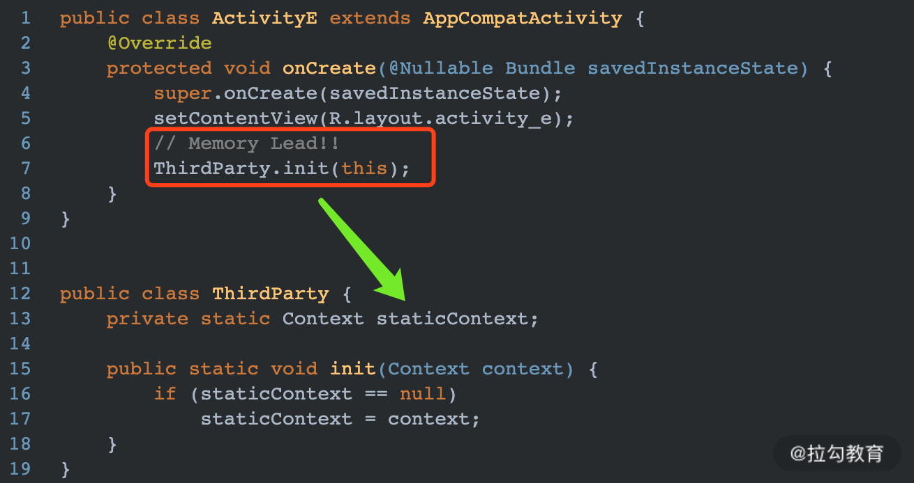
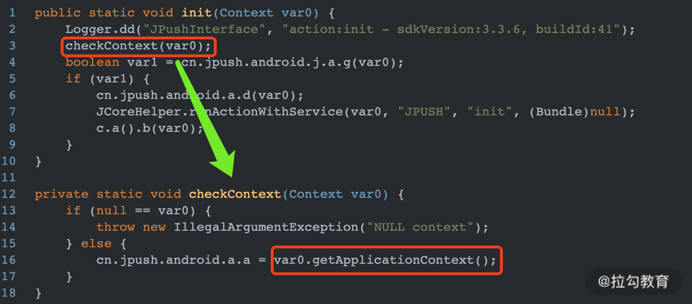
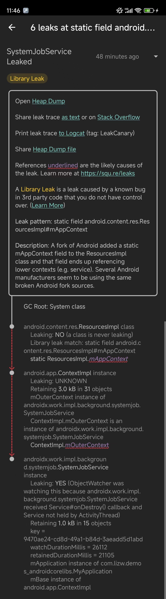

> version：2021/11/02
>
> review：2024/7/18


记录一些具体的案例分析。


# 1、内存泄漏

指程序在申请内存后，被某个对象一直持有，导致无法释放已申请的内存空间。一次内存泄漏的危害可以忽略，但内存泄漏堆积后果很严重，无论多少内存，迟早会被占光。**内存泄漏的本质是该销毁的对象因为被其他引用持有，导致不能GC掉。**或者说，生命周期短的对象被生命周期长的引用持有。

危害：大量的内存泄漏最终就可以导致OOM。

本质原因：生命周期长的引用持有着生命周期短的对象，导致生命周期短的对象不能被回收。

# 内存泄漏场景

## 1、单例使用不当（生命周期不一样）

说明：单例的静态特性使得它的生命周期同应用的生命周期一样长，如果一个对象已经没有用处了，但是单例还持有它的引用，那么在整个应用程序的生命周期它都不能正常被回收，从而导致内存泄漏。

```java
public class AppSetting {
    private static AppSetting mInstance;
    private Context mContext;

    private AppSetting(Context context) {
        this.mContext = context;
    }

    public static AppSetting getInstance(Context context) {
        if (mInstance == null) {
            mInstance = new AppSetting(context);
        }
        return mInstance;
    }
}

//使用
public class MainActivity extends AppCompatActivity {

    @Override
    protected void onCreate(Bundle savedInstanceState) {
        super.onCreate(savedInstanceState);
        setContentView(R.layout.activity_main);

        AppSetting.getInstance(this);
    }
}
```

解决：使用 ApplicationContext 替代 Context。

```java
public class AppSetting {
    private static AppSetting mInstance;
    private Context mContext;

    private AppSetting(Context context) {
        this.mContext = context.getApplicationContext();
    }

    public static AppSetting getInstance(Context context) {
        if (mInstance == null) {
            mInstance = new AppSetting(context);
        }
        return mInstance;
    }
}
```

## 2、静态变量导致内存泄漏

被 `Static` 关键字修饰的成员变量的生命周期 = 应用程序的生命周期

静态变量存储在方法区，它的生命周期从类加载开始，到整个进程结束。一旦静态变量初始化后，它所持有的引用只有等到进程结束才会释放。

```java
public class MainActivity extends AppCompatActivity {
    private static Info sInfo;

    @Override
    protected void onCreate(Bundle savedInstanceState) {
        super.onCreate(savedInstanceState);
        setContentView(R.layout.activity_main);

        sInfo = new Info(this);
    }
}

class Info {
    Activity mActivity;

    public Info(Activity activity) {
        mActivity = activity;
    }
}
```

Info作为Activity的静态成员，并且持有Activity的引用，但是sInfo作为静态变量，生命周期肯定比Activity长。所以当Activity退出后，sInfo仍然引用了Activity，导致Activity不能被回收，引起内存泄漏。
解决：在Activity退出时，可以在onDestory中，把静态引用变量置为null。

```java
@Override
    protected void onDestroy() {
        super.onDestroy();
        if (sInfo != null) {
            sInfo = null;
        }
    }
```

## 3、非静态内部类导致内存泄漏

非静态内部类（包括匿名内部类）默认就会持有外部类的引用，当非静态内部类对象的生命周期比外部类对象的生命周期长时，就会导致内存泄漏。常见于Handler、Thread、AsyncTask。

### 例1：Handler

两个原因：

1. Handler被生命周期更长的对象持有

   比如在子线程中使用Handler。

2. 使用Handler发出的消息还没有被处理掉

   在使用Handler处理消息时，会构造一个`Message`对象并调用`Handler.post()`，此时`Message`对象中的`target`成员变量指向该`Handler`。由于`Message`会在`MessageQueue`中按时序处理，在处理到它之前，是无法释放Handler的。也就导致了Handler所持有的外部类（通常是Activity）发生泄漏。

要解决这个问题，需要从两点入手：

1. 使用`Handler静态内部类`（或者直接新建一个类文件），Handler通过弱引用持有Activity
2. 在`Activity.onDestroy()`中清空消息队列

```java
public class MainActivity1 extends AppCompatActivity {
    @Override
    protected void onCreate(Bundle savedInstanceState) {
        super.onCreate(savedInstanceState);
        setContentView(R.layout.activity_main);
        start();
    }

    private void start() {
        Message msg = Message.obtain();
        msg.what = 1;
        mHandler.sendMessage(msg);
    }

    private Handler mHandler = new Handler() {
        @Override
        public void handleMessage(@NonNull Message msg) {
            switch (msg.what) {

            }
        }
    };
}
```

在此例中，mHandler会默认持有外部类（MainActivity1）的引用，导致MainActivity1不能被回收，引起内存泄漏。
解决：使用 static 类 + 弱引用持有 Activity 解决。

```java
public class MainActivity1 extends AppCompatActivity {
    @Override
    protected void onCreate(Bundle savedInstanceState) {
        super.onCreate(savedInstanceState);
        setContentView(R.layout.activity_main);
        start();
    }

    private void start() {
        Message msg = Message.obtain();
        msg.what = 1;
        mHandler.sendMessage(msg);
    }

    private Handler mHandler = new MyHandler(this);

    private static class MyHandler extends Handler {
        private WeakReference<MainActivity1> mActivity1WeakReference;

        public MyHandler(MainActivity1 activity1) {
            mActivity1WeakReference = new WeakReference<>(activity1);
        }

        @Override
        public void handleMessage(@NonNull Message msg) {
            MainActivity1 activity1 = mActivity1WeakReference.get();
            switch (msg.what) {
                //处理逻辑
            }
        }
    }
}
```

### 例2：Thread

```java
public class MainActivity1 extends AppCompatActivity {
    @Override
    protected void onCreate(Bundle savedInstanceState) {
        super.onCreate(savedInstanceState);
        setContentView(R.layout.activity_main);
        new Thread(new Runnable() {
            @Override
            public void run() {
                while (true) {
                    //处理任务
                    SystemClock.sleep(1000L);
                }
            }
        }).start();
    }
}
```

1、内部匿名的 Runnable 实例被 Thread 持有，会长久运行，不会被系统GC回收。最终导致 MainActivity1 泄漏。
2、非静态内部类会持有外部类的引用。
在此例中，即使MainActivity1退出了，但是始终有一个thread持有它的引用，导致MainActivity1不能被回收，引起内存泄漏。
解决：

1. 加上static后，内部类就不会持有MainActivity1的隐式引用了。

   ```kotlin
   public class MainActivity1 extends AppCompatActivity {
       @Override
       protected void onCreate(Bundle savedInstanceState) {
           super.onCreate(savedInstanceState);
           setContentView(R.layout.activity_main);
           new MyThread().start();
       }
   
       private static class MyThread extends Thread {
           @Override
           public void run() {
               while (true) {
                   //处理任务
                   SystemClock.sleep(1000L);
               }
           }
       }
   }
   ```

2. 解决Thread无法回收问题

   ```kotlin
   public class MainActivity1 extends AppCompatActivity {
       private MyThread mMyThread;
   
       @Override
       protected void onCreate(Bundle savedInstanceState) {
           super.onCreate(savedInstanceState);
           setContentView(R.layout.activity_main);
   
           mMyThread = new MyThread();
           mMyThread.start();
       }
   
       private static class MyThread extends Thread {
           private boolean mIsRunning = false;
   
           @Override
           public void run() {
               mIsRunning = true;
               while (mIsRunning) {
                   //处理任务
                   SystemClock.sleep(1000L);
               }
           }
   
           public void close() {
               mIsRunning = false;
           }
       }
   
       @Override
       protected void onDestroy() {
           super.onDestroy();
           mMyThread.close();
       }
   }
   ```

   给Thread添加结束的标志位。当thread任务执行完成后，Java会帮我们把回收线程。

   **要养成为thread设置退出逻辑的习惯，保证thread可以运行结束**。
   注：Java threads会一直存在，只有当线程运行完成或被杀死掉，线程才会被回收。

### 例3：Runnable

与非静态内部类相类似，通过 `new Runnable(){...}` 创建一个匿名内部类的对象时，也会持有外部对象的引用。如果这个Runnable在线程池中排队等待处理，同样会导致Activity无法释放。解决方法与Handler类似，由于Activity与任务队列不强相关，此处不建议清空线程池中的任务队列。

创建一个实现了Runnable的静态内部类，内部通过弱引用持有Activity，使用Activity时判空

```kotlin
//Runnable错误用法
privateRunnablemRunnable=newRunnable(){
@Override
publicvoidrun(){

}
};

//Runnable正确用法
private static class MyRunnable implements Runnable{
WeakReference<MainActivity>reference;
publicMyRunnable(MainActivityactivity){
reference=newWeakReference<>(activity);
}
@Override
publicvoidrun(){
MainActivityactivity=reference.get();
}
}
```

## 4、未取消注册Listener或回调导致内存泄漏

未取消注册（Listener）或回调导致内存泄漏

在 Activity 中注册广播后，如果在 Activity 销毁后不取消注册，那么这个广播会一直存在，同上面所说的非静态内部类一样持有Activity引用，导致内存泄漏。因此注册广播后一定要在Activity销毁后取消注册。

```java
public class MainActivity extends AppCompatActivity {
    @Override
    protected void onCreate(Bundle savedInstanceState) {
        super.onCreate(savedInstanceState);
        setContentView(R.layout.activity_main);
        this.registerReceiver(mReceiver, new IntentFilter());
    }

    private BroadcastReceiver mReceiver = new BroadcastReceiver() {
        @Override
        public void onReceive(Context context, Intent intent) {
            // 收到广播时的处理
        }
    };

    @Override
    protected void onDestroy() {
        super.onDestroy();
        this.unregisterReceiver(mReceiver);
    }
}
```

## 5、资源未关闭或释放导致内存泄漏

当Activity销毁时，资源性对象不再使用，应当关闭该对象，然后将对象置为`null`，常见的有`Bitmap`、`InputStream`、`OutputStream`等实现了`Closable`接口的类，以及广播`BraodcastReceiver`、文件流`File`、数据库游标`Cursor` 等。

通常在finally语句中进行关闭，防止出现异常时，资源未被释放的问题

- 解决方案
  在`Activity`销毁时 及时关闭 / 注销资源

```go
// 对于 广播BraodcastReceiver：注销注册
unregisterReceiver()

// 对于 文件流File：关闭流
InputStream / OutputStream.close()
inp=null;

// 对于数据库游标cursor：使用后关闭游标
cursor.close（）

// 对于 图片资源Bitmap：Android分配给图片的内存只有8M，若1个Bitmap对象占内存较多，当它不再被使用时，应调用recycle()回收此对象的像素所占用的内存；最后再赋为null 
Bitmap.recycle()；
Bitmap = null;

// 对于动画（属性动画）
// 将动画设置成无限循环播放repeatCount = “infinite”后
// 在Activity退出时记得停止动画
```

## 6、集合类

集合类 添加元素后，仍引用着 集合元素对象，导致该集合元素对象不可被回收，从而 导致内存泄漏

```dart
// 通过 循环申请Object 对象 & 将申请的对象逐个放入到集合List
List<Object> objectList = new ArrayList<>();        
       for (int i = 0; i < 10; i++) {
            Object o = new Object();
            objectList.add(o);
            o = null;
        }
// 虽释放了集合元素引用的本身：o=null）
// 但集合List 仍然引用该对象，故垃圾回收器GC 依然不可回收该对象
```

集合类添加集合元素对象后，在使用后必须从集合中删除。由于一个集合中有许多元素，故最简单的方法是：清空集合对象和设置为null。

```csharp
 // 释放objectList
        objectList.clear();
        objectList=null;
```

## 7、WebView泄漏

这个是Android的顽疾了，一旦创建过WebView对象，就无法回收，与`Chromium内`核实现有关，网上有建议用如下方法清空WebView资源，但据网友描述在一些机型让仍然会泄露。

```kotlin
overridefunonDestroy(){
valparent=webView?.parent
if(parentisViewGroup){
parent.removeView(webView)
}
webView?.destroy()
super.onDestroy()
}
```

既然如此，就得避免创建过多的WebView对象，或者干脆另外起一个进程用作WebView展示。

1. **构建WebView对象池**，实现复用

2. **将WebView单独开辟一个进程使用**，与主进程之间跨进程通信传递数据

   尝试销毁。

## Binder泄漏

在bind方法时，new Binder作为返回，导致Binder泄漏。

## ListView

使用ListView时造成的内存泄漏

## 8、三方库使用 Context

遵循不信任原则，假设 sdk 中拿到 Context 会一直持有（被单例、static变量持有）等，所以传入 Context 时，优先传入 ApplicantionContext，除非要求Activity类型。

在项目中经常会使用各种三方库，有些三方库的初始化需要我们传入一个 Context 对象。但是三方库中很有可能一直持有此 Context 引用，比如以下代码：



上述代码中将 ActivityE 本身当作一个 Context 传递给了一个模拟的三方库 ThirdParty 中，但是在三方库中将传入的 context 重新置为一个静态 static 类型。这种情况是一种隐形的 Activity 泄漏，在我们自己的项目中很难察觉出，所以平时开发过程中，尽量使用 Context.getApplicationContext，不要直接将 Activity 传递给其他组件。

**提示：**这也提醒我们自己在实现 SDK 时，也尽量避免造成外部 Context 的泄漏。比如下图是 JPush 中初始化的部分混淆代码：



虽然是经过混淆之后的代码，但是也能大概猜出 checkContext 方法内部会使用 context.getApplicationContext 给内部 Context 赋值，因此即使我们传给 JPush 的是 Activity，也不会造成 Activity 泄漏。


# Activity 泄漏排查

如果出现Activity的泄漏，即持有Activity的变量生命周期长于Activity的生命周期，导致Activity虽然结束但其对象并未释放，其内部的成员变量也由于被持有而无法释放。反复进入退出页面，会看到内存曲线不断上升，即使手动GC也无济于事，继续下去会导致OOM。


# 第三方框架造成的泄漏。

# 由Android系统或者第三方ROM造成的泄漏。

系统层也会有一些泄漏问题，这些问题需要收集起来，积累经验。

# 案例分析

## 示例1



### 分析

最终是被 ResourcesImpl 的静态变量 mAppContext 持有。解决方案是打断引用链，即给 mAppContext 变量置为 null。

```kotlin
    private void fixSystemJobService() {
        try {
            Class<?> resourcesImpleClass = Class.forName("android.content.res.ResourcesImpl");
            Field mAppContext = resourcesImpleClass.getDeclaredField("mAppContext");
            Object f = mAppContext.get(null);
            Log.i(TAG, "fixSystemJobService " + (String) f);
        } catch (ClassNotFoundException | NoSuchFieldException | IllegalAccessException e) {
            Log.e(TAG, "fixSystemJobService " + e.getMessage());
        }
    }
```

### 解决

可以看到反射也访问不到这个属性了，这是因为 Android9 以后对反射做了限制了。

如果需要改的话，得在系统层加白名单。参考：https://juejin.cn/post/7090953619792461837

```kotlin
Accessing hidden field Landroid/content/res/ResourcesImpl;->mAppContext:Landroid/content/Context; (blocked, reflection, denied)
 E  fixSystemJobService No field mAppContext in class Landroid/content/res/ResourcesImpl; (declaration of 'android.content.res.ResourcesImpl' appears in /system/framework/framework.jar)
```


# 内存泄漏的检测


Lint 是否对分析、解决内存泄漏有帮助？


# 问题

## 概念

## 规避（事前）

<font color='orange'>Q：如何避免内存泄漏</font>

开发阶段：充分使用检测工具，比如使用 LeakCanary 检测。

然后编码时，安装一些代码规范提示插件，比如Alibaba java 规范插件，这样可以起到一些提示作用。使用 Lint 工具。整体提高代码质量。

平时要多收集泄漏相关的问题，积累经验，避免写出可能产生泄漏的代码。

因为泄漏问题比较繁杂，所以最好能够维护一份可以共用的CheckList清单，定期或者业务不忙的时候做一下专项检查，尽量找出泄漏问题。

上线前，多跑一跑Monkey。

多使用 Profiler 工具查看应用的运行情况，关注。可以定位到具体的页面、代码分析。

使用 Profiler 时，可以针对可能有问题的页面多进行几次进出以及相关业务操作，观察内存使用情况，比如是否有频繁的GC，是否某个功能突然内存暴增等。再针对性的进行处理。

<font color='orange'>Q：开发过程中你是怎样判断有内存泄漏的</font>

在开发过程中，我通常使用以下几种方法，对内存泄漏可能存在的场景进行快速检测和定位。

1. **内存泄漏-应用全生命周期分析**：`shell命令+LeakCanary+MAT`，运行程序并将主要链路页面都打开一遍，完全退出程序并手动触发GC。然后使用`adbshelldumpsysmeminfo<packagename>-d`打印应用当前进程信息，如果存活的View和Activity、Fragment数量不是`0`，说明它们发生了泄漏。接着借助LeakCanary查看哪些对象发生了泄漏，最后用MAT找出这些泄漏对象的引用关系，定位问题根因
2. **内存泄漏-单一页面分析**：使用MemoryProfiler工具，对于目标页面，反复进出5次，在最后一次退出后手动触发GC。如果此时内存曲线没有回到进入页面之前的状态，说明发生内存泄漏。然后，将内存快照保存下来，并在MemoryProfiler中查看该Activity，如果存在多个实例，说明没有被回收，即发生泄漏
3. **内存上涨-单一页面分析**：利用MemoryProfiler观察进入每个页面的内存变化情况，对于上升幅度大的页面，下载进入页面前后的两个内存快照并用MAT的**对比分析**功能，找出新页面内存的分配情况，被哪些大的对象所占用

## 场景

<font color='orange'>Q：哪些场景会出现内存泄漏（内存泄露的种类）</font>

[内存泄漏场景](##内存泄漏场景)

<font color='orange'>Q：说一下Context和内存泄露</font>

被单例、静态变量，非静态内部类比如 Handler 持有，长时间运行的线程锁持有。

<font color='orange'>Q：为什么Handler可能会导致内存泄露。</font>

[例1：Handler](##例1：Handler)

<font color='orange'>Q：静态context持有Activity的引用会内存泄漏，必须要持有怎么办?</font>

及时释放。（但是，什么场景一定需要用静态变量持有Activity呢？）

## 检测

<font color='orange'>Q：怎么检查内存泄漏</font>

使用 LeakCanary。

<font color='orange'>Q：内存泄漏检测工具</font>

使用 LeakCanary。

Monkey，记录

## 解决（事后）

<font color='orange'>Q：如何分析内存泄漏及如何处理</font>

使用 Android Studio 的 Profile 工具来分析 hprof 文件（堆内存文件）：

1. adb shell am dumpheap com.example.demo /data/local/tmp/xxx.hprof 生成堆内存文件，并pull出来，放到AS中。

2. 在AS中，可以看到某个类的实例总数（Allocations）。比如发现MainActivity有十多个，基本就可以确定泄漏了。

3. 在AS中，还可以查看其引用链，找到一直持有它的引用。

<font color='orange'>Q：处理过哪些内存泄漏</font>

Handler泄漏。

<font color='orange'>Q：有没有碰到过系统服务内存泄露的问题？</font>


# 参考

[面试官：内存泄漏连环问。被问懵了？来看看这部视频_哔哩哔哩 (゜-゜)つロ 干杯~-bilibili](https://www.bilibili.com/video/BV1ck4y1r7PK?from=search&seid=8113707547361918983)

[内存泄露：Thread是如何造成内存泄露的 - 简书 (jianshu.com)](https://www.jianshu.com/p/f50366145b4b)

[Android性能优化：关于 内存泄露 的知识都在这里了！](https://www.jianshu.com/p/97fb764f2669)

[拉勾教育 Android 工程师进阶 34 讲](https://kaiwu.lagou.com/course/courseInfo.htm?courseId=67#/content?courseId=67&isShowSections=true)