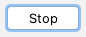

> version：2022/11/13
>
> review：


目录

[TOC]

# 笔记简介


# 关键词 & 概念


内存分析器是 [Android Profiler](https://developer.android.google.cn/studio/preview/features/android-profiler) 中的一个组件，可帮助您识别可能会导致应用卡顿、冻结甚至崩溃的内存泄漏和内存抖动。它显示一个应用内存使用量的实时图表，让您可以捕获堆转储、强制执行垃圾回收以及跟踪内存分配。

如需打开内存分析器，请按以下步骤操作：

1. 依次点击 **View > Tool Windows > Profiler**（您也可以点击工具栏中的 **Profile** 图标 )。
2. 从 Android Profiler 工具栏中选择要分析的设备和应用进程。如果您已通过 USB 连接设备但系统未列出该设备，请确保您已[启用 USB 调试](https://developer.android.google.cn/studio/debug/dev-options#enable)。
3. 点击 **MEMORY** 时间轴上的任意位置以打开内存分析器。

或者，您可以从命令行使用 [dumpsys](https://developer.android.google.cn/studio/command-line/dumpsys) 检查您的应用内存，还可以[在 logcat 中查看 GC 事件](https://developer.android.google.cn/studio/debug/am-logcat#memory-logs)。


## 为什么应分析您的应用内存

Android 提供了[受管理的内存环境](https://developer.android.google.cn/topic/performance/memory-overview) - 当它确定您的应用不再使用某些对象时，垃圾回收器会将未使用的内存释放回堆中。虽然 Android 查找未使用内存的方式在不断改进，但对于所有 Android 版本，系统都必须在某个时间点短暂地暂停您的代码。大多数情况下，这些暂停难以察觉。但是，如果您的应用分配内存的速度比系统回收内存的速度快，当回收器要释放足够的内存以满足您的分配需要时，您的应用可能会产生延迟。此延迟可能会导致您的应用跳帧，使其明显变慢。

即使您的应用未表现出变慢，但如果存在内存泄漏，应用在转到后台运行时，仍可能保留相应内存。此行为会导致系统强制执行不必要的垃圾回收事件，因而拖慢系统其余部分的内存性能。最终，系统将被迫终止您的应用进程以回收内存。然后，当用户返回您的应用时，它必须完全重启。

为帮助防止这些问题，您应使用内存分析器执行以下操作：

- 在时间轴上查找可能会导致性能问题的不理想的内存分配模式。
- 转储 Java 堆以查看在任何给定时间有哪些对象在占用内存。在一个较长的时间段内进行多次堆转储有助于识别内存泄漏。
- 记录正常条件和极端条件下用户交互期间的内存分配情况，从而准确识别您的代码是否在短时间内分配了过多对象，或所分配的对象是否出现了泄漏。

如需了解可减少应用内存使用量的编程做法，请阅读[管理应用内存](https://developer.android.google.cn/topic/performance/memory)。

## 内存分析器概览

首次打开内存分析器时，将看到一条表示应用内存使用量的详细时间轴，并可使用各种工具强制执行垃圾回收、捕获堆转储以及记录内存分配。


**图 1.** 内存分析器

如图 1 所示，内存分析器的默认视图包括以下各项：

1. 用于强制执行垃圾回收事件的按钮。

2. 用于[捕获堆转储](https://developer.android.google.cn/studio/profile/memory-profiler#capture-heap-dump)的按钮。

   **注意**：只有在连接到搭载 Android 7.1（API 级别 25）或更低版本的设备时，系统才会在堆转储按钮右侧显示用于[记录内存分配情况](https://developer.android.google.cn/studio/profile/memory-profiler#record-allocations)的按钮。

3. 用于指定性能分析器多久捕获一次内存分配的下拉菜单。选择适当的选项可帮助您[在进行性能剖析时提高应用性能](https://developer.android.google.cn/studio/profile/memory-profiler#performance)。

4. 用于缩放时间轴的按钮。

5. 用于跳转到实时内存数据的按钮。

6. 事件时间轴，显示活动状态、用户输入事件和屏幕旋转事件。

7. 内存使用量时间轴，它会显示以下内容：

   - 一个堆叠图表，显示每个内存类别当前使用多少内存，如左侧的 y 轴以及顶部的彩色键所示。
   - 一条虚线，表示分配的对象数，如右侧的 y 轴所示。
   - 每个垃圾回收事件的图标。

但是，如果您使用的是搭载 Android 7.1 或更低版本的设备，并非所有分析数据在默认情况下都可见。如果您看到一条消息，显示“Advanced profiling is unavailable for the selected process”，您需要[启用高级性能剖析](https://developer.android.google.cn/studio/preview/features/android-profiler#advanced-profiling)才能看到以下内容：

- 事件时间轴
- 分配的对象数
- 垃圾回收事件

在 Android 8.0 及更高版本上，系统会一律为可调试的应用启用高级性能剖析。


### 内存计算方式

在内存分析器顶部看到的数字（图 2）基于您的应用提交的所有专用内存页面（此数据由 Android 系统根据其记录提供）。此计数不包含与系统或其他应用共享的页面。


**图 2.** 内存分析器顶部的内存计数图例

内存计数中的类别如下：

- **Java**：从 Java 或 Kotlin 代码分配的对象的内存。

- **Native**：从 C 或 C++ 代码分配的对象的内存。

  即使您的应用中不使用 C++，您也可能会看到此处使用了一些原生内存，因为即使您编写的代码采用 Java 或 Kotlin 语言，Android 框架仍使用原生内存代表您处理各种任务，如处理图像资源和其他图形。

- **Graphics**：图形缓冲区队列为向屏幕显示像素（包括 GL 表面、GL 纹理等等）所使用的内存。（请注意，这是与 CPU 共享的内存，不是 GPU 专用内存。）

- **Stack**：您的应用中的原生堆栈和 Java 堆栈使用的内存。这通常与您的应用运行多少线程有关。

- **Code**：您的应用用于处理代码和资源（如 dex 字节码、经过优化或编译的 dex 代码、.so 库和字体）的内存。

- **Others**：您的应用使用的系统不确定如何分类的内存。

- **Allocated**：您的应用分配的 Java/Kotlin 对象数。此数字没有计入 C 或 C++ 中分配的对象。

  如果连接到搭载 Android 7.1 及更低版本的设备，只有在内存分析器连接到您运行的应用时，才开始此分配计数。因此，您开始分析之前分配的任何对象都不会被计入。但是，Android 8.0 及更高版本附带一个设备内置性能剖析工具，该工具可跟踪所有分配，因此，在 Android 8.0 及更高版本上，此数字始终表示您的应用中待处理的 Java 对象总数。

与以前的 Android Monitor 工具中的内存计数相比，新的内存分析器以不同的方式记录您的内存，因此，您的内存使用量现在看上去可能会更高些。内存分析器会监控一些额外的类别，这就增加了总的内存使用量，但如果您仅关心 Java 堆内存，“Java”项的数字应与以前工具中的数值相似。 然而，Java 数字可能与您在 Android Monitor 中看到的数字并非完全相同，这是因为新数字计入了自应用的 Java 堆从 Zygote 派生以来为其分配的所有物理内存页面。因此，它可以准确反映您的应用实际使用了多少物理内存。

**注意**：使用搭载 Android 8.0（API 级别 26）及更高版本的设备时，Memory Profiler 还会显示应用中的一些误报的原生内存使用量，而这些内存实际上是分析工具使用的。对于大约 100000 个对象，最多会使报告的内存使用量增加 10MB。在 IDE 的未来版本中，这些数字将从您的数据中过滤掉。


## 查看内存分配情况

内存分配情况图表为您显示内存中每个 Java 对象和 JNI 引用的分配方式。具体而言，内存分析器可为您显示有关对象分配情况的以下信息：

- 分配了哪些类型的对象以及它们使用多少空间。
- 每个分配的堆栈轨迹，包括在哪个线程中。
- 对象在何时被取消分配（仅当使用搭载 Android 8.0 或更高版本的设备时）。

如需录制 Java 和 Kotlin 分配情况，请选择 **Record Java / Kotlin allocations**，然后选择 **Record**。如果设备搭载的是 Android 8 或更高版本，则内存分析器界面将转换为显示正在进行录制的单独屏幕。可以与录制上方的迷你时间轴进行交互（例如，更改选择范围）。如需完成录制，请选择 **Stop** 图标 。


在 Android 7.1 及更低版本上，内存分析器使用旧版分配录制功能，它会在时间轴上显示录制内容，直到您点击 **Stop**。

选择时间轴的某个区域后（或者使用搭载 Android 7.1 或更低版本的设备完成录制会话后），已分配对象的列表将显示，按类名称进行分组，并按其堆计数排序。

**注意**：在 Android 7.1 及更低版本上，您最多可以记录 65535 个分配。 如果您的记录会话超出此限制，记录中仅保存最新的 65535 个分配。（在 Android 8.0 及更高版本上，则没有实际的限制。）

如需检查分配记录，请按以下步骤操作：

1. 浏览列表以查找堆计数异常大且可能存在泄漏的对象。为帮助查找已知类，点击Class Name列标题以按字母顺序排序。然后，点击一个类名称。此时右侧将出现 Instance View窗格，显示该类的每个实例，如图 3 所示。
   - 此外，您也可以快速找到对象，方法是点击 **Filter** 图标 ，或按 Ctrl+F 键（在 Mac 上，按 Command+F 键)，然后在搜索字段中输入类或软件包名称。如果从下拉菜单中选择 **Arrange by callstack**，还可以按方法名称搜索。如需使用正则表达式，请勾选 **Regex** 旁边的复选框。如果您的搜索查询区分大小写，请勾选 **Match case** 旁边的复选框。
2. 在 **Instance View** 窗格中，点击一个实例。此时下方将出现 **Call Stack** 标签页，显示该实例被分配到何处以及在哪个线程中。
3. 在 **Call Stack** 标签页中，右键点击任意行并选择 **Jump to Source**，以在编辑器中打开该代码。


**图 3.** 有关每个已分配对象的详细信息显示在右侧的 **Instance View** 中

您可以使用已分配对象列表上方的两个菜单选择需检查的堆以及如何组织数据。

从左侧的菜单中，选择需检查的堆：

- **default heap**：当系统未指定堆时。
- **image heap**：系统启动映像，包含启动期间预加载的类。此处的分配确保绝不会移动或消失。
- **zygote heap**：写时复制堆，其中的应用进程是从 Android 系统中派生的。
- **app heap**：您的应用在其中分配内存的主堆。
- **JNI heap**：显示 Java 原生接口 (JNI) 引用被分配和释放到什么位置的堆。

从右侧的菜单中，选择如何安排分配：

- **Arrange by class**：根据类名称对所有分配进行分组。这是默认值。
- **Arrange by package**：根据软件包名称对所有分配进行分组。
- **Arrange by callstack**：将所有分配分组到其对应的调用堆栈。


### 在进行性能剖析时提高应用性能

为了在进行性能剖析时提高应用性能，内存分析器在默认情况下会定期对内存分配情况进行采样。在运行 API 级别 26 或更高级别的设备上进行测试时，您可以使用 **Allocation Tracking** 下拉菜单更改此行为。可用选项如下：

- **Full**：捕获内存中的所有对象分配。这是 Android Studio 3.2 及更低版本中的默认行为。如果您有一个分配了大量对象的应用，可能会在进行性能剖析时观察到应用的运行速度明显减慢。
- **Sampled**：定期对内存中的对象分配情况进行采样。这是默认选项，在进行性能剖析时对应用性能的影响较小。在短时间内分配大量对象的应用仍可能会表现出明显的速度减慢。
- **Off**：停止跟踪应用的内存分配。

**注意**：默认情况下，Android Studio 会在执行 CPU 记录时停止跟踪实时分配情况，并在 CPU 记录完成后重新开启该功能。 您可以在 [CPU 记录配置对话框](https://developer.android.google.cn/studio/profile/cpu-profiler#configurations)中更改此行为。

### 查看全局 JNI 引用

Java 原生接口 (JNI) 是一个允许 Java 代码和原生代码相互调用的框架。

JNI 引用由原生代码进行管理，因此原生代码使用的 Java 对象可能会保持活动状态过长时间。如果丢弃了 JNI 引用而未先明确将其删除，Java 堆上的某些对象可能会变得无法访问。此外，还可能会达到全局 JNI 引用限制。

如需排查此类问题，请使用内存分析器中的 **JNI heap** 视图浏览所有全局 JNI 引用，并按 Java 类型和原生调用堆栈对其进行过滤。借助此信息，您可以了解创建和删除全局 JNI 引用的时间和位置。

在您的应用运行时，选择您要检查的一部分时间轴，然后从类列表上方的下拉菜单中选择 **JNI heap**。 您随后可以像往常一样检查堆中的对象，还可以双击 **Allocation Call Stack** 标签页中的对象，以查看在代码中将 JNI 引用分配和释放到了什么位置，如图 4 所示。


**图 4.** 查看全局 JNI 引用

如需检查应用的 JNI 代码的内存分配，您必须将应用部署到搭载 Android 8.0 或更高版本的设备上。

如需详细了解 JNI，请参阅 [JNI 提示](https://developer.android.google.cn/training/articles/perf-jni)。


### 原生内存分析器

Android Studio 内存分析器包含原生内存分析器，该工具适用于部署到搭载 Android 10 的实体设备的应用；[Android Studio 4.2 预览版](https://developer.android.google.cn/studio/preview)现提供对 Android 11 设备的支持。

原生内存分析器会跟踪特定时间段内采用原生代码表示的对象的分配/解除分配情况，并提供以下信息：

- **Allocations**：在选定时间段内通过 `malloc()` 或 `new` 运算符分配的对象数。
- **Deallocations**：在选定时间段内通过 `free()` 或 `delete` 运算符解除分配的对象数。
- **Allocations Size**：在选定时间段内所有分配的总大小（以字节为单位）。
- **Deallocations Size**：在选定时间段内所有已释放内存的总大小（以字节为单位）。
- **Total Count**：**Allocations** 列中的值减去 **Deallocations** 列中的值所得的结果。
- **Remaining Size**：**Allocations Size** 列中的值减去 **Deallocations Size** 列中的值所得的结果。


如需在搭载 Android 10 及更高版本的设备上录制原生分配情况，请选择 **Record native allocations**，然后选择 **Record**。录制会持续到您点击 **Stop** 图标  后，之后内存分析器界面会转换到显示原生录制的单独屏幕。


在 Android 9 及更低版本中，**Record native allocations** 选项不可用。

默认情况下，原生内存分析器使用的采样大小为 32 个字节：每次分配 32 个字节的内存时，系统都会截取内存的快照。示例规模越小，快照越频繁，从而产生更准确的内存用量数据。示例规模越大，数据的准确性越差，但占用的系统资源越少，因此录制时的性能就越高。

如需更改原生内存分析器的示例大小，请执行以下操作：

1. 依次选择 **Run > Edit Configurations**。
2. 在左侧窗格中选择您的应用模块。
3. 点击 **Profiling** 标签页，然后在标记为 **Native memory sampling interval (bytes)** 的字段中输入采样大小。
4. 再次构建并运行您的应用。

> **注意**：原生内存分析器提供的内存数据不同于 [Java 堆的内存分析器](https://developer.android.google.cn/studio/profile/memory-profiler#record-allocations)提供的数据。 原生内存分析器只会跟踪通过 C/C++ 分配器（包括原生 JNI 对象）进行的分配，而不会对 Java 堆上的对象进行性能剖析。
>
> 原生内存分析器基于性能分析工具的 Perfetto 堆栈中的 `heapprofd` 构建。如需详细了解原生内存分析器的内部信息，请参阅 [`heapprofd` 文档](https://perfetto.dev/docs/data-sources/native-heap-profiler)。

> **注意**：自最初的 Android Studio 4.1 版其，原生内存分析器在应用启动期间会停用。 此选项会在即将发布的版本中启用。
>
> 解决方法是使用 [Perfetto 独立命令行性能分析器](https://perfetto.dev/docs/quickstart/heap-profiling)捕获启动配置文件。


## 捕获堆转储

堆转储显示在您捕获堆转储时您的应用中哪些对象正在使用内存。特别是在长时间的用户会话后，堆转储会显示您认为不应再位于内存中却仍在内存中的对象，从而帮助识别内存泄漏。

捕获堆转储后，您可以查看以下信息：

- 您的应用分配了哪些类型的对象，以及每种对象有多少。
- 每个对象当前使用多少内存。
- 在代码中的什么位置保持着对每个对象的引用。
- 对象所分配到的调用堆栈。（目前，对于 Android 7.1 及更低版本，只有在记录分配期间捕获堆转储时，才会显示调用堆栈的堆转储。）

如需捕获堆转储，请点击 **Capture heap dump**，然后选择 **Record**。在转储堆期间，Java 内存量可能会暂时增加。 这很正常，因为堆转储与您的应用发生在同一进程中，并需要一些内存以收集数据。

在分析器捕获堆转储后，内存分析器界面将转换到显示堆转储的单独屏幕。


**图 5.** 查看堆转储。

如果您需要使转储创建时间更加确切，可以通过调用 `dumpHprofData()` 在应用代码的关键点创建堆转储。

在类列表中，您可以查看以下信息：

- **Allocations**：堆中的分配数。

- **Native Size**：此对象类型使用的原生内存总量（以字节为单位）。只有在使用 Android 7.0 及更高版本时，才会看到此列。

  您会在此处看到采用 Java 分配的某些对象的内存，因为 Android 对某些框架类（如 `Bitmap`）使用原生内存。

- **Shallow Size**：此对象类型使用的 Java 内存总量（以字节为单位）。

- **Retained Size**：为此类的所有实例而保留的内存总大小（以字节为单位）。


您可以使用已分配对象列表上方的两个菜单选择要检查的堆转储以及如何组织数据。

从左侧的菜单中，选择需检查的堆：

- **default heap**：当系统未指定堆时。
- **app heap**：您的应用在其中分配内存的主堆。
- **image heap**：系统启动映像，包含启动期间预加载的类。此处的分配确保绝不会移动或消失。
- **zygote heap**：写时复制堆，其中的应用进程是从 Android 系统中派生的。

从右侧的菜单中，选择如何安排分配：

- **Arrange by class**：根据类名称对所有分配进行分组。这是默认值。
- **Arrange by package**：根据软件包名称对所有分配进行分组。
- **Arrange by callstack**：将所有分配分组到其对应的调用堆栈。只有在记录分配期间捕获堆转储时，此选项才有效。即便如此，堆中也很可能有在您开始记录之前分配的对象，所以会先显示这些分配，直接按类名称列出它们。

默认情况下，此列表按 **Retained Size** 列排序。如需按其他列中的值排序，请点击该列的标题。

点击一个类名称可在右侧打开 **Instance View** 窗口（如图 6 所示）。列出的每个实例都包含以下信息：

- **Depth**：从任意 GC 根到选定实例的最短跳数。
- **Native Size**：原生内存中此实例的大小。 只有在使用 Android 7.0 及更高版本时，才会看到此列。
- **Shallow Size**：Java 内存中此实例的大小。
- **Retained Size**：此实例所支配内存的大小（根据[支配项树](https://en.wikipedia.org/wiki/Dominator_(graph_theory))）。

**注意**：默认情况下，堆转储不会向您显示每个已分配对象的堆栈轨迹。如需获取堆栈轨迹，在点击 **Capture heap dump** 之前，您必须先开始[记录内存分配](https://developer.android.google.cn/studio/profile/memory-profiler#record-allocations)。然后，您可以在 **Instance View** 中选择一个实例，并查看 **References** 标签页旁边的 **Call Stack** 标签页，如图 6 所示。不过，在您开始记录分配之前，可能已分配一些对象，因此不会显示这些对象的调用堆栈。 包含调用堆栈的实例在图标  上用一个“堆栈”标志表示。 （遗憾的是，由于堆栈轨迹需要您执行分配记录，因此您目前无法在 Android 8.0 上查看堆转储的堆栈轨迹。）


**图 6.** 在时间轴上标示捕获堆转储所需的持续时间

如需检查您的堆，请按以下步骤操作：

1. 浏览列表以查找堆计数异常大且可能存在泄漏的对象。为帮助查找已知类，点击Class Name列标题以按字母顺序排序。然后，点击一个类名称。此时右侧将出现Instance View窗格，显示该类的每个实例，如图 6 所示。

   - 此外，您也可以快速找到对象，方法是点击 **Filter** 图标 ，或按 Ctrl+F 键（在 Mac 上，按 Command+F 键），然后在搜索字段中输入类或软件包名称。如果从下拉菜单中选择 **Arrange by callstack**，还可以按方法名称搜索。如需使用正则表达式，请勾选 **Regex** 旁边的复选框。如果您的搜索查询区分大小写，请勾选 **Match case** 旁边的复选框。

2. 在Instance View窗格中，点击一个实例。此时下方将出现 References标签页，显示对该对象的每个引用。

   或者，点击实例名称旁边的箭头以查看其所有字段，然后点击一个字段名称以查看其所有引用。如需查看某个字段的实例详细信息，请右键点击该字段并选择 **Go to Instance**。

3. 在 **References** 标签页中，如果您发现某个引用可能在泄漏内存，请右键点击它并选择 **Go to Instance**。这样会从堆转储中选择相应的实例，从而向您显示它自己的实例数据。

在您的堆转储中，请注意由下列任意情况引起的内存泄漏：

- 长时间引用 `Activity`、`Context`、`View`、`Drawable` 和其他对象，可能会保持对 `Activity` 或 `Context` 容器的引用。
- 可以保持 `Activity` 实例的非静态内部类，如 `Runnable`。
- 对象保持时间比所需时间长的缓存。


### 将堆转储另存为 HPROF 文件

捕获堆转储后，只有在内存分析器正在运行时，才能在该分析器中查看数据。当您退出分析会话时，会丢失堆转储。因此，如果您要保存堆转储以供日后查看，请将其导出到 HPROF 文件。在 Android Studio 3.1 及更低版本中，**Export capture to file** 按钮  位于时间轴下方工具栏的左侧；在 Android Studio 3.2 及更高版本中，**Sessions** 窗格中每个 **Heap Dump** 条目的右侧都有一个 **Export Heap Dump** 按钮。在随即显示的 **Export As**对话框中，使用 `.hprof` 文件扩展名保存文件。

如需使用其他 HPROF 分析器（如 [jhat](https://docs.oracle.com/javase/8/docs/technotes/tools/unix/jhat.html)），您需要将 HPROF 文件从 Android 格式转换为 Java SE HPROF 格式。 您可以使用 `android_sdk/platform-tools/` 目录中提供的 `hprof-conv` 工具执行此操作。运行包含两个参数（即原始 HPROF 文件和转换后 HPROF 文件的写入位置）的 `hprof-conv` 命令。例如：

```
hprof-conv heap-original.hprof heap-converted.hprof
```

### 导入堆转储文件

如需导入一个 HPROF (`.hprof`) 文件，请点击 **Sessions** 窗格中的 **Start a new profiling session** 图标 ，选择 **Load from file**，然后从文件浏览器中选择该文件。

您还可以通过将 HPROF 文件从文件浏览器拖动到编辑器窗口导入该文件。


## 内存分析器中的泄漏检测

在内存分析器中分析堆转储时，您可以过滤 Android Studio 认为可能表明应用中的 `Activity` 和 `Fragment` 实例存在内存泄漏的分析数据。

过滤器显示的数据类型包括：

- 已销毁但仍被引用的 `Activity` 实例。
- 没有有效的 `FragmentManager` 但仍被引用的 `Fragment` 实例。

在某些情况（如以下情况）下，过滤器可能会产生误报：

- 已创建 `Fragment`，但尚未使用它。
- 正在缓存 `Fragment`，但它不是 `FragmentTransaction` 的一部分。

如需使用此功能，请先[捕获堆转储](https://developer.android.google.cn/studio/profile/memory-profiler#capture-heap-dump)或[将堆转储文件导入](https://developer.android.google.cn/studio/profile/memory-profiler#import-hprof) Android Studio。如需显示可能泄漏内存的 Fragment 和 Activity，请勾选内存分析器的堆转储窗格中的 **Activity/Fragment Leaks** 复选框，如图 7 所示。


**图 7.** 过滤堆转储以检测内存泄漏。


### 对内存进行性能剖析的技巧

使用内存分析器时，您应对应用代码施加压力并尝试强制内存泄漏。在应用中引发内存泄漏的一种方式是，先让其运行一段时间，然后再检查堆。泄漏在堆中可能逐渐汇聚到分配顶部。不过，泄漏越小，为了发现泄漏而需要运行应用的时间就越长。

您还可以通过以下某种方式触发内存泄漏：

- 在不同的 activity 状态下，先将设备从竖屏旋转为横屏，再将其旋转回来，这样反复旋转多次。旋转设备经常会使应用泄漏 `Activity`、`Context` 或 `View` 对象，因为系统会重新创建 `Activity`，而如果您的应用在其他地方保持对这些对象其中一个的引用，系统将无法对其进行垃圾回收。
- 在不同的 Activity 状态下，在您的应用与其他应用之间切换（导航到主屏幕，然后返回到您的应用）。

> **提示**：您还可以使用 [monkeyrunner](https://developer.android.google.cn/tools/help/monkeyrunner_concepts) 测试框架来执行上述步骤。


# 相关问题

<font color='orange'>Q：</font>


<font color='orange'>Q：</font>


<font color='orange'>Q：</font>


<font color='orange'>Q：</font>


<font color='orange'>Q：</font>


<font color='orange'>Q：</font>


<font color='orange'>Q：</font>


# 总结

1、

## 【精益求精】我还能做（补充）些什么？

1、


# 脑图


# 参考

