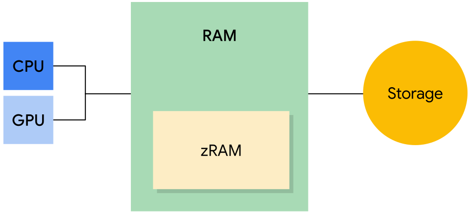

> version：2022/11/13
>
> review：

目录

[TOC]

# 笔记简介

介绍 Android 如何为系统和用户应用分配内存的基础知识，还说明了操作系统如何应对低内存情况。

# 关键词 & 概念

# 一、进程间的内存分配

Android 系统在运行时会尝试利用所有可用内存。例如，系统会在应用关闭后将其保留在内存中，以便用户快速切回到这些应用。因此，通常情况下，Android 设备在运行时几乎没有可用的内存。若要在重要系统进程和许多用户应用之间正确分配内存，内存管理至关重要。

本文介绍会 Android 如何为系统和用户应用分配内存的基础知识，另外还说明了操作系统如何应对低内存情况。

# 二、内存类型

Android 设备包含三种不同类型的内存：RAM、zRAM 和存储器。请注意，CPU 和 GPU 访问同一个 RAM。

**图 1.** 内存类型 - RAM、zRAM 和存储器

- RAM 是最快的内存类型，但其大小通常有限。高端设备通常具有最大的 RAM 容量。
- zRAM 是用于交换空间的 RAM 分区。所有数据在放入 zRAM 时都会进行压缩，然后在从 zRAM 向外复制时进行解压缩。这部分 RAM 会随着页面进出 zRAM 而增大或缩小。设备制造商可以设置 zRAM 大小上限。
- 存储器中包含所有持久性数据（例如文件系统等），以及为所有应用、库和平台添加的对象代码。存储器比另外两种内存的容量大得多。在 Android 上，存储器不像在其他 Linux 实现上那样用于交换空间，因为频繁写入会导致这种内存出现损坏，并缩短存储媒介的使用寿命。

## 内存页面

RAM 分为多个“页面”。通常，每个页面为 4KB 的内存。

系统会将页面视为“可用”或“已使用”。可用页面是未使用的 RAM。已使用的页面是系统目前正在使用的 RAM，并分为以下类别：

- 缓存页：有存储器中的文件（例如代码或内存映射文件）支持的内存。缓存内存有两种类型：
  - 私有页：由一个进程拥有且未共享
    - 干净页：存储器中未经修改的文件副本，可由 [`kswapd`](https://developer.android.google.cn/topic/performance/memory-management#kswapd) 删除以增加可用内存
    - 脏页：存储器中经过修改的文件副本；可由 `kswapd` 移动到 zRAM 或在 zRAM 中进行压缩以增加可用内存
  - 共享页：由多个进程使用
    - 干净页：存储器中未经修改的文件副本，可由 `kswapd` 删除以增加可用内存
    - 脏页：存储器中经过修改的文件副本；允许通过 `kswapd` 或者通过明确使用 [`msync()`](https://developer.android.google.cn/reference/android/system/Os#msync(long,%20long,%20int)) 或 [`munmap()`](https://developer.android.google.cn/reference/android/system/Os#munmap(long,%20long)) 将更改写回存储器中的文件，以增加可用空间
- 匿名页：没有存储器中的文件支持的内存（例如，由设置了MAP_ANONYMOUS标志的`mmap()`进行分配）
  - 脏页：可由 `kswapd` 移动到 zRAM/在 zRAM 中进行压缩以增加可用内存

> **注意**：干净页包含存在于存储器中的文件（或文件一部分）的精确副本。如果干净页不再包含文件的精确副本（例如，因应用操作所致），则会变成脏页。干净页可以删除，因为始终可以使用存储器中的数据重新生成它们；脏页不能删除，否则数据将会丢失。

随着系统积极管理 RAM，可用和已使用页面的比例会不断变化。本部分介绍的概念对于管理内存不足的情况至关重要。本文档的下一部分将对这些概念进行更详细的说明。

# 内存不足管理

Android 有两种处理内存不足情况的主要机制：内核交换守护进程和低内存终止守护进程。

## 内核交换守护进程

内核交换守护进程 (`kswapd`) 是 Linux 内核的一部分，用于将已使用内存转换为可用内存。当设备上的可用内存不足时，该守护进程将变为活动状态。Linux 内核设有可用内存上下限阈值。当可用内存降至下限阈值以下时，`kswapd` 开始回收内存。当可用内存达到上限阈值时，`kswapd` 停止回收内存。

`kswapd` 可以删除干净页来回收它们，因为这些页受到存储器的支持且未经修改。如果某个进程尝试处理已删除的干净页，系统会将该页面从存储器复制到 RAM。此操作称为“请求分页”。

**图 2.** 由存储器支持的干净页已删除

`kswapd` 可以将缓存的私有脏页和匿名脏页移动到 zRAM 进行压缩。这样可以释放 RAM 中的可用内存（可用页面）。如果某个进程尝试处理 zRAM 中的脏页，该页将被解压缩并移回到 RAM。如果与压缩页面关联的进程被终止，该页面将从 zRAM 中删除。

如果可用内存量低于特定阈值，系统会开始终止进程。

**图 3.** 脏页被移至 zRAM 并进行压缩

## 低内存终止守护进程

很多时候，`kswapd` 不能为系统释放足够的内存。在这种情况下，系统会使用 [`onTrimMemory()`](https://developer.android.google.cn/reference/android/content/ComponentCallbacks2#onTrimMemory(int)) 通知应用内存不足，应该减少其分配量。如果这还不够，内核会开始终止进程以释放内存。它会使用低内存终止守护进程 (LMK) 来执行此操作。

LMK 使用一个名为 [`oom_adj_score`](https://android.googlesource.com/platform/system/core/+/master/lmkd/README.md) 的“内存不足”分值来确定正在运行的进程的优先级，以此决定要终止的进程。最高得分的进程最先被终止。后台应用最先被终止，系统进程最后被终止。下表列出了从高到低的 LMK 评分类别。评分最高的类别，即第一行中的项目将最先被终止：

**图 4.** Android 进程，高分在上，低分在下

以下是上表中各种类别的说明：

- 后台应用：之前运行过且当前不处于活动状态的应用。LMK 将首先从具有最高 `oom_adj_score` 的应用开始终止后台应用。
- 上一个应用：最近用过的后台应用。上一个应用比后台应用具有更高的优先级（得分更低），因为相比某个后台应用，用户更有可能切换到上一个应用。
- 主屏幕应用：这是启动器应用。终止该应用会使壁纸消失。
- 服务：服务由应用启动，可能包括同步或上传到云端。
- 可觉察的应用：用户可通过某种方式察觉到的非前台应用，例如运行一个显示小界面的搜索进程或听音乐。
- 前台应用：当前正在使用的应用。终止前台应用看起来就像是应用崩溃了，可能会向用户提示设备出了问题。
- 持久性（服务）：这些是设备的核心服务，例如电话和 Wi-Fi。
- 系统：系统进程。这些进程被终止后，手机可能看起来即将重新启动。
- 原生：系统使用的极低级别的进程（例如，`kswapd`）。

设备制造商可以更改 LMK 的行为。

## 计算内存占用量

内核会跟踪系统中的所有内存页面。

**图 5.** 不同进程使用的页面

在确定应用使用的内存量时，系统必须考虑共享的页面。访问相同服务或库的应用将共享内存页面。例如，Google Play 服务和某个游戏应用可能会共享位置信息服务。这样便很难确定属于整个服务和每个应用的内存量分别是多少。

**图 6.** 由两个应用共享的页面（中间）

如需确定应用的内存占用量，可以使用以下任一指标：

- 常驻内存大小 (RSS)：应用使用的共享和非共享页面的数量
- 按比例分摊的内存大小 (PSS)：应用使用的非共享页面的数量加上共享页面的均匀分摊数量（例如，如果三个进程共享 3 MB，每个进程的 PSS 为 1 MB）
- 独占内存大小 (USS)：应用使用的非共享页面数量（不包括共享页面）

如果操作系统想要知道所有进程使用了多少内存，那么 PSS 非常有用，因为页面只会统计一次。计算 PSS 需要花很长时间，因为系统需要确定共享的页面以及共享页面的进程数量。RSS 不区分共享和非共享页面（因此计算起来更快），更适合跟踪内存分配量的变化。

## 其他资源

- [内存管理概览](https://developer.android.google.cn/topic/performance/memory-overview)
- [进程和应用生命周期](https://developer.android.google.cn/guide/components/activities/process-lifecycle)
- [了解 Android 内存使用情况 - Google I/O 大会演讲](https://www.youtube.com/watch?v=w7K0jio8afM)
- [Android 内存和游戏 - Google I/O 大会演讲](https://www.youtube.com/watch?v=Do7oYWwOXTk&t=314s)
- [Android 低内存终止守护进程](https://android.googlesource.com/platform/system/core/+/master/lmkd/README.md)

# 相关问题

Q：

Q：

Q：

Q：

Q：

Q：

Q：

# 总结

1、

## 【精益求精】我还能做（补充）些什么？

1、

# 脑图

# 参考

1、[进程间的内存分配](https://developer.android.google.cn/topic/performance/memory-management)

2、
