# 17.5内存分析工具MAT

在进行内存分析时，我们可以使用MemoryMonitor和HeapDump观察内存的使用情况，使用Allocation Tracker跟踪内存分配的情况，也可以通过这些工具来找到疑似发生内存泄漏的位置。但是如果想要深入地进行分析并确定内存泄漏，就要分析疑似发生内存泄漏时所生成的堆存储文件。堆存储文件可以使用DDMS或者MemoryMonitor来生成，输出的文件格式为hprof，而MAT就是分析堆存储文件的。MAT全称为Memory Analysis Tool，是对内存进行详细分析的工具，它是Eclipse的插件，如果用AndroidStudio进行开发则需要单独下载它，下载地址为http://eclipse.org/mat，这里讲解的MAT的版本为1.6.1。

## 17.5.1生成hprof文件

MAT用来分析hprof文件，首先我们要学习如何生成hprof文件，主要有两种方式，分别是DDMS生成hprof文件和MemoryMonitor生成hprof文件。

### 1.准备内存泄漏的代码

我们需要准备一段发生内存泄漏的代码，如下所示：

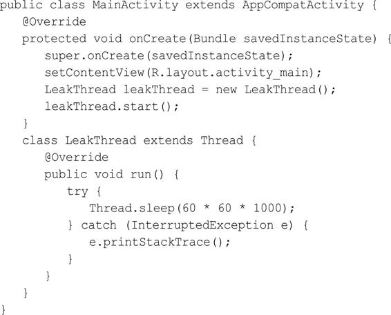

上面的代码是很典型的内存泄漏的例子，原因就是非静态内部类LeakThread持有外部类MainActivity的引用，LeakThread中做了耗时操作，导致MainActivity无法被释放。

### 2.DDMS生成hprof文件

生成hprof文件主要分为以下几个步骤：

（1）在AndroidStudio中打开DDMS，运行程序。

（2）在Devices中选择要分析的应用程序进程，单击UpdateHeap按钮（一半是绿色的圆柱体）开始进行追踪。

（3）进行可能发生内存问题的操作（本文的例子就是不断地切换横竖屏）。

（4）单击DumpHPROPFile按钮结束追踪，生成并保存hprof文件，如图17-14所示。

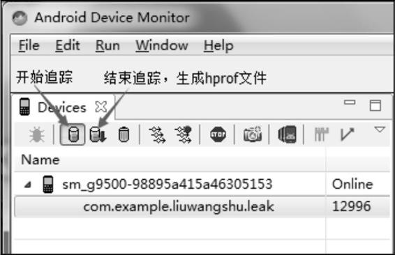

图17-14DDMS生成hprof文件DDMS生成的hprof文件并不是标准的，还需要将它转换为标准的hprof文件，这样才会被MAT识别从而进行分析，可以使用SDK自带的hprof-conv进行转换，它的路径在sdk/platform-tools中，进入到该路径执行以下语句即可：

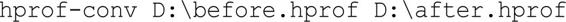

其中D：\before.hprof是要转换的hprof文件路径，D：\after.hprof则是转换后hprof文件的保存路径。

### 3.MemoryMonitor生成hprof文件

除了用DDMS来生成hprof文件外，还可以用AS的MemoryMonitor来生成hprof文件。生成hprof文件主要分为以下几个步骤：

（1）在AndroidMonitor中选择要分析的应用程序进程。

（2）进行可能发生内存问题的操作（本文的例子就是不断地切换横竖屏）。

（3）单击DumpJavaHeap按钮，生成hprof文件，如图17-15所示。

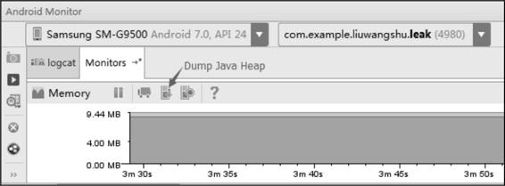

图17-15MemoryMonitor生成hprof文件

MemoryMonitor生成的hprof文件也不是标准的，AS提供了便捷的转换方式：MemoryMonitor生成的hprof文件都会显示在AS左侧的Captures标签中，在Captures标签中选择要转换的hprof文件，并单击鼠标右键，在弹出的菜单中选择Exporttostandard.hprof选项，即可导出标准的hprof文件，如图17-16所示。

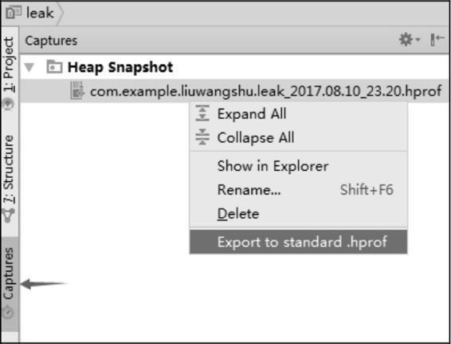

图17-16导出标准的hprof文件

## 17.5.2MAT分析hprof文件

用MAT打开标准的hprof文件，选择Leak Suspects Report选项，这时MAT就会生成报告，这个报告分为两个标签页，一个是Overview，另一个是Leak Suspects（内存泄漏猜想），如图17-17所示。

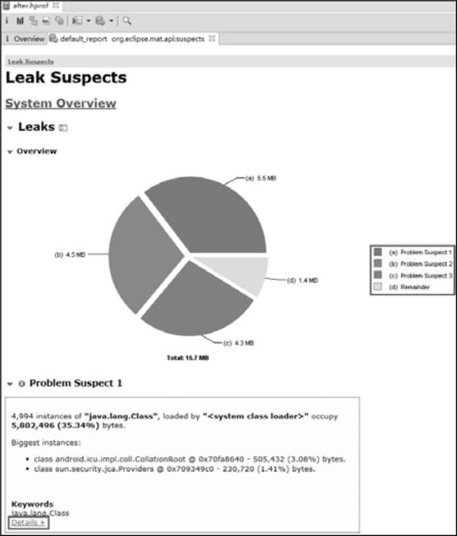

图17-17生成报告图

​	在LeakSuspects中给出了MAT认为可能出现内存泄漏问题的地方，图17-17共给出了3个内存泄漏猜想，通过单击每个内存泄漏猜想的Details可以看到更深入的分析清理情况。如果内存泄漏不是特别明显，通过Leak Suspects很难发现内存泄漏的位置。

​	打开Overview标签页，首先看到的是一个饼状图，它主要用来显示内存的消耗，饼状图的彩色区域代表被分配的内存，灰色区域则是空闲内存，单击每个彩色区域可以看到这块区域的详细信息，如图17-18所示。

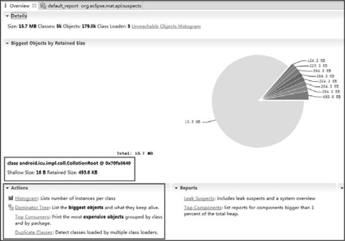

17-18Overview标签页

再往下看，Actions一栏的下面列出了MAT提供的4种Action，其中分析内存泄漏最常用的就是Histogram和Dominator Tree。我们单击Actions中给出的链接或者在MAT工具栏中单击相应的选项就可以打开Dominator Tree和Histogram，MAT工具栏如图17-19所示。其中左边第二个选项是Histogram，第三个选项是Dominator Tree，第四个选项是OQL，下面分别对它们进行介绍。

图17-19MAT工具栏

### 17.5.2.1Dominator Tree

DominatorTree意思为支配树，从名称就可以看出DominatorTree更善于去分析对象的引用关系，如图17-20所示。

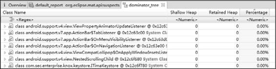

图17.20DominatorTree

- Shallow Heap：对象自身占用的内存大小，不包括它引用的对象。如果是数组类型的对象，它的大小由数组元素的类型和数组长度决定。如果是非数组类型的对象，它的大小由其成员变量的数量和类型决定。
- Retained Heap：一个对象的Retained Set包含对象所占内存的总大小。换句话说，RetainedHeap就是当前对象被GC后，从Heap上总共能释放掉的内存。

Retained Set指的是这个对象本身和它持有引用的对象以及这些引用对象的RetainedSet所占内存大小的总和，引用树官方的图解如图17-21所示。

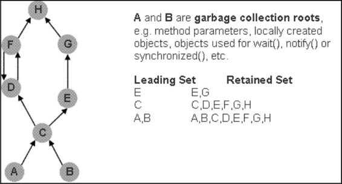

图17-21引用树官方的图解

从图17-20中可以看出E的Retained Set为E和G。C的RetainedSet为C、D、E、F、G、H。MAT所定义的支配树就是从图17-21所示的引用树演化而来。在引用树当中，如果一条到Y的路径必然会经过X，称为X支配Y。X直接支配Y则指的是在所有支配Y的对象中，X是Y最近的一个对象。支配树反映的就是这种直接支配关系，在支配树中，父节点直接支配子节点。如图17-22所示就是官方提供的一个从引用树到支配树的转换示意图。

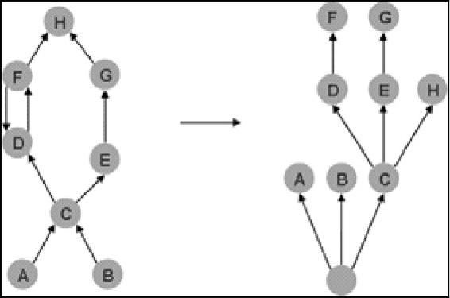

图17-22引用树到支配树的转换示意图

C直接支配D、E，因此C是D、E的父节点，这一点根据上面的阐述很容易得出结论。C直接支配H，这可能会有些疑问，能到达H主要有两条路径，而这两条路径FD和GE都不是必须要经过的节点，只有C满足了这一点，因此C直接支配H，C就是H的父节点。通过支配树，我们就可以很容易地分析一个对象的RetainedSet，比如E被回收，则会释放E、G的内存，而不会释放H的内存，因为F可能还引用着H，只有C被回收，H的内存才会被释放。这里对支配树进行了讲解，我们可以得出一个结论：通过MAT提供的Dominator Tree，可以很清晰地得到一个对象的直接支配对象，如果直接支配对象中出现了不该有的对象，就说明发生了内存泄漏。在DominatorTree的顶部Regex可以输入过滤条件（支持正则表达式），如果是查找Activity内存泄漏，可以在Regex中输入Activity的名称，比如这个例子可以输入MainActivity，Dominator Tree的信息如图17-23所示。

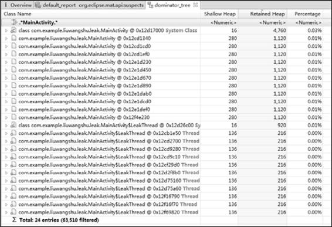

图17-23Dominator Tree的信息

在Dominator Tree中列出了很多MainActivity实例，MainActivity是不该有这么多实例的，基本可以断定发生了内存泄漏，具体内存泄漏的原因，可以查看GC引用链。在MainActivity选项上单击鼠标右键，在弹出的菜单中选择Path To GCRoots选项，如图17-24所示。

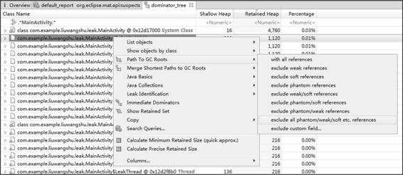

图17-24选择Path To GCRoots选项

Path To GCRoots选项用来表示从对象到GCRoots的路径，根据引用类型会有多种选项，比如withallreferences就是包含所有的引用，这里我们选择excludeallphantom/weak/softetc.references，因为这个选项排除了虚引用、弱引用和软引用，这些引用一般是可以被回收的，这时MAT就会给出MainActivity的GC引用链，如图17-25所示。

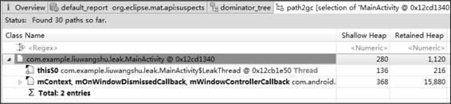

图17-25MainActivity的GC引用链

引用MainActivity的是LeakThread，this$0的含义就是内部类自动保留的一个指向所在外部类的引用，而这个外部类就是MainActivity，这将会导致MainActivity无法被GC。

### 17.5.2.2Histogram

Histogram与DominatorTree不同的是，DominatorTree是从对象实例的角度进行分析，注重引用关系分析，而Histogram则从类的角度进行分析，注重量的分析。Histogram中的内容如图17-26所示。

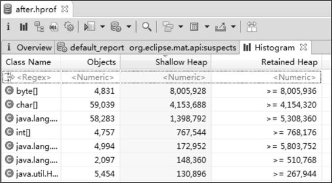

图17-26Histogram中的内容在Histogram中共包含4列数据，关于ShallowHeap和RatainedHeap的含义在17.5.2.1节已经介绍过了，剩余的ClassName代表类名，Objects代表对象实例的个数。在Histogram的顶部Regex同样可以输入过滤条件，这里同样输入MainActivity，效果如图17-27所示。

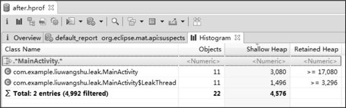

图17-27顶部Regex输入MainActivity

MainActivity和LeakThread实例各为11个，基本上可以断定发生了内存泄漏。具体内存泄漏的原因，同样可以查看GC引用链。在MainActivity选项上单击鼠标右键，在弹出的菜单中选择MergeShortestPathstoGCroots，并在选项中选择excludeallphantom/weak/softetc.references，PathToGCRoots的信息如图17-28所示。

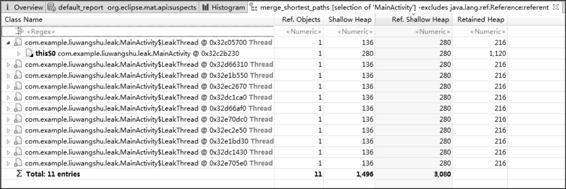

图17-28PathToGCRoots的信息

Histogram是从类的角度进行分析，而PathToGCRoots是用来分析单个对象的，因此在Histogram中无法使用PathToGCRoots查询，可以使用MergeShortestPathstoGCroots查询，它表示从GCroots到一个或一组对象的公共路径。得出的结果和17.5.2.1节是相同的，引用MainActivity的是LeakThread，这导致了MainActivity无法被GC。

## 17.5.2.3OQL

OQL全称为ObjectQueryLanguage，类似于SQL语句的查询语言，能够用来查询当前内存中满足指定条件的所有对象。它的查询语句的基本格式如下：

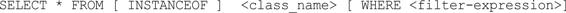

当输入select*frominstanceofandroid.app.Activity并按下F5键时（或者单击工具栏中的红色叹号），将当前内存中所有Activity都显示出来，如图17-29所示。

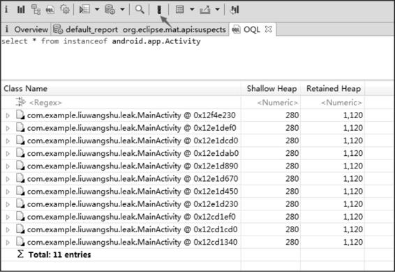

图17-29OQL查询

如果Activity比较多，或者你想查找具体的类，可以直接输入具体类的完整名称：

通过查看GC引用链也可以找到内存泄漏的原因。关于OQL语句有很多用法，这里就不过多介绍了，具体可以查看官方文档：http：//help.eclipse.org/luna/index.jsp？topic=/org.eclipse.mat.ui.help/reference/oqlsyntax.html。

## 17.5.2.4对比hprof文件

因为这一节的例子很简单，可以通过上面的方法可以找到内存泄漏的原因，但是复杂的情况就需要通过对比hprof文件来进行分析了。使用步骤如下：

（1）操作应用，生成第一个hprof文件。

（2）进行一段时间操作，再生成第二个hprof文件。

（3）用MAT打开这两个hprof文件。

（4）将第一个和第二个hprof文件的DominatorTree或者Histogram添加到CompareBasket中，如图17-30所示。

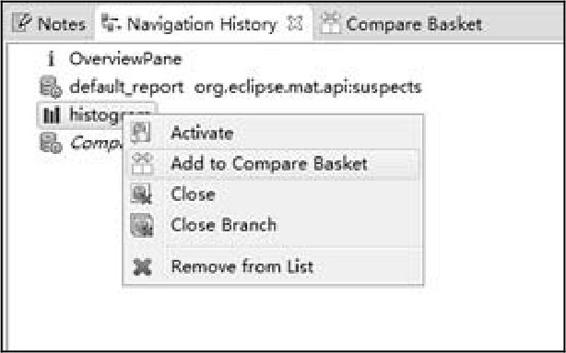

图17-30添加到CompareBasket的操作

（5）在CompareBasket中单击红色叹号按钮生成ComparedTables，ComparedTables如图17-31所示。图17-31ComparedTables

（6）在ComparedTables也有顶部Regex，输入MainActivity进行筛选，如图17-32所示。

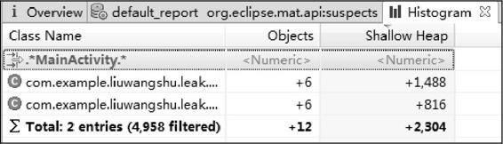

图17-32在Regex中筛选

MainActivity在这一过程中增加了6个，MainActivity的实例是不应该增加的，这说明发生了内存泄漏，可以通过查看GC引用链来找到内存泄漏的具体原因。除了上面的对比方法，Histogram还可以通过工具栏的对比按钮来进行对比，对比按钮见图17-33中的箭头指向。

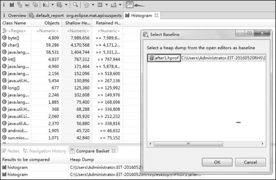

图17-33对比按钮

（7）生成的结果和ComparedTables类似，我们输入MainActivity进行筛选，如图17-34所示。

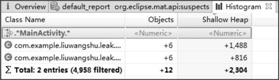

图17-34输入MainActivity进行筛选

可以看到第二个hprof文件比第一个hprof文件多了6个MainActivity实例。

MAT还有很多功能，这里也只介绍了常用的功能，其他的功能就需要读者在使用过程中去发现并积累。