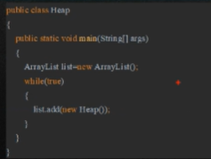

> version：2021/11/02
>
> review：


目录

[TOC]


# 一、内存泄漏

## 1、内存泄漏与内存溢出的区别

* 内存泄漏：指程序在申请内存后，被某个对象一直持有，导致无法释放已申请的内存空间。一次内存泄漏的危害可以忽略，但内存泄漏堆积后果很严重，无论多少内存，迟早会被占光。**内存泄漏的本质是该销毁的对象因为被其他引用持有，导致不能GC掉。**或者说，生命周期短的对象被生命周期长的引用持有。
* 内存溢出：指程序在申请内存时，没有足够的内存空间供其使用，出现out of memory。Android系统为每个应用程序申请到的内存有限，一般为64M或者128M等，我们可以在清单文件中进行配置，android:largeheap = "true" 从而给APP申请更大的内存空间。


虚拟机：JVM的作用是把平台无关的.class里面的字节码翻译成平台相关的机器码，来实现跨平台。Dalvik和Art时安卓中使用的虚拟机。
注：本地方法栈，属于native层，暂不需要管，它和Java层是不一样的垃圾回收机制。

内存溢出会发生在堆内存和虚拟机栈：

* 堆内存溢出
  例1：
  
  例2：如生产者与消费者模型，如注册回调，忘记注销。添加到队列，忘记控制队列大小。
  例3：fastjson解析（间接）循环引用。（这里例子还不是很理解，没有遇到过）

* 栈（虚拟栈）内存溢出
  方法递归。

OOM会发生在方法区、堆内存和虚拟机栈。

## 2、内存泄漏场景（6大类）

**（1）单例使用不当（生命周期不一样）**

说明：单例的静态特性使得它的生命周期同应用的生命周期一样长，如果一个对象已经没有用处了，但是单例还持有它的引用，那么在整个应用程序的生命周期它都不能正常被回收，从而导致内存泄漏。

```java
public class AppSetting {
    private static AppSetting mInstance;
    private Context mContext;

    private AppSetting(Context context) {
        this.mContext = context;
    }

    public static AppSetting getInstance(Context context) {
        if (mInstance == null) {
            mInstance = new AppSetting(context);
        }
        return mInstance;
    }
}

//使用
public class MainActivity extends AppCompatActivity {

    @Override
    protected void onCreate(Bundle savedInstanceState) {
        super.onCreate(savedInstanceState);
        setContentView(R.layout.activity_main);

        AppSetting.getInstance(this);
    }
}
```

解决：
将AppSetting修改如下：

```java
public class AppSetting {
    private static AppSetting mInstance;
    private Context mContext;

    private AppSetting(Context context) {
        this.mContext = context.getApplicationContext();
    }

    public static AppSetting getInstance(Context context) {
        if (mInstance == null) {
            mInstance = new AppSetting(context);
        }
        return mInstance;
    }
}
```

**（2）静态变量导致内存泄漏**
静态变量存储在方法区，它的生命周期从类加载开始，到整个进程结束。一旦静态变量初始化后，它所持有的引用只有等到进程结束才会释放。

```java
public class MainActivity extends AppCompatActivity {
    private static Info sInfo;

    @Override
    protected void onCreate(Bundle savedInstanceState) {
        super.onCreate(savedInstanceState);
        setContentView(R.layout.activity_main);

        sInfo = new Info(this);
    }
}

class Info {
    Activity mActivity;

    public Info(Activity activity) {
        mActivity = activity;
    }
}
```

分析：
Info作为Activity的静态成员，并且持有Activity的引用，但是sInfo作为静态变量，生命周期肯定比Activity长。所以当Activity退出后，sInfo仍然引用了Activity，导致Activity不能被回收，引起内存泄漏。
解决：
在Activity退出时，可以在onDestory中，把静态引用变量置为null。

```java
@Override
    protected void onDestroy() {
        super.onDestroy();
        if (sInfo != null) {
            sInfo = null;
        }
    }
```

**（3）非静态内部类导致内存泄漏**
非静态内部类（包括匿名内部类）默认就会持有外部类的引用，当非静态内部类对象的生命周期比外部类对象的生命周期长时，就会导致内存泄漏。常见于Handler、Thread、AsyncTask。
例1：Handler

```java
public class MainActivity1 extends AppCompatActivity {
    @Override
    protected void onCreate(Bundle savedInstanceState) {
        super.onCreate(savedInstanceState);
        setContentView(R.layout.activity_main);
        start();
    }

    private void start() {
        Message msg = Message.obtain();
        msg.what = 1;
        mHandler.sendMessage(msg);
    }

    private Handler mHandler = new Handler() {
        @Override
        public void handleMessage(@NonNull Message msg) {
            switch (msg.what) {

            }
        }
    };
}
```

分析：
在此例中，mHandler会默认持有外部类（MainActivity1）的引用，导致MainActivity1不能被回收，引起内存泄漏。
解决：

通过弱引用解决。

```java
public class MainActivity1 extends AppCompatActivity {
    @Override
    protected void onCreate(Bundle savedInstanceState) {
        super.onCreate(savedInstanceState);
        setContentView(R.layout.activity_main);
        start();
    }

    private void start() {
        Message msg = Message.obtain();
        msg.what = 1;
        mHandler.sendMessage(msg);
    }

    private Handler mHandler = new MyHandler(this);

    private static class MyHandler extends Handler {
        private WeakReference<MainActivity1> mActivity1WeakReference;

        public MyHandler(MainActivity1 activity1) {
            mActivity1WeakReference = new WeakReference<>(activity1);
        }

        @Override
        public void handleMessage(@NonNull Message msg) {
            MainActivity1 activity1 = mActivity1WeakReference.get();
            switch (msg.what) {
                //处理逻辑
            }
        }
    }
}
```

例2：Thread

```java
public class MainActivity1 extends AppCompatActivity {
    @Override
    protected void onCreate(Bundle savedInstanceState) {
        super.onCreate(savedInstanceState);
        setContentView(R.layout.activity_main);
        new Thread(new Runnable() {
            @Override
            public void run() {
                while (true) {
                    //处理任务
                    SystemClock.sleep(1000L);
                }
            }
        }).start();
    }
}
```

分析：
1、内部匿名的Thread实例会长久运行，不会被系统GC回收。
2、非静态内部类会持有外部类的引用。
在此例中，即使MainActivity1退出了，但是始终有一个thread持有它的引用，导致MainActivity1不能被回收，引起内存泄漏。
解决：

1、加上static后，内部类就不会持有MainActivity1的隐式引用了。

```java
public class MainActivity1 extends AppCompatActivity {
    @Override
    protected void onCreate(Bundle savedInstanceState) {
        super.onCreate(savedInstanceState);
        setContentView(R.layout.activity_main);
        new MyThread().start();
    }

    private static class MyThread extends Thread {
        @Override
        public void run() {
            while (true) {
                //处理任务
                SystemClock.sleep(1000L);
            }
        }
    }
}
```

2、解决Thread无法回收问题

```java
public class MainActivity1 extends AppCompatActivity {
    private MyThread mMyThread;

    @Override
    protected void onCreate(Bundle savedInstanceState) {
        super.onCreate(savedInstanceState);
        setContentView(R.layout.activity_main);

        mMyThread = new MyThread();
        mMyThread.start();
    }

    private static class MyThread extends Thread {
        private boolean mIsRunning = false;

        @Override
        public void run() {
            mIsRunning = true;
            while (mIsRunning) {
                //处理任务
                SystemClock.sleep(1000L);
            }
        }

        public void close() {
            mIsRunning = false;
        }
    }

    @Override
    protected void onDestroy() {
        super.onDestroy();
        mMyThread.close();
    }
}
```

分析：
给Thread添加结束的标志位。当thread任务执行完成后，Java会帮我们把回收线程。因此，我们要养成为thread设置退出逻辑的习惯，保证thread可以运行结束。
注：
Java threads会一直存在，只有当线程运行完成或被杀死掉，线程才会被回收。

（4）未取消注册或回调导致内存泄漏
我们在Activity中注册广播后，如果在Activity销毁后不取消注册，那么这个广播会一直存在，同上面所说的非静态内部类一样持有Activity引用，导致内存泄漏。因此注册广播后一定要在Activity销毁后取消注册。

```java
public class MainActivity extends AppCompatActivity {
    @Override
    protected void onCreate(Bundle savedInstanceState) {
        super.onCreate(savedInstanceState);
        setContentView(R.layout.activity_main);
        this.registerReceiver(mReceiver, new IntentFilter());
    }

    private BroadcastReceiver mReceiver = new BroadcastReceiver() {
        @Override
        public void onReceive(Context context, Intent intent) {
            // 收到广播时的处理
        }
    };

    @Override
    protected void onDestroy() {
        super.onDestroy();
        this.unregisterReceiver(mReceiver);
    }
}
```

（5）资源未关闭或释放导致内存泄漏
在使用流等资源时要及时关闭，这些资源在进行读写时通常都使用了缓冲，如果不及时关闭，这些缓存对象就会一直被占用，引起内存泄漏。


# 相关问题

## 一、概念

<font color='orange'>Q：内存溢出和内存泄漏的区别</font>


<font color='orange'>Q：内存溢出，内存抖动，内存泄漏你都碰到过吗？ 怎么解决的？如何区分这几种情况？ 怎么解决由内存泄漏而导致的内存溢出？</font>


## 二、检测

<font color='orange'>Q：内存泄漏分析，LeakCanary的原理，泄漏对象是如何找到引用链的</font>


<font color='orange'>Q：怎么检查内存泄漏</font>


<font color='orange'>Q：内存泄漏检测工具</font>


## 三、场景

<font color='orange'>Q：哪些场景会出现内存泄漏（内存泄露的种类）</font>


<font color='orange'>Q：说一下Context和内存泄露</font>


<font color='orange'>Q：为什么说Handler用成员内部类会内存泄漏?Activity不是已经到gcroot被切断了吗?还有静态context持有Activity的引用会内存泄漏,必须要持有怎么办?(及时释放</font>


<font color='orange'>Q：Handler可能会导致内存泄露，为什么。从cgRoot讲一下;怎么避免这种情况</font>


## 四、解决

<font color='orange'>Q：内存泄露以及避免措施</font>


<font color='orange'>Q：如何分析内存泄漏及如何处理</font>


<font color='orange'>Q：发现了内存泄露一般怎么解决分析，有没有碰到过系统服务内存泄露的问题？</font>


<font color='orange'>Q：哪些场景会出现内存泄漏（内存泄露的种类）</font>

（1）单例造成的内存泄漏
（2）非静态内部类创建静态实例造成的内存泄漏
（3）Handler造成的内存泄漏
（4）资源对象未关闭：File、Bitmap等
（5）线程造成的内存泄漏
（6）集合容器中的内存泄漏
（7）使用ListView时造成的内存泄漏
（8）WebView造成的泄漏

（9）Binder泄漏，在bind方法时，new Binder作为返回，导致Binder泄漏。

<font color='orange'>Q：怎么避免内存泄漏</font>


<font color='orange'>Q：处理过哪些内存泄漏</font>

Handler泄漏，使用观察者模式拿到Observer后，没有销毁。

<font color='orange'>Q：聊聊内存溢出</font>

（1）内存溢出原因：
①内存中加载的数据量过于庞大，如一次从数据库取出过多数据；
②集合类中有对对象的引用，使用完后未清空，使得JVM不能回收；
③代码中存在死循环或循环产生过多重复的对象实体
④使用的第三方软件中的BUG；
⑤启动参数内存值设定的过小
（2）内存溢出的解决方案：
①第一步，修改JVM启动参数，直接增加内存。(-Xms，-Xmx参数一定不要忘记加。)
②第二步，检查错误日志，查看“OutOfMemory”错误前是否有其它异常或错误。
③第三步，对代码进行走查和分析，找出可能发生内存溢出的位置。


什么是内存抖动，产生的本质是什么？（年轻堆与老年堆机制）

你是怎么处理crash异常的，对于不能定位行数的问题怎么解决

你是怎么对内存进行管理的？（Bitmap，对象）


# 总结

1、

## 【精益求精】我还能做（补充）些什么？

1、


# 脑图


# 参考

1、[面试官：内存泄漏连环问。被问懵了？来看看这部视频_哔哩哔哩 (゜-゜)つロ 干杯~-bilibili](https://www.bilibili.com/video/BV1ck4y1r7PK?from=search&seid=8113707547361918983)
2、[内存泄露：Thread是如何造成内存泄露的 - 简书 (jianshu.com)](https://www.jianshu.com/p/f50366145b4b)

