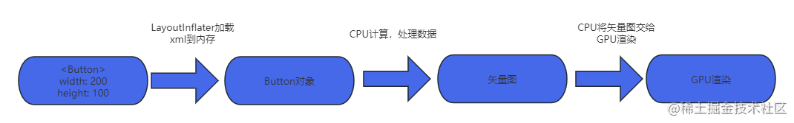
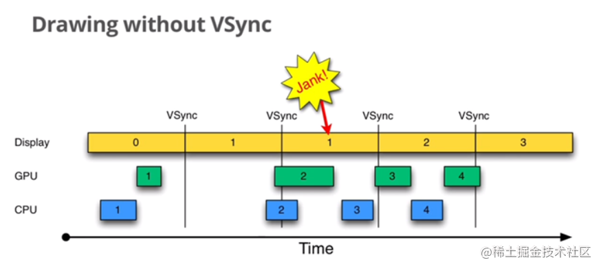
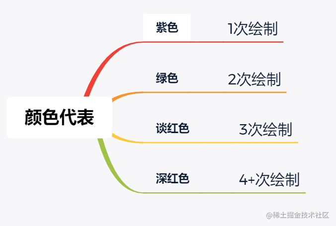
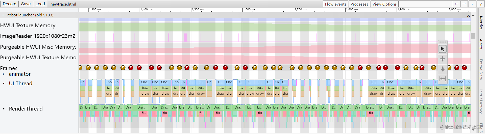
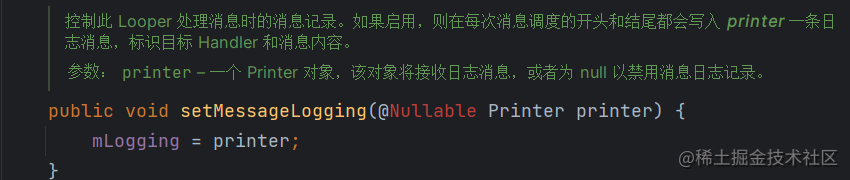
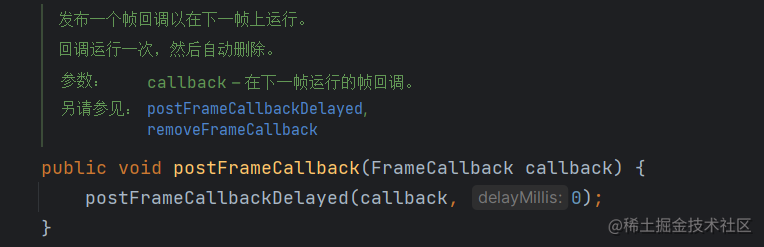
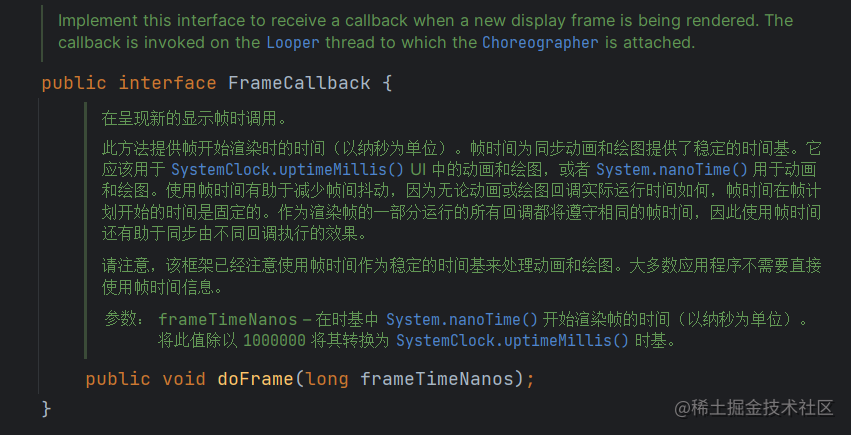

> version：2024/08/04
>
> review：


# 一、卡顿问题本质分析

## 1.1、XML布局显示到屏幕

在分析卡顿问题本质原因之前，我们先简单了解一下XML布局加载以及到屏幕上显示。



Android的布局加载到展示，其实就是将对应的XML加载到内存，由框架解析成对应的控件对象，然后CPU根据控件对象携带的自己属性数据处理成多维图形。最终通过OPENGL调用GPU，GPU将多维图形进行栅格化处理渲染形成。

## 1.2、屏幕刷新的机制



Android Display 系统是通过VSync(垂直同步)信号来控制屏幕的刷新。每一个VSync过来时，就会从对应的buffer中取出CPU/GPU处理好的帧数据进行展示。所以整个流程必须要在一个VSync信号来临之前处理，按照60fps 1秒60帧的屏幕刷新计算，一个VSync信号大概就是16.66ms。所以整个流程就必须要在16.66ms内完成。如果这个时间点没有处理完就会导致漏帧、跳帧，严重的话就会造成画面的卡顿。

## 1.3、结论

从上述分析看，能造成卡顿的原因就是在规定的VSync信号的时间内CPU、GPU的渲染过程没有完成。而从1.1 XML加载到显示在屏幕这个流程上看，能造成CPU/GPU渲染超时的地方就以下三点：

- XML布局加载解析成对应控件对象耗时。
- CPU计算、处理数据耗时。
- GPU渲染耗时。

# 二、如何分析卡顿问题

## 2.1、使用工具分析

### 2.1.1、 先通过Android手机开发者选项中的调试GPU过渡绘制，看一下过渡绘制区域



### 2.1.2、使用Layout Inspector查看布局层次

### 2.1.3、使用systrace查看是否丢帧及丢帧时系统状态

- systrace使用：

python systrace.py –t 5 –a 包名 -o mynewtrace.html sched freq idle am wm gfx view dalvik input res

**注：systrace 只支持python2.x  同时需要下载python six包**

- systrace常用标签

> gfx --> 图形系统，包括surfacefilnger, VSync等
>
> input -->  分析滑动卡顿，按键、触摸的输入
>
> view --> view绘制相关信息
>
> am --> ActivityManager调用的相关信息
>
> wm --> WindowManage相关信息
>
> dalvik --> 虚拟机相关信息
>
> sched --> CPU调度相关信息
>
> disk --> IO相关
>
> res --> 资源加载相关信息

- systrace帧率球颜色

> 黄色 --> 漏帧=1帧
>
> 红色 --> 漏帧>1帧
>
> 绿色 --> 正常



- 线程执行状态颜色

> 绿色 --> 有时间片正在跑
>
> 蓝色 --> 等待CPU分配时间片执行
>
> 紫色 --> 可中断休眠 如GC
>
> 橙色 --> 不可中断的休眠，如在等待IO
>
> 白色 --> 在休眠，如线程被互斥锁阻塞、Binder阻塞、sleep、wait

### 2.1.4、利用Looper机制

Looper 支持在消息执行的前后打印日志。可以通过 `setMessageLogging()` 方法设置 Printer 来输出日志。在自定义的 Printer 中记录开始时间和结束时间，通过这两个时间可以计算出是否有卡顿问题，并且可以直接输出引起卡顿的堆栈日志。

```java
public static void loop() {
    final Looper me = myLooper();
    ...
    final MessageQueue queue = me.mQueue;
   ...

    for (;;) {
        Message msg = queue.next(); // might block
        if (msg == null) {
            // No message indicates that the message queue is quitting.
            return;
        }

        // This must be in a local variable, in case a UI event sets the logger
        final Printer logging = me.mLogging;
        if (logging != null) {
            logging.println(">>>>> Dispatching to " + msg.target + " " +
                    msg.callback + ": " + msg.what);
        }
...
        final long dispatchStart = needStartTime ? SystemClock.uptimeMillis() : 0;
        final long dispatchEnd;
        try {
            msg.target.dispatchMessage(msg);
            dispatchEnd = needEndTime ? SystemClock.uptimeMillis() : 0;
        } finally {
            if (traceTag != 0) {
                Trace.traceEnd(traceTag);
            }
        }
      ...
        if (logging != null) {
            logging.println("<<<<< Finished to " + msg.target + " " + msg.callback);
        }
        msg.recycleUnchecked();
    }
}
```



### 2.1.5、利用Choreographer监听帧率

Choreographer是协调屏幕刷新的，在这里会接收VSync信号，控制屏幕刷新。

Choreographer提供了一个postFrameCallback方法，因此通过FrameCallbck的回调时间戳，也可以计算出是否有漏帧





## Choreographer中的日志

如果 logcat 中出现以下日志，则说明主线程中做的耗时操作过多了。

> Choreographer           com.lizw.demos_androidcorelibs       I  Skipped 43 frames!  The application may be doing too much work on its main thread.

```kotlin
Log.i(TAG, "Skipped " + skippedFrames + " frames!  "
                                    + "The application may be doing too much work on its main "
                                    + "thread.");
```

# 三、优化思路

## 3.1、先利用手机GPU过渡绘制工具，查看是否有过渡绘制情况，过渡绘制情况又分为以下两种：

### 3.1.1、布局层次嵌套过深引起的过渡绘制

- 解决方案：

1. 优化布局层次，使布局扁平化
2. 使用include、merge、viewstub等标签优化
3. 使用 ConstraintLayout 约束布局

### 3.1.2、布局中存在溢出的背景色渲染

- 解决方案：

1. 找UI提供能解决方案的切图
2. 裁剪出没必要的绘制元素

## 3.2、通过systrace查询漏帧时，系统的工作状态。

这种时候的漏帧一般有可能时CPU过载被占用，或者线程被阻塞，binder阻塞等。

## 3.3、自己通过Looper机制实现或者使用成熟三方框架如BlockCanary、Matrix进行代码堆栈分析

# 案例分析


# 问题

<font color='orange'>Q：</font>


# 参考

[卡顿分析和UI渲染优化](https://juejin.cn/post/7393192749405945893)
