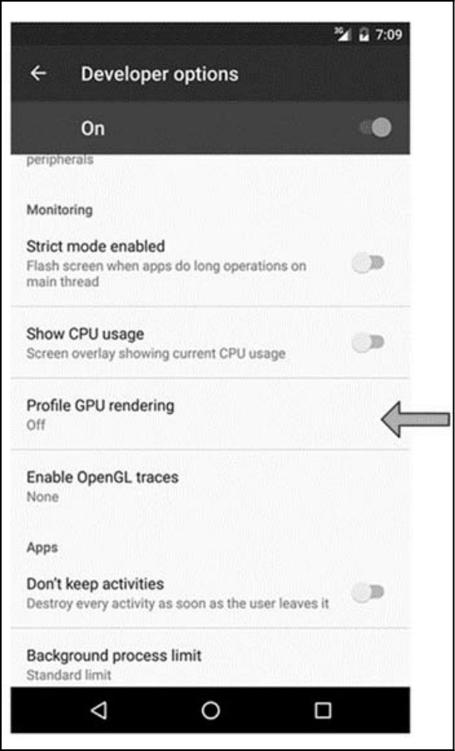
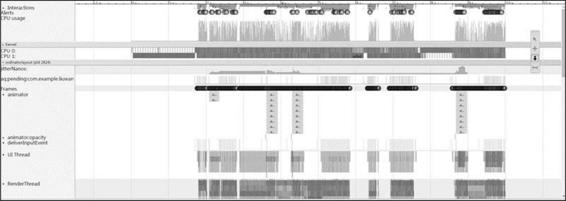
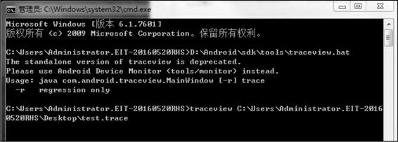

# 前言

- 在 `Android`开发中，性能优化策略十分重要
- 本文主要讲解性能优化中的**绘制优化**，希望你们会喜欢。

------

# 目录


示意图

------

# 1. 影响的性能

绘制性能的好坏 主要影响 ：`Android`应用中的**页面显示速度**

------

# 2. 如何影响性能

绘制影响`Android`性能的实质：**页面的绘制时间**

> 1个页面通过递归 完成测量 & 绘制过程

------

# 3. 优化思路

主要优化方向是：

1. 降低`View.onDraw（）`的复杂度
2. 避免过度绘制`（Overdraw）`

------

# 4. 具体优化方案

- 具体如下


示意图

- 下面，我将详细分析每种优化方案

### 4.1. 降低View.onDraw（）的复杂度

#### 4.1.1 onDraw（）中不要创建新的局部对象


示意图

#### 4.1.2 避免onDraw（）执行大量 & 耗时操作


示意图

### 4.2 避免过度绘制（Overdraw）

#### 4.2.1 过度绘制的简介


示意图

#### 4.2.2 过度绘制的表现形式

过度绘制 会导致屏幕显示的色块不同，具体如下


示意图

附：示例说明


示意图

#### 4.2.3 过度绘制的优化原则

很多 过度绘制是难以避免的，如 上述实例的 文字 & 背景导致的过度绘制，只能尽可能避免过度绘制：

1. 尽可能地控制 过度绘制的次数 =  `2` 次（绿色）以下，蓝色最理想
2. 尽可能避免 过度绘制的粉色 & 红色情况
3. 不允许 3 次以上的过度绘制（淡红色）面积 超过 屏幕大小的 1/4

#### 4.2.4 优化方案

1. 移除默认的 `Window` 背景
2. 移除 控件中不必要的背景
3. 减少布局文件的层级（嵌套）
4. 自定义控件View优化：使用 clipRect() 、 quickReject()

### 优化方案1： 移除默认的 Window 背景

- 背景：一般应用程序 默认 继承的主题 = `windowBackground` ，如默认的 Light 主题：


```xml
<style name="Theme.Light">
    <item name="isLightTheme">true</item>
    <item name="windowBackground">@drawable/screen_background_selector_light</item>
    ...
</style>
```

- 问题：一般情况下，该默认的 Window 背景基本用不上：因背景都自定义设置
   若不移除，则导致所有界面都多 1 次绘制
- 解决方案：移除默认的 Window 背景


```xml
// 方式1：在应用的主题中添加如下的一行属性
    <item name="android:windowBackground">@android:color/transparent</item>
    <!-- 或者 -->
    <item name="android:windowBackground">@null</item>

// 方式2：在 BaseActivity 的 onCreate() 方法中使用下面的代码移除
    getWindow().setBackgroundDrawable(null);
    <!-- 或者 -->
    getWindow().setBackgroundDrawableResource(android.R.color.transparent);
```

### 优化方案2：移除 控件中不必要的背景

如2个常见场景：

- 场景1：`ListView` 与 `Item`
   列表页`（ListView）` 与 其内子控件`（Item）`的背景相同 = 白色，故可移除子控件`（Item）`布局中的背景


示意图

- 场景2：`ViewPager` 与 `Fragment`
   对于1个`ViewPager`  + 多个 `Fragment` 组成的首页界面，若每个`Fragment` 都设有背景色，即 ViewPager 则无必要设置，可移除


示意图

关于更多场景，可使用工具 `Hierarchy View` 查看，具体请看文章： [过渡绘制的使用工具：Hierarchy View](https://links.jianshu.com/go?to=http%3A%2F%2Fandroidperformance.com%2F2015%2F01%2F13%2Fandroid-performance-optimization-overdraw-2.html)

### 优化方案3：减少布局文件的层级（减少不必要的嵌套）

- 原理：减少不必要的嵌套  ->> UI层级少 ->> 过度绘制的可能性低
- 优化方式：使用布局标签`<merge>` & 合适选择布局类型

> 具体请看文章：[Android性能优化：这是一份详细的布局优化 指南（含、、）](https://www.jianshu.com/p/4e665e96b590)

### 优化方案4：自定义控件View优化：使用 clipRect() 、 quickReject()

- ```
  clipRect()
  ```

  1. 作用：给 Canvas 设置一个裁剪区域，只有在该区域内才会被绘制，区域之外的都不绘制
  2. 实例说明：`DrawerLayout` 布局 = 左抽屉布局


示意图


```java
@Override
protected boolean drawChild(Canvas canvas, View child, long drawingTim
    // ...仅贴出关键代码

        // 1. 遍历 DrawerLayout 的 child view，拿到抽屉布局
        for (int i = 0; i < childCount; i++) {
            final View v = getChildAt(i);
            if (v == child || v.getVisibility() != VISIBLE
                    || !hasOpaqueBackground(v) || !isDrawerView(v)
                    || v.getHeight() < height) {
                continue;
            }
            // a. 若是左抽屉布局
            // 则取抽屉布局的右边界作为裁剪区的左边界、设置原主布局的裁剪区域，如上图裁剪区域
            if (checkDrawerViewAbsoluteGravity(v, Gravity.LEFT)) {
                final int vright = v.getRight();
                if (vright > clipLeft) clipLeft = vright;
            // b. 若是右抽屉布局
            // 则取抽屉布局的左边界作为裁剪区的右边界、设置原主布局的裁剪区域
            } else {
                final int vleft = v.getLeft();
                if (vleft < clipRight) clipRight = vleft;
            }
        }
        // 2. 通过clipRect（）设置原主布局的显示范围 = 裁剪区域，使其仅在上图中的红框区域（即不阻碍抽屉布局的区域）显示
       // 从而避免过度绘制
        canvas.clipRect(clipLeft, 0, clipRight, getHeight());
    }                
}
```

- ```
  quickreject()
  ```

  1. 作用：判断和某个矩形相交
  2. 具体措施：若判断与矩形相交，则可跳过相交的区域，从而减少过度绘制

### 4.3 其他优化方案


示意图

### 总结


示意图

至此，关于绘制优化的方案讲解完毕。

# 5.  布局调优工具

- 背景
   尽管已经注意到上述的优化策略，但实际开发中难免还是会出现布局性能的问题
- 解决方案
   使用 布局调优工具

> 此处主要介绍 常用的：`hierarchy viewer`、`Profile GPU Rendering`、`Systrace`

### 5.1 Hierarchy Viewer

- 简介
   `Android Studio` 提供的UI性能检测工具。
- 作用
   可视化获得UI布局设计结构 & 各种属性信息，帮助我们优化布局设计

> 即 ：方便查看`Activity`布局，各个`View`的属性、布局测量-布局-绘制的时间

- 具体使用
   [Hierarchy Viewer 使用指南](https://links.jianshu.com/go?to=http%3A%2F%2Fdeveloper.android.com%2Ftools%2Fdebugging%2Fdebugging-ui.html)

### 5.2 Profile GPU Rendering

- 简介
   一个 图形监测工具
- 作用
   渲染、绘制性能追踪

> 能实时反应当前绘制的耗时

- 具体使用
   横轴 = 时间、纵轴 = 每帧的耗时；随着时间推移，从左到右的刷新呈现

> 提供一个标准的耗时，如果高于标准耗时，就表示当前这一帧丢失


示意图

更详细使用请看：[ Profile GPU Rendering 使用指南 ](https://www.jianshu.com/p/061bb80025c7)

### 5.3 Systrace

- 简介
   `Android 4.1`以上版本提供的性能数据采样 & 分析工具
- 作用
   检测 `Android`系统各个组件随着时间的运行状态 & 提供解决方案

> 1. 收集 等运行信息，从而帮助开发者更直观地分析系统瓶颈，改进性能
>     检测范围包括：`Android` 关键子系统（如`WindowManagerService` 等 `Framework` 部分关键模块）、服务、View系统
> 2. 功能包括：跟踪系统的`I/O` 操作、内核工作队列、`CPU` 负载等，在 UI 显示性能分析上提供很好的数据，特别是在动画播放不流畅、渲染卡等问题上

- 具体使用
   [ Systrace 使用指南 ](https://links.jianshu.com/go?to=http%3A%2F%2Fgityuan.com%2F2016%2F01%2F17%2Fsystrace%2F)

------

# 6. 总结

- 本文主要讲解`Android` 性能优化中的 绘制优化


# 绘制优化

关联章节 ：第10章 Java虚拟机；第11章 Dalvik和ART；

开发Android应用程序时如果对CPU和内存使用不当会造成应用的卡顿和内存溢出等问题。

性能优化是一个很庞大的知识体系，它包括绘制优化、内存优化、电量优化、启动优化、存储优化、流量优化、图片优化和 APK 优化等，本文介绍绘制优化。

## 16.1 绘制性能分析

Android应用需要将自己的界面展示给用户，用户会和界面进行交互，界面的流畅度至关重要，这一节我们就来学习绘制性能分析，首先讲解绘制原理，接着介绍绘制性能分析的工具：Profile GPURendering、Systrace和Traceview。

### 16.1.1 绘制原理

View的绘制流程有3个步骤，分别是measure、layout和draw，它们主要运行在系统的应用框架层，而真正将数据渲染到屏幕上的则是系统Native层的SurfaceFlinger服务来完成的。

绘制过程主要由CPU来进行Measure、Layout、Record、Execute的数据计算工作，GPU负责栅格化、渲染。CPU 和 GPU 是通过图形驱动层来进行连接的，图形驱动层维护了一个队列，CPU将display list添加到该队列中，这样GPU就可以从这个队列中取出数据进行绘制。

说到绘制性能就需要提到帧数这个概念。帧数就是在1秒时间里传输的图片的量，也可以理解为图形处理器每秒钟能够刷新几次，通常用FPS（Frames Per Second）表示。每一帧其实就是静止的图像，通过快速连续地显示帧便形成了运动的假象。最简单的举例就是我们玩游戏时，如果画面在60fps则不会感觉到卡顿，如果低于60fps，比如50fps则会感觉到卡顿。这是因为人类的大脑会不断接收并处理眼球看到的信息，单位时间内越多的帧被处理，越能有效地被大脑识别，大脑能感知的最小帧数在 10fps～12fps，这个时候大脑就分不清这个图像是静止的还是变化的。

要想画面保持在60fps，需要屏幕在1秒内刷新60次，也就是每16.6667ms刷新一次（绘制时长在16ms以内），如图16-1所示。


图16-1 画面保持在60fps

Android系统每隔16ms发出VSYNC信号，触发对UI进行渲染，如果每次渲染都成功，这样就能够达到流畅的画面所需要的60fps，那什么是VSYNC呢？VSYNC是Vertical Synchronization（垂直同步）的缩写，是一种定时中断，一旦收到VSYNC信号，CPU就开始处理各帧数据。如果某个操作要花费24ms，这样系统在得到VSYNC信号时无法进行正常的渲染，会发生丢帧。用户会在32ms中看到同一帧的画面，如图16-2所示。


图16-2 画面无法保持在60fps

- 产生卡顿原因有很多，主要有以下几点：
- 布局Layout过于复杂，无法在16ms内完成渲染。
- 同一时间动画执行的次数过多，导致CPU或GPU负载过重。
- View过度绘制，导致某些像素在同一帧时间内被绘制多次。
- 在UI线程中做了稍微耗时的操作。
- GC回收时暂停时间过长或者频繁的GC产生大量的暂停时间。

为了解决上述的问题，除了我们要在写代码时要注意外，也可以借助一些工具来分析和解决卡顿问题。

### 16.1.2 Profile GPU Rendering

Profile GPU Rendering是Android 4.1系统提供的开发辅助功能，我们可以在开发者选项中打开这一功能，如图16-3所示。



图16-3 开发者选项图

我们单击 Profile GPU Rendering 选项并选择 On screen asbars 即开启 Profile GPU Rendering功能。接着屏幕会显示出彩色的柱状图，如图16-4所示。


16-4 彩色的柱状图

图中横轴代表时间，纵轴表示某一帧的耗时。绿色的横线为警戒线，超过这条线则意味着时长超过了 16m，尽量要保证垂直的彩色柱状图保持在绿线下面。这些垂直的彩色柱状图代表着一帧，不同颜色的彩色柱状图代表不同的含义。

- 橙色代表处理的时间，是CPU告诉GPU渲染一帧的地方，这是一个阻塞调用，因为CPU会一直等待GPU发出接到命令的回复，如果橙色柱状图很高，则表明GPU很繁忙。
- 红色代表执行的时间，这部分是Android进行2D渲染DisplayList的时间。如果红色柱状图很高，可能由于重新提交了视图而导致的。还有复杂的自定义 View 也会导致红的柱状图变高。
- 蓝色代表测量绘制的时间，也就是需要多长时间去创建和更新DisplayList。如果蓝色柱状图很高，可能需要重新绘制，或者View的onDraw方法处理事情太多。

在Android 6.0中，有更多的颜色被加了进来，Android 6.0颜色含义如图16-5所示。


图16-5 Android 6.0颜色含义

由于书的印刷不是彩印，因此读者无法区分图 16-4 和 16-5 中的 颜 色 ， 这 一 点 可 以 参 考 我 的 博 客 文 章 ：http ： //liuwangshu.cn/application/performance/draw-1-performance.html。

下面分别介绍它们的含义。

- Swap Buffers：表示处理的时间，和上面讲到的橙色一样。
- Command Issue：表示执行的时间，和上面讲到的红色一样。· Sync&Upload：表示的是准备当前界面上有待绘制的图片所耗费的时间，为了减少该段区域的执行时间，我们可以减少屏幕上的图片数量或者缩小图片的大小。
- Draw：表示测量和绘制视图列表所需要的时间，和上面讲到的蓝色一样。
- Measure/Layout：表示布局的onMeasure与onLayout所花费的时间，一旦时间过长，就需要仔细检查自己的布局是不是存在严重的性能问题。
- Animation：表示计算执行动画所需要花费的时间，包含的动画有 ObjectAnimator、ViewPropertyAnimator、Transition等。一旦这里的执行时间过长，就需要检查是不是使用了非官方的动画工具或者检查动画执行的过程中是不是触发了读/写操作等。
- Input Handling：表示系统处理输入事件所耗费的时间，粗略等于对事件处理方法所执行的时间。一旦执行时间过长，意味着在处理用户的输入事件的地方执行了复杂的操作。
- Misc Time/Vsync Delay：表示在主线程中执行了太多的任务，导致 UI 渲染跟不上VSYNC的信号而出现掉帧的情况。

Profile GPU Rendering可以找到渲染有问题的界面，但是想要修复的话，只依赖Profile GPU Rendering是不够的，可以用另一个工具Hierarchy Viewer来查看布局层次和每个View所花的时间，这个工具会在后面进行介绍。

### 16.1.3 Systrace

Systrace 是 Android 4.1 中新增的性能数据采样和分析工具，它可以帮助开发者收集Android关键子系统（SurfaceFlinger、WMS等Framework部分关键模块、服务，View体系系统等）的运行信息。Systrace 的功能包括跟踪系统的 I/O 操作、内核工作队列、CPU 负载以及Android各个子系统的运行状况等。对于UI显示性能，比如动画播放不流畅、渲染卡顿等问题提供了分析数据。

#### 16.1.3.1 使用Systrace

Systrace跟踪的设备要在Android 4.1以上版本中使用，对于Android 4.3版本之前和4.3版本之后使用上有点区别，现在也很少有人用 Android 4.3 之前的版本了，因此这里只讲Android 4.3以后版本的使用方法。Systrace可以在DDMS上使用，可以使用命令行来使用，也可以在代码中进行跟踪。接下来分别来介绍这三种方式。

##### 1.在DDMS中使用Systrace

（1）首先我们要打开Android Studio的Tool中的Android DeviceMonitor，并连接手机。

（2）单击Systrace按钮进入抓取设置界面，如图16-6所示。


图16-6 单击Systrace按钮

抓取设置界面可以设置跟踪的时间，以及trace文件输出的地址等内容，如图16-7所示。


图16-7 抓取设置界面

（3）设置完成后，我们就来操作跟踪的过程。跟踪时间结束后，生成trace.html文件。

（4）用Chrome打开trace.html文件进行分析。分析的方法后面会讲到。

##### 2.用命令行使用Systrace

Android提供一个Python脚本文件systrace.py，它位于AndroidSDK 目 录 /tools/systrace 中 ， 我 们 可 以 执 行 以 下 命 令 来 使 用Systrace：

```kotlin
$ cd android-sdk/platform-tools/systrace

$ python systrace.py--time=10-o newtrace.html sched gfxview wm
```

##### 3.在代码中使用Systrace

Systrace并不会追踪应用的所有工作，在Android 4.3及以上版本的代码中，可以使用Trace类对应用中的具体活动进行追踪。Android源码中也引用了Trace类，为了展示得更直观，这里RecyclerView的源码为Android 6.0版本的（Android 7.0及以上版本展示不直观）：


TraceCompat类对Trace类进行了封装，其中beginSection方法和endSection方法之间的代码会被追踪，endSection 方法会只会结束最近 的 beginSection 方 法 ， 因 此 要 保 证 beginSection 方 法 和endSection方法的调用次数要相同。

#### 16.1.3.2 用Chrome分析Systrace

通过前面的方法生成的trace.html可以用Chrome打开，打开后的效果如图16-8所示。



图16-8 用Chrome打开trace.html我们可以使用W键和S键进行放大和缩小，A键和D键进行左右移动，接下来介绍图16-8中的各个视图区域。

##### 1.Alert区域

首先来看Alert区域，这一区域会标记出性能有问题的点，单击叹

号图标就可以查看某一个Alert的问题描述，如图16-9所示。


图16-9 Alert区域

这个Alert指出了View在Measure/Layout时耗费了大量的时间，导致出现jank（同一帧画了多次）。给出的建议是避免在动画播放期间控制布局。

##### 2.CPU区域

接下来我们来查看CPU区域，每一行代表一个CPU核心和它执行任务的时间片，放大后会看到每个色块代表一个执行的进程，色块的长度代表其执行时间，如图16-10所示。图中CPU 0主要执行adbb线程和InputReader 线 程 ， CPU 1 主 要 执 行 了 surfaceflinger 线 程 和ordinatorlayout进程中的RenderThread线程，我们单击RenderThread色块，会给出RenderThread的相关信息，如图16-11所示。


图16-10 CPU区域


图16-11 RenderThread的相关信息

图16-11给出了当前色块所运行的线程和进程、开启时间和持续时间等信息。

##### 3.应用区域

应用区域会显示应用的帧数，如图16-12所示。


图16-12 应用区域

Systrace会给出应用中的Frames分析，每一帧就是一个F圆圈，F圆圈有三种颜色，其中绿色表示Frame渲染流畅，黄色和红色则代表渲染时间超过了16.6ms，其中红的更严重一些。我们单击红色F圆圈，会给出该Frame的信息，如图16-13所示。从图16-3中可以看出，Frame给出了问题提示：Scheduling delay（调度延迟），当一帧绘制时间超过19ms会触发该提示，更何况这一帧已经将近40ms了。导致这一问题产生的原因主要是线程在绘制时，在很长一段时间都没有分配到CPU时间片，因此无法继续进行绘制。按M键来高亮该时间段，我们来查看CPU的情况，如图16-14所示。


图16-13 Frames分析


图16-14 CPU的情况

可以看出这个时间段中两个CPU都在满负荷运行。至于具体是什么让CPU繁忙，则需要使用Traceview来进行分析。

##### 4.Alerts总体分析

单击最右边的Alerts按钮会给出Alert的总体分析，如图16-15所示。


图16-15 Alerts总体分析

Alerts会给出Alert类型，以及出现的次数。有了这些总体的分析，方便开发者对该时间段的绘制性能有一个大概了解，便于进行下一步分析。由于Systrace 是以系统的角度返回一些信息的，只能为我们提供一个概览，它的深度是有限的，我们可以用它来进行粗略的检查，以便了解大概的情况，但是如果要分析更详细的，比如要找到是什么让CPU繁忙，某些方法的调用次数等，则还要借助另一个工具Traceview。

### 16.1.4 Traceview

TraceView是Android SDK中自带的数据采集和分析工具。一般来说，通过TraceView我们可以得到以下两种数据：

- 单次执行耗时的方法。
- 执行次数多的方法。

#### 16.1.4.1 使用Traceview

要分析Traceview，则首先要得到一个trace文件，trace文件的获取有两种方式，分别是在DDMS中使用和在代码中加入调试语句，下面分别对这两种方式进行介绍。

##### 1.DDMS中使用

（1）首先我们要打开Android Studio的Tool中的Android DeviceMonitor，并连接手机。

（2）选择相应的进程，并单击Start Method Profiling按钮。

（3）对应用中需要监控的点进行操作。

（4）单击Stop Method Profiling按钮，会自动跳到TraceView视图。

##### 2.在代码中加入调试语句

如果开发过程中出现不好复现的问题，则需要在代码中添加TraceView 监控语句，代码如下所示：


在开始监控的地方调用 startMethodTracing 方法，在需要结束监控的地方调用stopMethodTracing方法。系统会在SD卡中生成trace文件，将trace文件导出并用SDK中的 Traceview 打 开 即 可。当 然不 要 忘 了 在 manifest 中 加 入 ＜uses-permission android：name="android.permission.WRITE_EXTERNAL_STORAGE"/＞权限。

#### 16.1.4.2 分析Traceview

为了分析Traceview，我们来举一个简单的例子来生成trace 文件，这里采用第二种方式：在代码中加入调试语句，代码如下所示：


在注释1处调用了startMethodTracing方法开始监控，其中test是生成的trace文件的名称。在initView中我们特意调用sleep方法来做耗时操作。在onStop方法中我们调用了stopMethodTracing方法结束监控。这时会在SD卡根目录生成test.trace文件，我们将该文件导出到桌面，用Traceview来分析test.trace文件，在cmd中执行如图16-16所示的命令。



图16-16 执行traceview命令

进入traceview所在的目录（直接将traceview.bat拖入到cmd中），并执行图16-16所示的traceview命令后会弹出Traceview视图，它分为两部分，分别是时间片面板和分析面板，我们先来看时间片面板，如图16-17所示。


图16-17 Traceview视图的时间片面板

其中X轴代表时间的消耗，单位为ms，Y轴代表各个线程。一般会查看色块的长度，明显比较长的方法重点去关注，具体的分析还得看分析面板，如图16-18所示。


图16-18 分析面板

每一列数据的代表的含义如表16-1所示。


表16-1 分析面板列数据含义

因为我们用sleep方法来进行耗时操作，所以可以单击Incl RealTime来进行降序排列，其中有很多系统调用的方法，我们一一进行过滤。最终我们发现了CoordinatorLayoutActivity的initView方法InclReal Time的时间为1000.493ms，这显然有问题，如图16-19所示。


图16-19 分析面板

从图16-19中我们可以看出是调用sleep方法导致的耗时。关于Traceview还有很多种分析情况，就需要大家在平时进行积累了。

# 16.2 布局优化

一个界面的测量和绘制是通过递归来完成的，减少布局的层数就会减少测量和绘制的时间，从而性能就会得到提升。当然这只是布局优化的一方面，那么如何来进行布局的分析和优化呢？本节内容会给你一个满意的答案。

## 16.2.1 布局优化工具

在讲到如何进行布局优化前，我们先来学习两种布局优化的工具，分别是 Hierarchy Viewer和Android Lint。

### 16.2.1.1 Hierarchy Viewer

Hierarchy Viewer是Android SDK自带的可视化的调试工具，用来检查布局嵌套和绘制的时间。需要注意的是在Android的官方文档中提到：出于安全考虑，Hierarchy Viewer只能连接Android开发版手机或模拟器。首先我们在Android Studio中选择Tools→Android→AndroidDevice Monitor ， 在 Android Device Monitor 中 选 择 HierarchyViewer，如图16-20所示。

选择Hierarchy Viewer后会打开Hierarchy Viewer窗口。

在Hierarchy Viewer窗口中有4个子窗口，它们的作用如下。

- Windows：当前设备所有界面列表。· Tree View：将当前Activity的所有View的层次按照高层到低层从左到右显示出来。
- Tree Overview：全局概览，以缩略的形式显示。
- Layout View：整体布局图，以手机屏幕上真实的位置呈现出来。单击某一个控件，会在Tree Overview窗口中显示出对应的控件。


图16-20 打开Hierarchy Viewer

根据上面讲到的Hierarchy Viewer的4个子窗口，我们可以很容易地查看布局控件的层级关系。当然Hierarchy Viewer还可以查看某一个View的耗时，我们可以选择某一个View，然后单击如图16-21所示的箭头标识的按钮，这里我们把他简称为Layout Time按钮。


图16-21 Layout Time按钮

从图16-21中可以看出被选中的RelativeLayout自身的Measure、Layout和Draw的耗时数据都为n/a。单击Layout Time按钮后，就可以查看View的耗时情况了，如图16-22所示。


图16-22 View的耗时情况

被选中的LinearLayout给出了自身Measure、Layout和Draw的耗时，并且它所包含的View中都有了3个指示灯，分别代表当前View在Measure、Layout和Draw的耗时，绿色代表比其他50%View的同阶段（比如Measure阶段）速度要快，黄色代表比其他50%View同阶段速度要慢，红色则代表比其他View同阶段都要慢，出现红色就需要注意了。如果想要看View的具体耗时，单击该View就可以了。

### 16.2.1.2 Android Lint

Android lint是在ADT 16中提供的新工具，它是一个代码扫描工具，通过代码静态检查来发现代码出现的潜在问题，并给出优化建议。检查的范围主要有以下几点：

- Correctness（正确性）。
- Security（安全性）。
- Performance（性能）。
- Usability（可用性）。
- Accessibility（可达性）。
- Internationalization（国际化）。

Android Lint功能十分强大，这里我们只关注XML布局检查，可以通过Android Studio的Analyze→Inspect Code来配置检查的范围，如图16-23所示。

单击图16-24中的OK按钮后，就会进行代码检查，检查的结果如图16-24所示。


图16-23 配置检查范围图


16-24 检查的结果

图 16-24 中列出了项目中出现的问题种类，以及每个问题种类的个 数 ， 问 题 种 类 包 括 我 们 前 面 提 到 的 Correctness 、Internationalization、Performance 等。单击展开最后的 XML一项，单击一个其中问题，就会出现如图16-25所示的提示。


图16-25 XML提示图16-26给出了Namespace declaration is never used的提示，并指出了问题所在的文件和行数，我们单击数字3，直接跳入到问题的代码，发现如下代码：


注释3处的Namespace确实没有被用到。如果想要自定义AndroidLint的检查提示，可以通过File→Settings→Editor→Inspections来配置Android Lint，如图16-26所示。


图16-26 自定义Android Lint的检查提示

从图16-27可以发现，我们可以配置Android Lint检查的范围以及问题的严重等级。

## 16.2.2 布局优化方法

布局的优化方法有很多，主要包括合理运用布局、Include、Merge和ViewStub，下面对这些内容进行讲解。

### 16.2.2.1 合理运用布局

常用的布局主要有LinearLayout、RelativeLayout和FrameLayout等，合理地使用它们可以使得Android绘制工作量变少，性能得到提高，举个简单的例子：


上面的代码用了两个LinearLayout进行布局，运行效果如图16-27所示。


图16-27 运行效果

我们用Hierarchy Viewer来查看层级情况，如图16-28所示。


图16-28 查看层级情况

可以看到我们的布局共有3层，一共含有5个View。如果我们用

RelativeLayout进行改写呢？代码如下所示：


我们只用了一个RelativeLayout进行布局，用Hierarchy Viewer查看层级情况，如图16-29所示。


图16-29 层级情况

布局共有两层，一共含有4个View。从这里我们就可以看出用RelativeLayout减少了一层的布局，当然这只是一个简单例子，如果布局复杂，那么合理地用 RelativeLayout 来替代LinearLayout会减少很多层布局。如果根据上面的例子来看，RelativeLayout的性能是比LinearLayout低，因为RelativeLayout中的View的排列方式是基于彼此依赖的。但是在实际开发中面对的情况比较多，不能轻易地说谁的 性 能 更 好 。 在 一 般 情 况 下 ， 如 果 布 局 层 数 较 多 时 ， 推 荐 用RelativeLayout来实现，如果布局嵌套较多，推荐使用LinearLayout来实现。

### 16.2.2.2 使用Include标签来进行布局复用

一个很常见的场景就是，多个布局需要复用一个相同的布局，比如一个TitleBar。如果这些界面都要加上这个相同布局TitleBar，维护起来就很麻烦，我们需要复制TitleBar的布局到每个需要添加的界面，这样容易发生遗漏。如果修改TitleBar则需要去每个引用TitleBar的布局中进行修改。为了解决这些问题，我们可以用Include标签来解决。

首先我们先来写一个简单的TitleBar布局：


这个TitleBar由ImageView和TextView组成，下面将TitleBar引入到我们此前用过的布局中，如下所示：


用include标签引入了titlebar布局，运行效果如图16-30所示。


图16-30 运行效果

### 16.2.2.3 用Merge标签去除多余层级

Merge 意味着合并，在合适的场景使用Merge 标签可以减少多余的层级。Merge 标签一般和Include标签搭配使用，上面的例子，我们用Hierarchy Viewer来查看布局层级，如图16-31所示。


图16-31 布局层级

Include标签引用的布局的根布局是一个LinearLayout。如果我们使用Merge标签来替换LinearLayout呢？titlebar.xml 的代码如下所示：


这时我们再用Hierarchy Viewer来查看布局层级，如图16-32所示。


图16-32 布局层级

此前的根布局LinearLayout没有了，但是这里用merge标签来替代LinearLayout会导致LinearLayout失效，布局就会错乱。merge标签最好是替代FrameLayout或者布局方向一致的 LinearLayout，比如当前父 布 局 LinearLayout 的 布 局 方 向 是 垂 直 的 ， 包 含 的 子 布 局LinearLayout 的布局方向也是垂直的，则可以用 merge 标签，而本场景 TitleBar 的根布局LinearLayout 的布局方向是水平的，显然并不符合这一要求。但是如果执意想要在本场景中使用merge标签也是可以的，就是用继承自LinearLayout的自定义View，代码如下所示：


上 面 布 局 中 TitleBar 就 是 一 个 自 定 义 View ， 它 继 承 自LinearLayout，在TitleBar标签中添加此前的LinearLayout的属性：android：orientation和android：background，这样就达到了目的。

### 16.2.2.4 使用ViewStub来提高加载速度

一个很常见的开发场景就是我们想要一个布局时，并不是所有的控件都需要显示出来，而是显示出一部分，对于这种情况，我们一般采用的方法就是使用 View 的 GONE 和INVISIBLE属性，这种方法效率不高，虽然达到了隐藏的目的，但是仍在布局当中，系统仍然会解析它们，可以用ViewStub来解决这一问题。ViewStub是轻量级的View，不可见并且不占布局位置。当ViewStub 调用 inflate 方法或者设置可见时，系统会加载 ViewStub指定的布局，然后将这个布局添加到ViewStub中，在对ViewStub调用inflate方法或者设置可见之前，它是不占布局空间和系统资源的，它主要的目的就是为目标视图占用一个位置。因此，使用ViewStub可以提高界面初始化的性能，从而提高界面的加载速度。首先在布局中加入ViewStub标签，布局代码如下所示：


在ViewStub标签中用android：layout引用了此前写好的布局titlebar.xml。这时运行程序，ViewStub标签所引用的布局是显示不出来的，因为该布局还没有加载到ViewStub中，接下来在代码中使用ViewStub：


注释1和注释2处的代码用来将ViewStub引用的布局加载到ViewStub中，这样引用的布局就显示出来了。在使用ViewStub时需要主要以下问题：

- ViewStub只能加载一次，加载后ViewStub对象会被置为空，这样在ViewStub引用的布局被加载后，就不能用ViewStub来控制引用的布局了。因此，如果一个控件需要不断地显示和隐藏，还是要使用View的Visibility属性。
- ViewStub不能嵌套Merge标签。
- ViewStub 操作的是布局文件，如果只是想操作具体的 View，还是要使用 View 的Visibility属性。

## 16.2.3 避免GPU过度绘制

什么是过度绘制呢？我们来打个比方，假设你要粉刷房子的墙壁，一开始刷了绿色，接着又刷了黄色，这样黄色就将绿色盖住，也就说明第一次的大量粉刷工作白做了。同样手机屏幕绘制也是如此，过度绘制是指在屏幕上某个像素在同一帧的时间内被绘制多次，从而浪费了GPU和CPU的资源。产生这一情况主要有两个原因：

- 在XML布局中，控件有重叠且都有设置背景。
- View的OnDraw在同一区域绘制多次。

过度绘制是很难避免的，但是过多的过度绘制会浪费很多资源，并且导致性能问题，因此，避免过度绘制是十分必要的。我们可以用Android 系统中自带的工具来检测过度绘制。首先要保证系统版本在Android 4.1以上，接着在开发者选项中打开调试GPU过度绘制选项就可以进入GPU过度绘制模式，如图16-33所示。


图16-33 GPU过度绘制模式这时屏幕会出现出各种颜色，主要有以下几种。

- 白色：没有过度绘制——每个像素在屏幕上绘制了一次。
- 蓝色：一次过度绘制——每个像素点在屏幕上绘制了两次。
- 绿色：两次过度绘制——每个像素点在屏幕上绘制了三次。
- 粉色：三次过度绘制——每个像素点在屏幕上绘制了四次。
- 红色：四次或四次以上过度绘制——每个像素点在屏幕上绘制了五次或者五次以上。

合格的页面绘制是以白色和蓝色为主的，绿色以上区域不能超过整体的三分之一，颜色越浅越好。

避免过度绘制主要有以下两个方案：

- 移除不需要的background。
- 在自定义View的OnDraw方法中，用canvas.clipRect来指定绘制的区域，防止重叠的组件发生过度绘制。

# 小结

本文围绕着绘制优化这一主题，介绍了绘制原理、绘制性能分析的工具和布局优化方法，这些内容能帮助开发者更高效地开发界面，预防过度绘制的产生。本章介绍了很多绘制优化相关的工具，很多工具的拓展使用知识都不少，这里只是带大家入个门，剩余的知识点还需要大家在实践中去进阶。


# 参考

[Android性能优化：那些不可忽略的绘制优化](https://www.jianshu.com/p/cbdaeb1bede5)

《Android进阶解密》