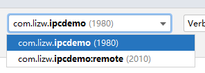
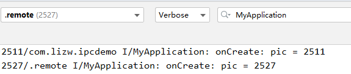
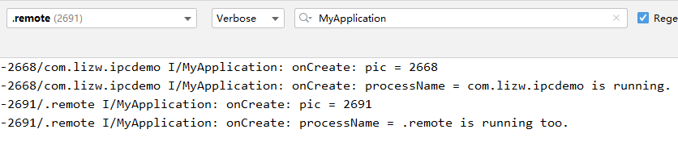

#### 一、开启多进程

Android应用开启多进程的原因主要有：

- 单进程内存不够。Android系统只为单个进程的应用分配一定的内存。通过多进程，我们可以把一次耗内存的操作放到其他进程去处理，比如WebView加载、大图加载等，这样可以增加UI进程的性能。
- 独立运行业务模块，比如个人推送、收集数据、防止双守护进程被用户杀掉。


#### 二、开启多进程示例

1、首先准备一个服务代码

```java
public class MyService extends Service {
    private static final String TAG = "MyService";

    public MyService() {
        Log.i(TAG, "MyService");
    }

    @Override
    public void onCreate() {
        Log.i(TAG, "onCreate");
    }

    @Override
    public int onStartCommand(Intent intent, int flags, int startId) {
        Log.i(TAG, "onStartCommand");
        return START_STICKY;
    }

    @Override
    public void onDestroy() {
        Log.i(TAG, "onDestroy");
    }

    @Override
    public IBinder onBind(Intent intent) {
        return null;
    }
}
```

2、通过Activity去启动上面的服务

```java
public class MainActivity extends AppCompatActivity {

    @Override
    protected void onCreate(Bundle savedInstanceState) {
        super.onCreate(savedInstanceState);
        setContentView(R.layout.activity_main);
        startService(new Intent(this, MyService.class));
    }
}
```

3、关键还是在配置文件中设置属性：`android:process=":remote"`

```java
<?xml version="1.0" encoding="utf-8"?>
<manifest xmlns:android="http://schemas.android.com/apk/res/android"
    package="com.lizw.ipcdemo">

    <application
        android:allowBackup="true"
        android:icon="@mipmap/ic_launcher"
        android:label="@string/app_name"
        android:roundIcon="@mipmap/ic_launcher_round"
        android:supportsRtl="true"
        android:theme="@style/Theme.IpcDemo">
        <activity android:name=".MainActivity">
            <intent-filter>
                <action android:name="android.intent.action.MAIN" />

                <category android:name="android.intent.category.LAUNCHER" />
            </intent-filter>
        </activity>

        <service
            android:name=".MyService"
            android:enabled="true"
            android:exported="true"
            android:process=":remote" />
    </application>

</manifest>
```

冒号 ‘：’ 表示：当前应用的包名，因此MyService运行在进程：`com.lizw.ipcdemo:remote`中。

也可以设置`android:process="com.lizw.ipcdemo.remote"`，MyService运行在进程`com.lizw.ipcdemo.remote`中。

两种命名方式（冒号‘：’和点‘.’）的区别是：

`：`表示MyService所在进程是当前应用私有的，其他应用的组件不能运行到此进程中。

`.` 表示MyService所在进程是全局的（前提是有权限），其他应用的组件也可以运行在此进程中，从而减少资源占用。

示例代码运行结果：



#### 三、开启多进程引出的问题

​		开启多进程会导致 Application 执行两次，我们新增一个 Application  类：

```java
public class MyApplication extends Application {
    private static final String TAG = "MyApplication";

    @Override
    public void onCreate() {
        super.onCreate();
        int pid = android.os.Process.myPid();
        Log.i(TAG, "onCreate: pic = " + pid);
    }
}

<?xml version="1.0" encoding="utf-8"?>
<manifest xmlns:android="http://schemas.android.com/apk/res/android"
    package="com.lizw.ipcdemo">

    <application
        android:name=".MyApplication"
```

运行后发现确实执行了两次：



Application经常会做一次初始化操作，已经服务绑定等事情，执行两次显然不行。

解决方法：

根据进程名称，分别执行不同的操作。代码如下：

```java
public class MyApplication extends Application {
    private static final String TAG = "MyApplication";

    @Override
    public void onCreate() {
        super.onCreate();
        int pid = android.os.Process.myPid();
        Log.i(TAG, "onCreate: pic = " + pid);
        String processName = null;
        ActivityManager am = (ActivityManager) getSystemService(ACTIVITY_SERVICE);
        for (ActivityManager.RunningAppProcessInfo app :
                am.getRunningAppProcesses()) {
            if (app.pid == pid) {
                processName = app.processName;
            }
        }
        if ("com.lizw.ipcdemo".equals(processName)) {
            Log.i(TAG, "onCreate: processName = " + processName + " is running.");
        } else {
            Log.i(TAG, "onCreate: processName = " + processName + " is running too.");
        }
    }
}
```



这样不同进程就可以执行各自的操作了。


# 参考

《Android进阶指北》
