> version：2021/11/
>
> review：


根据Android系统的分层，Binder机制“从上往下”可以分为 Java Binder、Native Binder、Kernel Binder。上层依赖于下层，本文Kernel Binder基于goldfish3.10。

# 一、前置知识

Linux 和 Binder 的 IPC 通信原理、使用 Binder 的原因、学习 Binder 的原因。

## 1、Linux和Binder的IPC通信原理

进程通信简单模型如下：

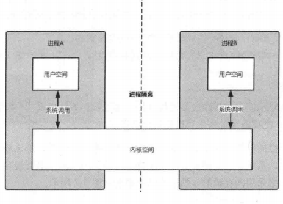

详细模型：


*  在下文中，左边的用户空间称为A进程，右边的称为B进程。

下面了解几个概念：

### 1.1、内核空间和用户空间

接触 Linux 时，经常会听到用户空间（User space）和内核空间（Kernel space），它们的含义是什么呢？

为了确保用户进程不能直接操作内核，以保证内核的安全，操作系统从逻辑上将虚拟空间划分为用户空间和内核空间。Linux 操作系统将较高的1GB 供内核使用，称为内核空间，将较低的3GB 供各进程使用，称为用户空间。

内核空间是 Linux 内核的运行空间，用户空间是用户程序的运行空间。为了保证内核的安全，它们是隔离的，即使用户的程序崩溃了，内核也不会受到影响。内核空间的数据是可以进程间共享的，而用户空间的数据则不可以。比如在上图中，进程A的用户空间是不能和进程B的用户空间共享的。

### 1.2、进程隔离

进程隔离是指一个进程不能直接操作或者访问另一个进程，也就是进程A不能直接访问进程B的数据。

### 1.3、系统调用

用户空间借助系统调用来访问内核空间。系统调用是用户空间访问内核空间的唯一方式，这保证了所有资源的访问都是在内核的控制下进行的，避免了用户程序对系统资源的越权访问，提升了系统的安全性和稳定性。

进程A和进程B的用户空间可以通过如下系统函数和内核空间进行交互。

- copy_from_user：将用户空间的数据复制到内核空间。
- copy_to_user：将内核空间的数据复制到用户空间。

### 1.4、内存映射

由于应用程序不能直接操作设备硬件地址，所以操作系统提供了一种机制：内存映射（Memory Map），将设备地址映射到进程虚拟内存区。

例如，用户空间需要读取磁盘的文件，如果不采用内存映射，那么就需要在内核空间建立一个页缓存，页缓存去复制磁盘中的文件，然后用户空间复制页缓存的文件，这就需要两次复制。如果采用内存映射，那么其映射模型如图所示。

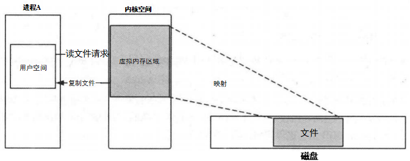

由于新建了虚拟内存区域，那么磁盘文件和虚拟内存区域就可以直接映射，少了一次复制。

> 这里提到的映射具体是个什么东西？

在Linux 中通过系统调用函数 mmap 来实现内存映射。将用户空间的一块内存区域映射到内核空间。映射关系建立后，用户对这块内存区域的修改可以直接反映到内核空间， 反之亦然。内存映射能减少数据复制次数，实现用户空间和内核空间的高效互动。

### 1.5、Linux的IPC通信原理

Linux 的 IPC 通信模型：

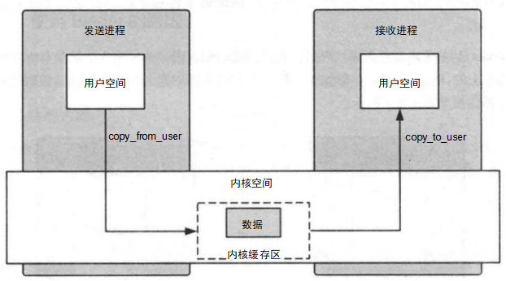

内核程序在内核空间分配内存并开辟一块内核缓存区，发送进程通过copy_from_user() 函数将数据复制到内核空间的缓冲区中。同样，接收进程接收数据时在自己的用户空间开辟一块内核缓存区，然后内核程序调用copy_to_user()函数将数据从内核缓存区复制到接收进程。这样数据发送进程和数据接收进程就完成了一次数据传输，也就是一次进程间的通信。

Linux 的 IPC 通信原理有以下两个问题。

(1)一次数据传递需要经历：用户空间→ 内核缓存区→用户空间，需要两次数据复制， 这样效率不高。

(2)接收数据的缓存区由数据接收进程提供，但是接收进程并不知道需要多大的空间来存放将要传递过来的数据，因此只能开辟尽可能大的内存空间或者先调用API 接收消息头来获取消息体的大小，以免浪费了空间或者时间。

### 1.6、Binder的通信原理

Binder 是基于开源的OpenBinder 实现的。

Binder 是基于内存映射来实现的，在前面我们知道内存映射通常是用在有物理介质的文件系统上的，然后 Binder 没有物理介质，它使用内存映射是为了跨进程传递数据的，Linux 的 Binder 通信模型如图所示。

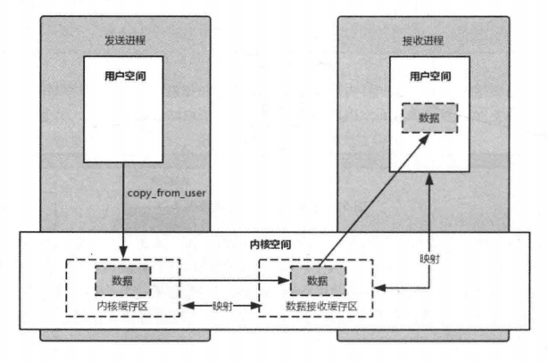

Binder 通信的步骤如下所示。

(1)Binder  驱动在内核空间创建一个数据接收缓存区。

(2)在内核空间开辟一块内核缓存区，建立内核缓存区和数据接收缓存区之间的映射关系，以及数据接收缓存区和接收进程用户空间地址的映射关系。

(3)发送方进程通过copy_from_user()函数将数据复制到内核中的内核缓存区，由于内核缓存区和接收进程的用户空间存在内存映射，因此也就相当于把数据发送到了接收进程的用户空间，这样便完成了一次进程间的通信。

整个过程只使用了一次复制，不会因为不知道数据的大小而浪费空间或者时间，这样效率更高。

## 2、使用Binder的原因

Android是基于 Linux  内核的，Linux 提供了很多IPC 机制，而Android自己却设计了 Binder来进行通信，主要原因有以下四个方面。

1.性能方面

性能方面主要影响的因素是数据复制次数，管道、消息队列、Socket的复制次数都是两次，性能不是很好，共享内存不需要复制，性能很好，Binder 的复制次数为一次，性能仅次于内存复制。

2.稳定性方面

Binder是基于C/S 架构的，这个架构通常采用两层结构，在技术上已经很成熟了，稳定性也是没有问题的。共享内存没有分层，难以控制，并发同步访问临界资源时，可能还会产生死锁。从稳定性的角度讲，Binder 是优于共享内存的。

3.安全方面

传统的 IPC 接收方无法获得对方可靠的进程用户 ID/进程 ID(UID/PID),  无法鉴别对方身份。Android 为每个安装好的App分配了自己的UID,  通过进程的 UID 来鉴别进程身份。另外，Android 系统中的服务端会判断 UID/PID 是否满足访问权限，而对外只暴露客户端，加强了系统的安全性。

4.语言方面

Linux是基于C 语言的，C 语言是面向过程的，Android应用层和Java Framework是基于 Java语言的，Java语言是面向对象的。Binder本身符合面向对象的思想，因此作为Android 的通信机制更合适。

从这四个方面来看，Linux 提供的大部分IPC 机制无法和Binder 相比较，而共享内存只在性能方面优于Binder,  其他方面都劣于Binder，这些就是Android 要使用 Binder 来进行进程间通信的原因，当然系统中并不是所有进程通信都采用了 Binder，而是根据场景选择最合适的，比如 Zygote 进程与 AMS 通信使用的是Socket，Kill Process 采用的是信号。

## 3、学习Binder的原因

Binder 机制在 Android 中的地位举足轻重，我们需要掌握的很多原理都和Binder 有关。

- 系统中的各个进程是如何通信的。
- Android 系统启动过程。
- AMS 、PMS 的原理。
- 四大组件的原理，比如Activity是如何启动的。
- 插件化原理。
- 系统服务的客户端和服务端是如何通信的(比如MediaPlayer 和MeidaPlayerService)。

以上只是列举了一小部分，简单来讲，比如系统在启动时，SystemServer 进程启动后会创建 Binder 线程池，其目的是通过 Binder 可以使在 SystemServer 进程中的服务能够和其他进程间通信。再比如我们常说的 AMS 、PMS 都是基于 Binder 来实现的，拿PMS 来说， PMS  运行在 SystemServer 进程，如果它想要和 DefaultContainerService 通信(用于检查和复制可移动文件的系统服务)，就需要通过 Binder 来实现，因为 DefaultContainerService 运行在com.android.defcontainer进程。

还有一个比较常见的 C/S 架构间通信的问题，客户端的 MediaPlayer 和服务端的 MeidaPlayerService不是运行在一个进程中的，同样需要 Binder 来实现通信。

可以说 Binder 机制是掌握系统底层原理的基石。根据Android系统的分层，Binder 机制主要分为Java Binder 、Native Binder 、Kernel Binder，如图所示。


上图并没有给出Binder 机制的具体细节，而是先给出了一个简单的概念图，随着后 续知识的讲解，最终会完善这张图。

# 二、ServiceManager中的Binder机制

Java Binder是需要借助Native Binder来工作的，因此需要先了解Native  Binder,Native Binder 架构的原型就是基于Binder 通信的C/S 架构的，因此我们先从C/S 架构开始学习。

## 基于Binder通信的C/S架构

在Android 系统中，Binder 进程间通信的使用是很普遍的，比如 MediaPlayer 框架，这个框架基于C/S 架构，并采用 Binder 来进行进程间通信，如图所示。

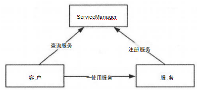

图中可以看出，除了常规C/S 架构的客户端和服务端，还包括了ServiceManager, 它用于管理系统中的服务。首先 Server 进程会注册一些服务到ServiceManager 中，如果客 户要使用某个服务，则需要先到 ServiceManager 中查询服务的相关信息，然后根据服务的 相关信息与服务所在的Server 进程建立通信通路，这样客户就可以使用服务了。

## MediaServer的main函数

Client 、Server 、ServiceManager 三者的交互都是基于 Binder 通信的，那么任意两者的交互都可以说明 Binder 通信的原理，可以说 Native Binder 的原理的核心就是 ServiceManager 的原理，为了更好地了解ServiceManager，这里使用 MediaPlayer 框架来举例，它也是学习多媒体时必须要掌握的知识点。

MediaPlayer框架的简单框架图：

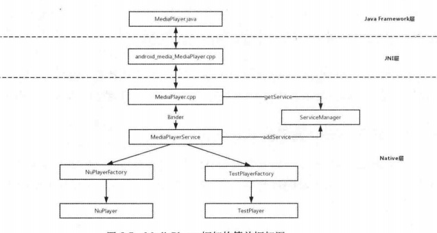

由图可知，MediaPlayer 和 MediaPlayerService 是通过 Binder 来进行通信的， MediaPlayer是客户端，MediaPlayerService是服务端，MediaPlayerService是系统多媒体服务的一种，系统多媒体服务是由 MediaServer 服务进程提供的，它是一个可执行程序，在 Android 系统启动时，MediaServer 也被启动，它的入口函数如下所示。

```kotlin
frameworks/av/media/mediaserver/main_mediaserver.cpp

int main(int argc __unused, char **argv __unused)
{
    signal(SIGPIPE, SIG_IGN);

    sp<ProcessState> proc(ProcessState::self());//1，获取Processstate实例
    sp<IServiceManager> sm(defaultServiceManager());//2 
    ALOGI("ServiceManager: %p", sm.get());
    AIcu_initializeIcuOrDie();
    MediaPlayerService::instantiate();//3，注册MediaPlayerService
    ResourceManagerService::instantiate();
    registerExtensions();//启动Binder线程池
    ProcessState::self()->startThreadPool();//当前线程加入线程池
    IPCThreadState::self()->joinThreadPool();
}
```

- 注释1 处用来获取 ProcessState 实例，在这一过程中会打开/dev/binder 设备，并使用 mmap 为 Binder 驱动分配一个虚拟地址空间用来接收数据。

- 注释2处用来得到IServiceManager，通过IServiceManager，其他进程就可以和当前的 ServiceManager交互，这里就用到了 Binder  通信。

- 注释3处用来注册 MediaPlayerService。


## 每个进程唯一的ProcessState实例

ProcessState 实例代表进程的状态，先来查看ProcessState实例的self函数，代码如下所示。

```kotlin
frameworks/native/libs/binder/ProcessState.cpp

#ifdef __ANDROID_VNDK__
const char* kDefaultDriver = "/dev/vndbinder";
#else
const char* kDefaultDriver = "/dev/binder";
#endif

sp<ProcessState> ProcessState::self()
{
    Mutex::Autolock _l(gProcessMutex);
    if (gProcess != nullptr) {
        return gProcess;
    }
    gProcess = new ProcessState(kDefaultDriver);//1
    return gProcess;
}
```

- 这里采用了单例模式，确保每个进程只有一个ProcessState 实例。

- 注释1处创建了一个 ProcessState实例，参数为/dev/binder。

接着来查看 ProcessState 实例的构造函数，代码如下所示。

```kotlin
frameworks/native/libs/binder/ProcessState.cpp

ProcessState::ProcessState(const char *driver)
    : mDriverName(String8(driver))
    , mDriverFD(open_driver(driver))//1
    , mVMStart(MAP_FAILED)
    , mThreadCountLock(PTHREAD_MUTEX_INITIALIZER)
    , mThreadCountDecrement(PTHREAD_COND_INITIALIZER)
    , mExecutingThreadsCount(0)
    , mMaxThreads(DEFAULT_MAX_BINDER_THREADS)
    , mStarvationStartTimeMs(0)
    , mManagesContexts(false)
    , mBinderContextCheckFunc(nullptr)
    , mBinderContextUserData(nullptr)
    , mThreadPoolStarted(false)
    , mThreadPoolSeq(1)
    , mCallRestriction(CallRestriction::NONE)
{
    if (mDriverFD >= 0) {
        // mmap the binder, providing a chunk of virtual address space to receive transactions.
        mVMStart = mmap(nullptr, BINDER_VM_SIZE, PROT_READ, MAP_PRIVATE | MAP_NORESERVE, mDriverFD, 0);//2
        if (mVMStart == MAP_FAILED) {
            // *sigh*
            ALOGE("Using %s failed: unable to mmap transaction memory.\n", mDriverName.c_str());
            close(mDriverFD);
            mDriverFD = -1;
            mDriverName.clear();
        }
    }

    LOG_ALWAYS_FATAL_IF(mDriverFD < 0, "Binder driver could not be opened.  Terminating.");
}
```

`ProcessState` 实例的构造函数中调用了很多函数：

- 注释1处打开了 /dev/binder 设备。

- 注释2处的 `mmap()函数`会在内核虚拟地址空间中申请一块与用户虚拟内存相同大小的内存，然后申请物理内存，将同一块物理内存分别映射到内核虚拟地址空间和用户虚拟内存空间，实现了内核虚拟地址空间和用户虚拟内存空间的数据同步操作，也就是内存映射。

- `mmap()函数` 用于对 Binder 设备进行内存映射，除了 `mmap()函数` 还有 `open()函数` 、`ioctl()`函数，接下来学习这两个函数的作用。

注释1处的 open_driver 函数的代码如下所示。

```kotlin
frameworks/native/libs/binder/ProcessState.cpp

   static int open_driver(const char *driver)
{
    int fd = open(driver, O_RDWR | O_CLOEXEC);//1
    if (fd >= 0) {
        int vers = 0;
        status_t result = ioctl(fd, BINDER_VERSION, &vers);
        if (result == -1) {
            ALOGE("Binder ioctl to obtain version failed: %s", strerror(errno));
            close(fd);
            fd = -1;
        }
        if (result != 0 || vers != BINDER_CURRENT_PROTOCOL_VERSION) {
          ALOGE("Binder driver protocol(%d) does not match user space protocol(%d)! ioctl() return value: %d",
                vers, BINDER_CURRENT_PROTOCOL_VERSION, result);
            close(fd);
            fd = -1;
        }
        size_t maxThreads = DEFAULT_MAX_BINDER_THREADS;
        result = ioctl(fd, BINDER_SET_MAX_THREADS, &maxThreads);//2
        if (result == -1) {
            ALOGE("Binder ioctl to set max threads failed: %s", strerror(errno));
        }
    } else {
        ALOGW("Opening '%s' failed: %s\n", driver, strerror(errno));
    }
    return fd;
}
```

- 注释1处：打开了 /dev/binder 设备并返回文件操作符fd,  这样就可以操作内核的 Binder 驱动了。
- 注释2处：ioctl 函数的作用是和 Binder 设备进行参数的传递，这里的ioctl 函数将 binder 支持的最大线程数设定为15(maxThreads 的值为15)。
- 最终open_driver 函数返回文件操作符fd。

总体来说，ProcessState 实例有以下两个重要作用。

1. 打开 /dev/binder 设备并设定 Binder 最大的支持线程数。

2. 通过 mmap 为 binder 分配一块虚拟地址空间，达到内存映射的目的。


## 解析ServiceManager中的Binder机制

回到 MediaServer 的main函数，注释2`处调用了 sp<IServiceManager> sm(defaultServiceManager());//2 `，其中`defaultServiceManager`函数，代码如下所示。

```kotlin
frameworks/native/libs/binder/IServiceManager.cpp

sp<IServiceManager> defaultServiceManager()
{
    if (gDefaultServiceManager != nullptr) return gDefaultServiceManager;
    {
        AutoMutex _l(gDefaultServiceManagerLock);
        while (gDefaultServiceManager == nullptr) {
            gDefaultServiceManager = interface_cast<IServiceManager>(
                ProcessState::self()->getContextObject(nullptr));//1
            if (gDefaultServiceManager == nullptr)
                sleep(1);
        }
    }

    return gDefaultServiceManager;
}
```

- 从IServiceManager所在的文件路径可以知道，ServiceManager中不但使用了Binder通信，而且它自身也是属于 Binder 体系的。defaultServiceManager中同样使用了单例。
- 注释1处：interface_cast 函数生成了gDefaultServiceManager，其内部调用了ProcessState实例的 getContextObject函数，代码如下所示。

```kotlin
frameworks/native/libs/binder/ProcessState.cpp

sp<IBinder> ProcessState::getContextObject(const sp<IBinder>& /*caller*/)
{
    return getStrongProxyForHandle(0);
}

sp<IBinder> ProcessState::getStrongProxyForHandle(int32_t handle)
{
    sp<IBinder> result;
    AutoMutex _l(mLock);
    handle_entry* e = lookupHandleLocked(handle);//1
    if (e != nullptr) {
        IBinder* b = e->binder;
        if (b == nullptr || !e->refs->attemptIncWeak(this)) {
            if (handle == 0) {
                Parcel data;
                status_t status = IPCThreadState::self()->transact(
                        0, IBinder::PING_TRANSACTION, data, nullptr, 0);
                if (status == DEAD_OBJECT)
                   return nullptr;
            }
            b = BpBinder::create(handle);//2
            e->binder = b;//3
            if (b) e->refs = b->getWeakRefs();
            result = b;
        } else {
            result.force_set(b);
            e->refs->decWeak(this);
        }
    }

    return result;
}
```

- getContextObject 函数中调用了getStrongProxyForHandle函数，参数的值为0，那么 handle 的值就为0，handle 是一个资源标识。
- 注释1：查询了这个资源标识对应的资源 (handleentry) 是否存在，如果存在但是 handleentry 的 binder 不存在，就会在注释2处新建BpBinder，并在注释3处赋值给 handleentry 的 binder,  最终返回的result的值为BpBinder。

### BpBinder 和 BBinder

讲到 BpBinder 就要提到BBinder，它们是 Binder 通信的“双子星”，都继承了IBinder。 BpBinder 是客户端与服务端交互的代理类，而 BBinder 则代表了服务端。BpBinder 和 BBinder是一一对应的，BpBinder 会通过 handle 来找到对应的BBinder。

我们知道在ServiceManager中创建了BpBinder，通过handle (值为0)可以找到对应的BBinder, 如图所示。


分析完ProcessState实例的 getContextObject函数，接着回到interface_cast 函数。

```kotlin
gDefaultServiceManager = interface_cast<IServiceManager>(
                ProcessState::self()->getContextObject(nullptr));
```

interface_cast具体实现如下所示。

```kotlin
frameworks/native/libs/binder/include/binder/lInterface.h

template<typename INTERFACE>
inline sp<INTERFACE> interface_cast(const sp<IBinder>& obj)
{
    return INTERFACE::asInterface(obj);
}
```

当前的场景中，INTERFACE 的值为 IServiceManager，那么替换后代码如下所示。

```kotlin
inline sp<IServiceManager>interface_cast(const sp<IBinder>& obj)
{
return IServiceManager::asInterface(obj);
}
```

我们接着来分析 IServiceManager。

### 解密 IServiceManager

BpBinder 和 BBinder 负责 Binder 的通信，而IServiceManager用于处理 ServiceManager 的业务，IServiceManager定义在IServiceManager.h中。

```kotlin
frameworks/native/libs/binderlinclude/binder/IServiceManager.h
                     
class IServiceManager : public IInterface
{
public:
    DECLARE_META_INTERFACE(ServiceManager)//1
...
    //一些操作Service 的函数
    virtual sp<IBinder>         getService( const String16& name) const = 0;
    virtual sp<IBinder>         checkService( const String16& name) const = 0;
    virtual status_t addService(const String16& name, const sp<IBinder>& service,
                                bool allowIsolated = false,
                                int dumpsysFlags = DUMP_FLAG_PRIORITY_DEFAULT) = 0;
    virtual Vector<String16> listServices(int dumpsysFlags = DUMP_FLAG_PRIORITY_ALL) = 0;
    enum {
        GET_SERVICE_TRANSACTION = IBinder::FIRST_CALL_TRANSACTION,
        CHECK_SERVICE_TRANSACTION,
        ADD_SERVICE_TRANSACTION,
        LIST_SERVICES_TRANSACTION,
    };
};
```

可以看到IServiceManager继承了IInterface，其内部定义了一些常量和一些操作Service 的函数，在注释1处调用了DECLARE_META_INTERFACE宏，它的定义在 IInterface.h中 ， 如下所示。

```kotlin
frameworks/native/libs/binder/include/binder/lInterface.h

#define DECLARE_META_INTERFACE(INTERFACE)                               \
public:                                                                 \
    static const ::android::String16 descriptor;                        \
    static ::android::sp<I##INTERFACE> asInterface(                     \
            const ::android::sp<::android::IBinder>& obj);              \
    virtual const ::android::String16& getInterfaceDescriptor() const;  \
    I##INTERFACE();                                                     \
    virtual ~I##INTERFACE();                                            \
```

其中INTERFACE的值为ServiceManager，经过替换后的代码如下所示。

```kotlin
static const ::android::String16 descriptor; 
		//定义asInterface函数
		static  ::android::sp<IServiceManager>asInterface(
		const  ::android::sp<::android::IBinder>&obj);
virtual   const ::android::String16&getInterfaceDescriptor() const;
IServiceManager();//定义IServiceManager 构造函数
//定义IServiceManager 析构函数 
virtual   ~IServiceManager();
```

从DECLARE_META_INTERFACE宏的名称和上面的代码中，可以发现它主要声明了一些函数和一个变量。那么这些函数和变量的实现在哪里呢?答案还在 IInterface.h 中， IMPLEMENT_META_INTERFACE宏，代码如下所示。

```kotlin
frameworks/native/libs/binder/include/binder/llnterface.h

#define IMPLEMENT_META_INTERFACE(INTERFACE, NAME)                       \
    const ::android::String16 I##INTERFACE::descriptor(NAME);           \
    const ::android::String16&                                          \
            I##INTERFACE::getInterfaceDescriptor() const {              \
        return I##INTERFACE::descriptor;                                \
    }                                                                   \
    ::android::sp<I##INTERFACE> I##INTERFACE::asInterface(              \
            const ::android::sp<::android::IBinder>& obj)               \
    {                                                                   \
        ::android::sp<I##INTERFACE> intr;                               \
        if (obj != nullptr) {                                           \
            intr = static_cast<I##INTERFACE*>(                          \
                obj->queryLocalInterface(                               \
                        I##INTERFACE::descriptor).get());               \
            if (intr == nullptr) {                                      \
                intr = new Bp##INTERFACE(obj);                          \
            }                                                           \
        }                                                               \
        return intr;                                                    \
    }                                                                   \
    std::unique_ptr<I##INTERFACE> I##INTERFACE::default_impl;           \
    bool I##INTERFACE::setDefaultImpl(std::unique_ptr<I##INTERFACE> impl)\
    {                                                                   \
        if (!I##INTERFACE::default_impl && impl) {                      \
            I##INTERFACE::default_impl = std::move(impl);               \
            return true;                                                \
        }                                                               \
        return false;                                                   \
    }                                                                   \
    const std::unique_ptr<I##INTERFACE>& I##INTERFACE::getDefaultImpl() \
    {                                                                   \
        return I##INTERFACE::default_impl;                              \
    }                                                                   \
    I##INTERFACE::I##INTERFACE() { }                                    \
    I##INTERFACE::~I##INTERFACE() { }                                   \
```

DECLARE_META_INTERFACE 宏和 IMPLEMENT_META_INTERFACE 宏是配合使用的，很多系统服务都使用了它们，IServiceManager使用 IMPLEMENT_META_INTERFACE 宏只有一行代码，如下所示。

```kotlin
frameworks/native/libs/binder/IServiceManager.cpp

IMPLEMENT_META_INTERFACE(ServiceManager,"android.os.IServiceManager");
```

IMPLEMENT_META_INTERFACE宏的INTERFACE值为ServiceManager，NAME 值为"android.os.IServiceManager"，进行替换后的代码如下所示。

```kotlin
const ::android::String16

IServiceManager::descriptor("android.os.IServiceManager"); 
		const ::android::String16&
				IServiceManager::getInterfaceDescriptor()const {
			return  IServiceManager::descriptor;
}

/ / 实现了asInterface函数
::android::sp<IServiceManager>IServiceManager::asInterface(
		const ::android::sp<::android::IBinder>&obj)
{
	::android::sp<IServiceManager>intr; 
    if (obj != nullptr) {                                           
            intr = static_cast<IServiceManager>(                          
                obj->queryLocalInterface(                               
                        IServiceManager::descriptor).get());               
            if (intr == nullptr) {                                      
                intr = new BpServiceManager(obj);//1
            }                                                           
        }                                                               
        return intr; 
}

IServiceManager::IServiceManager(){}
IServiceManager::~IServiceManager(){}
```

注释1处新建了一个BpServiceManager，传入的参数 obj 的值为BpBinder。到这里我们也就明白了，asInterface函数就是用BpBinder为参数创建了BpServiceManager，从而推断出 interface_cast 函数创建了 BpServiceManager，再继续往上推断，IServiceManager 的defaultServiceManager函数返回的就是 BpServiceManager。

BpServiceManager的作用是什么呢?先来看BpServiceManager的构造函数。

```kotlin
frameworks/native/libs/binder/IServiceManager.cpp

class BpServiceManager  :public BpInterface<IServiceManager> {
public:
explicit BpServiceManager(const  sp<IBinder>&impl) :BpInterface<IServiceManager>(impl)
{
}
    ...
}
```

impl的值其实就是 BpBinder，BpServiceManager 的构造函数调用了基类BpInterface的构造函数。

```kotlin
frameworks/native/libs/binder/include/binder/lInterface.h

template<typename INTERFACE>
class  BpInterface :public  INTERFACE,public BpRefBase {
...
};
```

BpInterface继承了BpRefBase,BpRefBase 的实现如下所示。 

```kotlin
frameworks/native/libs/binder/Binder.cpp

BpRefBase::BpRefBase(const sp<IBinder>&o) :mRemote(o.get()),mRefs(NULL),mState(0)
{
	extendObjectLifetime(OBJECT_LIFETIME_WEAK);
	if(mRemote){
		mRemote->incStrong(this);
		mRefs =mRemote->createWeak(this);
    }
}
```

mRemote是一个IBinder 指针，它最终的指向为BpBinder，也就是说BpServiceManager 的 mRemote指向了BpBinder。那么 BpServiceManager的作用就是实现了IServiceManager，并且通过BpBinder来实现通信。

### IServiceManager 家族

可能前面讲的内容会使我们有些头晕，这是因为对各个类的关系还不明确，通过下图：IServiceManager家族UML 图 可以清晰一点

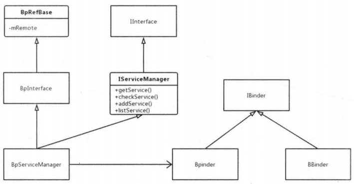

1. BpBinder 与 BBinder 都和通信有关，它们都继承自IBinder。

2. BpServiceManager  派生自 IServiceManager，它们都和业务有关。

3. BpRefBase 包含了 mRemote，通过不断派生，BpServiceManager 也同样包含 mRemote,它指向了BpBinder，通过 BpBinder 来实现通信。


## 小结

本节学习了Binder 通信的C/S 架构，知道了Native Binder的原理的核心其实就是ServiceManager的原理，为了讲解 ServiceManager 的原理，我们使用MediaPlayer框架来举例。在讲解MediaServer的入口函数时，我们遇到了三个问题，其中前两个问题相关的知识点，即 ProcessState实例 和 IServiceManager都介绍了，下一节写 MediaPlayerService 是如何注册的。

# 5.3 系统服务的注册过程

通过了解MediaPlayerService是如何注册的，可以得知系统服务的注册过程。

## 5.3.1 从调用链角度说明 MediaPlayerService 的注册过程

先来查看MediaServer的入口函数，代码如下所示。

```kotlin
frameworks/av/media/mediaserver/main/mediaserver.cpp

int  main(int  argc   unused,char  argv   unused)
{
signal(SIGPIPE,SIG_IGN);
//获取ProcessState实例
sp<ProcessState>proc(ProcessState::self());
sp<IServiceManager>sm(defaultServiceManager());
ALOGI("ServiceManager:8p",sm.get()); 
InitializeIcuOrDie();
//注册 MediaPlayerService
MediaPlayerService::instantiate();//1
ResourceManagerService::instantiate();
registerExtensions(); //启动Binder线程池
ProcessState::self()->startThreadPool(); //当前线程加入线程池
IPCThreadState::self()->joinThreadPool();
}
```

部分代码前面已经介绍过了，接着分析注释1处的代码。

```kotlin
frameworks/av/media/libmediaplayerservice/MediaPlayerService.cpp

void MediaPlayerService::instantiate(){ defaultServiceManager()
                                       ->addService(
String16("media.player"),new MediaPlayerService,());
}
```

defaultServiceManager 返回的是 BpServiceManager，参数是一个字符串和 MediaPlayerService，类似于 Key/Value 的形式来完成注册，接着查看addService函数。

```kotlin
frameworks/native/libs/binder/IServiceManager.cpp

virtual  status_t   addService(const   String16&name,const  sp<IBinder>&service, bool allowIsolated,int dumpsysPriority){
    
Parcel  data,reply;           //数据包
data.writeInterfaceToken(IServiceManager::getInterfaceDescriptor()); data.writeString16(name);       //name值为"media.player"
data.writeStrongBinder(service);//service值为MediaPlayerService 
data.writeInt32(allowIsolated ?1:0);
data.writeInt32(dumpsysPriority);
status_t err =remote()->transact(ADD_SERVICE_TRANSACTION,data, &reply);//1
return err ==NO_ERROR ?reply.readExceptionCode():err;
```

- data 是一个数据包，后面的代码会不断将数据写入data中；
- 注释1处的remote()指的是mRemote，也就是BpBinder。
- addService 函数的作用就是将请求数据打包成 data，然后传给 BpBinder 的 transact 函数，代码如下所示。

```kotlin
frameworks/native/libs/binder/BpBinder.cpp

status_t BpBinder::transact(
uint32_t code,const Parcel&data,Parcelreply,uint32_t    flags)
{
	if(mAlive){
		status_t status =IPCThreadState::self()->transact(
			mHandle,code,data,reply,flags);
	if(status ==DEAD_OBJECT)
        mAlive =0; 
        return status;
	}
return DEAD_OBJECT;
}
```

BpBinder将逻辑处理交给IPCThreadState，先来了解IPCThreadState::self()的作用。

```kotlin
frameworks/native/libs/binder/IPCThreadState.cpp

IPCThreadStateIPCThreadState::self() {
	//首次进来gHaveTLS 的值为false
	if(gHaveTLS){ 
    restart:
		const pthread_key_t k =gTLS;//1
		IPCThreadStatest     =(IPCThreadState)pthread_getspecific(k);//2
	if(st)return   st;
	return new IPCThreadState;//3 
    }
...
	pthread_mutex_unlock(&gTLSMutex); 
    goto restart;
}
```

- 注释1处的TLS的全称为Thread local storage，它指的是线程本地存储空间，在每个线程中都有 TLS,  并且其在线程间不共享。
- 注释2处用于获取 TLS 中的内容并赋值给 IPCThreadState 指针。
- 注释3 处会新建一个 IPCThreadState，这里可以得知 IPCThreadState::self() 实际是创建IPCThreadState的，它的构造函数如下所示。

```kotlin
frameworks/native/libs/binder/IPCThreadState.cpp

IPCThreadState::IPCThreadState()
    : mProcess(ProcessState::self()),
      mWorkSource(kUnsetWorkSource),
      mPropagateWorkSource(false),
      mStrictModePolicy(0),
      mLastTransactionBinderFlags(0),
      mCallRestriction(mProcess->mCallRestriction)
{
    pthread_setspecific(gTLS, this);//1
    clearCaller();
    mIn.setDataCapacity(256);
    mOut.setDataCapacity(256);
    mIPCThreadStateBase = IPCThreadStateBase::self();
}
```

注释1处的 pthread_setspecific 函数用于设置TLS，将 IPCThreadState:self() 中获得的 TLS 和自身传入。IPCThreadState中还包含mIn和mOut，其中mIn用来接收来自Binder驱动的数据，mOut 用来存储发往 Binder 驱动的数据，它们默认大小都为256字节。

知道了IPCThreadState的构造函数，再回来查看IPCThreadState的 transact 函数。

```kotlin
frameworks/native/libs/binder/IPCThreadState.cpp

status_t IPCThreadState::transact(int32_t handle,
                                  uint32_t code, const Parcel& data,
                                  Parcel* reply, uint32_t flags)
{
    status_t err;

    flags |= TF_ACCEPT_FDS;
...
    err = writeTransactionData(BC_TRANSACTION, flags, handle, code, data, nullptr);//1

    if (err != NO_ERROR) {
        if (reply) reply->setError(err);
        return (mLastError = err);
    }

    if ((flags & TF_ONE_WAY) == 0) {
...
        if (reply) {
            err = waitForResponse(reply);//2
        } else {
            Parcel fakeReply;
            err = waitForResponse(&fakeReply);
        }
...
    } else {
        // 不需要等待 reply 的分支
        err = waitForResponse(nullptr, nullptr);
    }
    return err;
}
```

调用 BpBinder 的 transact 函数实际上就是调用 IPCThreadState 的 transact 函数。

注释1 处的writeTransactionData函数用于传输数据，其中第一个参数 BC_TRANSACTION 代表向 Binder 驱动发送的命令协议，该命令协议都以 `BC_` 开头，而Binder驱动返回的命令协议都以 `BR_` 开头。这个命令协议我们在后面会再次提到它。

现在分别来分析注释1 处的 writeTransactionData 函数和注释2处的 waitForResponse 函数。

### writeTransactionData函数分析

```kotlin
frameworks/native/libs/binder/IPCThreadState.cpp

status_t IPCThreadState::writeTransactionData(int32_t cmd, uint32_t binderFlags,
    int32_t handle, uint32_t code, const Parcel& data, status_t* statusBuffer)
{
    binder_transaction_data tr;//1

    tr.target.ptr = 0; 
    tr.target.handle = handle;//2
    tr.code = code;
    tr.flags = binderFlags;
    tr.cookie = 0;
    tr.sender_pid = 0;
    tr.sender_euid = 0;

    const status_t err = data.errorCheck();//3
    if (err == NO_ERROR) {
        tr.data_size = data.ipcDataSize();
        tr.data.ptr.buffer = data.ipcData();
        tr.offsets_size = data.ipcObjectsCount()*sizeof(binder_size_t);
        tr.data.ptr.offsets = data.ipcObjects();
    } else if (statusBuffer) {
        tr.flags |= TF_STATUS_CODE;
        *statusBuffer = err;
        tr.data_size = sizeof(status_t);
        tr.data.ptr.buffer = reinterpret_cast<uintptr_t>(statusBuffer);
        tr.offsets_size = 0;
        tr.data.ptr.offsets = 0;
    } else {
        return (mLastError = err);
    }

    mOut.writeInt32(cmd);
    mOut.write(&tr, sizeof(tr));

    return NO_ERROR;
}
```

1. 注释1处的 binder_transaction_data结构体 (tr 结构体)是向 Binder驱动通信的数据结构
2. 注释2处将 handle 传递给 target 的 handle，用于标识目标，这里的handle的值为0，代表了ServiceManager。
3. 注释3处对数据 data 进行错误检查，如果没有错误就将数据赋值给对应的 tr 结构体。
4. 最后会将 BC_TRANSACTION 和 tr 结构体写入 mOut 中。

上述代码调用链的时序图如图所示。 

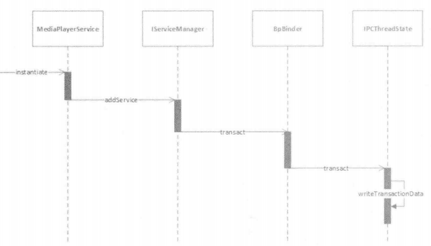

图-代码调用链的时序图

### waitForResponse 函数分析

接着来查看 waitForResponse 函数的作用，waitForResponse 函数中的 case 语句有很多， 这里截取部分代码。

```kotlin
frameworks/native/libs/binder/IPCThreadState.cpp

status_t IPCThreadState::waitForResponse(Parcel *reply, status_t *acquireResult)
{
    uint32_t cmd;
    int32_t err;

    while (1) {
        if ((err=talkWithDriver()) < NO_ERROR) break;//1
        err = mIn.errorCheck();
        if (err < NO_ERROR) break;
        if (mIn.dataAvail() == 0) continue;

        cmd = (uint32_t)mIn.readInt32();
...
        switch (cmd) {

        case BR_DEAD_REPLY:
            err = DEAD_OBJECT;
            goto finish;
...
        default:
            // 处理各种命令协议
            err = executeCommand(cmd);
            if (err != NO_ERROR) goto finish;
            break;
        }
    }

finish:
...
    return err;
}
```

注释1处的 talkWithDriver 函数的内部通过 ioctl 函数与 Binder 驱动进行通信，代码如下所示。

```kotlin
frameworks/native/libs/binder/IPCThreadState.cpp

status_t IPCThreadState::talkWithDriver(bool doReceive)
{
    if (mProcess->mDriverFD <= 0) {
        return -EBADF;
    }
	// 和 Binder 驱动通信的结构体
    binder_write_read bwr;//1

    // mIn 是否有可读的数据，接收的数据存储在 mIn
    const bool needRead = mIn.dataPosition() >= mIn.dataSize();
    const size_t outAvail = (!doReceive || needRead) ? mOut.dataSize() : 0;

    bwr.write_size = outAvail;
    bwr.write_buffer = (uintptr_t)mOut.data();//2

    // 这是 doReceive 的值为 true
    if (doReceive && needRead) {
        bwr.read_size = mIn.dataCapacity();
        bwr.read_buffer = (uintptr_t)mIn.data();//3
    } else {
        bwr.read_size = 0;
        bwr.read_buffer = 0;
    }
...
    if ((bwr.write_size == 0) && (bwr.read_size == 0)) return NO_ERROR;

    bwr.write_consumed = 0;
    bwr.read_consumed = 0;
    status_t err;
    do {
        ...
#if defined(__ANDROID__)
        if (ioctl(mProcess->mDriverFD, BINDER_WRITE_READ, &bwr) >= 0)//4
            err = NO_ERROR;
        else
            err = -errno;
#else
        err = INVALID_OPERATION;
#endif
       ...
    } while (err == -EINTR);
...
        return NO_ERROR;
    }

    return err;
}
```

- 注释1处的binder_write_read是和 Binder 驱动通信的结构体
- 在注释2和注释3处将 mOut 、mIn 赋值给 binder_write_read 的相应字段
- 注释4处：最终通过 ioctl 函数和 Binder 驱动进行通信，这一部分涉及Kernel Binder的内容就不再详细介绍了，我们只需要知道在 Kernel Binder 中会记录服务名和handle，用于后续的服务查询。

## 小结

从调用链的角度来看，MediaPlayerService 是如何注册的并不复杂，因为这里只是简单地介绍了一个调用链分支，可以总结为以下几个步骤。

1. addService 函数将数据打包发送给 BpBinder 来进行处理。

2. BpBinder  新建一个 IPCThreadState 对象，并将通信的任务交给 IPCThreadState。

3. IPCThreadState  的 writeTransactionData函数用于将命令协议和数据写入 mOut 中。

4. IPCThreadState  的 waitForResponse函数主要有两个作用，一个作用是通过 ioctl 函数操作，mOut  和 mIn 与 Binder 驱动进行数据交互，另一个作用是处理各种命令协议。


## 5.3.2 从进程角度说明MediaPlayerService的注册过程

MediaPlayerService的注册还涉及了进程，如图所示。

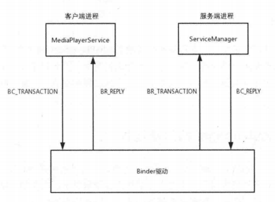

图-MediaPlayerService 的注册过程

从图中可以看出 MediaPlayerService 的注册过程是以 C/S 架构为基础的，注册过程是在MediaPlayerService 进行的，它是客户端，用于请求添加系统服务。而服务端则指的是ServiceManager，用于完成系统服务的添加。

客户端和服务端分别运行在两个进程中，通过 Binder 来进行通信。更详细点描述，就是两端通过向 Binder 驱动发送命令协议来完成系统服务的添加。这其中命令协议非常多，过程也比较复杂，这里对命令协议进行了简化，只涉及了四个命令协议，其中 BC_TRANSACTION 和 BR_TRANSACTION  过程是一个完整的事务， BC_REPLY 和 BR_REPLY是一个完整的事务。

简化步骤如下所示。

1. 客户端向 Binder 驱动发送 BC_TRANSACTION 命令。

2. Binder 驱动接收到请求后生成 BR_TRANSACTION 命令，唤醒服务端的线程后将 BR_TRANSACTION 命令发送给 ServiceManager。

3. 服务端中的服务注册完成后，生成 BC_REPLY 命令发送给 Binder 驱动。

4. Binder 驱动生成BR_REPLY命令，唤醒客户端的线程后将 BR_REPLY 命令发送给客户端。


通过这些协议命令来驱动并完成系统服务的注册。 

## 5.3.3 小结

本节分别从调用链角度和进程角度来讲解 MediaPlayerService 是如何注册的，间接地总结出了系统服务是如何注册的。这两个角度都比较复杂，因此这里分别对这两个角度进行简化，作为应用开发人员，我们不需要注重太多的过程和细节，了解大概的步骤即可。

# 5.4  ServiceManager的启动过程

上一节以 MediaPlayerService 为例，讲解了系统服务的注册过程，接下来要讲解的是系统服务的获取过程，但是在了解获取系统服务前，首先要了解 ServiceManager 的启动过程，这样更有助于理解系统服务的注册过程和获取过程。

另外还有一点需要说明的是，如果想要了解 ServiceManager 的启动过程，就需要查看 Kernel Binder 部分的源码，这部分代码在内核源码中，AOSP 源码是不包括内核源码的， 因此需要单独下载，具体的内容在《Android进阶指北》第一章有。

ServiceManager 是 init 进程负责启动的，具体是在解析 init.rc 配置文件时启动的，init 进程是在系统启动时启动的，因此 ServiceManager 亦是如此。

rc 文件内部由Android 初始化语言编写 (Android Init Language) 的脚本，它主要包含五种类型语的句：Action 、Commands 、Services 、Options 和Import。

从 Android 7.0开始，对 init.rc 配置文件进行了拆分，每个init.rc配置文件服务一个rc 文 件 。ServiceManager的启动脚本在 servicemanager.rc中，代码如下所示。

```kotlin
frameworks/native/cmds/servicemanager/servicemanager.rc service   servicemanager   /system/bin/servicemanager

class core animation user  system  //1
group  system  readproc critical //2
onrestart  restart  healthd
onrestart restart zygote
onrestart restart audioserver 
onrestart restart media
onrestart restart surfaceflinger 
onrestart restart inputflinger
onrestart restart drm
onrestart  restart  cameraserver 
onrestart  restart  keystore
onrestart  restart  gatekeeperd
writepid   /dev/cpuset/system-background/tasks
shutdown   critical
```

service用于通知 init 进程创建名为 servicemanager 的进程，这个servicemanager进程执行程序的路径为/system/bin/servicemanager。

注释1处的关键字 user 说明servicemanager是以用户system的身份运行的

注释2处的 critical 说明servicemanager是系统中的关键服务，关键服务是不会退出的，如果退出了，系统就会重启，当系统重启时就会启动用 onrestart 关键字修饰的进程，比如zygote、media、surfaceflinger等。

servicemanager 的入口函数在 servicemanager.c 中，如下所示。

```kotlin
frameworks/native/cmds/servicemanager/servicemanager.c

int main(int argc, char** argv)
{
    struct binder_state *bs;//1
    union selinux_callback cb;
    char *driver;

    if (argc > 1) {
        driver = argv[1];
    } else {
        driver = "/dev/binder";
    }

    bs = binder_open(driver, 128*1024);//2

    if (binder_become_context_manager(bs)) {//3
        ALOGE("cannot become context manager (%s)\n", strerror(errno));
        return -1;
    }
...
    if (getcon(&service_manager_context) != 0) {
        ALOGE("SELinux: Failed to acquire service_manager context. Aborting.\n");
        abort();
    }
    binder_loop(bs, svcmgr_handler);//4
    return 0;
}
```

注释1处的binder_state结构体用来存储binder的三个信息。

```kotlin
frameworks/native/cmds/servicemanager/binder.c

struct binder_state {
int fd;			//binder    设备的文件描述符
void   mapped;	//binder    设备文件映射到进程的地址空间
size_t mapsize; //内存映射后，系统分配的地址空间的大小，默认为128KB
};
```

main函数主要有以下三个作用：

1. 注释2处调用了 binderopen 函数，用于打开 binder 设备文件，并申请128KB大小的内存空间。

2. 注释3处调用了 binder_become_context_manager 函数，将 servicemanager 注册成为 Binder 机制的上下文管理者。

3. 注释4处调用了binder_loop函数，循环等待和处理客户端发来的请求。

现在对这三个作用分别进行讲解。

## 5.4.1 打开 binder 设备

binder_open 函数用于打开 binder 设备文件，并将它映射到进程的地址空间，代码如下所示。

```kotlin
frameworks/native/cmds/servicemanager/binder.c

struct binder_state *binder_open(const char* driver, size_t mapsize)
{
    struct binder_state *bs;
    struct binder_version vers;

    bs = malloc(sizeof(*bs));
    if (!bs) {
        errno = ENOMEM;
        return NULL;
    }

    bs->fd = open(driver, O_RDWR | O_CLOEXEC);//1
    if (bs->fd < 0) {
        fprintf(stderr,"binder: cannot open %s (%s)\n",
                driver, strerror(errno));
        goto fail_open;
    }
	// 获取 Binder 的 version
    if ((ioctl(bs->fd, BINDER_VERSION, &vers) == -1) ||
        (vers.protocol_version != BINDER_CURRENT_PROTOCOL_VERSION)) {//2
        fprintf(stderr,
                "binder: kernel driver version (%d) differs from user space version (%d)\n",
                vers.protocol_version, BINDER_CURRENT_PROTOCOL_VERSION);
        goto fail_open;
    }

    bs->mapsize = mapsize;
    bs->mapped = mmap(NULL, mapsize, PROT_READ, MAP_PRIVATE, bs->fd, 0);//3
    if (bs->mapped == MAP_FAILED) {
        fprintf(stderr,"binder: cannot map device (%s)\n",
                strerror(errno));
        goto fail_map;
    }

    return bs;

fail_map:
    close(bs->fd);
fail_open:
    free(bs);
    return NULL;
}
```

- 注释1处打开了 binder 设备文件。
- 注释2处的 ioctl 函数用于获取 Binder 的版本，如果获取不到或者内核空间和用户空间的 binder不是同一个版本就会直接 goto 到 fail_open 标签，释放 binder 的内存空间。
- 注释3处调用mmap函数进行内存映射，通俗来讲就是将 binder 设备文件映射到进程的地址空间，地址空间的大小为 mapsize，也就是128KB。映射完成后会将地址空间的起始地址和大小保存在 binderstate 结构体的 mapped 变量和 mapsize 变量中。

这里着重讲一下 open 函数，它会调用 Kernel Binder 部分的 binder_open 函数，这部分源码位于内核源码中，这里展示的代码版本为goldfish 3.10。 

> 下载 Kernel 源码
>
> mkdir kernel
> cd kernel/
> git clone https://aosp.tuna.tsinghua.edu.cn/kernel/goldfish.git
>
> git branch -a
>
> // 切换分支
>
> git checkout remotes/origin/android-goldfish-3.10

Intel 的 X86 架构的 CPU 提供了0～3共四个特权级，特权级的数字越小，权限越高，Linux 操作系统中主要采用了0和3两个特权级，分别对应的就是内核态与用户态。用户态的特权级别低，因此进程在用户态下不经过系统调用是无法主动访问到内核空间中的数据的，这样用户无法随意进入所有进程共享的内核空间，起到了保护的作用。接下来介绍用户态和内核态。

若一个进程在执行用户自己的代码时处于用户态，比如open函数，它运行在用户空间，当前的进程处于用户态。当一个进程因为系统调用进入内核代码中执行时就处于内核态，比如 open 函数通过系统调用(_open 函数)，查找到了open 函数在 Kernel Binder 对应的函数为 binder_open，这时 binder_open 函数运行在内核空间，当前的进程由用户态切换到内核态，代码如下所示。

```kotlin
kernel/goldfish/drivers/android/binder.c

static int binder_open(struct inode *nodp, struct file *filp)
{
    //代表Binder进程
	struct binder_proc *proc;//1
	struct binder_device *binder_dev;

	binder_debug(BINDER_DEBUG_OPEN_CLOSE, "binder_open: %d:%d\n",
		     current->group_leader->pid, current->pid);
	//分配内存空间
	proc = kzalloc(sizeof(*proc), GFP_KERNEL);//2
	if (proc == NULL)
		return -ENOMEM;
	get_task_struct(current->group_leader);
	proc->tsk = current->group_leader;
	INIT_LIST_HEAD(&proc->todo);
	init_waitqueue_head(&proc->wait);
	proc->default_priority = task_nice(current);
	binder_dev = container_of(filp->private_data, struct binder_device,
				  miscdev);
	proc->context = &binder_dev->context;

    //binder同步锁
	binder_lock(proc->context, __func__);

	binder_stats_created(BINDER_STAT_PROC);
	hlist_add_head(&proc->proc_node, &proc->context->binder_procs);
	proc->pid = current->group_leader->pid;
	INIT_LIST_HEAD(&proc->delivered_death);
	filp->private_data = proc;//3
//binder 同步锁释放
	binder_unlock(proc->context, __func__);
...
	return 0;
}
```

注释1处的binder proc结构体代表binder 进程，用于管理binder的各种信息。

注释2处用于为 binder_proc 分配内存空间。

注释3处将 binder_proc 赋值给 file 指针的 private_data  变量，后面会再次提到这个private_data 变量。

## 5.4.2  注册成为Binder 机制的上下文管理者

binder_become_context_manager  函数用于将 servicemanager 注册成为 Binder 机制的上下文管理者，这个管理者在整个系统中只有一个，代码如下所示。 

```kotlin
frameworks/native/cmds/servicemanager/binder.c

int binder_become_context_manager(struct binder_state bs) 
return ioctl(bs->fd,BINDER_SET_CONTEXT_MGR,0);
}
```

ioctl 函数会调用 Binder 驱动的 binder_ioctl 函数，binder_ioctl 函数的代码比较多，这里截取 BINDER_SET_CONTEXT_MGR的处理部分，代码如下所示。

```kotlin
kernel/goldfish/drivers/staging/android/binder.c

static long binder_ioctl(struct file *filp, unsigned int cmd, unsigned long arg)
{
	int ret;
	struct binder_proc *proc = filp->private_data;//1
	struct binder_context *context = proc->context;
	struct binder_thread *thread;
	unsigned int size = _IOC_SIZE(cmd);
	void __user *ubuf = (void __user *)arg;
	trace_binder_ioctl(cmd, arg);

	ret = wait_event_interruptible(binder_user_error_wait, binder_stop_on_user_error < 2);
	if (ret)
		goto err_unlocked;

	binder_lock(context, __func__);
	thread = binder_get_thread(proc);//2
	if (thread == NULL) {
		ret = -ENOMEM;
		goto err;
	}

	switch (cmd) {
...
	case BINDER_SET_CONTEXT_MGR:
		ret = binder_ioctl_set_ctx_mgr(filp);
		if (ret)
			goto err;
		break;
...
	trace_binder_ioctl_done(ret);
	return ret;
}

static int binder_ioctl_set_ctx_mgr(struct file *filp)
{
	int ret = 0;
	struct binder_proc *proc = filp->private_data;
	struct binder_context *context = proc->context;

	kuid_t curr_euid = current_euid();

	if (context->binder_context_mgr_node) {
		pr_err("BINDER_SET_CONTEXT_MGR already set\n");
		ret = -EBUSY;
		goto out;
	}
	ret = security_binder_set_context_mgr(proc->tsk);
	if (ret < 0)
		goto out;
	if (uid_valid(context->binder_context_mgr_uid)) {//4
		if (!uid_eq(context->binder_context_mgr_uid, curr_euid)) {//5
			pr_err("BINDER_SET_CONTEXT_MGR bad uid %d != %d\n",
			       from_kuid(&init_user_ns, curr_euid),
			       from_kuid(&init_user_ns,
					 context->binder_context_mgr_uid));
			ret = -EPERM;
			goto out;
		}
	} else {
		context->binder_context_mgr_uid = curr_euid;//6
	}
	context->binder_context_mgr_node = binder_new_node(proc, 0, 0);//7
	if (!context->binder_context_mgr_node) {
		ret = -ENOMEM;
		goto out;
	}
	context->binder_context_mgr_node->local_weak_refs++;
	context->binder_context_mgr_node->local_strong_refs++;
	context->binder_context_mgr_node->has_strong_ref = 1;
	context->binder_context_mgr_node->has_weak_ref = 1;
out:
	return ret;
}
```

1. 注释1处将file 指针中的private_data 变量赋值给binder_proc，这个private_data变量在binder_open函数中讲过，是一个 binder_proc 结构体。
2. 注释2处的 binder_get_thread函数用于获取binder_thread，binder_thread 结构体指的是binder 线程，binder_get_thread 函数内部会从传入的参数binder_proc中查找 binder_thread, 如果查询到则直接返回，如果查询不到则会创建一个新的binderthread并返回。
3. ~~注释3处的全局变量binder_context_mgr_node代表 Binder 机制的上下文管理者对应的一个 Binder 对象，如果它不为NULL，说明此前自身已经被注册为 Binder 的上下文管理者 了，Binder 的上下文管理者是不能重复注册的，因此会 goto 到 err 标签。~~
4. 注释4处的全局变量 binder_context_mgr_uid 代表注册了 Binder 机制上下文管理者的进程的有效用户ID，如果它的值不为-1，说明此前已经有进程注册 Binder 的上下文管理者了，因此在注释5处判断当前进程的有效用户 ID 是否等于 binder_context_mgr_uid，如果不等于binder_context_mgr_uid 就 goto 到 err 标签。

5. 如果不满足注释4处的条件，说明此前没有进程注册 Binder 机制的上下文管理者，就会在注释6处将当前进程的有效用户ID 赋值给全局变量 binder_context_mgr_uid，另外还会在注释7处调用 binder_new_node 函数创建一个 Binder 对象并赋值给全局变量 binder_context_mgr_node。


## 5.4.3 循环等待和处理客户端发来的请求

servicemanager 成功注册成为 Binder 机制的上下文管理者后，servicemanager 就是Binder 机制的“总管”了，它需要在系统运行期间处理客户端的请求，由于客户端的请求不确定何时发送，因此需要通过无限循环来实现，实现这一需求的函数就是binder_loop。

```kotlin
frameworks/native/cmds/servicemanager/binder.c

void binder_loop(struct binder_state *bs, binder_handler func)
{
    int res;
    struct binder_write_read bwr;
    uint32_t readbuf[32];

    bwr.write_size = 0;
    bwr.write_consumed = 0;
    bwr.write_buffer = 0;

    readbuf[0] = BC_ENTER_LOOPER;
    binder_write(bs, readbuf, sizeof(uint32_t));//1

    for (;;) {
        bwr.read_size = sizeof(readbuf);
        bwr.read_consumed = 0;
        bwr.read_buffer = (uintptr_t) readbuf;

        res = ioctl(bs->fd, BINDER_WRITE_READ, &bwr);//2

        if (res < 0) {
            ALOGE("binder_loop: ioctl failed (%s)\n", strerror(errno));
            break;
        }

        res = binder_parse(bs, 0, (uintptr_t) readbuf, bwr.read_consumed, func);//3
        if (res == 0) {
            ALOGE("binder_loop: unexpected reply?!\n");
            break;
        }
        if (res < 0) {
            ALOGE("binder_loop: io error %d %s\n", res, strerror(errno));
            break;
        }
    }
}
```

1. 注释1处将 BC_ENTER_LOOPER 指令通过 binder_write 函数写入 Binder 驱动中，这样当前线程 (ServiceManager的主线程)就成为一个Binder 线程，这样就可以处理进程间的请求了。

2. 在无限循环中不断调用注释2处的ioctl函数，ioctl函数使用BINDER_WRITE_READ 指令查询Binder 驱动中是否有新的请求，如果有新的请求就交给注释3处的 binder_parse 函数处理。如果没有新的请求，当前线程就会在 Binder 驱动中睡眠，等待新的进程间请求。


由于 binder_write 函数的调用链中涉及了内核空间和用户空间的交互，因此这里着重讲解这部分内容，代码如下所示。

```kotlin
frameworks/native/cmds/servicemanager/binder.c

int  binder_write(struct  binder_state   bs,void  data,size_t  len)

int binder_write(struct binder_state *bs, void *data, size_t len)
{
    struct binder_write_read bwr;//1
    int res;

    bwr.write_size = len;
    bwr.write_consumed = 0;
    bwr.write_buffer = (uintptr_t) data;//2
    bwr.read_size = 0;
    bwr.read_consumed = 0;
    bwr.read_buffer = 0;
    res = ioctl(bs->fd, BINDER_WRITE_READ, &bwr);//3
    if (res < 0) {
        fprintf(stderr,"binder_write: ioctl failed (%s)\n",
                strerror(errno));
    }
    return res;
}
```

注释1处定义了binder_write_read 结构体，接下来的代码对 bwr 进行赋值，其中需要注意的是，注释2处 data 的值为BC_ENTER_LOOPER。注释3处的 ioctl 函数会将 bwr 中的数据发送给 binder 驱动，我们已经知道了 ioctl  函数在 Kernel  Binder 中对应的函数为 binder_ioctl，此前分析过这个函数，这里截取BINDER_WRITE_READ   命令处理部分，代码如下所示。

```kotlin
kernel/goldfish/drivers/staging/android/binder.c

static long binder_ioctl(struct file *filp, unsigned int cmd, unsigned long arg)
{
...
	void __user *ubuf = (void __user *)arg;
...
	switch (cmd) {
	case BINDER_WRITE_READ:
		ret = binder_ioctl_write_read(filp, cmd, arg, thread);
		if (ret)
			goto err;
		break;
...
	trace_binder_ioctl_done(ret);
	return ret;
}
    
static int binder_ioctl_write_read(struct file *filp,
				unsigned int cmd, unsigned long arg,
				struct binder_thread *thread)
{
	int ret = 0;
	struct binder_proc *proc = filp->private_data;
	unsigned int size = _IOC_SIZE(cmd);
	void __user *ubuf = (void __user *)arg;
	struct binder_write_read bwr;

	if (size != sizeof(struct binder_write_read)) {
		ret = -EINVAL;
		goto out;
	}
	if (copy_from_user_preempt_disabled(&bwr, ubuf, sizeof(bwr))) {//1
		ret = -EFAULT;
		goto out;
	}

	if (bwr.write_size > 0) {//2
		ret = binder_thread_write(proc, thread,
					  bwr.write_buffer,
					  bwr.write_size,
					  &bwr.write_consumed);//3
		trace_binder_write_done(ret);
		if (ret < 0) {
			bwr.read_consumed = 0;
			if (copy_to_user_preempt_disabled(ubuf, &bwr, sizeof(bwr)))
				ret = -EFAULT;
			goto out;
		}
	}
	if (bwr.read_size > 0) {
		ret = binder_thread_read(proc, thread, bwr.read_buffer,
					 bwr.read_size,
					 &bwr.read_consumed,
					 filp->f_flags & O_NONBLOCK);
		trace_binder_read_done(ret);
		if (!list_empty(&proc->todo))
			wake_up_interruptible(&proc->wait);
		if (ret < 0) {
			if (copy_to_user_preempt_disabled(ubuf, &bwr, sizeof(bwr)))
				ret = -EFAULT;
			goto out;
		}
	}
...
	if (copy_to_user_preempt_disabled(ubuf, &bwr, sizeof(bwr))) {//4
		ret = -EFAULT;
		goto out;
	}
out:
	return ret;
}
    
static inline long copy_from_user_preempt_disabled(void *to, const void __user *from, long n)
{
	long ret;

	preempt_enable_no_resched();
	ret = copy_from_user(to, from, n);
	preempt_disable();
	return ret;
} 
    
static inline long copy_to_user_preempt_disabled(void __user *to, const void *from, long n)
{
	long ret;

	preempt_enable_no_resched();
	ret = copy_to_user(to, from, n);
	preempt_disable();
	return ret;
}
```

1. 注释1处的 copy_from_user_preempt_disabled() 最终调用 copy_from_user 函数用于将用户空间数据 ubuf 复制出来保存到内核数据 bwr(binder_write_read 结构体)中。

2. 注释2处的 bwr 的输入缓存区有数据时，会调用注释3处的 binder_thread_write 函数来处理BC_ENTER_LOOPER 协议，其内部会将目标线程的状态设置为 BINDER_LOOPER_ STATE_ENTERED，这样目标线程就是一个 Binder 线程。

3. 注释4处通过copy_to_user_preempt_disabled() 最终调用 copy_to_user 函数将内核空间数据bwr复制到用户空间。


# 5.5 系统服务的获取过程

本节仍以 MediaPlayerService 为例，来讲解系统服务的获取过程。本节内容分为两个部分，分别是客户端 MediaPlayerService 请求获取服务和服务端 ServiceManager 处理请求。

## 5.5.1  客户端MediaPlayerService请求获取服务

想要获取MediaPlayerService，需要先调用 getMediaPlayerService 函数，代码如下所示。

```kotlin
frameworks/av/media/libmedia/IMediaDeathNotifier.cpp

IMediaDeathNotifier::getMediaPlayerService()
{
    ALOGV("getMediaPlayerService");
    Mutex::Autolock _l(sServiceLock);
    if (sMediaPlayerService == 0) {
        sp<IServiceManager> sm = defaultServiceManager();//1
        sp<IBinder> binder;
        do {
            binder = sm->getService(String16("media.player"));//2
            if (binder != 0) {//3
                break;
            }
            ALOGW("Media player service not published, waiting...");
            usleep(500000); // 0.5 s //4
        } while (true);

        if (sDeathNotifier == NULL) {
            sDeathNotifier = new DeathNotifier();
        }
        binder->linkToDeath(sDeathNotifier);
        sMediaPlayerService = interface_cast<IMediaPlayerService>(binder);
    }
    ALOGE_IF(sMediaPlayerService == 0, "no media player service!?");
    return sMediaPlayerService;
}
```

- 注 释 1 处的 defaultServiceManager 返回的是 BpServiceManager
- 注释2处获取名为 "media.player"的系统服务，其返回的值为 BpBinder。
- 由于这时 MediaPlayerService 可能还没有向ServiceManager注册，那么就不能满足注释3的条件。
- 在注释4处休眠0.5s 后继续调用getService函数，直到获取对应的服务为止。
- 注释5处的 interface_cast 函数用于将 BpBinder 转换成 BpMediaPlayerService，其原理就是通过 BpBinder 的 handle 来找到对应的服务，即 BpMediaPlayerService。


注释2处的获取服务是重点，BpServiceManager的 getService函数如下所示。

```kotlin
frameworks/native/libs/binder/IServiceManager.cpp::BpServiceManager

    virtual sp<IBinder> getService(const String16& name) const
    {
        sp<IBinder> svc = checkService(name);
        if (svc != nullptr) return svc;

        const bool isVendorService =
            strcmp(ProcessState::self()->getDriverName().c_str(), "/dev/vndbinder") == 0;
        const long timeout = uptimeMillis() + 5000;
        if (!gSystemBootCompleted && !isVendorService) {
            // Vendor code can't access system properties
            char bootCompleted[PROPERTY_VALUE_MAX];
            property_get("sys.boot_completed", bootCompleted, "0");
            gSystemBootCompleted = strcmp(bootCompleted, "1") == 0 ? true : false;
        }
        // retry interval in millisecond; note that vendor services stay at 100ms
        const long sleepTime = gSystemBootCompleted ? 1000 : 100;

        int n = 0;
        while (uptimeMillis() < timeout) {
            n++;
            ALOGI("Waiting for service '%s' on '%s'...", String8(name).string(),
                ProcessState::self()->getDriverName().c_str());
            usleep(1000*sleepTime);

            sp<IBinder> svc = checkService(name);//1
            if (svc != nullptr) return svc;
        }
        ALOGW("Service %s didn't start. Returning NULL", String8(name).string());
        return nullptr;
    }
```

getService函数的主要作用就是循环查询服务是否存在，如果不存在就继续查询，查询服务用到了注释1处的checkService函数，代码如下所示。

```kotlin
frameworks/native/libs/binder/IServiceManager.cpp::BpServiceManager

    virtual sp<IBinder> checkService( const String16& name) const
    {
        Parcel data, reply;//1
        data.writeInterfaceToken(IServiceManager::getInterfaceDescriptor());
        data.writeString16(name);//2
        remote()->transact(CHECK_SERVICE_TRANSACTION, data, &reply);//3
        return reply.readStrongBinder();
    }
```

- 注释1处的 data 是一个数据包，后续也会将数据写入 data 中。
- 注释2处将字符串 "media.player"写入data中。
- 注释3处的remote()指的是mRemote，也就是 BpBinder，BpBinder 的 transact函数如下所示。

```kotlin
frameworks/native/libs/binder/BpBinder.cpp

status_t BpBinder::transact(
    uint32_t code, const Parcel& data, Parcel* reply, uint32_t flags)
{
    // Once a binder has died, it will never come back to life.
    if (mAlive) {
        status_t status = IPCThreadState::self()->transact(
            mHandle, code, data, reply, flags);
        if (status == DEAD_OBJECT) mAlive = 0;
        return status;
    }

    return DEAD_OBJECT;
}
```

BpBinder 将逻辑处理交给 IPCThreadState,  后面的调用链在前面讲过。

IPCThreadState::self()会创建IPCThreadState，IPCThreadState  的 transact 函数如下所示。

```kotlin
frameworks/native/libs/binder/IPCThreadState.cpp

status_t IPCThreadState::transact(int32_t handle,
                                  uint32_t code, const Parcel& data,
                                  Parcel* reply, uint32_t flags)
{
    status_t err;

    flags |= TF_ACCEPT_FDS;
...
    err = writeTransactionData(BC_TRANSACTION, flags, handle, code, data, nullptr);//1

    if (err != NO_ERROR) {
        if (reply) reply->setError(err);
        return (mLastError = err);
    }

    if ((flags & TF_ONE_WAY) == 0) {
...
        if (reply) {
            err = waitForResponse(reply);//2
        } else {
            Parcel fakeReply;
            err = waitForResponse(&fakeReply);
        }
...
    } else {
        // 不需要等待 reply 的分支
        err = waitForResponse(nullptr, nullptr);
    }

    return err;
}
```

- 调用 BpBinder 的 transact 函数实际上就是调用 IPCThreadState 的 transact 函数。
- 注释1 处的 writeTransactionData函数用于传输数据，其中第一个参数BC_TRANSACTION 代表向 Binder 驱动发送命令协议。
- 注释1处的writeTransactionData用于准备发送的数据，其内部会将BC_TRANSACTION 和bindertransactiondata 结构体写入mOut 中。


接着查看waitForResponse 函数，代码如下所示。

```kotlin
frameworks/native/libs/binder/IPCThreadState.cpp

status_t IPCThreadState::waitForResponse(Parcel *reply, status_t *acquireResult)
{
    uint32_t cmd;
    int32_t err;

    while (1) {
        if ((err=talkWithDriver()) < NO_ERROR) break;//1
        err = mIn.errorCheck();
        if (err < NO_ERROR) break;
        if (mIn.dataAvail() == 0) continue;

        cmd = (uint32_t)mIn.readInt32();

        switch (cmd) {
        case BR_TRANSACTION_COMPLETE:
            if (!reply && !acquireResult) goto finish;
            break;
            
        default:
            // 处理各种命令协议
            err = executeCommand(cmd);
            if (err != NO_ERROR) goto finish;
            break;
        }
    }

finish:
...
    return err;
}
```

注释1处的 talkWithDriver 函数的内部通过 ioctl 函数与 Binder 驱动进行通信，代码如下所示。

```kotlin
frameworks/native/libs/binder/IPCThreadState.cpp

status_t IPCThreadState::talkWithDriver(bool doReceive)
{
    if (mProcess->mDriverFD <= 0) {
        return -EBADF;
    }
	// 和 Binder 驱动通信的结构体
    binder_write_read bwr;//1

    // mIn 是否有可读的数据，接收的数据存储在 mIn
    const bool needRead = mIn.dataPosition() >= mIn.dataSize();

    const size_t outAvail = (!doReceive || needRead) ? mOut.dataSize() : 0;
    bwr.write_size = outAvail;
    bwr.write_buffer = (uintptr_t)mOut.data();//2
    // 这时 doReceive 的值为 true
    if (doReceive && needRead) {
        bwr.read_size = mIn.dataCapacity();
        bwr.read_buffer = (uintptr_t)mIn.data();//3
    } else {
        bwr.read_size = 0;
        bwr.read_buffer = 0;
    }
...
    if ((bwr.write_size == 0) && (bwr.read_size == 0)) return NO_ERROR;
    bwr.write_consumed = 0;
    bwr.read_consumed = 0;
    status_t err;
    do {
        IF_LOG_COMMANDS() {
            alog << "About to read/write, write size = " << mOut.dataSize() << endl;
        }
#if defined(__ANDROID__)
        if (ioctl(mProcess->mDriverFD, BINDER_WRITE_READ, &bwr) >= 0)//4
            err = NO_ERROR;
        else
            err = -errno;
#else
        err = INVALID_OPERATION;
#endif
        ...
    } while (err == -EINTR);
...
    return err;
}
```

注释1处的 binder_writer_ead是 和Binder 驱动通信的结构体

在注释2处和注释3处将mOut、mIn赋值给 binder_write_read的相应字段，最终通过注释4处的ioctl 函数和 Binder 驱动进行通信。

MediaPlayerService请求获取服务调用的时序图如图所示。

 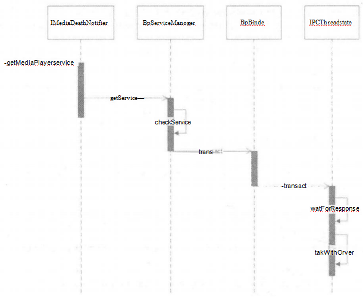

图-MediaPlayerService  请求获取服务调用的时序图

这时我们需要再次查看图


从这张简化的流程图中可以看出，当前分析的是客户端进程的流程，当MediaPlayerService向 Binder 驱动发送 BC_TRANSACTION 命令后， Binder 驱动会向 ServiceManager 发送BR_TRANSACTION 命令，接下来我们来查看服务端 ServiceManager是如何处理获取服务请求的。

> todo：”Binder 驱动会向 ServiceManager 发送BR_TRANSACTION 命令“，怎么发送的？是主动发送还是监听？

## 5.5.2 服务端ServiceManager处理请求

提到服务端ServiceManager 处理请求，就要想到ServiceManager的启动过程，这里简单回顾servicemanager的入口函数，如下所示。

```kotlin
frameworks/native/cmds/servicemanager/servicemanager.c

int main(int argc, char** argv)
{
...
    bs = binder_open(driver, 128*1024);
...
    if (binder_become_context_manager(bs)) {
        ALOGE("cannot become context manager (%s)\n", strerror(errno));
        return -1;
    }
...
    if (getcon(&service_manager_context) != 0) {
        ALOGE("SELinux: Failed to acquire service_manager context. Aborting.\n");
        abort();
    }

    binder_loop(bs, svcmgr_handler);//1
    return 0;
}
```

main函数主要有三个作用，其中最后一个作用就是调用binder_loop函数，这里需要注意它的第二个参数为svcmgr_handler，后面会再次提到svcmgr_handler。

binder_loop函数如下所示。

```kotlin
frameworks/native/cmds/servicemanager/binder.c

void binder_loop(struct binder_state *bs, binder_handler func)
{
...
    for (;;) {
        bwr.read_size = sizeof(readbuf);
        bwr.read_consumed = 0;
        bwr.read_buffer = (uintptr_t) readbuf;

        res = ioctl(bs->fd, BINDER_WRITE_READ, &bwr);

        if (res < 0) {
            ALOGE("binder_loop: ioctl failed (%s)\n", strerror(errno));
            break;
        }

        res = binder_parse(bs, 0, (uintptr_t) readbuf, bwr.read_consumed, func);
        if (res == 0) {
            ALOGE("binder_loop: unexpected reply?!\n");
            break;
        }
        if (res < 0) {
            ALOGE("binder_loop: io error %d %s\n", res, strerror(errno));
            break;
        }
    }
}
```

在无限循环中不断调用 ioctl 函数，其内部不断使用 BINDER_WRITE_READ  指令查询 Binder驱动中是否有新的请求，如果有就交给binder_parse函数处理；如果没有，当前线程就会在 Binder 驱动中睡眠，等待新的进程间通信请求。

binder_parse 函数如下所示。

```kotlin
frameworks/native/cmds/servicemanager/binder.c

int binder_parse(struct binder_state *bs, struct binder_io *bio,
                 uintptr_t ptr, size_t size, binder_handler func)
{
    int r = 1;
    uintptr_t end = ptr + (uintptr_t) size;

    while (ptr < end) {
        uint32_t cmd = *(uint32_t *) ptr;
        ptr += sizeof(uint32_t);
#if TRACE
        fprintf(stderr,"%s:\n", cmd_name(cmd));
#endif
        switch(cmd) {
...
        case BR_TRANSACTION: {
            struct binder_transaction_data_secctx txn;
            if (cmd == BR_TRANSACTION_SEC_CTX) {
                if ((end - ptr) < sizeof(struct binder_transaction_data_secctx)) {
                    ALOGE("parse: txn too small (binder_transaction_data_secctx)!\n");
                    return -1;
                }
                memcpy(&txn, (void*) ptr, sizeof(struct binder_transaction_data_secctx));
                ptr += sizeof(struct binder_transaction_data_secctx);
            } else /* BR_TRANSACTION */ {
                if ((end - ptr) < sizeof(struct binder_transaction_data)) {
                    ALOGE("parse: txn too small (binder_transaction_data)!\n");
                    return -1;
                }
                memcpy(&txn.transaction_data, (void*) ptr, sizeof(struct binder_transaction_data));
                ptr += sizeof(struct binder_transaction_data);

                txn.secctx = 0;
            }

            binder_dump_txn(&txn.transaction_data);
            if (func) {
                unsigned rdata[256/4];
                struct binder_io msg;
                struct binder_io reply;
                int res;

                bio_init(&reply, rdata, sizeof(rdata), 4);
                bio_init_from_txn(&msg, &txn.transaction_data);
                res = func(bs, &txn, &msg, &reply);//1
                if (txn.transaction_data.flags & TF_ONE_WAY) {
                    binder_free_buffer(bs, txn.transaction_data.data.ptr.buffer);
                } else {
                    binder_send_reply(bs, &reply, txn.transaction_data.data.ptr.buffer, res);
                }
            }
            break;
        }
        ...
    }
    return r;
}
```

这里截取了BR_TRANSACTION 命令的处理部分，注释1处的func 函数通过一路传递指向的是 svcmgr_handler函数，svcmgr_handler函数如下所示。

```kotlin
frameworks/native/cmds/servicemanager/servicemanager.c

int svcmgr_handler(struct binder_state *bs,
                   struct binder_transaction_data_secctx *txn_secctx,
                   struct binder_io *msg,
                   struct binder_io *reply)
{
    switch(txn->code) {
    case SVC_MGR_GET_SERVICE:
    case SVC_MGR_CHECK_SERVICE:
        s = bio_get_string16(msg, &len);
        if (s == NULL) {
            return -1;
        }
        handle = do_find_service(s, len, txn->sender_euid, txn->sender_pid,
                                 (const char*) txn_secctx->secctx);
        if (!handle)
            break;
        bio_put_ref(reply, handle);
        return 0;
...
    default:
        ALOGE("unknown code %d\n", txn->code);
        return -1;
    }

    bio_put_uint32(reply, 0);
    return 0;
}
```

当要获取服务时，会调用do_find_service函数，代码如下所示。

```kotlin
frameworks/native/cmds/servicemanager/servicemanager.c

uint32_t do_find_service(const uint16_t *s, size_t len, uid_t uid, pid_t spid, const char* sid)
{
    struct svcinfo *si = find_svc(s, len);//1

    if (!si || !si->handle) {
        return 0;
    }

    if (!si->allow_isolated) {
        // If this service doesn't allow access from isolated processes,
        // then check the uid to see if it is isolated.
        uid_t appid = uid % AID_USER;
        if (appid >= AID_ISOLATED_START && appid <= AID_ISOLATED_END) {
            return 0;
        }
    }

    if (!svc_can_find(s, len, spid, sid, uid)) {
        return 0;
    }

    return si->handle;
}
```

注释1处的 find_svc 函数用于查询服务，返回的 svcinfo 是一个结构体，其内部包含了服务的handle值，最终会返回服务的 handle 值。接着来看find_svc 函数：

```kotlin
frameworks/native/cmds/servicemanager/servicemanager.c

struct svcinfo *find_svc(const uint16_t *s16, size_t len)
{
    struct svcinfo *si;

    for (si = svclist; si; si = si->next) {
        if ((len == si->len) &&
            !memcmp(s16, si->name, len * sizeof(uint16_t))) {
            return si;
        }
    }
    return NULL;
}
```

系统服务的注册流程中，在 Kernel Binder 中会调用 do_add_service 函数，其内部会将包含服务名和 handle值的 svcinfo 保存到 svclist 列表中。同样，获取服务的流程中，find_svc 函数会遍历 svclist列表，根据服务名查找对应服务是否已经注册，如果已经注册就会返回对应的svcinfo, 如果没有注册就返回NULL。 

Native Binder的架构如图所示。

 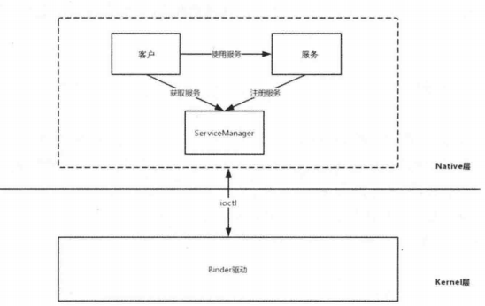

图 - Native Binder的架构

BpBinder是客户端与服务端交互的代理类，而BBinder 则代表了服务端，那么[图 - Native Binder的架构]就可以改为下图的形式。

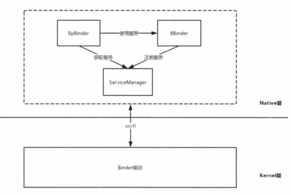

图 - 修改后的Native Binder的架构

从上图可以看到，Native Binder实际是基于C/S 架构的，BpBinder 代表了客户端， BBinder代表了服务端，Native Binder 通过ioctl函数和Binder驱动进行数据交互。 

# 5.6 小结

Native Binder的内容实际有很多，本章介绍了应用开发需要掌握的知识点，比如学习 Binder原理的前置的知识点，ServiceManager 中的 Binder 机制、ServiceManager  的启动过程、系统服务的注册过程和获取过程。可以说 Native Binder 的核心都是围绕着 ServiceManager的，只要理解了 ServiceManager 的相关内容，就已经掌握了Native  Binder 的关键部分。

# 问题

<font color='orange'>Q：Binder原理</font>


<font color='orange'>Q：Android中Binder机制。</font>


<font color='orange'>Q：Binder泄漏</font>


<font color='orange'>Q：Binder比起其他跨进程的通信方式好在哪？Binder的优势</font>


<font color='orange'>Q：Binder具体的实现原理，数据拷贝次数：代理模式&协议</font>


<font color='orange'>Q：简单讲讲Binder驱动吧？</font>


<font color='orange'>Q：为什么要用Binder</font>


<font color='orange'>Q：看过Binder驱动的源码，说说他的内存映射过程，说说客户端等待服务端处理返回的流程，如果要跨进程传递大内存数据你具体会怎么做？简单写一写吧。</font>


<font color='orange'>Q：Binder线程池的工作过程是什么样</font>


<font color='orange'>Q：Android Binder之应用层总结与分析</font>


<font color='orange'>Q：Binder怎么实现进程间通信的？mmap的模型？</font>


<font color='orange'>Q：Binder两个特点</font>


<font color='orange'>Q：进程间通信的方式，安卓中有哪些方式，为什么是基于Binder的，不用传统的操作系统进程间通信方式呢</font>


<font color='orange'>Q：Binder机制说一下。如何实现两个进程同时访问一个服务时线程同步问题。</font>


<font color='orange'>Q：Binder的通讯过程：具体server和client的通讯，为什么是一次拷贝</font>


<font color='orange'>Q：Binder通讯的流程</font>


# 参考

《Android进阶指北》