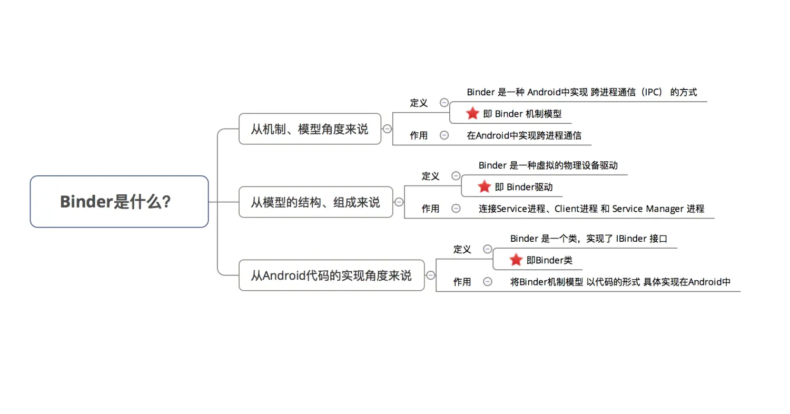

> version：2022/06/28
>
> review：


目录

[TOC]

# 前言

- 如果你接触过 跨进程通信 （`IPC`），那么你对`Binder`一定不陌生

- 虽然 网上有很多介绍 `Binder`的文章，可是存在一些问题：**浅显的讨论`Binder`机制 或 一味讲解 `Binder`源码、逻辑不清楚，最终导致的是读者们还是无法形成一个完整的`Binder`概念**

- 本文采用 

  清晰的图文讲解方式，按照 大角度 -> 小角度 去分析Binder，即：

  1. 先从 **机制、模型的角度** 去分析 整个`Binder`跨进程通信机制的模型
2. 再 从**源码实现角度**，分析 `Binder`在 `Android`中的具体实现

从而全方位地介绍 `Binder`。

# 目录


# 1. Binder到底是什么？

- 中文即 粘合剂，意思为粘合了两个不同的进程
- 网上有很多对`Binder`的定义，但都说不清楚：`Binder`是跨进程通信方式、它实现了`IBinder`接口，是连接 `ServiceManager`的桥梁blabla，估计大家都看晕了，没法很好的理解
- 我认为：对于`Binder`的定义，在不同场景下其定义不同



# 2. 知识储备

在讲解`Binder`前，我们先了解一些`Linux`的基础知识

### 2.1 进程空间划分

- 一个进程空间分为 用户空间 & 内核空间（`Kernel`），即把进程内 用户 & 内核 隔离开来
- 二者区别：
  1. 进程间，用户空间的数据不可共享，所以用户空间 = 不可共享空间
  2. 进程间，内核空间的数据可共享，所以内核空间 = 可共享空间

> 所有进程共用1个内核空间

- 进程内 用户空间  &  内核空间 进行交互 需通过 **系统调用**，主要通过函数：

> 1. copy_from_user（）：将用户空间的数据拷贝到内核空间
> 2. copy_to_user（）：将内核空间的数据拷贝到用户空间


## 2.2 进程隔离 & 跨进程通信（  IPC ）

- 进程隔离
   为了保证 安全性 & 独立性，一个进程 不能直接操作或者访问另一个进程，即`Android`的进程是**相互独立、隔离的**
- 跨进程通信（  `IPC` ）
   即进程间需进行数据交互、通信
- 跨进程通信的基本原理


> a. 而`Binder`的作用则是：连接 两个进程，实现了mmap()系统调用，主要负责 创建数据接收的缓存空间 & 管理数据接收缓存
>  b. 注：传统的跨进程通信需拷贝数据2次，但`Binder`机制只需1次，主要是使用到了内存映射，具体下面会详细说明

### 2.5 内存映射

具体请看文章：[操作系统：图文详解 内存映射](https://www.jianshu.com/p/719fc4758813)

------

# 3. Binder 跨进程通信机制 模型

### 3.1 模型原理图

`Binder` 跨进程通信机制 模型 基于 `Client - Server` 模式


### 3.2 模型组成角色说明


此处重点讲解 `Binder`驱动作用中的跨进程通信的原理：

- 简介


- 跨进程通信的核心原理

> 关于其核心原理：内存映射，具体请看文章：[操作系统：图文详解 内存映射](https://www.jianshu.com/p/719fc4758813)


## 3.3 模型原理步骤说明


### 3.4 额外说明

##### 说明1：`Client`进程、`Server`进程 & `Service Manager` 进程之间的交互 都必须通过`Binder`驱动（使用 `open` 和 `ioctl`文件操作函数），而非直接交互

原因：

1. `Client`进程、`Server`进程 & `Service Manager`进程属于进程空间的用户空间，不可进行进程间交互
2. `Binder`驱动 属于 进程空间的 内核空间，可进行进程间 & 进程内交互

所以，原理图可表示为以下：

> 虚线表示并非直接交互


##### 说明2：  `Binder`驱动 & `Service Manager`进程 属于 `Android`基础架构（即系统已经实现好了）；而`Client` 进程 和 `Server` 进程 属于`Android`应用层（需要开发者自己实现）

所以，在进行跨进程通信时，开发者只需自定义`Client`  &  `Server` 进程 并 显式使用上述3个步骤，最终借助 `Android`的基本架构功能就可完成进程间通信


##### 说明3：Binder请求的线程管理

- `Server`进程会创建很多线程来处理`Binder`请求
- `Binder`模型的线程管理 采用`Binder`驱动的线程池，并由`Binder`驱动自身进行管理

> 而不是由`Server`进程来管理的

- 一个进程的`Binder`线程数默认最大是16，超过的请求会被阻塞等待空闲的Binder线程。

> 所以，在进程间通信时处理并发问题时，如使用`ContentProvider`时，它的`CRUD`（创建、检索、更新和删除）方法只能同时有16个线程同时工作

------

- 至此，我相信大家对`Binder` 跨进程通信机制 模型 已经有了一个非常清晰的定性认识
- 下面，我将通过一个实例，分析`Binder`跨进程通信机制 模型在 `Android`中的具体代码实现方式

> 即分析 上述步骤在`Android`中具体是用代码如何实现的

------

# 4. Binder机制 在Android中的具体实现原理

- `Binder`机制在 `Android`中的实现主要依靠 `Binder`类，其实现了`IBinder` 接口

- 实例说明：`Client`进程 需要调用 `Server`进程的加法函数（将整数a和b相加）

> 即：
>
> 1. `Client`进程 需要传两个整数给 `Server`进程
> 2. `Server`进程 需要把相加后的结果 返回给`Client`进程

- 具体步骤
   下面，我会根据`Binder` 跨进程通信机制 模型的步骤进行分析

### 步骤1：注册服务

- 过程描述
   `Server`进程 通过`Binder`驱动 向  `Service Manager`进程 注册服务
- 代码实现
   `Server`进程 创建 一个 `Binder` 对象

> 1. `Binder` 实体是 `Server`进程 在 `Binder` 驱动中的存在形式
> 2. 该对象保存 `Server` 和 `ServiceManager` 的信息（保存在内核空间中）
> 3. `Binder` 驱动通过 内核空间的`Binder` 实体 找到用户空间的`Server`对象

- 代码分析

```java
    Binder binder = new Stub();
    // 步骤1：创建Binder对象 ->>分析1

    // 步骤2：创建 IInterface 接口类 的匿名类
    // 创建前，需要预先定义 继承了IInterface 接口的接口 -->分析3
    IInterface plus = new IPlus(){

          // 确定Client进程需要调用的方法
          public int add(int a,int b) {
               return a+b;
         }

          // 实现IInterface接口中唯一的方法
          public IBinder asBinder（）{ 
                return null ;
           }
};
          // 步骤3
          binder.attachInterface(plus，"add two int");
         // 1. 将（add two int，plus）作为（key,value）对存入到Binder对象中的一个Map<String,IInterface>对象中
         // 2. 之后，Binder对象 可根据add two int通过queryLocalIInterface（）获得对应IInterface对象（即plus）的引用，可依靠该引用完成对请求方法的调用
        // 分析完毕，跳出


<-- 分析1：Stub类 -->
    public class Stub extends Binder {
    // 继承自Binder类 ->>分析2

          // 复写onTransact（）
          @Override
          boolean onTransact(int code, Parcel data, Parcel reply, int flags){
          // 具体逻辑等到步骤3再具体讲解，此处先跳过
          switch (code) { 
                case Stub.add： { 

                       data.enforceInterface("add two int"); 

                       int  arg0  = data.readInt();
                       int  arg1  = data.readInt();

                       int  result = this.queryLocalIInterface("add two int") .add( arg0,  arg1); 

                        reply.writeInt(result); 

                        return true; 
                  }
           } 
      return super.onTransact(code, data, reply, flags); 

}
// 回到上面的步骤1，继续看步骤2

<-- 分析2：Binder 类 -->
 public class Binder implement IBinder{
    // Binder机制在Android中的实现主要依靠的是Binder类，其实现了IBinder接口
    // IBinder接口：定义了远程操作对象的基本接口，代表了一种跨进程传输的能力
    // 系统会为每个实现了IBinder接口的对象提供跨进程传输能力
    // 即Binder类对象具备了跨进程传输的能力

        void attachInterface(IInterface plus, String descriptor)；
        // 作用：
          // 1. 将（descriptor，plus）作为（key,value）对存入到Binder对象中的一个Map<String,IInterface>对象中
          // 2. 之后，Binder对象 可根据descriptor通过queryLocalIInterface（）获得对应IInterface对象（即plus）的引用，可依靠该引用完成对请求方法的调用

        IInterface queryLocalInterface(Stringdescriptor) ；
        // 作用：根据 参数 descriptor 查找相应的IInterface对象（即plus引用）

        boolean onTransact(int code, Parcel data, Parcel reply, int flags)；
        // 定义：继承自IBinder接口的
        // 作用：执行Client进程所请求的目标方法（子类需要复写）
        // 参数说明：
        // code：Client进程请求方法标识符。即Server进程根据该标识确定所请求的目标方法
        // data：目标方法的参数。（Client进程传进来的，此处就是整数a和b）
        // reply：目标方法执行后的结果（返回给Client进程）
         // 注：运行在Server进程的Binder线程池中；当Client进程发起远程请求时，远程请求会要求系统底层执行回调该方法

        final class BinderProxy implements IBinder {
         // 即Server进程创建的Binder对象的代理对象类
         // 该类属于Binder的内部类
        }
        // 回到分析1原处
}

<-- 分析3：IInterface接口实现类 -->

 public interface IPlus extends IInterface {
          // 继承自IInterface接口->>分析4
          // 定义需要实现的接口方法，即Client进程需要调用的方法
         public int add(int a,int b);
// 返回步骤2
}

<-- 分析4：IInterface接口类 -->
// 进程间通信定义的通用接口
// 通过定义接口，然后再服务端实现接口、客户端调用接口，就可实现跨进程通信。
public interface IInterface
{
    // 只有一个方法：返回当前接口关联的 Binder 对象。
    public IBinder asBinder();
}
  // 回到分析3原处
```

**注册服务后，`Binder`驱动持有 `Server`进程创建的`Binder`实体**

# 步骤2：获取服务

- `Client`进程 使用 某个 `service`前（此处是 **相加函数**），须通过`Binder`驱动 向 `ServiceManager`进程 获取相应的`Service`信息
- 具体代码实现过程如下：


**此时，`Client`进程与 `Server`进程已经建立了连接**

# 步骤3：使用服务

`Client`进程 根据获取到的 `Service`信息（`Binder`代理对象），通过`Binder`驱动 建立与 该`Service`所在`Server`进程通信的链路，并开始使用服务

- 过程描述
  1. `Client`进程 将参数（整数a和b）发送到`Server`进程
  2. `Server`进程 根据`Client`进程要求调用 目标方法（即加法函数）
  3. `Server`进程 将目标方法的结果（即加法后的结果）返回给`Client`进程
- 代码实现过程

**步骤1： `Client`进程 将参数（整数a和b）发送到`Server`进程**

```kotlin
// 1. Client进程 将需要传送的数据写入到Parcel对象中
// data = 数据 = 目标方法的参数（Client进程传进来的，此处就是整数a和b） + IInterface接口对象的标识符descriptor
  android.os.Parcel data = android.os.Parcel.obtain();
  data.writeInt(a); 
  data.writeInt(b); 

  data.writeInterfaceToken("add two int");；
  // 方法对象标识符让Server进程在Binder对象中根据"add two int"通过queryLocalIInterface（）查找相应的IInterface对象（即Server创建的plus），Client进程需要调用的相加方法就在该对象中

  android.os.Parcel reply = android.os.Parcel.obtain();
  // reply：目标方法执行后的结果（此处是相加后的结果）

// 2. 通过 调用代理对象的transact（） 将 上述数据发送到Binder驱动
  binderproxy.transact(Stub.add, data, reply, 0)
  // 参数说明：
    // 1. Stub.add：目标方法的标识符（Client进程 和 Server进程 自身约定，可为任意）
    // 2. data ：上述的Parcel对象
    // 3. reply：返回结果
    // 0：可不管

// 注：在发送数据后，Client进程的该线程会暂时被挂起
// 所以，若Server进程执行的耗时操作，请不要使用主线程，以防止ANR


// 3. Binder驱动根据 代理对象 找到对应的真身Binder对象所在的Server 进程（系统自动执行）
// 4. Binder驱动把 数据 发送到Server 进程中，并通知Server 进程执行解包（系统自动执行）
```

**步骤2：`Server`进程根据`Client`进要求 调用 目标方法（即加法函数）**

```java
// 1. 收到Binder驱动通知后，Server 进程通过回调Binder对象onTransact（）进行数据解包 & 调用目标方法
  public class Stub extends Binder {

          // 复写onTransact（）
          @Override
          boolean onTransact(int code, Parcel data, Parcel reply, int flags){
          // code即在transact（）中约定的目标方法的标识符

          switch (code) { 
                case Stub.add： { 
                  // a. 解包Parcel中的数据
                       data.enforceInterface("add two int"); 
                        // a1. 解析目标方法对象的标识符

                       int  arg0  = data.readInt();
                       int  arg1  = data.readInt();
                       // a2. 获得目标方法的参数
                      
                       // b. 根据"add two int"通过queryLocalIInterface（）获取相应的IInterface对象（即Server创建的plus）的引用，通过该对象引用调用方法
                       int  result = this.queryLocalIInterface("add two int") .add( arg0,  arg1); 
                      
                        // c. 将计算结果写入到reply
                        reply.writeInt(result); 
                        
                        return true; 
                  }
           } 
      return super.onTransact(code, data, reply, flags); 
      // 2. 将结算结果返回 到Binder驱动
```

**步骤3：`Server`进程 将目标方法的结果（即加法后的结果）返回给`Client`进程**

```kotlin
  // 1. Binder驱动根据 代理对象 沿原路 将结果返回 并通知Client进程获取返回结果
  // 2. 通过代理对象 接收结果（之前被挂起的线程被唤醒）

    binderproxy.transact(Stub.ADD, data, reply, 0)；
    reply.readException();；
    result = reply.readInt()；
          }
}
```

- 总结
   下面，我用一个原理图 & 流程图来总结步骤3的内容


# 5. 优点

对比 `Linux` （`Android`基于`Linux`）上的其他进程通信方式（管道、消息队列、共享内存、
 信号量、`Socket`），`Binder` 机制的优点有：


# 总结

- 本文主要详细讲解 跨进程通信模型 `Binder`机制 

特别地，对于从模型结构组成的Binder驱动来说：


- 整个`Binder`模型的原理步骤 & 源码分析


# 二、概述

## 1、 Binder是什么，有何作用？

Binder 是 Android 中用来实现进程间通信的一种机制。在整个 Android 系统中，Binder 被大量的使用。比如 Activity 的启动，系统服务的调用等，都用到了 Binder。

从Java层面来看，Binder 是实现了 IBinder 接口的一个类。通过 Binder，具体来说是通过aidl，应用可以很容易的实现跨进程通信，包括进程间对象的传递，方法的调用。

从Linux驱动层来看，它是/dev/binder目录下的一个binder驱动。

> TODO ：Linux角度，需要再学习。

## 2、为什么使用 Binder？

其实 Linux 中已经有了其他的一些 IPC 方式，比如管道、SystemV、Socket、共享内存、消息队列等。

2、 为什么要多进程？

在设备中，单个进程所分配的内存是有限的，根据机型不同，有36/48/64M等，当一个进程的内存不够使用时，就需要多个进程。

为了实现进程保活。

3、 什么时候需要用到进程间通信（使用场景）？

闹钟/打电话、WebView、图片加载库、推送、双进程守护

4、 进程间通信为什么要用到Binder机制？

不同进程之间存在进程隔离，不能直接通信。

内存划分：

 

比如有4G内存，用户空间分配3G，内核空间分配1G。用户空间之间是不能直接进行通信的，需要通过内核空间。（其实用户空间也不能对内核空间进行直接操作，必须通过“系统调用”进行通信，这样才能保证系统的安全性。）

5、 Android增加Binder的原因是什么？

Android特有IPC机制：Binder。

 

性能方面 

在移动设备上（性能受限制的设备，比如要省电），广泛地使用跨进程通信对通信 机制的性能有严格的要求，Binder相对于传统的Socket方式，更加高效。**Binder**数据拷贝只需要一次，而管道、消息队列、**Socket**都需要**2**次，共享内存方式一次内存拷贝都不需要，但实现方式又比较复杂。 

安全方面 

传统的进程通信方式对于通信双方的身份并没有做出严格的验证，比如Socket通信的IP地址是客户端手动填入，很容易进行伪造。然而，Binder机制从协议本身就支持对通信双方做身份校检，从而大大提升了安全性。

传统IPC传输数据：

 

Binder传输数据：

原理：MMAP(memory map)内存映射。

 

# 二、Binder原理

Binder通信采用C/S架构，从组件视角来说，包含Client、Server、ServiceManager 以及 Binder驱动，其中ServiceManager用于管理系统中的各种服务。架构图如下所示：


**Binder**通信的四个角色 

**Client**进程：使用服务的进程。 

**Server**进程：提供服务的进程。 

**ServiceManager**进程：ServiceManager的作用是将字符形式的Binder名字转化成 Client中对该Binder的引用，使得Client能够通过Binder名字获得对Server中Binder 实体的引用。 

**Binder**驱动：驱动负责进程之间Binder通信的建立，Binder在进程之间的传递， Binder引用计数管理，数据包在进程之间的传递和交互等一系列底层支持。

**Binder**运行机制 

图中Client/Server/ServiceManage之间的相互通信都是基于Binder机制。既然基于 Binder机制通信，那么同样也是C/S架构，则图中的3大步骤都有相应的Client端与 Server端。 

注册服务**(addService)**：Server进程要先注册Service到ServiceManager。该过程：Server是客户端，ServiceManager是服务端。 

获取服务**(getService)**：Client进程使用某个Service前，须先向ServiceManager中获取相应的Service。该过程：Client是客户端，ServiceManager是服务端。 

使用服务：Client根据得到的Service信息建立与Service所在的Server进程通信的通路，然后就可以直接与Service交互。该过程：Client是客户端，Server是服务端。

图中的Client，Server，Service Manager之间交互都是虚线表示，是由于它们彼此 之间不是直接交互的，而是都通过与Binder驱动进行交互的，从而实现IPC通信 （Interprocess Communication）方式。其中Binder驱动位于内核空间，Client， Server，Service Manager位于用户空间。Binder驱动和Service Manager可以看做 是Android平台的基础架构，而Client和Server是Android的应用层，开发人员只需自定义实现Client、Server端，借助Android的基本平台架构便可以直接进行IPC通 信。

**Binder**运行的实例解释 

首先我们看看我们的程序跨进程调用系统服务的简单示例，实现浮动窗口部分代 码

```java
//获取WindowManager服务引用 WindowManager wm = (WindowManager) getSystemService(getApplicati on().WINDOW_SERVICE); 
//布局参数layoutParams相关设置略... 
View view = LayoutInflater.from(getApplication()).inflate(R.layo ut.float_layout, null); 
//添加view 
wm.addView(view, layoutParams);
```

注册服务**(addService)**： 

在Android开机启动过程中，Android会初始化系统的各种 Service，并将这些Service向ServiceManager注册（即让ServiceManager管理）。 这一步是系统完成的。 

获取服务**(getService)**： 

客户端想要得到具体的Service直接向ServiceManager要即可。客户端首先向ServiceManager查询得到具体的Service引用，通常是 Service 引用的代理对象，对数据进行一些处理操作。即第2行代码中，得到的wm是 WindowManager对象的引用。 

使用服务： 

通过这个引用向具体的服务端发送请求，服务端执行完成后就返回。即第6行调用WindowManager的addView函数，将触发远程调用，调用的是运行在 systemServer进程中的WindowManager的addView函数。 

使用服务的具体执行过程


1. Client通过获得一个Server的代理接口，对Server进行调用。 

2. 代理接口中定义的方法与Server中定义的方法是一一对应的。 

3. Client调用某个代理接口中的方法时，代理接口的方法会将Client传递的参数打包成Parcel对象。 

4. 代理接口将Parcel发送给内核中的Binder Driver。 

5. Server会读取Binder Driver中的请求数据，如果是发送给自己的，解包Parcel 对象，处理并将结果返回。 

6. 整个的调用过程是一个同步过程，在Server处理的时候，Client会Block住。因此**Client**调用过程不应在主线程。 


# 问题

**1、Android 中进程和线程的关系？ 区别？**

线程是 CPU 调度的**最小单元**，同时线程是一种**有限**的系统资源进程一般指一个执行单元，在 PC 和移动设备上一个程序或则一个应用一般来说，一个 App 程序**至少有一个**进程，一个进程**至少有一个**线程（包含与被包含的关系）， 通俗来讲就是，在App 这个工厂里面有一个进程，线程就是里面的生产线，但主线程（主生产线）只有一条，而子线程（副生产线）可以有多个

进程有自己独立的地址空间，而进程中的线程共享此地址空间，都可以**并发**执行

**2、如何开启多进程 ？ 应用是否可以开启 N 个进程 ？** 

在 AndroidMenifest 中给四大组件指定属性 android:process 开启多进程模式

在内存允许的条件下可以开启 N 个进程

**3、为何需要 IPC？多进程通信可能会出现的问题？**

所有运行在不同进程的四大组件（Activity、Service、Receiver、ContentProvider）共享数据都会失败，这是由于 Android 为每个应用分配了独立的虚拟机，不同的虚拟机在内存分配上有不同的地址空间，这会导致在不同的虚拟机中访问同一个类的对象会产生多份副本。比如常用例子（**通过开启多进程获取更大内存空间、两个或则多个应用之间共享数据、微信全家桶**） 

一般来说，使用多进程通信会造成如下几方面的问题

**静态成员和单例模式完全失效**：独立的虚拟机造成

**线程同步机制完全实效**：独立的虚拟机造成

**SharedPreferences 的可靠性下降**：这是因为 Sp 不支持两个进程并发进行读写，有一定几率导致数据丢失

**Application 会多次创建**：Android 系统在创建新的进程会分配独立的虚拟机，所以这个过程其实就是启动一个应用的过程，自然也会创建新的Application

**4、Android 中 IPC 方式、各种方式优缺点，为什么选择 Binder？** 


与 Linux 上传统的 IPC 机制，比如 System V，Socket 相比，Binder 好在哪呢？

**传输效率高、可操作性强**：传输效率主要影响因素是内存拷贝的次数，拷贝次数越少，传输速率越高。从 Android进程架构角度分析：对于消息队列、Socket 和管道来说，数据先从发送方的缓存区拷贝到内核开辟的缓存区中，再从内核缓存区拷贝到接收方的缓存区，一共两次拷贝，如图：


而对于 Binder 来说，数据从发送方的缓存区拷贝到内核的缓存区，而接收方的缓存区与内核的缓存区是映射到同一块物理地址的，节省了一次数据拷贝的过程，如图：


由于共享内存操作复杂，综合来看，Binder 的传输效率是最好的。

**实现 C/S 架构方便**：Linux 的众 IPC 方式除了 Socket 以外都不是基于 C/S 架构，而 Socket 主要用于网络间的通信且传输效率较低。Binder 基于 C/S 架构 ，Server 端与Client 端相对独立，稳定性较好。

**安全性高**：传统 Linux IPC 的接收方无法获得对方进程可靠的 UID/PID，从而无法鉴别对方身份；而 Binder 机制为每个进程分配了 UID/PID 且在 Binder 通信时会根据UID/PID 进行有效性检测。

**5、Binder 机制的作用和原理？**

Linux 系统将一个进程分为**用户空间**和**内核空间**。对于进程之间来说，用户空间的数据不可共享，内核空间的数据可共享，为了保证安全性和独立性，一个进程不能直接操作或者访问另一个进程，即 Android 的进程是相互独立、隔离的，这就需要跨进程之间的数据通信方式


一次完整的 Binder IPC 通信过程通常是这样：

o 首先 Binder 驱动在内核空间创建一个数据接收缓存区；

o 接着在内核空间开辟一块内核缓存区，建立内核缓存区和内核中数据接收缓存区之间的映射关系，以及内核中数据接收缓存区和接收进程用户空间地址的映射关系；

o 发送方进程通过系统调用 copyfromuser() 将数据 copy 到内核中的内核缓存区，由于内核缓存区和接收进程的用户空间存在内存映射，因此也就相当于把数据发送到了接收进程的用户空间，这样便完成了一次进程间的通信。


**6、Binder 框架中 ServiceManager 的作用？**

o **Binder 框架** 是基于 C/S 架构的。由一系列的组件组成，包括 Client、Server、ServiceManager、Binder 驱动，其中Client、Server、ServiceManager 运行在用户空间，Binder 驱动运行在内核空间


**Server&Client**：服务器&客户端。在 Binder 驱动和ServiceManager 提供的基础设施上，进行 Client、Server 之间的通信。

**ServiceManager**（如同 DNS 域名服务器）服务的管理者，将 Binder 名字转换为 Client 中对该 Binder的引用，使得 Client 可以通过 Binder 名字获得 Server 中 Binder 实体的引用。

**Binder 驱动**（如同路由器）：负责进程之间 binder通信的建立，传递，计数管理以及数据的传递交互等底层支持。


<font color='orange'>Q：</font>


# 参考

[Carson带你学Android：全面剖析Binder跨进程通信原理](https://www.jianshu.com/p/4ee3fd07da14)
