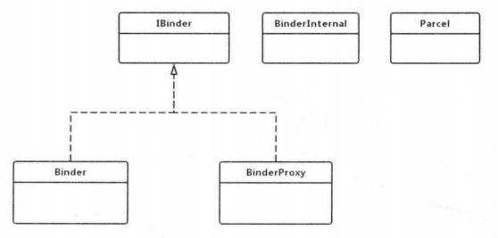
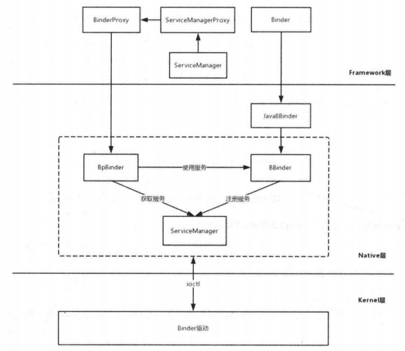

# Java Binder原理

Java Binder需要借助Native Binder来进行工作，因此 Java Binder在设计上也是一 个C/S 架构，可以说 Java Binder是 Native Binder的一个镜像，所以在学习Java Binder前， 首先要学习 Native Binder 的内容。

本文主要介绍 Java Binder 是如何初始化的 (Java Binder的 JNI 注册)和系统服务的注册过程。

# 6.1 Java Binder的JNI 注册 

Java Binder和Native Binder 进行通信前，需要通 JNI,JNI  的注册是在Zygote 进程启 动过程中进行的，代码如下所示。 

```kotlin
frameworks/base/core/jni/AndroidRuntime.cpp

void AndroidRuntime::start(const char* className, const Vector<String8>& options, bool zygote)
{
...
    /* start the virtual machine */
    JniInvocation jni_invocation;
    jni_invocation.Init(NULL);
    JNIEnv* env;
    if (startVm(&mJavaVM, &env, zygote) != 0) {//1
        return;
    }
    onVmCreated(env);

    /*
     * Register android functions.
     */
    if (startReg(env) < 0) {//2
        ALOGE("Unable to register all android natives\n");
        return;
    }
...
}
```

注释1处用于启动Java虚拟机

注释2处 startReg函数用于完成虚拟机的 JNI注册

> 关于 AndroidRuntime的 start 函数的具体分析在[应用程序的启动过程.md]中。
>

startReg函数如下所示。

```kotlin
frameworks/base/core/jni/AndroidRuntime.cpp

/*static*/ int AndroidRuntime::startReg(JNIEnv* env)
{
    ATRACE_NAME("RegisterAndroidNatives");
    androidSetCreateThreadFunc((android_create_thread_fn) javaCreateThreadEtc);

    ALOGV("--- registering native functions ---\n");

    env->PushLocalFrame(200);

    if (register_jni_procs(gRegJNI, NELEM(gRegJNI), env) < 0) {//1
        env->PopLocalFrame(NULL);
        return -1;
    }
    env->PopLocalFrame(NULL);
    return 0;
}
```

注释1处的register_jni_procs函数的作用就是循环调用gRegJNI数组的成员所对应的方法，如下所示。

```kotlin
static int register_jni_procs(const RegJNIRec array[], size_t count, JNIEnv* env)
{
    for (size_t i = 0; i < count; i++) {
        if (array[i].mProc(env) < 0) {
#ifndef NDEBUG
            ALOGD("----------!!! %s failed to load\n", array[i].mName);
#endif
            return -1;
        }
    }
    return 0;
}
```

gRegJNI数组中有100多个成员变量：

```kotlin
static const RegJNIRec gRegJNI[]={
REG_JNI(register_com_android_internal_os_RuntimeInit),
REG_JNI(register_com_android_internal_os_ZygoteInit_nativeZygoteInit), REG_JNI(register_android_os_SystemClock),
    ...
REG_JNI(register_android_os_Binder),//1
    ...
};
```

其中REG_JNI是一个宏定义：

```kotlin
#define REG_JNI(name)   {name  }
struct  RegJNIRec   {
	int(*mProc)(JNIEnv*);
};
```

实际上就是调用参数名所对应的函数。负责Java Binder和Native Binder 通信的函数为注释1处的register_android_os_Binder，代码如下所示。

```kotlin
frameworks/base/core/jni/android_util_Binder.cpp

int register_android_os_Binder(JNIEnvenv)
{
	//注册Binder类
	if  (int_register_android_os_Binder(env)<0) return -1;
	//注册BinderInternal类
	if(int_register_android_os_BinderInternal(env)<0) return  -1;
	//注册 BinderProxy类
	if(int_register_android_os_BinderProxy(env)<0)
	return -1;
    ...
	return  0;
}
```

register_android_os_Binder 函数有三个作用：注册 Binder 类、注册 BinderInternal类、 注册 BinderProxy类。它们是 Java Binder关联类的一小部分，它们的关系如图所示。



图 - Java Binder关联类

IBinder接口中定义了很多整型变量，其中定义一个叫作FLAG_ONEWAY的整形变量。 客户端在发起调用时一般会阻塞，直到服务端返回结果。设置 FLAG_ONEWAY后，客户端只需要把请求发送到服务端就可以立即返回，而不需要等待服务端的结果，这是一种非阻塞方式。

●  Binder和 BinderProxy实现了IBinder接口，Binder 是服务端的代表，而BinderProxy 是客户端的代表。

● BinderInternal只在Binder框架中被使用，其内部类GcWatcher用于处理 Binder的垃圾回收。

● Parcel是一个数据包装器，它可以在进程间进行传递，Parcel既可以传递基本数据类型又可以传递 Binder  对象，Binder  通信就是通过 Parcel 来实现客户端与服务端数据交互的。Parcel 的实现既有Java 部分，又有Native 部分，其具体实现在Native 部分中。

下面分别对Binder 、BinderInternal这两个类的注册进行分析。

## 6.1.1 Binder 类的注册

调用int_register_android_os_Binder函数来完成Binder类的注册，代码如下所示。 

```kotlin
frameworks/base/core/jni/android_util_Binder.cpp

static const JNINativeMethod gBinderMethods[] = {
     /* name, signature, funcPtr */
    // @CriticalNative
    { "getCallingPid", "()I", (void*)android_os_Binder_getCallingPid },
    // @CriticalNative
    { "getCallingUid", "()I", (void*)android_os_Binder_getCallingUid },
    // @CriticalNative
    { "isHandlingTransaction", "()Z", (void*)android_os_Binder_isHandlingTransaction },
    // @CriticalNative
    { "clearCallingIdentity", "()J", (void*)android_os_Binder_clearCallingIdentity },
    { "restoreCallingIdentity", "(J)V", (void*)android_os_Binder_restoreCallingIdentity },
    // @CriticalNative
    { "setThreadStrictModePolicy", "(I)V", (void*)android_os_Binder_setThreadStrictModePolicy },
    // @CriticalNative
    { "getThreadStrictModePolicy", "()I", (void*)android_os_Binder_getThreadStrictModePolicy },
    // @CriticalNative
    { "setCallingWorkSourceUid", "(I)J", (void*)android_os_Binder_setCallingWorkSourceUid },
    // @CriticalNative
    { "getCallingWorkSourceUid", "()I", (void*)android_os_Binder_getCallingWorkSourceUid },
    // @CriticalNative
    { "clearCallingWorkSource", "()J", (void*)android_os_Binder_clearCallingWorkSource },
    { "restoreCallingWorkSource", "(J)V", (void*)android_os_Binder_restoreCallingWorkSource },
    { "flushPendingCommands", "()V", (void*)android_os_Binder_flushPendingCommands },
    { "getNativeBBinderHolder", "()J", (void*)android_os_Binder_getNativeBBinderHolder },
    { "getNativeFinalizer", "()J", (void*)android_os_Binder_getNativeFinalizer },
    { "blockUntilThreadAvailable", "()V", (void*)android_os_Binder_blockUntilThreadAvailable }
};


const char* const kBinderPathName = "android/os/Binder";//1

static int int_register_android_os_Binder(JNIEnv* env)
{
    jclass clazz = FindClassOrDie(env, kBinderPathName);//2

    gBinderOffsets.mClass = MakeGlobalRefOrDie(env, clazz);//3
    gBinderOffsets.mExecTransact = GetMethodIDOrDie(env, clazz, "execTransact", "(IJJI)Z");//4
    gBinderOffsets.mGetInterfaceDescriptor = GetMethodIDOrDie(env, clazz, "getInterfaceDescriptor",
        "()Ljava/lang/String;");
    gBinderOffsets.mObject = GetFieldIDOrDie(env, clazz, "mObject", "J");//5

    return RegisterMethodsOrDie(
        env, kBinderPathName,
        gBinderMethods, NELEM(gBinderMethods));
}
```

1. 注释1处的 kBinderPathName 的值为"android/os/Binder"，这是Binder 在 Java  Binder 中的全路径名。
2. 注释2处根据这个路径名获取 Binder 的 Class 对象，并赋值给 jclass 类型的变量clazz，clazz是 Java 层的Binder 在 JNI 层的代表。

3. 注释3处通过 MakeGlobalRefOrDie 函数将本地引用 clazz 转变为全局引用并赋值给 gBinderOffsets.mClass。

4. 注释4处找到了 Java  层 的 Binder  的成员方法 execTransact  并赋值给 gBinderOffsets.mExecTransact。

5. 注释5处找到了Java 层的Binder的成员变量mObject并赋值给gBinderOffsets.mObject。

6. 最后一行代码通过RegisterMethodsOrDie函数注册gBinderMethods中定义的函数，其中gBinderMethods是JNINativeMethod类型的数组，其中存储的是Binder的Native方法(Java 层 ) 与JNI 层函数的对应关系。


gBinderMethods的定义如下所示。

```kotlin
static struct bindernative_offsets_t
{
	jclass mClass;
	jmethodID mExecTransact; 
    jfieldID mObject;
}gBinderOffsets;
```

使用gBinderMethods 来保存成员变量和方法有以下两个原因。

1. 为了提高效率。如果每次调用相关的方法时都需要查询方法和变量，那么显然效 率比较低。

2. 这些成员变量和方法都是本地引用，在 int_register_android_os_Binder 函数返回时， 这些本地引用会被自动释放，因此用gBinderOffsets来保存，以便后续使用。


## 6.1.2 Binderlnternal类的注册

调用 int_register_android_os_BinderInternal 函数来完成BinderInternal 类的注册，代码 如下所示。

```kotlin
frameworks/base/core/jni/android_util_Binder.cpp

static int int_register_android_os_BinderInternal(JNIEnv* env)
{
    jclass clazz = FindClassOrDie(env, kBinderInternalPathName);

    gBinderInternalOffsets.mClass = MakeGlobalRefOrDie(env, clazz);
    gBinderInternalOffsets.mForceGc = GetStaticMethodIDOrDie(env, clazz, "forceBinderGc", "()V");
    gBinderInternalOffsets.mProxyLimitCallback = GetStaticMethodIDOrDie(env, clazz, "binderProxyLimitCallbackFromNative", "(I)V");

    jclass SparseIntArrayClass = FindClassOrDie(env, "android/util/SparseIntArray");
    gSparseIntArrayOffsets.classObject = MakeGlobalRefOrDie(env, SparseIntArrayClass);
    gSparseIntArrayOffsets.constructor = GetMethodIDOrDie(env, gSparseIntArrayOffsets.classObject,
                                                           "<init>", "()V");
    gSparseIntArrayOffsets.put = GetMethodIDOrDie(env, gSparseIntArrayOffsets.classObject, "put",
                                                   "(II)V");

    BpBinder::setLimitCallback(android_os_BinderInternal_proxyLimitcallback);

    return RegisterMethodsOrDie(
        env, kBinderInternalPathName,
        gBinderInternalMethods, NELEM(gBinderInternalMethods));
}
```

和int_register_android_os_Binder函数的实现类似，BinderInternal类主要有以下三个作用。

1. 获取BinderInternal在 JNI 层的代表clazz。

2. 将BinderInternal类中有用的成员变量和方法存储到gBinderInternalOffsets中。

3. 注册 BinderInternal类的Native 方法对应的 JNI 函数。


还有一个BinderProxy 类的注册，它和Binder、BinderInternal 的注册过程类似，这里就不再赘述了。

# 6.2 Java Binder中系统服务的注册过程

Native Binder 中的系统服务的注册过程的核心是ServiceManager，在Java Binder中，也有一个ServiceManager，然而这个 ServiceManager是 Java 文件。

既然要将系统服务注册到 ServiceManager，那么就需要选择一个系统服务，这里以常见的AMS 为例。

## 6.2.1   将 AMS 注册到 ServiceManager

在 AMS的 setSystemProcess 方法中，会调用ServiceManager的 addService方法，如下所示。

```kotlin
frameworks/base/services/core/java/com/android/server/am/ActivityManagerService.java

public void setSystemProcess() {
        try {
            ServiceManager.addService(Context.ACTIVITY_SERVICE, this, /* allowIsolated= */ true,
                    DUMP_FLAG_PRIORITY_CRITICAL | DUMP_FLAG_PRIORITY_NORMAL | DUMP_FLAG_PROTO);//1
...
    }
```

注释1处的Context.ACTIVITY_SERVICE的值为"activity"，其作用就是将AMS注册到ServiceManager中。

接着来看ServiceManager的 addService方法，如下所示。

```kotlin
frameworks/base/core/java/android/os/ServiceManager.java

public static void addService(String name,IBinder service,boolean allowIsolated,int dumpPriority){
try {
	getIServiceManager().addService(name,service,allowIsolated, dumpPriority);
	}catch(RemoteExceptione){
 		Log.e(TAG,"error in addService",e);
	}
}
```

主要分析getIServiceManager方法返回的是什么，代码如下所示。

```kotlin
frameworks/base/core/java/android/os/ServiceManagerjava

private  static  IServiceManager  getIServiceManager(){ 
    if(sServiceManager !=null){
		return  sServiceManager;
    }
	sServiceManager = ServiceManagerNative
		.asInterface(Binder.allowBlocking(BinderInternal.getContextObject(
)));
return  sServiceManager;
}
```

- BinderInternal.getContextObject

- ServiceManagerNative.asInterface
- getIServiceManager().addService

### 1.Binderlnternal.getContextObject

Binder.allowBlocking的作用是将BinderProxy的 sWarnOnBlocking的值设置为false，主要来分析BinderInternal.getContextObject的作用，这是一个Native 方法，找到它对应的函数。

```kotlin
frameworks/base/core/jni/androidutilBinder.cpp

static  const  JNINativeMethod  gBinderInternalMethods[]={ {"getContextObject","()Landroid/os/IBinder;",
(void)android_os_BinderInternal_getContextObject   },
};
```

其对应的函数为android_os_BinderInternal_getContextObject。

```kotlin
frameworks/base/core/jni/androidutil_Binder.cpp

static jobject android_os_BinderInternal_getContextObject(JNIEnvenv,jobject clazz)
{
sp<IBinder>b =ProcessState::self()->getContextObject(NULL);//1
    return  javaObjectForIBinder(env,b);
}
```

ProcessState::self的作用是创建ProcessState，注释1处最终返回的是BpBinder。

BpBinder是 Native  Binder 中的客户端，这说明 Java 层的ServiceManager  需要Native 层的 BpBinder, 但是这个 BpBinder 在 Java 层是无法直接使用的，那么就需要传入 javaObjectForIBinder 函数来进行处理，其内部会创建一个 BinderProxy 对象，这样BinderInternal.getContextObject最终得到的是BinderProxy，BinderProxy 是 Java Binder的客户端的代表。

需要注意的是，这个传入的 BpBinder 会保存到 BinderProxy的成员变量mObject 中。

### 2.ServiceManagerNative.aslnterface

提到 asInterface 方法，在Native  Binder 中也有一个asInterface 函数，它的作用是以 BpBinder作为参数创建 BpServiceManager。那么在Java Binder中的asInterface 方法的作用又是什么?

```kotlin
frameworks/base/core/java/android/os/ServiceManagerNative.java

static public IServiceManager asInterface(IBinder obj)
{
	if(obj==null){ 
		return null;
 	}
IServiceManager in =
	(IServiceManager)obj.queryLocalInterface(descriptor);

	if(in != null){
		return in;
	}
	return new ServiceManagerProxy(obj);
}
```

我们知道obj的值为BinderProxy，那么 asInterface方法的作用就是以BinderProxy作为参数创建ServiceManagerProxy的 。

BinderProxy和 BpBinder 分别在 Jave  Binder 和Native  Binder 中作为客户端的代表， BpServiceManager通过BpBinder 来实现通信，ServiceManagerProxy 也会将业务的请求交给 BinderProxy来处理。

分析到这里，如下代码：

```kotlin
sServiceManager  =ServiceManagerNative
.asInterface(Binder.allowBlocking(BinderInternal.getContextObject(
)));
```

可以理解为：

```kotlin
sServiceManager =new ServiceManagerProxy(BinderProxy);
```

###  3.getIServiceManager().addService

getIServiceManager 返回的是 ServiceManagerProxy，ServiceManagerProxy  是 ServiceManagerNative的内部类，它实现了IServiceManager接口。

接着来查看ServiceManagerProxy的 addService方法，代码如下所示。

```kotlin
frameworks/base/core/java/android/os/ServiceManagerNative.java::ServiceManagerProxy

public void addService(String name,IBinder service,boolean allowIsolated,int dumpPriority)throws RemoteException {

Parcel data = Parcel.obtain(); 
Parcel reply=Parcel.obtain();
data.writeInterfaceToken(IServiceManager.descriptor); data.writeString(name);
data.writeStrongBinder(service);//1
data.writeInt(allowIsolated    ?1   :0); data.writeInt(dumpPriority);
mRemote.transact                     (ADD_SERVICE_TRANSACTION,data,reply,0);//2
reply.recycle(); data.recycle();
}
```

注释1处的data.writeStrongBinder 很关键，后面章节会进行分析。这里的Parcel是 一个数据包装器，它能够将请求数据写入 Parcel 类型的对象 data 中，通过注释2处的 mRemote.transact发送出去，mRemote实际上是BinderProxy，BinderProxy.transact是native 函数，实现的函数如下所示。

```kotlin
frameworks/base/core/jni/androidutilBinder.cpp

static jboolean android_os_BinderProxy_transact(JNIEnvenv,jobject obj, jint  code,jobject dataObj,jobject replyObj,jint flags)
{
if(dataObj ==NULL){
jniThrowNullPointerException(env,NULL); return JNI_FALSE;
}

Parceldata =parcelForJavaObject(env,dataObj);//1
if(data ==NULL){  
    return JNI_FALSE;
}
Parcelreply =parcelForJavaObject(env,replyObj);//2
if(reply ==NULL &&replyObj  !=NULL){ return JNI_FALSE;
}

IBinder* target =getBPNativeData(env,obj)->mObject.get();//3
if(target ==NULL){
jniThrowException(env,"java/lang/IllegalStateException","Binder  has  been
finalized!");
return JNI_FALSE;
}
status_t err =target->transact(code,data,reply,flags);//4
return JNI_FALSE;
}
```

- 注释1处和注释2处将Java 层的Parcel对象转化成为Native层的Parcel对象。
- 我们知道BpBinder会保存到BinderProxy的成员变量mObject中，因此在注释3处，从 BinderProxy 的成员变量mObject中获取BpBinder。
- 最终会在注释4处调用BpBinder的 transact 函数， 向 Binder驱动发送数据，可以看出Java Binder是需要Native Binder 支持的，最终的目的就是向Binder驱动发送数据和接收数据。

## 6.2.2  引 出JavaBBinder

继续来分析6.2.1节的 data.writeStrongBinder(service)，代码如下所示。

```kotlin
frameworks/base/core/java/android/os/Parcel.java

public final void writeStrongBinder(IBinder ll){
	nativeWriteStrongBinder(mNativePtr,val);
}
```

nativeWriteStrongBinder 是 Native 方 法 ， 实现的函数为 android_os_Parcel_ writeStrongBinder，代码如下所示。

```kotlin
frameworks/base/core/jni/android/os/Parcel.cpp

static void android_os_Parcel_writeStrongBinder(JNIEnvenv,jclass   clazz,jlong nativePtr,jobject object)
{  
    Parcelparcel =reinterpret_cast<Parcel>(nativePtr);

	if(parcel !=NULL){
		const status_t err =parcel->writeStrongBinder(ibinderForJavaObject(env,
object));//1
		if(err !=NO_ERROR){
			signalExceptionForError(env,clazz,err);
		}
	}
}
```

接着查看注释1处 ibinderForJavaObject函数，代码如下所示。

```kotlin
frameworks/base/core/jni/android_util_Binder.cpp

sp<IBinder>ibinderForJavaObject(JNIEnvenv,jobject obj)
{  
    if(obj ==NULL)return NULL;
	if(env->IsInstanceOf(obj,gBinderOffsets.mClass)){//1 
    JavaBBinderHolderjbh  =(JavaBBinderHolder)
env->GetLongField(obj,gBinderOffsets.mObject); return jbh->get(env,obj);//2
}
	if(env->IsInstanceOf(obj,gBinderProxyOffsets.mClass)){//3 
	    return   getBPNativeData(env,obj)->mObject;
	}
	ALOGW("ibinderForJavaObject:8p is not a Binder object",obj); return NULL;
}
```

在注释3处，如果obj是 Java层的BinderProxy类，则返回BpBinder。

在注释1处，如果 obj是 Java 层的Binder类，那么先获取 JavaBBinderHolder 对象， 然后在注释2处调用JavaBBinderHolder的 get 函数，代码如下所示。

```kotlin
frameworks/base/core/jni/android_util_Binder.cpp::JavaBBinderHolder

class JavaBBinderHolder
{
public:
    sp<JavaBBinder> get(JNIEnv* env, jobject obj)
    {
        AutoMutex _l(mLock);
        sp<JavaBBinder> b = mBinder.promote();//1
        if (b == NULL) {
            // obj 是一个 Java 层的 Binder 对象
            b = new JavaBBinder(env, obj);//2
            mBinder = b;
            ALOGV("Creating JavaBinder %p (refs %p) for Object %p, weakCount=%" PRId32 "\n",
                 b.get(), b->getWeakRefs(), obj, b->getWeakRefs()->getWeakCount());
        }

        return b;
    }

    sp<JavaBBinder> getExisting()
    {
        AutoMutex _l(mLock);
        return mBinder.promote();
    }

private:
    Mutex           mLock;
    wp<JavaBBinder> mBinder;
};
```

成员变量mBinder 是wp<JavaBBinder>  类型的弱引用，在注释1处得到sp<JavaBBinder> 类型的强引用b，在注释2处创建 JavaBBinder 并赋值给b。那么 JavaBBinderHolder 的 get 函数返回的是JavaBBinder。

data.writeStrongBinder(service) 在这里等价于：data.writeStrongBinder(new JavaBBinder(env,Binder))。

讲到这里我们可以得知 ServiceManager.addService() 传入的并不是 AMS 本身，而是 JavaBBinder。

## 6.2.3 解析JavaBBinder

查看JavaBBinder的构造函数，代码如下所示。

```kotlin
frameworks/base/core/jni/android_util_Binder.cpp::JavaBBinderHolder::JavaBBinder

class JavaBBinder : public BBinder
{
public:
    JavaBBinder(JNIEnv* env, jobject /* Java Binder */ object)
        : mVM(jnienv_to_javavm(env)), mObject(env->NewGlobalRef(object))
    {
        ALOGV("Creating JavaBBinder %p\n", this);
        gNumLocalRefsCreated.fetch_add(1, std::memory_order_relaxed);
        gcIfManyNewRefs(env);
    }

    bool    checkSubclass(const void* subclassID) const
    {
        return subclassID == &gBinderOffsets;
    }

    jobject object() const
    {
        return mObject;
    }
```

由上述代码可以知道 JavaBBinder 继承了 BBinder, 那么JavaBBinder 的作用是什么呢? 当 Binder 驱动得到客户端的请求，紧接着会将响应发送给 JavaBBinder，这时会调用 JavaBBinder的 onTransact函数，代码如下所示。

```kotlin
frameworks/base/core/jni/androiduti/Binder.cpp::JavaBBinderHolder::JavaBBinder

    status_t onTransact(
        uint32_t code, const Parcel& data, Parcel* reply, uint32_t flags = 0) override
    {
        JNIEnv* env = javavm_to_jnienv(mVM);
        ALOGV("onTransact() on %p calling object %p in env %p vm %p\n", this, mObject, env, mVM);
        IPCThreadState* thread_state = IPCThreadState::self();
        const int32_t strict_policy_before = thread_state->getStrictModePolicy();

        jboolean res = env->CallBooleanMethod(mObject, gBinderOffsets.mExecTransact,
            code, reinterpret_cast<jlong>(&data), reinterpret_cast<jlong>(reply), flags);//1
...
        return res != JNI_FALSE ? NO_ERROR : UNKNOWN_TRANSACTION;
    }
```

在注释1处会调用Java 层Binder的 execTransact函数，代码如下所示。

```kotlin
frameworks/base/core/java/android/os/Binder.java

    private boolean execTransact(int code, long dataObj, long replyObj,
            int flags) {
..
            return execTransactInternal(code, dataObj, replyObj, flags, 
    }

    private boolean execTransactInternal(int code, long dataObj, long replyObj, int flags,
            int callingUid) {
       
        final boolean tracingEnabled = Binder.isTracingEnabled();
        try {
            if (tracingEnabled) {
            res = onTransact(code, data, reply, flags);
        } catch (RemoteException|RuntimeException e) {
            ...
        return res;
    }
```

上述代码的关键点是注释1处的onTransact 函 数，AMS实现了 onTransact 函数，从而完成业务实现。

从这里可以看出，JavaBBinder 并没有实现什么业务，当它接收到请求时，会调用 Binder 类的 execTransact 函数 ，execTransact函数内部又调用了onTransact 函数，系统服务会重写 onTransact函数来实现自身的业务功能。

## 6.2.4 Java Binder架构

Binder 架构简图如图所示。



图 - Binder 架构简图

(1)Binder 是服务端的代表，JavaBBinder 继承BBinder，JavaBBinder 通过mObject 变量指向Binder。

(2)BinderProxy 是客户端的代表，ServiceManager 的 addService 等方法会交由 ServiceManagerProxy 来处理。

(3)ServiceManagerProxy 的成员变量 mRemote 指向 BinderProxy 对象，所以 ServiceManagerProxy 的 addService 等方法会交由BinderProxy 来处理。

(4)BinderProxy  的成员变量mObject 指向 BpBinder 对象，因此 BinderProxy  可以通过 BpBinder和 Binder 驱动发送数据。

# 总结 

了解了 Java Binder的 JNI 注册和系统服务的注册过程。


# 参考

《Android进阶指北》