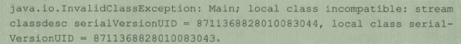
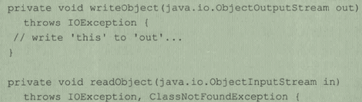
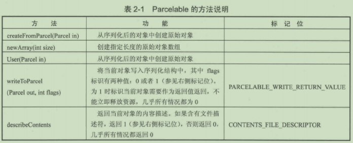

> version：2021/11/06
>
> review：


目录

[TOC]


# 一、前言

IPC的意思是跨进程通信，是指在多个进程之间进行数据传递。既然要传递数据，数据的类型那么多，它是什么都能传吗？当然不是。本文将介绍三个IPC的前置知识点：`Serializable接口`，`Parcelable接口`，`Binder`。只有掌握了这几个知识点，才能更好地理解跨进程通信的各种方式。

通过`Serializable接口` 和 `Parcelable接口`可以完成对象的序列化过程，当我们需要通过 Intent 和 Binder 传输数据时就需要使用`Serializable`或`Parcelable`接口。当我们需要**把对象持久化到存储设备上**或者**通过网络传输给其他客户端**时，需要使用`Serializable`来完成对象的持久化。下面介绍如何使用 `Serializable` 来完成对象的序列化。


# 二、Serializable 接口

Serializable 是 Java 提供的一个序列化接口，它是一个空接口，为对象提供标准的序列化和反序列化操作。一个对象要想能够序列化，只需要其类实现 Serializable 接口即可，如下示例：

```java
public class User implements Serializable {
    public int id;
    public String name;

    public User(int id, String name) {
        this.id = id;
        this.name = name;
    }
}
```

这样 User 类的对象就可以被序列化和反序列化了。通过 Serializable 接口来实现对象的序列化，几乎所有工作都被系统自动完成了。

那要如何进行序列化和反序列化呢？这里举一个往文件中写、读序列化对象的例子：

```java
        try {
            // 序列化过程
            User user = new User(1, "Jack");
            ObjectOutputStream out = new ObjectOutputStream(
                    new FileOutputStream("cache.txt"));
            out.writeObject(user);
            out.close();
            
            // 反序列化过程
			ObjectInputStream in = new ObjectInputStream(
        			new FileInputStream("cache.txt"));
			User newUser = (User) in.readObject();
			in.close();
        } catch (IOException e) {
            e.printStackTrace();
        }
```

上述代码是通过 Serializable 接口来实现对象序列化的典型过程，只需把实现了 Serializable 接口的对象写到文件中，然后就可以从文件中再读取出一个对象了，但是要注意，**恢复后的对象虽然和之前对象的内容一样，但是二者并非相同对象实例**。


**serialVersionUID 的作用：**

当然，很多时候，我们会看到这样的代码：

```java
public class User implements Serializable {
    private static final long serialVersionUID = 1946163516564L;

    public int id;
    public String name;

    public User(int id, String name) {
        this.id = id;
        this.name = name;
    }
}
```

这个 `serialVersionUID` 即使不指定也能实现序列化，那它的作用是什么呢？

`serialVersionUID` 是用来辅助序列化和反序列化过程的，原则上序列化后的数据中 `serialVersionUID` 只有和当前类的 `serialVersionUID` 相同才能够被正常地反序列化。其工作机制是，序列化的时候系统会把当前类的 `serialVersionUID` 写入到序列化的文件（也可能是其他中介）中，反序列化时系统会去检测文件中的 `serialVersionUID` ，看它是否和当前类的 `serialVersionUID` 一致，如果一致，说明序列化的类版本和当前的类版本一致，就可以成功反序列化；否则说明当前类和序列化的类不一致，比如成员变量的数量、类型发生了改变，这个时候就不能正常序列化了，会报错：



一般来说，我们应该主动指定 `serialVersionUID` 的值，也可以让 Android Srudio 根据当前类结构自动生成它的 hash 值，作为`serialVersionUID` ，这样也可以正常反序列化。但是如果不指定 `serialVersionUID`  的值，当类增加或删除了某些成员变量时，hash 值就会改变并自动赋值给 `serialVersionUID` ，这时候 `serialVersionUID` 就变了，反序列化就会失败。因此，还是要尽量指定 `serialVersionUID`  ，这样即使类增加或删除了一些成员变量也能正常序列化，最大限度的恢复数据，相反，如果不指定，就会报错，甚至crash。

当然，如果类结构发生了其他改变，比如修改了类名、成员变量类型，这时候即使 `serialVersionUID`  相同，反序列化也会失败。

小结：`serialVersionUID` 可以手动指定或让 IDE 自动根据类结构生成 hash 值，两者没有本质区别，效果也一样。还需要注意两点，一是静态成员变量属于类，所以不会参与序列化过程；二是用 transient 关键字标记的成员变量也不会参与序列化过程。

最后，系统默认的序列化过程是可以改变的，通过重写如下两个方法（绝大多数时候是不需要重写的）：




# 三、Parcelable 接口

除了 Serializable 接口，在 Android 中还提供了新的序列化方式，Parcelable 接口，其过程要稍微复杂一些。

Parcelable 也是一个接口，只要实现这个接口，一个类的对象就可以实现序列化并可以通过 Intent 和 Binder 传递。

典型用法示例：

```java
public class User implements Parcelable {
    public int id;
    public String name;
    public Tag tag;

    public User(int id, String name, Tag tag) {
        this.id = id;
        this.name = name;
        this.tag = tag;
    }

    protected User(Parcel in) {
        id = in.readInt();
        name = in.readString();
        tag = in.readParcelable(Tag.class.getClassLoader());
    }

    @Override
    public void writeToParcel(Parcel dest, int flags) {
        dest.writeInt(id);
        dest.writeString(name);
        dest.writeParcelable(tag, flags);
    }

    @Override
    public int describeContents() {
        return 0;
    }

    public static final Creator<User> CREATOR = new Creator<User>() {
        @Override
        public User createFromParcel(Parcel in) {
            return new User(in);
        }

        @Override
        public User[] newArray(int size) {
            return new User[size];
        }
    };
}

public class Tag implements Parcelable {
    protected Tag(Parcel in) {
    }

    @Override
    public void writeToParcel(Parcel dest, int flags) {
    }

    @Override
    public int describeContents() {
        return 0;
    }

    public static final Creator<Tag> CREATOR = new Creator<Tag>() {
        @Override
        public Tag createFromParcel(Parcel in) {
            return new Tag(in);
        }

        @Override
        public Tag[] newArray(int size) {
            return new Tag[size];
        }
    };
}
```

这个代码是可以通过 Android Studio 自动生成的。

Parcel 内部包装了可序列化的数据，可以在 Binder 中自由传输。

在上面的代码中，主要包含三个功能：序列化、反序列化和内容描述。序列化功能由 `writeToParcel` 方法完成，最终是通过 Parcel 中的一系列 write 方法来完成的；反序列化功能由 `CREATOR` 完成，内部标明了如何创建序列化对象和数组，并通过 Parcel 的一系列 read 方法来完成反序列化过程；内容描述功能由 `describeContents` 完成，几乎所有情况都应该返回 0 ，仅当当前对象中存在文件描述符时，返回 1 。

需要注意的是，在 User(Parcel in)方法中，由于 Tag 是另外一个实现类 Parcelable 接口的对象，所以它的反序列化过程需要传递当前线程的上下文类加载器，否则会报无法找到类的错误。

详细方法如下：




系统已经为我们提供了很多实现类 Parcelable 接口的类，它们都可以直接序列化，比如 Intent、Bundle、Bitmap 等，同时 List 和 Map 也可以序列化，前提是它们里面的每个元素都是可序列化的。

**Parcelabe 和 Serializable 的区别？**

既然 Parcelabe 和 Serializable 都能实现序列化并且都可用于 Intent 间的数据传递，那二者该如何选择呢？

Serializable 是 Java 中的序列化接口，使用起来简单但是开销大，序列化和反序列化都需要大量 I/O 操作。

而 Parcelable 是 Android 中的序列化方式，因此更适合用在 Android 平台上，缺点是使用起来稍微麻烦一点（但是 Android Studio 已经可以自动帮我们生成代码了），但是它的效率很高，这也是 Android 推荐的序列化方式，因此要首选 Parcelable。Parcelable 主要用在内存序列化上，通过 Parcelable 将对象序列化到存储设备中或者将对象序列化后通过网络传输也都可以，知识这个过程会稍显复杂，这两种情况还是建议使用 Serializable。


# 四、Binder

Binder 是一个比较复杂的知识点，本节侧重点是介绍 Binder 的使用以及上层原理。


# 相关问题

<font color='orange'>Q：</font>


<font color='orange'>Q：</font>


<font color='orange'>Q：</font>


<font color='orange'>Q：</font>


<font color='orange'>Q：</font>


<font color='orange'>Q：</font>


<font color='orange'>Q：</font>


# 总结

1、

## 【精益求精】我还能做（补充）些什么？

1、


# 脑图


# 参考

1、《Android开发艺术探索，任玉刚》，第2章。

2、