> version：2021/10/
>
> review：

目录

[TOC]

# 一、远程Service(Remote Service)——AIDL

下面是对远程服务的需求分析：

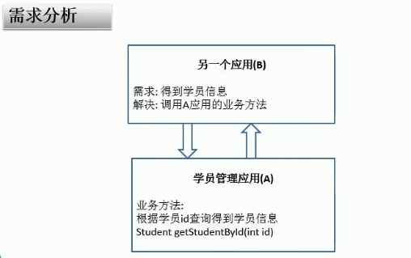 

针对这种情况，Android设计了AIDL。

### ***\*5.1 AIDL\*******\*基本概念\****

每个应用程序都运行在自己的独立进程中，并且可以启动另一个应用程序的服务，而且经常需要在不同的进程间传递数据对象。

在Android平台 ，一个进程不能直接访问另一个进程的内存空间，所以想要对话，需要将对象分解成操作系统可以理解的基本单元，并且有序的通过进程边界。

基本单元：基本数据类型（int。。。）、可序列化的、可打包的。

有序：写的顺序和读的顺序要一致。

### ***\*5.2 AIDL\*******\*的使用\****

AIDL全称Android Interface Definition Language，用于生成可以在Android设备上进行进程间通信(interprocess communication,IPC)的代码。

如果在一个进程中（例如Acticity）要调用另一个进程中（例如Service）中的对象，就可以使用AIDL生成可序列化的参数。

下面梳理一下AIDL使用的步骤：

##### ***\*服务端流程：\****

​	即提供服务的程序（进程）。

**第一步：构建相应的文件结构。大致如下：**

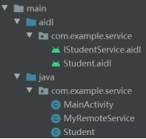 

在这一步，要注意文件名称保持一致。

**第二步：定义A****IDL****接口。**

1、：这个文件，内容如下：

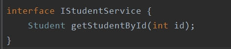 

定义了当前进程可以对其他进程提供的服务（业务）。

2、 如果业务中包含有自定义的类，比如Student。那么还需要生成一个Student.aidl文件，并且Student类需要实现Parcelable接口。

Student.aidl文件如下：

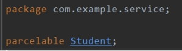 

Student.class如下：

public class Student implements Parcelable {

//。。。

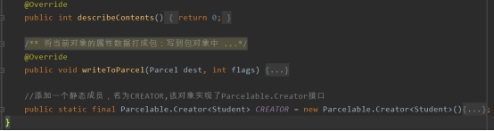 

**第三步：make** **project****à****生成：**

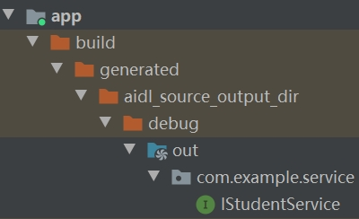 

IStudentService接口说明：

前面说的AIDL文件的目的就是为了生成一份跨进程通信的代码。即此接口。这个接口中包含之前IStudentService.aidl中定义好的要提供给外部的所有方法，以及一个抽象类Stub，如下：

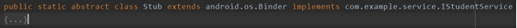 

在服务端，最终要返回给客户端的就是Stub的实现类。

**第四步：实现接口，创建服务。**

1、 构建Stub的子类。目的是为了实现接口中定义的方法。

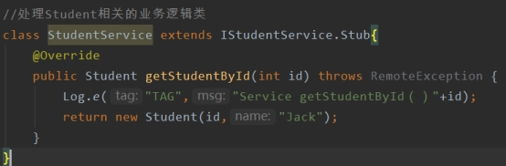 

2、 在MyRemoteService服务的onBind()中，将Stub的实现类StudentService（本质是一个Binder）返回出去，最终在客户端的onServiceConnected中获取：

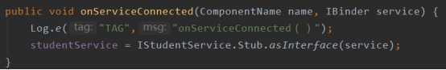 

 

总结一下服务端的流程：

Aidl文件à接口（通信代码）àBinder子类实现接口àonBind()返回IBinder实现类。

##### ***\*客户端流程：\****

第一步：首先，要实现跨进程通信，客户端也需要一套通信代码，文件结构图下，把服务端的相关文件复制过来即可。

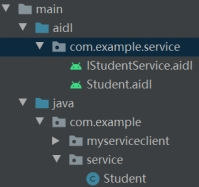 

第二步：绑定服务，bindService()。

绑定服务时，会回调onServiceConnected方法，然后把onBind()返回的Stub子类(即IBinder的实现类，最终为我们自己实现的Binder子类)作为参数传递过来，但是在传递的过程中，会被转换为一个BinderProxy对象，这个对象也是真正传递过来的对象。 

有了BinderProxy后，通过如下方法得到接口实现类（Proxy）：

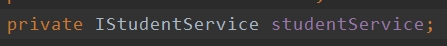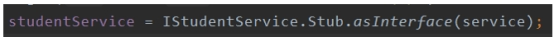 

第三步：使用studentService实现类，去调用接口的实现方法。

 

##### ***\*其他：\****

编写AIDL接口时应注意：

1、 接口名和aidl文件名相同。

2、 接口和方法前不用加访问权限修饰符（public、private、protected），也不能用final、static。

3、 Aidl默认支持的类型包括java基本数据类型（int、long、boolean等）和（String、Lsit、Map、CharSequence），使用这些类型时不需要import声明。对于List和Map中的元素类型必须时aidl支持的类型，如果使用的是自定义类型作为参数或返回值，自定义类型必须实现Parcelable接口。

4、 自定义类型和aidl生成的其他接口类型在aidl描述文件中，应该显式import，即便该类和定义的接口在用一个包中。

5、 在aidl文件中，所有非java基本类型参数必须加上in、out、inout标记，以指明参数是输入参数、输出参数、还是输入输出参数。

6、 Java原始类型默认标记为in，不能为其他。

 

在Android Studio中，直接生成aidl文件即可，同时要注意包名的一致性。

错误记录：aidl文件命名也要一致，不然会报错。

Process 'command 'D:\SDK\build-tools\27.0.3\aidl.exe'' finished with non-zero exit value 1

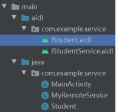 

这个错误就是由于 IStudent.aidl 和 Student名称不一致导致的。

# 相关问题

Q：

Q：

Q：

Q：

Q：

Q：

Q：

# 总结

1、

## 【精益求精】我还能做（补充）些什么？

1、

