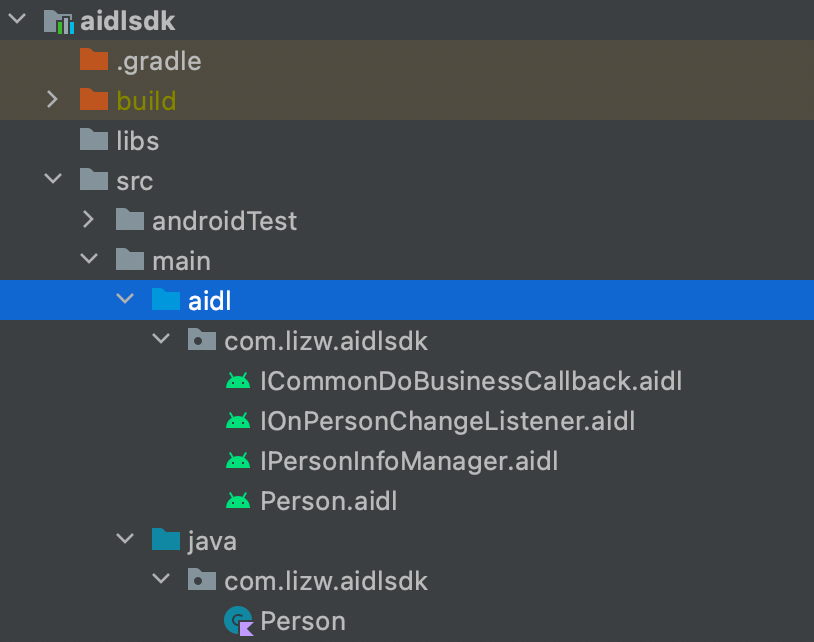

> version：2022/10/7
>
> review：


目录

[TOC]

# 一、AIDL 简介

在 Android 系统中一个进程通常无法直接访问另一个进程的内存空间，这被称为Application Sandbox。所以进程间想要通信，就需要将对象分解成操作系统可以理解的基本单元（基本数据类型，可序列化的、可打包的），并且有序的（写的顺序和读的顺序要一致）通过进程边界。要实现上述跨进程通信的协议是比较复杂的，需要将数据进行编组和解组等操作，为了简化应用层实现进程间通信的难度，Android系统提供了 AIDL，用于生成进程间通信的代码。

AIDL 全称Android 接口定义语言（Android Interface Definition Language），是一种用于定义客户端和服务端之间的通信接口的语言，用于生成可以在Android设备上进行进程间通信(interprocess communication,IPC)的代码，可以让不同进程之间通过IPC（进程间通信）进行数据交互。

AIDL的架构可以看作是一种CS（Client-Server）架构，即客户端-服务端架构。简单介绍如下：

1）「客户端」是指需要调用「服务端」提供的数据或功能的应用，它通过绑定「服务端」的Service来获取一个IBinder对象，然后通过该对象调用「服务端」暴露出来的接口方法 。

2）「服务端」是指提供数据或功能给「客户端」的应用，它通过创建一个Service并在onBind()方法中返回一个IBinder对象来实现通信接口，该对象需要重写.aidl文件中定义的接口方法 。

3）「客户端」和「服务端」需要共享一个.aidl文件，用来声明通信接口和方法，该文件会被Android SDK工具转换成一个Java接口，该接口包含一个Stub类和一个Proxy


## 使用场景

Q：什么情况考虑使用AIDL，什么情况适用

### AIDL适用需求示例

下面是对远程服务的一个需求分析：

 

这个需求需要在B进程中，从A进程获取、操作学员数据。针对这种业务场景，就可以通过 AIDL 来实现。

### Android 其他 IPC （跨进程通信）方式简介

Android 系统中的 IPC不只是有AIDL，Android系统还提供了以下几种常用的 IPC 的方式：

- Messenger

一种基于AIDL的IPC通信的方式，它对AIDL进行了封装，简化了使用过程，只需要创建一个Handler对象来处理消息。Messenger只支持单线程串行请求，只能传输Message对象，不能传输自定义的Parcelable对象。

- ContentProvider

一种用于提供数据访问接口的IPC通信的方式，它可以让不同进程之间通过URI和Cursor进行数据交互。ContentProvider可以处理多线程并发请求，可以传输任意类型的数据，但使用过程比较繁琐，需要实现多个方法。

- Socket

一种基于TCP/IP协议的IPC通信的方式，它可以让不同进程之间通过网络套接字进行数据交互。Socket可以处理多线程并发请求，可以传输任意类型的数据，但使用过程比较底层，需要处理网络异常和安全问题。

我们可以根据不同的场景和需求，选择合适的IPC的方式。一般来说：

- 如果需要实现跨应用的数据共享，可以使用ContentProvider。
- 如果需要实现跨应用的功能调用，可以使用AIDL。
- 如果需要实现跨应用的消息传递，可以使用Messenger。
- 如果需要实现跨网络的数据交换，可以使用Socket。


# 二、AIDL 实践

下面是使用 AIDL 的基本步骤：

## AIDL接口定义 & 生成进程间通信代码

定义好 aidl 接口后，再 build 项目就会自动生成用于进程间通信的代码。在实践中，通常有两种方式来定义和引用 aidl 。

#### 方式一——aar引用（推荐）：

在实际工作中，强烈建议**将 AIDL 的接口封装到一个独立的工程（Module）中，使用时将该工程编译成一个aar包**，再交给其它模块使用，这个 Module 可以直接由服务端维护——也就是在服务端模块中，然后提供给其他各方。这样做可以避免需要同时在APP工程以及Service工程中都定义AIDL接口的情况，也避免了需要build以后才能调用，方便我们使用与维护。具体步骤如下：

1、先创建一个module，类型为Android Library


2、新建AIDL文件




3、build输出aar文件


4、服务端与客户端引用aar


之后就可以开始写业务代码了。

> Q：用上面的方式生成的aar文件会没有注释，参数也会变成没意义的名称，这要怎么解决呢？


#### 方式二——分别创建AIDL文件

**1、服务端**

构建相应的文件结构，新建 AIDL 文件并定义接口


```java
// IPersonInfoManager.aidl
package com.lizw.aidlsdk;

/**
* 通过此接口来查询人员信息
*/
interface IPersonInfoManager {
    /**
    * 查询有多少人员信息
    */
    int howManyPersons();
}
```

第三步：build输出通信代码

 

有了上面的代码，就可以实现服务端的业务了。之后需要将服务端的 aidl 文件拷贝给客户端，如下。

**2、客户端**

要实现跨进程通信，客户端也需要一套通信代码，文件结构图下，把服务端的AIDL文件复制过来即可。

 

第二步：build输出代码。


## AIDL（生成的通信代码）基本使用

.aidl 文件的作用就是用来生成 build 后产生的文件，有了 AIDL 生成的类文件后，就可以开始写业务代码了。

1、服务端

第一步：实现业务接口。构建 Stub 子类，实现接口中定义的方法。

```java
class PersonManagerService : Service() {
    
    override fun onBind(intent: Intent): IBinder {
        return PersonManager()
    }
    
    private class PersonManager : IPersonInfoManager.Stub() {
  
        override fun howManyPersons(): Int {
            return 10
        }
    }
}
```

```java
        <service
            android:name=".personmanager.PersonManagerService"
            android:enabled="true"
            android:exported="true">
            <intent-filter>
                <action android:name="com.lizw.aidlserver.action.PersonManagerService" />
            </intent-filter>
        </service>
```

添加一个intent-filter，action，让其他应用可以通过intent启动服务，同时服务端也可以通过读取intent中的action来过滤绑定请求。

第二步：通过 Service 的 onBind 方法将 Binder 接口实现类返回给客户端。

2、客户端流程，通过 bindService() 绑定服务

```java
    // 通过aar依赖的方式，相较于在服务端、客户端分别创建文件夹、文件的方式，更便于接入，并且不需要build后才生成文件
    private var personManagerService: IPersonInfoManager? = null
    private val personManagerServiceConnection: ServiceConnection = object : ServiceConnection {
        override fun onServiceConnected(name: ComponentName?, service: IBinder?) {
            personManagerService = IPersonInfoManager.Stub.asInterface(service)
            Log.i("PersonManager", "connected")
            
            personManagerService?.howManyPersons()
        }
        
        override fun onServiceDisconnected(name: ComponentName?) {
            Toast.makeText(this@AidlClientActivity, "PersonManagerService Disconnected!", Toast.LENGTH_LONG).show()
        }
    }
     
viewBinding.btnBindPersonManagerService.setOnClickListener {
     val intent = Intent().apply {
          `package` = "com.lizw.aidlserver"
           action = "com.lizw.aidlserver.action.PersonManagerService"
						}               
		bindService(intent, personManagerServiceConnection, Context.BIND_AUTO_CREATE)
}
```

绑定服务后，会回调onServiceConnected方法，然后把onBind()返回的Stub子类(即IBinder的实现类，最终为我们自己实现的Binder子类)作为参数传递过来，但是在传递的过程中，会被转换为一个BinderProxy对象，这个对象也是真正传递过来的对象。 

有了BinderProxy后，通过方法——IPersonInfoManager.Stub.asInterface(service)，可以得到接口实现类（Proxy）。之后，就可以通过personManagerService 去调用服务端接口的方法了。

```java
personManagerService?.howManyPersons()
```

注意，从Android 11 开始，系统对应用的可见性进行了保护，如果 build.gradle 中的Target API > = 30，那么还需要在 AndroidManifest.xml 配置queries标签指定「服务端」应用的包名，才可以绑定远程服务。

```xml
<manifest xmlns:android="http://schemas.android.com/apk/res/android">

    <queries>
        <package android:name="com.lizw.aidlserver" />
    </queries>

</manifest>
```

> 示例代码链接： 
>

# 三、AIDL 进阶实践

## 1、AIDL 支持的数据类型

- Java编程语言中的所有原始类型（如int、long、char、boolean等）
- String和CharSequence
- List，只支持ArrayList,里面每个元素都必须能够被AIDL支持
- Map，只支持HashMap,里面的每个元素都必须被AIDL支持,包括key和value
- Parcelable，所有实现了Parcelable接口的对象
- Serializable，所有实现了Serializable接口的对象（不能独立传输）
- AIDL，所有的AIDL接口本身也可以在AIDL文件中使用，比如实现回调。

### Parcelable

在安卓中非基本数据类型的对象，除了String和CharSequence都是不可以直接通过AIDL进行传输的，需要先进行序列化操作。序列化就是将对象转换为可存储或可传输的状态，序列化后的对象可以在网络上进行传输，也可以存储到本地。

Parcelable 是安卓实现的可序列化接口。它假定一种特定的结构和处理方式，这样一个实现了 Parcelable接口的对象可以相对快速地进行序列化和反序列化。

可以直接通过 Android Studio 的提示自动生成实现 Parcelable 接口的序列化代码。


有了 Parcelable 类后，接下来就是在 aidl 目录下，新建一个相同包名的 Person.aidl 文件，如下：


文件内容如下：

```java
// Person.aidl
package com.lizw.aidlsdk;

parcelable Person;
```

然后，我们就可以通过其他 aidl 文件中使用这个类了。

```java
// IPersonInfoManager.aidl
package com.lizw.aidlsdk;

import com.lizw.aidlsdk.Person;

/**
* 通过此接口来查询人员信息
*/
interface IPersonInfoManager {
    /**
    * 添加人员信息
    * @return true，添加成功；false，添加失败
    */
    boolean addPerson(in Person person);

    /**
    * 查询有多少人员信息
    */
    int howManyPersons();
}
```

注意要显式的导入Person类，不加build会报错，即加入：

```java
import com.lizw.aidlsdk.Person;
```

如果是 Android 系统的类，比如 Intent、Bundle，可以不写 import。


### Serializable

Serializable 是 Java 提供的一个序列化接口，它是一个空接口，为对象提供标准的序列化和反序列化操作。使用 Serializable 来实现序列化相当简单，只需对象实现了Serializable 接口即可实现默认的序列化过程。Serializable 的序列化和反序列化过程由系统自动完成。

AIDL虽然支持Serializable序列化的对象，但是并不能直接在AIDL接口中传递Serializable的对象，必须放在一个Parcelable对象中传递。

### Parcelable & Serializable 对比

Serializable 虽然使用简单，但是在AIDL中并不推荐使用，因为 Serializable 使用了反射机制，效率较低，而且会产生大量的临时变量，增加内存开销。而Parcelable直接在内存中进行读写，效率较高，而且没有额外的开销。

一般来说，如果需要将数据通过网络传输或者持久化到本地，建议使用Serializable，如果只是在应用内部进行数据传递，则建议使用Parcelable。


## 2、AIDL参数的数据流向（in、out、inout）

```java
// IPersonInfoManager.aidl
package com.lizw.aidlsdk;

// Declare any non-default types here with import statements
import com.lizw.aidlsdk.ICommonDoBusinessCallback;
import com.lizw.aidlsdk.IOnPersonChangeListener;
import com.lizw.aidlsdk.Person;

/**
* 通过此接口来查询人员信息
*/
interface IPersonInfoManager {
    /**
    * 添加人员信息
    * @return true，添加成功；false，添加失败
    */
    boolean addPerson(in Person person);

    /**
    * 查询有多少人员信息
    */
    int howManyPersons();

    /**
    * 执行业务
    */
    int doBusiness(in Bundle bundle,in Intent intent,ICommonDoBusinessCallback commonDoBusinessCallback);

    /**
    *
    */
    int addOnPersonChangeListener(IOnPersonChangeListener onPersonChangeListener);

}
```

在上面的 aidl 方法中出现了in、out、inout这些关键字，是因为在传递序列化参数时，必须定义这些参数的数据流方向，in、out、inout关键字的影响主要体现在参数对象在传输过程中是否被复制和修改。具体来说：

- in：表示数据从客户端流向服务端，客户端会将参数对象复制一份并发送给服务端，服务端收到后可以对该对象进行修改，但不会影响客户端的原始对象 。
- out：表示数据从服务端流向客户端，客户端会将参数对象的空引用发送给服务端，服务端收到后可以创建一个新的对象并赋值给该引用，然后返回给客户端，客户端会将原始对象替换成服务端返回的对象 。
- inout：表示数据双向流动，客户端会将参数对象复制一份并发送给服务端，服务端收到后可以对该对象进行修改，并将修改后的对象返回给客户端，客户端会将原始对象替换成服务端返回的对象 。

使用这些关键字时，需要注意以下几点：

- 如果参数对象是不可变的（如String），则不需要使用out或inout关键字，因为服务端无法修改其内容 。
- 如果参数对象是可变的（如List或Map），则需要根据实际需求选择合适的关键字，**以避免不必要的数据拷贝和传输** 。
- 如果参数对象是自定义的Parcelable类型，则**需要在其writeToParcel()和readFromParcel()方法中根据flags参数判断是否需要写入或读取数据，以适应不同的关键字** 。


## 3、使用AIDL传递复数个对象（Bundle）

AIDL支持传递一些基本类型和 Parcelable 类型的数据。如果需要传递一些复杂的对象或者多个对象以及数量不定的对象时，可以使用 Bundle 类来封装这些数据，然后通过 AIDL 接口传递`Bundle`对象。`Bundle`类是一个键值对的容器，它可以存储不同类型的数据，并且实现了Parcelable接口，所以可以在进程间传输。

如果AIDL接口包含接收`Bundle`作为参数（预计包含 Parcelable 类型）的方法，则在尝试从`Bundle`读取之前，请务必通过调用 `Bundle.setClassLoader(ClassLoader)` 设置Bundle的类加载器。否则，即使在应用中正确定义 Parcelable 类型，也会遇到 `ClassNotFoundException`。例如，

```java
// ICalculator.aidl
package com.wj.sdk;

interface ICalculator {
    void optionBundle(in Bundle bundle);
}
```

如下方实现所示，在读取`Bundle`的中数据之前，ClassLoader 已在`Bundle`中完成显式设置。

```java
@Override
public void optionBundle(final Bundle bundle) throws RemoteException {
    Log.i(TAG, "optionBundle: " + bundle.toString());
    bundle.setClassLoader(getClassLoader());
    Sample2 sample2 = (Sample2) bundle.getSerializable("sample2");
    Log.i(TAG, "optionBundle: " + sample2.toString());
    Sample sample = bundle.getParcelable("sample");
    Log.i(TAG, "optionBundle: " + sample.toString());
}
```

为什么需要设置类加载器？因为`Bundle`对象可能包含其他的Parcelable对象，而这些对象的类定义可能不在默认的类加载器中。设置类加载器可以让`Bundle`对象正确地找到和创建Parcelable对象。

例如，如果你想传递一个Android系统的`NetworkInfo`对象，你需要在AIDL文件中声明它是一个Parcelable对象：

```java
package android.net;

parcelable NetworkInfo;
```

然后，在客户端和服务端的代码中，你需要在获取Bundle对象之前，设置类加载器为`NetworkInfo`的类加载器：

```java
Bundle bundle = data.readBundle();
bundle.setClassLoader(NetworkInfo.class.getClassLoader());
NetworkInfo networkInfo = bundle.getParcelable("network_info");
```

这样，Bundle对象就可以正确地反序列化NetworkInfo对象了。


## 4、使用 AIDL传递大文件

AIDL是一种基于Binder实现的跨进程调用方案，Binder 对传输数据大小有限制，传输超过 1M 的文件就会报 android.os.TransactionTooLargeException 异常。不过我们依然有大文件传输的解决方案，其中一种解决办法是，使用AIDL传递文件描述符`ParcelFileDescriptor`，来实现超大型文件的跨进程传输。

该部分内容较多，可以查看文章：[Android 使用AIDL传输超大型文件 - 掘金](https://juejin.cn/post/7218615271384088633)


## 5、AIDL 引起的 ANR

Android AIDL 通信本身是一个耗时操作，因为它涉及到进程间的数据传输和序列化/反序列化的过程。如果在「客户端」的主线程中调用 AIDL 接口，而且「服务端」的方法执行比较耗时，就会导致「客户端」主线程被阻塞，从而引发ANR。

为了避免 AIDL 引起的 ANR，可以采取以下这些措施：

- 不要在主线程中调用 AIDL 接口，而是使用子线程或者异步任务来进行 IPC。
- 不要在 onServiceConnected () 或者 onServiceDisconnected () 中直接操作服务端方法，因为这些方法是在主线程中执行的。
- 使用`oneway`键字来修饰 AIDL 接口，使得 IPC 调用变成非阻塞的。


## 6、oneway

oneway 是AIDL定义接口时可选的一个关键字，它可以修饰 AIDL 接口中的方法，修改远程调用的行为。

oneway 主要有两个特性：异步调用和串行化处理。

异步调用是指应用向 binder 驱动发送数据后不需要挂起线程等待 binder 驱动的回复，而是直接结束。像一些系统服务调用应用进程的时候就会使用 oneway，比如 AMS 调用应用进程启动 Activity，这样就算应用进程中做了耗时的任务，也不会阻塞系统服务的运行。

串行化处理是指对于一个服务端的 AIDL 接口而言，所有的 oneway 方法不会同时执行，binder 驱动会将他们串行化处理，排队一个一个调用。

- **将远程调用改为「异步调用」，使得远程调用变成非阻塞式的，客户端不需要等待服务端的处理，只是发送数据并立即返回。**
- **`oneway`** **修饰方法，在同一个IBinder对象调用中，会按照调用顺序依次执行。**


#### 使用场景

使用`oneway`的场景一般是当你不需要等待服务端的返回值或者回调时，可以提高 IPC 的效率。

oneway 可以用来修饰在interface之前，这样会让interface内所有的方法都隐式地带上`oneway`，也可以修饰在interface里的各个方法之前。

例如，你可能需要向服务端发送一些控制命令或者通知，而不关心服务端是否处理成功。

```java
// ICalculator.aidl
package com.wj.sdk;

interface ICalculator {
    oneway void optionOneway(int i);
}
```

或直接将`oneway`添加在interface前。

```java
// ICalculator.aidl
package com.wj.sdk;

oneway interface ICalculator {
    void optionOneway(int i);
}
```

#### 注意事项

给AIDL接口添加`oneway`关键词有以下的事项需要注意：

- **`oneway`** **修饰本地调用没有效果，仍然是同步的，「客户端」需要等待「服务端」的处理**。

本地调用是指「客户端」和「服务端」在同一个进程中，不需要进行 IPC 通信，而是直接调用 AIDL 接口的方法。这种情况下，`oneway`就失效了，因为没有进程间的数据传输和序列化/反序列化的过程，也就没有阻塞的问题。

- **`oneway`** **不能用于修饰有返回值的方法，或者抛出异常，因为「客户端」无法接收到这些信息**。
- **同一个IBinder对象进行oneway调用，这些调用会按照原始调用的顺序依次执行。不同的IBinder对象可能导致调用顺序和执行顺序不一致**。

同一个IBinder对象的`oneway`调用，会按照调用的顺序依次执行，这是因为内核中每个IBinder对象都有一个`oneway`事务的队列，只有当上一个事务完成后才会从队列中取出下一个事务。也是因为这个队列的存在，所以不同IBinder对象`oneway`调用的执行顺序，不一定和调用顺序一致。

- **`oneway`** **要谨慎用于修饰调用极其频繁的IPC接口**

当「服务端」的处理较慢，但是「客户端」的`oneway`调用非常频繁时，来不及处理的调用会占满binder驱动的缓存，导致transaction failed，如果你对分析过程感兴趣，可以参考这篇文章：[www.jianshu.com/p/4c8d34618…](https://link.juejin.cn/?target=https%3A%2F%2Fwww.jianshu.com%2Fp%2F4c8d346185cb%E3%80%82)


## 7、AIDL回调示例（「服务端」向「客户端」发起回调）

前面介绍了「客户端」如何向「服务端」发送请求。实际开发中，也会出现「服务端」需要主动向「客户端」发起请求的情况。这时我们就需要在「服务端」保存一个「客户端」的 Binder 实例，在需要时「服务端」就可以通过这个 Binder 来向「客户端」发出请求。

具体操作如下：

**1）新建一个IOnPersonChangeListener.aidl文件，并定义需要的方法。**

```java
// IOnPersonChangeListener.aidl
package com.lizw.aidlsdk;

// Declare any non-default types here with import statements

interface IOnPersonChangeListener {
    /**
    *  @params personNums 当前人数
    */
    void onChange(int personNums);
}
```

**2）在IPersonInfoManager.aidl中定义相应的注册、解除注册的方法。**

```java
// IPersonInfoManager.aidl
package com.lizw.aidlsdk;

import com.lizw.aidlsdk.IOnPersonChangeListener;

/**
* 通过此接口来查询人员信息
*/
interface IPersonInfoManager {
//...
  
    /**
    *  添加回调
    */
    void addOnPersonChangeListener(IOnPersonChangeListener onPersonChangeListener);

    /**
    *  移除回调
    */
    void addOnPersonChangeListener(IOnPersonChangeListener onPersonChangeListener);
}
```

由于一个「服务端」可能会同时连接多个「客户端」，所以对于「客户端」注册过来的 Binder 实例，我们需要使用一个List集合来保存它，如果使用`ArrayList`或`CopyOnWriteArrayList`保存「客户端」的Binder实例，需要在「客户端」与「服务端」的连接断开时，将保存的Binder清除。如果调用已经解除连接的Binder，会抛出`DeadObjectException`。

如果需要在「服务端」监听「客户端」是否断开连接，可以使用linkToDeath实现，如下所示：

```java
        override fun addOnPersonChangeListener(p0: IOnPersonChangeListener?) {
            p0?.apply {
                onPersonChangeListeners.add(p0)
                
                remoteCallbackList.register(p0)
                
                val binder = asBinder()
                val deathRecipient = IBinder.DeathRecipient {
                    onPersonChangeListeners.remove(p0)
                }
                binder.linkToDeath(deathRecipient, 0)
            }
        }
```

不过，推荐使用`RemoteCallbackList`来保存「客户端」的Binder实例。


## 8、避免DeadObjectException

RemoteCallbackList 是一个类，它用于管理一组已注册的IInterface回调，并在它们的进程消失时自动从列表中清理它们。RemoteCallbackList通常用于执行从Service到其客户端的回调，实现跨进程通信。

RemoteCallbackList具有以下优势：

1. 它通过调用IInterface.asBinder()方法，根据底层的唯一Binder来识别每个注册的接口。
2. 它给每个注册的接口附加了一个IBinder.DeathRecipient，这样如果接口所在的进程死亡了，它就可以从列表中清除掉。
3. 它对底层接口列表进行了加锁处理，以应对多线程的并发调用，同时提供了一种线程安全的方式来遍历列表的快照，而不需要持有锁。

要使用这个类，需要创建一个实例，并调用它的register(E)和unregister(E)方法来为客户端注册和取消注册服务。要回调到注册的客户端，请使用beginBroadcast()、getBroadcastItem(int)和finishBroadcast()方法。

下面是一些使用`RemoteCallbackList`的代码示例：

```java
        /**
         * 通过 RemoteCallbackList ，可以在客户端断开时，自动清理掉回调
         */
        private val remoteCallbackList = RemoteCallbackList<IOnPersonChangeListener>()
        
        
        override fun addOnPersonChangeListener(p0: IOnPersonChangeListener?) {
            remoteCallbackList.register(p0)
        }
        
        override fun removeOnPersonChangeListener(p0: IOnPersonChangeListener?) {
            remoteCallbackList.unregister(p0)
        }
```

然后我们就可以通过`RemoteCallbackList`中保存的「客户端」Binder向客户端发起请求。

```csharp
        // 向客户端发起回调
        @Synchronized
        private fun notifyToClient() {
            Log.i(TAG, "notifyToClient")
            val n: Int = remoteCallbackList.beginBroadcast()
            for (i in 0 until n) {
                try {
                    remoteCallbackList.getBroadcastItem(i).onChange(i)
                } catch (e: RemoteException) {
                    e.printStackTrace()
                }
            }
            remoteCallbackList.finishBroadcast()
        }
```


## 9、服务端存在多个 Binder

上面示例中，我们只定义了一个 Binder 实例即 IPersonInfoManager ，当「客户端」需要与「服务端」进行多种不同的业务交互时，就需要在「服务端」实现多个不同的Binder实例，此时我们可以引入BinderPool机制来优化这种场景。

`BinderPool`是一个用于管理和分发Binder的机制，它可以让不同的模块之间通过一个统一的Service进行Binder通信，客户端通过一个Binder连接到服务端，然后根据不同的业务需求，获取到对应的Binder实例，从而实现跨进程通信。这样可以减少客户端和服务端之间的连接数，提高性能和稳定性。

BinderPool的具体用法如下：

**1）定义一个AIDL接口，用于描述BinderPool的功能。**

包括一个queryBinder方法，用于根据不同的type返回不同的Binder实例。

```go
package com.lizw.aidlsdk;

interface IPersonInfoManager {
  ...
  Binder queryBinder(int type);
}
```

**2）实现这个AIDL接口，在queryBinder方法中根据code返回对应的Binder实例。**

这些Binder实例一般是其他AIDL接口的实现类。为了避免每次请求，都会创建一个Binder实例，我们可以将这些创建好的Binder实例缓存在列表中，使用时直接取出即可。

```java
private final SparseArray<IBinder> mCache = new SparseArray<>();

@Override
public IBinder queryBinder(final int type) throws RemoteException {
    IBinder binder = mCache.get(type);
    if (binder != null) {
        return binder;
    }

    switch (type) {
        case 1:
            binder = new MyHavc();
            break;
        case 2:
            binder = new MyVehicle();
            break;
    }
    mCache.put(type, binder);
    return binder;
}
```

**3）创建一个Service类，继承自Service，重写onBind方法，返回上一步中实现的BinderPool实例。**

```typescript
@Override
public IBinder onBind(Intent intent) {
    if (mCalculatorBinder == null) {
        mCalculatorBinder = new CalculatorBinder(this);
    }
    return mCalculatorBinder;
}
```

**4）「客户端」，先通过bindService方法绑定到这个Service，并获取到** **`BinderPool`** **实例，然后调用** **`queryBinder`**方法获取到需要的Binder实例，再调用其方法来实现功能。

```java
// 其它方法省略

public static final int TYPE_HAVC = 1;
public static final int TYPE_VEHICLE = 2;

// Binder连接池
private void callBinderPool() {
    try {
        IBinder binder = mCalculator.queryBinder(TYPE_HAVC);
        IHvac hvac = IHvac.Stub.asInterface(binder);
        // Hvac 提供的aidl接口
        hvac.basicTypes(1, 2, true, 3.0f, 4.0, "5");

        binder = mCalculator.queryBinder(TYPE_VEHICLE);
        IVehicle vehicle = IVehicle.Stub.asInterface(binder);
        // Vehicle 提供的aidl接口
        vehicle.basicTypes(1, 2, true, 3.0f, 4.0, "5");
    } catch (RemoteException exception) {
        Log.i(TAG, "callBinderPool: " + exception);
    }
}
```


## AIDL的权限控制

### 控制「客户端」的绑定权限

在对外暴露AIDL接口时，我们并不希望所有的「客户端」都可以连接到Service中，那么我们可以自定义权限，限制具有指定权限的应用才可以绑定到「服务端」。

**1）在「服务端」AndroidManifest.xml中，自定义一个权限**

在Service的清单文件中，添加一个android:permission属性，指定一个自定义的权限名称。这样，只有拥有这个权限的客户端才能绑定到这个Service。例如，你可以这样写：

```java
<permission
    android:name="com.example.permission.BIND_MY_SERVICE"
    android:protectionLevel="signature" />
```

其中protectionLevel有以下几种：

1. **normal**：默认值，表示低风险的权限，系统会自动授予请求的应用，无需用户同意。
2. **dangerous**：表示高风险的权限，涉及用户私人数据或设备控制权，系统会向用户显示并确认是否授予请求的应用。
3. **signature**：表示只有当请求的应用和声明权限的应用使用相同的证书签名时，系统才会授予的权限。
4. **signatureOrSystem**：表示只有当请求的应用和声明权限的应用使用相同的证书签名，或者请求的应用位于系统映像的专用文件夹中时，系统才会授予的权限。

> 这个参数在 API 级别 23 中已弃用，建议使用 signature。

**2）「服务端」AndroidManifest.xml的Service标签中指明需要的权限**

```java
<service android:name=".MyService"
         android:permission="com.example.permission.BIND_MY_SERVICE">
    ...
</service>
```

此时，「客户端」无论是startService还是bindService都必须声明`com.example.permission.BIND_MY_SERVICE`权限。

**3）最后，在「客户端」的清单文件中，添加一个标签，声明使用这个权限**

```java
<uses-permission android:name="com.example.permission.BIND_MY_SERVICE" />
```


### 控制「客户端」AIDL接口的使用权限

除了控制连接Service的权限，多数时候我们还需要控制aidl接口的请求权限，避免「客户端」可以随意访问一些危险的aidl接口

 **1）在「服务端」AndroidManifest.xml中，自定义接口权限**

```java
<permission android:name="com.example.aidl.ServerService2.Method01"
    android:protectionLevel="signature" />
```

**2）定义一个新的AIDL接口**

```java
interface ICalculator {
  oneway void optionPermission1(int i);
 }
```

**3）在「客户端」清单中注册权限，并调用远程接口**

```java
<uses-permission android:name="com.example.aidl.ServerService2.Method01"/>

@RequiresPermission(PERMISSION_CAR_CONTROL_AUDIO_VOLUME)
private void callPermission() {
    try {
        if (checkPermission()) {
            Log.i(TAG, "callPermission: 有权限");
            mCalculator.optionPermission(1);
        } else {
            Log.i(TAG, "callPermission: 没有权限");
        }
    } catch (RemoteException exception) {
        Log.i(TAG, "callPermission: " + exception);
    }
}

/**
 * 检查应用自身是否有权限
 * @return true 有权限，false 没有权限
 */
private boolean checkPermission() {
    return checkSelfPermission(PERMISSION_METHOD01) == PackageManager.PERMISSION_GRANTED;
}

public static final String PERMISSION_METHOD01 = "com.example.aidl.ServerService2.Method01";
```

**4）在「服务端」实现这个接口，并检查调用方是否获得相应的权限**

```java
@Override
public void optionPermission(final int i) throws RemoteException {
    // 在oneway 接口中Binder.getCallingPid() 始终为 0
    Log.i(TAG, "optionPermission: calling pid " + Binder.getCallingPid() + "; calling uid" + Binder.getCallingUid());

    // 方法一：检查权限,如果没有权限，抛出SecurityException
    mContext.enforceCallingPermission("com.example.aidl.ServerService2.Method01", "没有权限");

    // 方法二：检查权限，如果没有权限，返回false
    boolean checked = mContext.checkCallingPermission("com.example.aidl.ServerService2.Method01") == PackageManager.PERMISSION_GRANTED;
    Log.e(TAG, "optionPermission: " + checked);
}
```

`Binder.getCallingPid()`和`Binder.getCallingUid()`都是用来获取调用者（即发送Binder请求的进程）的信息的。区别在于：

- `Binder.getCallingPid()`方法返回调用者的进程ID，它是一个int类型的值，可以用来区分不同的进程。这个方法是从API 1就存在的，可以在任何版本的Android上使用。
- `Binder.getCallingUid()`方法返回调用者的用户ID，它是一个int类型的值，可以用来区分不同的用户或应用。这个方法是从API 1就存在的，可以在任何版本的Android上使用。

这两个方法都只能在Binder的方法中调用，否则会返回当前进程或者用户的ID。它们可以用来检查调用者是否拥有某些权限，或者进行一些安全验证。

`checkCallingPermission()`和 `enforceCallingPermission()`都可以用于权限检查，区别在于

- int checkCallingPermission(String permission)：检查调用者是否有指定的权限。如果没有调用者或者调用者不是 IPC，则返回-1，如果IPC调用者有指定的权限则返回 0 。
- void enforceCallingPermission：检查调用者是否有指定的权限，如果没有或者没有调用者或者调用者不是 IPC，则抛出 SecurityException 异常。

除了上面的方法，还有以下一些较为常用的用于检查AIDL接口的方法。

- int checkPermission(String permission, int pid, int uid)：检查指定的进程和用户ID是否有指定的权限。
- int checkCallingOrSelfPermission(String permission)：检查调用者或者自身是否有指定的权限，如果没有调用者，则相当于 checkSelfPermission。这个方法要谨慎使用，因为它可能会授予缺少权限的恶意应用访问受保护的资源。
- int checkSelfPermission(String permission)：检查自身是否有指定的权限，这是运行时动态检查的方式，通常用于请求危险权限。
- void enforcePermission(String permission, int pid, int uid, @Nullable String message)：检查指定的进程和用户 ID 是否有指定的权限，如果没有，则抛出 SecurityException 异常。
- void enforceCallingOrSelfPermission(String permission, @Nullable String message)：检查调用者或者自身是否有指定的权限，如果没有，则抛出 SecurityException 异常。如果没有调用者，则相当于 enforcePermission。这个方法要谨慎使用，因为它可能会授予缺少权限的恶意应用访问受保护的资源


## 封装 AIDL SDK

「服务端」在对外提供业务能力时，不可能要求每个调用方自己编写AIDL并实现Service的绑定逻辑，所以我们必须将AIDL封装成SDK提供给外部使用。在封装SDK时一般需要遵守以下原则：

- 简化「客户端」的调用成本
- 隐藏Service重连机制，使调用方无需关心Service重连的具体实现
- 减少「客户端」与「服务端」的不必要的通信次数，提高性能
- 根据需要进行权限验证

> 这部分代码，可以参考这个库，https://github.com/android-zongwei-li/CarAndroidCourse。

# 总结

优点：

- 可以实现跨进程通信，让不同应用之间可以共享数据和功能
- 可以处理多线程并发请求，提高效率和性能
- 可以自定义传输实例，灵活性高

缺点：

- 使用过程比较复杂，需要创建多个文件和类
- 传输数据有限制，只能使用AIDL支持的数据类型
- 传输数据有开销，需要进行序列化和反序列化操


## 其他：

编写AIDL接口时应注意：

1、 接口名和aidl文件名相同。

2、 接口和方法前不用加访问权限修饰符（public、private、protected），也不能用final、static。

3、 Aidl默认支持的类型包括java基本数据类型（int、long、boolean等）和（String、List、Map、CharSequence），使用这些类型时不需要import声明。对于List和Map中的元素类型必须是aidl支持的类型，如果使用的是自定义类型作为参数或返回值，自定义类型必须实现Parcelable接口。

4、 自定义类型和aidl生成的其他接口类型在aidl描述文件中，应该显式import，即便该类和定义的接口在用一个包中。

5、 在aidl文件中，所有非java基本类型参数必须加上in、out、inout标记，以指明参数是输入参数、输出参数、还是输入输出参数。

6、 Java原始类型默认标记为in，不能为其他。

# 相关问题

**讲讲 AIDL？原理是什么？如何优化多模块都使用 AIDL 的情况？**

o AIDL(Android Interface Definition Language，Android接口定义语言)：如果在一个进程中要调用另一个进程中对象的方法，可使用 AIDL 生成可序列化的参数，AIDL 会生成一个服务端对象的代理类，通过它客户端实现间接调用服务端对象的方法。

o AIDL 的本质是系统提供了一套可快速实现 Binder 的工具。关键类和方法：

**AIDL 接口**：继承 IInterface。 

**Stub 类**：Binder 的实现类，服务端通过这个类来提供服务。

**Proxy 类**：服务器的本地代理，客户端通过这个类调用服务器的方法。

**asInterface()**：客户端调用，将服务端的返回的Binder 对象，转换成客户端所需要的 AIDL 接口类型对象。如果客户端和服务端位于统一进程，则直接返回 Stub 对象本身，否则返回系统封装后的Stub.proxy 对象

**asBinder()**：根据当前调用情况返回代理 Proxy 的Binder 对象。

**onTransact()**：运行服务端的 Binder 线程池中，当客户端发起跨进程请求时，远程请求会通过系统底层封装后交由此方法来处理。

**transact()**：运行在客户端，当客户端发起远程请求的同时将当前线程挂起。之后调用服务端的onTransact()直到远程请求返回，当前线程才继续执行。

o 当有多个业务模块都需要 AIDL 来进行 IPC，此时需要为每个模块创建特定的 aidl 文件，那么相应的 Service 就会很多。必然会出现系统资源耗费严重、应用过度重量级的问题。解决办法是建立 Binder 连接池，即将每个业务模块的Binder 请求统一转发到一个远程 Service 中去执行，从而避免重复创建 Service。 

**工作原理**：每个业务模块创建自己的 AIDL 接口并实现此接口，然后向服务端提供自己的唯一标识和其对应的 Binder 对象。服务端只需要一个 Service，服务器提供一个 queryBinder 接口，它会根据业务模块的特征来返回相应的 Binder 对象，不同的业务模块拿到所需的 Binder 对象后就可进行远程方法的调用了


<font color='orange'>Q：</font>


# 问题记录

1、AIDL编译一直不通过之文件目录

这个问题是由于目录异常引起的，创建 aidl 的目录是一级一级的，我创建了一个文件夹命名为了：com.lizw.aidlserver.aidlsdk，导致编译失败，正确的做法是创建 4 级目录。

/Users/lizw/Desktop/mystudio/projects/myproject/Demos-AndroidCoreLibs/aidlserver/aidlsdk/src/main/aidl**/com.lizw.aidlserver.aidlsdk/**person/IOnPersonChangeListener.aidl:6.1-10: IOnPersonChangeListener should be declared in a file called com/lizw/aidlserver/aidlsdk/person/IOnPersonChangeListener.aidl


# 参考

1、[【视频文稿】车载Android应用开发与分析 - AIDL实践与封装（上）](https://juejin.cn/post/7221328463692120119)

2、[【视频文稿】车载Android应用开发与分析 - AIDL实践与封装（下）](https://juejin.cn/post/7236009756530933819#heading-0)
