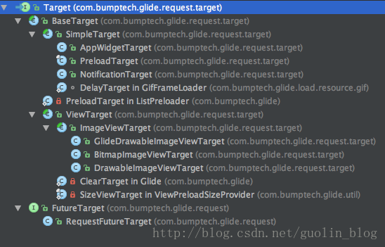
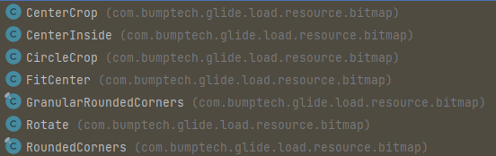
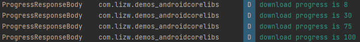
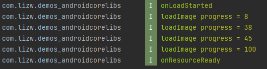

> Glide4使用：https://muyangmin.github.io/glide-docs-cn/

# 概览

GitHub：https://github.com/bumptech/glide

Glide 是一个图片加载框架，使用简单，功能全、性能高。

**Glide优点**
1、支持多种数据源，本地、网络、assets、gif等都支持。
2、生命周期集成到Glide
3、高效处理Bitmap；使用Bitmap pool复用Bitmap
4、高效缓存，支持memory和disk图片缓存，默认使用二级缓存
5、图片加载过程可以监听
6、可配置度高，自适应高

## 功能概览


基本用法、缓存机制、回调与监听、图片变换以及自定义模块。

# 快速使用

## 添加依赖

```kotlin
// https://github.com/bumptech/glide
implementation 'com.github.bumptech.glide:glide:4.16.0'
```

添加权限

```kotlin
<uses-permission android:name="android.permission.INTERNET" />
```

## 加载图片

一张测试用的图片：http://cn.bing.com/az/hprichbg/rb/Dongdaemun_ZH-CN10736487148_1920x1080.jpg

一行核心代码就可以完成图片的加载与展示：

```kotlin
Glide.with(this).load(url).into(ivBg);
```
## 示例

**Activity**

```kotlin
public class MainActivity extends AppCompatActivity {

    ImageView imageView;

    @Override
    protected void onCreate(Bundle savedInstanceState) {
        super.onCreate(savedInstanceState);
        setContentView(R.layout.activity_main);
        imageView = (ImageView) findViewById(R.id.image_view);
    }

    public void loadImage(View view) {
        String url = "http://cn.bing.com/az/hprichbg/rb/Dongdaemun_ZH-CN10736487148_1920x1080.jpg";
        Glide.with(this).load(url).into(imageView);
    }

}
```

**activity_main.xml**

```kotlin
<?xml version="1.0" encoding="utf-8"?>
<LinearLayout xmlns:android="http://schemas.android.com/apk/res/android"
    android:layout_width="match_parent"
    android:layout_height="match_parent"
    android:orientation="vertical">

    <Button
        android:layout_width="wrap_content"
        android:layout_height="wrap_content"
        android:text="Load Image"
        android:onClick="loadImage"
        />

    <ImageView
        android:id="@+id/image_view"
        android:layout_width="match_parent"
        android:layout_height="match_parent" />

</LinearLayout>
```

这样图片就加载完成了。

Glide最基本的使用方式，就是关键的三步：先with()，再load()，最后into()。

# 核心方法

## Glide.with()

创建一个加载图片的实例。with()方法可以接收Context、Activity、Fragment、View等类型的参数。

```dart
        .with(Context context)// 绑定Context
        .with(Activity activity);// 绑定Activity
        .with(FragmentActivity activity);// 绑定FragmentActivity
        .with(Fragment fragment);// 绑定Fragment
```

with() 方法传入的实例会决定Glide加载图片的生命周期：

- 如果传入的是Activity或者Fragment实例，那么当这个Activity或Fragment销毁时，图片加载也会停止。
- 如果传入的是ApplicationContext，那么只有当应用程序被杀掉的时候，图片加载才会停止。

## load()

指定要加载的图片资源，可以来自网络、本地、应用、二进制流、Uri对象等。

load 重载方法使用：

```kotlin
// 加载本地图片
File file = new File(getExternalCacheDir() + "/image.jpg");
Glide.with(this).load(file).into(imageView);

// 加载应用资源
int resource = R.drawable.image;
Glide.with(this).load(resource).into(imageView);

// 加载二进制流
byte[] image = getImageBytes();
Glide.with(this).load(image).into(imageView);

// 加载Uri对象
Uri imageUri = getImageUri();
Glide.with(this).load(imageUri).into(imageView);
```

## into()

让图片显示到指定控件。into()方法不仅仅是只能接收ImageView类型的参数，还支持很多更丰富的用法，后面会详述。

# 功能列表

## 占位图（加载占位图/异常占位图）

即在加载中以及加载失败时显示的图片

```kotlin
Glide.with(MainActivity.this).load(url)
				// 加载占位图
        .placeholder(R.mipmap.ic_loading)
				// 异常占位图
        .error(R.drawable.error)
        .into(ivBg);
```

由于 Glide 具有缓存机制，所以二次加载图片时，占位图可能来不及显示。

## 缓存

- 设置磁盘缓存策略

```kotlin
Glide.with(this)
    .load(imageUrl)
    .diskCacheStrategy(DiskCacheStrategy.ALL)
    .into(imageView);

// 缓存参数说明
// DiskCacheStrategy.NONE：不缓存任何图片，即禁用磁盘缓存
// DiskCacheStrategy.ALL ：缓存原始图片 & 转换后的图片（默认）
// DiskCacheStrategy.SOURCE：只缓存原始图片（原来的全分辨率的图像，即不缓存转换后的图片）
// DiskCacheStrategy.RESULT：只缓存转换后的图片（即最终的图像：降低分辨率后 / 或者转换后 ，不缓存原始图片
```

有一种情况，同一个url，服务端对应的图片改了，此时，如果有缓存，那就和预期不符了。下面是禁用缓存的方法。

```kotlin
Glide.with(this)
     .load(url)
     .placeholder(R.drawable.loading)
     .diskCacheStrategy(DiskCacheStrategy.NONE)
     .into(imageView);
```

- 设置跳过内存缓存

```kotlin
Glide
  .with(this)
.load(imageUrl)
.skipMemoryCache(true)
.into(imageView);
// 设置跳过内存缓存
// 这意味着 Glide 将不会把这张图片放到内存缓存中去
// 只会影响内存缓存，Glide 仍然会利用磁盘缓存来避免重复的网络请求。
```

- 清理缓存

  ```kotlin
  // 清理磁盘缓存 需要在子线程中执行
  Glide.get(this).clearDiskCache();
  // 清理内存缓存 可以在UI主线程中进行
  Glide.get(this).clearMemory();
  ```

- 增加MemoryCache

  ```kotlin
  // 增加Glide的最大内存使用量50%
  Glide.get(context).setMemoryCategory(MemoryCategory.HIGH);  
    
  // 减少Glide的最大内存使用量50%
  Glide.get(context).setMemoryCategory(MemoryCategory.LOW);
  ```

## 指定图片大小

> 我们平时在加载图片的时候很容易会造成内存浪费。什么叫内存浪费呢？比如说一张图片的尺寸是1000 * 1000像素，但是我们界面上的ImageView可能只有200 * 200像素，这个时候如果不对图片进行任何压缩就直接读取到内存中，这就属于内存浪费了，因为程序中根本就用不到这么高像素的图片。
>
> [Android高效加载大图、多图解决方案，有效避免程序OOM](https://blog.csdn.net/guolin_blog/article/details/9316683)

Glide 默认是根据 ImageView 的大小来决定图片大小（用到多少加载多少，可以避免内存浪费）。

可以通过override()方法指定图片大小。

```kotlin
Glide.with(this)
     .load(url)
     .placeholder(R.drawable.loading)
     .error(R.drawable.error)
     .override(100, 100)
     .into(imageView);
```

## 指定图片格式（静态/Gif）

默认情况是不需要设置的，Glide会自动判断格式。
但如果必须加载静态，可以用 asBitmap，这样如果是gif，那么会显示第一帧。

```kotlin
Glide.with(this)
     .load(url)
     .asBitmap()
     .placeholder(R.drawable.loading)
     .error(R.drawable.error)
     .into(imageView);
```

指定Gif格式，如果图片不是Gif，那么会显示error图片。

```kotlin
Glide.with(this)
     .load(url)
     .asGif()
     .placeholder(R.drawable.loading)
     .error(R.drawable.error)
     .into(imageView);
```

## 加载动画

```kotlin
Glide.with(this).load(imageUrl).animate(R.anim.item_alpha_in).into(imageView);
```

 *R.anim.item_alpha_in*

```xml
<?xml version="1.0" encoding="utf-8"?>
<set xmlns:android="http://schemas.android.com/apk/res/android">
    <alpha
        android:duration="500"
        android:fromAlpha="0.0"
        android:toAlpha="1.0"/>
</set>
```

api 提供了几个常用的动画：比如crossFade()

## 设置要加载的内容

如果需要先下载图片然后再做一些合成的功能，比如图文混排，实现如下：

```java
Glide.with(this).load(imageUrl).centerCrop().into(new SimpleTarget<GlideDrawable>() {
            @Override
            public void onResourceReady(GlideDrawable resource, GlideAnimation<? super GlideDrawable> glideAnimation) {
                imageView.setImageDrawable(resource);
            }
        });
```

## 多样式的媒体加载

```csharp
   Glide
        .with(context)
        .load(imageUrl)；
        .thumbnail(0.1f)；//设置缩略图支持：先加载缩略图 然后在加载全图
                          //传了一个 0.1f 作为参数，Glide 将会显示原始图像的10%的大小。
                          //如果原始图像有 1000x1000 像素，那么缩略图将会有 100x100 像素。
        .asBitmap()//显示gif静态图片 
        .asGif();//显示gif动态图片
        .into(imageView)；
```

## 设置动态转换

```kotlin
Glide.with(this).load(imageUrl).centerCrop().into(imageView);
```

## 设置下载优先级

```kotlin
Glide.with(this).load(imageUrl).priority(Priority.NORMAL).into(imageView);
```

# 回调和监听功能

## 自定义Target功能

使用 into() 方法时，通过自定义 Target 可以更自由地控制Glide的回调。

下面是 Glide 中Target的继承结构图：



如果自定义 Target，通常是基于 SimpleTarget 或 ViewTarget。

### 示例：基于 CustomTarget

使用它可以获取到加载完成的图片，而不像 into(ImageView) 直接在 ImageView 上显示出来。

```kotlin
        Glide.with(this)
            .load(url)
            .into(object : CustomTarget<Drawable>() {
                override fun onResourceReady(
                    resource: Drawable,
                    transition: Transition<in Drawable>?
                ) {
                    binding.imageView.setImageDrawable(resource)
                }

                override fun onLoadCleared(placeholder: Drawable?) {
                    // Remove the Drawable provided in onResourceReady from any Views and ensure
                    // no references to it remain.
                }
            })
```

泛型是Drawable，在onResourceReady()中，可以获取到Glide加载出来的图片Drawable，有了这个对象后可以使用它进行任意的逻辑操作。

泛型还可以指定为Bitmap。

```kotlin
        Glide.with(this)
			// 需要先调用这一行才可以
            .asBitmap()
            .load(url)
            .into(object : CustomTarget<Bitmap>() {
                override fun onResourceReady(resource: Bitmap, transition: Transition<in Bitmap>?) {
                    binding.imageView.setImageBitmap(resource)
                }

                override fun onLoadCleared(placeholder: Drawable?) {
                }
            })
```

**基于此，还能实现图片下载功能，将保存逻辑放到 onResourceReady 中即可。**

## preload()

Glide加载图片会自动判断该图片是否已经有缓存了，如果有的话就直接从缓存中读取，没有的话再从网络去下载。

作用：如果希望**提前对图片进行预加载**，等真正需要加载图片的时候就直接从缓存中读取，可以使用preload()。

preload()方法有两个方法重载，一个不带参数，表示将会加载图片的原始尺寸，另一个可以通过参数指定加载图片的宽和高。

```kotlin
Glide.with(this)
     .load(url)
     .diskCacheStrategy(DiskCacheStrategy.SOURCE)
     .preload();
```

注意，如果使用了preload()方法，最好将diskCacheStrategy的缓存策略指定成DiskCacheStrategy.SOURCE。因为**preload()方法默认是预加载的原始图片大小**，而into()默认会根据ImageView控件的大小来动态决定加载图片的大小。因此，如果不将diskCacheStrategy的缓存策略指定成DiskCacheStrategy.SOURCE，很容易造成在预加载完成之后再使用into()加载图片，却仍然要从网络上去请求图片这种现象。

调用了预加载之后，再去加载这张图片就会非常快了，因为Glide会直接从缓存当中去读取图片并显示出来：

```kotlin
Glide.with(this)
     .load(url)
     .diskCacheStrategy(DiskCacheStrategy.SOURCE)
     .into(imageView);
```

注意，这里仍然需要使用diskCacheStrategy()方法将硬盘缓存策略指定成DiskCacheStrategy.SOURCE，以保证Glide一定会去读取刚才预加载的图片缓存。

## downloadOnly()

下载一个远程文件到缓存然后创建文件路径：

```kotlin
Glide.with(fragment).downloadOnly()
// or if you have the url already:
Glide.with(fragment).download(url);
```

## listener()

listener()是结合into()一起使用的，也可以结合preload()一起使用。最基本的用法如下所示：

```kotlin
private fun testListener() {
        val url = "http://cn.bing.com/az/hprichbg/rb/TOAD_ZH-CN7336795473_1920x1080.jpg"
        Glide.with(this)
            .load(url)
            .listener(object : RequestListener<Drawable> {
                override fun onLoadFailed(
                    e: GlideException?,
                    model: Any?,
                    target: Target<Drawable>,
                    isFirstResource: Boolean
                ): Boolean {
                    Log.i(TAG, "listener, onLoadFailed")
                    return false
                }

                override fun onResourceReady(
                    resource: Drawable,
                    model: Any,
                    target: Target<Drawable>?,
                    dataSource: DataSource,
                    isFirstResource: Boolean
                ): Boolean {
                    Log.i(TAG, "listener, onResourceReady")
                    return false
                }
            })
            .into(binding.imageView)
    }
```

onResourceReady()和onException()的返回值，false表示这个事件没有被处理，还会继续向下传递，true表示这个事件已经被处理掉了，从而不会再继续向下传递。举个例子，如果在RequestListener的onResourceReady()方法中返回了true，那么就不会再回调Target的onResourceReady()方法了。

# 自定义模块功能

自定义模块功能支持开发者更改Glide的某些默认配置项。

## 更改Glide配置

Glide 的配置项有：

- setMemoryCache()，用于配置Glide的内存缓存策略，默认配置是LruResourceCache。
- setBitmapPool()，用于配置Glide的Bitmap缓存池，默认配置是LruBitmapPool。
- setDiskCache()，用于配置Glide的硬盘缓存策略，默认配置是InternalCacheDiskCacheFactory。
- setDiskCacheService()，用于配置Glide读取缓存中图片的异步执行器，默认配置是FifoPriorityThreadPoolExecutor，也就是先入先出原则。
- setResizeService()，用于配置Glide读取非缓存中图片的异步执行器，默认配置也是FifoPriorityThreadPoolExecutor。
- setDecodeFormat()，用于配置Glide加载图片的解码模式，默认配置是RGB_565。

Glide的这些默认配置都非常科学且合理，使用的缓存算法也都是效率极高的，因此在绝大多数情况下我们并不需要去修改这些默认配置。

但是总有某些情况下，默认的配置可能将无法满足需求，这个时候就需要修改默认配置了。

### 基本用法

自定义一个继承自AppGlideModule的类，并用注解 `@GlideModule` 标记。在 registerComponents 方法中注册自定义的配置项，具体操作看示例。

```kotlin
@GlideModule
class GlideOkHttpModule : AppGlideModule() {
    
    override fun registerComponents(context: Context, glide: Glide, registry: Registry) {

    }
}
```

## 替换Glide组件

### Glide中的组件

```kotlin
public class Glide {
Glide(Engine engine, MemoryCache memoryCache, BitmapPool bitmapPool, Context context, DecodeFormat decodeFormat) {
    ...

    register(File.class, ParcelFileDescriptor.class, new FileDescriptorFileLoader.Factory());
    register(File.class, InputStream.class, new StreamFileLoader.Factory());
    register(int.class, ParcelFileDescriptor.class, new FileDescriptorResourceLoader.Factory());
    register(int.class, InputStream.class, new StreamResourceLoader.Factory());
    register(Integer.class, ParcelFileDescriptor.class, new FileDescriptorResourceLoader.Factory());
    register(Integer.class, InputStream.class, new StreamResourceLoader.Factory());
    register(String.class, ParcelFileDescriptor.class, new FileDescriptorStringLoader.Factory());
    register(String.class, InputStream.class, new StreamStringLoader.Factory());
    register(Uri.class, ParcelFileDescriptor.class, new FileDescriptorUriLoader.Factory());
    register(Uri.class, InputStream.class, new StreamUriLoader.Factory());
    register(URL.class, InputStream.class, new StreamUrlLoader.Factory());
    register(GlideUrl.class, InputStream.class, new HttpUrlGlideUrlLoader.Factory());
    register(byte[].class, InputStream.class, new StreamByteArrayLoader.Factory());

    ...
}
}
```

都是以调用register()方法的方式来注册一个组件，register()方法中传入的参数表示Glide支持使用哪种参数类型来加载图片，以及如何去处理这种类型的图片加载。

register(GlideUrl.class, InputStream.class, new HttpUrlGlideUrlLoader.Factory());

表示可以使用Glide.with(context).load(new GlideUrl("url...")).into(imageView)的方式来加载图片，HttpUrlGlideUrlLoader.Factory是负责处理具体的网络通讯逻辑。

如果想要将Glide的HTTP通讯组件替换成OkHttp，需要在自定义模块中重新注册一个GlideUrl类型的组件。

使用Glide加载图片时，大多数情况下都是直接将图片的URL字符串传入到load()方法当中的，很少会将它封装成GlideUrl对象之后再传入到load()方法当中，那为什么只需要重新注册一个GlideUrl类型的组件，而不需要去重新注册一个String类型的组件呢？因为load(String)方法只是Glide提供的一种简易的API封装而已，它的底层仍然还是调用的GlideUrl组件，因此在替换组件的时候只需要直接替换最底层的。

### 示例：配置OkHttp请求网络

Glide默认使用的是基于原生HttpURLConnection的HTTP通讯组件，但是网络请求用OkHttp的比较多。

```kotlin
//Glide库
implementation 'com.github.bumptech.glide:glide:4.13160'

// kotlin项目先引入plugin，然后是用kapt引入，切记，不然可能导致无法生成自定义GlideModule的实现类
plugins {
    id 'kotlin-kapt'
}
kapt 'com.github.bumptech.glide:compiler:4.16.0'

// Glide集成OkHttp时需要使用的库，库已经将需要适配Okhhtp的大部分代码封装
implementation "com.github.bumptech.glide:okhttp3-integration:4.16.0"

// 提供 Log 拦截器实现类。HttpLoggingInterceptor() 
implementation "com.squareup.okhttp3:logging-interceptor:3.14.9"
```

实现类：GlideOkHttpModule

```kotlin
@GlideModule
class GlideOkHttpModule : AppGlideModule() {
    
    override fun registerComponents(context: Context, glide: Glide, registry: Registry) {
        val httpLoggingInterceptor = HttpLoggingInterceptor()
        httpLoggingInterceptor.setLevel(HttpLoggingInterceptor.Level.BODY)
        
        Log.i(TAG, "registerComponents: ")
        val client: OkHttpClient = OkHttpClient.Builder()
                .retryOnConnectionFailure(true)
                .addInterceptor(httpLoggingInterceptor)
                .connectTimeout(6, TimeUnit.SECONDS)
                .build()
        
        registry.replace(GlideUrl::class.java, InputStream::class.java, OkHttpUrlLoader.Factory(client))
    }
}
```

# 图片变换功能

图片变换是指，Glide从加载了原始图片到最终展示给用户之前，会进行了一些变换处理，从而能够实现一些更加丰富的图片效果，如图片圆角化、圆形化、模糊化等。

> 实际工作中，图片功能，需要结合设备多加验证，不同版本的Glide的变换处理操作不同，导致显示效果有差异，通常都用最新版的Glide，然后再进行适配或问题处理。这是我用郭神的图片变化功能的例子时发现的，他举的例子在最新版本下的表现和他当时遇到的情况不一样了。

## 基本用法

### 内置图片变换操作

内置的变换操作继承自 BitmapTransformation，如下：



```kotlin
Glide.with(this)
     .load(url)
     .centerCrop()
     .into(imageView);

Glide.with(this)
     .load(url)
     .fitCenter()
     .into(imageView);
```

#### CenterCrop方法

- **作用**：`CenterCrop`方法是将图片按比例缩放到足以填充ImageView的尺寸，但可能会导致图片的某些部分被裁剪，以确保图片的中心部分完全显示在ImageView中。
- 特点
  - 适用于希望图片的中心部分完全显示在ImageView中的场景。
  - 可能会导致图片的顶部和/或底部，以及/或左侧和/或右侧的部分被裁剪。
- **示例**：如果有一个正方形的ImageView和一个长方形的图片，使用`CenterCrop`后，图片将被缩放并裁剪成正方形，以确保图片的中心部分完全显示在ImageView中。

#### FitCenter方法

- **作用**：`FitCenter`方法是将图片缩放到小于等于ImageView的尺寸，确保图片完全显示在ImageView中，但ImageView可能不会完全填满。
- 特点
  - 适用于希望图片完全显示在ImageView中，即使这意味着ImageView的某些部分（如顶部和/或底部，以及/或左侧和/或右侧）将是空的场景。
  - 不会裁剪图片，但可能会导致ImageView的某些部分没有图片内容。
- **示例**：如果有一个正方形的ImageView和一个长方形的图片，使用`FitCenter`后，图片将被缩放到适合在ImageView中完全显示的大小，但ImageView的顶部和/或底部可能会是空的。

> 不论在布局文件中如何设置ImageView控件的`android:scaleType`值，只要Glide执行了CenterCrop() 或 FitCenter()，就会以Glide的设置为准。

centerCrop()和fitCenter()方法是对transform()方法进行了一层封装，自定义图片变换操作就是基于transform()方法。

### 自定义图片变换操作

可以通过transform()方法添加图片变换操作，并传入参数【想要执行的图片变换操作】，如下所示：

```kotlin
Glide.with(this)
     .load(url)
     .transform(...)
     .into(imageView);
```

Glide定制图片变换的大致流程是：开发者可以获取到原始的图片，然后对图片进行变换，再将变换完成后的图片返回给Glide，最终由Glide将图片显示出来。

理论上，在对图片进行变换这个步骤中，开发者可以进行任何的操作，包括**圆角化、圆形化、黑白化、模糊化**等等，甚至可以将原图片替换成另一张图片。

**自定义图片变换功能步骤**：自定义图片变换功能的实现逻辑比较固定，就是自定义一个继承自BitmapTransformation的类，重写transform()方法，并在方法中实现具体的图片变换逻辑。

#### 示例：图片变换操作示例代码

这个例子模板是Glide提供的，CenterCrop 和 FitCenter 等都是同样的写法。

```kotlin
class CircleCropTransform : BitmapTransformation() {
    companion object {
        private val ID: String =
            "com.lizw.core_apis.thirdpartlibs.glide.transform.CircleCropTransform"
        private val ID_BYTES = ID.toByteArray(
            Charset.forName("UTF-8")
        )
    }

    override fun transform(
        pool: BitmapPool,
        toTransform: Bitmap,
        outWidth: Int,
        outHeight: Int
    ): Bitmap {
        if (toTransform.width == outWidth && toTransform.height == outHeight) {
            return toTransform;
        }
        return Bitmap.createScaledBitmap(toTransform, outWidth, outHeight, true);
    }

    override fun updateDiskCacheKey(messageDigest: MessageDigest) {
        messageDigest.update(ID_BYTES)
    }

    override fun equals(other: Any?): Boolean {
        return other is CircleCropTransform
    }

    override fun hashCode(): Int {
        return ID.hashCode()
    }
}
```

ID使用当前类的完整类名。

> 注意：继承BitmapTransformation有一个限制——只能对静态图进行图片变换。这已经足够覆盖日常95%以上的开发需求了。如果有特殊的需求要对GIF图进行图片变换，那就得去实现Transformation接口了。

#### 示例：对图片进行圆形化变换

图片圆形化的功能非常常见，比如用户的头像进行圆形化变换。

```kotlin
class CircleCropTransform : BitmapTransformation() {
    companion object {
        private val ID: String =
            "com.lizw.core_apis.thirdpartlibs.glide.transform.CircleCropTransform"
        private val ID_BYTES = ID.toByteArray(Charset.forName("UTF-8"))
    }

    override fun transform(
        pool: BitmapPool, toTransform: Bitmap, outWidth: Int, outHeight: Int
    ): Bitmap {
        if (toTransform.width == outWidth && toTransform.height == outHeight) {
            return toTransform;
        }

        val size = min(toTransform.width, toTransform.height)

        val x = (toTransform.width - size) / 2
        val y = (toTransform.height - size) / 2

        val squaredBitmap = Bitmap.createBitmap(toTransform, x, y, size, size)

        val result = pool[size, size, Bitmap.Config.ARGB_8888]

        val canvas = Canvas(result)
        val paint = Paint()
        paint.isAntiAlias = true
        paint.setShader(BitmapShader(squaredBitmap, Shader.TileMode.CLAMP, Shader.TileMode.CLAMP))
        canvas.drawCircle(size / 2f, size / 2f, size / 2f, paint)
        
        return result
    }

    override fun updateDiskCacheKey(messageDigest: MessageDigest) {
        messageDigest.update(ID_BYTES)
    }

    override fun equals(other: Any?): Boolean {
        return other is CircleCropTransform
    }

    override fun hashCode(): Int {
        return ID.hashCode()
    }
}
```


1. 先算出原图宽度和高度中较小的值，对图片进行圆形化变换要以较小的值作为直径来进行裁剪。
2. 从Bitmap缓存池中获取一个Bitmap对象来进行重用，如果没有可重用的Bitmap对象就创建一个。
3. 绘制圆形图片

使用方法：把这个自定义图片变换的实例传入到transform()方法中即可：

```kotlin
Glide.with(this)
     .load(url)
     .transform(CircleCropTransform())
     .into(imageView);
```

### 更多图片变换功能

Glide的图片变换开源库 glide-transformations，实现了很多通用的图片变换效果，如**裁剪变换、颜色变换、模糊变换**等等。

glide-transformations的项目主页地址是 https://github.com/wasabeef/glide-transformations 。

#### 添加依赖

在app/build.gradle文件当中添加如下依赖：

```kotlin
dependencies {
    implementation 'jp.wasabeef:glide-transformations:4.3.0'
}
```

#### 示例：模糊效果

可以使用glide-transformations库中的BlurTransformation这个类：

```kotlin
        Glide.with(this).load(url)
            .apply(RequestOptions.bitmapTransform(BlurTransformation(25, 3)))
            .into(imageView)
```


#### 示例：黑白化图片

使用GrayscaleTransformation这个类：

```kotlin
Glide.with(this).load(url)
     .apply(RequestOptions.bitmapTransform(GrayscaleTransformation()))
     .into(imageView)
```


#### 示例：组合变换

同时执行模糊化和黑白化的变换：

```kotlin
val multi = MultiTransformation(
    BlurTransformation(25),
    GrayscaleTransformation()
)
Glide.with(this).load(url)
     .apply(RequestOptions.bitmapTransform(multi))
     .into(imageView)
```


# 实现带进度的Glide图片加载功能

虽说Glide已经十分强大了，但是有一个功能却长期以来都不支持，那就是**监听下载进度**功能。

如果这张图片很小的话，那么问题也不大，反正很快就会被加载出来。但如果这是一张比较大的GIF图，用户耐心等了很久结果图片还没显示出来，这个时候你就会觉得下载进度功能是十分有必要的了。

## 添加依赖

参照【快速使用】。

## 替换通讯组件

替换网络请求库为OkHttp，参照【自定义模块功能】。

## 实现下载进度监听

通讯组件替换成OkHttp之后，依靠OkHttp的拦截器机制实现下载进度监听。

实现方案：向OkHttp中添加一个自定义的拦截器，在拦截器中加入计算下载进度的逻辑。

1. 新建进度监听拦截器
2. 添加拦截器到OkHttp
3. 拦截器中添加下载进度监听逻辑
4. 实现进度监听类
5. 使用进度监听类

**创建拦截器：**

```kotlin
class ProgressInterceptor : Interceptor {
    @Throws(IOException::class)
    override fun intercept(chain: Chain): Response {
        val request: Request = chain.request()
        return chain.proceed(request)
    }
}
```

**添加拦截器到OkHttp：**

```kotlin
@GlideModule
class GlideOkHttpModule : AppGlideModule() {

    override fun registerComponents(context: Context, glide: Glide, registry: Registry) {
        val client: OkHttpClient = OkHttpClient.Builder()
            .addInterceptor(ProgressInterceptor())
            .build()
        registry.replace(
            GlideUrl::class.java, InputStream::class.java, OkHttpUrlLoader.Factory(client)
        )
    }
}
```

**拦截器中添加下载进度监听逻辑**

首先新建一个ProgressListener接口，用于作为进度监听回调的工具，如下所示：

```kotlin
public interface ProgressListener {
    void onProgress(int progress);
}
```

们在ProgressInterceptor中加入注册下载监听和取消注册下载监听的方法。修改ProgressInterceptor中的代码，如下所示：

```kotlin
class ProgressInterceptor : Interceptor {
    companion object{
        val progressListeners: MutableMap<String, ProgressListener> = HashMap()
        fun addListener(url: String, listener: ProgressListener) {
            progressListeners[url] = listener
        }

        fun removeListener(url: String) {
            progressListeners.remove(url)
        }
    }

    @Throws(IOException::class)
    override fun intercept(chain: Chain): Response {
        val request: Request = chain.request()
        return chain.proceed(request)
    }
}
```

使用Map来保存注册的监听器，键是一个URL地址。同时加载很多张图片时，可以区分出每个下载进度的回调是对应哪个图片URL的。

## 实现进度监听类

新建一个继承自OkHttp的ResponseBody的类（ProgressResponseBody），在这个类中编写具体的监听下载进度的逻辑：

```kotlin
class ProgressResponseBody(url: String, responseBody: ResponseBody) : ResponseBody() {
    companion object {
        private const val TAG = "ProgressResponseBody"
    }
    
    private var bufferedSource: BufferedSource? = null
    private val responseBody: ResponseBody
    private var progressListener: ProgressListener?

    init {
        this.responseBody = responseBody
        progressListener = ProgressInterceptor.progressListeners[url]
    }

    override fun contentType(): MediaType? {
        return responseBody.contentType()
    }

    override fun contentLength(): Long {
        return responseBody.contentLength()
    }

    override fun source(): BufferedSource {
        if (bufferedSource == null) {
            bufferedSource = ProgressSource(responseBody.source()).buffer()
        }
        return bufferedSource!!
    }

    private inner class ProgressSource(source: Source) : ForwardingSource(source) {
        var totalBytesRead: Long = 0
        var currentProgress = 0

        @Throws(IOException::class)
        override fun read(sink: Buffer, byteCount: Long): Long {
            val bytesRead = super.read(sink, byteCount)
            val fullLength = responseBody.contentLength()
            if (bytesRead == -1L) {
                totalBytesRead = fullLength
            } else {
                totalBytesRead += bytesRead
            }
            val progress = (100f * totalBytesRead / fullLength).toInt()
            Log.d(TAG, "download progress is $progress")
            if (progressListener != null && progress != currentProgress) {
                progressListener!!.onProgress(progress)
            }
            if (progressListener != null && totalBytesRead == fullLength) {
                progressListener = null
            }
            currentProgress = progress
            return bytesRead
        }
    }
}
```

继承ResponseBody类之后需要重写contentType()、contentLength()和source()三个方法：

1. 在contentType()和contentLength()中调用传入的原始ResponseBody的contentType()和contentLength()方法即可，相当于一种委托模式。

2. 在source()方法中，加入自己的逻辑了，这里涉及到具体的下载进度计算。

   先是调用了原始ResponseBody的source()方法来去获取Source对象，然后将这个Source对象封装到了一个ProgressSource对象当中，最后再用Okio的buffer()方法封装成BufferedSource对象返回。

ProgressSource是我们自定义的继承自ForwardingSource的类。ForwardingSource是一个使用委托模式的工具，它不处理任何具体的逻辑，只是负责将传入的原始Source对象进行中转。我们使用ProgressSource继承自ForwardingSource，就可以在中转的过程中加入自己的逻辑了。

在ProgressSource中重写了read()方法，在read()方法中获取该次读取到的字节数以及下载文件的总字节数，就能算出当前的下载进度了。

## 使用进度计算类

修改ProgressInterceptor：

```kotlin
class ProgressInterceptor : Interceptor {
    companion object{
        val progressListeners: MutableMap<String, ProgressListener> = HashMap()
        fun addListener(url: String, listener: ProgressListener) {
            progressListeners[url] = listener
        }

        fun removeListener(url: String) {
            progressListeners.remove(url)
        }
    }

    @Throws(IOException::class)
    override fun intercept(chain: Chain): Response {
        val request: Request = chain.request()
        val response = chain.proceed(request)
        val body: ResponseBody = response.body ?: return response

        val url = request.url.toString()
        return response.newBuilder().body(ProgressResponseBody(url, body)).build()
    }
}
```

将Response的body替换成我们实现的ProgressResponseBody，并将新的Response对象进行返回，这样计算下载进度的逻辑就能生效了。

现在去加载任何网络上的图片，都应该可以监听到下载进度了。



## 业务代码获取进度

现在这个进度只能显示在控制台打印中，将下载进度显示到界面上。

在用到Glide的地方，加入进度监听器，用于接收加载进度回调：

```kotlin
        ProgressInterceptor.addListener(url, object : ProgressListener {
            override fun onProgress(progress: Int) {
                Log.i(TAG, "loadImage progress = $progress")
            }
        })
        Glide.with(this)
            .load(url)
            // 为了测试加载网络图片的进度，将缓存关了
            .diskCacheStrategy(DiskCacheStrategy.NONE)
            .into(object : DrawableImageViewTarget(imageView) {
                override fun onLoadStarted(placeholder: Drawable?) {
                    super.onLoadStarted(placeholder)
                    // 开始加载图片，可以在这加入开始加载的逻辑
                    // 比如显示进度条，或者打开进度弹窗
                    Log.i(TAG, "onLoadStarted")
                }

                override fun onResourceReady(
                    resource: Drawable,
                    transition: Transition<in Drawable>?
                ) {
                    super.onResourceReady(resource, transition)
                    Log.i(TAG, "onResourceReady")
                    // 图片加载完成后，可以在这里加入加载完成后的逻辑，比如更新进度条、关闭进度弹窗等
                    // 将监听移除
                    ProgressInterceptor.removeListener(url)
                }
            })
```



1. 调用了ProgressInterceptor.addListener()注册一个下载监听器，在onProgress()回调方法中更新当前的下载进度。
2. Glide的into()方法改为DrawableImageViewTarget作为参数，重写onLoadStarted()和onResourceReady()，从而监听图片的开始与完成加载，可以在此处加入业务逻辑。


不仅仅是静态图片，体积比较大的GIF图也可以成功监听到下载进度的。示例GIF图片：http://guolin.tech/test.gif。


# 应用场景

根据Glide的特点和与其他图片加载库的对比，可以得出其使用场景：

- 需要更多的内容表现形式(如Gif)；
- 更高的性能要求（缓存 & 加载速度）；


# 参考

- [郭霖：Glide最全解析](https://blog.csdn.net/guolin_blog/category_9268670.html)

  [Android图片加载框架最全解析（一），Glide的基本用法](https://guolin.blog.csdn.net/article/details/53759439)

  [Android图片加载框架最全解析（四），玩转Glide的回调与监听](https://blog.csdn.net/guolin_blog/article/details/70215985)

  [Android图片加载框架最全解析（五），Glide强大的图片变换功能](https://blog.csdn.net/guolin_blog/article/details/71524668)

  [Android图片加载框架最全解析（六），探究Glide的自定义模块功能](https://blog.csdn.net/guolin_blog/article/details/78179422)

  [Android图片加载框架最全解析（七），实现带进度的Glide图片加载功能](https://blog.csdn.net/guolin_blog/article/details/78357251)

  [Android图片加载框架最全解析（八），带你全面了解Glide 4的用法](https://blog.csdn.net/guolin_blog/article/details/78582548)

  二三两篇是原理，在另外的笔记中整理。

[Carson带你学Android：图片加载库Glide使用教程](https://www.jianshu.com/p/c3a5518b58b2)

[Glide(版本4.13.0)配置OkHttp请求网络](https://blog.csdn.net/sinat_34388320/article/details/124800403)