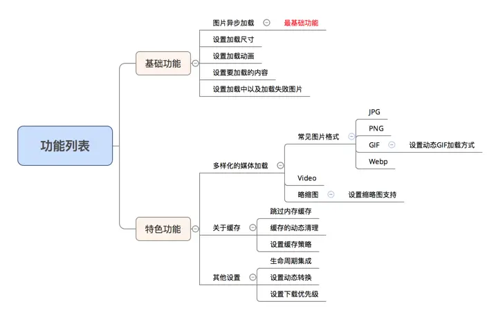
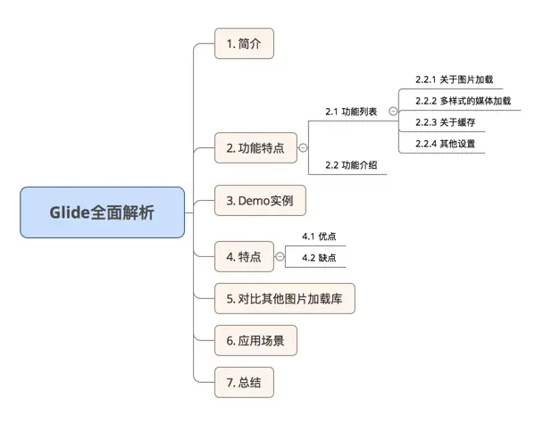

> 前言：Glide作为一个优秀的图片加载框架，它涉及到的知识点很丰富，学习其源码对于理解Android大有脾益。此篇先总结Glide的基本使用，并归纳它的优点。后续篇章将从它的优点出发，去学习其实现以及背后涉及到的原理。


# 待学

[Android图片加载框架最全解析（四），玩转Glide的回调与监听](https://blog.csdn.net/guolin_blog/article/details/70215985)


# 一、简介与优势

GitHub：https://github.com/bumptech/glide

**1、简介**
Glide 是一个图片加载框架，功能全、性能高，使用简单。

**2、Glide优点**
1、支持多种数据源，本地、网络、assets、gif等都支持。
2、生命周期集成到Glide
3、高效处理Bitmap；使用Bitmap pool复用Bitmap
4、高效缓存，支持memory和disk图片缓存，默认使用二级缓存
5、图片加载过程可以监听
6、可配置度高，自适应高

## 功能概览



# 二、基本使用

## 添加依赖

```kotlin
// https://github.com/bumptech/glide
implementation 'com.github.bumptech.glide:glide:4.16.0'
```

## 添加权限

```kotlin
<uses-permission android:name="android.permission.INTERNET" />
```

## 加载图片

一张图片


```kotlin
http://cn.bing.com/az/hprichbg/rb/Dongdaemun_ZH-CN10736487148_1920x1080.jpg
```

## 1、加载图片

加载图片的核心代码就一行，通过这行代码，可以完成图片的加载与展示。

```kotlin
Glide.with(this).load(url2).into(ivBg);
```
xml

```kotlin
<?xml version="1.0" encoding="utf-8"?>
<LinearLayout xmlns:android="http://schemas.android.com/apk/res/android"
    android:layout_width="match_parent"
    android:layout_height="match_parent"
    android:orientation="vertical">

    <Button
        android:layout_width="wrap_content"
        android:layout_height="wrap_content"
        android:text="Load Image"
        android:onClick="loadImage"
        />

    <ImageView
        android:id="@+id/image_view"
        android:layout_width="match_parent"
        android:layout_height="match_parent" />

</LinearLayout>
```

Activity 中使用

```kotlin
public class MainActivity extends AppCompatActivity {

    ImageView imageView;

    @Override
    protected void onCreate(Bundle savedInstanceState) {
        super.onCreate(savedInstanceState);
        setContentView(R.layout.activity_main);
        imageView = (ImageView) findViewById(R.id.image_view);
    }

    public void loadImage(View view) {
        String url = "http://cn.bing.com/az/hprichbg/rb/Dongdaemun_ZH-CN10736487148_1920x1080.jpg";
        Glide.with(this).load(url).into(imageView);
    }

}
```

这样图片就加载完成了。

### 拓展分析

（1）Glide.with()
用于创建一个加载图片的实例。with()方法可以接收Context、Activity、Fragment、View等类型的参数。with()方法传入的实例会决定Glide加载图片的生命周期，如果传入的是Activity或者Fragment实例，那么当这个Activity或Fragment销毁时，图片加载也会停止。如果传入的是ApplicationContext，那么只有当应用程序被杀掉的时候，图片加载才会停止。
（2）load()
用于指定要加载的图片资源，可以来自网络、本地、应用、二进制流、Uri对象等。load 重载方法使用：

```kotlin
// 加载本地图片
File file = new File(getExternalCacheDir() + "/image.jpg");
Glide.with(this).load(file).into(imageView);

// 加载应用资源
int resource = R.drawable.image;
Glide.with(this).load(resource).into(imageView);

// 加载二进制流
byte[] image = getImageBytes();
Glide.with(this).load(image).into(imageView);

// 加载Uri对象
Uri imageUri = getImageUri();
Glide.with(this).load(imageUri).into(imageView);
```

（3）into()

让图片显示到指定控件。into()方法不仅仅是只能接收ImageView类型的参数，还支持很多更丰富的用法，后面会记录。

Glide最基本的使用方式，其实就是关键的三步走：先with()，再load()，最后into()。

## 2、占位图（加载占位图/异常占位图）

占位图是指在图片的加载过程中，可以先显示一张临时的图片，等图片加载出来了再替换成要加载的图片；或者在加载失败时，显示失败图片。如下：

加载占位图用来解决网络加载时有段时间图片空白的情况。

异常占位符解决加载失败的情况。异常情况，比如 Url 错误，或者无网络。

```kotlin
Glide.with(MainActivity.this).load(url)
        .placeholder(R.mipmap.ic_loading)
        .error(R.drawable.error)
        .into(ivBg);
```

因为Glide有非常强大的缓存机制，所以二次加载图片时，占位图可能根本来不及显示。

```kotlin
Glide.with(this)
     .load(url)
     .placeholder(R.drawable.loading)
     .diskCacheStrategy(DiskCacheStrategy.NONE)
     .into(imageView);
```

传入DiskCacheStrategy.NONE参数，可以禁用掉Glide的缓存功能，以查看占位符效果。一般项目中不会禁用。

## 3、缓存

- 设置磁盘缓存策略

```csharp
Glide.with(this)
    .load(imageUrl)
    .diskCacheStrategy(DiskCacheStrategy.ALL)
    .into(imageView);

// 缓存参数说明
// DiskCacheStrategy.NONE：不缓存任何图片，即禁用磁盘缓存
// DiskCacheStrategy.ALL ：缓存原始图片 & 转换后的图片（默认）
// DiskCacheStrategy.SOURCE：只缓存原始图片（原来的全分辨率的图像，即不缓存转换后的图片）
// DiskCacheStrategy.RESULT：只缓存转换后的图片（即最终的图像：降低分辨率后 / 或者转换后 ，不缓存原始图片
```

有一种情况，同一个url，服务端对应的图片改了，此时，如果有缓存，那就和预期不符了。下面是禁用缓存的方法。

```kotlin
Glide.with(this)
     .load(url)
     .placeholder(R.drawable.loading)
     .diskCacheStrategy(DiskCacheStrategy.NONE)
     .into(imageView);
```

- 设置跳过内存缓存

```kotlin
Glide
  .with(this)
.load(imageUrl)
.skipMemoryCache(true)
.into(imageView);
//设置跳过内存缓存
//这意味着 Glide 将不会把这张图片放到内存缓存中去
//这里需要明白的是，这只是会影响内存缓存！Glide 将会仍然利用磁盘缓存来避免重复的网络请求。
```

- 清理缓存

```kotlin
Glide.get(this).clearDiskCache();//清理磁盘缓存 需要在子线程中执行
Glide.get(this).clearMemory();//清理内存缓存 可以在UI主线程中进行
```

## 4、指定图片大小

> 先了解一个概念，就是我们平时在加载图片的时候很容易会造成内存浪费。什么叫内存浪费呢？比如说一张图片的尺寸是1000 * 1000像素，但是我们界面上的ImageView可能只有200 * 200像素，这个时候如果不对图片进行任何压缩就直接读取到内存中，这就属于内存浪费了，因为程序中根本就用不到这么高像素的图片。
>
> [Android高效加载大图、多图解决方案，有效避免程序OOM](https://blog.csdn.net/guolin_blog/article/details/9316683)

使用override()方法可以指定图片大小，默认情况都是根据ImageView的大小来决定图片大小。

```kotlin
Glide.with(this)
     .load(url)
     .placeholder(R.drawable.loading)
     .error(R.drawable.error)
     .override(100, 100)
     .into(imageView);
```

Glide会自动判断ImageView的大小，用到多少加载多少，可以避免内存浪费。



## 5、指定图片格式（静态/Gif）

默认情况是不需要设置的，Glide会自动判断格式。
但是如果必须加载静态，可以用asBitmap，这样如果是gif，那么会显示第一帧。

```kotlin
Glide.with(this)
     .load(url)
     .asBitmap()
     .placeholder(R.drawable.loading)
     .error(R.drawable.error)
     .into(imageView);
```

指定Gif格式，如果图片不是Gif，那么会显示error图片。

```kotlin
Glide.with(this)
     .load(url)
     .asGif()
     .placeholder(R.drawable.loading)
     .error(R.drawable.error)
     .into(imageView);
```

## 关于图片加载

- 图片的异步加载（基础功能）

```kotlin
ImageView targetImageView = (ImageView) findViewById(R.id.ImageView);
        String Url = "http://218.192.170.132/1.jpg";

//Glide使用了流式接口的调用方式
//Glide类是核心实现类。
        Glide.with(context).load(Url).into(targetImageView);

//实现图片加载功能至少需要三个参数：
//with(Context context)
//Context对于很多Android API的调用都是必须的，这里就不多说了

//load(String imageUrl)：被加载图像的Url地址。
//大多情况下，一个字符串代表一个网络图片的URL。
                
//into(ImageView targetImageView)：图片最终要展示的地方。
                
```

- 设置加载尺寸

```css
Glide.with(this).load(imageUrl).override(800, 800).into(imageView);
```

- 设置加载中以及加载失败图片
   api里面对placeholder()、error()函数中有多态实现，用的时候可以具体的熟悉一下

```css
Glide
 .with(this)
  .load(imageUrl)
 .placeholder(R.mipmap.ic_launcher).error(R.mipmap.ic_launcher).into(imageView);
```

- 设置加载动画

```css
Glide.with(this).load(imageUrl).animate(R.anim.item_alpha_in).into(imageView);
```

api也提供了几个常用的动画：比如crossFade()
 *R.anim.item_alpha_in*

```xml
<?xml version="1.0" encoding="utf-8"?>
<set xmlns:android="http://schemas.android.com/apk/res/android">
    <alpha
        android:duration="500"
        android:fromAlpha="0.0"
        android:toAlpha="1.0"/>
</set>
```

- 设置要加载的内容
   项目中有很多需要先下载图片然后再做一些合成的功能，比如项目中出现的图文混排，该如何实现目标下

```java
Glide.with(this).load(imageUrl).centerCrop().into(new SimpleTarget<GlideDrawable>() {
            @Override
            public void onResourceReady(GlideDrawable resource, GlideAnimation<? super GlideDrawable> glideAnimation) {
                imageView.setImageDrawable(resource);
            }
        });
```

## 多样式的媒体加载

```csharp
   Glide
        .with(context)
        .load(imageUrl)；
        .thumbnail(0.1f)；//设置缩略图支持：先加载缩略图 然后在加载全图
                           //传了一个 0.1f 作为参数，Glide 将会显示原始图像的10%的大小。
                          //如果原始图像有 1000x1000 像素，那么缩略图将会有 100x100 像素。
        .asBitmap()//显示gif静态图片 
        .asGif();//显示gif动态图片
        .into(imageView)；
```


## 其他设置

- 生命周期集成
   通过设置绑定生命周期，我们可以更加高效的使用Glide提供的方式进行绑定，这样可以更好的让加载图片的请求的生命周期动态管理起来

```dart
        .with(Context context)// 绑定Context
        .with(Activity activity);// 绑定Activity
        .with(FragmentActivity activity);// 绑定FragmentActivity
        .with(Fragment fragment);// 绑定Fragment
```

> 注意：
>
> 1. 传入的context类型影响到Glide加载图片的优化程度
> 2. Glide可以监视Activity的生命周期，在Activity销毁的时候自动取消等待中的请求。但是如果你使用Application context，你就失去了这种优化效果。

- 设置动态转换

```css
Glide.with(this).load(imageUrl).centerCrop().into(imageView);
```

- 设置下载优先级

```css
Glide.with(this).load(imageUrl).priority(Priority.NORMAL).into(imageView);
```

# 配置OkHttp请求网络

```kotlin
//Glide库
implementation 'com.github.bumptech.glide:glide:4.13160'

//kotlin项目先引入plugin，然后是用kapt引入，切记，不然可能导致无法生成自定义GlideModule的实现类
plugins {
    id 'kotlin-kapt'
}
kapt 'com.github.bumptech.glide:compiler:4.16.0'

// Glide集成OkHttp时需要使用的库，库已经将需要适配Okhhtp的大部分代码封装
implementation "com.github.bumptech.glide:okhttp3-integration:4.16.0"

// 提供 Log 拦截器实现类。HttpLoggingInterceptor() 
implementation "com.squareup.okhttp3:logging-interceptor:3.14.9"
```

实现类：GlideOkHttpModule

```kotlin
@GlideModule
class GlideOkHttpModule : AppGlideModule() {
    
    override fun registerComponents(context: Context, glide: Glide, registry: Registry) {
        val httpLoggingInterceptor = HttpLoggingInterceptor()
        httpLoggingInterceptor.setLevel(HttpLoggingInterceptor.Level.BODY)
        
        Log.i(TAG, "registerComponents: ")
        val client: OkHttpClient = OkHttpClient.Builder()
                .retryOnConnectionFailure(true)
                .addInterceptor(httpLoggingInterceptor)
                .connectTimeout(6, TimeUnit.SECONDS)
                .build()
        
        registry.replace(GlideUrl::class.java, InputStream::class.java, OkHttpUrlLoader.Factory(client))
    }
}
```

参考：https://blog.csdn.net/sinat_34388320/article/details/124800403

# 3. Demo实例

**步骤1：在gradle添加依赖**

```bash
 compile 'com.github.bumptech.glide:glide:3.7.0'
```

**步骤2：添加网络权限**

```xml
<uses-permission android:name="android.permission.INTERNET"/>
```

> 步骤1和步骤2是Glide使用的前提，千万别忘了！！！！

**步骤3：在MainActivity中**

```dart
ImageView targetImageView = (ImageView) findViewById(R.id.ImageView);
        String Url = "http://218.192.170.132/1.jpg";

        Glide
                .with(this)
                .load(Url)
                .into(targetImageView);
```


# 4. 特点

#### 4.1 优点

- 多样化媒体加载
   Glide 不仅是一个图片缓存，它支持 Gif、WebP、缩略图。甚至是 Video
- 生命周期集成
   通过设置绑定生命周期，我们可以更加高效的使用Glide提供的方式进行绑定，这样可以更好的让加载图片的请求的生命周期动态管理起来
- 高效的缓存策略
   A. 支持Memory和Disk图片缓存
   B. Picasso 只会缓存原始尺寸的图片，而 Glide 缓存的是多种规格，也就意味着 Glide 会根据你 ImageView 的大小来缓存相应大小的图片尺寸

> 比如你 ImageView 大小是200*200，原图是 400*400 ，而使用 Glide 就会缓存 200*200 规格的图，而 Picasso 只会缓存 400*400 规格的。这个改进就会导致 Glide 比 Picasso 加载的速度要快，毕竟少了每次裁剪重新渲染的过程，非常灵活 & 加载速度快

C. 内存开销小
 默认的 Bitmap 格式是 RGB_565 格式，而 Picasso 默认的是 ARGB_8888 格式，这个内存开销要小一半。

> Android关于图片内存计算，共有四种，分别是：
>
> 1. ALPHA_8：每个像素占用1byte内存
> 2. ARGB_4444:每个像素占用2byte内存
> 3. ARGB_8888:每个像素占用4byte内存（默认，色彩最细腻=显示质量最高=占用的内存也最大）
> 4. RGB_565:每个像素占用2byte内存（8bit = 1byte）
>     举例说明：一个32位的PNG=ARGB_8888=1204x1024,那么占用空间是:1024x1024x(32/8) = 4,194,304kb=4M左右
>     在解析图片的时候，为了避免oom和节省内存，最好使用ARGB_4444模式（节省一半的内存空间）

#### 4.2 缺点

- 使用方法复杂
   由于Glide其功能强大，所以使用的方法非常多，其源码也相对的复杂
- 包较大


# 5. 相比其他图片加载库（Picasso & Fresco）

- 对比Picasso
   Glide 是在Picasso 基础之上进行的二次开发做了不少改进，不过这也导致包比 Picasso 大不少，不过也就不到 500k（Picasso 是100多k），用法较为复杂，不过毕竟级别还是蛮小的，影响不是很大
- 对比Fresco
   使用较Fresco简单，但性能（加载速度 & 缓存）却比不上Fresco


# 6. 应用场景

根据Glide的特点和与其他图片加载库的对比，可以得出其使用场景：

- 需要更多的内容表现形式(如Gif)；
- 更高的性能要求（缓存 & 加载速度）；


# 7. 总结


# 参考

1、[ Android图片加载框架最全解析（一），Glide的基本用法](https://guolin.blog.csdn.net/article/details/53759439)

2、https://www.jianshu.com/p/c3a5518b58b2